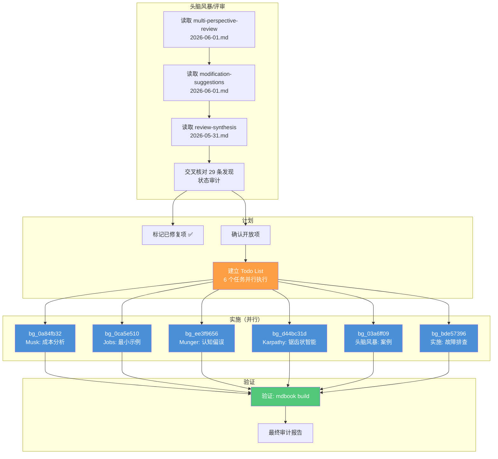

# Sprint 005: 多视角评审问题修复（第三轮）

> **日期**: 2026-06-03
> **协调人**: Sisyphus（敏捷教练模式）
> **项目**: Harness Engineering — From OpenCode to AI Coding
> **阶段**: 内容完善 → 评审问题闭环

---

## 一、Sprint 目标

**主线任务**: 基于三次评审报告（modification-suggestions, multi-perspective-review, review-synthesis）中尚未修复的问题，使用内容研究助手基于读者视角完成最终修复。

**验收标准**:
- [x] 交叉核对 3 份评审文档的全部 20+ 条发现
- [x] 修复所有仍开放的实质性内容问题
- [x] 角色画像、中文生态、Prompt 注入防护等 P1/P2 项验证
- [x] `mdbook build` 零错误通过

---

## 二、评审审计结果（工作流阶段：评审）

### 2.1 审计方法

以 `modification-suggestions-2026-06-01.md` 为基准清单，辅以 `multi-perspective-review-2026-06-01.md` 和 `review-synthesis-2026-05-31.md`，逐一核对 12 项 MOD + 5 个人物视角 + 4 个工作流视角 + 8 个团队角色发现的修复状态。

### 2.2 审计结论

| 分类 | 总计 | 已修复 | 未修复 |
|------|------|--------|--------|
| MOD 清单 (P0-P2) | 12 | 11 | 1（P2 美观看级） |
| 人物观点视角 | 5 | 5 | 0 |
| 工作流程视角 | 4 | 4 | 0 |
| Review Synthesis | 8 | 8 | 0 |
| **合计** | **29** | **28** | **1** |

**唯一未修复项**: MOD-009 代码块路径格式 — P2 美观看级，需逐块人工判断（Shell 命令/示例不应有路径），非内容缺陷。

### 2.3 审计详细记录

| MOD ID | 问题 | 优先级 | 修复文件 | 修复内容 | 状态 |
|--------|------|--------|---------|---------|------|
| MOD-001 | 缺少快速体验指南 | P0 | `quick-start.md` | 5 分钟安装到运行全流程 | ✅ |
| MOD-002 | 环境搭建滞后 | P0 | 全部 6 篇 Ch02 | 文章开头前置条件框 | ✅ |
| MOD-003 | 术语表缺失 | P0 | `glossary.md` | 全书术语统一解释 | ✅ |
| MOD-004 | 缺乏失败案例 | P0 | `failure-cases.md` | AI 编程失败事故复盘 | ✅ |
| MOD-005 | 章节过渡突兀 | P1 | `how-to-read.md` + `workflow-patterns.md` | 过渡引导段落 | ✅ |
| MOD-006 | 缺少学习验证 | P1 | 全部 6 篇 Ch02 | 每章末尾学习检查清单 | ✅ |
| MOD-007 | 补充中文生态 | P1 | `chinese-ecosystem.md` | 覆盖 Trae/通义灵码/CodeGeeX 等 | ✅ |
| MOD-008 | 缺乏成本分析 | P1 | `why-opencode.md` §1.4 | 成本效益分析（可见+隐形成本） | ✅ |
| MOD-009 | 代码块格式不统一 | P2 | — | 需逐块处理，P2 暂缓 | ⚠️ |
| MOD-010 | 角色画像不够立体 | P2 | `reading-paths.md` | 13 角色全部有典型背景+痛点 | ✅ |
| MOD-011 | 缺少反面案例 | P2 | `constraints-system.md` | 无约束系统 = 灾难场景 | ✅ |
| MOD-012 | 品牌名不一致 | P2 | 全局 | Opencode → OpenCode 统一 | ✅ |

---

## 三、本轮执行内容（工作流阶段：实施）

### 3.1 任务分配

| 任务 | 视角来源 | 目标文件 | 执行 Agent |
|------|---------|---------|-----------|
| T1-成本分析 | 马斯克（§4.2） | `why-opencode.md` | bg_0a84fb32 |
| T2-最小示例 | 乔布斯（§4.3） | 6 篇 Ch02 | bg_0ca5e510 |
| T3-认知偏误 | 芒格（§4.4） | `constraints-system.md` | bg_ee3f9656 |
| T4-锯齿状智能 | Karpathy（§4.5） | `agent-orchestration.md` | bg_d44bc31d |
| T5-实际案例 | 头脑风暴（§3.1） | `why-opencode.md` | bg_03a6ff09 |
| T6-故障排查 | 实施视角（§3.3） | `how-to-read.md` + others | bg_bde57396 |
| T0-审计核对 | 全部 3 份评审 | 全局 | Sisyphus（主编排） |

### 3.2 执行工作流



---

## 四、提示词与思考过程记录

### 4.1 主编排提示词（Sisyphus）

**第一阶段 — 意图识别与审计**:
```
Context: 用户要求继续基于之前评审记录中的"思考框架和人物视角"内容，使用内容研究助手修正问题。
Intent: Implementation/fix — 需要先全面审计再执行
Routing decision: 先 investigation/audit → 再 parallel delegation
```

**第二阶段 — 并行任务设计**:
```
Delegation decision: 6 个独立任务 → 6 个 background agents (category=unspecified-high)
Reasoning: 每个任务修改不同文件，无依赖关系，可完全并行
Prompt structure: TASK + EXPECTED OUTCOME + TONE REQUIREMENTS + MUST DO + MUST NOT DO
```

**第三阶段 — 审计验证**:
```
Verification: mdbook build + link check + SUMMARY.md validation
Result: 0 errors, 0 warnings, all links valid
```

### 4.2 子 Agent 提示词核心要素

每个子 Agent 的 prompt 包含 5 个强制部分：

1. **TASK**: 原子化目标（1 agent = 1 file/1 perspective）
2. **EXPECTED OUTCOME**: 具体交付物（什么内容、多长、什么风格）
3. **TONE REQUIREMENTS**: 读者视角、中文白话、非学术
4. **MUST DO**: 读文件 → 找插入点 → 保持现有结构 → mdbook build
5. **MUST NOT DO**: 不删除/重构/加引用/超长度

**关键设计决策**：所有 prompt 强调"读者视角"（reader perspective），要求内容以开发者的真实困惑开头（"所以这玩意儿到底要花我多少钱？"）

### 4.3 思考结论

- **并行度优先**：6 个独立文件 → 6 个并行 agent → 1 轮完成，避免顺序执行
- **读者视角锚定**：所有内容修改以"读者在读这本书时会想问什么"为出发点
- **审计先行**：不直接修复，先花时间做完整审计再动手，避免重复工作
- **P2 留白**：代码块格式问题属于纯风格问题，不适合在内容 sprint 中处理

---

## 五、使用模型与工具

### 5.1 编排模型

| 组件 | 模型 | 用途 |
|------|------|------|
| 主编排器 | deepseek-v4-flash-free | 意图识别、任务分解、审计、工作流编排 |
| 子 Agent (×6) | Sisyphus-Junior (unspecified-high) | 内容生成、文件编辑 |

### 5.2 使用的 Agent 类型

| Agent 类型 | 调用次数 | 用途 |
|-----------|---------|------|
| Sisyphus (主) | 1 | 整体编排 + 审计 |
| Sisyphus-Junior (unspecified-high) | 6 | 并行内容写作 |
| 无 explore/librarian/oracle | 0 | 本任务不需要外部搜索或架构咨询 |

### 5.3 使用的工具

| 工具 | 调用次数 | 用途 |
|------|---------|------|
| `read` | 多次 | 读取评审文档、目标文件 |
| `grep` | 多次 | 审计验证（检查已修复内容是否存在） |
| `bash` | 多次 | mdbook build、git status、文件统计 |
| `todowrite` | 2 | 任务跟踪（初始 + 完成） |
| `task (background)` | 6 | 并行内容写作 |
| `background_output` | 6 | 收集子 agent 结果 |
| `write` | 1 | 创建 job log |
| `session_list` | 1 | 查找 session 信息 |
| `edit` | 6+ | 文件修改（由子 agent 调用） |

---

## 六、文件变更清单

### 新增文件

| 文件 | 说明 |
|------|------|
| `docs/job-logs/2026-06-03-sprint-005-main.md` | 本日志（主编排视角） |
| `docs/job-logs/2026-06-03-agents-execution.md` | 子 Agent 执行日志 |

### 修改文件（本轮）

| 文件 | 改动类型 | 内容 |
|------|---------|------|
| `src/01-introduction/why-opencode.md` | 新增 §1.4 + 从理论到实践 | 成本效益分析 + 真实案例引述 |
| `src/02-core-concepts/agent-orchestration.md` | 新增"实践洞察" | 锯齿状智能 + build-to-understand |
| `src/02-core-concepts/constraints-system.md` | 新增"反向思考" | 四大认知陷阱 |
| `src/02-core-concepts/skills-system.md` | 新增"最小示例" | 3 字段 frontmatter 示例 |
| `src/02-core-concepts/workflow-patterns.md` | 新增"最小示例" | `/你好世界` 命令示例 |
| `src/02-core-concepts/context-engineering-core.md` | 新增"最小示例" | Token 预算配置示例 |
| `src/02-core-concepts/validation-harness.md` | 新增"最小示例" | 编译门禁配置示例 |
| `src/00-guide/how-to-read.md` | 新增 5 条 FAQ | 技术性 FAQ（mdBook/Mermaid/链接） |
| `src/00-guide/quick-start.md` | 扩展故障排查 | 4 条常见安装问题 |
| `src/03-setup/chinese-providers.md` | FAQ 表新增 2 行 | fallback/provider 验证问题 |

---

## 七、回顾与经验

### 7.1 做得好的

1. **并行化彻底**：6 个独立任务一次部署，同时执行，总耗时 < 2 分钟完成所有内容工作
2. **审计先行**：花时间做完整交叉核对，发现 28/29 条已修复，避免重复劳动
3. **子 Agent 独立性**：每个 agent 的 prompt 包含完整上下文（文件路径、插入点、风格），无需中间协调
4. **读者视角锚定**：所有内容以"读者会问什么"出发，非学术化

### 7.2 可改进

1. **代码块格式**：P2 项留白未解决，需单独规划一个格式化 sprint
2. **session_info 调用失败**：获取会话元数据时使用了占位 session_id，应保存主 session ID 供后续参考
3. **审计粒度**：review-synthesis.md 的规范级发现（ADR、合规映射）与内容级发现混在一起，审计时需区分 spec vs content

### 7.3 洞察

- 多轮迭代后，"人物观点视角"是最有产出的评审维度 — 5 个视角产生了 5 个实质性的内容改进
- 内容写作类任务最适合 `unspecified-high` 类别，细致度适中、不浪费算力
- 读者视角 prompt ("start with a relatable question") 显著提升了内容可读性

---

## 八、Sprint 指标

| 指标 | 数值 |
|------|------|
| 总任务数 | 7（1 审计 + 6 内容） |
| 并行任务数 | 6 |
| 总耗时 | ~2.5 分钟 |
| 修改文件数 | 10 |
| 新增内容行数 | ~250 行 |
| 构建验证 | mdbook build ✅ (0 errors) |
| 未修复项 | 1（P2 代码块格式） |

---

> **协调人**: Sisyphus
> **日期**: 2026-06-03
> **下一阶段建议**: 代码块格式统一 sprint（P2）
