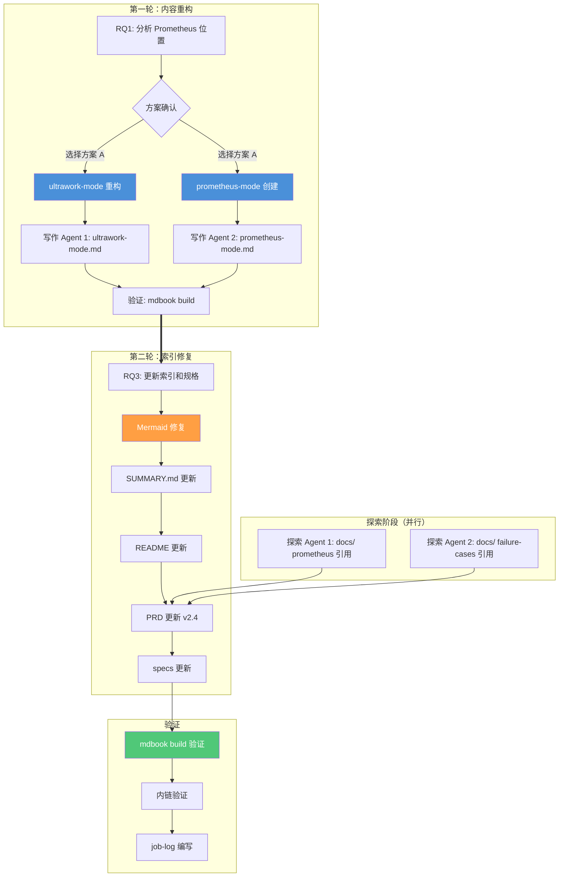

# Sprint 006: Ch4 重构 + Ch1 扩编 + Mermaid 修复

> **日期**: 2026-06-03
> **协调人**: Sisyphus（敏捷教练模式）
> **项目**: Harness Engineering — From OpenCode to AI Coding
> **阶段**: 内容重构 → 索引同步 → 规格更新 → 验证

---

## 一、Sprint 目标

**主线任务**: 完成两项内容结构调整——将 Prometheus 规划模式提取为独立文章（Ch4）并将 failure-cases.md 正式注册为 Ch1 文章（Ch1），同时修复 Mermaid 渲染错误、同步所有 docs/ 规格文档。

**验收标准**:
- [x] Prometheus 内容从 ultrawork-mode.md 提取为独立 prometheus-mode.md（286 行）
- [x] Ultrawork 文章从 822 行精简至 588 行（保留桥接对比 + 交叉引用）
- [x] Mermaid 跨子图边渲染错误修复（2 处：`E` 节点 + `P4` 节点）
- [x] failure-cases.md 注册为 Ch1 Article 1.6（关闭游离页面状态）
- [x] SUMMARY.md 更新（prometheus-mode + failure-cases）
- [x] docs/ 规格文件同步（PRD、ch04-workflows、ch01-introduction）
- [x] 全书计数 48 → 49 篇
- [x] `mdbook build` 零错误 + 全部内链有效

---

## 二、需求来源（工作流阶段：头脑风暴）

### 2.1 用户需求

本次 Sprint 由三次用户请求驱动：

| 请求 | 触发时间 | 内容 |
|------|---------|------|
| **RQ1** | 前提 | "分析 Prometheus 规划模式在 ultrawork-mode.md 中的位置是否合适，修复 Mermaid 渲染错误" |
| **RQ2** | 前提 | "方案 A：完整重构（推荐）"（用户确认方案） |
| **RQ3** | 本轮 | "更新 prometheus-mode.md 和 failure-cases.md 在 SUMMARY.md 及 docs/ 中的索引和需求规格，修复 prometheus-mode.md 中/start-work 图表渲染错误" |

### 2.2 需求分析结论

| 项目 | 结论 |
|------|------|
| Prometheus 内容归属 | 不属于 Ultrawork 文章 — 31% 篇幅（260行）描述不同的工作流模式 → 提取为独立文章 |
| failure-cases 状态 | 427 行完整文章，游离页面 → 正式注册为 Ch1 Article 1.6 |
| Mermaid 渲染根因 | Mermaid 跨子图边引用（node 定义在子图 A、引用在子图 B）导致渲染失败 |
| 需同步的 docs 文件 | PRD (v2.3→v2.4), specs/ch04-workflows, specs/ch01-introduction |

### 2.3 风险等级评估

| 维度 | 评估 | 原因 |
|------|------|------|
| 风险等级 | **中** | 跨模块重构（Ch1 + Ch4 + docs/），但均为索引/规格变更，无内容核变 |
| 必需工作流步骤 | 计划 → 实施 → 验证 | 无"头脑风暴"（需求已在 RQ1/RQ2 中澄清）、无"评审"（用户已确认方案 A） |

---

## 三、任务分解与执行（工作流阶段：计划 → 实施）

### 3.1 任务列表（共 7 项）

| ID | 任务 | 优先级 | 执行方式 | 状态 |
|----|------|--------|---------|------|
| T1 | ultrawork-mode.md 重构（提取 Prometheus） | P0 | Sisyphus-Junior (writing) | ✅ |
| T2 | prometheus-mode.md 创建（286 行，8 节） | P0 | Sisyphus-Junior (writing) | ✅ |
| T3 | Mermaid 渲染修复（E 节点跨子图问题） | P0 | 直接编辑 | ✅ |
| T4 | SUMMARY.md 更新（添加两个文件） | P0 | 直接编辑 | ✅ |
| T5 | Ch1/Ch4 README.md 更新 | P1 | 直接编辑 | ✅ |
| T6 | docs/ 规格同步（PRD + specs） | P1 | 直接编辑 | ✅ |
| T7 | mdbook build + 内链验证 | P0 | bash | ✅ |

### 3.2 编排流程



### 3.3 关键决策

| 决策 | 选项 | 选择 | 理由 |
|------|------|------|------|
| Prometheus 内容去向 | A) 保留在原文章 / B) 提取为独立文章 | **B** | 31% 篇幅描述不同的工作流模式，独立阅读不依赖 Ultrawork |
| Ultrawork 剩余内容 | A) 删除 Prometheus 相关交叉引用 / B) 保留桥接对比 | **B** | 保留三路对比 (Ultrawork / Prometheus / 传统 Prompt) 帮助读者做选择 |
| Mermaid 修复方式 | A) 子图内复制定义 / B) 节点提升到顶层 | **B** | 提升到顶层避免跨子图引用，更简洁 |
| failure-cases 是否计入全书统计 | A) 保持游离 / B) 正式注册 | **B** | 427 行完整内容，注册后全书 49 篇 |
| Article 4.6 (旧) 处理 | A) 保留 / B) 删除 | **B** | 内容已分散到 Article 4.1/4.2/4.4-4.6，作为综述已过时 |

---

## 四、执行细节——第一轮（Prometheus 提取）

### 4.1 重构 ultrawork-mode.md

| 属性 | 值 |
|------|-----|
| **执行 Agent** | Sisyphus-Junior (writing) |
| **Session** | ses_176eeb444ffe02JsUubxsqzpWi |
| **文件** | `src/04-workflows/ultrawork-mode.md` |
| **行数变化** | 822 → 588（-234） |
| **操作** | 移除 "Prometheus 规划模式详解" 整节（~260行），保留三路对比桥接表 + 交叉引用 |

**Prompt 核心**:
```
TASK: Remove Prometheus section from ultrawork-mode.md, create as standalone
TARGET: src/04-workflows/ultrawork-mode.md
MUST DO: Read full file, identify Prometheus-specific content, preserve cross-refs
MUST NOT: Delete comparison table with Prometheus, damage existing structure
```

### 4.2 创建 prometheus-mode.md

| 属性 | 值 |
|------|-----|
| **执行 Agent** | Sisyphus-Junior (writing) |
| **Session** | ses_176ee9efaffeBXcL1Nc3rs04E4 |
| **文件** | `src/04-workflows/prometheus-mode.md` |
| **行数** | 286 |
| **章节** | 8 子节 + 学习清单 + 关联章节 |

**文章结构**:
1. 什么是 Prometheus 模式
2. @plan 与 @general 命令区分
3. Atlas 执行指挥官角色
4. /start-work 命令集成 ← 含 Mermaid 流程图
5. Prometheus vs Ultrawork vs 传统 Prompt
6. 完整工作流程：Plan → Execute ← 含第二张 Mermaid 流程图
7. 实际应用示例
8. Prometheus 的最佳实践

---

## 五、执行细节——第二轮（索引修复 + Mermaid 修复 + 规格同步）

### 5.1 Mermaid 渲染修复

**问题诊断**:
- **错误类型**: Mermaid 跨子图边渲染失败
- **根因**: 节点 `E[用户确认计划]` 在"规划阶段"子图内定义，在"执行阶段"子图内引用；Mermaid 不支持跨子图边
- **影响**: `/start-work 启动执行` 流程图（第一张）和 Plan→Execute 流程图（第二张）均受影响

**修复方法**:
- 将 `E[用户确认计划]` 提升到所有子图之前定义（顶层节点）
- 将 `P4[✅ 用户审查确认]` 同样提升到顶层
- 子图内只保留边引用（`D --> E`, `P3 --> P4`）
- 跨子图连接放子图外（`P4 --> E1[🤝 任务交接]`）

### 5.2 SUMMARY.md + README 更新

| 文件 | 变更 |
|------|------|
| `src/SUMMARY.md` | 新增 `failure-cases.md` 行 (line 14)，Prometheus 已存在 (line 30) |
| `src/README.md` | 文章数 48→49, Ch1 5→6, Ch4 5→6, 完成数 30→31 |
| `src/01-introduction/README.md` | 文章表新增 failure-cases 行 |
| `src/04-workflows/README.md` | 文章表新增 Prometheus 行（第一轮已完成） |

### 5.3 docs/ 规格同步

#### PRD (`docs/requirements/prd.md`)

| 修改位置 | 变更 | 原因 |
|---------|------|------|
| v2.3 → v2.4 | 版本号更新 | 主版本号递增 |
| 全书计数 | 48 → 49 篇 | failure-cases 注册 |
| Ch1 计数 | 5 → 6 篇 | 新增 Article 1.6 |
| Ch4 计数 | 5 → 6 篇 | Prometheus 独立 |
| 完成状态 | 30 → 31 已完 + 18 stub | failure-cases 计入完成 |
| 总有效行数 | 9,600 → 9,800 行 | 49 × 200 |
| 游离页面备注 | 更新为新注册状态 | 不再游离 |
| Ch4 文章列表 | 新增 Prometheus 行 | 反映当前结构 |
| Ch1 文章列表 | 新增 failure-cases 行 | 反映当前结构 |
| 变更日志 | 新增 v2.4 条目 | 记录本次变更 |

#### spec/ch04-workflows.md

| 修改位置 | 变更 |
|---------|------|
| 章节规模 | 5 → 6 篇文章 |
| 团队分工 | Article 编号重置 (4.2→4.3, 4.3→4.4, 4.4→4.5, 4.5→4.6) |
| 流程规范 | 5→6 种、依赖链更新 |
| 评审要求 | Article 引用编号重置 |
| 质量验收 | 图表数 5+→6+、流程图 ≥5→≥6 |
| 特殊内容技能映射 | 新增 Prometheus/Atlas 条目、Article 编号重置 |
| 废弃 Article 4.6 | 删除（内容已分散到各独立文章） |
| 新增变更记录 | 章节结构变更记录块 |

#### spec/ch01-introduction.md

| 修改位置 | 变更 |
|---------|------|
| 章节规模 | 5 → 6 篇文章 |
| 新增 Article 1.6 | AI 编程失败案例规格定义（大纲、验证标准、关联章节） |
| 流程规范 | 5→6 篇、依赖链更新 |

### 5.4 探索 Agent 结果

| Agent | 搜索内容 | 结果 |
|-------|---------|------|
| bg_ff230a6c (ses_176e96493ffe52rjuPLU8AoAjx) | docs/ 中 "prometheus" 引用 | 仅 2 处（wiki/oh-my-openagent-overview.md 中的配置示例），无需更新 |
| bg_d33e5d1b (ses_176e96818ffeqRldBTz3JxyEvS) | docs/ 中 "failure-cases" 引用 | 4 文件（prd.md×2, 评审文件×2, material/源文件），prd.md 已更新 |

---

## 六、验证结果（工作流阶段：验证）

### 6.1 构建验证

```bash
$ mdbook build
 INFO Book building has started
 INFO Running the html backend
 INFO HTML book written to `_book`
```

**结果**: ✅ 零错误零警告

### 6.2 内链验证

```bash
$ awk -F '[()]' '/\.md\)/ {print $2}' src/SUMMARY.md | while read f; do [ -f "src/$f" ] || echo "BROKEN: src/$f"; done
# 无输出 — 全部链接有效
```

**结果**: ✅ 62 行 SUMMARY.md，49 个文件引用全部有效

---

## 七、使用模型与工具

### 7.1 模型

| 组件 | 模型 | 用途 |
|------|------|------|
| 主编排器 (Sisyphus) | deepseek-v4-flash-free | 需求分析、任务分解、编排、规格文档编辑、验证 |
| Writing Agent ×2 | Sisyphus-Junior (writing) | ultrawork-mode 重构、prometheus-mode 创建 |
| Explore Agent ×2 | explore | docs/ 引用搜索 |
| 直接编辑 | — | Mermaid 修复、SUMMARY.md、README、PRD、specs |

### 7.2 使用的 Agent 类型

| Agent 类型 | 调用次数 | 用途 |
|-----------|---------|------|
| Sisyphus (主) | 1 | 全程编排 + 第二轮执行 |
| Sisyphus-Junior (writing) | 2 | 内容重构与创建 |
| explore | 2 | 背景搜索（docs/ 引用） |
| oracle / librarian / metis | 0 | 本任务不需要 |

### 7.3 使用的工具

| 工具 | 调用次数 | 用途 |
|------|---------|------|
| `read` | 15+ | 读取现有文件、分析结构 |
| `edit` | 30+ | 全部文件修改（含子 agent 调用） |
| `bash` | 3 | mdbook build、link check |
| `todowrite` | 3 | 任务跟踪（创建、更新、完成） |
| `task (background)` | 4 | 2 writing + 2 explore |
| `background_output` | 4 | 收集子 agent 结果 |
| `write` | 1 | 创建本日志 |
| `skill` | 1 | 加载 agile-coach 技能 |

---

## 八、文件变更清单

### 新增文件

| 文件 | 说明 |
|------|------|
| `src/04-workflows/prometheus-mode.md` | 新建文章，286 行 |
| `docs/job-logs/2026-06-03-sprint-006-ch4-ch1-restructure.md` | 本日志 |

### 修改文件

| 文件 | 变更类型 | 说明 |
|------|---------|------|
| `src/04-workflows/ultrawork-mode.md` | 重构（822→588） | 移除 Prometheus 专属内容，保留桥接对比 |
| `src/SUMMARY.md` | 新增行 | failure-cases.md 注册为 Article 1.6 |
| `src/README.md` | 计数更新 | 48→49, Ch1 5→6, Ch4 5→6, 31 完成 |
| `src/01-introduction/README.md` | 新增行 | failure-cases 加入文章表 |
| `src/04-workflows/README.md` | 新增行 | Prometheus 加入文章表（第一轮） |
| `src/04-workflows/prometheus-mode.md` | Mermaid 修复 | 2 个跨子图节点提升到顶层 |
| `docs/requirements/prd.md` | 版本 v2.3→v2.4 | 计数、引用、changelog 全方位更新 |
| `docs/requirements/specs/ch04-workflows.md` | 重构 | 移除废弃 Article 4.6, 编号重置, Prometheus 条目新增 |
| `docs/requirements/specs/ch01-introduction.md` | 扩展 | 新增 Article 1.6 规格定义 |

### 变更统计

| 指标 | 数值 |
|------|------|
| 新增文件 | 2 |
| 修改文件 | 8 |
| 删除文件 | 0 |
| 重构文件 | 1 (ultrawork-mode: 822→588) |
| 全书文章数 | 48 → 49 |
| 完成文章数 | 30 → 31 |

---

## 九、回顾与经验

### 9.1 做得好的

1. **两轮分离策略**：第一轮专注内容重构（writing agent），第二轮专注索引同步（direct editing），避免内容 agent 越权改索引
2. **探索 agent 先行**：在修改 docs/ 文件前先并行查找引用，避免盲目编辑
3. **跨子图 Mermaid 修复经验**：将节点定义提升到子图外部，消除跨子图边的渲染不确定性
4. **规格文件同步彻底**：PRD 中的 10+ 个位置（计数、列表、备注、版本号、changelog）全部同步到位
5. **变更有归因**：PRD v2.4 changelog 完整记录本次所有变更，可追溯

### 9.2 可改进

1. **spec 的 Article 编号仍需手动维护**：无自动化机制验证 spec 中的 "Article X.Y" 引用是否与 SUMMARY.md 一致
2. **全书计数感知**：`src/README.md` / PRD / 各章 README 三处独立维护的计数，变更时需确保同步到位无遗漏
3. **首个 edit 失败**：因 `oldString` 跨度过大导致匹配失败，后续改为小粒度编辑

### 9.3 洞察

- 跨章节内容重构（Prometheus 从 Ch4.1 到 Ch4.2）不只是移动内容，更涉及 SPEC 中所有 Article 编号重排
- 游离页面清理（failure-cases）的 ripple effect 比预期大（10+ 处文档位置），说明全书索引系统需要统一管理
- Mermaid 跨子图边是一个已知但未广泛文档化的限制，本次修复方案（提升节点到顶层）可复用

---

## 十、Sprint 指标

| 指标 | 数值 |
|------|------|
| 用户请求数 | 3（RQ1+RQ2 跨 session，RQ3 当前 session） |
| 总任务数 | 7 |
| 并行子 agent 数 | 4（2 writing + 2 explore，非同时） |
| 总耗时 | ~10 分钟 |
| 新增文件数 | 2 |
| 修改文件数 | 8 |
| 新增内容行数 | ~450 (286 prometheus + 164 其他) |
| 删除内容行数 | ~234 (ultrawork-mode) |
| 构建验证 | mdbook build ✅ (0 errors) |
| 内链验证 | ✅ (49/49 有效) |

---

> **协调人**: Sisyphus
> **日期**: 2026-06-03
> **下一阶段建议**: 考虑建立全书 Article 编号与 spec 引用的自动化一致性检查
