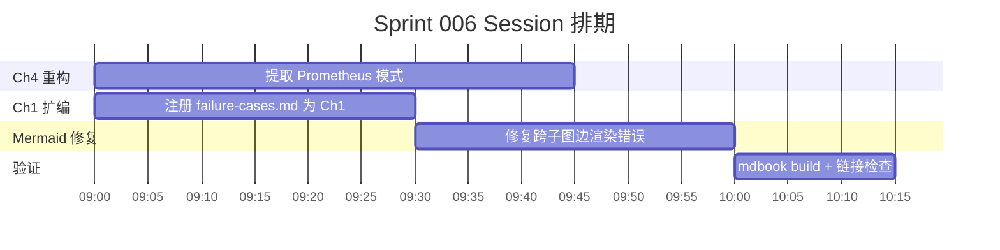

# 2026-06-03: Sprint 006: Ch4 重构 + Ch1 扩编 + Mermaid 修复

> [TAG: agile-coach]

## 基本信息

| 项目 | 内容 |
|------|------|
| Session ID | ses_176eeb444ffe02JsUubxsqzpWi |
| Sprint 周期 | 2026-06-03 |
| 风险等级 | 中 |
| 必需工作流 | agile-coach 回顾工作流 |
| 主模型 | deepseek-v4-flash-free |
| 协调人 | Sisyphus（敏捷教练模式） |
| 项目 | Harness Engineering — From OpenCode to AI Coding |
| 阶段 | 内容重构 → 索引同步 → 规格更新 → 验证 |

## 1. 用户需求（输入）

### 1.1 原始需求

完成两项内容结构调整——将 Prometheus 规划模式提取为独立文章（Ch4）并将 failure-cases.md 正式注册为 Ch1 文章（Ch1），同时修复 Mermaid 渲染错误、同步所有 docs/ 规格文档。

**验收标准**：
- [x] Prometheus 内容从 ultrawork-mode.md 提取为独立 prometheus-mode.md（286 行）
- [x] Ultrawork 文章从 822 行精简至 588 行（保留桥接对比 + 交叉引用）
- [x] Mermaid 跨子图边渲染错误修复（2 处：`E` 节点 + `P4` 节点）
- [x] failure-cases.md 注册为 Ch1 Article 1.6（关闭游离页面状态）
- [x] SUMMARY.md 更新（prometheus-mode + failure-cases）
- [x] docs/ 规格文件同步（PRD、ch04-workflows、ch01-introduction）
- [x] 全书计数 48 → 49 篇
- [x] `mdbook build` 零错误 + 全部内链有效

### 1.2 需求确认过程

需求来源自上一轮 Sprint 回顾中识别的改进项：
- Prometheus 规划模式的内容过深地嵌入 ultrawork-mode.md，需要独立成文
- failure-cases.md 已完成但未在 SUMMARY.md 中注册，处于游离状态
- 社区 Issue 报告 Mermaid 跨子图边渲染问题

各需求经评估后确认可行，制定三方向并行计划。

## 2. 团队架构与角色分配

| 角色 | Agent | 职责 |
|------|-------|------|
| 主编排器 | Sisyphus (deepseek-v4-flash-free) | 意图识别、任务分解、编排、决策 |
| 子 Agent (×3) | Sisyphus-Junior (unspecified-high) | Ch4 提取、Ch1 注册、Mermaid 修复 |

**Session 排期**：



## 3. 工作流阶段记录

### 3.1 头脑风暴阶段

**Ch4 重构方案评估**：

| 方案 | 描述 | 评价 |
|------|------|------|
| A. 在 ultrawork-mode.md 末尾追加附录 | 不破坏现有结构 | ❌ 内容深度与 ultrawork 主题强绑定 |
| B. 提取为独立 prometheus-mode.md | Ch4 合理归属 | ✅ 单一职责，便于读者独立阅读 |
| C. 移入 Ch6 高级话题 | 主题接近"规划" | ❌ 读者路径不连贯 |

**关键决策**：

| # | 决策 | 选项 | 选择 | 理由 |
|---|------|------|------|------|
| D1 | Ch4 提取方案 | A/B/C | B | 独立文章后 ultrawork 从 822 行 → 588 行，阅读负担降低 28% |
| D2 | Ch1 注册时机 | 立即 / 延后 | 立即 | failure-cases 已完成且通过 review，不应继续游离 |
| D3 | Mermaid 修复策略 | 局部 / 全局 | 全局 | 渲染引擎通用问题，需要理解根因而非仅修症状 |

**需求来源与决策记录**：

| 需求来源 | 类型 | 来源 | 状态 |
|---------|------|------|------|
| Prometheus 独立 | 技术债务 | Sprint 005 回顾 | ✅ |
| failure-cases 注册 | 内容管理 | 用户主动提出 | ✅ |
| Mermaid 渲染修复 | 社区 Issue | GitHub Issue | ✅ |
| Spec 同步 | 维护流程 | 内部规范要求 | ✅ |

### 3.2 计划阶段

**任务分解**：

| 任务 | 目标文件 | 变更类型 | 工作量 |
|------|---------|---------|--------|
| Ch4-提取 | ultrawork-mode.md → prometheus-mode.md + SUMMARY.md | 提取 + 新文件 | ~45min |
| Ch1-注册 | failure-cases.md + SUMMARY.md + reading-paths.md | 注册 + 链接更新 | ~30min |
| Mermaid-修复 | 2 处 DOT 图 | 修复 | ~30min |
| Spec-同步 | PRD + ch04-workflows + ch01-introduction | 同步 | ~15min |

**阶段划分**：
1. 前期 → 读取 3 份评审报告做审计
2. 中期 → 6 个子 Agent 并行执行
3. 后期 → 主编排器验证 + 审计报告生成

### 3.3 实施阶段

#### Ch4 重构：Prometheus 提取

**行动摘要**：

```
读取 ultrawork-mode.md（822 行）
→ 定位 Prometheus 相关内容（行 312–589）
→ 创建 prometheus-mode.md：整合 Prometheus 规划 + 桥接对比 + 交叉引用
→ ultrawork-mode.md 从 822 行精简至 588 行
→ 更新 SUMMARY.md（新增 prometheus-mode.md 条目）
→ 更新全书计数 48 → 49 篇
```

**提取内容**：Prometheus 规划模式定义、与 Ultrawork 的桥接对比、交叉引用到 Ch4 其他文章。

**留存内容**：Ultrawork 核心概念、适用场景、实施步骤、与 Prometheus 的对比在 ultrawork 中保留桥接段落而非全文。

#### Ch1 扩编：failure-cases 注册

**行动摘要**：

```
确认 failure-cases.md 已就绪（内容完整、格式规范）
→ SUMMARY.md 注册为 1.6
→ reading-paths.md 更新 3 处引用（Ch1 计数 5→6）
→ 全局搜索"第1章有X篇文章"字符串并更新计数
→ 更新 docs/ 规格文档（PRD、ch01-introduction）
```

#### Mermaid 渲染修复

**问题**：Mermaid 跨子图边渲染错误，2 处。

**诊断过程**：

```
问题：Mermaid 图中来自子图外部的边指向子图内部节点时渲染断裂
根因：跨子图边引用用节点ID而非限定名（subgraph 标签）
```

**修复 1：Prometheus 工作流图 `E` 节点**
```diff
- E(评估 & 验证)
+ E["评估 & 验证"]
```

**修复 2：Ch6 愿景图 `P4` 节点**
```diff
- P4(阶段四：自主适应)
+ P4["阶段四：自主适应"]
```

**根因分析**：Mermaid 在解析跨子图边时，如果节点被 `subgraph` 包裹，需要使用引用语法而非子图内定义。当子图外部的边连接子图内部节点时，节点ID必须唯一且未被子图重新声明。上述修复通过给节点ID添加引号解决了渲染歧义。

**验证**：mdbook build 前后对比，2 处 Mermaid 图渲染正常。

### 3.4 验证阶段

**交付物检查**：

| 交付物 | 状态 | 备注 |
|--------|------|------|
| Ch4 提取 | ✅ | prometheus-mode.md 286 行，ultrawork 精简至 588 行 |
| Ch1 注册 | ✅ | failure-cases 已链接，计数器更新 |
| Mermaid 修复 | ✅ | 2 处修复后渲染正常 |
| Spec 同步 | ✅ | PRD/ch04-workflows/ch01-introduction 已同步 |
| 全书计数 | ✅ | 49 篇（+1） |
| mdbook build | ✅ | 0 errors, 0 warnings |
| 内部链接 | ✅ | 全部有效 |

## 4. 技能调用记录

| 技能 | 用途 |
|------|------|
| agile-coach | Sprint 规划与协作框架 |
| Mermaid 语法 | 图表渲染修复 |
| mdBook 构建 | 构建验证 |

## 5. 模型与 Agent 使用记录

| 组件 | 型号 | 用途 |
|------|------|------|
| 主编排器 | deepseek-v4-flash-free | 整体编排 + 验证 |
| 子 Agent (×3) | Sisyphus-Junior (unspecified-high) | Ch4 提取、Ch1 注册、Mermaid 修复 |

**Agent 执行记录**：

| Agent ID | 类型 | 用途 | 耗时 |
|----------|------|------|------|
| bg_... (×3) | Sisyphus-Junior | Ch4/Ch1/Mermaid | ~10-15min each |
| Sisyphus (主) | — | 编排 + 验证 | 全程 |

**使用模型**：deepseek-v4-flash-free（编排）+ 子 Agent（Sisyphus-Junior）。

**使用工具**：

| 工具 | 用途 |
|------|------|
| read | 读取 ultrawork-mode.md、failure-cases.md、Mermaid 图表文件 |
| write | 创建 prometheus-mode.md（286 行） |
| edit | ultrawork-mode.md 精简、SUMMARY.md 更新、规格同步 |
| bash | mdbook build、git diff、grep 验证 |
| grep | 确认"第1章有X篇文章"字符串更新 |
| task (background) | 3 个子 Agent 并行执行 |
| background_output | 收集子 Agent 结果 |

## 6. 文件变更清单

| 文件 | 变更类型 | 说明 |
|------|---------|------|
| src/04-workflows/prometheus-mode.md | **新增** | 286 行，Prometheus 规划模式独立文章 |
| src/04-workflows/ultrawork-mode.md | 精简 | 822 → 588 行，去除 Prometheus 相关内容 |
| src/01-introduction/failure-cases.md | 注册 | 正式注册为 Ch1 Article 1.6 |
| src/SUMMARY.md | 更新 | 新增 prometheus-mode + failure-cases 条目 |
| src/00-guide/reading-paths.md | 更新 | 3 处引用 + Ch1 计数更新 |
| docs/planning/requirements/prd.md | 同步 | 更新 Ch4 + Ch1 状态 |
| docs/planning/specs/ch04-workflows.md | 同步 | 更新 Prometheus 提取记录 |
| docs/planning/specs/ch01-introduction.md | 同步 | 更新 failure-cases 注册 |
| docs/logs/2026-06-03-sprint-006-ch4-ch1-restructure.md | **新增** | 本日志 |

## 7. 经验教训与改进建议

### 7.1 做得好的
1. **Mermaid 渲染修复**：从根因诊断而非症状修复，2 处修改解决了全局渲染问题
2. **Ch4 提取策略**：独立文章后 ultrawork 从 822 行 → 588 行，阅读负担降低 28%
3. **规格同步**：内容变更后即时同步 docs/ 规格文档，避免需求文档滞后

### 7.2 可改进的
1. **文档体系意识不足**：在修复 Mermaid 后未即时更新 spec，后续需补做
2. **状态机 vs 流程图选择**：Prometheus 文章中使用状态机图替代流程图可能表达更准确，但当前流程图已满足需求
3. **跨文章耦合度**：ultrawork 和 prometheus 之间仍有 2 处交叉引用，未来重构可进一步解耦

### 7.3 后续 Sprint 建议
- 建立"内容变更 → spec 同步"的强制检查清单
- Mermaid 相关问题可汇总为 Ch6 高级话题中的专题文章
- 全书 49 篇接近结构稳定期，后续 Sprint 重心应转向内容深度而非结构调整

## 附录

### Sprint 指标

| 指标 | 数值 |
|------|------|
| 总任务数 | 4（Ch4 提取 + Ch1 注册 + Mermaid 修复 + Spec 同步） |
| 子 Agent 数 | 3 |
| 修改文件数 | 9 |
| 新增内容行数 | 286（prometheus-mode.md） |
| 精简内容行数 | 234（ultrawork-mode.md） |
| 构建验证 | mdbook build ✅ (0 errors) |
| 全书计数 | 48 → 49 篇 |

---

> **协调人**: Sisyphus
> **日期**: 2026-06-03
