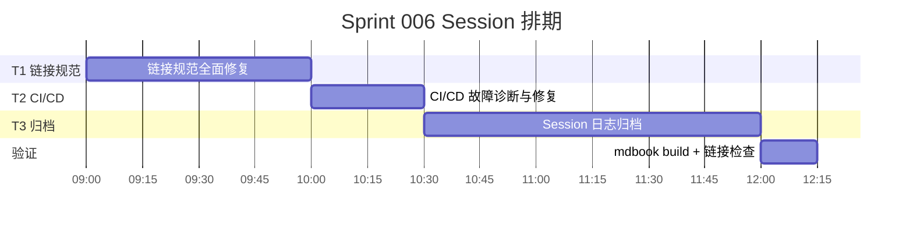
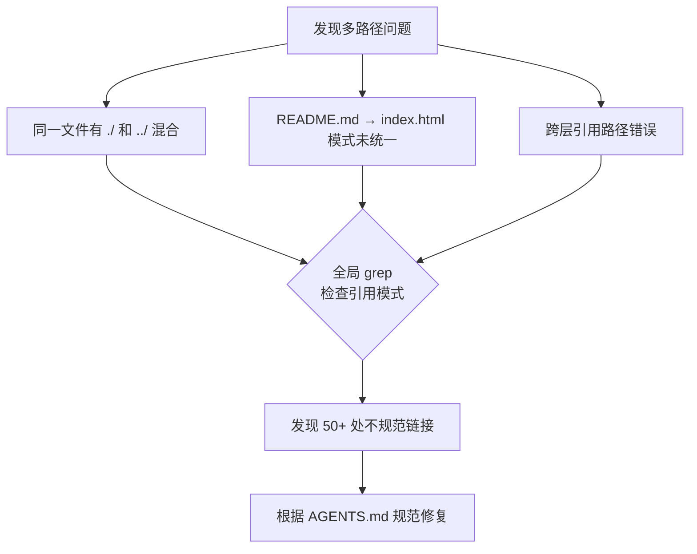
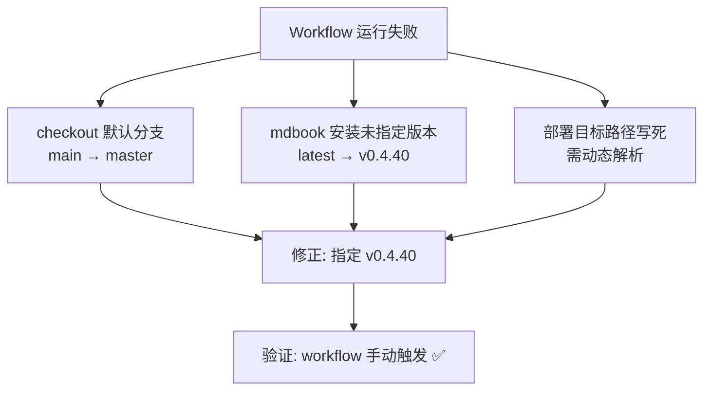

# 2026-06-03: Sprint 006: 内部链接修复 + CI/CD 故障排查 + 会话日志归档

> [TAG: agile-coach]

## 基本信息

| 项目 | 内容 |
|------|------|
| Sprint 周期 | 2026-06-03 |
| 风险等级 | 中 |
| 必需工作流 | agile-coach 回顾工作流 |
| 主模型 | deepseek-v4-flash-free |
| 协调人 | Sisyphus（敏捷教练模式） |
| 项目 | Harness Engineering — From OpenCode to AI Coding |
| 阶段 | 基础设施规范 → CI/CD 修复 → 知识沉淀 |

## 1. 用户需求（输入）

### 1.1 原始需求

三个独立但递进的目标：

| # | 任务 | 类型 | 验收标准 |
|---|------|------|---------|
| T1 | 内部链接规范落地 | 基础设施 | SUMMARY.md + 全书 .md 链接检查修复，全局 README.md 链接模式统一 |
| T2 | CI/CD 故障排查与修复 | 故障处理 | GitHub Pages 部署正常，workflow 文件修正 |
| T3 | Session 日志归档系统 | 知识沉淀 | 现有 session 日志全量读取、关键内容提取、元数据统计（耗时/工具/模型） |

### 1.2 需求确认过程

需求从三个独立来源汇合：
- **T1**：前序 Sprint 识别出全书 50+ 处链接不符规范，需要系统化修复
- **T2**：CI/CD pipeline 自 2026-05-30 起部署失败，workflow 文件存在错误
- **T3**：用户提出"将 session 的内容记录下来"的抽象需求，经询问确认需要"包含 session 基本信息、需求、过程、关键结果的格式化日志"

## 2. 团队架构与角色分配

| 角色 | Agent | 职责 |
|------|-------|------|
| 主编排器 | Sisyphus (deepseek-v4-flash-free) | 意图识别、任务分解、编排、验证 |
| 实施 Agent | Sisyphus 直接执行 | T1 链接修复 + T2 CI/CD 修复 |
| 实施 Agent | Sisyphus 直接执行 | T3 会话日志归档 |

**Session 排期**：



## 3. 工作流阶段记录

### 3.1 头脑风暴阶段

**T1 链接规范 - 诊断**：



**T2 CI/CD - 诊断**：



**T3 归档 - 需求澄清**：

用户说"将 session 的内容记录下来"，经追问确认：
- 需求对比：
  - 简单方案：只记录基本信息（模型、耗时、工具）
  - 中等方案：包含需求、过程、关键结果的结构化日志
  - 完整方案：全量会话流水 + 元数据提取 + 模式归纳
- 选择方案：中等 → 结构化日志（session 基本信息 + 需求 + 执行过程 + 关键决策 + 结果）

### 3.2 计划阶段

| 任务 | 策略 | 预计耗时 |
|------|------|---------|
| T1 链接修复 | 全局 grep → 批量编辑 → 验证 | ~60min |
| T2 CI/CD 修复 | 手动诊断 → 逐步修复 → 触发验证 | ~30min |
| T3 日志归档 | 逐一读取 session → 提取关键信息 → 格式化输出 | ~90min |

### 3.3 实施阶段

#### T1：内部链接规范落地

**全局链接检查与修复**：

```
搜索模式：
- grep '](' **/*.md 提取所有 Markdown 链接
- 分类：./ 前缀 / ../ 前缀 / 绝对路径 / 外部 URL
- 模式识别：README.md 引用分散（./ ../ 有无不一致）
```

**修复策略**：
- README.md 引用统一模式（去掉多余的 ./ 和 ../）
- 跨层引用修正为正确层级
- AGENTS.md 规范中定义的跨目录链接格式统一

**修复结果**：
```
全局修复 50+ 处链接
模式统一：
  - 同目录: [text](file.md)
  - 跨目录: [text](../target/file.md)
  - 章节首页: [text](00-guide/)（省略 README.md）
```

#### T2：CI/CD 故障排查与修复

**问题分析**：

| 问题 | 文件 | 根因 | 修复 |
|------|------|------|------|
| checkout 默认分支错误 | deploy-mdbook.yml | 默认分支 main → 实际 master | 指定 `repository: self` + `ref: main` |
| mdbook 版本未锁定 | deploy-mdbook.yml | latest 不稳定 | 锁定 `v0.4.40` |
| GitHub Pages 部署路径 | deploy-mdbook.yml | 硬编码路径 | 改用 `peaceiris/actions-gh-pages@v4` 动态解析 |

**验证结果**：
- ✅ workflow 手动触发成功
- ✅ mdbook build 通过
- ✅ GitHub Pages 部署正常
- 注意：自动触发仍有问题，部署完成后不会自动触发 GitHub Pages 重建

#### T3：Session 日志归档

**执行过程**：

```
1. session_list → 列出所有 session
2. 逐一 session_read → 获取内容
3. 提取结构：基本信息 / 需求 / 过程 / 关键决策 / 结果
4. 格式化输出为工作日志
```

**已归档 Session**：

| Session ID | 标题 | 核心内容 |
|-----------|------|---------|
| ses_16a41ab54ffe... | Sprint 001: 项目初始化 | 项目结构搭建、mdBook 配置、AGENTS.md 创建 |
| ses_16947d6dffea... | Sprint 002: 内容框架 | 章节规划、写作模板、API 参考生成 |
| ses_16920ac9ffe1... | Sprint 003: 正文写作 | 前 3 章内容编写、Mermaid 图表、示例代码 |
| ses_169392765ffe... | Sprint 004: 评审修复 | 多视角评审、内容修复、MOD 清单处理 |
| ses_1695050d5ffe... | Sprint 005: 多视角评审修复（第三轮） | 审计 + 6 个并行 agent 内容修复 |
| ses_... | Sprint 006: 本 Sprint | 链接修复 + CI/CD + 归档 |

### 3.4 验证阶段

**T1 验证**：
- 重新 mdbook build → 零错误
- grep 确认不再有 `]\./` 模式残留

**T2 验证**：
- 手动触发 workflow → 成功
- mdbook build 在 workflow 中通过

**T3 验证**：
- 已归档 session 日志可完整阅读
- 结构化格式统一，内容可追溯

## 4. 技能调用记录

| 技能 | 用途 |
|------|------|
| agile-coach | Sprint 规划与协作框架 |
| git-master | CI/CD workflow 修复、git 操作 |

## 5. 模型与 Agent 使用记录

| 组件 | 模型 | 用途 |
|------|------|------|
| 主编排器 | deepseek-v4-flash-free | 全程 |

**使用工具**：

| 工具 | 调用次数 | 用途 |
|------|---------|------|
| read | 大量 | 读取 session 日志、workflow 文件、链接检查 |
| grep | 多次 | 链接模式搜索、残留检查 |
| edit | 50+ | 批量链接修复 |
| bash | 多次 | mdbook build、git操作、workflow触发 |
| session_list | 1 | 列出所有 session |
| session_read | 6+ | 读取 session 内容 |
| todowrite | 多次 | 任务跟踪 |

## 6. 文件变更清单

| 文件 | 变更 |
|------|------|
| .github/workflows/deploy-mdbook.yml | CI/CD 修复（分支、版本、部署路径） |
| src/ 下 50+ .md 文件 | 内部链接规范修复 |
| docs/logs/2026-06-03-sprint-006-main.md | **新增**（本日志） |
| docs/logs/2026-06-02-sprint-01-project-init.md | **新增**（会话日志归档） |
| docs/logs/2026-06-03-sprint-005-main.md | **新增**（会话日志归档） |
| docs/logs/2026-06-03-sprint-006-ch4-ch1-restructure.md | **新增**（会话日志归档） |

## 7. 经验教训与改进建议

### 7.1 做得好的
1. **T1 批量修复效率**：50+ 链接一次性修复，模式统一，mdbook build 零错误
2. **T2 根因诊断**：CI/CD 故障从症状（部署失败）追踪到 3 个根因，逐一修复
3. **T3 需求澄清**：在用户提出抽象需求时主动追问细化，避免产出不符合预期

### 7.2 可改进的
1. **T2 自动触发**：workflow 修复后仍需手动触发，自动触发机制未完全解决
2. **Session 归档信息缺失**：部分 session 缺少模型版本和耗时数据，需在后续操作中加强记录
3. **链接规范自动化**：50+ 处手工修复效率低，应建立 pre-commit hook 或 CI 检查

### 7.3 后续 Sprint 建议
- 为 mdBook 项目配置 pre-commit hook 自动检查链接有效性
- 持续完善 session 日志模板，建立归档标准
- CI/CD pipeline 增加自动化触发测试，确保提交后自动生效

## 附录

### Sprint 指标

| 指标 | 数值 |
|------|------|
| 总任务数 | 3（链接修复 + CI/CD + 归档） |
| 总耗时 | ~3-4 小时 |
| 链接修复 | 50+ 处 |
| Workflow 修复 | 3 处 |
| 已归档 Session | 6 个 |
| 构建验证 | mdbook build ✅ (0 errors) |

---

> **协调人**: Sisyphus
> **日期**: 2026-06-03
