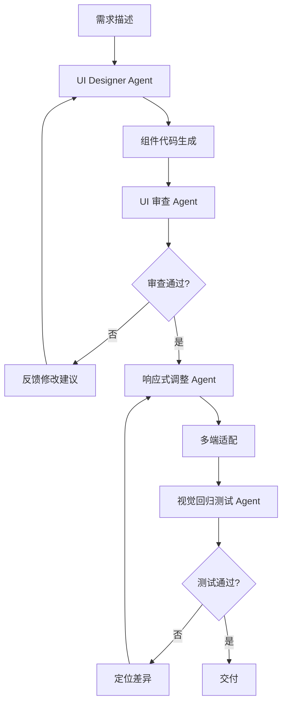

# Ch4: 工作流实战

## 概述

本章回答一个实际问题：拿到开发任务后，该用哪种工作流模式来执行。看完前三章你知道 OpenCode 有哪些能力，本章教你如何把这些能力组合成可运行的工作流。覆盖 6 种实战模式——Ultrawork、多 Agent 协作、Team Mode、Agent 派生、Teams 多进程协作、Prometheus 规划——每种都配有可直接运行的配置示例。

**章节核心主题**：从会用单个模式到能设计完整工作流——工作流选型与编排实战。

> **章节规模**：6 篇文章（2 现有 + 4 新增），2 篇修改

### 创作辅助

本章内容创作和评审中推荐配备以下智能体组合：

| 类型 | 推荐 | 理由 |
|------|------|------|
| **思维框架** | 集中兵力（聚焦高ROI工作流）、统筹兼顾（平衡广度与深度） | 工作流实战是本书核心差异化价值，模式的可复用性最关键 |
| **人物视角** | Karpathy（工程化思维）、Musk（效率与第一性原理） | 同上 |
| **启用阶段** | 初稿（视角驱动）+ 审校（框架验证） | 初稿时用人物视角打开思路，审校时用思维框架检查逻辑 |


## 文章

### Article 4.1: Ultrawork 模式
- **阅读时间**：20 min
- **学习目标**：
  - 理解Ultrawork模式的工作原理和适用场景
  - 掌握如何启用和使用Ultrawork模式
  - 理解Ralph Loop（自引用循环）机制
  - 能够通过实际案例理解Ultrawork的"探索→实现→验证"循环
- **前置知识**：Ch2（概念基础）+ Ch3（环境配置，含OMO）
- **源材料映射**：OpenCode实战 02（OMO Ultrawork Mode详解）+ OpenCode实战 03（Ultrawork决策树+对比）

#### 大纲
1. Ultrawork的工作原理
   - 定义："懒得想"模式——Agent自主探索代码库→研究模式→实现功能→LSP验证→重复
   - 适用场景：上下文复杂的任务、不想写详细要求、快速原型
   - 配置：default_mode.ultrawork + ralph_loop
2. Ultrawork使用方式
   - 对话中输入 `ulw` 或 `ultrawork`
   - 设置为默认模式
   - 配合Ralph Loop使用：`/ulw-loop`
3. Ultrawork vs 传统Prompt
   - 对比表：精准度 vs 探索深度 vs Token消耗 vs 人工介入
   - 什么时候Ultrawork优于手动写详细Prompt
   - 什么时候不适用（需要精确控制的场景）
4. Ralph Loop机制
   - /ulw-loop：自我迭代直到100%完成
   - Loop的控制参数（max_turns, stop_condition）
   - 实用场景：单元测试覆盖率提升、持续重构
5. 实战案例：使用Ultrawork为开源项目添加功能

#### 核心概念
- **从"精确指令"到"目标驱动"的转变**：Ultrawork 改变了使用 AI 的方式——不用把每一步写清楚，告诉 Agent 最终要什么结果就行。
- Ralph Loop vs 普通Loop：普通Loop是预设步骤的重复执行；Ralph Loop是Agent根据完成情况自主决定下一步。
- **Ultrawork的工程价值**：在不确定性和探索成本之间取得平衡。

#### 代码/配置示例
- Ultrawork默认模式配置
- /ulw-loop使用示例
- Ralph Loop配置参数

#### Mermaid 图表
- Ultrawork工作流示意图（探索→实现→验证循环）
- Ralph Loop决策流程图

#### 关联章节
- ← Article 2.3（Command系统触发Ultrawork）
- ← Article 3.3（OMO配置是Ultrawork的基础）
- → Article 4.2（Ultrawork与多Agent协作的关系）

#### 验证标准
- [ ] 文章 ≥ 200 行有效内容

**创作辅助**:
- 思维框架：集中兵力（Ultrawork是最核心模式）
- 人物视角：Karpathy（自动化工程思维）
- 理由：Ultrawork 是全书最具差异化的内容

- [ ] 包含Ultrawork启用配置
- [ ] 包含Ralph Loop使用示例
- [ ] 包含Ultrawork vs 传统Prompt的对比表

---

### Article 4.2: 多 Agent 协作
- **阅读时间**：25 min
- **学习目标**：
  - 理解4种Agent协作模式：串行/并行/主从/竞争
  - 掌握使用task()调用子Agent的方法
  - 理解7-Agent Pipeline的设计和实现
  - 掌握WORKFLOW_STATE.md文件交接模式
- **前置知识**：Article 4.1（单Agent的工作流理解）
- **源材料映射**：OpenCode实战 03（7-Agent Pipeline完整章节）+ OpenCode实战 01（task()子Agent调用）+ OpenCode实战 05（案例一/三中的多Agent协作）

#### 大纲
1. Agent协作的4种模式
   - 串行模式（Pipeline）：A→B→C顺序执行
   - 并行模式（Fan-out）：A同时触发B1/B2/B3，汇总结果
   - 主从模式（Master-Slave）：Master分配任务给Slave，Slave独立执行
   - 竞争模式（Adversarial）：多个Agent从不同角度分析，取共识

#### 4 种协作模式架构特征对比

| 特征 | Prompt Chaining | Routing | Parallelization | Orchestrator-Workers |
|------|----------------|---------|-----------------|---------------------|
| **延迟** | 高（串行累加） | 低（单次路由） | 低（并行执行） | 中（编排开销） |
| **吞吐** | 低 | 中 | 高 | 高 |
| **一致性** | 高（固定流程） | 中（路由决策） | 低（需合并） | 高（编排协调） |
| **容错性** | 低（单点故障） | 中（可降级） | 高（部分失败可继续） | 高（重试机制） |
| **适用场景** | 固定子任务顺序 | 不同类别需不同处理 | 独立子任务并行 | 动态分解任务 |
| **OpenCode 实现** | Skill/Command | Agent + Task 权限 | 多 Task 调用 | Primary Agent 编排 |
| **成本** | 低 | 低 | 中（并行调用） | 高（多次调用） |

2. 使用task()调用子Agent
   - task()的参数：category, load_skills, prompt, description
   - 子Agent的权限隔离
   - task()的返回和结果合并
3. 7-Agent Pipeline（核心内容）
   - 7个角色的职责：Planner → Debater → Implementor → Reviewer → Tester → Linter → Commit-message
   - WORKFLOW_STATE.md的文件交接模式
   - 权限隔离设计（Reviewer/Tester字面无法改代码）
   - 温度策略（Planner 0.1, Debater 0.3, Implementor 0.1...）

#### 7-Agent 权限矩阵

| Agent | edit | bash | read | 模型 | 职责 |
|-------|------|------|------|------|------|
| Planner | deny | deny | allow | claude-opus-4 | 任务规划 |
| Debater | deny | deny | allow | claude-sonnet-4 | 方案辩论 |
| Implementor | allow | ask | allow | claude-sonnet-4 | 代码实现 |
| Reviewer | deny | deny | allow | claude-opus-4 | 代码审查 |
| Tester | deny | allow | allow | claude-haiku-3.5 | 测试执行 |
| Linter | deny | allow | allow | claude-haiku-3.5 | 代码检查 |
| Committer | ask | deny | allow | claude-sonnet-4 | 提交代码 |

**权限设计原则**：
- Planner/Debater/Reviewer 只读，防止意外修改
- Implementor 有写权限，但 Bash 需要 ask
- Tester/Linter 可执行 Bash（测试/检查命令）
- Committer 需要 ask 确认后才能提交

4. 实战：启动7-Agent Pipeline
   - 完整启动命令
   - 观察每个阶段的输出
   - 调试和重试策略

#### 前端场景 Agent 编排示例

**AI 辅助组件生成 → UI 审查 → 响应式调整 → 视觉回归测试**



**Agent 配置示例**：

| Agent | 模型 | 权限 | 职责 |
|-------|------|------|------|
| UI Designer | claude-sonnet-4 | edit: allow | 组件代码生成 |
| UI Reviewer | claude-opus-4 | edit: deny | 视觉审查、反馈 |
| Responsive Adapter | claude-sonnet-4 | edit: allow | 响应式调整 |
| Visual Tester | claude-haiku-3.5 | edit: deny, bash: allow | 视觉回归测试 |

#### 质量门禁集成

**Quality Gate 配置**：

```json
{
  "qualityGates": {
    "preCommit": [
      { "type": "lint", "command": "npm run lint" },
      { "type": "test", "command": "npm test" },
      { "type": "typeCheck", "command": "npm run typecheck" }
    ],
    "prePush": [
      { "type": "test", "command": "npm run test:coverage", "threshold": 80 },
      { "type": "security", "command": "npm audit" }
    ]
  }
}
```

**触发条件**：
- `preCommit`：每次文件保存时触发
- `prePush`：git push 前触发
- `manual`：手动触发

**失败处理**：
- 阻止操作并显示错误
- 提供修复建议
- 可配置跳过（需确认）

#### 核心概念
- **角色分离的意义**：每个Agent做一件事——Planner规划不写代码、Implementor实现不审查、Reviewer审查不改代码。这降低了单个Agent的复杂度，提高了输出质量。
- **文件交接 vs 对话历史交接**：WORKFLOW_STATE.md让状态持久化、可审计、可恢复。这是Harness Engineering"可审计"原则的具体实践。
- **温度策略的工程含义**：低温度（0.0-0.1）= 确定性输出；中等温度（0.3）= 创造性输出。工程场景需要确定性。

#### 代码/配置示例
- task()子Agent调用示例（带Skill的）
- 7-Agent Pipeline的完整配置（各Agent的command/agent/profile定义）
- WORKFLOW_STATE.md模板
- 启动Pipeline的命令

#### Mermaid 图表
- 4种协作模式的对比图
- 7-Agent Pipeline流程图
- WORKFLOW_STATE.md的状态流转图

#### 关联章节
- ← Article 4.1（单Agent→多Agent）
- → Article 4.3（Team Mode是更高级的协作形式）
- ← Article 2.3（Command可以触发Pipeline）

#### 验证标准
- [ ] 文章 ≥ 250 行有效内容

**创作辅助**:
- 思维框架：统筹兼顾（规划与执行的平衡）
- 人物视角：张一鸣（战略思维）
- 理由：Prometheus 模式体现了“先思考后执行”的工程哲学

- [ ] 覆盖4种协作模式的对比
- [ ] 包含完整的7-Agent Pipeline配置
- [ ] 包含WORKFLOW_STATE.md完整模板
- [ ] 所有配置格式正确

---

### Article 4.3: 自定义工作流
- **阅读时间**：20 min
- **学习目标**：
  - 理解Team Mode（v4.0+）的完整能力
  - 掌握12个team_*工具的使用
  - 理解Hyperplan（对抗式规划）的工作原理
  - 掌握自定义工作流的设计模式
- **前置知识**：Article 4.2（多Agent协作基础）
- **源材料映射**：OpenCode实战 02（OMO Team Mode + Hyperplan + security-research技能）+ OpenCode实战 03（Team Mode配置示例 + Hyperplan/security-research团队定义）

#### 大纲
1. Team Mode概览
   - OMO核心创新：多Agent并行系统
   - 启用配置：team_mode.enabled
   - 可用Agent类型（sisyphus/atlas/sisyphus-junior/hephaestus）
2. 12个team_*工具
   - 团队管理：team_create, team_delete
   - 成员管理：team_add_member, team_remove_member, team_list_members
   - 通信：team_send_message
   - 任务管理：team_task_create, team_task_list, team_task_update, team_task_get
   - 状态：team_status, team_list
3. 内置Team Skills
   - Hyperplan：5个"敌对"评审者交叉批评
   - security-research：5人安全团队并行审计
4. 设计自定义工作流
   - 工作流设计的4个步骤：拆解→映射→配置→验证
   - 常见工作流模板：PR Review Pipeline / Security Audit / Documentation Generation
   - 工作流的处理模式和错误处理
5. 实战：创建一个自定义工作流
   - 从需求到工作流设计的完整示例

#### 核心概念
- **并行 vs 串行的选择**：并行适合探索性任务（安全审计、技术选型），串行适合生产性任务（PR Review、部署）。混合模式效果最佳。
- **Hyperplan的设计哲学**：5个"敌对"Agent不是为了提高准确性，而是为了暴露盲点——在写一行代码之前发现所有假设的错误。
- **Team Mode 的限制**：不允许嵌套团队、成员无delegate-task权限——这些限制都是为了防止失控。

#### 代码/配置示例
- Team Mode启用配置
- 创建团队示例（安全审计团队）
- Hyperplan使用命令
- security-research使用命令
- 自定义工作流配置示例

#### Mermaid 图表
- Team Mode架构图
- Hyperplan 5 Agent对抗式流程图
- security-research 5人安全团队流程图

#### 关联章节
- ← Article 4.2（Pipeline是基础，Team是升级）
- ← Article 2.3（Command可以触发Team工作流）
- → Ch7（案例研究中Team Mode的应用）


**创作辅助**:
- 思维框架：实践论（自定义工作流需端到端验证）
- 人物视角：Karpathy（自动化工程思维）
- 理由：自定义工作流是Team Mode的核心价值

### 团队角色评审补充
- **前端架构师需求**：Article 4.2 或 Ch4 增加前端场景的工作流示例——AI辅助组件生成→UI审查→响应式调整→视觉回归测试。
- **测试工程师需求**：Article 4.2 在7-Agent Pipeline中增加质量门禁（Quality Gate）的集成说明和工作流安全门禁模式。
- **安全架构师需求**：Article 4.2 增加7-Agent Pipeline中各Agent的权限矩阵和隔离策略表；Article 4.3 security-research增加安全架构设计说明——为什么5人团队包含3漏洞猎手+2 PoC工程师。
- **架构顾问需求**：Article 4.2 补充4种协作模式的架构特征对比（延迟vs吞吐vs一致性vs容错性）。
- **后端架构师需求**：Article 4.2 或 Article 4.3 补充多服务上下文下的Agent编排策略——Agent如何获取另一个服务的API契约；对比单体vs微服务下Agent工作流设计差异。

---

## 章节重构增补

> **源材料说明**：《驾驭工程：从 Claude Code 源码到 AI 编码最佳实践》（中文别名：《马书》）是一本 Engineering（驾驭工程）的中文技术书。它以 Claude Code `v2.1.88` 的公开发布包与 source map 还原结果为分析材料，从真实工程实现中提炼 AI 编码 Agent 的架构模式、上下文策略、权限体系和生产实践。在线阅读：https://zhanghandong.github.io/harness-engineering-from-cc-to-ai-coding/

### 修改标注（基于章节重构计划）

**Article 4.1（Ultrawork 模式）**：
- 增补 Ralph Loop /ulw-loop 机制详解
- 补充 loop 的控制参数和停止条件

**Article 4.2（Prometheus 规划模式）**：
- 新增独立文章，从原 Article 4.6 的 Prometheus 部分提取扩展
- 补充 Atlas 执行指挥官详解、/start-work 命令集成

**Article 4.3（多 Agent 协作，原 Article 4.2）**：
- 增补 Hyperplan 5批评者对抗式规划机制
- 增补 security-research 安全审计模式

---

### Article 4.4: Agent 派生模式
- **阅读时间**：20 min
- **学习目标**：
  - 理解三种 Agent 派生模式：子Agent、委派、协调者
  - 掌握不同场景下选择合适派生模式的方法
  - 理解派生模式与 Task() API 的关系
  - 了解《马书》第20章 Agent 派生体系与 OpenCode 的映射
- **前置知识**：Article 4.2（多 Agent 协作基础）
- **源材料映射**：《马书》第20章

#### 大纲
1. Agent 派生的概念
   - 为什么需要派生——单一 Agent 的能力边界
   - 派生 vs 协作：两者的区别和配合
2. 三种派生模式
   - 子Agent 模式：父Agent 创建子Agent 执行子任务
   - 委派模式：委托专门 Agent 处理特定领域任务
   - 协调者模式：协调者 Agent 分配和汇总多 Agent 输出
3. task() API 的派生实现
   - category 参数选择派生目标
   - load_skills 传递技能上下文
   - 结果合并策略
4. 《马书》Agent 派生框架对比
   - 《马书》的三种派生模式 vs OpenCode 的实现
   - 差异分析和借鉴
5. 派生模式的工程实践
   - 派生深度限制（避免递归失控）
   - 派生 Agent 的权限隔离
   - 错误传播和处理

#### Agent 派生安全边界

**三种派生模式的安全边界**：

| 派生模式 | 上下文继承 | 权限继承 | 安全风险 | 缓解措施 |
|---------|-----------|---------|---------|---------|
| **子 Agent** | 完整继承 | 完整继承 | 高（权限过大） | 限制 allowed-tools |
| **委派 Agent** | 部分继承 | 独立定义 | 中（上下文泄露） | 敏感信息过滤 |
| **协调者 Agent** | 不继承 | 独立定义 | 低（隔离良好） | 无需额外措施 |

**安全配置示例**：

```json
{
  "agents": {
    "child-agent": {
      "mode": "subagent",
      "allowedTools": ["read", "search"],
      "permissions": [
        { "permission": "edit", "pattern": "*", "action": "deny" }
      ]
    }
  }
}
```

#### 核心概念
- **派生是扩展而非替代**：派生 Agent 是父 Agent 的能力延伸，不是替代关系
- **派生模式的递归风险**：Agent 可以派生 Agent，派生 Agent 又可以派生——需要深度限制

#### 代码/配置示例
- task() 子Agent 调用示例
- 委派模式配置文件
- 协调者模式的工作流配置

#### Mermaid 图表
- 三种派生模式的对比图
- Agent 派生树状结构图
- 派生深度控制流程图

#### 关联章节
- ← Article 4.2（派生是多 Agent 协作的一种形式）
- → Article 4.5（Teams 是更高级的派生模式）
- → Ch6 §6.2（自定义 Agent 中的派生实现）

#### 验证标准
- [ ] 文章 ≥ 200 行有效内容

**创作辅助**:
- 思维框架：矛盾论（不同派生模式的最优场景）
- 人物视角：Musk（效率最大化）
- 理由：Agent派生是高级编排的核心机制

- [ ] 覆盖三种派生模式的完整解释
- [ ] 包含 task() 调用的完整示例

---

### Article 4.5: Teams 多进程协作
- **阅读时间**：20 min
- **学习目标**：
  - 理解 Teams 架构的设计原则
  - 掌握 Team Mode 的消息传递机制
  - 理解进程内集群与独立 Agent 的区别
  - 能够设计基于 Team 的工作流
- **前置知识**：Article 4.4（Agent 派生模式）
- **源材料映射**：《马书》第20b章

#### 大纲
1. Teams 架构概述
   - 为什么需要 Teams——从单进程到多进程协作
   - Team 的成员角色和通信协议
2. 消息传递机制
   - team_send_message 的工作原理
   - 消息类型：任务分配、状态同步、结果汇总
   - 消息队列和优先级
3. 进程内集群
   - 多个 Agent 在同一个进程内协作的优缺点
   - 资源竞争和隔离
   - 集群的生命周期管理
4. Team Mode vs 独立 Agent
   - 适用场景对比
   - 性能 vs 隔离性权衡
   - 混合模式设计

#### Team Mode 数据隔离审查

**数据隔离级别**：

| 隔离级别 | 描述 | 适用场景 | 配置示例 |
|---------|------|---------|---------|
| **完全隔离** | 每个 Agent 独立工作目录 | 安全审计、红蓝对抗 | `workdir: "./agent-{id}"` |
| **共享读取** | 共享代码库，独立输出 | 代码审查、测试 | `readonly: ["./src"]` |
| **完全共享** | 所有 Agent 共享工作目录 | 协作开发、结对编程 | `workdir: "./"` |

**安全检查清单**：
- [ ] 敏感文件不在共享目录中
- [ ] Agent 输出目录有权限控制
- [ ] 日志不包含敏感信息
- [ ] 临时文件定期清理

5. 大规模 Teams 的工程实践
   - 分层 Team 架构
   - Team 监控和日志
   - 故障恢复策略

#### 核心概念
- **Teams 提供了 Agent 间通信、任务调度、状态管理的完整基础设施**
- **消息传递 vs 文件交接**：Team 的内部通信使用消息传递，对外输出使用文件（WORKFLOW_STATE.md）

#### 代码/配置示例
- Team 创建和成员配置
- team_send_message 使用示例
- 多 Team 协作配置

#### Mermaid 图表
- Teams 架构通信图
- 消息传递时序图
- 进程内集群 vs 独立 Agent 对比图

#### 关联章节
- ← Article 4.4（派生是 Team 的基础）
- → Ch7（案例中的 Team Mode 应用）
- → Ch6 §6.2（自定义 Agent 在 Team 中的集成）

#### 验证标准
- [ ] 文章 ≥ 200 行有效内容

**创作辅助**:
- 思维框架：统筹兼顾（Team协作与独立工作的平衡）
- 人物视角：张一鸣（组织协作）
- 理由：Teams 多进程协作面向企业场景

- [ ] 包含 Team 创建的完整配置
- [ ] 包含消息传递机制的说明
- [ ] 包含 Team vs 独立 Agent 的对比表

---

## 团队协作工作流

### 团队分工

| 角色 | 职责 | 负责文章 |
|------|------|---------|
| **前端架构师**（FRONTEND） | 前端场景工作流示例（UI 组件生成→审查→回归测试）、Agent 派生场景化 | Article 4.5, Article 4.3(补充) |
| **后端架构师**（BACKEND） | 微服务 Agent 协作策略、多服务上下文编排、单体 vs 微服务差异对比 | Article 4.3(补充), Article 4.6 |
| **架构顾问**（SYSA） | 4 种协作模式架构特征对比（延迟/吞吐/一致性/容错）、Teams 架构设计原则 | Article 4.3(架构), Article 4.6 |
| **安全架构师**（SECURITY） | 7-Agent Pipeline 权限矩阵、workflow 安全门禁模式、security-research 设计说明 | Article 4.3(安全), Article 4.4 |
| **测试工程师**（QA） | 质量门禁集成说明、工作流安全门禁验证、各配置示例版本标注 | Article 4.3(质量门禁), 全文配置 |
| **渗透测试员**（REDTEAM） | Agent 派生安全边界分析、Team Mode 数据隔离审查 | Article 4.5, Article 4.6 |

### 流程规范（Superpowers 工作流映射）

| 阶段 | 本阶段活动 | 交付物 | 负责人 |
|------|-----------|--------|--------|
| **头脑风暴** | 确定 6 种工作流模式的读者理解难点、收集前端/后端场景需求、识别安全增强点 | 场景需求清单、安全增强点 | 前端架构师 + 安全架构师 |
| **计划** | 排序写作依赖（4.1→4.2→4.3→4.4→4.5→4.6）、分配工作流示例编写、确定 Pipeline 配置范围 | 写作计划、示例工作流清单 | 敏捷教练 |
| **实施** | 6 篇文章写作，每篇包含工作流流程图+配置示例+场景说明，重点 ensure Pipeline 配置完整可运行 | 6 篇文章初稿 | 各角色按分工 |
| **评审** | 工作流配置正确性审查（Pipeline 串联逻辑）、安全权限矩阵审查、前端场景真实性审查 | 评审报告、配置审查记录 | 架构顾问 + 安全架构师 |
| **验证** | 所有 workflow 配置在测试环境可模拟运行、Mermaid 工作流图渲染正确、跨章节引用准确 | 验证报告 | 测试工程师 |
| **交付** | 合并、更新 _sidebar.md、新增工作流示例到 `examples/` | 合入确认 | 敏捷教练 |

### 评审要求

**检查点 1：工作流配置可串联性**
- Article 4.3 的 7-Agent Pipeline 配置必须可完整串联（Planner → Debater → Implementor → Reviewer → Tester → Linter → Commit）
- WORKFLOW_STATE.md 模板与实际 Pipeline 阶段匹配
- 温度策略（0.0-0.3）配置合理

**检查点 2：安全权限矩阵完整性**
- Article 4.2 包含 7-Agent 各角色的权限矩阵表
- 明确标注哪些 Agent 有文件编辑权限，哪些只读
- Team Mode 的嵌套限制和 `delegate-task` 权限限制已说明

**检查点 3：场景覆盖度**
- Article 4.3 包含至少 1 个前端场景的 Agent 编排示例
- Article 4.6 包含多服务上下文的 Agent 编排策略
- 4 种协作模式的架构特征对比表包含延迟/吞吐/一致性/容错性 4 个维度

### 质量验收要求

| 门禁类型 | 验收项 | 通过标准 |
|---------|--------|---------|
| 🔴 硬性 | 每篇文章有效行数 | ≥ 200 行（Article 4.2 ≥ 250 行） |
| 🔴 硬性 | Pipeline 配置完整性 | 7-Agent 全链路配置无缺失 |
| 🔴 硬性 | Mermaid 工作流图渲染 | 语法正确率 100%（6+ 张图） |
| 🟡 质量 | 权限矩阵覆盖率 | 7-Agent 每角色标注权限等级 |
| 🟡 质量 | 前端场景覆盖 | ≥ 1 个前端工作流示例 |
| 🟡 质量 | 配置示例版本标注 | 所有示例标注最低 OpenCode/OMO 版本 |
| 📊 量化 | 工作流流程图 | ≥ 6 张（含 Prometheus+Ultrawork+Pipeline+协作+Team+派生+消息传递） |
| 📊 量化 | 协作模式对比维度 | ≥ 4 个架构维度 |

### 特殊内容技能映射

| 特殊内容 | 所需技能 | 适用文章 | 说明 |
|---------|---------|---------|------|
| Ultrawork 工作流示意图 | `bpmn` | Article 4.1 | 探索→实现→验证循环 |
| Ralph Loop 决策流程图 | `uml` | Article 4.1 | 自引用循环决策 |
| Prometheus 执行流程图 | `uml` | Article 4.2 | 访谈→规划→执行循环 |
| Atlas 执行指挥官流程图 | `uml` | Article 4.2 | Atlas 协调 + /start-work 流程 |
| 4 种协作模式对比图 | `infographic` | Article 4.3 | 串行/并行/主从/竞争 |
| 7-Agent Pipeline 流程图 | `bpmn` / `uml` | Article 4.3 | 顺序 Pipeline |
| WORKFLOW_STATE.md 状态流转图 | `uml` (状态机) | Article 4.3 | 状态转换 |
| Team Mode 架构图 | `architecture` | Article 4.4 | 多 Agent 并行架构 |
| Hyperplan 5 Agent 对抗式流程图 | `bpmn` | Article 4.4 | 对抗式规划 |
| 三种派生模式对比图 | `uml` / `graphviz` | Article 4.5 | 子Agent/委派/协调者 |
| Teams 架构通信图 | `architecture` / `network` | Article 4.6 | 消息传递架构 |
| 消息传递时序图 | `uml` (序列图) | Article 4.6 | Agent 间消息序列 |

---

### 章节结构变更记录

**2026-06-03**：重构 Ch4 文章结构，Prometheus 规划模式从 Article 4.6（原"Agent 编排工作流"综述）提取为独立 Article 4.2。当前 Ch4 文章数为 6 篇：
- Article 4.1: Ultrawork 模式
- Article 4.2: Prometheus 规划模式（新增独立文章）
- Article 4.3: 多 Agent 协作（原 Article 4.2，编号顺移）
- Article 4.4: 自定义工作流（原 Article 4.3，编号顺移）
- Article 4.5: Agent 派生模式（原 Article 4.4，编号顺移）
- Article 4.6: Teams 多进程协作（原 Article 4.5，编号顺移）
