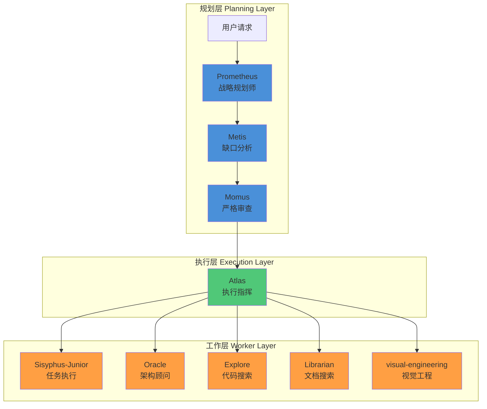
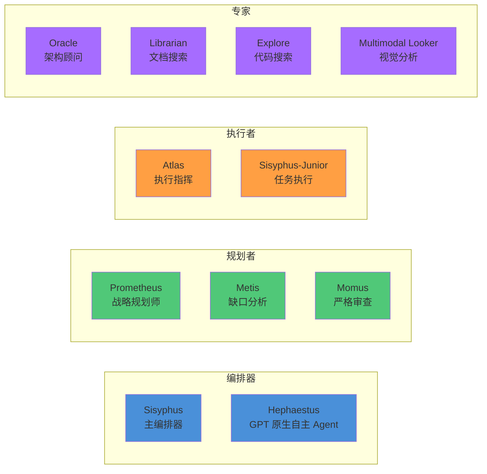
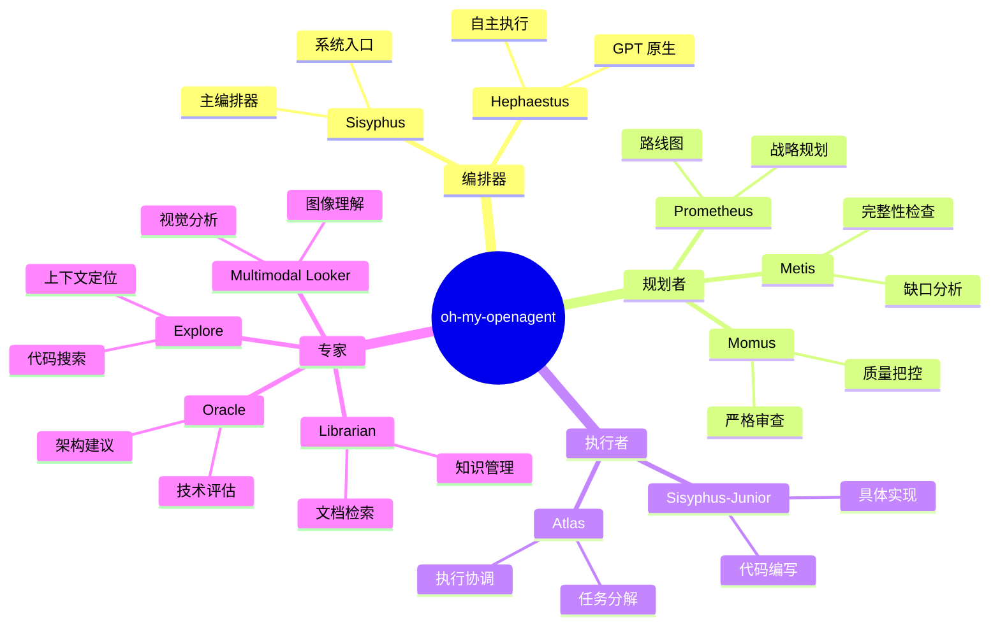
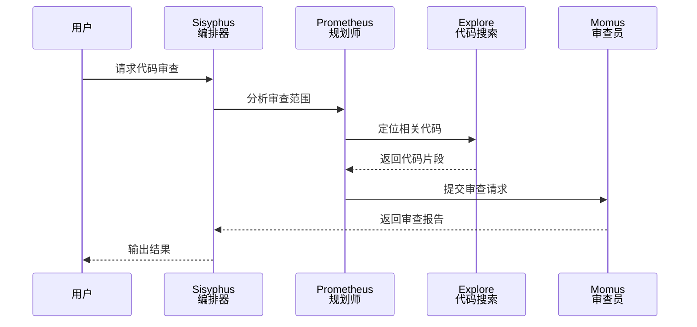
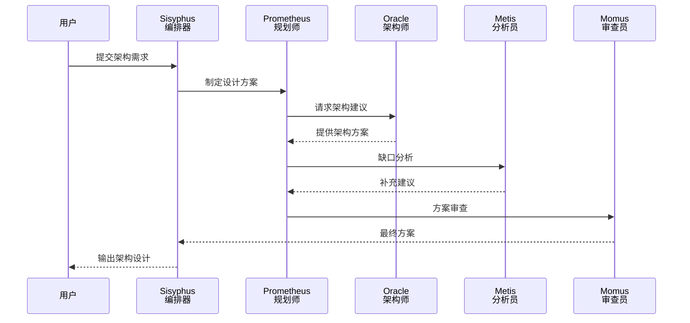

# oh-my-openagent 概览

## 项目定位

**oh-my-openagent** 是 OpenCode 的多模型 Agent 编排系统，将单个 AI Agent 转换为协调的开发团队。它打破了单一模型的限制，让不同专长的 Agent 协同工作，实现更高效、更专业的 AI 辅助开发体验。

## 核心理念

### 模型无关设计

oh-my-openagent 不绑定任何模型提供商，支持：

- **Anthropic Claude** (Opus, Sonnet, Haiku)
- **OpenAI** (GPT 系列)
- **Google** (Gemini 系列)
- **国内模型** (Kimi、DeepSeek 等)
- **75+ Provider** 通过 OpenCode 集成

### 智能任务路由

通过 **Category 系统** 自动将任务路由到最合适的模型：

- 复杂推理任务 → 高能力模型 (Claude Opus, GPT-5)
- 快速响应任务 → 轻量模型 (GPT-5.4-mini-fast)
- 视觉分析任务 → 多模态模型

### 专业化分工协作

每个 Agent 专注于特定领域，形成类似人类团队的协作模式：

- 规划者负责战略
- 执行者负责实施
- 审查者负责质量把控

## 三层架构



### 架构说明

| 层级 | 职责 | Agent |
|------|------|-------|
| **规划层** | 理解需求、制定计划、审查方案 | Prometheus, Metis, Momus |
| **执行层** | 协调任务、分配工作 | Atlas |
| **工作层** | 执行具体任务、提供专业能力 | Sisyphus-Junior, Oracle, Explore, Librarian, visual-engineering |

## 11 个内置 Agent



### Agent 详细说明

| Agent | 职责 | 推荐模型 | 说明 |
|-------|------|---------|------|
| **Sisyphus** | 主编排器 | Claude Opus 4.7 / Kimi K2.6 | 系统核心，协调所有 Agent 的工作流程 |
| **Hephaestus** | GPT 原生自主 Agent | GPT-5.5 | 专为 OpenAI 模型优化的自主执行 Agent |
| **Prometheus** | 战略规划师 | Claude Opus 4.7 / GPT-5.5 | 分析需求，制定高层策略和实施路线图 |
| **Atlas** | 执行指挥 | Claude Sonnet 4.6 / Kimi K2.6 | 将计划分解为具体任务，协调执行 |
| **Oracle** | 架构顾问 | GPT-5.5 / Claude Opus 4.7 | 提供架构建议，评估技术方案 |
| **Librarian** | 文档搜索 | GPT-5.4-mini-fast | 快速检索项目文档和知识库 |
| **Explore** | 代码搜索 | GPT-5.4-mini-fast | 在代码库中定位相关代码片段 |
| **Metis** | 缺口分析 | Claude Sonnet 4.6 | 识别方案中的遗漏和不足 |
| **Momus** | 严格审查 | GPT-5.5 | 批判性审查，确保方案质量 |
| **Multimodal Looker** | 视觉分析 | GPT-5.5 | 分析图像、图表等视觉内容 |
| **Sisyphus-Junior** | 任务执行 | Claude Sonnet 4.6 | 执行具体开发任务 |

### Agent 分类



## 与 OpenCode 集成

### 配置文件

oh-my-openagent 通过 `.opencode/oh-my-openagent.json` 配置：

```json
{
  "agents": {
    "sisyphus": {
      "model": "claude-opus-4-7",
      "category": "reasoning"
    },
    "atlas": {
      "model": "claude-sonnet-4-6",
      "category": "execution"
    },
    "librarian": {
      "model": "gpt-5-4-mini-fast",
      "category": "search"
    }
  },
  "workflows": {
    "planning": ["prometheus", "metis", "momus"],
    "execution": ["atlas", "sisyphus-junior"],
    "consultation": ["oracle"]
  }
}
```

### 安装方式

```bash
# 通过 bunx 安装
bunx oh-my-opencode install

# 或手动配置
mkdir -p .opencode
cp oh-my-openagent.json .opencode/
```

### Provider 支持

通过 OpenCode 的统一接口，oh-my-openagent 支持 **75+ Provider**：

| 类型 | Provider 示例 |
|------|--------------|
| 国际云服务 | OpenAI, Anthropic, Google AI, AWS Bedrock, Azure OpenAI |
| 国内云服务 | 阿里云百炼, 百度千帆, 腾讯混元, 智谱 AI |
| 开源模型托管 | Together AI, Fireworks, Replicate, Hugging Face |
| 本地部署 | Ollama, vLLM, LocalAI |

## 工作流示例

### 代码审查工作流



### 架构设计工作流



## 最佳实践

### 模型选择策略

| 任务类型 | 推荐配置 | 原因 |
|---------|---------|------|
| 复杂架构设计 | Prometheus + Oracle (Opus/GPT-5) | 需要深度推理能力 |
| 快速代码搜索 | Explore + Librarian (mini-fast) | 响应速度快，成本低 |
| 严格质量审查 | Momus (GPT-5.5) | 批判性思维强 |
| 日常开发任务 | Atlas + Sisyphus-Junior (Sonnet/Kimi) | 性价比高 |

### 成本优化

1. **分层使用模型**：规划用强模型，执行用中等模型，搜索用轻量模型
2. **缓存结果**：Librarian 和 Explore 的搜索结果可复用
3. **并行执行**：多个独立任务可由 Atlas 并行分配

### 调试技巧

```bash
# 查看当前 Agent 配置
opencode agents list

# 查看特定 Agent 状态
opencode agents show sisyphus

# 测试 Agent 响应
opencode agents test prometheus "设计一个用户认证系统"
```

## 相关资源

- **OpenCode 官方文档**: https://opencode.ai/docs
- **oh-my-openagent 仓库**: https://github.com/anomalyco/oh-my-openagent
- **OpenCode GitHub**: https://github.com/anomalyco/opencode

---

> 本文档是 OpenCode 生态系统的一部分，更多内容请参考本书其他章节。
