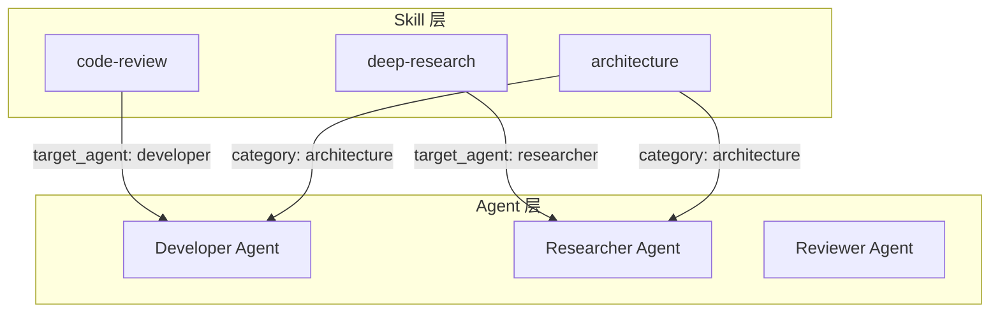

# Ch5: Skill 开发

## 概述

本章面向希望编写自定义Skill的读者，从格式规范到发布流程，从模板复用到底层原则，系统讲解Skill开发的完整知识体系。核心产出是4个可复用的Skill模板（调查研究/架构设计/代码审查/敏捷活动），以及设计时可参考的最佳实践和反模式清单。读完本章后，读者应该能够独立创建并发布一个高质量Skill。

**章节核心主题**：从"使用者"到"创造者"——Skill开发的完整方法论。

> **章节规模**：5 篇文章（3 现有 + 2 新增）

## 文章

### Article 5.1: 创建 Skill
- **阅读时间**：20 min
- **学习目标**：
  - 掌握SKILL.md frontmatter所有字段的含义和约束
  - 理解Skill的目录结构和捆绑资源（scripts/templates）
  - 掌握Skill的加载机制和发现路径
  - 了解Skills Marketplace的发布流程
- **前置知识**：Ch2概念理解，特别是Article 2.2（Skill系统）
- **源材料映射**：OpenCode实战 01（SKILL.md格式、发现路径）+ OpenCode实战 04（Skill做DSL）+ OpenCode实战 05（附录SKILL开发指南）

#### 大纲
1. SKILL.md格式深入
   - frontmatter字段详解（必填+可选）：
     - name（1-64字符，小写连字符）
     - description（1-1024字符，语义匹配的精确性）
     - allowed-tools（工具白名单，控制权限边界）
     - target_agent（v4.3+，作用域限定）
     - license, metadata, compatibility
   - 正文结构设计：工作流 + 指令 + 输出规范
   - 捆绑资源：scripts/（可执行脚本） + templates/（输出模板）
2. 目录结构和命名规范
   - 标准目录树
   - 命名规则
3. Skill加载机制的深入理解
   - 渐进式披露：元数据→正文→捆绑资源
   - 按需激活：描述匹配才加载
   - Debug技巧：为什么Skill不加载
4. Skills Marketplace发布
   - OMO Marketplace的作用
   - 发布流程
   - 版本管理和更新通知
5. 第一个Skill的完整创建过程

#### 核心概念
- **description设计的艺术**：太宽容易误触发，太窄难以匹配。最好包含触发词+场景+排除词。
- **allowed-tools是安全边界**：给Skill设置最小工具集，是Harness Engineering"可控"原则的体现。
- **渐进式披露的效率设计**：只在需要时加载完整内容，避免浪费Token。

#### 代码/配置示例
- 完整SKILL.md示例（多种类型）
- allowed-tools配置示例
- target_agent作用域示例
- 捆绑资源使用示例

##### frontmatter 字段详解

| 字段 | 类型 | 必需 | 描述 | 示例 |
|------|------|------|------|------|
| `name` | string | ✅ | Skill 唯一标识符（小写+连字符） | `deep-research` |
| `description` | string | ✅ | 一句话说明核心能力 | "用于需要网络研究的任何问题" |
| `allowed-tools` | string[] | ❌ | 限制可用的工具列表 | `["WebSearch", "WebFetch"]` |
| `target_agent` | string | ❌ | 目标 Agent（Scoped Skills） | `researcher` |
| `version` | string | ❌ | 版本号 | `1.0.0` |
| `author` | string | ❌ | 作者 | `opencode-community` |

**description 写作模板**：
```yaml
description: |
  [一句话说明核心能力]
  提供：[该 Skill 包含的资源]
  适用：[触发场景1]、[触发场景2]
  不适用：[边界场景1]
```

**示例**：
```yaml
---
name: deep-research
description: |
  用于需要网络研究的任何问题，替代 WebSearch。
  提供：系统化的多角度研究方法论，而非单一浅层搜索。
  适用：当用户询问"什么是 X"、"解释 X"、"比较 X 和 Y"、"研究 X"。
  不适用：简单的代码修改任务。
  allowed-tools:
    - WebSearch
    - WebFetch
    - Read
    - Grep
---
```

#### Mermaid 图表
- Skill加载机制流程图（渐进式披露）
- Skill目录结构图

#### 关联章节
- ← Article 2.2（Skill系统的理论基础）
- → Article 5.2（模板复用）
- → Article 5.3（最佳实践）

#### 验证标准
- [ ] 文章 ≥ 200 行有效内容
- [ ] 覆盖frontmatter所有字段
- [ ] 包含完整的SKILL.md创建步骤
- [ ] 包含多个不同用途的SKILL.md示例

---

### Article 5.2: Skill 模板
- **阅读时间**：25 min
- **学习目标**：
  - 获得4个可复用的Skill模板
  - 理解每个模板的设计动机和适用场景
  - 掌握根据需求定制模板的方法
- **前置知识**：Article 5.1（SKILL.md格式基础）
- **源材料映射**：OpenCode实战 01（Skill示例agile-coach）+ OpenCode实战 04（Skill做DSL、PM工作台）+ OpenCode实战 02（安全检查Skill示例）

#### 大纲
1. 模板1：调查研究Skill
   - 用途：技术选型、竞品分析、领域调研
   - 核心能力：websearch + read + mindmap输出
   - 完整SKILL.md正文
   - 适用场景和定制指南
2. 模板2：架构设计Skill
   - 用途：系统设计、技术方案产出
   - 核心能力：uml + arhitecture + read
   - 完整SKILL.md正文
   - 包含ADR输出模板
3. 模板3：代码审查Skill
   - 用途：PR审查、代码质量检查
   - 核心能力：read + grep + lsp_diagnostics
   - 完整SKILL.md正文
   - 审查清单模板
4. 模板4：敏捷活动Skill
   - 用途：站会、回顾、Sprint规划
   - 核心能力：read + edit（只写会议记录）
   - 完整SKILL.md正文
   - 各种活动的引导流程

#### 核心概念
- **模板是设计模式的具象化**：每个模板对应一类常见任务的工作流设计模式。
- **可组合性高于完整性**：好的Skill应该能与其他Skill组合使用，而不是一个大而全的"瑞士军刀"。
- **模板的骨架 vs 血肉**：提供骨架（流程+检查项），让用户填充血肉（具体规范）。

#### 代码/配置示例
- 4个完整SKILL.md文件
- 每种模板的适用场景和触发词

##### 完整 Skill 模板示例

**模板 1：调查研究 Skill**
```yaml
---
name: deep-research
description: |
  用于需要网络研究的任何问题。
  提供：系统化的多角度研究方法论。
  适用：当用户询问"什么是 X"、"比较 X 和 Y"。
allowed-tools: [WebSearch, WebFetch, Read, Grep]
---

# Deep Research Skill

## 研究方法论

1. **问题分解**：将复杂问题拆分为子问题
2. **多源验证**：从多个来源验证信息
3. **结构化输出**：生成有组织的研究报告
```

**模板 2：架构设计 Skill**
```yaml
---
name: architecture-consultant
description: |
  在进行系统架构设计、技术选型评估时使用。
  提供：TOGAF/ArchiMate 建模、ADR 模板。
  适用：架构设计、技术选型、架构评审。
allowed-tools: [SearchCodebase, Glob, Read, Write]
---

# Architecture Consultant Skill

## 架构设计流程

1. **需求分析**：收集非功能需求
2. **技术选型**：评估候选技术栈
3. **架构建模**：使用 ArchiMate 建模
4. **决策记录**：编写 ADR
```

**模板 3：代码审查 Skill**
```yaml
---
name: requesting-code-review
description: |
  完成任务、实现主要功能或合并之前使用。
  提供：代码审查清单、最佳实践检查。
  适用：代码审查、合并前验证。
allowed-tools: [Read, Grep, SearchCodebase]
---

# Code Review Skill

## 审查维度

1. **正确性**：逻辑是否正确
2. **可读性**：代码是否易于理解
3. **安全性**：是否有安全风险
4. **性能**：是否有性能问题
```

**模板 4：敏捷活动 Skill**
```yaml
---
name: agile-coach
description: |
  协调安全智能团队或软件研发团队执行敏捷活动。
  提供：Sprint 规划、站会、评审、回顾。
  适用：Sprint 规划、站会、评审、回顾。
---

# Agile Coach Skill

## Superpowers 工作流

1. **头脑风暴**：需求收集
2. **计划**：Sprint 计划
3. **实施**：执行任务
4. **评审**：代码审查
5. **验证**：验收测试
6. **交付**：部署上线
```

**模板 5：UI 审查 Skill**
```yaml
---
name: ui-designer
description: |
  在进行界面设计、交互原型制作时使用。
  提供：设计系统构建、可访问性合规。
  适用：UI 设计、交互设计、设计系统。
allowed-tools: [Read, Write, Glob]
---

# UI Designer Skill

## 设计审查维度

1. **视觉层级**：信息是否清晰
2. **可访问性**：WCAG 合规
3. **响应式**：多端适配
4. **一致性**：设计系统遵循
```

#### Mermaid 图表
- 模板选择决策树

#### 关联章节
- ← Article 5.1（模板使用SKILL.md格式）
- → Article 5.3（模板设计中的最佳实践）
- ← Article 2.2（模板体现Skill的设计理念）

#### 验证标准
- [ ] 文章 ≥ 250 行有效内容
- [ ] 4个模板均为完整的SKILL.md（可直接使用）
- [ ] 每个模板包含适用场景和定制指南
- [ ] 模板间体现可组合性

---

### Article 5.3: 最佳实践
- **阅读时间**：20 min
- **学习目标**：
  - 掌握Skill设计的6条核心原则
  - 识别10+常见反模式
  - 掌握8步调试清单
  - 理解Team Mode中Skill的作用域和集成方式
- **前置知识**：Articles 5.1 + 5.2
- **源材料映射**：OpenCode实战 05（附录：调试清单 + 常见陷阱）+ OpenCode实战 02（作用域技能Scoped Skills）+ OpenCode实战 04（Skill做DSL的经验）

#### 大纲
1. Skill设计6条核心原则
   - 单一职责：一个Skill只解决一个领域问题
   - 可组合：Skill之间能通过Agent编排串联
   - 精准触发：description设计精确到不用看正文就知道是否匹配
   - 最小权限：只给完成任务必需的工具
   - 可测试：Skill有明确的输入输出和验证方式
   - 版本声明：明确标记版本和兼容性
2. 10+反模式及正确做法
   - ❌ 超长Skill（>500行）→ ✅ 拆分为多个子Skill
   - ❌ 全能Skill（名字叫"全栈开发"）→ ✅ 专注一个领域
   - ❌ 把Agent当Skill用（在Skill里定义Agent行为）→ ✅ Skill只做方法论
   - ❌ 硬编码模型名 → ✅ 使用类别路由
   - ❌ 不带allowed-tools → ✅ 始终设置最小工具集
   - ❌ 忽略target_agent → ✅ 需要限定时必须声明
   - ❌ 测试依赖外部系统 → ✅ 使用Mock或明确标注
   - ❌ 不写version → ✅ 语义化版本管理
   - ❌ Skill中的指令模糊 → ✅ 步骤化、可执行的流程
   - ❌ 捆绑大型资源文件 → ✅ 轻量引用
3. 8步调试清单
   - 格式检查→配置检查→路径检查→禁用检查→作用域检查→匹配检查→覆盖检查→Agent类型检查
4. Team Mode中的Skill集成
   - target_agent + 类别路由协同
   - 成员间Skill不可见的设计价值
   - Overrides的最佳用法

#### 核心概念
- **最小权限原则的工程意义**：给Skill超过需要的工具，就像给实习生root权限——短期方便但长期危险。
- **单一职责的Skill编排价值**：当每个Skill都很"小"时，Agent可以灵活组合它们完成复杂任务。
- **可测试的Skill才是好Skill**：如果不知道一个Skill在什么场景下应该输出什么结果，就无法判断它是否正常工作。

#### 代码/配置示例
- 反模式vs正确做法的对比示例
- 8步调试清单的可操作命令

##### Skill 开发反模式清单

| # | 反模式 | 问题 | 正确做法 |
|---|--------|------|---------|
| 1 | **硬编码凭证** | API Key 直接写在 Skill 中 | 使用环境变量 `{env:API_KEY}` |
| 2 | **description 过长** | 超过 200 字，难以快速理解 | 控制在 50-100 字 |
| 3 | **工具权限过大** | allowed-tools 包含不必要工具 | 遵循最小权限原则 |
| 4 | **缺少触发条件** | 用户不知道何时使用 | 在 description 中明确适用场景 |
| 5 | **指令过于抽象** | "做好代码审查" 无具体步骤 | 提供可执行的步骤清单 |
| 6 | **忽略错误处理** | 假设所有操作都成功 | 添加错误处理和回退逻辑 |
| 7 | **过度依赖外部工具** | 每个 Skill 都需要 MCP | 优先使用内置工具 |
| 8 | **缺少版本管理** | 修改后无法回滚 | 使用 Git 管理 Skill |
| 9 | **测试覆盖不足** | 只测试正向场景 | 测试触发/负向/输出三种场景 |
| 10 | **忽略性能影响** | Skill 加载时间过长 | 按需加载详细文档 |
| 11 | **缺少文档** | 其他开发者无法理解 | 添加注释和使用示例 |
| 12 | **硬编码路径** | 使用绝对路径 | 使用相对路径或配置变量 |

##### Skill 调试清单（8 步）

1. **检查 frontmatter 格式**
   - YAML 语法是否正确
   - 必需字段是否完整
   - 字段类型是否匹配

2. **验证 description 质量**
   - 是否清晰说明核心能力
   - 是否包含触发条件
   - 是否说明不适用场景

3. **测试工具权限**
   - allowed-tools 是否包含所需工具
   - 是否有多余的工具权限
   - 工具名称拼写是否正确

4. **检查 Skill 文件位置**
   - 是否在正确的目录
   - 文件名是否与 name 字段一致
   - 是否有命名冲突

5. **验证触发条件**
   - 正向测试：应该触发时是否触发
   - 负向测试：不应触发时是否误触发
   - 边界测试：边界条件是否正确处理

6. **检查输出格式**
   - 输出是否符合预期
   - 是否有格式错误
   - 是否有缺失信息

7. **测试性能**
   - Skill 加载时间是否可接受
   - 执行时间是否合理
   - 是否有内存泄漏

8. **验证与其他 Skill 的兼容性**
   - 是否有命名冲突
   - 是否有工具权限冲突
   - 是否有依赖问题

#### Mermaid 图表
- Skill设计原则概念图
- 反模式汇总图
- 调试流程决策图

#### 关联章节
- ← Article 5.1 + 5.2（前两篇文章的提炼和升华）
- ← Ch2（Skill理论基础）
- → Ch4（Skill在Team Mode中的应用）

### 团队角色评审补充
- **架构顾问需求**：Article 5.2 模板2（架构设计Skill）增加ADR作为标准输出物；Article 5.3 核心原则增加"架构规范可编码"——将架构规则编码为Skill检查步骤。
- **安全架构师需求**：Article 5.2 增加第5个模板——安全审计Skill模板（含allowed-tools白名单、审计报告模板）；Article 5.3 反模式增加第11条——"Skill中嵌入硬编码凭证"。
- **前端架构师需求**：Article 5.2 增加"UI审查Skill"模板（检查组件可访问性、样式一致性、响应式适配）；Article 5.3 反模式增加前端开发者熟悉的语言描述。
- **渗透测试员需求**：Article 5.2 增加至少2个安全测试Skill示例（端口扫描、CVE检测）。

---

## 章节重构增补

> **源材料说明**：《驾驭工程：从 Claude Code 源码到 AI 编码最佳实践》（中文别名：《马书》）是一本 Engineering（驾驭工程）的中文技术书。它以 Claude Code `v2.1.88` 的公开发布包与 source map 还原结果为分析材料，从真实工程实现中提炼 AI 编码 Agent 的架构模式、上下文策略、权限体系和生产实践。在线阅读：https://zhanghandong.github.io/harness-engineering-from-cc-to-ai-coding/

> **说明**：本章按章节重构计划无现有文章修改，仅新增 2 篇文章。

### Article 5.4: Skill-MCP 桥接
- **阅读时间**：20 min
- **学习目标**：
  - 理解 Skill 作为 MCP 桥接层的设计模式
  - 掌握如何将外部工具包装为可复用的 Skill
  - 理解 Skill 与 MCP 的分工关系
- **前置知识**：Article 2.2（Skill 系统），Ch6 MCP 概念
- **源材料映射**：《马书》第22章，HE实践 02

#### 大纲
1. 为什么需要 Skill-MCP 桥接
   - Skill 擅长的：方法论、流程、最佳实践
   - MCP 擅长的：外部工具集成、数据访问
   - 桥接模式：Skill 定义"怎么做"，MCP 提供"用什么做"
2. 桥接模式的设计
   - Skill 内部调用 MCP 工具的 workflow
   - MCP Server 作为 Skill 的"外部能力层"
   - 权限和工具隔离设计
3. 桥接实战示例
   - 调查研究 Skill + WebSearch MCP
   - 代码审查 Skill + Git MCP
   - 数据查询 Skill + Database MCP
4. 《马书》第22章的 MCP 桥接框架
   - 《马书》第22章的桥接模式在 OpenCode 中的实现
   - Skill-embedded MCPs 配置
5. 最佳实践与反模式

#### 核心概念
- **Skill 是大脑，MCP 是手**：Skill 定义思考方法和流程，MCP 提供执行能力
- **桥接的解耦价值**：Skill 不关心底层工具的具体实现，MCP 不关心上层的业务逻辑

#### 代码/配置示例
- Skill 中引用 MCP Tool 的配置
- skill-mcp-bridge 的完整 SKILL.md
- 多个 MCP 在同一个 Skill 中的编排

##### Skill-MCP 桥接实现

**设计模式**：Skill 作为 MCP 桥接层


**实现示例**：

```yaml
---
name: github-operations
description: |
  GitHub 仓库操作 Skill。
  提供：Issue 管理、PR 操作、仓库查询。
  适用：GitHub 相关操作。
allowed-tools: [mcp_github]
---

# GitHub Operations Skill

## MCP 配置

```json
{
  "mcp": {
    "servers": {
      "github": {
        "type": "local",
        "command": ["npx", "-y", "@github/github-mcp-server"],
        "environment": {
          "GITHUB_TOKEN": "{env:GITHUB_TOKEN}"
        }
      }
    }
  }
}
```

## 使用方式

1. **创建 Issue**：`mcp_github_create_issue`
2. **创建 PR**：`mcp_github_create_pr`
3. **查询仓库**：`mcp_github_list_repos`
```

**安全注意事项**：
- MCP Server 需要独立的权限控制
- 敏感操作需要用户确认
- 定期审计 MCP Server 日志

#### Mermaid 图表
- Skill-MCP 桥接架构图
- 桥接模式的工作流程图

#### 关联章节
- ← Article 2.2（Skill 系统的理论基础）
- ← Ch6 §6.1（MCP 协议和配置基础）
- → Article 5.5（插件化模式是桥接的进阶）

#### 验证标准
- [ ] 文章 ≥ 200 行有效内容
- [ ] 包含桥接模式的完整架构说明
- [ ] 包含至少 2 个桥接实战示例
- [ ] 包含 Skill-embedded MCP 配置

---

### Article 5.5: Skill 插件化模式
- **阅读时间**：15 min
- **学习目标**：
  - 理解 Skill 从独立到组合的演进路径
  - 掌握 Skill 市场的发布和使用方法
  - 理解 Skill 组合的设计模式
- **前置知识**：Article 5.4（Skill-MCP 桥接）
- **源材料映射**：《马书》第22b章

#### 大纲
1. Skill 的演进阶段
   - 阶段一：独立 Skill（单一任务）
   - 阶段二：组合 Skill（多个 Skill 协作）
   - 阶段三：Skill 市场（生态化）
2. 组合 Skill 的模式
   - 编排模式：一个主 Skill 调度多个子 Skill
   - 管道模式：多个 Skill 串联成处理流水线
   - 集市模式：按需选择 Skill 组合
3. Skills Marketplace
   - 发布流程和版本管理
   - Skill 的评分和发现机制
   - 企业私有 Skill 市场
4. 插件化设计原则
   - 接口契约（输入/输出标准化）
   - 版本兼容性（SemVer）
   - 依赖管理

#### 核心概念
- **Skill 的"组件化"思维**：将 Skill 看作可组合的组件，而不是大而全的"瑞士军刀"
- **市场的网络效应**：Skill 越多人使用，质量越高，生态越丰富

#### 代码/配置示例
- 组合 Skill 的配置示例
- Skill 依赖声明
- Skills Marketplace 发布清单

##### Skill 演进三阶段

| 阶段 | 描述 | 特征 | 示例 |
|------|------|------|------|
| **阶段 1：独立 Skill** | 单一功能，自包含 | 简单、易维护 | `deep-research` |
| **阶段 2：组合 Skill** | 调用其他 Skill | 复用、模块化 | `full-stack-dev` 调用 `frontend` + `backend` |
| **阶段 3：Skills Marketplace** | 社区共享、版本管理 | 生态、协作 | OMO Skills Marketplace |

**演进路径**：


**最佳实践**：
- 从独立 Skill 开始，验证价值后再组合
- 组合 Skill 时注意依赖管理
- 发布到 Marketplace 前进行安全审查

#### Mermaid 图表
- Skill 从独立 → 组合 → 市场的演进图
- 组合 Skill 的三种协作模式图

#### 关联章节
- ← Article 5.4（桥接是插件化的前置技术）
- → Ch7 §7.6（团队 Skill 市场案例）
- ← Article 2.2（Skill 系统的基础概念）

#### 验证标准
- [ ] 文章 ≥ 200 行有效内容
- [ ] 覆盖 Skill 演进的三个阶段
- [ ] 包含组合 Skill 的配置示例
- [ ] 包含 Skill 市场发布流程

---

## 团队协作工作流

### 团队分工

| 角色 | 职责 | 负责文章 |
|------|------|---------|
| **前端架构师**（FRONTEND） | 组件↔Skill 系统类比、UI 审查 Skill 模板、前端开发者视角的反模式描述 | Article 5.2(模板), Article 5.3 |
| **架构顾问**（SYSA） | 架构设计 Skill 模板（含 ADR 输出）、架构规范作为 Skill 检查步骤、"架构规范可编码"原则 | Article 5.2(模板2), Article 5.3 |
| **安全架构师**（SECURITY） | 安全审计 Skill 模板（第 5 个模板）、allowed-tools 白名单、硬编码凭证反模式 | Article 5.2(新增模板5), Article 5.3 |
| **渗透测试员**（REDTEAM） | 安全测试 Skill 示例（端口扫描、CVE 检测）、Skill 安全边界分析 | Article 5.2(安全模板), Article 5.4 |
| **后端架构师**（BACKEND） | Skill-MCP 桥接实现示例、API 契约设计规范、Skill 依赖版本管理 | Article 5.4, Article 5.5 |
| **需求分析师**（ANALYST） | 模板适用场景分析、Skill 描述匹配的精确性要求 | Article 5.1, Article 5.2 |
| **UI设计师**（UX） | 模板选择决策树视觉设计、Skill 目录结构图规范化 | 全文图表 |

### 流程规范（Superpowers 工作流映射）

| 阶段 | 本阶段活动 | 交付物 | 负责人 |
|------|-----------|--------|--------|
| **头脑风暴** | 确定 4（+1）个 Skill 模板的具体内容、收集安全审计流程、确定前端↔Skill 类比框架 | 模板清单、类比框架 | 前端架构师 + 安全架构师 |
| **计划** | 排序写作依赖（5.1→5.2→5.3→5.4→5.5）、分配模板写作任务、确定安全模板范围 | 写作计划、模板分配表 | 敏捷教练 |
| **实施** | 5 篇文章写作 + 4 个完整 SKILL.md 模板创建，重点保证模板可直接使用 | 5 篇文章初稿、4 个 SKILL.md 文件 | 各角色按分工 |
| **评审** | 模板完整性审查（所有模板含完整 frontmatter+正文+测试说明）、安全模板权限审查、类比准确性审查 | 评审报告、模板审查记录 | 架构顾问 + 安全架构师 |
| **验证** | 模板在测试 Agent 中可加载、Mermaid 渲染正确、反模式清单 ≥ 10 条 | 验证报告 | 测试工程师 |
| **交付** | 合并、将 4 个模板同步到 `examples/skills/` 目录、更新 Skills Marketplace 引用 | 合入确认、模板同步 | 敏捷教练 |

### 评审要求

**检查点 1：模板完整性（最重要的检查点）**
- 每个 SKILL.md 模板包含完整 frontmatter（name/description/allowed-tools/target_agent/license/metadata）
- 模板正文包含可执行的工作流步骤
- 每个模板的 `description` 字段经过语义匹配测试（不宽不窄）
- 安全审计模板的 `allowed-tools` 遵循最小权限原则

**检查点 2：反模式清单覆盖度**
- 反模式清单 ≥ 10 条
- 每条包含 ❌ 反模式描述 + ✅ 正确做法
- 至少包含 1 条安全相关反模式（硬编码凭证/过度权限）

**检查点 3：技术准确性**
- SKILL.md 格式与 OpenCode v1.15.x 实际支持的 frontmatter 字段一致
- Skill-MCP 桥接的配置语法正确
- `target_agent` 作用域规则与 v4.3+ 实际行为一致

### 质量验收要求

| 门禁类型 | 验收项 | 通过标准 |
|---------|--------|---------|
| 🔴 硬性 | 每篇文章有效行数 | ≥ 200 行（Article 5.2 ≥ 250 行） |
| 🔴 硬性 | 可复用 SKILL.md 模板 | ≥ 4 个完整模板 |
| 🔴 硬性 | 模板语法正确 | 所有 frontmatter 字段符合规范 |
| 🟡 质量 | 反模式清单 | ≥ 10 条 |
| 🟡 质量 | 模板测试说明 | 每个模板包含如何测试的描述 |
| 🟡 质量 | 安全模板 | ≥ 1 个安全审计/安全测试模板 |
| 📊 量化 | 调试步骤清单 | 8 步完整（格式→配置→路径→禁用→作用域→匹配→覆盖→Agent） |
| 📊 量化 | Mermaid 图表 | ≥ 4 张（加载图+决策树+桥接图+演进图） |

### 特殊内容技能映射

| 特殊内容 | 所需技能 | 适用文章 | 说明 |
|---------|---------|---------|------|
| Skill 加载机制流程图 | `bpmn` / `uml` | Article 5.1 | 渐进式披露流程 |
| Skill 目录结构图 | `graphviz` / `mindmap` | Article 5.1 | 目录树 |
| 模板选择决策树 | `mindmap` | Article 5.2 | 4 模板决策 |
| Skill 设计原则概念图 | `infographic` | Article 5.3 | 6 原则可视化 |
| 反模式汇总图 | `infographic` | Article 5.3 | 反模式一览 |
| 调试流程决策图 | `uml` | Article 5.3 | 8 步调试流程 |
| Skill-MCP 桥接架构图 | `architecture` | Article 5.4 | Skill↔MCP 分层 |
| Skill 演进图（独立→组合→市场） | `infographic` / `graphviz` | Article 5.5 | 三阶段演进 |
| 组合 Skill 协作模式图 | `uml` (序列图) | Article 5.5 | 编排/管道/集市 |

---

### Article 5.6: Skills 开发参考
- **阅读时间**：15 min
- **学习目标**：
  - 理解 Skill 文件结构
  - 掌握 Skill 配置选项
  - 了解 Skill 与 Agent 的关联
- **前置知识**：Article 5.1（SKILL.md 格式基础）
- **源材料映射**：OpenCode 官方文档 + Skills Marketplace 最佳实践

#### 大纲
1. Skill 文件结构
   - YAML 格式规范
   - 必需字段和可选字段
   - 正文结构设计
2. Skill 配置选项
   - model、agent、template
   - allowed-tools、metadata
   - 版本和兼容性声明
3. Skill 与 Agent 关联
   - 通过 agent 字段指定
   - 通过 category 字段路由
   - Team Mode 中的作用域

#### 核心概念
- **Skill**：领域特定的能力模块，封装方法论和最佳实践
- **template**：提示词模板，定义 Skill 的输出格式和结构
- **allowed-tools**：允许使用的工具列表，遵循最小权限原则

#### 代码/配置示例

##### Skill 文件结构完整示例

```yaml
---
# === 必需字段 ===
name: my-skill
description: |
  一句话说明核心能力。
  提供：该 Skill 包含的资源。
  适用：触发场景 1、触发场景 2。

# === 可选字段 ===
version: 1.0.0
author: your-name
license: MIT

# 工具权限控制
allowed-tools:
  - Read
  - Write
  - Glob

# Agent 关联
target_agent: developer

# 元数据
metadata:
  category: development
  tags: [code, review]
  compatibility: ">=1.15.0"
---

# Skill 正文

## 概述

[Skill 的详细说明和使用场景]

## 工作流程

1. **步骤一**：[具体操作]
2. **步骤二**：[具体操作]
3. **步骤三**：[具体操作]

## 输出规范

[定义 Skill 的输出格式和结构]

## 示例

[使用示例和预期输出]
```

##### Skill 配置选项详解

| 字段 | 类型 | 必需 | 描述 | 示例 |
|------|------|------|------|------|
| `name` | string | ✅ | Skill 唯一标识符（小写+连字符，1-64 字符） | `deep-research` |
| `description` | string | ✅ | 核心能力说明（1-1024 字符） | "用于网络研究" |
| `version` | string | ❌ | 语义化版本号 | `1.0.0` |
| `author` | string | ❌ | 作者标识 | `community` |
| `license` | string | ❌ | 开源许可证 | `MIT` |
| `allowed-tools` | string[] | ❌ | 可用工具白名单 | `["Read", "Write"]` |
| `target_agent` | string | ❌ | 目标 Agent（作用域限定） | `researcher` |
| `metadata` | object | ❌ | 扩展元数据 | `{category: "dev"}` |

##### Skill 与 Agent 关联模式



**关联方式对比**：

| 方式 | 字段 | 特点 | 适用场景 |
|------|------|------|---------|
| **精确指定** | `target_agent` | 一对一绑定，只对特定 Agent 可见 | 专用 Skill |
| **类别路由** | `metadata.category` | 按类别匹配，多个 Agent 可用 | 通用 Skill |
| **全局可见** | 无限制 | 所有 Agent 都可触发 | 基础 Skill |

#### Mermaid 图表
- Skill 文件结构图
- Skill-Agent 关联模式图
- 配置选项决策树

#### 关联章节
- ← Article 5.1（SKILL.md 格式基础）
- ← Article 2.2（Skill 系统理论基础）
- → Article 5.3（最佳实践）

#### 验证标准
- [ ] 文章 ≥ 200 行有效内容
- [ ] 包含 Skill 文件结构说明
- [ ] 包含 Skill 配置选项说明
- [ ] 包含 Skill 与 Agent 关联说明
