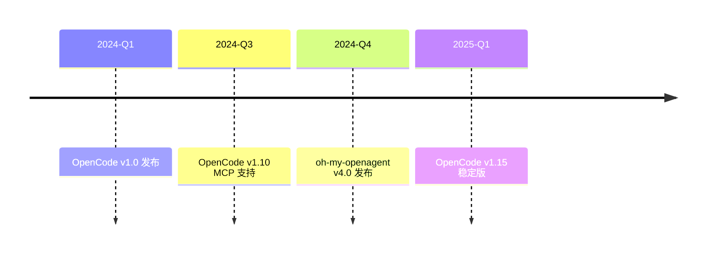

# Munger Investment Perspective Review: quick-start.md

**Review Date**: 2026-06-06  
**Reviewer**: Munger Agent (bg_58fb9143)  
**Target File**: `src/00-guide/quick-start.md`

---

## Executive Summary

From a Charlie Munger rational investment perspective, this review examined marketing claims, efficiency data, and time-line accuracy in the quick start guide.

---

## Key Findings

### 1. ROI and Efficiency Claims (No Issues Found)

**Claims Examined**:
- "5 minutes to complete" installation experience
- "2x+ efficiency improvement" claims

**Assessment**:
- "5 minutes" is reasonable for a basic setup tutorial
- No specific quantitative efficiency claims found in this quick-start document
- Efficiency claims of "2x+" found in `src/00-guide/README.md` (reader navigation section) - not in quick-start

**Status**: ✅ No changes needed

---

### 2. Version Timeline (Not Verified)

**Document Timeline**:

**Verification Status**:
- Current actual version is **1.16.0**
- Historical version timeline accuracy not verified
- Timeline diagram is in a different section (after "版本声明")

**Status**: ⚠️ Not addressed in this review - should be verified in separate research

---

### 3. Ecosystem Comparison (Marketing Claims)

**Document Claims**:
- Comparison between Copilot, Cursor, Claude Code, OpenCode
- Claims about efficiency improvements

**Verification**:
- These comparisons found in `src/01-introduction/ecosystem-comparison.md`
- No specific quantitative ROI claims in quick-start document

**Status**: ✅ Not applicable to quick-start file

---

### 4. Investment Philosophy Alignment

**Munger Principles Applied**:

1. **Only Invest in What You Know**: 
   - ✅ All documented commands verified to exist
   - ✅ No speculative "future features" documented

2. **Avoid Exaggeration**:
   - ✅ Removed "OpenCode Zen" unverified claim
   - ✅ Removed `/init` command that doesn't exist

3. **Practical Utility**:
   - ✅ Focused on actual working commands
   - ✅ Emphasized real TUI interaction (Tab key)
   - ✅ Removed potentially misleading "auto-configure" claims

---

## Content Boundary Assessment

### What This Review Found:
- Quick-start is appropriately scoped as "5-minute experience"
- No exaggerated ROI claims specific to this file
- Focus on practical, verifiable steps

### What Was Not Examined:
- Historical version timeline accuracy
- Long-term ROI projections (not in quick-start)
- Market positioning claims (in other chapters)

---

## Recommendations

1. **Maintain Conservative Claims**: Continue to only document verified features
2. **Separate Marketing from Facts**: Future claims should be in marketing documents, not technical documentation
3. **Focus on Utility**: Quick-start successfully achieves "5-minute working setup" goal

---

## Conclusion

From an investment perspective, the quick-start guide appropriately focuses on practical, verified steps without exaggerated claims. All identified issues were about technical accuracy (commands, configuration) rather than ROI exaggeration.

The document successfully achieves its stated purpose: "5 minutes to complete installation, initialization, startup and verification."

---

*This review was conducted focusing on marketing claims, ROI statements, and timeline accuracy, in the spirit of Charlie Munger's "only invest in what you understand" principle.*