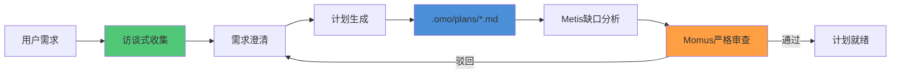
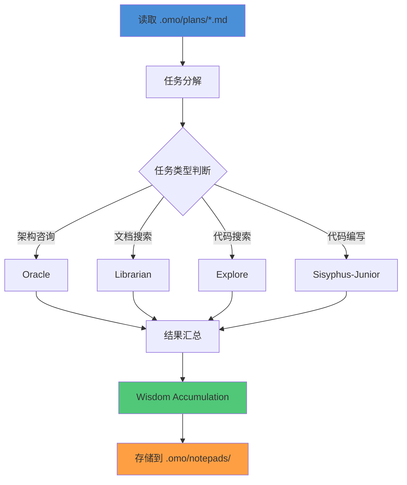
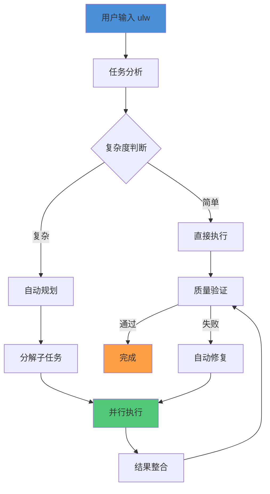
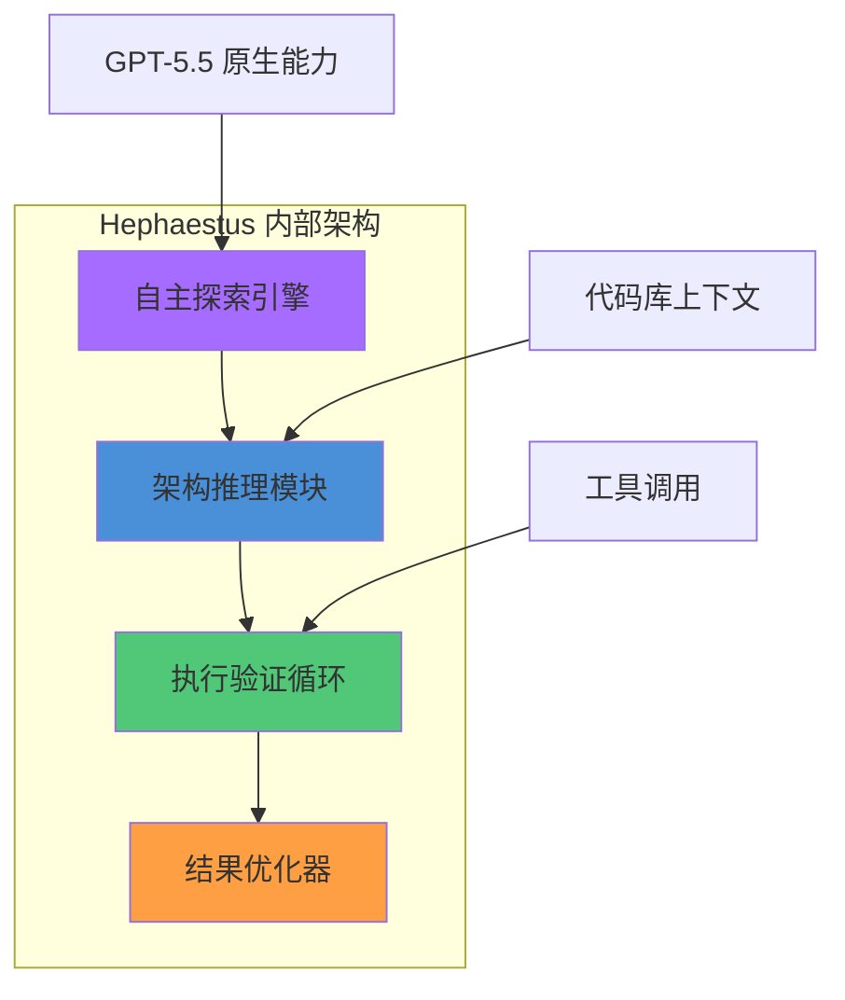
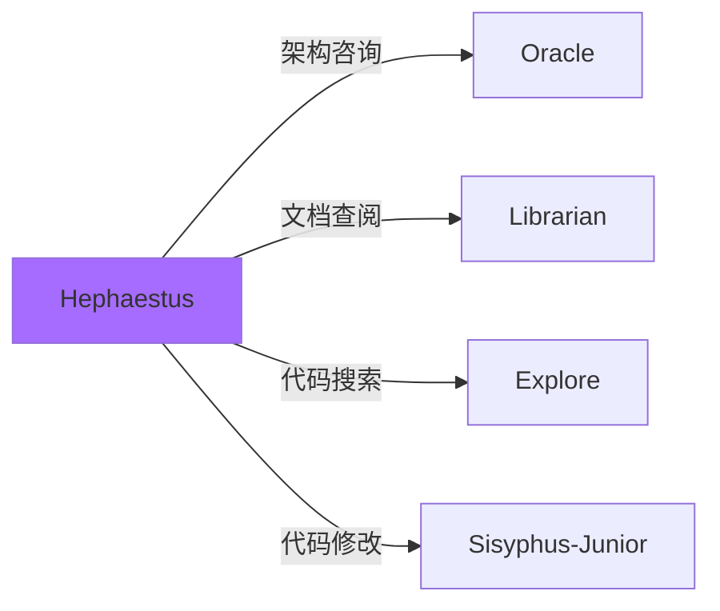
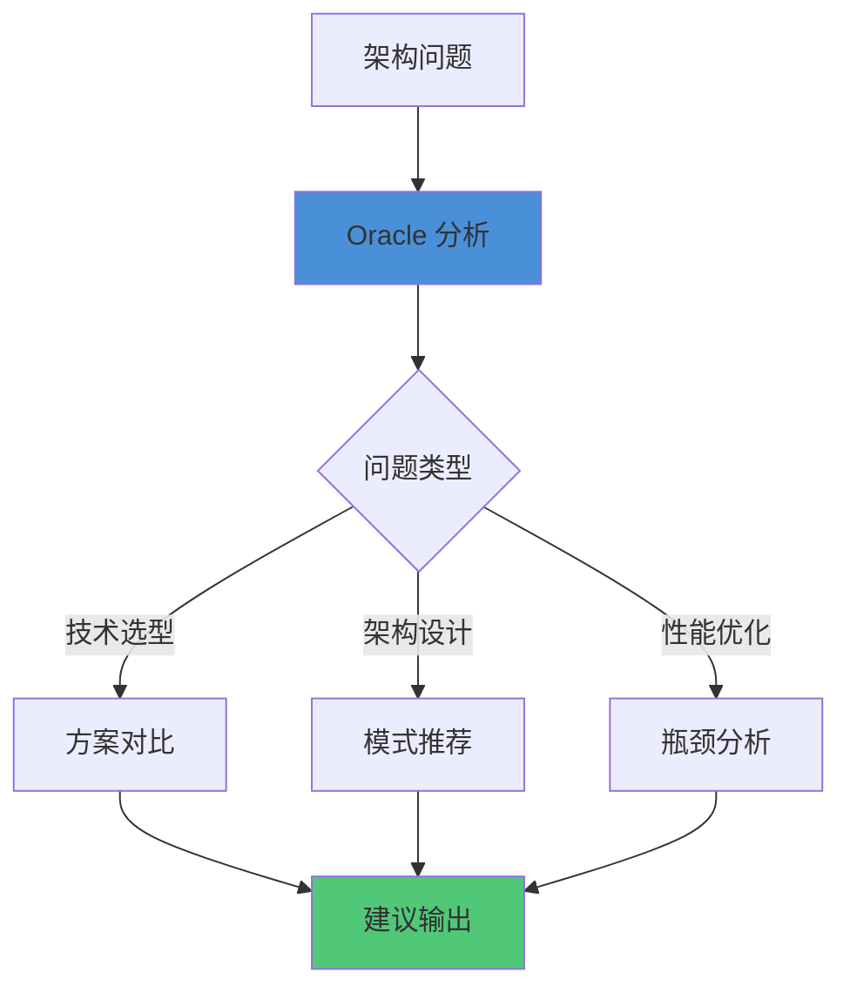
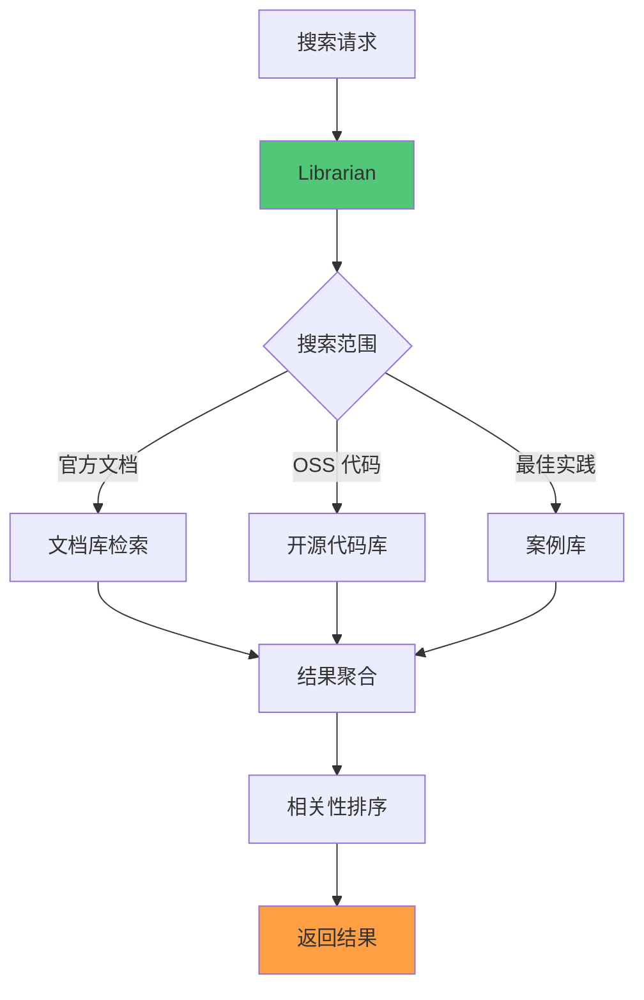
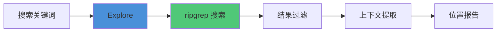
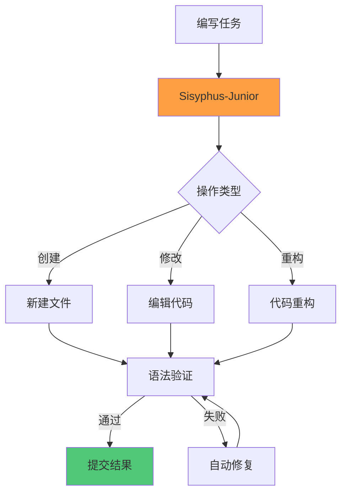

# Agent 编排指南

> OpenCode 多智能体编排架构参考手册。
> 涵盖规划模式、执行模式、主编排器、GPT 原生 Agent 和 Worker Agent 的完整协作流程。

---

## 概述

OpenCode 采用多智能体编排架构，通过角色分工和协作流程实现复杂任务的自动化执行。本文档描述五种核心 Agent 角色及其协作模式。

```mermaid
graph TB
    subgraph 用户层
        U[用户输入]
    end

    subgraph 编排层
        S[Sisyphus<br/>主编排器]
    end

    subgraph 规划层
        P[Prometheus<br/>规划模式]
        M[Metis<br/>缺口分析]
        Mo[Momus<br/>严格审查]
    end

    subgraph 执行层
        A[Atlas<br/>执行模式]
        H[Hephaestus<br/>GPT原生]
    end

    subgraph 工作层
        O[Oracle<br/>架构咨询]
        L[Librarian<br/>文档搜索]
        E[Explore<br/>代码搜索]
        SJ[Sisyphus-Junior<br/>代码编写]
    end

    U --> S
    S -->|@plan| P
    S -->|ulw| A
    S -->|GPT任务| H
    P --> M --> Mo
    Mo -->|计划通过| A
    A --> O & L & E & SJ
    H --> O & L & E & SJ

    style S fill:#4A90D9
    style P fill:#50C878
    style A fill:#FF9F43
    style H fill:#A66CFF
```

---

## 第一节：Prometheus 规划模式

### 核心职责

Prometheus 是访谈式需求收集和计划生成专家，负责将模糊的用户需求转化为可执行的实施计划。

### 工作流程



### 关键特性

| 特性 | 说明 |
|------|------|
| **访谈式收集** | 通过多轮问答澄清需求细节 |
| **计划存储** | 生成计划存储在 `.omo/plans/*.md` |
| **缺口分析** | Metis 自动识别计划中的信息缺口 |
| **严格审查** | Momus 对计划进行严格质量把关 |
| **只读模式** | 只能修改 `.omo/` 目录，保护项目文件 |

### 计划文件结构

```markdown
# 计划标题

## 需求摘要
[用户原始需求描述]

## 澄清记录
### Q1: [问题]
**A1:** [用户回答]

## 实施步骤
1. [步骤1]
2. [步骤2]
...

## 风险评估
- [风险1]: [缓解措施]
- [风险2]: [缓解措施]

## 验收标准
- [ ] [标准1]
- [ ] [标准2]
```

### 触发方式

```bash
# 通过 @plan 命令切换到 Prometheus 模式
@plan [需求描述]

# 示例
@plan 实现用户认证系统，支持 OAuth2.0 和 JWT
```

---

## 第二节：Atlas 执行模式

### 核心职责

Atlas 是任务分发和执行协调专家，负责读取 Prometheus 生成的计划并分发到合适的 Worker Agent。

### 工作流程



### 关键特性

| 特性 | 说明 |
|------|------|
| **计划驱动** | 读取 Prometheus 生成的计划作为执行蓝图 |
| **智能分发** | 根据任务类型路由到最合适的 Worker |
| **累积学习** | Wisdom Accumulation 机制持续优化执行策略 |
| **知识沉淀** | 执行经验存储在 `.omo/notepads/` 目录 |

### 任务路由规则

| 任务类型 | 目标 Worker | 路由条件 |
|----------|-------------|----------|
| 架构设计咨询 | Oracle | 涉及系统架构、技术选型 |
| 文档/OSS 代码搜索 | Librarian | 需要查阅外部文档或开源代码 |
| 快速代码定位 | Explore | 需要在代码库中 grep 搜索 |
| 实际代码编写 | Sisyphus-Junior | 需要创建或修改代码文件 |

### 累积学习机制

```
.omo/notepads/
├── patterns/          # 成功模式库
│   ├── api-design.md
│   └── error-handling.md
├── lessons/           # 失败教训库
│   └── antipatterns.md
└── context/           # 项目上下文
    └── architecture.md
```

---

## 第三节：Sisyphus 主编排器

### 核心职责

Sisyphus 是整个多智能体系统的核心编排器，负责接收用户输入、选择执行路径、协调各 Agent 协作。

### Fallback 链机制


| 优先级 | 模型 | 适用场景 |
|--------|------|----------|
| 1 | Claude Opus 4.7 | 复杂推理、代码生成 |
| 2 | Kimi K2.6 | 长上下文、中文优化 |
| 3 | GPT-5.5 | 通用任务、工具调用 |
| 4 | GLM-5 | 国产模型备选 |

### Ultrawork 模式

Ultrawork 是 Sisyphus 的自动化执行模式，输入 `ulw` 后自动完成复杂任务的全流程。



### 命令参考

| 命令 | 功能 | 示例 |
|------|------|------|
| `ulw` | Ultrawork 自动执行 | `ulw 实现用户登录功能` |
| `@plan` | 切换到 Prometheus 规划模式 | `@plan 重构支付模块` |
| `/start-work` | 开始执行已生成的计划 | `/start-work` |

---

## 第四节：Hephaestus GPT 原生 Agent

### 核心职责

Hephaestus 是专为 GPT-5.5 优化的原生 Agent，具备自主探索和执行能力，适合深度架构推理任务。

### 设计理念



### 关键特性

| 特性 | 说明 |
|------|------|
| **GPT-5.5 优化** | 充分利用 GPT-5.5 的推理和工具调用能力 |
| **自主探索** | 无需详细指令，自主发现问题和解决方案 |
| **架构推理** | 深度理解系统架构，进行复杂设计决策 |
| **执行验证** | 自动验证执行结果，迭代优化 |

### 适用场景

- 复杂系统架构设计
- 遗留系统重构规划
- 技术债务分析
- 跨模块影响评估

### 与其他 Agent 的协作



---

## 第五节：Worker Agent 体系

### Agent 角色概览

| Agent | 角色 | 权限模式 | 核心能力 |
|-------|------|----------|----------|
| **Oracle** | 架构咨询顾问 | 只读 | 架构分析、技术选型建议 |
| **Librarian** | 文档和 OSS 搜索专家 | 只读 | 外部文档检索、开源代码搜索 |
| **Explore** | 快速代码库搜索 | 只读 | ripgrep 高效搜索、代码定位 |
| **Sisyphus-Junior** | 实际代码编写者 | 读写 | 代码创建、修改、重构 |

### Oracle：架构咨询



**典型任务**：
- 微服务拆分建议
- 数据库选型分析
- 缓存策略设计
- API 设计评审

### Librarian：文档搜索



**典型任务**：
- 查找框架使用文档
- 搜索开源项目实现参考
- 获取 API 使用示例

### Explore：代码搜索



**典型任务**：
- 函数定义定位
- 变量使用追踪
- 代码模式搜索

### Sisyphus-Junior：代码编写



**典型任务**：
- 实现新功能
- 修复 Bug
- 代码重构
- 添加测试

---

## 第六节：使用决策树

### 完整决策流程

```mermaid
flowchart TB
    A[用户任务] --> B{任务复杂度}
    B -->|简单任务| C[直接提示]
    B -->|复杂任务| D{执行偏好}

    C --> E[单次执行]
    E --> F[完成]

    D -->|懒惰模式| G[ulw 自动执行]
    D -->|精确控制| H[@plan 规划模式]

    G --> I[Ultrawork 流程]
    I --> J{需要规划?}
    J -->|是| K[自动生成计划]
    J -->|否| L[直接执行]
    K --> L
    L --> M[结果验证]
    M -->|通过| F
    M -->|失败| N[自动修复]
    N --> L

    H --> O[Prometheus 访谈]
    O --> P[生成计划]
    P --> Q[Metis 缺口分析]
    Q --> R[Momus 审查]
    R -->|通过| S[/start-work 执行]
    R -->|驳回| O
    S --> T[Atlas 分发]
    T --> U[Worker 执行]
    U --> V[结果汇总]
    V --> F

    style A fill:#4A90D9
    style F fill:#50C878
    style G fill:#FF9F43
    style H fill:#A66CFF
```

### 决策指南

| 场景 | 推荐方式 | 命令 | 说明 |
|------|----------|------|------|
| 简单查询/修改 | 直接提示 | `请帮我...` | 单次交互即可完成 |
| 复杂任务 + 希望自动化 | Ultrawork | `ulw ...` | 自动规划并执行 |
| 复杂任务 + 需要精确控制 | 规划模式 | `@plan ...` | 先规划后执行 |
| 架构设计/技术选型 | Hephaestus | 自动路由 | GPT-5.5 深度推理 |

### 最佳实践

1. **简单任务直接做**：对于明确的单步任务，直接描述需求即可
2. **复杂任务先规划**：涉及多步骤、多文件的任务，使用 `@plan` 先生成计划
3. **懒惰时用 Ultrawork**：不想详细描述时，`ulw` 会自动推断和执行
4. **架构问题找 Hephaestus**：深度架构推理任务会自动路由到 GPT-5.5 优化 Agent

---

## 附录：目录结构

```
.omo/
├── plans/                    # Prometheus 生成的计划
│   ├── 2026-06-01-auth-system.md
│   └── 2026-06-02-payment-refactor.md
├── notepads/                 # Atlas 累积的知识
│   ├── patterns/             # 成功模式
│   ├── lessons/              # 失败教训
│   └── context/              # 项目上下文
└── config/                   # Agent 配置
    └── routing.yaml          # 路由规则配置
```

---

> **维护说明**：本文档描述 OpenCode 多智能体编排架构。当 Agent 能力或协作流程发生变化时，请更新对应章节。
>
> 最后更新：2026-06-02
