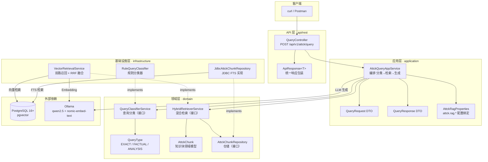

# ATT&CK RAG — Java（Spring Boot）

基于 Spring AI + pgvector 的 MITRE ATT&CK 中文知识库混合检索服务。

采用 **Scorpius DDD** 分层架构：REST API → Application Service → Domain Service → Infrastructure（pgvector + PostgreSQL FTS）。

---

## 架构概览



---

## 前置条件

| 组件 | 版本要求 | 说明 |
|------|---------|------|
| Java | 17+ | 项目使用 `java.version = 17` |
| Maven | 3.9+ | 构建工具 |
| PostgreSQL | 16+ | 需启用 `pgvector` 扩展 |
| Ollama | 最新 | 本地 LLM 服务 |

### 安装 pgvector

```sql
CREATE EXTENSION vector;
```

### 数据库建表

Java 侧使用 Spring JDBC 直连 pgvector，需提前创建 `attck_chunks` 表：

```sql
CREATE TABLE attck_chunks (
    id UUID PRIMARY KEY,
    chunk_text TEXT NOT NULL,
    embedding vector(768),
    metadata JSONB DEFAULT '{}'::jsonb,
    -- FTS 索引
    text_search tsvector GENERATED ALWAYS AS (
        to_tsvector('simple', chunk_text)
    ) STORED
);

CREATE INDEX idx_attck_chunks_embedding ON attck_chunks
    USING IVFFLAT (embedding vector_cosine_ops) WITH (lists = 100);
CREATE INDEX idx_attck_chunks_fts ON attck_chunks
    USING GIN (text_search);
```

> **注意**：Python `index_builder.py` 输出的是 SQLite 格式索引，不包含 `embedding` 向量列。Java 服务需要独立的向量数据写入机制。数据迁移脚本待实现。

---

## 快速开始

### 1. 配置 `application.yml`

检查 [`src/main/resources/application.yml`](src/main/resources/application.yml) 中的以下关键配置：

| 配置项 | 默认值 | 说明 |
|--------|--------|------|
| `server.port` | `8000` | 服务端口 |
| `spring.datasource.url` | `jdbc:postgresql://localhost:5432/attck_rag` | PostgreSQL 连接 |
| `spring.ai.openai.base-url` | `http://localhost:11434/v1` | Ollama API 地址 |
| `spring.ai.openai.chat.options.model` | `qwen2.5:7b-instruct-q4_K_M` | 默认聊天模型 |
| `spring.ai.openai.embedding.options.model` | `nomic-embed-text` | Embedding 模型 |
| `attck.rag.models.exact` | `qwen2.5:3b-instruct-q4_K_M` | 精确查询模型 |
| `attck.rag.models.factual` | `qwen2.5:3b-instruct-q4_K_M` | 事实查询模型 |
| `attck.rag.models.analysis` | `qwen2.5:7b-instruct-q4_K_M` | 分析查询模型 |

完整配置见 [`application.yml`](src/main/resources/application.yml)。

### 2. 确保 Ollama 运行

```bash
ollama pull qwen2.5:7b-instruct-q4_K_M
ollama pull nomic-embed-text
ollama serve
```

### 3. 启动服务

```bash
mvn spring-boot:run
```

---

## API 接口

### 查询知识库

```bash
curl -X POST http://localhost:8000/api/v1/attck/query \
  -H "Content-Type: application/json" \
  -d '{"question": "T1059 是什么", "topK": 5}'
```

**响应格式**：

```json
{
  "success": true,
  "message": "OK",
  "data": {
    "question": "T1059 是什么",
    "queryType": "exact",
    "disclosureDepth": 1,
    "answer": "T1059 是 Command and Scripting Interpreter（命令和脚本解释器）技术...",
    "sources": [
      {
        "id": "uuid-xxx",
        "level": "technique",
        "taId": "TA0002",
        "tId": "T1059",
        "score": "0.892"
      }
    ]
  },
  "timestamp": 1718000000000
}
```

### 健康检查

```bash
curl http://localhost:8000/api/v1/attck/health
# {"success":true,"message":"OK","data":"ok","timestamp":...}
```

---

## 项目结构

```
java/
├── pom.xml                                    # Maven 配置：Spring Boot 3.5 + Spring AI 1.1
├── README.md                                  # ← 本文件
└── src/
    └── main/
        ├── java/com/scorpius/knowledge/attck/
        │   ├── AttckKnowledgeApplication.java  # Spring Boot 启动类
        │   ├── api/
        │   │   └── rest/
        │   │       ├── QueryController.java    # POST /api/v1/attck/query
        │   │       └── ApiResponse.java        # 统一响应包装
        │   ├── application/
        │   │   ├── dto/
        │   │   │   ├── QueryRequest.java       # 请求 DTO（@NotBlank question）
        │   │   │   └── QueryResponse.java      # 响应 DTO（含 SourceItem）
        │   │   └── service/
        │   │       ├── AttckQueryAppService.java  # 编排 分类→检索→生成
        │   │       └── AttckRagProperties.java    # attck.rag.* 配置绑定
        │   ├── domain/
        │   │   ├── model/
        │   │   │   ├── AttckChunk.java         # 知识块领域模型
        │   │   │   └── QueryType.java          # EXACT / FACTUAL / ANALYSIS
        │   │   ├── repository/
        │   │   │   └── AttckChunkRepository.java # 仓储接口
        │   │   └── service/
        │   │       ├── QueryClassifierService.java  # 查询分类接口
        │   │       └── HybridRetrieverService.java  # 混合检索接口
        │   └── infrastructure/
        │       ├── persistence/
        │       │   └── JdbcAttckChunkRepository.java  # JDBC FTS 实现
        │       └── retrieval/
        │           ├── VectorRetrievalService.java    # 向量+FTS+RRF 实现
        │           └── RuleQueryClassifier.java       # 规则分类器
        └── resources/
            └── application.yml                      # 全部配置
```

---

## 查询流水线

每次查询经过 4 步：

### Step 1: 查询分类（Query Classification）

[`RuleQueryClassifier`](src/main/java/com/scorpius/knowledge/attck/infrastructure/retrieval/RuleQueryClassifier.java) 按规则将查询分为三类：

| 分类 | 匹配规则 | 示例 | 披露深度 |
|------|---------|------|---------|
| `EXACT` | 匹配 `T\d{4}(\.\d{3})?` 或 `TA\d{4}` | `T1059 是什么` | 1（仅战术） |
| `FACTUAL` | 含"是什么""定义""包括哪些"等 | `命令执行有哪些技术` | 2（战术+技术） |
| `ANALYSIS` | 默认兜底 | `APT29 的攻击链分析` | 3（全部） |

### Step 2: 混合检索（Hybrid Retrieval）

[`VectorRetrievalService`](src/main/java/com/scorpius/knowledge/attck/infrastructure/retrieval/VectorRetrievalService.java) 执行双路召回：

- **向量检索**：Spring AI `VectorStore.similaritySearch()` → pgvector IVFFlat 索引
- **全文检索**：`JdbcAttckChunkRepository.fullTextSearch()` → PostgreSQL `tsvector` + `ts_rank`
- **RRF 融合**：按 `1 / (RRF_K + rank)` 混合排序

### Step 3: 渐进披露（Progressive Disclosure）

按分类深度过滤检索结果，遵循最小必要原则：

| 深度 | 返回内容 |
|------|---------|
| 1 | 仅 tactic 级别 |
| 2 | tactic + technique |
| 3 | 全部（tactic + technique + sub-technique） |

### Step 4: LLM 生成

[`AttckQueryAppService`](src/main/java/com/scorpius/knowledge/attck/application/service/AttckQueryAppService.java) 将检索结果组装为 Prompt，调用 Ollama 生成自然语言回答。

---

## 关键设计决策

### Scorpius DDD 分层

- **API 层**：零业务逻辑，只做参数校验和响应包装
- **Application 层**：编排领域服务，不含业务规则
- **Domain 层**：纯 POJO + 接口，定义业务契约
- **Infrastructure 层**：实现领域接口，封装数据访问/外部集成

### 为何使用 Spring AI OpenAI 客户端指向 Ollama

Ollama 提供 `/v1/chat/completions` 和 `/v1/embeddings` 接口，兼容 OpenAI API 格式。Spring AI 的 `openai` starter 可以直接对接，无需引入独立的 Ollama starter。这使得将来切换到真实 OpenAI API 只需改 `base-url`。

### 模型降级链

`application.yml` 中通过 `attck.rag.models.*` 配置不同查询类型的模型，`AttckRagProperties` 按 `QueryType` 路由。见 [`application.yml`](src/main/resources/application.yml) 第 39-42 行。
