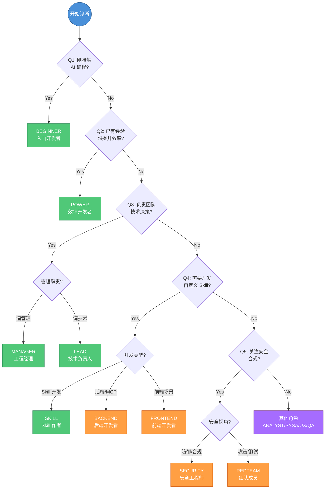
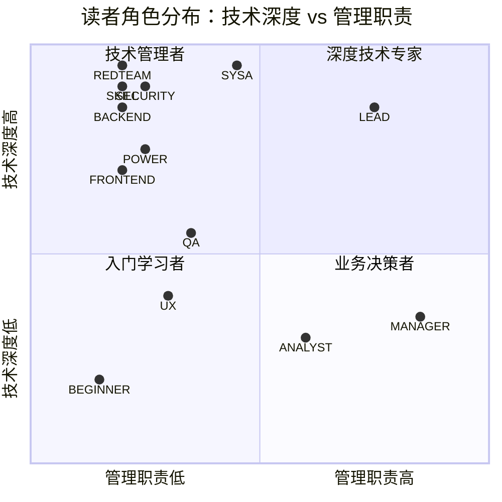
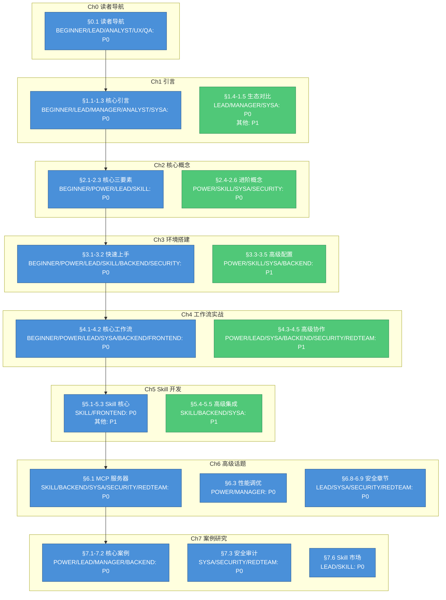
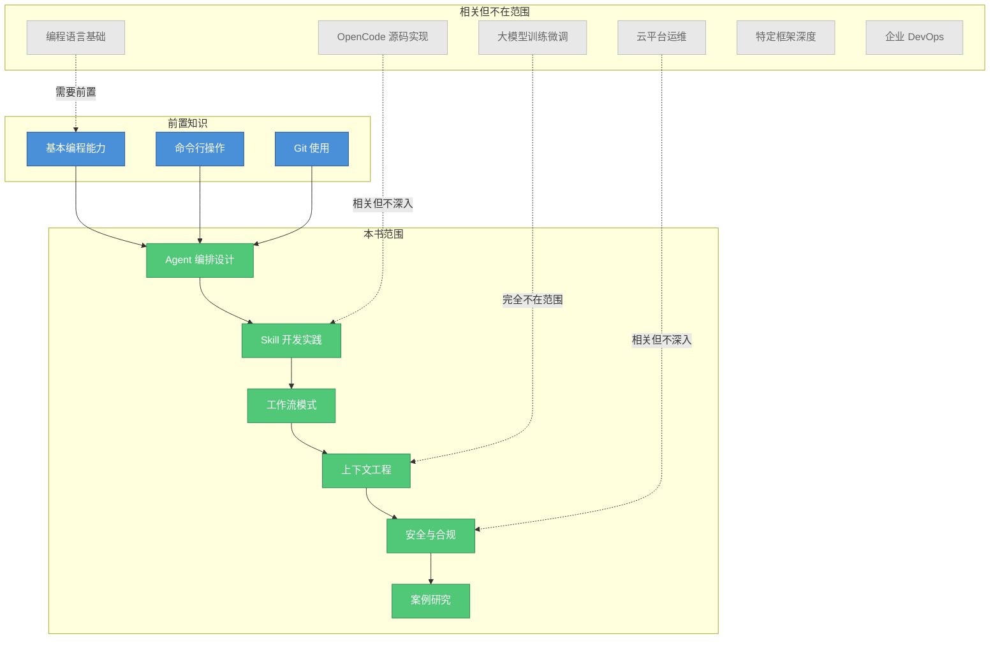
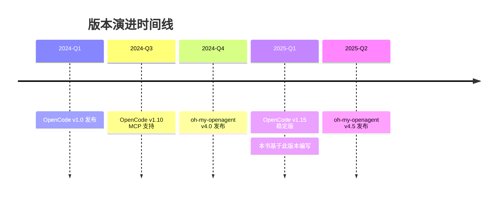
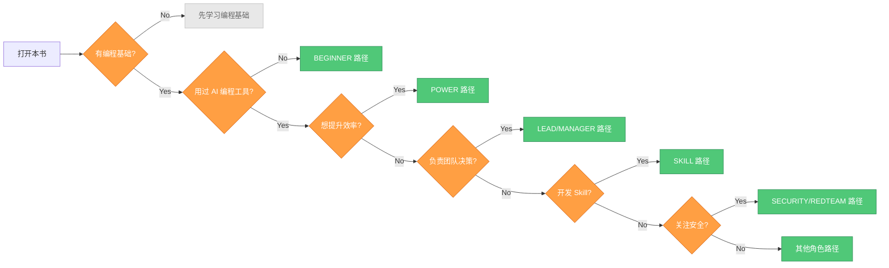

# 读者导航 — 本书适合你吗？

> 本书不是"从零学编程"教程，而是帮助你从"用 AI 聊天写代码"升级到"用 AI 工程流水线做开发"的实践指南。30 秒内判断这本书是否适合你。

---

## 角色自诊区

### 自我诊断问卷

回答以下 5 个问题，快速定位你的角色类型：

| # | 问题 | Yes → 跳转 | No → 继续 |
|---|------|-----------|----------|
| **Q1** | 你是否刚接触 AI 编程工具（如 Copilot、Cursor、Claude Code）？ | → **BEGINNER** | → Q2 |
| **Q2** | 你是否已有 AI 编程工具使用经验，想系统提升效率？ | → **POWER** | → Q3 |
| **Q3** | 你是否负责团队技术决策或工具选型？ | → **LEAD** 或 **MANAGER** | → Q4 |
| **Q4** | 你是否需要开发自定义 Skill 或集成外部工具？ | → **SKILL** 或 **BACKEND** | → Q5 |
| **Q5** | 你是否关注安全合规、威胁建模或渗透测试？ | → **SECURITY** 或 **REDTEAM** | → **其他角色** |



### 13 种读者角色速查

| 角色 | 标识 | 典型特征 | 核心目标 | 推荐优先级 |
|------|------|----------|----------|------------|
| **入门开发者** | BEGINNER | 刚接触 AI 编程，基本编程能力 OK | 快速上手 OpenCode | ★★★★★ |
| **效率开发者** | POWER | 已用 AI 工具，想升级到 Agent 编排 | 提升 2x+ 效率 | ★★★★★ |
| **技术负责人** | LEAD | 团队技术决策者，关注标准化 | 建立团队级体系 | ★★★★★ |
| **Skill 作者** | SKILL | 有 AI 使用经验，想扩展能力 | 开发高质量 Skill | ★★★★★ |
| **工程经理** | MANAGER | 评估团队工具选型 | 判断投资回报率 | ★★★★☆ |
| **需求分析师** | ANALYST | 需求分析、产品规划经验 | 验证需求覆盖完整性 | ★★★☆☆ |
| **系统架构师** | SYSA | 5 年以上架构经验 | 评估技术可行性 | ★★★★☆ |
| **后端开发者** | BACKEND | 熟悉 REST/微服务/数据库 | MCP 服务端集成 | ★★★★☆ |
| **前端开发者** | FRONTEND | 熟悉 React/Vue/Angular | 前端工作流应用 | ★★★☆☆ |
| **文档 UX 专家** | UX | 信息架构/开发者文档经验 | 文档体验优化 | ★★☆☆☆ |
| **技术审校** | QA | 测试或技术写作背景 | 建立质量门禁 | ★★★☆☆ |
| **安全工程师** | SECURITY | 安全工程/合规/威胁建模 | 建立安全基线 | ★★★★☆ |
| **红队成员** | REDTEAM | 渗透测试/安全研究 | 评估攻击面 | ★★★★☆ |

### 跨角色比对表：技术深度 vs 管理职责



| 维度 | 核心角色 (5) | 扩展角色 (8) |
|------|-------------|-------------|
| **技术深度高** | SKILL, POWER, LEAD | SYSA, REDTEAM, SECURITY, BACKEND |
| **技术深度中** | BEGINNER | FRONTEND, QA |
| **技术深度低** | MANAGER | ANALYST, UX |
| **管理职责高** | LEAD, MANAGER | ANALYST |
| **管理职责中** | POWER | SYSA, QA |
| **管理职责低** | BEGINNER, SKILL | BACKEND, FRONTEND, UX, SECURITY, REDTEAM |

---

## 优先级矩阵：8 章 × 13 角色

### 矩阵说明

| 优先级 | 标记 | 定义 | 阅读建议 |
|--------|------|------|----------|
| **P0** | ● | 必备章节 | 必须精读，是理解后续内容的基础 |
| **P1** | ◐ | 重要章节 | 推荐阅读，能显著提升实践效果 |
| **P2** | ○ | 可选章节 | 按需阅读，锦上添花 |
| **Skip** | - | 跳过 | 初期可跳过，后续按需回溯 |

### 完整矩阵

| 章节 | BEGINNER | POWER | LEAD | SKILL | MANAGER | ANALYST | SYSA | BACKEND | FRONTEND | UX | QA | SECURITY | REDTEAM |
|------|:--------:|:-----:|:----:|:-----:|:-------:|:-------:|:----:|:-------:|:--------:|:--:|:--:|:--------:|:-------:|
| **Ch0 读者导航** | ● | ○ | ● | ○ | ○ | ● | ○ | ○ | ○ | ● | ● | ○ | ○ |
| **Ch1 引言** | ● | ◐ | ● | ◐ | ● | ● | ● | ◐ | ◐ | ◐ | ● | ◐ | ◐ |
| **Ch2 核心概念** | ● | ● | ● | ● | ◐ | ◐ | ● | ◐ | ◐ | ◐ | ● | ◐ | ◐ |
| **Ch3 环境搭建** | ● | ● | ● | ● | - | - | ◐ | ● | ◐ | - | ● | ● | ◐ |
| **Ch4 工作流实战** | ● | ● | ● | ◐ | - | - | ● | ● | ● | - | ● | ● | ● |
| **Ch5 Skill 开发** | ◐ | ◐ | ◐ | ● | - | - | ◐ | ◐ | ● | - | ● | ◐ | ◐ |
| **Ch6 高级话题** | ○ | ● | ● | ● | ◐ | - | ● | ● | ○ | - | ● | ● | ● |
| **Ch7 案例研究** | ◐ | ● | ● | ● | ● | ● | ● | ● | ◐ | ◐ | ● | ● | ● |

### 优先级热力图



### 各角色推荐阅读路径

| 角色 | P0 章节 | P1 章节 | 预计用时 |
|------|---------|---------|----------|
| **BEGINNER** | Ch0, Ch1, Ch2, Ch3, Ch4 | Ch5, Ch7 | 4-5 小时 |
| **POWER** | Ch2, Ch3, Ch4, Ch6, Ch7 | Ch1, Ch5 | 5-6 小时 |
| **LEAD** | Ch0, Ch1, Ch2, Ch3, Ch4, Ch6, Ch7 | Ch5 | 6-7 小时 |
| **SKILL** | Ch2, Ch3, Ch5, Ch6, Ch7 | Ch1, Ch4 | 5-6 小时 |
| **MANAGER** | Ch1, Ch7 | Ch2, Ch6 | 3-4 小时 |
| **ANALYST** | Ch0, Ch1, Ch7 | Ch2 | 4-5 小时 |
| **SYSA** | Ch1, Ch2, Ch4, Ch6, Ch7 | Ch3, Ch5 | 7-8 小时 |
| **BACKEND** | Ch3, Ch4, Ch5, Ch6, Ch7 | Ch1, Ch2 | 5-6 小时 |
| **FRONTEND** | Ch4, Ch5 | Ch1, Ch2, Ch3, Ch7 | 4-5 小时 |
| **UX** | Ch0, Ch7 | Ch1, Ch2 | 3-4 小时 |
| **QA** | Ch0, Ch1, Ch2, Ch3, Ch4, Ch5, Ch6, Ch7 | - | 6-7 小时 |
| **SECURITY** | Ch3, Ch4, Ch5, Ch6, Ch7 | Ch1, Ch2 | 5-6 小时 |
| **REDTEAM** | Ch4, Ch5, Ch6, Ch7 | Ch1, Ch2 | 5-6 小时 |

---

## 前置知识确认

### 必须具备

| 前置知识 | 要求程度 | 验证方式 |
|----------|----------|----------|
| **编程语言** | 至少熟悉一种（TypeScript/Python/Go/Java/Rust 等） | 能独立完成一个完整的小项目 |
| **命令行** | 基本使用经验 | 熟悉 cd、ls、grep、管道等基本操作 |
| **Git** | 基本使用经验 | 能完成 clone、commit、push、pull 等操作 |

### 建议具备

| 前置知识 | 要求程度 | 说明 |
|----------|----------|------|
| **AI 编程助手** | 使用过至少一种 | Copilot / Claude Code / Cursor / Codeium 等 |
| **Agent/LLM 概念** | 了解基本概念 | 知道什么是 LLM、Prompt、Context 即可 |
| **MCP 协议** | 听说过即可 | Model Context Protocol，后续章节会详细讲解 |

### 前置知识自检清单

```markdown
- [ ] 我能用一种编程语言完成一个完整的小项目
- [ ] 我能在命令行中导航目录、执行命令
- [ ] 我能用 Git 完成基本的版本控制操作
- [ ] 我使用过至少一种 AI 编程助手（可选但建议）
- [ ] 我了解 LLM/Prompt 的基本概念（可选但建议）
```

> 如果你勾选了前三项，你就具备了阅读本书的基础。后两项是加分项，会在书中相关章节补充讲解。

---

## 本书不涵盖的内容

### 明确边界

| 不涵盖的内容 | 为什么跳过 | 替代资源 |
|-------------|-----------|---------|
| **编程基础语法** | 假设读者已有开发经验 | 各语言官方教程、《代码大全》 |
| **OpenCode Rust 内部实现** | 聚焦用户层面配置和实践 | [OpenCode 源码](https://github.com/opencode-ai/opencode) |
| **具体云平台完整教程** | 聚焦 AI 编程工作流本身 | AWS/Azure/GCP/阿里云官方文档 |
| **大模型训练或微调** | 本书是工程实践，不是 ML 教程 | Hugging Face 课程、各模型官方文档 |
| **特定框架深度教程** | 示例涉及但不深入讲解 | React/Vue/Spring 等框架官方文档 |
| **企业级 DevOps 完整方案** | 聚焦 AI 编程环节 | 《持续交付》《DevOps 手册》 |

### 内容边界示意图



---

## 版本声明

### 技术栈版本

| 组件 | 版本 | 说明 |
|------|------|------|
| **OpenCode** | v1.15.x | 核心 AI 编程引擎 |
| **oh-my-openagent** | v4.5.x | Agent 编排套件 |
| **Docsify** | v4.x | 书籍渲染引擎 |
| **Mermaid** | v10+ | 图表和架构图 |
| **Node.js** | >=18 | 本地预览环境 |

### 版本兼容性说明



### 版本差异处理

| 场景 | 处理方式 |
|------|----------|
| 代码示例与最新版本不一致 | 在代码块中标注版本号，GitHub CHANGELOG 记录差异 |
| 配置项变更 | 在相关章节添加版本兼容性说明 |
| 新功能发布 | 在 GitHub Issues 中发布补充说明 |

> 所有代码示例和配置均标注了对应版本。后续版本差异会在 [GitHub](https://github.com/tonydeng/harness-engineering-from-oc-to-ai-coding) 的 CHANGELOG 中记录。

---

## 快速开始指南

### 30 秒决策流程



### 下一步行动

| 你的角色 | 立即行动 |
|----------|----------|
| **BEGINNER** | 跳转到 [§1.1 什么是 Harness Engineer](../01-introduction/what-is-harness-engineer.md) |
| **POWER** | 跳转到 [§2.1 Agent 编排](../02-core-concepts/agent-orchestration.md) |
| **LEAD** | 跳转到 [§1.3 Harness Engineering 理论框架](../01-introduction/harness-engineering-theory.md) |
| **SKILL** | 跳转到 [§2.2 Skill 系统](../02-core-concepts/skills-system.md) |
| **MANAGER** | 跳转到 [§1.4 AI 编程工具生态对比](../01-introduction/ecosystem-comparison.md) |
| **其他角色** | 查看完整 [多角色阅读路径](reading-paths.md) |

---

## 章节导航

本章包含以下内容：

- **[多角色阅读路径](reading-paths.md)** — 针对 13 种读者角色提供定制化的章节跳转建议，以及对应的阅读时间估算
- **[如何使用本书](how-to-read.md)** — 两种阅读模式（逐章精读 vs 按需跳跃）的对比说明，以及最大化学习收益的实操建议

---

## 给出反馈

发现错误？有改进建议？欢迎通过 [GitHub Issues](https://github.com/tonydeng/harness-engineering-from-oc-to-ai-coding/issues) 提交反馈。

---

> [下一页：多角色阅读路径 →](reading-paths.md)
