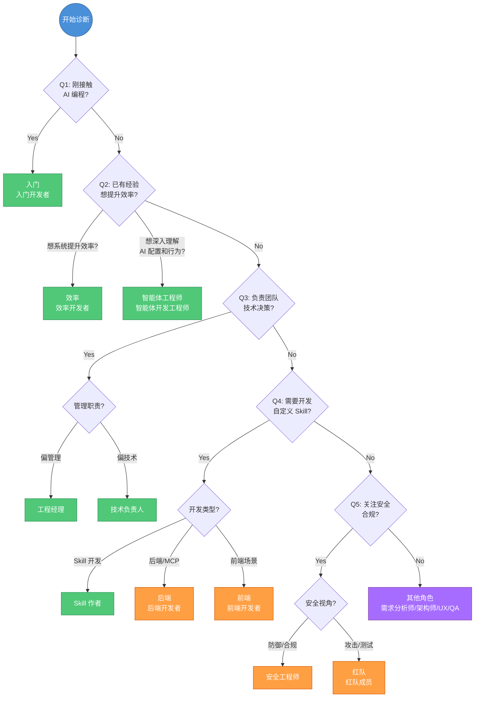
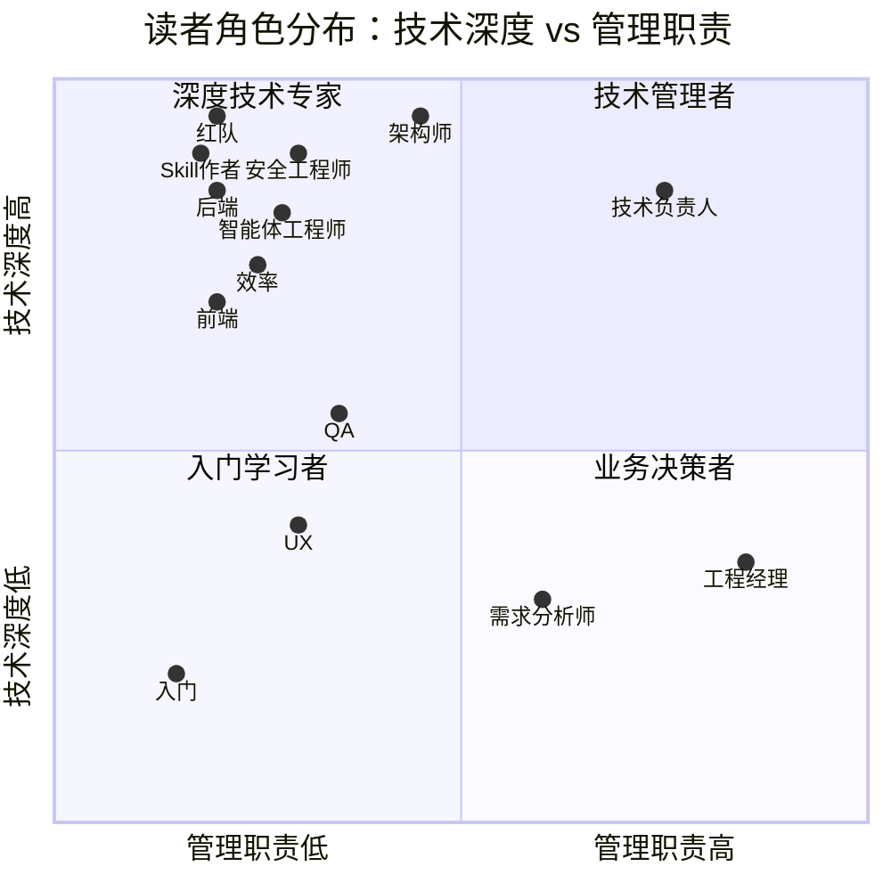
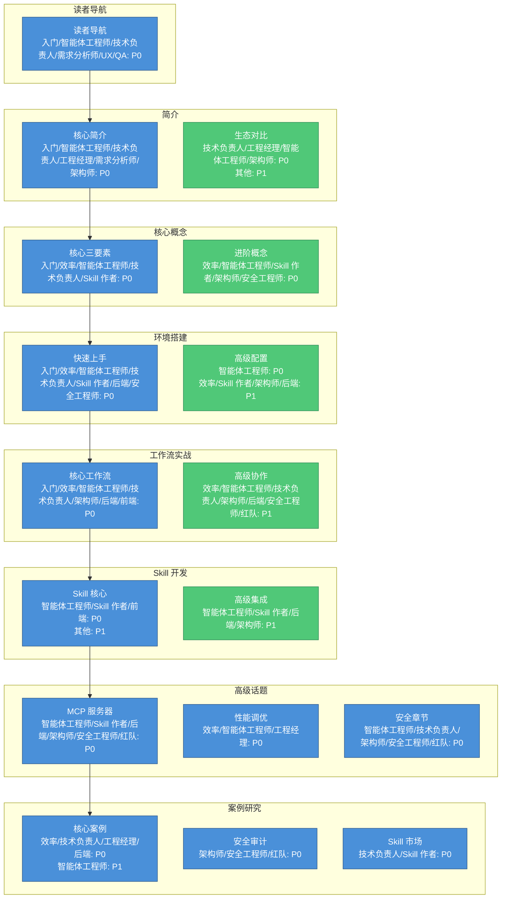
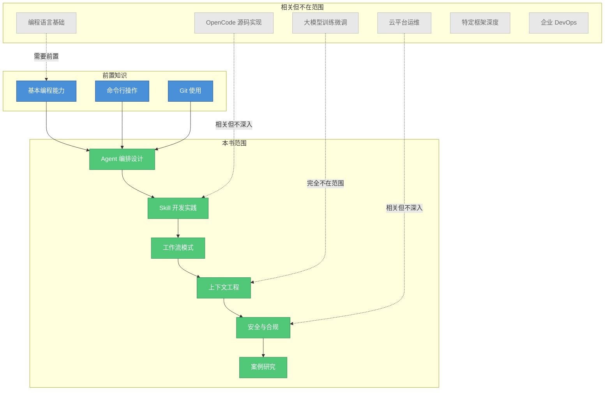
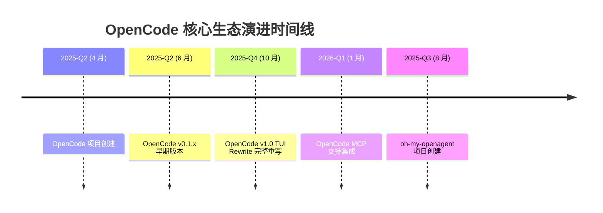
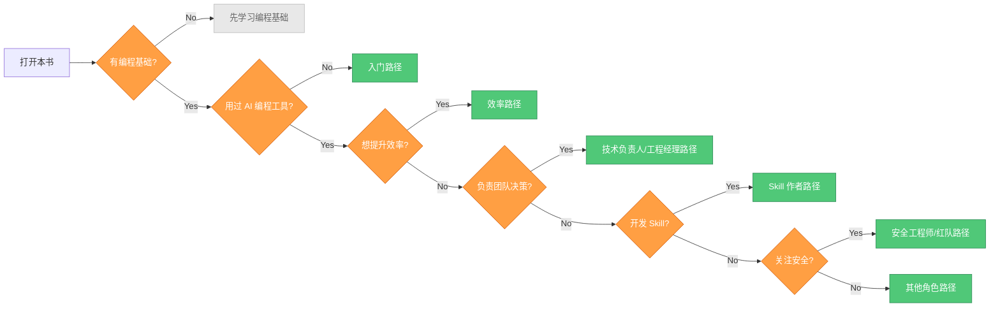

# 读者导航 — 本书适合你吗？

> **适合读者**: AI初学者, 效率追求者, 技术负责人

> 本书不是"从零学编程"教程，而是帮你从"跟 AI 聊天写代码"到"用工程体系做开发"的实践指南。花 30 秒判断这本书是否适合你。

---

## 角色自测区

### 自我诊断问卷

回答以下 5 个问题，快速定位你的角色类型：

| 序号 | 问题 | Yes → 跳转 | No → 继续 |
|---|------|-----------|----------|
| **Q1** | 你是否刚接触 AI 编程工具（如 Copilot、Cursor、Claude Code）？ | → **入门开发者** | → Q2 |
| **Q2** | 你是否已有 AI 编程工具使用经验，想系统提升效率？ | → **效率开发者** 或 **智能体开发工程师** | → Q3 |
| **Q3** | 你是否负责团队技术决策或工具选型？ | → **技术负责人** 或 **工程经理** | → Q4 |
| **Q4** | 你是否需要开发自定义 Skill 或集成外部工具？ | → **Skill 作者** 或 **后端开发者** | → Q5 |
| **Q5** | 你是否关注安全合规、威胁建模或渗透测试？ | → **安全工程师** 或 **红队成员** | → **其他角色** |



### 14 种读者角色速查

| 角色 | 简称 | 典型特征 | 核心目标 | 推荐优先级 |
|------|------|----------|----------|------------|
| **入门开发者** | 入门 | 刚接触 AI 编程，基本编程能力 OK | 快速上手 OpenCode | ★★★★★ |
| **智能体开发工程师** | 智能体工程师 | 已有 AI 工具使用经验，需要设计、调试、进化 AI 编码智能体 | 掌握 Agent 配置、**Context Engineering（上下文工程）**、循环工程 | ★★★★★ |
| **效率开发者** | 效率 | 已用 AI 工具，想升级到 Agent 编排 | 提升 2x+ 效率 | ★★★★★ |
| **技术负责人** | 技术负责人 | 团队技术决策者，关注标准化 | 建立团队级体系 | ★★★★★ |
| **Skill 作者** | **Skill（技能）** 作者 | 有 AI 使用经验，想扩展能力 | 开发高质量 Skill | ★★★★★ |
| **工程经理** | 工程经理 | 评估团队工具选型 | 判断投资回报率 | ★★★★☆ |
| **需求分析师** | 需求分析师 | 需求分析、产品规划经验 | 验证需求覆盖完整性 | ★★★☆☆ |
| **系统架构师** | 架构师 | 5 年以上架构经验 | 评估技术可行性 | ★★★★☆ |
| **后端开发者** | 后端 | 熟悉 REST/微服务/数据库 | **MCP（模型上下文协议）** 服务端集成 | ★★★★☆ |
| **前端开发者** | 前端 | 熟悉 React/Vue/Angular | 前端工作流应用 | ★★★☆☆ |
| **文档 UX 专家** | UX | 信息架构/开发者文档经验 | 文档体验优化 | ★★☆☆☆ |
| **技术审校** | QA | 测试或技术写作背景 | 建立质量门禁 | ★★★☆☆ |
| **安全工程师** | 安全工程师 | 安全工程/合规/威胁建模 | 建立安全基线 | ★★★★☆ |
| **红队成员** | 红队 | 渗透测试/安全研究 | 评估攻击面 | ★★★★☆ |

### 跨角色比对表：技术深度 vs 管理职责



| 维度 | 核心角色 (6) | 扩展角色 (8) |
|------|-------------|-------------|
| **技术深度高** | 智能体工程师, Skill 作者, 效率, 技术负责人 | 架构师, 红队, 安全工程师, 后端 |
| **技术深度中** | 入门 | 前端, QA |
| **技术深度低** | 工程经理 | 需求分析师, UX |
| **管理职责高** | 技术负责人, 工程经理 | 需求分析师 |
| **管理职责中** | 效率 | 架构师, QA |
| **管理职责低** | 入门, 智能体工程师, Skill 作者 | 后端, 前端, UX, 安全工程师, 红队 |

---

## 优先级矩阵：8 章 × 14 角色

### 矩阵说明

| 优先级 | 标记 | 定义 | 阅读建议 |
|--------|------|------|----------|
| **P0** | ● | 必备章节 | 必须精读，是理解后续内容的基础 |
| **P1** | ◐ | 重要章节 | 推荐阅读，能显著提升实践效果 |
| **P2** | ○ | 可选章节 | 按需阅读，锦上添花 |
| **Skip** | - | 跳过 | 初期可跳过，后续按需回溯 |

### 完整矩阵

| 章节 | 入门 | 智能体工程师 | 效率 | 技术负责人 | Skill 作者 | 工程经理 | 需求分析师 | 架构师 | 后端 | 前端 | UX | QA | 安全工程师 | 红队 |
|------|:----:|:----------:|:----:|:----------:|:----------:|:--------:|:----------:|:------:|:----:|:----:|:--:|:--:|:----------:|:----:|
| **读者导航** | ○ | ● | ○ | ● | ○ | ○ | ● | ○ | ○ | ○ | ● | ● | ○ | ○ |
| **简介** | ● | ● | ◐ | ● | ◐ | ● | ● | ● | ◐ | ◐ | ◐ | ● | ◐ | ◐ |
| **核心概念** | ● | ● | ● | ● | ● | ◐ | ◐ | ● | ◐ | ◐ | ◐ | ● | ◐ | ◐ |
| **环境搭建** | ● | ● | ● | ● | ● | - | - | ◐ | ● | ◐ | - | ● | ● | ◐ |
| **工作流实战** | ● | ● | ● | ● | ◐ | - | - | ● | ● | ● | - | ● | ● | ● |
| **Skill 开发** | ◐ | ● | ◐ | ◐ | ● | - | - | ◐ | ◐ | ● | - | ● | ◐ | ◐ |
| **高级话题** | ○ | ● | ● | ● | ● | ◐ | - | ● | ● | ○ | - | ● | ● | ● |
| **案例研究** | ◐ | ◐ | ● | ● | ● | ● | ● | ● | ● | ◐ | ◐ | ● | ● | ● |

### 优先级热力图



### 各角色推荐阅读路径

| 角色 | P0 章节 | P1 章节 | 预计用时 |
|------|---------|---------|----------|
| **入门** | [读者导航](./), [简介](../01-introduction/), [核心概念](../02-core-concepts/), [环境搭建](../03-setup/), [工作流实战](../04-workflows/) | [Skill 开发](../05-skills/), [案例研究](../07-case-studies/) | 4-5 小时 |
| **智能体工程师** | [核心概念](../02-core-concepts/), [环境搭建](../03-setup/), [工作流实战](../04-workflows/), [高级话题](../06-advanced/), [案例研究](../07-case-studies/) | [读者导航](./), [简介](../01-introduction/), [Skill 开发](../05-skills/) | 5-6 小时 |
| **效率** | [核心概念](../02-core-concepts/), [环境搭建](../03-setup/), [工作流实战](../04-workflows/), [高级话题](../06-advanced/), [案例研究](../07-case-studies/) | [简介](../01-introduction/), [Skill 开发](../05-skills/) | 5-6 小时 |
| **技术负责人** | [读者导航](./), [简介](../01-introduction/), [核心概念](../02-core-concepts/), [环境搭建](../03-setup/), [工作流实战](../04-workflows/), [高级话题](../06-advanced/), [案例研究](../07-case-studies/) | [Skill 开发](../05-skills/) | 6-7 小时 |
| **Skill 作者** | [核心概念](../02-core-concepts/), [环境搭建](../03-setup/), [Skill 开发](../05-skills/), [高级话题](../06-advanced/), [案例研究](../07-case-studies/) | [简介](../01-introduction/), [工作流实战](../04-workflows/) | 5-6 小时 |
| **工程经理** | [简介](../01-introduction/), [案例研究](../07-case-studies/) | [核心概念](../02-core-concepts/), [高级话题](../06-advanced/) | 3-4 小时 |
| **需求分析师** | [读者导航](./), [简介](../01-introduction/), [案例研究](../07-case-studies/) | [核心概念](../02-core-concepts/) | 4-5 小时 |
| **架构师** | [简介](../01-introduction/), [核心概念](../02-core-concepts/), [工作流实战](../04-workflows/), [高级话题](../06-advanced/), [案例研究](../07-case-studies/) | [环境搭建](../03-setup/), [Skill 开发](../05-skills/) | 7-8 小时 |
| **后端** | [环境搭建](../03-setup/), [工作流实战](../04-workflows/), [Skill 开发](../05-skills/), [高级话题](../06-advanced/), [案例研究](../07-case-studies/) | [简介](../01-introduction/), [核心概念](../02-core-concepts/) | 5-6 小时 |
| **前端** | [工作流实战](../04-workflows/), [Skill 开发](../05-skills/) | [简介](../01-introduction/), [核心概念](../02-core-concepts/), [环境搭建](../03-setup/), [案例研究](../07-case-studies/) | 4-5 小时 |
| **UX** | [读者导航](./), [案例研究](../07-case-studies/) | [简介](../01-introduction/), [核心概念](../02-core-concepts/) | 3-4 小时 |
| **QA** | [读者导航](./), [简介](../01-introduction/), [核心概念](../02-core-concepts/), [环境搭建](../03-setup/), [工作流实战](../04-workflows/), [Skill 开发](../05-skills/), [高级话题](../06-advanced/), [案例研究](../07-case-studies/) | - | 6-7 小时 |
| **安全工程师** | [环境搭建](../03-setup/), [工作流实战](../04-workflows/), [Skill 开发](../05-skills/), [高级话题](../06-advanced/), [案例研究](../07-case-studies/) | [简介](../01-introduction/), [核心概念](../02-core-concepts/) | 5-6 小时 |
| **红队** | [工作流实战](../04-workflows/), [Skill 开发](../05-skills/), [高级话题](../06-advanced/), [案例研究](../07-case-studies/) | [简介](../01-introduction/), [核心概念](../02-core-concepts/) | 5-6 小时 |

---

## 前置知识确认

### 必须具备

| 前置知识 | 要求程度 | 验证方式 |
|----------|----------|----------|
| **编程语言** | 至少熟悉一种（TypeScript/Python/Go/Java/Rust 等） | 能独立完成一个完整的小项目 |
| **命令行** | 基本使用经验 | 熟悉 cd、ls、grep、管道等基本操作 |
| **Git** | 基本使用经验 | 能完成 clone、commit、push、pull 等操作 |

### 建议具备

| 前置知识 | 要求程度 | 说明 |
|----------|----------|------|
| **AI 编程助手** | 使用过至少一种 | Copilot / Claude Code / Cursor / Codeium 等 |
| **Agent/LLM 概念** | 了解基本概念 | 知道什么是 LLM、**Prompt（提示词）**、Context 即可 |
| **MCP 协议** | 听说过即可 | Model Context Protocol，后续章节会详细讲解 |

### 前置知识自检清单

```markdown:terminal
- [ ] 我能用一种编程语言完成一个完整的小项目
- [ ] 我能在命令行中导航目录、执行命令
- [ ] 我能用 Git 完成基本的版本控制操作
- [ ] 我使用过至少一种 AI 编程助手（可选但建议）
- [ ] 我了解 LLM/Prompt 的基本概念（可选但建议）
```

> 如果你勾选了前三项，你就具备了阅读本书的基础。后两项是加分项，会在书中相关章节补充讲解。

---

## 本书不涵盖的内容

### 明确边界

| 不涵盖的内容 | 为什么跳过 | 替代资源 |
|-------------|-----------|---------|
| **编程基础语法** | 假设读者已有开发经验 | 各语言官方教程、《代码大全》 |
| **OpenCode Node.js/TypeScript 实现** | 聚焦用户层面配置和实践 | [OpenCode 源码](https://github.com/anomalyco/opencode) |
| **具体云平台完整教程** | 聚焦 AI 编程工作流本身 | AWS/Azure/GCP/阿里云官方文档 |
| **大模型训练或微调** | 本书是工程实践，不是 **ML（机器学习）**教程 | Hugging Face 课程、各模型官方文档 |
| **特定框架深度教程** | 示例涉及但不深入讲解 | React/Vue/Spring 等框架官方文档 |
| **企业级 DevOps 完整方案** | 聚焦 AI 编程环节 | 《持续交付》《DevOps 手册》 |

### 内容边界示意图



---

## 版本声明

### 技术栈版本

| 组件 | 版本 | 说明 |
|------|------|------|
| **[OpenCode](https://github.com/anomalyco/opencode)** | v1.17.x | 核心 AI 编程引擎（当前为 v1.17.11） |
| **[oh-my-openagent](https://github.com/code-yeongyu/oh-my-openagent)** | v4.12.x | Agent 编排套件（当前为 v4.12.0） |
| **[mdBook](https://github.com/rust-lang/mdBook)** | v0.5.x | 书籍渲染引擎（当前为 v0.5.3） |
| **[Mermaid](https://github.com/mermaid-js/mermaid)** | v10+ | 图表和架构图 |
| **[Node.js](https://nodejs.org/)** | >=18 | npm 安装方式所需运行时（curl/brew 安装不需要） |

### OpenCode核心生态演进



---

## 快速开始指南

### 30 秒决策流程



### 下一步行动

| 你的角色 | 立即行动 |
|----------|----------|
| **入门** | 跳转到 [什么是 Harness Engineer](../01-introduction/what-is-harness-engineer.md) |
| **效率** | 跳转到 [Agent 编排](../02-core-concepts/agent-orchestration.md) |
| **技术负责人** | 跳转到 [**Harness Engineering（驾驭工程）** 理论框架](../01-introduction/harness-engineering-theory.md) |
| **Skill 作者** | 跳转到 [Skill 系统](../02-core-concepts/skills-system.md) |
| **工程经理** | 跳转到 [AI 编程工具生态对比](../01-introduction/ecosystem-comparison.md) |
| **后端** | 跳转到 [MCP 服务器](../06-advanced/mcp-servers.md) |
| **前端** | 跳转到 [工作流模式](../02-core-concepts/workflow-patterns.md) |
| **安全工程师** | 跳转到 [安全总览](../06-advanced/security-overview.md) |
| **红队** | 跳转到 [安全审计流水线](../07-case-studies/case-security-audit.md) |
| **其他角色** | 查看完整 [多角色阅读路径](reading-paths.md) |

---

## 章节导航

> ✅ **写作状态提示**：本书 **90 篇全部完成**（100%）。阅读路径和各章节链接均已标注完整规划。

本章包含以下内容：

- **[多角色阅读路径](reading-paths.md)** — 针对 14 种读者角色提供定制化的章节跳转建议，以及对应的阅读时间估算
- **[如何使用本书](how-to-read.md)** — 两种阅读模式（逐章精读 vs 按需跳跃）的对比说明，以及最大化学习收益的实操建议
- **[5 分钟快速体验](quick-start.md)** — 从安装到第一次 AI 编程任务，一站式快速上手

---

## 给出反馈

发现错误？有改进建议？欢迎通过 [GitHub Issues](https://github.com/tonydeng/harness-engineering-from-oc-to-ai-coding/issues) 提交反馈。

---

> [下一页：多角色阅读路径 →](reading-paths.md)
