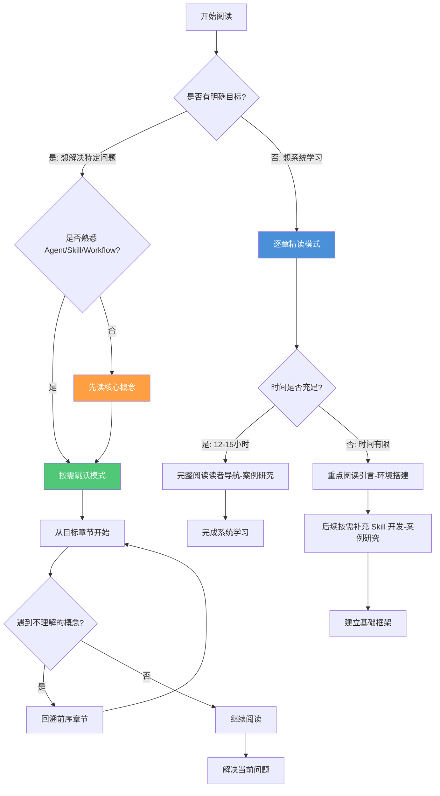

# 如何使用本书

> 选择正确的阅读方式，比多花时间更重要。本文说明如何根据你的目标最大化本书的学习收益。

## 文章概述

技术书的阅读方式没有标准答案。逐章精读适合系统性学习，按需跳跃适合快速解决问题。本文为这两种模式分别提供了操作建议，帮助你根据自己的学习风格做选择。书中各章节设计为可独立阅读，但某些概念链条（如 Agent → Skill → Workflow）有自然的递进关系，了解这些关系能让你在跳跃阅读时减少回查成本。

除了阅读模式，本文还介绍了实操层面的建议：为什么双窗口（书籍 + 编辑器）是最高效的学习配置，如何在对配置不求甚解之前先建立概念模型，以及如何在读完整本书后把你的真实项目映射到书中模式上。最后，本文说明了如何通过 GitHub Issues 给出反馈，让这本书随着 OpenCode 生态一起进化。

## 内容要点

1. **两种阅读模式** — 逐章精读适合系统性学习者，按需跳跃适合目标驱动的查找式阅读。每种模式都有适用的场景和各自的注意事项。对于关键概念（如 Agent、Skill、Workflow），跳跃阅读时建议至少完整阅读核心概念的对应小节。

2. **实操建议** — 包括开双窗口（一个看文档，一个开编辑器）、先理解概念再复制配置、跳过与自己技术栈不匹配的部分（如 TUI 章节）、带着真实项目来读、遇到问题先看章节 FAQ。这些建议来自多个案例学习的经验总结。

3. **前置知识确认** — 本书假设读者已熟悉至少一种编程语言、基本的命令行和 Git 操作，以及至少使用过一种 AI 编程助手。如果不满足这些前提，建议先补足基础再开始阅读。同时也列出了本书明确不涉及的主题（如大模型训练、OpenCode 内部实现），避免读者产生错误预期。

4. **如何给出反馈** — 通过 GitHub Issues 提交错误报告和改进建议。包含反馈模板建议：指明所在章节、问题类型（内容错误 / 示例不可运行 / 表述不清 / 其他）、预期与实际的差异描述。帮助维护团队快速定位和修复。

---

## 两种阅读模式

本书支持两种截然不同的阅读模式，选择哪一种取决于你的学习风格、时间预算和当前目标。

### 模式一：逐章精读（系统型学习者）

**适合人群**：希望全面掌握 Harness Engineering 方法论的开发者，或计划在团队中推广 OpenCode 的技术负责人。

**阅读顺序**：读者导航 → 引言 → 核心概念 → 环境搭建 → 工作流实战 → Skill 开发 → 高级话题 → 案例研究

**时间投入**：约 12-15 小时完整阅读，建议分 4-6 次完成

**优势**：
- 建立完整的知识体系，理解各概念间的关联
- 不会遗漏重要的设计理念和最佳实践
- 后续查阅时能快速定位到相关章节

**注意事项**：
- 高级话题可根据实际需求选择性阅读
- 每章结束后建议完成对应的实操练习（如有）
- 遇到不熟悉的技术栈示例，可跳过不影响理解主体内容

### 模式二：按需跳跃（目标型读者）

**适合人群**：已有明确问题需要解决，或只想了解特定主题的开发者。

**阅读策略**：从目标章节开始，遇到不理解的概念回溯前序章节

**时间投入**：2-4 小时（取决于回溯深度）

**优势**：
- 快速获取所需信息，立即应用到实际项目
- 减少不相关内容的干扰，提高阅读效率

**注意事项**：
- **关键概念不可跳过**：Agent、Skill、Workflow 是全书核心，跳跃阅读时建议至少完整阅读核心概念的对应小节
- **配置章节需谨慎**：环境搭建涉及多个配置文件，建议按顺序操作避免遗漏依赖
- **案例研究需回溯**：案例研究的案例假设读者已掌握前序章节概念，直接阅读可能产生理解断层

### 阅读模式选择决策树

不确定哪种模式适合你？参考以下决策树：



---

## 阅读技巧

### 双窗口配置：效率最高的学习方式

**推荐配置**：
- **左窗口**：浏览器打开本书（推荐 Chrome/Edge，支持 mdBook 搜索功能）
- **右窗口**：VS Code 或其他编辑器，打开你的练习项目

**为什么有效**：
- 即时验证：看到配置示例立即复制到编辑器测试
- 减少上下文切换：避免在文档和代码之间频繁切换窗口
- 便于对比：同时查看文档说明和实际效果

**进阶技巧**：
- 使用 VS Code 的内置浏览器（`Simple Browser`）在编辑器内打开文档
- 配置分屏快捷键，快速调整窗口布局

### 先理解概念，再复制配置

本书包含大量可运行的配置示例，但直接复制粘贴会错失学习机会。

**推荐步骤**：
1. **阅读概念说明**：理解"为什么这样设计"
2. **查看示例配置**：理解"如何实现"
3. **手动输入配置**：加深记忆，IDE 会提供智能提示
4. **修改参数实验**：理解"各参数的作用"
5. **应用到自己的项目**：实现知识迁移

**示例**：学习环境搭建的 OpenCode 配置时，不要直接复制整个 `opencode.json`，而是：
1. 理解每个配置项的作用
2. 根据自己的项目需求选择需要的配置
3. 逐步添加并验证每个配置项的效果

### 跳过不相关章节

本书涵盖多种技术栈和场景，但并非所有内容都与你的工作相关。

**可以安全跳过的内容**：
- 不使用的技术栈示例（如你只用 TypeScript，可以跳过 Python 相关示例）
- 暂时不需要的高级功能（如高级话题的 MCP 服务器开发，可在需要时再阅读）
- 已熟悉的工具使用说明（如已熟练使用 Git，可跳过相关基础介绍）

**不建议跳过的内容**：
- 引言的 Harness Engineering 理论框架（全书基础）
- 核心概念的 Agent、Skill、Workflow
- 各章节的"最佳实践"和"常见问题"小节

### 带着真实项目来读

**最有效的学习方式**：选择一个你正在开发或计划开发的项目，边读边应用。

**实践建议**：
1. **选择合适的项目**：中等复杂度，有明确的开发任务
2. **建立映射关系**：将书中概念映射到你的项目场景
   - 示例：书中的"微服务拆分案例" → 你的"模块重构任务"
   - 示例：书中的"安全审计流水线" → 你的"代码审查流程"
3. **记录学习笔记**：在项目文档中记录从书中获得的设计决策
4. **迭代改进**：随着阅读深入，不断优化项目中的 AI 编程工作流

### 遇到问题先看 FAQ

每章末尾都包含"常见问题"小节，涵盖：
- 配置错误的排查步骤
- 概念理解的常见误区
- 版本差异导致的兼容性问题

**问题排查流程**：
1. 查看当前章节的 FAQ
2. 搜索本书其他章节（使用 mdBook 搜索功能）
3. 查阅 [OpenCode 官方文档](https://opencode.ai/docs)
4. 在 [GitHub Issues](https://github.com/tonydeng/harness-engineering-from-oc-to-ai-coding/issues) 搜索类似问题
5. 如未找到解决方案，提交新的 Issue

### 做好笔记和标注

**为什么笔记很重要**：
- Harness Engineering 涉及大量概念和配置，笔记能帮助建立个人知识库
- 记录实践中的发现和问题，形成可复用的经验
- 便于后续快速回顾和查阅

**推荐的笔记方式**：

1. **概念卡片**：为每个核心概念创建卡片
   ```markdown
   ## Agent
   定义：具有特定能力和职责的 AI 实体
   关键特征：自治性、目标导向、可编排
   应用场景：代码审查、测试生成、文档编写
   相关概念：Skill（能力单元）、Workflow（编排流程）
   ```

2. **配置模板库**：收集和整理常用配置
   - 按场景分类（如"代码审查"、"测试生成"、"文档维护"）
   - 标注每个配置的适用条件和注意事项
   - 记录实际使用中的调优经验

3. **问题日志**：记录遇到的问题和解决方案
   - 问题描述、错误信息、解决步骤
   - 参考的章节和外部资源链接
   - 后续可复用的排查思路

**工具推荐**：
- **VS Code 插件**：Markdown All in One、Markdown Preview Enhanced
- **笔记应用**：Obsidian、Notion、Logseq（支持双向链接）
- **代码片段管理**：VS Code 内置 Snippets、Gist

**标注技巧**：
- 在书中示例代码旁标注"已验证"或"待测试"
- 记录配置修改的时间和原因
- 为重要概念添加个人理解的注释

---

## 价值声明块规范

每章开头都包含标准化的"价值声明块"，帮助读者快速判断该章节是否适合自己。

### 标准格式

```markdown
## 价值声明

**目标读者**：[角色列表]

**前驱知识**：[需要预先掌握的内容]

**学习收获**：[完成本章后能获得什么]

**预计投入时间**：[X-Y 小时]
```

### 各字段说明

**目标读者**：
- 列出最适合阅读该章的读者角色
- 角色参考读者导航的 13 种读者分类
- 示例：`AI 编程新手、团队技术负责人、Skill 开发者`

**前驱知识**：
- 阅读该章前需要掌握的概念或技能
- 标注"无"表示零基础可读
- 示例：`熟悉引言的 Harness Engineering 概念、了解基本的命令行操作`

**学习收获**：
- 完成该章后能获得的具体能力
- 使用可验证的描述
- 示例：`能够独立配置 OpenCode 环境、理解 Agent 编排的基本原理`

**预计投入时间**：
- 阅读完整章节所需的时间范围
- 不包括实操练习时间
- 示例：`阅读 1-2 小时 + 实操 2-3 小时`

### 示例：核心概念的价值声明块

```markdown
## 价值声明

**目标读者**：AI 编程新手、OpenCode 用户、Skill 开发者、架构师

**前驱知识**：阅读过引言，了解 Harness Engineering 的基本概念

**学习收获**：
- 理解 Agent、Skill、Workflow 三大核心抽象
- 掌握 OpenCode 的配置结构和设计理念
- 能够设计简单的 AI 编程工作流

**预计投入时间**：阅读 2-3 小时 + 实操 1-2 小时
```

### 使用场景说明

**场景一：快速判断是否需要阅读该章**

当你拿到一个新章节时，首先查看价值声明块：

1. **检查目标读者**：如果你的角色不在列表中，该章可能不是你的优先阅读内容
   - 示例：高级话题标注"Skill 开发者、架构师"，如果你是"AI 编程新手"，可以先跳过

2. **确认前驱知识**：评估自己是否满足前置条件
   - 如果不满足，先阅读前驱章节
   - 示例：工作流实战标注"熟悉核心概念的 Agent 概念"，说明需要先掌握核心概念

3. **评估学习收获**：判断该章是否能解决你的问题
   - 对比"学习收获"与你的当前需求
   - 示例：你想学习"如何编写自定义 Skill"，而某章的学习收获包含"能够开发简单的 Skill"，则该章适合你

4. **规划时间投入**：根据预计时间安排阅读计划
   - 时间紧张时，优先选择投入产出比高的章节

**场景二：制定阅读计划**

根据各章的价值声明块，制定个性化的阅读顺序：


**场景三：团队学习规划**

技术负责人可以使用价值声明块为团队成员推荐阅读内容：

- **新入职开发者**：推荐标注"AI 编程新手"的章节
- **Skill 开发者**：推荐标注"Skill 开发者"的高级章节
- **架构师**：推荐标注"架构师"的设计理念章节

### 更多示例

**示例：环境搭建的价值声明块**

```markdown
## 价值声明

**目标读者**：所有读者（必读章节）

**前驱知识**：无（零基础可读）

**学习收获**：
- 完成 OpenCode 的安装和基础配置
- 理解配置文件的结构和各字段含义
- 能够运行第一个 AI 编程示例

**预计投入时间**：阅读 1 小时 + 实操 2-3 小时
```

**示例：案例研究的价值声明块**

```markdown
## 价值声明

**目标读者**：有实践需求的开发者、技术负责人、架构师

**前驱知识**：完成引言-环境搭建的阅读，有实际项目经验更佳

**学习收获**：
- 掌握 Harness Engineering 在真实项目中的应用方式
- 理解不同场景下的 Skill 选择和 Workflow 设计
- 能够将案例模式迁移到自己的项目中

**预计投入时间**：阅读 3-4 小时 + 实操 4-6 小时
```

---

## 常见问题

### Q: 这本书适合什么水平的读者？

**A**: 本书采用分层设计，适合不同水平的读者：

- **入门级**（AI 编程新手）：从读者导航和引言开始，建立概念框架，然后按顺序学习核心概念-环境搭建
- **进阶级**（有 AI 编程经验）：可直接阅读核心概念，然后根据需求选择 Skill 开发-案例研究
- **专家级**（Skill 开发者、架构师）：重点关注 Skill 开发高级配置、高级话题和案例研究

每章开头的"价值声明块"会明确标注目标读者，帮助你快速判断该章是否适合自己。

### Q: 我没有 OpenCode 经验，能看懂吗？

**A**: 可以。本书从零开始介绍 OpenCode：

- 环境搭建提供详细的安装和配置步骤
- 所有示例都附带完整的代码和说明
- 关键概念都有清晰的定义和图示

建议：
1. 先阅读引言了解 Harness Engineering 的理念
2. 按顺序完成环境搭建
3. 边读边实践，遇到问题查看各章的 FAQ

### Q: 书中的代码示例如何运行？

**A**: 代码示例的运行方式取决于示例类型：

**配置示例**（如 `opencode.json`）：
1. 复制配置到你的项目根目录
2. 根据注释说明修改必要的参数
3. 重启 OpenCode 使配置生效

**Skill 示例**：
1. 将 Skill 文件放到 `.opencode/skills/` 目录
2. 在 OpenCode 中调用相应的命令
3. 查看控制台输出验证效果

**Workflow 示例**：
1. 理解 Workflow 的编排逻辑
2. 确保依赖的 Skill 已正确配置
3. 按步骤执行并观察中间结果

所有可运行的示例都会在代码块中标注文件路径，如：

````markdown
```json:opencode.json
{
  "model": "claude-3-opus"
}
```
````

### Q: 需要购买 OpenCode 许可证吗？

**A**: OpenCode 是开源工具，无需购买许可证。但使用 OpenCode 需要接入大模型 API：

- **Anthropic Claude**：需要 API Key（付费）
- **OpenAI GPT**：需要 API Key（付费）
- **本地模型**：可使用 Ollama 等工具运行开源模型（免费）

本书环境搭建会详细介绍各种模型的配置方式和成本考量。

### Q: 书中的内容会过时吗？

**A**: 本书采用"理念优先，工具为辅"的编写策略：

- **核心理念**（引言-核心概念）：Harness Engineering 的方法论具有长期价值
- **工具使用**（环境搭建-工作流实战）：随 OpenCode 版本更新，我们会及时修订
- **高级话题**（Skill 开发-高级话题）：设计模式和最佳实践具有通用性

当 OpenCode 有重大更新时，我们会在 [GitHub Releases](https://github.com/tonydeng/harness-engineering-from-oc-to-ai-coding/releases) 发布更新说明。

### Q: 如何快速找到我需要的内容？

**A**: 本书提供多种导航方式：

1. **目录导航**：左侧边栏显示完整的章节结构
2. **搜索功能**：使用 mdBook 内置搜索（快捷键 `/`）
3. **价值声明块**：每章开头明确说明目标读者和学习收获
4. **关联章节**：每章末尾提供相关章节的链接

建议：
- 先浏览目录，了解全书结构
- 使用搜索功能快速定位关键词
- 根据价值声明块筛选相关章节

---

## 如何参与贡献

本书是开源项目，欢迎通过 GitHub 参与贡献。

### 提交反馈（GitHub Issues）

**适用场景**：
- 发现内容错误（错别字、技术错误、链接失效）
- 示例代码无法运行
- 表述不清楚或有歧义
- 建议新增内容

**Issue 模板**：

```markdown
## 问题类型
- [ ] 内容错误
- [ ] 示例不可运行
- [ ] 表述不清
- [ ] 其他

## 所在章节
[填写章节编号和标题，如：核心概念 §2.3 工作流模式]

## 问题描述
[详细描述问题，包括预期与实际的差异]

## 复现步骤（如适用）
1. 步骤一
2. 步骤二
3. ...

## 环境信息（如适用）
- 操作系统：
- OpenCode 版本：
- 其他相关信息：

## 建议的改进方案（可选）
[如果你有建议的解决方案，请在此描述]
```

**提交地址**：[GitHub Issues](https://github.com/tonydeng/harness-engineering-from-oc-to-ai-coding/issues)

### 提交改进（Pull Requests）

**适用场景**：
- 修复错别字或格式问题
- 补充示例代码
- 改进表述
- 翻译内容

**PR 流程**：

1. **Fork 仓库**：点击 GitHub 页面右上角的 Fork 按钮
2. **克隆到本地**：
   ```bash
   git clone https://github.com/YOUR_USERNAME/harness-engineering-from-oc-to-ai-coding.git
   cd harness-engineering-from-oc-to-ai-coding
   ```
3. **创建分支**：
   ```bash
   git checkout -b fix/your-fix-name
   ```
4. **本地预览**：
   ```bash
   mdbook serve
   ```
   浏览器访问 `http://localhost:3000` 验证修改效果
5. **提交修改**：
   ```bash
   git add .
   git commit -m "fix: 修复核心概念 §2.3 中的错别字"
   git push origin fix/your-fix-name
   ```
6. **创建 Pull Request**：
   - 在 GitHub 页面点击"Compare & pull request"
   - 填写 PR 描述，说明修改内容和原因
   - 等待维护者审核

**PR 规范**：
- 一个 PR 只解决一个问题
- 提交信息格式：`type: description`
  - `fix:` 修复错误
  - `docs:` 文档改进
  - `feat:` 新增内容
  - `refactor:` 内容重构
- 确保本地预览无误后再提交

### 贡献者致谢

所有贡献者将在项目 README 和贡献者页面中列出。感谢每一位帮助改进本书的读者！

---

## 关联章节

- → [读者导航](README.md)
- → [多角色阅读路径](reading-paths.md)
- → [引言](../01-introduction/README.md)（建立 Harness Engineering 的概念框架）
