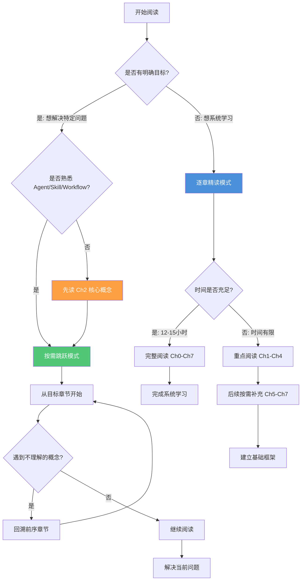
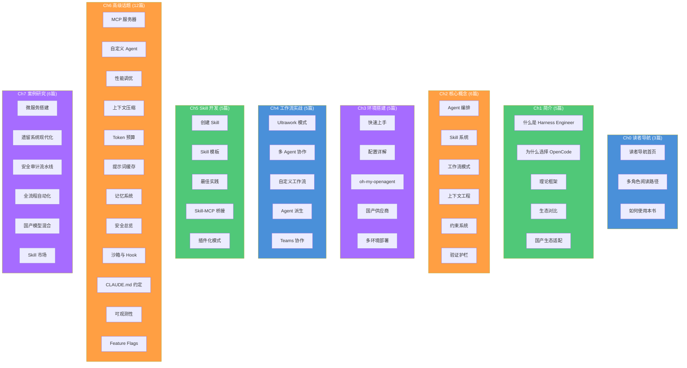

# 如何使用本书

> 选择正确的阅读方式，比多花时间更重要。本文说明如何根据你的目标最大化本书的学习收益。

## 文章概述

技术书的阅读方式没有标准答案。逐章精读适合系统性学习，按需跳跃适合快速解决问题。本文为这两种模式分别提供了操作建议，帮助你根据自己的学习风格做选择。书中各章节设计为可独立阅读，但某些概念链条（如 Agent → Skill → Workflow）有自然的递进关系，了解这些关系能让你在跳跃阅读时减少回查成本。

除了阅读模式，本文还介绍了实操层面的建议：为什么双窗口（书籍 + 编辑器）是最高效的学习配置，如何在对配置不求甚解之前先建立概念模型，以及如何在读完整本书后把你的真实项目映射到书中模式上。最后，本文说明了如何通过 GitHub Issues 给出反馈，让这本书随着 OpenCode 生态一起进化。

## 内容要点

1. **两种阅读模式** — 逐章精读适合系统性学习者，按需跳跃适合目标驱动的查找式阅读。每种模式都有适用的场景和各自的注意事项。对于关键概念（如 Agent、Skill、Workflow），跳跃阅读时建议至少完整阅读 Ch2 的对应小节。

2. **实操建议** — 包括开双窗口（一个看文档，一个开编辑器）、先理解概念再复制配置、跳过与自己技术栈不匹配的部分（如 TUI 章节）、带着真实项目来读、遇到问题先看章节 FAQ。这些建议来自多个案例学习的经验总结。

3. **前置知识确认** — 本书假设读者已熟悉至少一种编程语言、基本的命令行和 Git 操作，以及至少使用过一种 AI 编程助手。如果不满足这些前提，建议先补足基础再开始阅读。同时也列出了本书明确不涉及的主题（如大模型训练、OpenCode 内部实现），避免读者产生错误预期。

4. **如何给出反馈** — 通过 GitHub Issues 提交错误报告和改进建议。包含反馈模板建议：指明所在章节、问题类型（内容错误 / 示例不可运行 / 表述不清 / 其他）、预期与实际的差异描述。帮助维护团队快速定位和修复。

---

## 两种阅读模式

本书支持两种截然不同的阅读模式，选择哪一种取决于你的学习风格、时间预算和当前目标。

### 模式一：逐章精读（系统型学习者）

**适合人群**：希望全面掌握 Harness Engineering 方法论的开发者，或计划在团队中推广 OpenCode 的技术负责人。

**阅读顺序**：Ch0 → Ch1 → Ch2 → Ch3 → Ch4 → Ch5 → Ch6 → Ch7

**时间投入**：约 12-15 小时完整阅读，建议分 4-6 次完成

**优势**：
- 建立完整的知识体系，理解各概念间的关联
- 不会遗漏重要的设计理念和最佳实践
- 后续查阅时能快速定位到相关章节

**注意事项**：
- Ch6 高级话题可根据实际需求选择性阅读
- 每章结束后建议完成对应的实操练习（如有）
- 遇到不熟悉的技术栈示例，可跳过不影响理解主体内容

### 模式二：按需跳跃（目标型读者）

**适合人群**：已有明确问题需要解决，或只想了解特定主题的开发者。

**阅读策略**：从目标章节开始，遇到不理解的概念回溯前序章节

**时间投入**：2-4 小时（取决于回溯深度）

**优势**：
- 快速获取所需信息，立即应用到实际项目
- 减少不相关内容的干扰，提高阅读效率

**注意事项**：
- **关键概念不可跳过**：Agent、Skill、Workflow 是全书核心，跳跃阅读时建议至少完整阅读 Ch2 的对应小节
- **配置章节需谨慎**：Ch3 环境搭建涉及多个配置文件，建议按顺序操作避免遗漏依赖
- **案例研究需回溯**：Ch7 的案例假设读者已掌握前序章节概念，直接阅读可能产生理解断层

### 阅读模式选择决策树

不确定哪种模式适合你？参考以下决策树：



---

## 阅读技巧

### 双窗口配置：效率最高的学习方式

**推荐配置**：
- **左窗口**：浏览器打开本书（推荐 Chrome/Edge，支持 Docsify 搜索插件）
- **右窗口**：VS Code 或其他编辑器，打开你的练习项目

**为什么有效**：
- 即时验证：看到配置示例立即复制到编辑器测试
- 减少上下文切换：避免在文档和代码之间频繁切换窗口
- 便于对比：同时查看文档说明和实际效果

**进阶技巧**：
- 使用 VS Code 的内置浏览器（`Simple Browser`）在编辑器内打开文档
- 配置分屏快捷键，快速调整窗口布局

### 先理解概念，再复制配置

本书包含大量可运行的配置示例，但直接复制粘贴会错失学习机会。

**推荐步骤**：
1. **阅读概念说明**：理解"为什么这样设计"
2. **查看示例配置**：理解"如何实现"
3. **手动输入配置**：加深记忆，IDE 会提供智能提示
4. **修改参数实验**：理解"各参数的作用"
5. **应用到自己的项目**：实现知识迁移

**示例**：学习 Ch3 的 OpenCode 配置时，不要直接复制整个 `opencode.json`，而是：
1. 理解每个配置项的作用
2. 根据自己的项目需求选择需要的配置
3. 逐步添加并验证每个配置项的效果

### 跳过不相关章节

本书涵盖多种技术栈和场景，但并非所有内容都与你的工作相关。

**可以安全跳过的内容**：
- 不使用的技术栈示例（如你只用 TypeScript，可以跳过 Python 相关示例）
- 暂时不需要的高级功能（如 Ch6 的 MCP 服务器开发，可在需要时再阅读）
- 已熟悉的工具使用说明（如已熟练使用 Git，可跳过相关基础介绍）

**不建议跳过的内容**：
- Ch1 的 Harness Engineering 理论框架（全书基础）
- Ch2 的核心概念（Agent、Skill、Workflow）
- 各章节的"最佳实践"和"常见问题"小节

### 带着真实项目来读

**最有效的学习方式**：选择一个你正在开发或计划开发的项目，边读边应用。

**实践建议**：
1. **选择合适的项目**：中等复杂度，有明确的开发任务
2. **建立映射关系**：将书中概念映射到你的项目场景
   - 示例：书中的"微服务拆分案例" → 你的"模块重构任务"
   - 示例：书中的"安全审计流水线" → 你的"代码审查流程"
3. **记录学习笔记**：在项目文档中记录从书中获得的设计决策
4. **迭代改进**：随着阅读深入，不断优化项目中的 AI 编程工作流

### 遇到问题先看 FAQ

每章末尾都包含"常见问题"小节，涵盖：
- 配置错误的排查步骤
- 概念理解的常见误区
- 版本差异导致的兼容性问题

**问题排查流程**：
1. 查看当前章节的 FAQ
2. 搜索本书其他章节（使用 Docsify 搜索功能）
3. 查阅 [OpenCode 官方文档](https://opencode.ai/docs)
4. 在 [GitHub Issues](https://github.com/tonydeng/harness-engineering-from-oc-to-ai-coding/issues) 搜索类似问题
5. 如未找到解决方案，提交新的 Issue

---

## 导航系统说明

本书使用 Docsify v4 渲染，提供多种导航方式帮助你快速定位内容。

### Docsify 侧边栏结构

侧边栏采用层级分组结构，全书 8 章 46 篇文章按逻辑关系组织：



**侧边栏交互说明**：
- **折叠/展开**：点击章节标题可折叠或展开该章节的所有文章
- **当前页面高亮**：正在阅读的文章在侧边栏中会高亮显示
- **层级缩进**：文章标题相对于章节标题有缩进，便于识别层级关系

### 搜索功能使用技巧

Docsify 内置搜索插件，支持全文检索。

**搜索入口**：
- 点击页面右上角的搜索图标
- 使用快捷键 `Ctrl+K`（Windows/Linux）或 `Cmd+K`（macOS）

**搜索技巧**：
- **关键词搜索**：输入核心概念如"Agent"、"Skill"、"Workflow"
- **精确匹配**：使用引号包裹短语，如 `"Harness Engineer"`
- **组合搜索**：输入多个关键词，如"Agent 配置"

**搜索结果排序**：
- 标题匹配的结果排在前面
- 内容匹配的结果按相关度排序

### 页面间导航

**底部导航**：
- 每篇文章末尾有"上一页"和"下一页"链接
- 章节首页有"下一章"链接

**内部链接规范**：
- 跨章节引用格式：`→ [§X.Y 标题](相对路径.md)`
- 链接文字与目标文件的 H1 标题保持一致
- 所有内部链接已验证无断链

**面包屑导航**：
- 通过侧边栏可随时返回章节首页
- 章节首页包含该章节所有文章的链接

### 侧边栏分组策略

为避免 46 篇文章产生导航溢出（overflow），采用以下分组策略：

| 章节 | 文章数 | 分组策略 |
|------|--------|----------|
| Ch0-Ch5 | 各 5-6 篇 | 单层分组，直接展开 |
| Ch6 高级话题 | 12 篇 | 按主题分 3 组（性能/安全/扩展） |
| Ch7 案例研究 | 6 篇 | 单层分组，按案例类型排序 |

**Ch6 高级话题内部分组**（建议读者按需阅读）：
- **性能优化组**：性能调优、上下文压缩、Token 预算、提示词缓存
- **安全与约束组**：安全总览、沙箱与 Hook、CLAUDE.md 约定
- **扩展能力组**：MCP 服务器、自定义 Agent、记忆系统、可观测性、Feature Flags

---

## 价值声明块规范

每章开头都包含标准化的"价值声明块"，帮助读者快速判断该章节是否适合自己。

### 标准格式

```markdown
## 价值声明

**目标读者**：[角色列表]

**前驱知识**：[需要预先掌握的内容]

**学习收获**：[完成本章后能获得什么]

**预计投入时间**：[X-Y 小时]
```

### 各字段说明

**目标读者**：
- 列出最适合阅读该章的读者角色
- 角色参考 Ch0 的 13 种读者分类
- 示例：`AI 编程新手、团队技术负责人、Skill 开发者`

**前驱知识**：
- 阅读该章前需要掌握的概念或技能
- 标注"无"表示零基础可读
- 示例：`熟悉 Ch1 的 Harness Engineering 概念、了解基本的命令行操作`

**学习收获**：
- 完成该章后能获得的具体能力
- 使用可验证的描述
- 示例：`能够独立配置 OpenCode 环境、理解 Agent 编排的基本原理`

**预计投入时间**：
- 阅读完整章节所需的时间范围
- 不包括实操练习时间
- 示例：`阅读 1-2 小时 + 实操 2-3 小时`

### 示例：Ch2 核心概念的价值声明块

```markdown
## 价值声明

**目标读者**：AI 编程新手、OpenCode 用户、Skill 开发者、架构师

**前驱知识**：阅读过 Ch1 引言，了解 Harness Engineering 的基本概念

**学习收获**：
- 理解 Agent、Skill、Workflow 三大核心抽象
- 掌握 OpenCode 的配置结构和设计理念
- 能够设计简单的 AI 编程工作流

**预计投入时间**：阅读 2-3 小时 + 实操 1-2 小时
```

---

## 如何参与贡献

本书是开源项目，欢迎通过 GitHub 参与贡献。

### 提交反馈（GitHub Issues）

**适用场景**：
- 发现内容错误（错别字、技术错误、链接失效）
- 示例代码无法运行
- 表述不清楚或有歧义
- 建议新增内容

**Issue 模板**：

```markdown
## 问题类型
- [ ] 内容错误
- [ ] 示例不可运行
- [ ] 表述不清
- [ ] 其他

## 所在章节
[填写章节编号和标题，如：Ch2 §2.3 工作流模式]

## 问题描述
[详细描述问题，包括预期与实际的差异]

## 复现步骤（如适用）
1. 步骤一
2. 步骤二
3. ...

## 环境信息（如适用）
- 操作系统：
- OpenCode 版本：
- 其他相关信息：

## 建议的改进方案（可选）
[如果你有建议的解决方案，请在此描述]
```

**提交地址**：[GitHub Issues](https://github.com/tonydeng/harness-engineering-from-oc-to-ai-coding/issues)

### 提交改进（Pull Requests）

**适用场景**：
- 修复错别字或格式问题
- 补充示例代码
- 改进表述
- 翻译内容

**PR 流程**：

1. **Fork 仓库**：点击 GitHub 页面右上角的 Fork 按钮
2. **克隆到本地**：
   ```bash
   git clone https://github.com/YOUR_USERNAME/harness-engineering-from-oc-to-ai-coding.git
   cd harness-engineering-from-oc-to-ai-coding
   ```
3. **创建分支**：
   ```bash
   git checkout -b fix/your-fix-name
   ```
4. **本地预览**：
   ```bash
   npx docsify serve ./src
   ```
   浏览器访问 `http://localhost:3000` 验证修改效果
5. **提交修改**：
   ```bash
   git add .
   git commit -m "fix: 修复 Ch2 §2.3 中的错别字"
   git push origin fix/your-fix-name
   ```
6. **创建 Pull Request**：
   - 在 GitHub 页面点击"Compare & pull request"
   - 填写 PR 描述，说明修改内容和原因
   - 等待维护者审核

**PR 规范**：
- 一个 PR 只解决一个问题
- 提交信息格式：`type: description`
  - `fix:` 修复错误
  - `docs:` 文档改进
  - `feat:` 新增内容
  - `refactor:` 内容重构
- 确保本地预览无误后再提交

### 贡献者致谢

所有贡献者将在项目 README 和贡献者页面中列出。感谢每一位帮助改进本书的读者！

---

## 关联章节

- → [Ch0 读者导航](README.md)
- → [Ch0 多角色阅读路径](reading-paths.md)
- → [Ch1 引言](../01-introduction/README.md)（建立 Harness Engineering 的概念框架）
