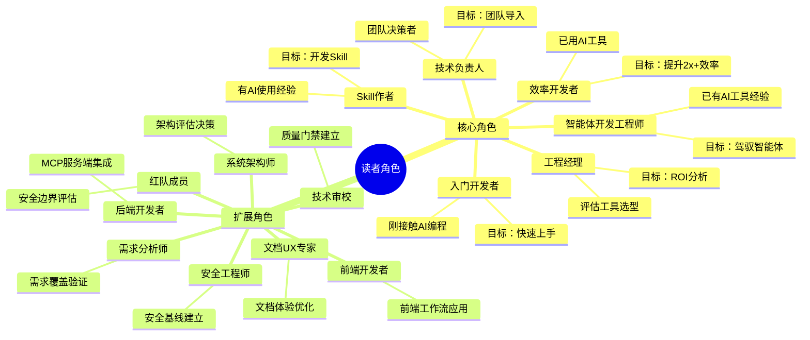
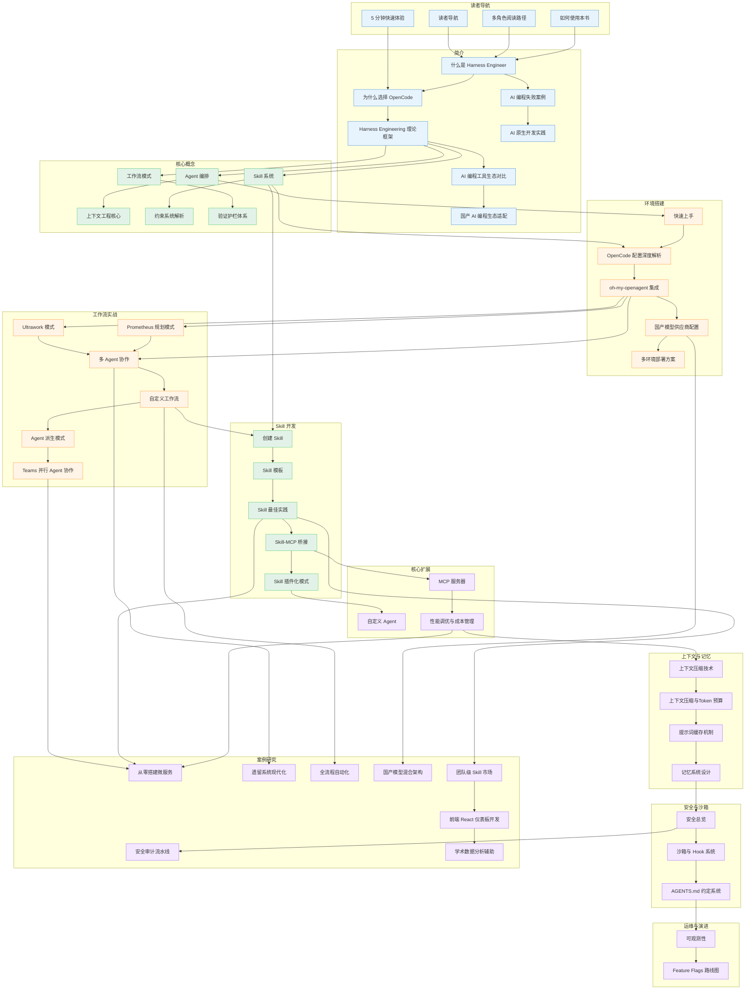

# 多角色阅读路径

> 不同背景的读者，从本书获取价值的路径各不相同。本文帮助你找到属于自己的那条路。

## 文章概述

一本涵盖 12 章 90 篇的技术书，从头读到尾并不是最高效的选择。本书设计了 14 种读者角色分类，每种角色对应不同的阅读路径。你可以根据自己的技术背景、职业角色和学习目标，跳过不相关的章节，直达最有价值的内容。读完本文，你将能够根据自己的技术背景和职业角色，找到最适合的阅读路径。

> **⏱ 时间有限？先读这些：** 14 种读者角色分类 → 各角色的完整阅读路径 → 跨路径对比与路径切换指南 → 阅读节奏建议

阅读路径不是简单的章节列表。每条路径都标注了预计阅读时间、建议的阅读顺序，以及哪些小节可以跳过。对于团队负责人和评估者，路径中还包含了对环境搭建和案例研究的定向指引。无论你是第一次接触 **Agent（智能体）** 编排的新手，还是已有 OpenCode 使用经验的老手，都能找到适合自己的路线。

> ✅ 本书 **77 篇文章全部完成**（100%）。阅读路径中标注了所有文章，各章节内容已全部完稿。

> **版本声明**：本书基于 OpenCode v1.17.x + oh-my-openagent v4.13.x 编写。

---

## 14 种读者角色分类

本书基于 55 个用户故事提炼出 14 种读者角色，分为 **6 个核心角色** 和 **8 个扩展角色**。核心角色覆盖 AI 编程的主流用户画像，扩展角色面向特定技术领域或职能需求。

### 角色分类树状图

下图以思维导图形式展示了 14 种读者角色的分类体系，分为 6 个核心角色和 8 个扩展角色。

### 核心角色定义

#### 入门开发者

> "每天花大量时间在重复性编码任务上，希望 AI 能帮忙但又担心出错。"

**典型背景**：刚接触 AI 编程，基本编程能力 OK

**核心关注点**：快速上手 OpenCode，在日常开发中用起来

**典型痛点**：刚入行不久，面对复杂项目无从下手；想用 AI 工具但不知道从哪里开始；担心 AI 生成的代码不可靠，不敢放心使用。

---

#### 智能体开发工程师

> "每天都在写重复的 prompt，好不容易调通了下次又忘了——我希望 Agent 能真正记住我的意图和工作方式。"

**典型背景**：已有 AI 编程工具使用经验，需要设计、调试、进化 AI 编码智能体

**核心关注点**：Agent 配置最佳实践、上下文工程与压缩策略、循环工程设计模式

**典型痛点**：Agent 行为不一致，同样的任务每次结果不同；上下文窗口频繁爆炸，需要反复压缩；调试 Agent 异常行为困难，缺乏系统化的排查方法；团队缺乏统一的 Agent 配置模板。

---

#### 效率开发者

> "已经用了一段时间 Copilot，但感觉还能更快——只是不知道瓶颈在哪里。"

**典型背景**：已用 AI 工具(Copilot/Cursor)，想升级

**核心关注点**：掌握 Agent 编排，提升 2x+ 效率

**典型痛点**：AI 工具用得顺手，但遇到复杂任务时仍然手忙脚乱；上下文切换频繁，重复解释需求给 AI；想定制工作流但不知如何下手。

---

#### 技术负责人

> "团队里每个人都在用不同的 AI 工具，代码风格五花八门，review 成本越来越高。"

**典型背景**：团队技术决策者，关注标准化

**核心关注点**：建立团队级 **Harness Engineering（驾驭工程）** 体系

**典型痛点**：团队成员 AI 使用水平参差不齐，难以形成合力；缺乏统一的工作流和最佳实践；担心 AI 引入带来的安全合规风险。

---

#### **Skill（技能）** 作者

> "每次都要重复写类似的提示词，真希望能封装成一个可复用的模块。"

**典型背景**：有一定 AI 使用经验，想扩展能力

**核心关注点**：掌握 Skill 开发方法，产出高质量 Skill

**典型痛点**：提示词越写越长，维护成本高；想让团队成员复用自己的经验，但缺乏标准化的封装方法；不知道如何设计 Skill 的边界和接口。

---

#### 工程经理

> "老板问 AI 工具的投资回报率，我只能给模糊的'感觉效率提升了'——没有数据支撑。"

**典型背景**：评估团队工具选型

**核心关注点**：判断 OpenCode 的投资回报率

**典型痛点**：AI 工具层出不穷，难以客观对比优劣；团队学习成本如何评估；如何量化 AI 工具带来的效率提升。

---

### 扩展角色定义

#### 需求分析师/产品经理

> "开发说需求不清晰，但我觉得已经写得很清楚了——沟通成本太高。"

**典型背景**：需求分析、产品规划经验

**核心关注点**：验证需求覆盖完整性、评估内容价值主张

**典型痛点**：需求文档写了又改，开发还是说看不懂；想验证 AI 是否能理解业务需求；担心 AI 加速开发后需求遗漏问题更严重。

---

#### 系统架构师/技术顾问

> "新技术栈引入容易，但怎么确保它不会成为明天的技术债务？"

**典型背景**：5年以上架构经验，负责技术决策

**核心关注点**：评估 OpenCode 的技术可行性、架构集成与安全合规

**典型痛点**：AI Agent 的行为不可预测，如何做架构决策；开源工具的安全合规如何评估；如何设计 AI 友好的系统架构。

---

#### 后端开发者/API 工程师

> "数据库 schema 改了，要更新十几个 API 接口——这种重复劳动最耗精力。"

**典型背景**：熟悉 REST/GraphQL/微服务/数据库

**核心关注点**：将 AI Agent 嵌入后端开发工作流、**MCP（模型上下文协议）** 服务端集成

**典型痛点**：CRUD 代码写腻了，但自动化工具又不够灵活；想用 AI 做代码生成，但生成的代码质量参差不齐；微服务间调用复杂，调试困难。

---

#### 前端开发者/UI 工程师

> "设计稿又改了，组件要跟着调整——如果能自动同步就好了。"

**典型背景**：熟悉 React/Vue/Angular、组件化开发

**核心关注点**：将 Agent 编排应用到前端场景、类比理解 Skill 系统

**典型痛点**：UI 调整频繁，手动同步耗时耗力；组件库文档和代码不同步；想用 AI 辅助开发，但前端场景的提示词不好写。

---

#### 文档 UX 专家

> "文档写了没人看，看了又看不懂——到底是内容问题还是呈现问题？"

**典型背景**：信息架构/开发者文档经验

**核心关注点**：确保文档可读性、Mermaid 规范、移动端/无障碍体验

**典型痛点**：技术文档更新跟不上代码变化；图表渲染在不同平台表现不一致；开发者反馈文档"太长不看"，但删减又怕遗漏关键信息。

---

#### 技术审校/QA 编辑

> "代码示例跑不通、术语前后不一致——这些问题在发布前才发现就晚了。"

**典型背景**：测试或技术写作背景

**核心关注点**：建立质量门禁、验证代码示例可运行性、术语一致性

**典型痛点**：人工审校效率低，容易遗漏问题；代码示例过时快，维护成本高；缺乏自动化的质量检查工具。

---

#### 安全工程师/架构师

> "AI Agent 能访问哪些数据？会不会被提示注入攻击？这些问题让我睡不着。"

**典型背景**：安全工程/合规/威胁建模

**核心关注点**：建立 OpenCode 安全基线、评估企业级合规

**典型痛点**：AI Agent 的权限边界难以界定；缺乏针对 AI 工具的安全评估框架；合规要求日新月异，难以跟上节奏。

---

#### 安全研究人员/红队成员

> "如果能用 AI 自动化渗透测试，效率能提升多少？但会不会也被攻击者利用？"

**典型背景**：渗透测试/安全研究

**核心关注点**：评估 AI Agent 攻击面、利用 Agent 自动化安全测试

**典型痛点**：渗透测试重复劳动多，想用 AI 自动化但担心误报率高；AI Agent 本身的安全漏洞如何发现；攻击者也在用 AI，防御如何跟上。

---

## 全局架构依赖图

在深入各角色阅读路径之前，理解 77 篇正文之间的概念依赖关系至关重要。下图展示了全书文章的依赖网络，帮助你规划个性化的阅读路线。

### 依赖关系总图

### 文章优先级标注

| 优先级 | 定义 | 文章列表 |
|--------|------|----------|
| **P0（必备）** | 核心概念、必读章节 | [读者导航](./), [多角色阅读路径](reading-paths.md), [5 分钟快速体验](quick-start.md), [什么是 Harness Engineer](../01-introduction/what-is-harness-engineer.md), [为什么选择 OpenCode](../01-introduction/why-opencode.md), [Harness Engineering 理论框架](../01-introduction/harness-engineering-theory.md), [Agent 编排](../02-core-concepts/agent-orchestration.md), [Skill 系统](../02-core-concepts/skills-system.md), [工作流模式](../02-core-concepts/workflow-patterns.md), [快速上手](../03-setup/quickstart.md), [OpenCode 配置深度解析](../03-setup/opencode-config.md), [Ultrawork 模式](../04-workflows/ultrawork-mode.md), [Prometheus 规划模式](../04-workflows/prometheus-mode.md), [多 Agent 协作](../04-workflows/multi-agent-collab.md), [创建 Skill](../05-skills/creating-skills.md), [Skill 模板](../05-skills/skill-templates.md), [安全总览](../06-advanced/security-overview.md), [从零搭建微服务](../07-case-studies/real-world-01.md) |
| **P1（重要）** | 进阶内容、推荐阅读 | [如何使用本书](how-to-read.md), [AI 编程工具生态对比](../01-introduction/ecosystem-comparison.md), [上下文工程核心](../02-core-concepts/context-engineering-core.md), [约束系统解析](../02-core-concepts/constraints-system.md), [验证护栏体系](../02-core-concepts/validation-harness.md), [oh-my-openagent 集成](../03-setup/oh-my-openagent-setup.md), [国产模型供应商配置](../03-setup/chinese-providers.md), [自定义工作流](../04-workflows/custom-workflows.md), [Agent 派生模式](../04-workflows/agent-derivation.md), [Skill 最佳实践](../05-skills/skill-best-practices.md), [Skill-MCP 桥接](../05-skills/skill-mcp-bridge.md), [MCP 服务器](../06-advanced/mcp-servers.md), [性能调优](../06-advanced/context/performance-tuning.md), [上下文压缩与Token 预算](../06-advanced/context-compression.md), [沙箱与 Hook 系统](../06-advanced/sandbox-hooks.md), [可观测性](../06-advanced/observability.md), [遗留系统现代化](../07-case-studies/real-world-02.md), [安全审计流水线](../07-case-studies/case-security-audit.md), [全流程自动化](../07-case-studies/case-full-pipeline.md), [国产模型混合架构](../07-case-studies/case-multi-model.md), [团队级 Skill 市场](../07-case-studies/case-skills-marketplace.md) |
| **P2（锦上添花）** | 高级话题、按需阅读 | [AI 编程失败案例](../01-introduction/failure-cases.md), [国产 AI 编程生态适配](../01-introduction/chinese-ecosystem.md), [多环境部署方案](../03-setup/multi-env-setup.md), [Teams 并行 Agent 协作](../04-workflows/teams-collaboration.md), [Skill 插件化模式](../05-skills/plugin-patterns.md), [自定义 Agent](../06-advanced/custom-agents.md), [提示词缓存机制](../06-advanced/context/prompt-caching.md), [记忆系统设计](../06-advanced/memory-system.md), [AGENTS.md 约定系统](../06-advanced/agents-dot-md.md), [Feature Flags 路线图](../06-advanced/feature-flags.md) |

---

## 各角色的完整阅读路径

### 路径 1：入门开发者

**目标**：快速上手 OpenCode，建立 Harness Engineering 的基本认知框架。

**预计阅读时间**：4-5 小时

**阅读模式**：精读核心章节，浏览案例

| 顺序 | 章节/文章 | 阅读模式 | 预计用时 | 状态 |
|------|----------|----------|----------|------|
| 1 | [什么是 Harness Engineer](../01-introduction/what-is-harness-engineer.md) | 精读 | 20-30 分钟 | ✅ 已完成 |
| 2 | [为什么选择 OpenCode](../01-introduction/why-opencode.md) | 精读 | 15-25 分钟 | ✅ 已完成 |
| 3 | [AI 编程工具生态对比](../01-introduction/ecosystem-comparison.md) | 浏览 | 15 分钟 | ✅ 已完成 |
| 4 | [Agent 编排](../02-core-concepts/agent-orchestration.md) | 精读 | 30-40 分钟 | ✅ 已完成 |
| 5 | [Skill 系统](../02-core-concepts/skills-system.md) | 精读 | 25-35 分钟 | ✅ 已完成 |
| 6 | [工作流模式](../02-core-concepts/workflow-patterns.md) | 精读 | 25-35 分钟 | ✅ 已完成 |
| 7 | [快速上手](../03-setup/quickstart.md) | 精读 | 30-40 分钟 | ✅ 已完成 |
| 8 | [OpenCode 配置深度解析](../03-setup/opencode-config.md) | 精读 | 30-40 分钟 | ✅ 已完成 |
| 9 | [Ultrawork 模式](../04-workflows/ultrawork-mode.md) | 精读 | 30-40 分钟 | ✅ 已完成 |
| 10 | [从零搭建微服务](../07-case-studies/real-world-01.md) | 浏览 | 20 分钟 | ✅ 已完成 |

**跳过建议**：
- [国产 AI 编程生态适配](../01-introduction/chinese-ecosystem.md)（如无国产模型需求）
- [国产模型供应商配置](../03-setup/chinese-providers.md)（如无国产模型需求）
- [Agent 派生模式](../04-workflows/agent-derivation.md)、[Teams 并行 Agent 协作](../04-workflows/teams-collaboration.md)（高级话题，初期可跳过）
- 高级话题全部（初期可跳过，待基础稳固后再回溯）

**路径特点**：
- 从认知到实践的渐进式路径
- 强调"第一个成功的尝试"
- 建立概念框架后再动手实践

---

### 路径 2：智能体开发工程师

**目标**：设计、调试、进化 AI 编码智能体，建立系统化的 Agent 工程体系。

**预计阅读时间**：6-7 小时

**阅读模式**：精读核心章节，深入高级话题

| 顺序 | 章节/文章 | 阅读模式 | 预计用时 | 状态 |
|------|----------|----------|----------|------|
| 1 | [什么是 Harness Engineer](../01-introduction/what-is-harness-engineer.md) | 精读 | 20-30 分钟 | ✅ 已完成 |
| 2 | [Harness Engineering 理论框架](../01-introduction/harness-engineering-theory.md) | 精读 | 30-40 分钟 | ✅ 已完成 |
| 3 | [Agent 编排](../02-core-concepts/agent-orchestration.md) | 精读 | 35-45 分钟 | ✅ 已完成 |
| 4 | [上下文工程核心](../02-core-concepts/context-engineering-core.md) | 精读 | 30-40 分钟 | ✅ 已完成 |
| 5 | [约束系统解析](../02-core-concepts/constraints-system.md) | 精读 | 30-40 分钟 | ✅ 已完成 |
| 6 | [验证护栏体系](../02-core-concepts/validation-harness.md) | 精读 | 25-35 分钟 | ✅ 已完成 |
| 7 | [OpenCode 配置深度解析](../03-setup/opencode-config.md) | 精读 | 35-45 分钟 | ✅ 已完成 |
| 8 | [Ultrawork 模式](../04-workflows/ultrawork-mode.md) | 精读 | 35-45 分钟 | ✅ 已完成 |
| 9 | [多 Agent 协作](../04-workflows/multi-agent-collab.md) | 精读 | 40-50 分钟 | ✅ 已完成 |
| 10 | [自定义工作流](../04-workflows/custom-workflows.md) | 精读 | 35-45 分钟 | ✅ 已完成 |
| 11 | [Prometheus 规划模式](../04-workflows/prometheus-mode.md) | 精读 | 30-40 分钟 | ✅ 已完成 |
| 12 | [上下文压缩与Token 预算](../06-advanced/context-compression.md) | 精读 | 30-40 分钟 | ✅ 已完成 |
| 13 | [AGENTS.md 约定系统](../06-advanced/agents-dot-md.md) | 精读 | 30-40 分钟 | ✅ 已完成 |
| 14 | [从零搭建微服务](../07-case-studies/real-world-01.md) | 浏览 | 20 分钟 | ✅ 已完成 |

**跳过建议**：
- [为什么选择 OpenCode](../01-introduction/why-opencode.md)、[AI 编程工具生态对比](../01-introduction/ecosystem-comparison.md)（已有 AI 工具使用经验，可快速浏览）
- [快速上手](../03-setup/quickstart.md)（已有 OpenCode 基础，可跳过）
- [Skill 系统](../02-core-concepts/skills-system.md)、[工作流模式](../02-core-concepts/workflow-patterns.md)（核心概念，了解即可）
- [国产 AI 编程生态适配](../01-introduction/chinese-ecosystem.md)、[国产模型供应商配置](../03-setup/chinese-providers.md)（如无国产模型需求）
- [创建 **Skill（技能）**](../05-skills/creating-skills.md)（按需阅读，非核心路径）
- [案例二：遗留系统现代化](../07-case-studies/real-world-02.md)（初期可跳过）

**路径特点**：
- 聚焦 Agent 配置和上下文工程
- 强调循环工程和调试方法论
- 包含高级优化和可观测性

---

### 路径 3：效率开发者

**目标**：掌握 Agent 编排和工作流模式，提升日常开发效率 2x+。

**预计阅读时间**：5-6 小时

**阅读模式**：精读核心章节，深入实践章节

| 顺序 | 章节/文章 | 阅读模式 | 预计用时 | 状态 |
|------|----------|----------|----------|------|
| 1 | [Harness Engineering 理论框架](../01-introduction/harness-engineering-theory.md) | 精读 | 25-35 分钟 | ✅ 已完成 |
| 2 | [Agent 编排](../02-core-concepts/agent-orchestration.md) | 精读 | 35-45 分钟 | ✅ 已完成 |
| 3 | [工作流模式](../02-core-concepts/workflow-patterns.md) | 精读 | 30-40 分钟 | ✅ 已完成 |
| 4 | [上下文工程核心](../02-core-concepts/context-engineering-core.md) | 精读 | 30-40 分钟 | ✅ 已完成 |
| 5 | [约束系统解析](../02-core-concepts/constraints-system.md) | 精读 | 25-35 分钟 | ✅ 已完成 |
| 6 | [oh-my-openagent 集成](../03-setup/oh-my-openagent-setup.md) | 精读 | 30-40 分钟 | ✅ 已完成 |
| 7 | [Ultrawork 模式](../04-workflows/ultrawork-mode.md) | 精读 | 35-45 分钟 | ✅ 已完成 |
| 8 | [多 Agent 协作](../04-workflows/multi-agent-collab.md) | 精读 | 40-50 分钟 | ✅ 已完成 |
| 9 | [自定义工作流](../04-workflows/custom-workflows.md) | 精读 | 35-45 分钟 | ✅ 已完成 |
| 10 | [性能调优](../06-advanced/context/performance-tuning.md) | 精读 | 25-35 分钟 | ✅ 已完成 |
| 11 | [上下文压缩与Token 预算](../06-advanced/context-compression.md) | 精读 | 20-30 分钟 | ✅ 已完成 |
| 12 | [从零搭建微服务](../07-case-studies/real-world-01.md) | 精读 | 30-40 分钟 | ✅ 已完成 |

**跳过建议**：
- [什么是 Harness Engineer](../01-introduction/what-is-harness-engineer.md), [为什么选择 OpenCode](../01-introduction/why-opencode.md)（已有 AI 工具使用经验，可快速浏览）
- [快速上手](../03-setup/quickstart.md)（已有 OpenCode 基础，可跳过）
- [国产 AI 编程生态适配](../01-introduction/chinese-ecosystem.md), [国产模型供应商配置](../03-setup/chinese-providers.md)（如无国产模型需求）
- [自定义 Agent](../06-advanced/custom-agents.md)（初期可跳过）
- [提示词缓存机制](../06-advanced/context/prompt-caching.md)、[记忆系统设计](../06-advanced/memory-system.md)（高级优化，按需阅读）

**路径特点**：
- 跳过入门章节，直接深入核心概念
- 强调工作流模式和 Agent 编排技巧
- 包含成本优化相关章节

---

### 路径 4：技术负责人

**目标**：评估和导入 OpenCode，建立团队级 Harness Engineering 体系。

**预计阅读时间**：6-7 小时

**阅读模式**：精读评估章节，浏览实战细节

| 顺序 | 章节/文章 | 阅读模式 | 预计用时 | 状态 |
|------|----------|----------|----------|------|
| 1 | [什么是 Harness Engineer](../01-introduction/what-is-harness-engineer.md) | 精读 | 20-30 分钟 | ✅ 已完成 |
| 2 | [为什么选择 OpenCode](../01-introduction/why-opencode.md) | 精读 | 20-30 分钟 | ✅ 已完成 |
| 3 | [Harness Engineering 理论框架](../01-introduction/harness-engineering-theory.md) | 精读 | 30-40 分钟 | ✅ 已完成 |
| 4 | [AI 编程工具生态对比](../01-introduction/ecosystem-comparison.md) | 精读 | 25-35 分钟 | ✅ 已完成 |
| 5 | [Agent 编排](../02-core-concepts/agent-orchestration.md) | 精读 | 30-40 分钟 | ✅ 已完成 |
| 6 | [Skill 系统](../02-core-concepts/skills-system.md) | 精读 | 25-35 分钟 | ✅ 已完成 |
| 7 | [工作流模式](../02-core-concepts/workflow-patterns.md) | 精读 | 25-35 分钟 | ✅ 已完成 |
| 8 | [OpenCode 配置深度解析](../03-setup/opencode-config.md) | 精读 | 35-45 分钟 | ✅ 已完成 |
| 9 | [多环境部署方案](../03-setup/multi-env-setup.md) | 精读 | 30-40 分钟 | ✅ 已完成 |
| 10 | [多 Agent 协作](../04-workflows/multi-agent-collab.md) | 精读 | 35-45 分钟 | ✅ 已完成 |
| 11 | [Teams 并行 Agent 协作](../04-workflows/teams-collaboration.md) | 精读 | 30-40 分钟 | ✅ 已完成 |
| 12 | [安全总览](../06-advanced/security-overview.md) | 精读 | 35-45 分钟 | ✅ 已完成 |
| 13 | [沙箱与 Hook 系统](../06-advanced/sandbox-hooks.md) | 精读 | 30-40 分钟 | ✅ 已完成 |
| 14 | [从零搭建微服务](../07-case-studies/real-world-01.md) | 浏览 | 20 分钟 | ✅ 已完成 |
| 15 | [团队级 Skill 市场](../07-case-studies/case-skills-marketplace.md) | 精读 | 30-40 分钟 | ✅ 已完成 |

**跳过建议**：
- [快速上手](../03-setup/quickstart.md)（评估阶段可跳过）
- [oh-my-openagent 集成](../03-setup/oh-my-openagent-setup.md)（可交给团队成员实施）
- [Ultrawork 模式](../04-workflows/ultrawork-mode.md)（了解即可，无需深入细节）
- [创建 Skill](../05-skills/creating-skills.md)（可交给 Skill 作者）
- [上下文压缩与Token 预算](../06-advanced/context-compression.md)（技术细节，可跳过）

**路径特点**：
- 聚焦评估和决策所需信息
- 强调安全合规和团队部署
- 包含多环境部署和团队协作章节

---

### 路径 5：Skill 作者

**目标**：掌握 Skill 开发方法，产出高质量、可维护的 Skill。

**预计阅读时间**：5-6 小时

**阅读模式**：精读 Skill 相关章节，深入实践

| 顺序 | 章节/文章 | 阅读模式 | 预计用时 | 状态 |
|------|----------|----------|----------|------|
| 1 | [Harness Engineering 理论框架](../01-introduction/harness-engineering-theory.md) | 浏览 | 15 分钟 | ✅ 已完成 |
| 2 | [Skill 系统](../02-core-concepts/skills-system.md) | 精读 | 40-50 分钟 | ✅ 已完成 |
| 3 | [约束系统解析](../02-core-concepts/constraints-system.md) | 精读 | 30-40 分钟 | ✅ 已完成 |
| 4 | [OpenCode 配置深度解析](../03-setup/opencode-config.md) | 精读 | 30-40 分钟 | ✅ 已完成 |
| 5 | [创建 Skill](../05-skills/creating-skills.md) | 精读 | 45-55 分钟 | ✅ 已完成 |
| 6 | [Skill 模板](../05-skills/skill-templates.md) | 精读 | 40-50 分钟 | ✅ 已完成 |
| 7 | [Skill 最佳实践](../05-skills/skill-best-practices.md) | 精读 | 40-50 分钟 | ✅ 已完成 |
| 8 | [Skill-MCP 桥接](../05-skills/skill-mcp-bridge.md) | 精读 | 35-45 分钟 | ✅ 已完成 |
| 9 | [Skill 插件化模式](../05-skills/plugin-patterns.md) | 精读 | 30-40 分钟 | ✅ 已完成 |
| 10 | [MCP 服务器](../06-advanced/mcp-servers.md) | 精读 | 35-45 分钟 | ✅ 已完成 |
| 11 | [团队级 Skill 市场](../07-case-studies/case-skills-marketplace.md) | 精读 | 30-40 分钟 | ✅ 已完成 |

**跳过建议**：
- [什么是 Harness Engineer](../01-introduction/what-is-harness-engineer.md), [为什么选择 OpenCode](../01-introduction/why-opencode.md), [AI 编程工具生态对比](../01-introduction/ecosystem-comparison.md)（入门章节，可快速浏览）
- [Agent 编排](../02-core-concepts/agent-orchestration.md)（了解即可，无需深入）
- [快速上手](../03-setup/quickstart.md)（已有 OpenCode 使用经验）
- [Ultrawork 模式](../04-workflows/ultrawork-mode.md)（了解即可，重点在 Skill 开发）
- [自定义 Agent](../06-advanced/custom-agents.md)（与 Skill 开发关联度较低）
- [上下文压缩与Token 预算](../06-advanced/context-compression.md)（高级优化，按需阅读）

**路径特点**：
- 以 Skill 开发为核心，深入实践
- 强调 Skill 设计原则和最佳实践
- 包含 MCP 桥接和插件化模式

---

### 路径 6：工程经理

**目标**：评估 OpenCode 的投资回报率，做出工具选型决策。

**预计阅读时间**：3-4 小时

**阅读模式**：浏览核心章节，精读案例研究

| 顺序 | 章节/文章 | 阅读模式 | 预计用时 | 状态 |
|------|----------|----------|----------|------|
| 1 | [什么是 Harness Engineer](../01-introduction/what-is-harness-engineer.md) | 浏览 | 15 分钟 | ✅ 已完成 |
| 2 | [为什么选择 OpenCode](../01-introduction/why-opencode.md) | 精读 | 20-30 分钟 | ✅ 已完成 |
| 3 | [AI 编程工具生态对比](../01-introduction/ecosystem-comparison.md) | 精读 | 30-40 分钟 | ✅ 已完成 |
| 4 | [Harness Engineering 理论框架](../01-introduction/harness-engineering-theory.md) | 浏览 | 20 分钟 | ✅ 已完成 |
| 5 | [Agent 编排](../02-core-concepts/agent-orchestration.md) | 浏览 | 15 分钟 | ✅ 已完成 |
| 6 | [Skill 系统](../02-core-concepts/skills-system.md) | 浏览 | 15 分钟 | ✅ 已完成 |
| 7 | [工作流模式](../02-core-concepts/workflow-patterns.md) | 浏览 | 15 分钟 | ✅ 已完成 |
| 8 | [性能调优](../06-advanced/context/performance-tuning.md) | 浏览 | 15 分钟 | ✅ 已完成 |
| 9 | [上下文压缩与Token 预算](../06-advanced/context-compression.md) | 浏览 | 15 分钟 | ✅ 已完成 |
| 10 | [从零搭建微服务](../07-case-studies/real-world-01.md) | 精读 | 30-40 分钟 | ✅ 已完成 |
| 11 | [遗留系统现代化](../07-case-studies/real-world-02.md) | 精读 | 30-40 分钟 | ✅ 已完成 |
| 12 | [全流程自动化](../07-case-studies/case-full-pipeline.md) | 精读 | 25-35 分钟 | ✅ 已完成 |

**跳过建议**：
- [快速上手](../03-setup/quickstart.md)（技术实施细节，可交给团队）
- [Ultrawork 模式](../04-workflows/ultrawork-mode.md)（技术实施细节，可交给团队）
- [创建 **Skill（技能）**](../05-skills/creating-skills.md)（技术实施细节，可交给团队）
- [MCP 服务器](../06-advanced/mcp-servers.md), [自定义 Agent](../06-advanced/custom-agents.md), [上下文压缩与Token 预算](../06-advanced/context-compression.md), [提示词缓存机制](../06-advanced/context/prompt-caching.md) 高级话题（技术细节，可跳过）

**路径特点**：
- 聚焦工具对比和 ROI 分析
- 强调案例研究的实际效果
- 跳过技术实施细节

#### AI 编程工具的 ROI 评估框架

在决定是否为团队引入 AI 编程工具之前，用以下公式做一次粗算：

**ROI = (时间节省 × 人力成本 + 质量提升价值 - 工具成本 - 培训成本) / (工具成本 + 培训成本)**

##### 量化示例：10 人团队，6 个月

| 指标 | 数值 | 说明 |
|------|------|------|
| 团队规模 | 10 人 | 中小型开发团队 |
| 人均月薪（含福利） | $X,XXX | 按 $50/h 时薪折算 |
| 平均编码时间占比 | 60% | 其余为会议、review、沟通 |
| AI 辅助时间节省 | 30% | 行业中位数（来源：GitHub Copilot 研究） |
| 每人每月节省 | ~16 小时 | 160h × 60% × 30% ≈ 29h（取保守值 16h） |
| 团队月节省 | ~160 小时 | 16h × 10 人 |
| 人力成本节省 | $8,000/月 | 160h × $50/h |
| 工具成本 | $200/月 | $20/人/月 × 10 人 |
| **月净收益** | **$7,800** | $8,000 - $200 |
| **6 个月 ROI** | **2,340%** | ($7,800 × 6) / ($200 × 6) |

> **注意**：以上为简化模型。实际 ROI 还需考虑质量提升（减少 bug 修复时间）、学习曲线（前 2-4 周效率下降）和隐性收益（开发者满意度、招聘吸引力）。

##### 决策检查清单

回答以下 5 个问题，判断 AI 编程工具是否适合你的团队：

1. **团队是否有标准化的编码规范？** AI 生成的代码需要一致的风格约束，否则 review 成本可能反而上升。
2. **现有工作流中重复性任务占比如何？** CRUD、模板代码、测试编写等重复任务占比越高，AI 辅助的收益越大。
3. **团队成员的 AI 工具使用经验如何？** 零基础团队需要 2-4 周培训期，期间产出可能短暂下降。
4. **项目是否涉及敏感数据或合规要求？** 代码和上下文会发送到云端模型，需评估数据安全风险。
5. **是否有专人负责工具选型和推广？** 缺乏内部 champion 的工具导入，往往在 3 个月内被弃用。

> 如果 5 个问题中至少 3 个回答"是"，AI 编程工具值得试用。建议从 1-2 人的 pilot 开始，用 4 周时间收集数据后再决定全团队推广。

---

### 路径 7：需求分析师/产品经理

**目标**：验证需求覆盖完整性，评估内容价值主张。

**预计阅读时间**：4-5 小时

**阅读模式**：浏览全局，精读价值声明

| 顺序 | 章节/文章 | 阅读模式 | 预计用时 | 状态 |
|------|----------|----------|----------|------|
| 1 | [读者导航](./) | 精读 | 15-25 分钟 | ✅ 已完成 |
| 2 | [多角色阅读路径](reading-paths.md) | 精读 | 25-35 分钟 | ✅ 已完成 |
| 3 | [什么是 Harness Engineer](../01-introduction/what-is-harness-engineer.md) | 精读 | 20-30 分钟 | ✅ 已完成 |
| 4 | [为什么选择 OpenCode](../01-introduction/why-opencode.md) | 精读 | 15-25 分钟 | ✅ 已完成 |
| 5 | [Harness Engineering 理论框架](../01-introduction/harness-engineering-theory.md) | 精读 | 25-35 分钟 | ✅ 已完成 |
| 6 | [AI 编程工具生态对比](../01-introduction/ecosystem-comparison.md) | 浏览 | 15 分钟 | ✅ 已完成 |
| 7 | [**Agent（智能体）** 编排](../02-core-concepts/agent-orchestration.md) | 浏览 | 60 分钟 | ✅ 已完成 |
| 8 | [案例一：从零搭建微服务](../07-case-studies/real-world-01.md) | 浏览 | 60 分钟 | ✅ 已完成 |

**跳过建议**：
- [快速上手](../03-setup/quickstart.md)（技术实施细节）
- [Ultrawork 模式](../04-workflows/ultrawork-mode.md)（技术实施细节）
- [创建 **Skill（技能）**](../05-skills/creating-skills.md)（技术实施细节）
- [**MCP（模型上下文协议）** 服务器](../06-advanced/mcp-servers.md)（技术细节）

**路径特点**：
- 全局视角，验证需求覆盖
- 强调价值声明和读者旅程
- 跳过技术实施细节

---

### 路径 8：系统架构师/技术顾问

**目标**：评估 OpenCode 的技术可行性、架构集成与安全合规。

**预计阅读时间**：7-8 小时

**阅读模式**：精读架构相关章节，深入安全分析

| 顺序 | 章节/文章 | 阅读模式 | 预计用时 | 状态 |
|------|----------|----------|----------|------|
| 1 | [为什么选择 OpenCode](../01-introduction/why-opencode.md) | 精读 | 20-30 分钟 | ✅ 已完成 |
| 2 | [Harness Engineering 理论框架](../01-introduction/harness-engineering-theory.md) | 精读 | 30-40 分钟 | ✅ 已完成 |
| 3 | [AI 编程工具生态对比](../01-introduction/ecosystem-comparison.md) | 精读 | 30-40 分钟 | ✅ 已完成 |
| 4 | [Agent 编排](../02-core-concepts/agent-orchestration.md) | 精读 | 35-45 分钟 | ✅ 已完成 |
| 5 | [Skill 系统](../02-core-concepts/skills-system.md) | 精读 | 30-40 分钟 | ✅ 已完成 |
| 6 | [约束系统解析](../02-core-concepts/constraints-system.md) | 精读 | 30-40 分钟 | ✅ 已完成 |
| 7 | [OpenCode 配置深度解析](../03-setup/opencode-config.md) | 精读 | 40-50 分钟 | ✅ 已完成 |
| 8 | [多环境部署方案](../03-setup/multi-env-setup.md) | 精读 | 35-45 分钟 | ✅ 已完成 |
| 9 | [多 Agent 协作](../04-workflows/multi-agent-collab.md) | 精读 | 35-45 分钟 | ✅ 已完成 |
| 10 | [Teams 并行 Agent 协作](../04-workflows/teams-collaboration.md) | 精读 | 30-40 分钟 | ✅ 已完成 |
| 11 | [Skill 最佳实践](../05-skills/skill-best-practices.md) | 精读 | 30-40 分钟 | ✅ 已完成 |
| 12 | [MCP 服务器](../06-advanced/mcp-servers.md) | 精读 | 40-50 分钟 | ✅ 已完成 |
| 13 | [安全总览](../06-advanced/security-overview.md) | 精读 | 45-55 分钟 | ✅ 已完成 |
| 14 | [沙箱与 Hook 系统](../06-advanced/sandbox-hooks.md) | 精读 | 40-50 分钟 | ✅ 已完成 |
| 15 | [安全审计流水线](../07-case-studies/case-security-audit.md) | 精读 | 35-45 分钟 | ✅ 已完成 |

**跳过建议**：
- [什么是 Harness Engineer](../01-introduction/what-is-harness-engineer.md), [国产 AI 编程生态适配](../01-introduction/chinese-ecosystem.md)（入门和国产模型章节，按需阅读）
- [快速上手](../03-setup/quickstart.md), [oh-my-openagent 集成](../03-setup/oh-my-openagent-setup.md), [国产模型供应商配置](../03-setup/chinese-providers.md)（环境搭建细节，可快速浏览）
- [Ultrawork 模式](../04-workflows/ultrawork-mode.md), [自定义工作流](../04-workflows/custom-workflows.md), [Agent 派生模式](../04-workflows/agent-derivation.md)（工作流细节，了解即可）
- [创建 Skill](../05-skills/creating-skills.md), [Skill 模板](../05-skills/skill-templates.md), [Skill-MCP 桥接](../05-skills/skill-mcp-bridge.md), [Skill 插件化模式](../05-skills/plugin-patterns.md)（Skill 开发细节，了解即可）
- [自定义 Agent](../06-advanced/custom-agents.md), [上下文压缩与Token 预算](../06-advanced/context-compression.md), [提示词缓存机制](../06-advanced/context/prompt-caching.md), [记忆系统设计](../06-advanced/memory-system.md), [AGENTS.md 约定系统](../06-advanced/agents-dot-md.md), [Feature Flags 路线图](../06-advanced/feature-flags.md)（高级话题，按需阅读）

**路径特点**：
- 深入架构和安全分析
- 强调威胁建模和合规评估
- 包含多团队架构治理

---

### 路径 9：后端开发者/API 工程师

**目标**：将 AI Agent 嵌入后端开发工作流，掌握 MCP 服务端集成。

**预计阅读时间**：5-6 小时

**阅读模式**：精读 MCP 和后端相关章节

| 顺序 | 章节/文章 | 阅读模式 | 预计用时 | 状态 |
|------|----------|----------|----------|------|
| 1 | [Harness Engineering 理论框架](../01-introduction/harness-engineering-theory.md) | 浏览 | 15 分钟 | ✅ 已完成 |
| 2 | [Agent 编排](../02-core-concepts/agent-orchestration.md) | 精读 | 30-40 分钟 | ✅ 已完成 |
| 3 | [Skill 系统](../02-core-concepts/skills-system.md) | 精读 | 25-35 分钟 | ✅ 已完成 |
| 4 | [OpenCode 配置深度解析](../03-setup/opencode-config.md) | 精读 | 30-40 分钟 | ✅ 已完成 |
| 5 | [多 Agent 协作](../04-workflows/multi-agent-collab.md) | 精读 | 35-45 分钟 | ✅ 已完成 |
| 6 | [Skill-MCP 桥接](../05-skills/skill-mcp-bridge.md) | 精读 | 35-45 分钟 | ✅ 已完成 |
| 7 | [MCP 服务器](../06-advanced/mcp-servers.md) | 精读 | 50-60 分钟 | ✅ 已完成 |
| 8 | [安全总览](../06-advanced/security-overview.md) | 精读 | 30-40 分钟 | ✅ 已完成 |
| 9 | [从零搭建微服务](../07-case-studies/real-world-01.md) | 精读 | 40-50 分钟 | ✅ 已完成 |
| 10 | [国产模型混合架构](../07-case-studies/case-multi-model.md) | 精读 | 30-40 分钟 | ✅ 已完成 |

**跳过建议**：
- [什么是 Harness Engineer](../01-introduction/what-is-harness-engineer.md), [为什么选择 OpenCode](../01-introduction/why-opencode.md), [AI 编程工具生态对比](../01-introduction/ecosystem-comparison.md), [国产 AI 编程生态适配](../01-introduction/chinese-ecosystem.md)（入门章节，可快速浏览）
- [工作流模式](../02-core-concepts/workflow-patterns.md), [上下文工程核心](../02-core-concepts/context-engineering-core.md), [约束系统解析](../02-core-concepts/constraints-system.md), [验证护栏体系](../02-core-concepts/validation-harness.md)（核心概念细节，了解即可）
- [快速上手](../03-setup/quickstart.md), [oh-my-openagent 集成](../03-setup/oh-my-openagent-setup.md), [国产模型供应商配置](../03-setup/chinese-providers.md), [多环境部署方案](../03-setup/multi-env-setup.md)（环境搭建细节，按需阅读）
- [Ultrawork 模式](../04-workflows/ultrawork-mode.md), [自定义工作流](../04-workflows/custom-workflows.md), [Agent 派生模式](../04-workflows/agent-derivation.md), [Teams 并行 Agent 协作](../04-workflows/teams-collaboration.md)（工作流细节，了解即可）
- [创建 Skill](../05-skills/creating-skills.md), [Skill 模板](../05-skills/skill-templates.md), [Skill 最佳实践](../05-skills/skill-best-practices.md), [Skill 插件化模式](../05-skills/plugin-patterns.md)（Skill 开发细节，按需阅读）
- [自定义 Agent](../06-advanced/custom-agents.md), [上下文压缩与Token 预算](../06-advanced/context-compression.md), [提示词缓存机制](../06-advanced/context/prompt-caching.md), [记忆系统设计](../06-advanced/memory-system.md), [沙箱与 Hook 系统](../06-advanced/sandbox-hooks.md), [AGENTS.md 约定系统](../06-advanced/agents-dot-md.md), [可观测性](../06-advanced/observability.md), [Feature Flags 路线图](../06-advanced/feature-flags.md)（高级话题，按需阅读）

**路径特点**：
- 以 MCP 服务端集成为核心
- 强调后端场景的 Agent 协作
- 包含微服务架构案例

---

### 路径 10：前端开发者/UI 工程师

**目标**：将 Agent 编排应用到前端场景，类比理解 Skill 系统。

**预计阅读时间**：4-5 小时

**阅读模式**：精读前端相关章节，类比学习

| 顺序 | 章节/文章 | 阅读模式 | 预计用时 | 状态 |
|------|----------|----------|----------|------|
| 1 | [Harness Engineering 理论框架](../01-introduction/harness-engineering-theory.md) | 浏览 | 15 分钟 | ✅ 已完成 |
| 2 | [Skill 系统](../02-core-concepts/skills-system.md) | 精读 | 40-50 分钟 | ✅ 已完成 |
| 3 | [工作流模式](../02-core-concepts/workflow-patterns.md) | 精读 | 30-40 分钟 | ✅ 已完成 |
| 4 | [OpenCode 配置深度解析](../03-setup/opencode-config.md) | 精读 | 25-35 分钟 | ✅ 已完成 |
| 5 | [Ultrawork 模式](../04-workflows/ultrawork-mode.md) | 精读 | 30-40 分钟 | ✅ 已完成 |
| 6 | [创建 Skill](../05-skills/creating-skills.md) | 精读 | 35-45 分钟 | ✅ 已完成 |
| 7 | [Skill 模板](../05-skills/skill-templates.md) | 精读 | 30-40 分钟 | ✅ 已完成 |
| 8 | [Skill 最佳实践](../05-skills/skill-best-practices.md) | 精读 | 35-45 分钟 | ✅ 已完成 |
| 9 | [从零搭建微服务](../07-case-studies/real-world-01.md) | 浏览 | 20 分钟 | ✅ 已完成 |
| 10 | [全流程自动化](../07-case-studies/case-full-pipeline.md) | 浏览 | 20 分钟 | ✅ 已完成 |

**跳过建议**：
- [什么是 Harness Engineer](../01-introduction/what-is-harness-engineer.md), [为什么选择 OpenCode](../01-introduction/why-opencode.md), [AI 编程工具生态对比](../01-introduction/ecosystem-comparison.md), [国产 AI 编程生态适配](../01-introduction/chinese-ecosystem.md)（入门章节，可快速浏览）
- [Agent 编排](../02-core-concepts/agent-orchestration.md), [上下文工程核心](../02-core-concepts/context-engineering-core.md), [约束系统解析](../02-core-concepts/constraints-system.md), [验证护栏体系](../02-core-concepts/validation-harness.md)（核心概念细节，了解即可）
- [快速上手](../03-setup/quickstart.md), [oh-my-openagent 集成](../03-setup/oh-my-openagent-setup.md), [国产模型供应商配置](../03-setup/chinese-providers.md), [多环境部署方案](../03-setup/multi-env-setup.md)（环境搭建细节，按需阅读）
- [多 Agent 协作](../04-workflows/multi-agent-collab.md), [自定义工作流](../04-workflows/custom-workflows.md), [Agent 派生模式](../04-workflows/agent-derivation.md), [Teams 并行 Agent 协作](../04-workflows/teams-collaboration.md)（工作流细节，了解即可）
- [Skill-MCP 桥接](../05-skills/skill-mcp-bridge.md), [Skill 插件化模式](../05-skills/plugin-patterns.md)（MCP 和插件化，按需阅读）
- [**MCP（模型上下文协议）** 服务器](../06-advanced/mcp-servers.md)（高级话题，按需阅读）

**路径特点**：
- 通过组件化类比理解 Skill 系统
- 强调前端场景的工作流应用
- 包含 UI 审查 Skill 模板

---

### 路径 11：文档 UX 专家

**目标**：确保文档可读性、Mermaid 规范、移动端/无障碍体验。

**预计阅读时间**：3-4 小时

**阅读模式**：浏览全局，精读规范相关章节

| 顺序 | 章节/文章 | 阅读模式 | 预计用时 | 状态 |
|------|----------|----------|----------|------|
| 1 | [读者导航](./) | 精读 | 15-25 分钟 | ✅ 已完成 |
| 2 | [多角色阅读路径](reading-paths.md) | 精读 | 20-30 分钟 | ✅ 已完成 |
| 3 | [什么是 Harness Engineer](../01-introduction/what-is-harness-engineer.md) | 浏览 | 40 分钟 | ✅ 已完成 |
| 4 | [**Agent（智能体）** 编排](../02-core-concepts/agent-orchestration.md) | 浏览 | 50 分钟 | ✅ 已完成 |
| 5 | [案例一：从零搭建微服务](../07-case-studies/real-world-01.md) | 浏览 | 50 分钟 | ✅ 已完成 |

**跳过建议**：
- [快速上手](../03-setup/quickstart.md)（技术实施细节）
- [Ultrawork 模式](../04-workflows/ultrawork-mode.md)（技术实施细节）
- [创建 **Skill（技能）**](../05-skills/creating-skills.md)（技术实施细节）
- [**MCP（模型上下文协议）** 服务器](../06-advanced/mcp-servers.md)（技术细节）

**路径特点**：
- 全局视角，关注文档体验
- 强调 Mermaid 规范和代码块标准
- 跳过技术实施细节

---

### 路径 12：技术审校/QA 编辑

**目标**：建立质量门禁、验证代码示例可运行性、术语一致性。

**预计阅读时间**：6-7 小时

**阅读模式**：精读全部章节，验证质量

| 顺序 | 章节/文章 | 阅读模式 | 预计用时 | 状态 |
|------|----------|----------|----------|------|
| 1 | [读者导航](./) | 精读 | 15-25 分钟 | ✅ 已完成 |
| 2 | [多角色阅读路径](reading-paths.md) | 精读 | 20-30 分钟 | ✅ 已完成 |
| 3 | [什么是 Harness Engineer](../01-introduction/what-is-harness-engineer.md) | 精读 | 60-70 分钟 | ✅ 已完成 |
| 4 | [**Agent（智能体）** 编排](../02-core-concepts/agent-orchestration.md) | 精读 | 90-100 分钟 | ✅ 已完成 |
| 5 | [快速上手](../03-setup/quickstart.md) | 精读 | 90-100 分钟 | ✅ 已完成 |
| 6 | [Ultrawork 模式](../04-workflows/ultrawork-mode.md) | 精读 | 90-100 分钟 | ✅ 已完成 |
| 7 | [创建 **Skill（技能）**](../05-skills/creating-skills.md) | 精读 | 75-85 分钟 | ✅ 已完成 |
| 8 | [**MCP（模型上下文协议）** 服务器](../06-advanced/mcp-servers.md) | 精读 | 120-130 分钟 | ✅ 已完成 |
| 9 | [案例一：从零搭建微服务](../07-case-studies/real-world-01.md) | 精读 | 90-100 分钟 | ✅ 已完成 |

**跳过建议**：无（需要全面验证）

**路径特点**：
- 全覆盖路径，验证质量门禁
- 强调代码示例可运行性
- 包含术语一致性检查

---

### 路径 13：安全工程师/架构师

**目标**：建立 OpenCode 安全基线，评估企业级合规。

**预计阅读时间**：5-6 小时

**阅读模式**：精读安全相关章节，深入威胁分析

| 顺序 | 章节/文章 | 阅读模式 | 预计用时 | 状态 |
|------|----------|----------|----------|------|
| 1 | [Harness Engineering 理论框架](../01-introduction/harness-engineering-theory.md) | 浏览 | 15 分钟 | ✅ 已完成 |
| 2 | [约束系统解析](../02-core-concepts/constraints-system.md) | 精读 | 35-45 分钟 | ✅ 已完成 |
| 3 | [OpenCode 配置深度解析](../03-setup/opencode-config.md) | 精读 | 35-45 分钟 | ✅ 已完成 |
| 4 | [多 Agent 协作](../04-workflows/multi-agent-collab.md) | 精读 | 30-40 分钟 | ✅ 已完成 |
| 5 | [Skill 最佳实践](../05-skills/skill-best-practices.md) | 精读 | 30-40 分钟 | ✅ 已完成 |
| 6 | [MCP 服务器](../06-advanced/mcp-servers.md) | 精读 | 40-50 分钟 | ✅ 已完成 |
| 7 | [安全总览](../06-advanced/security-overview.md) | 精读 | 50-60 分钟 | ✅ 已完成 |
| 8 | [沙箱与 Hook 系统](../06-advanced/sandbox-hooks.md) | 精读 | 45-55 分钟 | ✅ 已完成 |
| 9 | [AGENTS.md 约定系统](../06-advanced/agents-dot-md.md) | 精读 | 30-40 分钟 | ✅ 已完成 |
| 10 | [可观测性](../06-advanced/observability.md) | 精读 | 30-40 分钟 | ✅ 已完成 |
| 11 | [安全审计流水线](../07-case-studies/case-security-audit.md) | 精读 | 40-50 分钟 | ✅ 已完成 |

**跳过建议**：
- [什么是 Harness Engineer](../01-introduction/what-is-harness-engineer.md), [为什么选择 OpenCode](../01-introduction/why-opencode.md), [AI 编程工具生态对比](../01-introduction/ecosystem-comparison.md), [国产 AI 编程生态适配](../01-introduction/chinese-ecosystem.md)（入门章节，可快速浏览）
- [Agent 编排](../02-core-concepts/agent-orchestration.md), [Skill 系统](../02-core-concepts/skills-system.md), [工作流模式](../02-core-concepts/workflow-patterns.md), [上下文工程核心](../02-core-concepts/context-engineering-core.md), [验证护栏体系](../02-core-concepts/validation-harness.md)（核心概念细节，了解即可）
- [快速上手](../03-setup/quickstart.md), [oh-my-openagent 集成](../03-setup/oh-my-openagent-setup.md), [国产模型供应商配置](../03-setup/chinese-providers.md), [多环境部署方案](../03-setup/multi-env-setup.md)（环境搭建细节，按需阅读）
- [Ultrawork 模式](../04-workflows/ultrawork-mode.md), [自定义工作流](../04-workflows/custom-workflows.md), [Agent 派生模式](../04-workflows/agent-derivation.md), [Teams 并行 Agent 协作](../04-workflows/teams-collaboration.md)（工作流细节，了解即可）
- [创建 Skill](../05-skills/creating-skills.md), [Skill 模板](../05-skills/skill-templates.md), [Skill-MCP 桥接](../05-skills/skill-mcp-bridge.md), [Skill 插件化模式](../05-skills/plugin-patterns.md)（Skill 开发细节，按需阅读）
- [自定义 Agent](../06-advanced/custom-agents.md), [上下文压缩与Token 预算](../06-advanced/context-compression.md), [提示词缓存机制](../06-advanced/context/prompt-caching.md), [记忆系统设计](../06-advanced/memory-system.md), [Feature Flags 路线图](../06-advanced/feature-flags.md)（高级话题，按需阅读）

**路径特点**：
- 以安全为核心，深入威胁分析
- 强调权限分层和沙箱隔离
- 包含安全审计流水线案例

---

### 路径 14：安全研究人员/红队成员

**目标**：评估 AI Agent 攻击面，利用 Agent 自动化安全测试。

**预计阅读时间**：5-6 小时

**阅读模式**：精读安全边界章节，深入攻击面分析

| 顺序 | 章节/文章 | 阅读模式 | 预计用时 | 状态 |
|------|----------|----------|----------|------|
| 1 | [Harness Engineering 理论框架](../01-introduction/harness-engineering-theory.md) | 浏览 | 15 分钟 | ✅ 已完成 |
| 2 | [Agent 编排](../02-core-concepts/agent-orchestration.md) | 精读 | 30-40 分钟 | ✅ 已完成 |
| 3 | [约束系统解析](../02-core-concepts/constraints-system.md) | 精读 | 35-45 分钟 | ✅ 已完成 |
| 4 | [多 Agent 协作](../04-workflows/multi-agent-collab.md) | 精读 | 35-45 分钟 | ✅ 已完成 |
| 5 | [创建 Skill](../05-skills/creating-skills.md) | 精读 | 30-40 分钟 | ✅ 已完成 |
| 6 | [Skill 最佳实践](../05-skills/skill-best-practices.md) | 精读 | 30-40 分钟 | ✅ 已完成 |
| 7 | [MCP 服务器](../06-advanced/mcp-servers.md) | 精读 | 35-45 分钟 | ✅ 已完成 |
| 8 | [安全总览](../06-advanced/security-overview.md) | 精读 | 45-55 分钟 | ✅ 已完成 |
| 9 | [沙箱与 Hook 系统](../06-advanced/sandbox-hooks.md) | 精读 | 40-50 分钟 | ✅ 已完成 |
| 10 | [安全审计流水线](../07-case-studies/case-security-audit.md) | 精读 | 40-50 分钟 | ✅ 已完成 |

**跳过建议**：
- [什么是 Harness Engineer](../01-introduction/what-is-harness-engineer.md), [为什么选择 OpenCode](../01-introduction/why-opencode.md), [AI 编程工具生态对比](../01-introduction/ecosystem-comparison.md), [国产 AI 编程生态适配](../01-introduction/chinese-ecosystem.md)（入门章节，可快速浏览）
- [Skill 系统](../02-core-concepts/skills-system.md), [工作流模式](../02-core-concepts/workflow-patterns.md), [上下文工程核心](../02-core-concepts/context-engineering-core.md), [验证护栏体系](../02-core-concepts/validation-harness.md)（核心概念细节，了解即可）
- [快速上手](../03-setup/quickstart.md)（环境搭建细节，按需阅读）
- [Ultrawork 模式](../04-workflows/ultrawork-mode.md), [自定义工作流](../04-workflows/custom-workflows.md), [Agent 派生模式](../04-workflows/agent-derivation.md), [Teams 并行 Agent 协作](../04-workflows/teams-collaboration.md)（工作流细节，了解即可）
- [Skill 模板](../05-skills/skill-templates.md), [Skill-MCP 桥接](../05-skills/skill-mcp-bridge.md), [Skill 插件化模式](../05-skills/plugin-patterns.md)（Skill 开发细节，按需阅读）
- [自定义 Agent](../06-advanced/custom-agents.md), [上下文压缩与Token 预算](../06-advanced/context-compression.md), [提示词缓存机制](../06-advanced/context/prompt-caching.md), [记忆系统设计](../06-advanced/memory-system.md), [AGENTS.md 约定系统](../06-advanced/agents-dot-md.md), [可观测性](../06-advanced/observability.md), [Feature Flags 路线图](../06-advanced/feature-flags.md)（高级话题，按需阅读）

**路径特点**：
- 以攻击面评估为核心
- 强调安全边界和权限控制
- 包含安全测试 Skill 开发

---

## 跨路径对比与路径切换指南

### 路径交叉热度图

下图展示了 14 条阅读路径在 77 篇正文上的覆盖热度，帮助你理解不同路径的重叠区域。

### 路径重叠区域分析

| 重叠区域 | 涉及路径 | 共同关注点 | 切换建议 |
|----------|----------|------------|----------|
| **简介** | 入门, 技术负责人, 工程经理, 需求分析师 | 价值主张、工具对比 | 工程经理可快速浏览，技术负责人需精读 |
| **核心概念** | 全部路径 | Agent/Skill/**Workflow（工作流）** 抽象 | 所有路径必读，是后续章节基础 |
| **环境搭建** | 入门, 智能体, 效率, Skill作者, 后端 | 配置详解、集成方案 | 效率/Skill作者可跳过快速上手 |
| **工作流实战** | 智能体, 效率, 技术负责人, 架构师, 后端, 前端, 安全工程师, 红队 | Agent 协作、工作流模式 | 不同角色关注不同工作流模式 |
| **Skill 开发** | 智能体, Skill作者, 前端, 安全工程师, 红队 | Skill 创建、最佳实践 | 安全工程师/红队关注安全 Skill |
| **MCP 服务器** | 智能体, Skill作者, 后端, 架构师, 安全工程师, 红队 | MCP 集成、安全边界 | 后端关注服务端，安全工程师关注安全 |
| **安全章节** | 技术负责人, 架构师, 安全工程师, 红队 | 安全模型、沙箱隔离 | 技术负责人关注合规，红队关注攻击面 |
| **案例研究** | 全部路径 | 真实项目验证 | 不同角色关注不同案例 |

### 路径切换指南

#### 从入门开发者切换到效率开发者

**触发条件**：完成 [OpenCode 配置深度解析](../03-setup/opencode-config.md)，理解基本概念后。

**切换步骤**：
1. 跳过 [快速上手](../03-setup/quickstart.md)
2. 深入 [上下文工程核心](../02-core-concepts/context-engineering-core.md)、[约束系统解析](../02-core-concepts/constraints-system.md)
3. 精读 [多 Agent 协作](../04-workflows/multi-agent-collab.md)、[自定义工作流](../04-workflows/custom-workflows.md)
4. 阅读 [性能调优](../06-advanced/context/performance-tuning.md)、[上下文压缩与Token 预算](../06-advanced/context-compression.md)

**新增阅读时间**：约 3 小时

---

#### 从效率切换到 Skill作者

**触发条件**：掌握工作流模式后，希望创建自定义 Skill。

**切换步骤**：
1. 深入 [Skill 系统](../02-core-concepts/skills-system.md)
2. 精读 Skill 开发全部章节
3. 阅读 [MCP 服务器](../06-advanced/mcp-servers.md)（如需外部工具集成）
4. 参考 [团队级 Skill 市场](../07-case-studies/case-skills-marketplace.md)

**新增阅读时间**：约 3 小时

---

#### 从技术负责人切换到架构师

**触发条件**：需要深入评估架构集成和安全合规。

**切换步骤**：
1. 精读 [约束系统解析](../02-core-concepts/constraints-system.md)
2. 深入 [MCP 服务器](../06-advanced/mcp-servers.md)
3. 精读 [安全总览](../06-advanced/security-overview.md)、[沙箱与 Hook 系统](../06-advanced/sandbox-hooks.md)
4. 阅读 [安全审计流水线](../07-case-studies/case-security-audit.md)

**新增阅读时间**：约 3 小时

---

#### 从后端开发者切换到安全工程师

**触发条件**：关注 MCP 服务端安全，需要评估企业级合规。

**切换步骤**：
1. 精读 [约束系统解析](../02-core-concepts/constraints-system.md)
2. 深入 [安全总览](../06-advanced/security-overview.md)、[沙箱与 Hook 系统](../06-advanced/sandbox-hooks.md)
3. 阅读 [安全审计流水线](../07-case-studies/case-security-audit.md)

**新增阅读时间**：约 2.5 小时

---

#### 从安全工程师切换到红队

**触发条件**：需要评估攻击面，利用 Agent 进行安全测试。

**切换步骤**：
1. 精读 [Agent 编排](../02-core-concepts/agent-orchestration.md)（关注攻击链）
2. 深入 [多 Agent 协作](../04-workflows/multi-agent-collab.md)（关注并行攻击）
3. 精读 [创建 Skill](../05-skills/creating-skills.md)、[Skill 最佳实践](../05-skills/skill-best-practices.md)（关注安全测试 Skill）
4. 参考 [安全审计流水线](../07-case-studies/case-security-audit.md)

**新增阅读时间**：约 2.5 小时

---

## 阅读节奏建议

### 时间分配原则

1. **精读章节**：每篇 30-45 分钟，包含代码示例实践
2. **浏览章节**：每篇 15-20 分钟，抓住核心概念
3. **跳过章节**：标记为"按需阅读"，后续回溯

### 推荐阅读节奏

| 节奏模式 | 适用角色 | 每日阅读量 | 完成周期 |
|----------|----------|------------|----------|
| **集中突破** | 入门开发者, 效率开发者, Skill作者 | 2-3 小时/天 | 2-3 天 |
| **渐进式** | 技术负责人, 架构师, 安全工程师 | 1-2 小时/天 | 4-5 天 |
| **评估式** | 工程经理, 需求分析师, 文档UX专家 | 1 小时/天 | 3-4 天 |
| **全覆盖** | 技术审校 | 2 小时/天 | 5-6 天 |

### 混合阅读建议

对于跨角色需求的读者（如技术负责人同时关注安全），建议：
1. 先完成主角色路径
2. 标记交叉章节为"已读"
3. 补充副角色路径的特有章节

---

## 总结

本书设计了 14 种读者角色和对应的阅读路径，确保每位读者都能高效获取所需知识。通过全局架构依赖图，你可以理解 77 篇正文之间的概念关系；通过路径交叉热度图，你可以发现不同角色之间的共同关注点；通过路径切换指南，你可以在角色需求变化时平滑过渡。

无论你是刚接触 AI 编程的新手，还是评估企业级部署的架构师，都能在这里找到属于自己的路线。开始你的 Harness Engineering 之旅吧！

---

## 用户故事追溯矩阵

> 映射 55 个用户故事 → 14 个读者角色的覆盖文章。数据源：[traceability-matrix.md](https://github.com/tonydeng/harness-engineering-from-oc-to-ai-coding/blob/main/docs/planning/requirements/traceability-matrix.md) · [角色满意度审计](https://github.com/tonydeng/harness-engineering-from-oc-to-ai-coding/blob/main/docs/reviews/reader-role-satisfaction-audit-2026-06-28.md)

| 状态 | 含义 | 角色数 |
|------|------|--------|
| ✅ | 完整：用户故事被实质性满足 | 8 |
| ◐ | 大部分：映射存在但实质深度待加强 | 5 |
| ○ | 部分：有明确缺失故事 | 1 |

| 角色 | 用户故事 | 覆盖文章 | 状态 |
|------|----------|----------|------|
| **入门开发者** | US-BEGINNER-01~05 | 读者导航·快速体验, Ch1 简介(6篇), Ch2 Agent编排/Skill/工作流, Ch3 快速上手/配置, Ch4 Ultrawork, Ch7 从零搭建微服务 | ✅ |
| **效率开发者** | US-POWER-01~06, US-CL-02~03, US-PI-01 | Ch2 Agent/工作流/上下文/约束, Ch3 oh-my-openagent, Ch4 工作流实战全部(6篇), Ch6 性能/上下文压缩/缓存/记忆, Ch7 微服务/遗留系统/全流程 | ✅ |
| **技术负责人** | US-LEAD-01~04 | Ch1 简介(4篇), Ch2 Agent/Skill/工作流, Ch3 配置/多环境, Ch4 多Agent/Teams, Ch6 安全总览/沙箱, Ch7 微服务/Skill市场 | ✅ |
| **Skill 作者** | US-SKILL-01~05 | Ch2 Skill/约束, Ch3 配置, Ch5 全部(5篇), Ch6 MCP服务器, Ch7 团队Skill市场 | ✅ |
| **工程经理** | US-MANAGER-01~02, US-CL-01, US-PI-02 | Ch1 生态对比/Why, Ch2 Agent/Skill/工作流, Ch6 性能/上下文压缩, Ch7 微服务/遗留系统/全流程/混合架构 | ✅ |
| **后端开发者** | US-BACKEND-01~04 | Ch2 Agent/Skill, Ch3 配置/国产模型, Ch4 多Agent, Ch5 Skill-MCP桥接, Ch6 MCP服务器/安全总览, Ch7 微服务/混合架构 | ✅ |
| **安全工程师** | US-SECURITY-01~03 | Ch2 约束, Ch3 配置, Ch4 多Agent, Ch5 Skill最佳实践, Ch6 MCP/安全总览/沙箱/AGENTS.md/可观测性, Ch7 安全审计 | ✅ |
| **红队成员** | US-REDTEAM-01~03 | Ch2 Agent/约束, Ch4 多Agent, Ch5 创建Skill/最佳实践, Ch6 MCP/安全总览/沙箱, Ch7 安全审计 | ✅ |
| **智能体开发工程师** | US-AE-01~03 | Ch1 Harness理论, Ch2 Agent/上下文/约束/验证, Ch3 配置/多环境, Ch4 全部(6篇), Ch6 全部(12篇), Ch7 微服务 | ◐ |
| **需求分析师** | US-ANALYST-01~03 | 读者导航全部, Ch1 简介(4篇), Ch2 Agent, Ch7 微服务 | ◐ |
| **系统架构师** | US-SYSA-01~03 | Ch1 生态对比/Why, Ch2 Agent/Skill/约束, Ch3 配置/多环境, Ch4 多Agent/Teams, Ch5 Skill最佳实践, Ch6 MCP/安全总览/沙箱, Ch7 安全审计 | ◐ |
| **前端开发者** | US-FRONTEND-01~03 | Ch2 Skill/工作流, Ch3 配置, Ch4 Ultrawork, Ch5 全部(5篇), Ch7 微服务/全流程 | ◐ |
| **文档 UX 专家** | US-UX-01~03 | 读者导航全部, Ch1 Harness Engineer, Ch2 Agent, Ch7 微服务 | ◐ |
| **技术审校/QA** | US-QA-01~03 | 读者导航全部, Ch1 Harness Engineer, Ch2 Agent, Ch3 快速上手, Ch4 Ultrawork, Ch5 创建Skill, Ch6 MCP服务器, Ch7 微服务 | ○ |

> 注：QA 角色缺失 **US-QA-02**（内容一致性自动化检查——CI 缺少 Markdown lint/Mermaid 预渲染/术语一致性检查），计划 v1.1 补齐。其余 13 个角色覆盖率为 100%。

---

## 关联章节

- → [读者导航](./)
- → [简介](../01-introduction/)
- → [核心概念](../02-core-concepts/)
- → [案例研究](../07-case-studies/)
