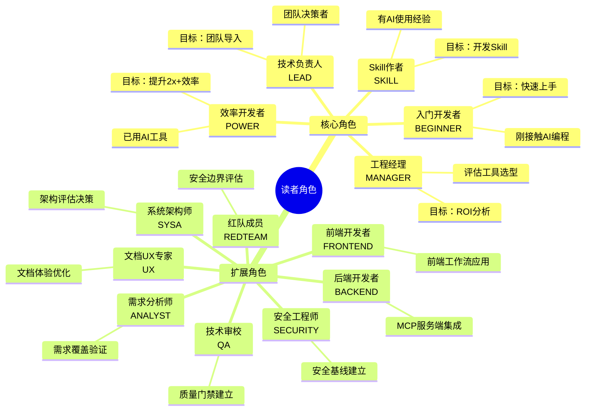
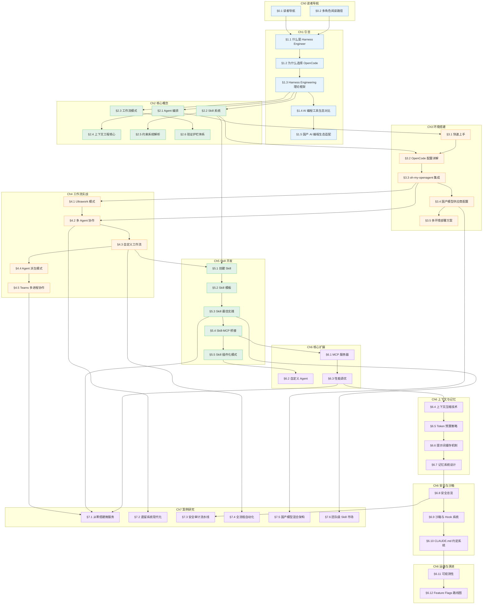

# 多角色阅读路径

> 不同背景的读者，从本书获取价值的路径各不相同。本文帮助你找到属于自己的那条路。

## 文章概述

一本涵盖 8 章 46 篇文章的技术书，从头读到尾并不是最高效的选择。本书设计了 13 种读者角色分类，每种角色对应不同的阅读路径。你可以根据自己的技术背景、职业角色和学习目标，跳过不相关的章节，直达最有价值的内容。

阅读路径不是简单的章节列表。每条路径都标注了预计阅读时间、建议的阅读顺序，以及哪些小节可以跳过。对于团队负责人和评估者，路径中还包含了对 Ch3 环境搭建和 Ch7 案例研究的定向指引。无论你是第一次接触 **Agent（智能体）** 编排的新手，还是已有 OpenCode 使用经验的老手，都能找到适合自己的路线。

---

## 13 种读者角色分类

本书基于 45 个用户故事提炼出 13 种读者角色，分为 **5 个核心角色** 和 **8 个扩展角色**。核心角色覆盖 AI 编程的主流用户画像，扩展角色面向特定技术领域或职能需求。

### 角色分类树状图

### 核心角色定义

| 角色 | 标识 | 背景 | 核心目标 | 关键用户故事 |
|------|------|------|----------|-------------|
| **入门开发者** | BEGINNER | 刚接触 AI 编程，基本编程能力 OK | 快速上手 OpenCode，在日常开发中用起来 | US-BEGINNER-01~05 |
| **效率开发者** | POWER | 已用 AI 工具(Copilot/Cursor)，想升级 | 掌握 Agent 编排，提升 2x+ 效率 | US-POWER-01~05 |
| **技术负责人** | LEAD | 团队技术决策者，关注标准化 | 建立团队级 Harness Engineering 体系 | US-LEAD-01~03 |
| **Skill 作者** | SKILL | 有一定 AI 使用经验，想扩展能力 | 掌握 Skill 开发方法，产出高质量 Skill | US-SKILL-01~04 |
| **工程经理** | MANAGER | 评估团队工具选型 | 判断 OpenCode 的投资回报率 | US-MANAGER-01~02 |

### 扩展角色定义

| 角色 | 标识 | 背景 | 核心目标 | 关键用户故事 |
|------|------|------|----------|-------------|
| **需求分析师/产品经理** | ANALYST | 需求分析、产品规划经验 | 验证需求覆盖完整性、评估内容价值主张 | US-ANALYST-01~03 |
| **系统架构师/技术顾问** | SYSA | 5年以上架构经验，负责技术决策 | 评估 OpenCode 的技术可行性、架构集成与安全合规 | US-SYSA-01~03 |
| **后端开发者/API 工程师** | BACKEND | 熟悉 REST/GraphQL/微服务/数据库 | 将 AI Agent 嵌入后端开发工作流、MCP 服务端集成 | US-BACKEND-01~03 |
| **前端开发者/UI 工程师** | FRONTEND | 熟悉 React/Vue/Angular、组件化开发 | 将 Agent 编排应用到前端场景、类比理解 Skill 系统 | US-FRONTEND-01~03 |
| **文档 UX 专家** | UX | 信息架构/开发者文档经验 | 确保文档可读性、Mermaid 规范、移动端/无障碍体验 | US-UX-01~03 |
| **技术审校/QA 编辑** | QA | 测试或技术写作背景 | 建立质量门禁、验证代码示例可运行性、术语一致性 | US-QA-01~03 |
| **安全工程师/架构师** | SECURITY | 安全工程/合规/威胁建模 | 建立 OpenCode 安全基线、评估企业级合规 | US-SECURITY-01~03 |
| **安全研究人员/红队成员** | REDTEAM | 渗透测试/安全研究 | 评估 AI Agent 攻击面、利用 Agent 自动化安全测试 | US-REDTEAM-01~03 |

---

## 全局架构依赖图

在深入各角色阅读路径之前，理解 46 篇文章之间的概念依赖关系至关重要。下图展示了全书文章的依赖网络，帮助你规划个性化的阅读路线。

### 依赖关系总图

### 文章优先级标注

| 优先级 | 定义 | 文章列表 |
|--------|------|----------|
| **P0（必备）** | 核心概念、必读章节 | §1.1, §1.2, §1.3, §2.1, §2.2, §2.3, §3.1, §3.2, §4.1, §4.2, §5.1, §5.2, §6.8, §7.1 |
| **P1（重要）** | 进阶内容、推荐阅读 | §1.4, §2.4, §2.5, §2.6, §3.3, §3.4, §4.3, §4.4, §5.3, §5.4, §6.1, §6.3, §6.4, §6.5, §6.9, §6.11, §7.2, §7.3, §7.4, §7.5, §7.6 |
| **P2（锦上添花）** | 高级话题、按需阅读 | §1.5, §3.5, §4.5, §5.5, §6.2, §6.6, §6.7, §6.10, §6.12 |

---

## 各角色的完整阅读路径

### 路径 1：入门开发者 (BEGINNER)

**目标**：快速上手 OpenCode，建立 Harness Engineering 的基本认知框架。

**预计阅读时间**：4-5 小时

**阅读模式**：精读核心章节，浏览案例

| 顺序 | 章节/文章 | 阅读模式 | 预计用时 | 用户故事映射 |
|------|----------|----------|----------|-------------|
| 1 | §1.1 什么是 Harness Engineer | 精读 | 20min | US-BEGINNER-05 |
| 2 | §1.2 为什么选择 OpenCode | 精读 | 15min | US-BEGINNER-01 |
| 3 | §1.4 AI 编程工具生态对比 | 浏览 | 15min | US-BEGINNER-01 |
| 4 | §2.1 Agent 编排 | 精读 | 30min | US-BEGINNER-04 |
| 5 | §2.2 Skill 系统 | 精读 | 25min | US-BEGINNER-04 |
| 6 | §2.3 工作流模式 | 精读 | 25min | US-BEGINNER-04 |
| 7 | §3.1 快速上手 | 精读 | 30min | US-BEGINNER-02, US-BEGINNER-03 |
| 8 | §3.2 OpenCode 配置详解 | 精读 | 30min | US-BEGINNER-02 |
| 9 | §4.1 Ultrawork 模式 | 精读 | 30min | - |
| 10 | §7.1 从零搭建微服务 | 浏览 | 20min | - |

**跳过建议**：
- §1.5 国产 AI 编程生态适配（如无国产模型需求）
- §3.4 国产模型供应商配置（如无国产模型需求）
- §4.4 Agent 派生模式、§4.5 Teams 多进程协作（高级话题，初期可跳过）
- Ch6 高级话题全部（初期可跳过，待基础稳固后再回溯）

**路径特点**：
- 从认知到实践的渐进式路径
- 强调"第一个成功的尝试"（US-BEGINNER-03）
- 建立概念框架后再动手实践

---

### 路径 2：效率开发者 (POWER)

**目标**：掌握 Agent 编排和工作流模式，提升日常开发效率 2x+。

**预计阅读时间**：5-6 小时

**阅读模式**：精读核心章节，深入实践章节

| 顺序 | 章节/文章 | 阅读模式 | 预计用时 | 用户故事映射 |
|------|----------|----------|----------|-------------|
| 1 | §1.3 Harness Engineering 理论框架 | 精读 | 25min | US-POWER-01 |
| 2 | §2.1 Agent 编排 | 精读 | 35min | US-POWER-02 |
| 3 | §2.3 工作流模式 | 精读 | 30min | US-POWER-01 |
| 4 | §2.4 上下文工程核心 | 精读 | 30min | - |
| 5 | §2.5 约束系统解析 | 精读 | 25min | US-POWER-03 |
| 6 | §3.3 oh-my-openagent 集成 | 精读 | 30min | US-POWER-02 |
| 7 | §4.1 Ultrawork 模式 | 精读 | 35min | US-POWER-01 |
| 8 | §4.2 多 Agent 协作 | 精读 | 40min | US-POWER-02 |
| 9 | §4.3 自定义工作流 | 精读 | 35min | US-POWER-04 |
| 10 | §6.3 性能调优 | 精读 | 25min | US-POWER-05 |
| 11 | §6.5 Token 预算策略 | 精读 | 20min | US-POWER-05 |
| 12 | §7.1 从零搭建微服务 | 精读 | 30min | - |

**跳过建议**：
- §1.1, §1.2（已有 AI 工具使用经验，可快速浏览）
- §3.1 快速上手（已有 OpenCode 基础，可跳过）
- §1.5, §3.4（如无国产模型需求）
- §6.2 自定义 Agent（初期可跳过）
- §6.6 提示词缓存机制、§6.7 记忆系统设计（高级优化，按需阅读）

**路径特点**：
- 跳过入门章节，直接深入核心概念
- 强调工作流模式和 Agent 编排技巧
- 包含成本优化相关章节

---

### 路径 3：技术负责人 (LEAD)

**目标**：评估和导入 OpenCode，建立团队级 Harness Engineering 体系。

**预计阅读时间**：6-7 小时

**阅读模式**：精读评估章节，浏览实战细节

| 顺序 | 章节/文章 | 阅读模式 | 预计用时 | 用户故事映射 |
|------|----------|----------|----------|-------------|
| 1 | §1.1 什么是 Harness Engineer | 精读 | 20min | US-LEAD-01 |
| 2 | §1.2 为什么选择 OpenCode | 精读 | 20min | US-LEAD-01 |
| 3 | §1.3 Harness Engineering 理论框架 | 精读 | 30min | US-LEAD-01 |
| 4 | §1.4 AI 编程工具生态对比 | 精读 | 25min | US-LEAD-01 |
| 5 | §2.1 Agent 编排 | 精读 | 30min | US-LEAD-01 |
| 6 | §2.2 Skill 系统 | 精读 | 25min | US-LEAD-01 |
| 7 | §2.3 工作流模式 | 精读 | 25min | US-LEAD-01 |
| 8 | §3.2 OpenCode 配置详解 | 精读 | 35min | US-LEAD-01 |
| 9 | §3.5 多环境部署方案 | 精读 | 30min | US-LEAD-01 |
| 10 | §4.2 多 Agent 协作 | 精读 | 35min | US-LEAD-01 |
| 11 | §4.5 Teams 多进程协作 | 精读 | 30min | US-LEAD-01 |
| 12 | §6.8 安全总览 | 精读 | 35min | US-LEAD-02 |
| 13 | §6.9 沙箱与 Hook 系统 | 精读 | 30min | US-LEAD-02 |
| 14 | §7.1 从零搭建微服务 | 浏览 | 20min | US-LEAD-01 |
| 15 | §7.6 团队级 Skill 市场 | 精读 | 30min | US-LEAD-01 |

**跳过建议**：
- §3.1 快速上手（评估阶段可跳过）
- §3.3 oh-my-openagent 集成（可交给团队成员实施）
- §4.1 Ultrawork 模式（了解即可，无需深入细节）
- §5.1-5.5 Skill 开发章节（可交给 Skill 作者）
- §6.4-6.7 上下文与记忆优化（技术细节，可跳过）

**路径特点**：
- 聚焦评估和决策所需信息
- 强调安全合规和团队部署
- 包含多环境部署和团队协作章节

---

### 路径 4：Skill 作者 (SKILL)

**目标**：掌握 Skill 开发方法，产出高质量、可维护的 Skill。

**预计阅读时间**：5-6 小时

**阅读模式**：精读 Skill 相关章节，深入实践

| 顺序 | 章节/文章 | 阅读模式 | 预计用时 | 用户故事映射 |
|------|----------|----------|----------|-------------|
| 1 | §1.3 Harness Engineering 理论框架 | 浏览 | 15min | - |
| 2 | §2.2 Skill 系统 | 精读 | 40min | US-SKILL-01, US-SKILL-03 |
| 3 | §2.5 约束系统解析 | 精读 | 30min | US-SKILL-03 |
| 4 | §3.2 OpenCode 配置详解 | 精读 | 30min | US-SKILL-01 |
| 5 | §5.1 创建 Skill | 精读 | 45min | US-SKILL-01 |
| 6 | §5.2 Skill 模板 | 精读 | 40min | US-SKILL-02 |
| 7 | §5.3 Skill 最佳实践 | 精读 | 40min | US-SKILL-04 |
| 8 | §5.4 Skill-MCP 桥接 | 精读 | 35min | US-SKILL-01 |
| 9 | §5.5 Skill 插件化模式 | 精读 | 30min | US-SKILL-03 |
| 10 | §6.1 MCP 服务器 | 精读 | 35min | US-SKILL-01 |
| 11 | §7.6 团队级 Skill 市场 | 精读 | 30min | US-SKILL-01 |

**跳过建议**：
- §1.1, §1.2, §1.4（入门章节，可快速浏览）
- §2.1 Agent 编排（了解即可，无需深入）
- §3.1 快速上手（已有 OpenCode 使用经验）
- §4.1-4.5 工作流实战（了解即可，重点在 Skill 开发）
- §6.2 自定义 Agent（与 Skill 开发关联度较低）
- §6.4-6.7 上下文与记忆优化（高级优化，按需阅读）

**路径特点**：
- 以 Skill 开发为核心，深入实践
- 强调 Skill 设计原则和最佳实践
- 包含 MCP 桥接和插件化模式

---

### 路径 5：工程经理 (MANAGER)

**目标**：评估 OpenCode 的投资回报率，做出工具选型决策。

**预计阅读时间**：3-4 小时

**阅读模式**：浏览核心章节，精读案例研究

| 顺序 | 章节/文章 | 阅读模式 | 预计用时 | 用户故事映射 |
|------|----------|----------|----------|-------------|
| 1 | §1.1 什么是 Harness Engineer | 浏览 | 15min | US-MANAGER-02 |
| 2 | §1.2 为什么选择 OpenCode | 精读 | 20min | US-MANAGER-02 |
| 3 | §1.4 AI 编程工具生态对比 | 精读 | 30min | US-MANAGER-02 |
| 4 | §1.3 Harness Engineering 理论框架 | 浏览 | 20min | US-MANAGER-01 |
| 5 | §2.1 Agent 编排 | 浏览 | 15min | - |
| 6 | §2.2 Skill 系统 | 浏览 | 15min | - |
| 7 | §2.3 工作流模式 | 浏览 | 15min | - |
| 8 | §6.3 性能调优 | 浏览 | 15min | US-MANAGER-01 |
| 9 | §6.5 Token 预算策略 | 浏览 | 15min | US-MANAGER-01 |
| 10 | §7.1 从零搭建微服务 | 精读 | 30min | US-MANAGER-01 |
| 11 | §7.2 遗留系统现代化 | 精读 | 30min | US-MANAGER-01 |
| 12 | §7.4 全流程自动化 | 精读 | 25min | US-MANAGER-01 |

**跳过建议**：
- §3.1-3.5 环境搭建章节（技术实施细节，可交给团队）
- §4.1-4.5 工作流实战（技术实施细节，可交给团队）
- §5.1-5.5 Skill 开发（技术实施细节，可交给团队）
- §6.1, §6.2, §6.4, §6.6-6.12 高级话题（技术细节，可跳过）

**路径特点**：
- 聚焦工具对比和 ROI 分析
- 强调案例研究的实际效果
- 跳过技术实施细节

---

### 路径 6：需求分析师/产品经理 (ANALYST)

**目标**：验证需求覆盖完整性，评估内容价值主张。

**预计阅读时间**：4-5 小时

**阅读模式**：浏览全局，精读价值声明

| 顺序 | 章节/文章 | 阅读模式 | 预计用时 | 用户故事映射 |
|------|----------|----------|----------|-------------|
| 1 | §0.1 读者导航 | 精读 | 15min | US-ANALYST-01 |
| 2 | §0.2 多角色阅读路径 | 精读 | 25min | US-ANALYST-01, US-ANALYST-03 |
| 3 | §1.1 什么是 Harness Engineer | 精读 | 20min | US-ANALYST-02 |
| 4 | §1.2 为什么选择 OpenCode | 精读 | 15min | US-ANALYST-02 |
| 5 | §1.3 Harness Engineering 理论框架 | 精读 | 25min | US-ANALYST-02, US-ANALYST-03 |
| 6 | §1.4 AI 编程工具生态对比 | 浏览 | 15min | US-ANALYST-02 |
| 7 | §2.1-2.6 核心概念（全部） | 浏览 | 60min | US-ANALYST-01 |
| 8 | §7.1-7.6 案例研究（全部） | 浏览 | 60min | US-ANALYST-01 |

**跳过建议**：
- §3.1-3.5 环境搭建（技术实施细节）
- §4.1-4.5 工作流实战（技术实施细节）
- §5.1-5.5 Skill 开发（技术实施细节）
- §6.1-6.12 高级话题（技术细节）

**路径特点**：
- 全局视角，验证需求覆盖
- 强调价值声明和读者旅程
- 跳过技术实施细节

---

### 路径 7：系统架构师/技术顾问 (SYSA)

**目标**：评估 OpenCode 的技术可行性、架构集成与安全合规。

**预计阅读时间**：7-8 小时

**阅读模式**：精读架构相关章节，深入安全分析

| 顺序 | 章节/文章 | 阅读模式 | 预计用时 | 用户故事映射 |
|------|----------|----------|----------|-------------|
| 1 | §1.2 为什么选择 OpenCode | 精读 | 20min | US-SYSA-01 |
| 2 | §1.3 Harness Engineering 理论框架 | 精读 | 30min | US-SYSA-01 |
| 3 | §1.4 AI 编程工具生态对比 | 精读 | 30min | US-SYSA-01 |
| 4 | §2.1 Agent 编排 | 精读 | 35min | US-SYSA-01 |
| 5 | §2.2 Skill 系统 | 精读 | 30min | US-SYSA-01 |
| 6 | §2.5 约束系统解析 | 精读 | 30min | US-SYSA-02 |
| 7 | §3.2 OpenCode 配置详解 | 精读 | 40min | US-SYSA-01 |
| 8 | §3.5 多环境部署方案 | 精读 | 35min | US-SYSA-01 |
| 9 | §4.2 多 Agent 协作 | 精读 | 35min | US-SYSA-02 |
| 10 | §4.5 Teams 多进程协作 | 精读 | 30min | US-SYSA-02 |
| 11 | §5.3 Skill 最佳实践 | 精读 | 30min | US-SYSA-03 |
| 12 | §6.1 MCP 服务器 | 精读 | 40min | US-SYSA-02 |
| 13 | §6.8 安全总览 | 精读 | 45min | US-SYSA-02 |
| 14 | §6.9 沙箱与 Hook 系统 | 精读 | 40min | US-SYSA-02 |
| 15 | §7.3 安全审计流水线 | 精读 | 35min | US-SYSA-02 |

**跳过建议**：
- §1.1, §1.5（入门和国产模型章节，按需阅读）
- §3.1, §3.3, §3.4（环境搭建细节，可快速浏览）
- §4.1, §4.3, §4.4（工作流细节，了解即可）
- §5.1, §5.2, §5.4, §5.5（Skill 开发细节，了解即可）
- §6.2, §6.4-6.7, §6.10-6.12（高级话题，按需阅读）

**路径特点**：
- 深入架构和安全分析
- 强调威胁建模和合规评估
- 包含多团队架构治理

---

### 路径 8：后端开发者/API 工程师 (BACKEND)

**目标**：将 AI Agent 嵌入后端开发工作流，掌握 MCP 服务端集成。

**预计阅读时间**：5-6 小时

**阅读模式**：精读 MCP 和后端相关章节

| 顺序 | 章节/文章 | 阅读模式 | 预计用时 | 用户故事映射 |
|------|----------|----------|----------|-------------|
| 1 | §1.3 Harness Engineering 理论框架 | 浏览 | 15min | - |
| 2 | §2.1 Agent 编排 | 精读 | 30min | US-BACKEND-03 |
| 3 | §2.2 Skill 系统 | 精读 | 25min | - |
| 4 | §3.2 OpenCode 配置详解 | 精读 | 30min | US-BACKEND-01 |
| 5 | §4.2 多 Agent 协作 | 精读 | 35min | US-BACKEND-03 |
| 6 | §5.4 Skill-MCP 桥接 | 精读 | 35min | US-BACKEND-01 |
| 7 | §6.1 MCP 服务器 | 精读 | 50min | US-BACKEND-01 |
| 8 | §6.8 安全总览 | 精读 | 30min | US-BACKEND-01 |
| 9 | §7.1 从零搭建微服务 | 精读 | 40min | US-BACKEND-02 |
| 10 | §7.5 国产模型混合架构 | 精读 | 30min | US-BACKEND-03 |

**跳过建议**：
- §1.1, §1.2, §1.4, §1.5（入门章节，可快速浏览）
- §2.3, §2.4, §2.5, §2.6（核心概念细节，了解即可）
- §3.1, §3.3, §3.4, §3.5（环境搭建细节，按需阅读）
- §4.1, §4.3, §4.4, §4.5（工作流细节，了解即可）
- §5.1, §5.2, §5.3, §5.5（Skill 开发细节，按需阅读）
- §6.2-6.7, §6.9-6.12（高级话题，按需阅读）

**路径特点**：
- 以 MCP 服务端集成为核心
- 强调后端场景的 Agent 协作
- 包含微服务架构案例

---

### 路径 9：前端开发者/UI 工程师 (FRONTEND)

**目标**：将 Agent 编排应用到前端场景，类比理解 Skill 系统。

**预计阅读时间**：4-5 小时

**阅读模式**：精读前端相关章节，类比学习

| 顺序 | 章节/文章 | 阅读模式 | 预计用时 | 用户故事映射 |
|------|----------|----------|----------|-------------|
| 1 | §1.3 Harness Engineering 理论框架 | 浏览 | 15min | - |
| 2 | §2.2 Skill 系统 | 精读 | 40min | US-FRONTEND-02 |
| 3 | §2.3 工作流模式 | 精读 | 30min | US-FRONTEND-01 |
| 4 | §3.2 OpenCode 配置详解 | 精读 | 25min | US-FRONTEND-01 |
| 5 | §4.1 Ultrawork 模式 | 精读 | 30min | US-FRONTEND-01 |
| 6 | §5.1 创建 Skill | 精读 | 35min | US-FRONTEND-02 |
| 7 | §5.2 Skill 模板 | 精读 | 30min | US-FRONTEND-02 |
| 8 | §5.3 Skill 最佳实践 | 精读 | 35min | US-FRONTEND-02 |
| 9 | §7.1 从零搭建微服务 | 浏览 | 20min | US-FRONTEND-01 |
| 10 | §7.4 全流程自动化 | 浏览 | 20min | US-FRONTEND-01 |

**跳过建议**：
- §1.1, §1.2, §1.4, §1.5（入门章节，可快速浏览）
- §2.1, §2.4, §2.5, §2.6（核心概念细节，了解即可）
- §3.1, §3.3, §3.4, §3.5（环境搭建细节，按需阅读）
- §4.2, §4.3, §4.4, §4.5（工作流细节，了解即可）
- §5.4, §5.5（MCP 和插件化，按需阅读）
- §6.1-6.12（高级话题，按需阅读）

**路径特点**：
- 通过组件化类比理解 Skill 系统
- 强调前端场景的工作流应用
- 包含 UI 审查 Skill 模板

---

### 路径 10：文档 UX 专家 (UX)

**目标**：确保文档可读性、Mermaid 规范、移动端/无障碍体验。

**预计阅读时间**：3-4 小时

**阅读模式**：浏览全局，精读规范相关章节

| 顺序 | 章节/文章 | 阅读模式 | 预计用时 | 用户故事映射 |
|------|----------|----------|----------|-------------|
| 1 | §0.1 读者导航 | 精读 | 15min | US-UX-01, US-UX-03 |
| 2 | §0.2 多角色阅读路径 | 精读 | 20min | US-UX-03 |
| 3 | §1.1-1.5 引言（全部） | 浏览 | 40min | US-UX-02 |
| 4 | §2.1-2.6 核心概念（全部） | 浏览 | 50min | US-UX-02 |
| 5 | §7.1-7.6 案例研究（全部） | 浏览 | 50min | US-UX-02 |

**跳过建议**：
- §3.1-3.5 环境搭建（技术实施细节）
- §4.1-4.5 工作流实战（技术实施细节）
- §5.1-5.5 Skill 开发（技术实施细节）
- §6.1-6.12 高级话题（技术细节）

**路径特点**：
- 全局视角，关注文档体验
- 强调 Mermaid 规范和代码块标准
- 跳过技术实施细节

---

### 路径 11：技术审校/QA 编辑 (QA)

**目标**：建立质量门禁、验证代码示例可运行性、术语一致性。

**预计阅读时间**：6-7 小时

**阅读模式**：精读全部章节，验证质量

| 顺序  | 章节/文章                 | 阅读模式 | 预计用时   | 用户故事映射             |
| --- | --------------------- | ---- | ------ | ------------------ |
| 1   | §0.1 读者导航             | 精读   | 15min  | US-QA-03           |
| 2   | §0.2 多角色阅读路径          | 精读   | 20min  | US-QA-03           |
| 3   | §1.1-1.5 引言（全部）       | 精读   | 60min  | US-QA-01, US-QA-02 |
| 4   | §2.1-2.6 核心概念（全部）     | 精读   | 90min  | US-QA-01, US-QA-02 |
| 5   | §3.1-3.5 环境搭建（全部）     | 精读   | 90min  | US-QA-01, US-QA-02 |
| 6   | §4.1-4.5 工作流实战（全部）    | 精读   | 90min  | US-QA-01, US-QA-02 |
| 7   | §5.1-5.5 Skill 开发（全部） | 精读   | 75min  | US-QA-01, US-QA-02 |
| 8   | §6.1-6.12 高级话题（全部）    | 精读   | 120min | US-QA-01, US-QA-02 |
| 9   | §7.1-7.6 案例研究（全部）     | 精读   | 90min  | US-QA-01, US-QA-02 |

**跳过建议**：无（需要全面验证）

**路径特点**：
- 全覆盖路径，验证质量门禁
- 强调代码示例可运行性
- 包含术语一致性检查

---

### 路径 12：安全工程师/架构师 (SECURITY)

**目标**：建立 OpenCode 安全基线，评估企业级合规。

**预计阅读时间**：5-6 小时

**阅读模式**：精读安全相关章节，深入威胁分析

| 顺序 | 章节/文章 | 阅读模式 | 预计用时 | 用户故事映射 |
|------|----------|----------|----------|-------------|
| 1 | §1.3 Harness Engineering 理论框架 | 浏览 | 15min | - |
| 2 | §2.5 约束系统解析 | 精读 | 35min | US-SECURITY-01 |
| 3 | §3.2 OpenCode 配置详解 | 精读 | 35min | US-SECURITY-01 |
| 4 | §4.2 多 Agent 协作 | 精读 | 30min | US-SECURITY-03 |
| 5 | §5.3 Skill 最佳实践 | 精读 | 30min | US-SECURITY-03 |
| 6 | §6.1 MCP 服务器 | 精读 | 40min | US-SECURITY-02 |
| 7 | §6.8 安全总览 | 精读 | 50min | US-SECURITY-01 |
| 8 | §6.9 沙箱与 Hook 系统 | 精读 | 45min | US-SECURITY-01 |
| 9 | §6.10 CLAUDE.md 约定系统 | 精读 | 30min | US-SECURITY-01 |
| 10 | §6.11 可观测性 | 精读 | 30min | US-SECURITY-03 |
| 11 | §7.3 安全审计流水线 | 精读 | 40min | US-SECURITY-03 |

**跳过建议**：
- §1.1, §1.2, §1.4, §1.5（入门章节，可快速浏览）
- §2.1, §2.2, §2.3, §2.4, §2.6（核心概念细节，了解即可）
- §3.1, §3.3, §3.4, §3.5（环境搭建细节，按需阅读）
- §4.1, §4.3, §4.4, §4.5（工作流细节，了解即可）
- §5.1, §5.2, §5.4, §5.5（Skill 开发细节，按需阅读）
- §6.2-6.7, §6.12（高级话题，按需阅读）

**路径特点**：
- 以安全为核心，深入威胁分析
- 强调权限分层和沙箱隔离
- 包含安全审计流水线案例

---

### 路径 13：安全研究人员/红队成员 (REDTEAM)

**目标**：评估 AI Agent 攻击面，利用 Agent 自动化安全测试。

**预计阅读时间**：5-6 小时

**阅读模式**：精读安全边界章节，深入攻击面分析

| 顺序 | 章节/文章 | 阅读模式 | 预计用时 | 用户故事映射 |
|------|----------|----------|----------|-------------|
| 1 | §1.3 Harness Engineering 理论框架 | 浏览 | 15min | - |
| 2 | §2.1 Agent 编排 | 精读 | 30min | US-REDTEAM-02 |
| 3 | §2.5 约束系统解析 | 精读 | 35min | US-REDTEAM-01 |
| 4 | §4.2 多 Agent 协作 | 精读 | 35min | US-REDTEAM-02 |
| 5 | §5.1 创建 Skill | 精读 | 30min | US-REDTEAM-02 |
| 6 | §5.3 Skill 最佳实践 | 精读 | 30min | US-REDTEAM-02 |
| 7 | §6.1 MCP 服务器 | 精读 | 35min | US-REDTEAM-01 |
| 8 | §6.8 安全总览 | 精读 | 45min | US-REDTEAM-01, US-REDTEAM-03 |
| 9 | §6.9 沙箱与 Hook 系统 | 精读 | 40min | US-REDTEAM-01 |
| 10 | §7.3 安全审计流水线 | 精读 | 40min | US-REDTEAM-02 |

**跳过建议**：
- §1.1, §1.2, §1.4, §1.5（入门章节，可快速浏览）
- §2.2, §2.3, §2.4, §2.6（核心概念细节，了解即可）
- §3.1-3.5（环境搭建细节，按需阅读）
- §4.1, §4.3, §4.4, §4.5（工作流细节，了解即可）
- §5.2, §5.4, §5.5（Skill 开发细节，按需阅读）
- §6.2-6.7, §6.10-6.12（高级话题，按需阅读）

**路径特点**：
- 以攻击面评估为核心
- 强调安全边界和权限控制
- 包含安全测试 Skill 开发

---

## 跨路径对比与路径切换指南

### 路径交叉热度图

下图展示了 13 条阅读路径在 46 篇文章上的覆盖热度，帮助你理解不同路径的重叠区域。

### 路径重叠区域分析

| 重叠区域 | 涉及路径 | 共同关注点 | 切换建议 |
|----------|----------|------------|----------|
| **Ch1 引言** | BEGINNER, LEAD, MANAGER, ANALYST | 价值主张、工具对比 | MANAGER 可快速浏览，LEAD 需精读 |
| **Ch2 核心概念** | 全部路径 | Agent/Skill/Workflow 抽象 | 所有路径必读，是后续章节基础 |
| **Ch3 环境搭建** | BEGINNER, POWER, SKILL, BACKEND | 配置详解、集成方案 | POWER/SKILL 可跳过快速上手 |
| **Ch4 工作流实战** | POWER, LEAD, SYSA, BACKEND, FRONTEND, SECURITY, REDTEAM | Agent 协作、工作流模式 | 不同角色关注不同工作流模式 |
| **Ch5 Skill 开发** | SKILL, FRONTEND, SECURITY, REDTEAM | Skill 创建、最佳实践 | SECURITY/REDTEAM 关注安全 Skill |
| **Ch6.1 MCP 服务器** | SKILL, BACKEND, SYSA, SECURITY, REDTEAM | MCP 集成、安全边界 | BACKEND 关注服务端，SECURITY 关注安全 |
| **Ch6.8-6.9 安全章节** | LEAD, SYSA, SECURITY, REDTEAM | 安全模型、沙箱隔离 | LEAD 关注合规，REDTEAM 关注攻击面 |
| **Ch7 案例研究** | 全部路径 | 真实项目验证 | 不同角色关注不同案例 |

### 路径切换指南

#### 从 BEGINNER 切换到 POWER

**触发条件**：完成 §3.2 OpenCode 配置详解，理解基本概念后。

**切换步骤**：
1. 跳过 §3.1 快速上手
2. 深入 §2.4 上下文工程核心、§2.5 约束系统解析
3. 精读 §4.2 多 Agent 协作、§4.3 自定义工作流
4. 阅读 §6.3 性能调优、§6.5 Token 预算策略

**新增阅读时间**：约 3 小时

---

#### 从 POWER 切换到 SKILL

**触发条件**：掌握工作流模式后，希望创建自定义 Skill。

**切换步骤**：
1. 深入 §2.2 Skill 系统
2. 精读 Ch5 Skill 开发全部章节
3. 阅读 §6.1 MCP 服务器（如需外部工具集成）
4. 参考 §7.6 团队级 Skill 市场

**新增阅读时间**：约 3 小时

---

#### 从 LEAD 切换到 SYSA

**触发条件**：需要深入评估架构集成和安全合规。

**切换步骤**：
1. 精读 §2.5 约束系统解析
2. 深入 §6.1 MCP 服务器
3. 精读 §6.8 安全总览、§6.9 沙箱与 Hook 系统
4. 阅读 §7.3 安全审计流水线

**新增阅读时间**：约 3 小时

---

#### 从 BACKEND 切换到 SECURITY

**触发条件**：关注 MCP 服务端安全，需要评估企业级合规。

**切换步骤**：
1. 精读 §2.5 约束系统解析
2. 深入 §6.8 安全总览、§6.9 沙箱与 Hook 系统
3. 阅读 §7.3 安全审计流水线

**新增阅读时间**：约 2.5 小时

---

#### 从 SECURITY 切换到 REDTEAM

**触发条件**：需要评估攻击面，利用 Agent 进行安全测试。

**切换步骤**：
1. 精读 §2.1 Agent 编排（关注攻击链）
2. 深入 §4.2 多 Agent 协作（关注并行攻击）
3. 精读 §5.1 创建 Skill、§5.3 Skill 最佳实践（关注安全测试 Skill）
4. 参考 §7.3 安全审计流水线

**新增阅读时间**：约 2.5 小时

---

## 用户故事追溯矩阵

下表展示了各角色阅读路径与用户故事的映射关系，确保每条路径都能满足对应的用户需求。

| 角色 | 核心用户故事 | 覆盖章节 | 覆盖程度 |
|------|-------------|----------|----------|
| **BEGINNER** | US-BEGINNER-01~05 | §1.1-1.4, §2.1-2.3, §3.1-3.2, §4.1, §7.1 | 完整 |
| **POWER** | US-POWER-01~05 | §1.3, §2.1-2.5, §3.3, §4.1-4.3, §6.3, §6.5, §7.1 | 完整 |
| **LEAD** | US-LEAD-01~03 | §1.1-1.4, §2.1-2.3, §3.2, §3.5, §4.2, §4.5, §6.8-6.9, §7.1, §7.6 | 完整 |
| **SKILL** | US-SKILL-01~04 | §2.2, §2.5, §3.2, §5.1-5.5, §6.1, §7.6 | 完整 |
| **MANAGER** | US-MANAGER-01~02 | §1.2-1.4, §2.1-2.3, §6.3, §6.5, §7.1-7.2, §7.4 | 完整 |
| **ANALYST** | US-ANALYST-01~03 | §0.1-0.2, §1.1-1.4, §2.1-2.6, §7.1-7.6 | 完整 |
| **SYSA** | US-SYSA-01~03 | §1.2-1.4, §2.1-2.2, §2.5, §3.2, §3.5, §4.2, §4.5, §5.3, §6.1, §6.8-6.9, §7.3 | 完整 |
| **BACKEND** | US-BACKEND-01~03 | §2.1, §2.2, §3.2, §4.2, §5.4, §6.1, §6.8, §7.1, §7.5 | 完整 |
| **FRONTEND** | US-FRONTEND-01~03 | §2.2-2.3, §3.2, §4.1, §5.1-5.3, §7.1, §7.4 | 完整 |
| **UX** | US-UX-01~03 | §0.1-0.2, §1.1-1.5, §2.1-2.6, §7.1-7.6 | 完整 |
| **QA** | US-QA-01~03 | 全部章节 | 完整 |
| **SECURITY** | US-SECURITY-01~03 | §2.5, §3.2, §4.2, §5.3, §6.1, §6.8-6.11, §7.3 | 完整 |
| **REDTEAM** | US-REDTEAM-01~03 | §2.1, §2.5, §4.2, §5.1, §5.3, §6.1, §6.8-6.9, §7.3 | 完整 |

---

## 阅读节奏建议

### 时间分配原则

1. **精读章节**：每篇 30-45 分钟，包含代码示例实践
2. **浏览章节**：每篇 15-20 分钟，抓住核心概念
3. **跳过章节**：标记为"按需阅读"，后续回溯

### 推荐阅读节奏

| 节奏模式 | 适用角色 | 每日阅读量 | 完成周期 |
|----------|----------|------------|----------|
| **集中突破** | BEGINNER, POWER, SKILL | 2-3 小时/天 | 2-3 天 |
| **渐进式** | LEAD, SYSA, SECURITY | 1-2 小时/天 | 4-5 天 |
| **评估式** | MANAGER, ANALYST, UX | 1 小时/天 | 3-4 天 |
| **全覆盖** | QA | 2 小时/天 | 5-6 天 |

### 混合阅读建议

对于跨角色需求的读者（如技术负责人同时关注安全），建议：
1. 先完成主角色路径
2. 标记交叉章节为"已读"
3. 补充副角色路径的特有章节

---

## 总结

本书设计了 13 种读者角色和对应的阅读路径，确保每位读者都能高效获取所需知识。通过全局架构依赖图，你可以理解 46 篇文章之间的概念关系；通过路径交叉热度图，你可以发现不同角色之间的共同关注点；通过路径切换指南，你可以在角色需求变化时平滑过渡。

无论你是刚接触 AI 编程的新手，还是评估企业级部署的架构师，都能在这里找到属于自己的路线。开始你的 Harness Engineering 之旅吧！

---

## 关联章节

- → [Ch0 读者导航](README.md)
- → [Ch1 引言](../01-introduction/README.md)
- → [Ch2 核心概念](../02-core-concepts/README.md)
- → [Ch7 案例研究](../07-case-studies/README.md)
