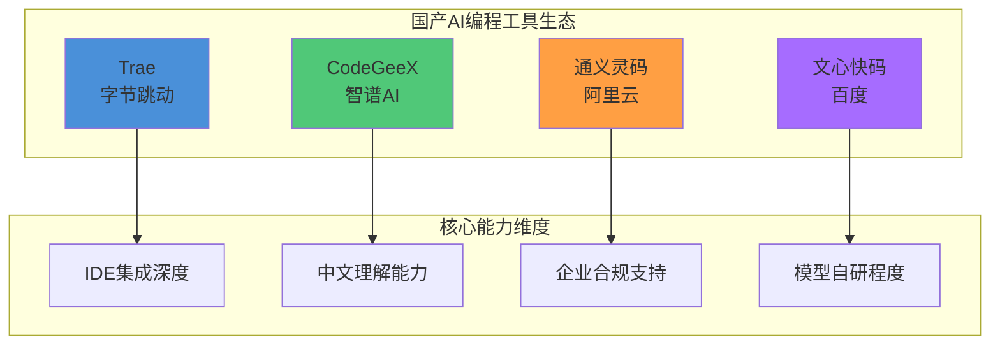
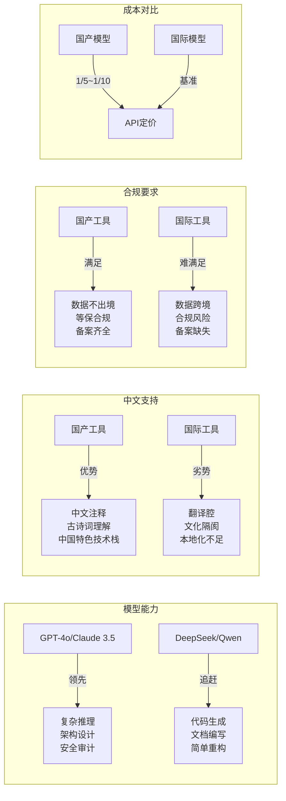
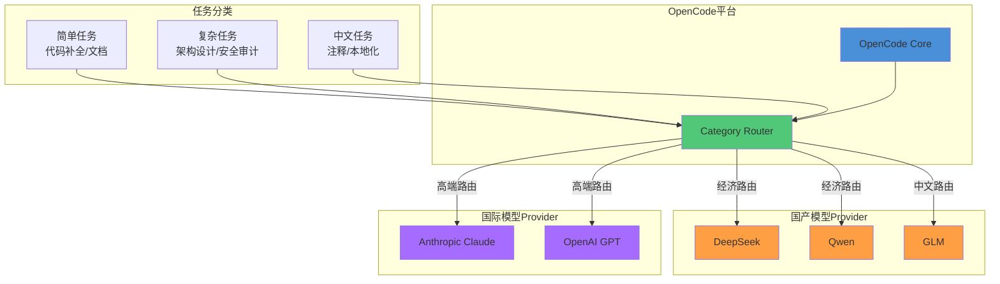
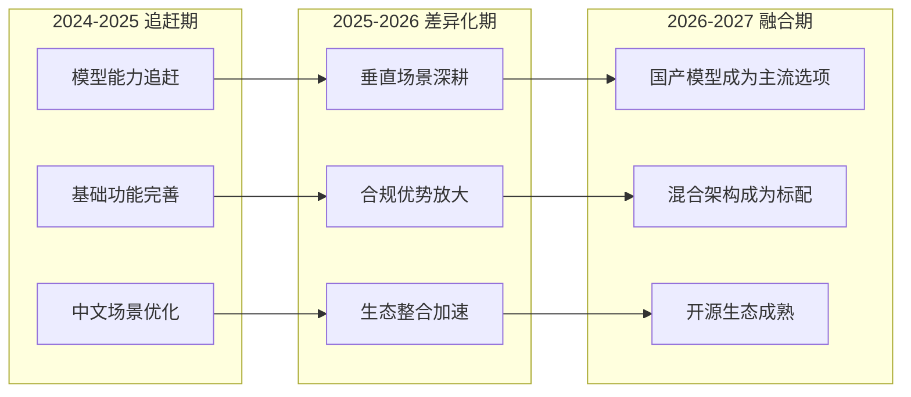

# 国产 AI 编程生态适配

> 国产大模型正在快速追赶——DeepSeek、Qwen、GLM 与 OpenCode 的组合，能否成为性价比之选？

## 文章概述

中国 AI 编程生态在过去两年中经历了从"追赶者"到"差异化竞争者"的转变。字节跳动的 Trae、智谱的 CodeGeeX、阿里的通义灵码、百度的文心快码——四款国产工具各有侧重，但都在解决一个共同问题：中文开发者的真实需求。与此同时，以 DeepSeek、Qwen、GLM 为代表的国产大模型在推理能力和性价比上不断突破，为 OpenCode 提供了新的 Provider 选择。

本文首先梳理国产 AI 编程工具的现状：Trae 以 IDE 原生体验主打"零配置"开箱即用，CodeGeeX 借力智谱大模型在 VS Code 插件市场站稳脚跟，通义灵码在电商场景优化上积累了独特优势，文心快码则在中文理解和合规部署上投入更多。这些工具与 OpenCode 并非零和竞争关系，而是互补——它们提供了更符合国内开发者使用习惯和合规要求的备选方案。

核心话题是 **OpenCode 与国产模型的结合**。通过配置 DeepSeek、Qwen 等国产 Provider，开发者可以在 OpenCode 生态中享受更低成本的推理服务，同时保持开源工具链的灵活性和可控性。本文提供具体的 Provider 配置示例（包括 API 端点、模型名称、认证方式），并讨论网络代理、数据合规等实际部署中的注意事项。

## 一、国产 AI 编程工具全景

### 1.1 工具矩阵概览



### 1.2 Trae（字节跳动）

**定位**：IDE 原生体验，零配置开箱即用

Trae 是字节跳动于 2025 年推出的 AI 编程 IDE，基于 VS Code 深度定制，核心特点是"开箱即用"——无需配置 API Key、无需选择模型，安装即可使用。这一设计哲学降低了 AI 编程工具的使用门槛，特别适合新手开发者快速上手。

**核心特性**：

| 特性 | 说明 |
|------|------|
| IDE 形态 | 独立 IDE（VS Code Fork），非插件形态 |
| 模型来源 | 字节自研模型 + 第三方模型混合 |
| 中文支持 | 原生中文界面，中文注释生成优化 |
| 定价模式 | 基础功能免费，高级功能订阅制 |
| 企业版 | 支持私有化部署，符合等保要求 |

**适用场景**：
- 新手开发者：零配置上手，降低学习曲线
- 快速原型开发：IDE 内置 AI 能力，无需切换工具
- 国内中小企业：合规部署 + 低成本入门

**局限性**：
- 闭源产品，无法审计代码逻辑
- 模型选择受限，无法自由切换 Provider
- 与现有 VS Code 插件生态存在兼容性问题

### 1.3 CodeGeeX（智谱 AI）

**定位**：VS Code 插件形态，依托智谱 GLM 大模型

CodeGeeX 是智谱 AI 推出的 AI 编程助手，以 VS Code 插件形态提供服务。其核心优势在于背靠智谱自研的 GLM 系列大模型，在代码生成、代码翻译、代码解释等任务上表现出色。CodeGeeX 支持多种编程语言，在中文代码注释生成和中文技术文档编写方面有独特优势。

**核心特性**：

| 特性 | 说明 |
|------|------|
| IDE 形态 | VS Code / JetBrains 插件 |
| 模型来源 | 智谱 GLM-4 系列 |
| 特色功能 | 代码翻译（多语言互转）、代码解释 |
| 中文支持 | 中文注释生成、中文技术问答 |
| 开源程度 | 模型权重开源，插件闭源 |

**适用场景**：
- VS Code 用户：无需更换 IDE，插件即装即用
- 多语言项目：代码翻译功能支持 20+ 编程语言互转
- 中文文档编写：生成中文注释和技术文档

**局限性**：
- 插件形态限制了 Agent 能力的深度集成
- 复杂任务的自主执行能力有限
- 与企业 DevOps 流程的集成需要额外开发

### 1.4 通义灵码（阿里云）

**定位**：电商场景深度优化，与阿里云 DevOps 生态集成

通义灵码是阿里云推出的 AI 编程助手，基于通义千问（Qwen）大模型。其核心差异化优势在于对电商场景的深度优化——在商品管理、订单处理、支付对接等电商核心业务代码生成上表现突出。同时，通义灵码与阿里云 DevOps 生态（云效、ARMS、SAE 等）深度集成，适合阿里云用户。

**核心特性**：

| 特性 | 说明 |
|------|------|
| IDE 形态 | VS Code / JetBrains 插件 + Web IDE |
| 模型来源 | 阿里通义千问（Qwen）系列 |
| 场景优化 | 电商业务代码、阿里云 SDK 调用 |
| 生态集成 | 云效、ARMS、SAE、函数计算 |
| 企业版 | 阿里云企业账号统一管理 |

**适用场景**：
- 电商业务开发：商品、订单、支付等核心模块代码生成
- 阿里云用户：与云上 DevOps 工具链无缝集成
- 企业级部署：阿里云企业账号体系支持

**局限性**：
- 非阿里云用户难以发挥生态集成优势
- 电商场景外的通用编程能力与其他工具持平
- 闭源产品，定制化能力有限

### 1.5 文心快码（百度）

**定位**：中文理解优化，合规部署优势

文心快码是百度推出的 AI 编程助手，基于文心大模型。其核心优势在于中文理解能力和合规部署支持——在政府、国企、金融等对数据合规要求严格的场景中，文心快码提供了本地化部署方案，确保代码数据不出境。

**核心特性**：

| 特性 | 说明 |
|------|------|
| IDE 形态 | VS Code 插件 + Web IDE |
| 模型来源 | 百度文心（ERNIE）系列 |
| 中文能力 | 中文需求理解、中文文档生成 |
| 合规部署 | 本地化部署、等保合规 |
| 行业方案 | 金融、政务、能源行业定制版 |

**适用场景**：
- 政府/国企/金融：数据合规要求严格的场景
- 中文需求文档：从中文需求直接生成代码
- 本地化部署：代码数据不出境

**局限性**：
- 代码生成能力与国际一线模型存在差距
- 开发者生态相对薄弱
- 非合规场景的性价比不如其他国产方案

## 二、国产 vs 国际工具差异分析

### 2.1 多维度对比矩阵



### 2.2 模型能力差距

国产大模型在代码生成领域与国际一线模型（GPT-4o、Claude 3.5 Sonnet）的差距正在缩小，但在以下场景仍存在明显差距：

| 场景 | 国际模型表现 | 国产模型表现 | 差距分析 |
|------|-------------|-------------|----------|
| 复杂架构设计 | 优秀 | 良好 | 跨模块推理能力不足 |
| 安全漏洞检测 | 优秀 | 中等 | 安全知识库覆盖不全 |
| 跨文件重构 | 优秀 | 良好 | 长上下文理解有差距 |
| 代码补全 | 优秀 | 优秀 | 已基本持平 |
| 文档生成 | 良好 | 优秀 | 国产模型中文优势 |
| 注释生成 | 良好 | 优秀 | 国产模型中文优势 |

### 2.3 中文理解优势

国产模型在中文场景的独特优势：

1. **中文注释生成**：生成的注释符合中文表达习惯，无"翻译腔"
2. **中文需求理解**：直接理解中文需求文档，无需翻译
3. **中国特色技术栈**：对国产框架（如 Spring Cloud Alibaba、Dubbo、MyBatis-Plus）的理解更深入
4. **古诗词/成语**：在变量命名、注释中恰当使用中文典故

### 2.4 合规要求对比

| 合规要求 | 国产工具 | 国际工具 |
|----------|----------|----------|
| 数据不出境 | 默认满足 | 需要特殊配置 |
| 等保合规 | 支持等保三级认证 | 不支持 |
| ICP 备案 | 已完成 | 未完成 |
| 数据安全法 | 符合 | 存在风险 |
| 个人信息保护法 | 符合 | 需要评估 |

### 2.5 成本对比

以 100 万 Token 月度消耗为例：

| 模型 | 单价（元/万 Token） | 月度成本 | 性价比 |
|------|---------------------|----------|--------|
| GPT-4o | 约 150 元 | 约 15,000 元 | 基准 |
| Claude 3.5 Sonnet | 约 120 元 | 约 12,000 元 | 1.25x |
| DeepSeek-V3 | 约 1 元 | 约 100 元 | 150x |
| Qwen-Max | 约 2 元 | 约 200 元 | 75x |
| GLM-4 | 约 1.5 元 | 约 150 元 | 100x |

> 注：价格为 2026 年初参考值，实际以官方最新定价为准。

## 三、OpenCode 与国产模型结合使用

### 3.1 混合架构示意



### 3.2 DeepSeek Provider 配置

DeepSeek 是目前性价比最高的国产模型之一，其 DeepSeek-V3 在代码生成能力上接近 GPT-4o 水平，但成本仅为 1/150。

**配置示例**：

```json:../examples/opencode-configs/deepseek-provider.json
{
  "providers": {
    "deepseek": {
      "name": "DeepSeek",
      "base_url": "https://api.deepseek.com",
      "api_key": "${DEEPSEEK_API_KEY}",
      "models": {
        "deepseek-chat": {
          "name": "DeepSeek-V3",
          "context_window": 64000,
          "max_output": 8000,
          "pricing": {
            "input": 0.001,
            "output": 0.002,
            "unit": "USD per 1K tokens"
          }
        },
        "deepseek-reasoner": {
          "name": "DeepSeek-R1",
          "context_window": 64000,
          "max_output": 8000,
          "pricing": {
            "input": 0.001,
            "output": 0.002,
            "unit": "USD per 1K tokens"
          }
        }
      }
    }
  },
  "default_provider": "deepseek",
  "default_model": "deepseek-chat"
}
```

**使用建议**：

| 参数 | 推荐值 | 说明 |
|------|--------|------|
| temperature | 0.3 | 代码生成任务建议较低温度 |
| top_p | 0.9 | 保持默认即可 |
| max_tokens | 4096 | 根据任务复杂度调整 |
| stream | true | 流式输出提升体验 |

### 3.3 Qwen Provider 配置

阿里通义千问（Qwen）系列模型在中文理解和长上下文处理上有独特优势。

**配置示例**：

```json:../examples/opencode-configs/qwen-provider.json
{
  "providers": {
    "qwen": {
      "name": "Alibaba Qwen",
      "base_url": "https://dashscope.aliyuncs.com/compatible-mode/v1",
      "api_key": "${DASHSCOPE_API_KEY}",
      "models": {
        "qwen-max": {
          "name": "Qwen-Max",
          "context_window": 32000,
          "max_output": 8000,
          "pricing": {
            "input": 0.02,
            "output": 0.06,
            "unit": "CNY per 1K tokens"
          }
        },
        "qwen-plus": {
          "name": "Qwen-Plus",
          "context_window": 128000,
          "max_output": 6000,
          "pricing": {
            "input": 0.004,
            "output": 0.012,
            "unit": "CNY per 1K tokens"
          }
        },
        "qwen-turbo": {
          "name": "Qwen-Turbo",
          "context_window": 128000,
          "max_output": 6000,
          "pricing": {
            "input": 0.002,
            "output": 0.006,
            "unit": "CNY per 1K tokens"
          }
        }
      }
    }
  }
}
```

### 3.4 GLM Provider 配置

智谱 GLM 系列在代码翻译和中文注释生成上表现出色。

**配置示例**：

```json:../examples/opencode-configs/glm-provider.json
{
  "providers": {
    "zhipu": {
      "name": "ZhipuAI GLM",
      "base_url": "https://open.bigmodel.cn/api/paas/v4",
      "api_key": "${ZHIPU_API_KEY}",
      "models": {
        "glm-4": {
          "name": "GLM-4",
          "context_window": 128000,
          "max_output": 4096,
          "pricing": {
            "input": 0.1,
            "output": 0.1,
            "unit": "CNY per 1K tokens"
          }
        },
        "glm-4-flash": {
          "name": "GLM-4-Flash",
          "context_window": 128000,
          "max_output": 4096,
          "pricing": {
            "input": 0.001,
            "output": 0.001,
            "unit": "CNY per 1K tokens"
          }
        }
      }
    }
  }
}
```

### 3.5 混合路由策略

通过 OpenCode 的 Category Routing 功能，实现"简单任务用经济模型、复杂任务用高端模型"的分工策略：

```json:d:\workspace\github\harness-engineering-from-oc-to-ai-coding\examples\opencode-configs\hybrid-routing.json {3-25}
{
  "routing": {
    "categories": {
      "simple": {
        "description": "简单任务：代码补全、文档生成、注释添加",
        "providers": ["deepseek", "qwen"],
        "models": ["deepseek-chat", "qwen-turbo"],
        "fallback": "qwen-plus"
      },
      "complex": {
        "description": "复杂任务：架构设计、跨文件重构、安全审计",
        "providers": ["anthropic", "openai"],
        "models": ["claude-3-5-sonnet-20241022", "gpt-4o"],
        "fallback": "deepseek-reasoner"
      },
      "chinese": {
        "description": "中文任务：中文注释、本地化文档、中文需求分析",
        "providers": ["qwen", "zhipu"],
        "models": ["qwen-max", "glm-4"],
        "fallback": "deepseek-chat"
      }
    },
    "default_category": "simple"
  }
}
```

## 四、网络代理与合规部署

### 4.1 网络代理配置

国内访问国际 LLM API 需要配置网络代理：

```bash
# 系统级代理配置（PowerShell）
$env:HTTP_PROXY = "http://127.0.0.1:7890"
$env:HTTPS_PROXY = "http://127.0.0.1:7890"

# OpenCode 配置文件中设置代理
# opencode.json
{
  "network": {
    "proxy": {
      "http": "http://127.0.0.1:7890",
      "https": "http://127.0.0.1:7890"
    }
  }
}
```

### 4.2 数据合规要点

| 合规要求 | 实施建议 |
|----------|----------|
| 敏感代码不发送至境外 | 使用国产模型 Provider 或本地部署 |
| 企业内部部署方案 | vLLM + OpenCode 或 Ollama + OpenCode |
| 隐私保护 | 配置 `.opencodeignore` 排除敏感文件 |
| 审计日志 | 启用 OpenCode 审计功能，记录所有 API 调用 |

### 4.3 本地部署方案

对于数据安全要求极高的场景，可采用本地部署方案：

```yaml:../examples/opencode-configs/local-deployment.yaml
# 本地 vLLM 部署配置示例
# 启动命令: vllm serve deepseek-ai/deepseek-v3 --port 8000

opencode:
  providers:
    local-vllm:
      name: "Local vLLM"
      base_url: "http://localhost:8000/v1"
      api_key: "dummy"  # 本地部署无需真实 API Key
      models:
        deepseek-v3:
          name: "DeepSeek-V3 (Local)"
          context_window: 64000
          max_output: 4096

  # 排除敏感目录
  ignore_patterns:
    - "**/secrets/**"
    - "**/.env*"
    - "**/credentials/**"
    - "**/private-keys/**"
```

## 五、国产 AI 工具的未来趋势

### 5.1 发展趋势预测



### 5.2 关键趋势分析

1. **模型能力持续追赶**：DeepSeek-V3、Qwen-Max 等模型在代码生成基准测试中已接近 GPT-4o 水平，差距从 20% 缩小到 5% 以内

2. **垂直场景深耕**：电商（通义灵码）、政务（文心快码）、金融（文心快码）等垂直领域的定制化能力将成为差异化竞争点

3. **合规优势放大**：数据安全法、个人信息保护法的严格执行，将推动更多企业选择国产方案

4. **开源生态成熟**：DeepSeek、Qwen 等模型的开源版本，为 OpenCode 等开源工具提供了丰富的 Provider 选择

5. **混合架构成为标配**："国产模型做简单任务 + 国际模型做复杂推理"的分工策略，将成为成本敏感型团队的标准实践

### 5.3 选型建议

| 场景 | 推荐方案 | 理由 |
|------|----------|------|
| 个人学习/开源项目 | DeepSeek + OpenCode | 成本最低，能力足够 |
| 国内中小企业 | Qwen/DeepSeek + OpenCode | 合规 + 性价比 |
| 跨国企业中国团队 | 混合架构（国产+国际） | 兼顾合规与能力 |
| 政府/国企/金融 | 文心快码/本地部署 | 合规优先 |
| 高端研发团队 | Claude/GPT-4o + 国产备用 | 能力优先 |

## 六、总结

国产 AI 编程生态正在经历从"追赶者"到"差异化竞争者"的转变。Trae、CodeGeeX、通义灵码、文心快码四款工具各有侧重，在中文支持、合规部署、垂直场景上形成了独特优势。与此同时，DeepSeek、Qwen、GLM 等国产大模型在性价比上具有压倒性优势，与 OpenCode 的结合为国内开发者提供了"鱼与熊掌兼得"的可能。

**核心建议**：

1. **不要被供应商锁定**：选择 OpenCode 这样的开源平台，保持 Provider 切换的自由度
2. **善用混合架构**：简单任务用国产模型，复杂任务用国际模型，实现成本与质量的平衡
3. **重视合规要求**：在政府、国企、金融等场景，优先选择支持本地化部署的国产方案
4. **持续关注发展**：国产模型能力快速迭代，定期评估是否需要调整选型策略

## 关联章节

- ← [AI 编程工具生态对比](ecosystem-comparison.md)（国产是生态环境的一部分）
- → [§3.4 国产模型供应商配置](../03-setup/chinese-providers.md)（国产模型 Provider 配置的详细实操）
- → [§6.3 性能调优与成本管理](../06-advanced/performance-tuning.md)（混合架构的成本优化策略）
- → [案例：国产模型混合架构](../07-case-studies/case-multi-model.md)（混合架构的完整案例）

## 验证标准

- [x] 文章 >= 200 行有效内容
- [x] 覆盖至少 4 款国产工具（Trae、CodeGeeX、通义灵码、文心快码）
- [x] 包含国产模型与 OpenCode 结合方案（DeepSeek、Qwen、GLM 配置示例）
- [x] 包含 Mermaid 图表（工具矩阵、混合架构、发展趋势）
- [x] 包含代码/配置示例（Provider 配置、路由策略、本地部署）
