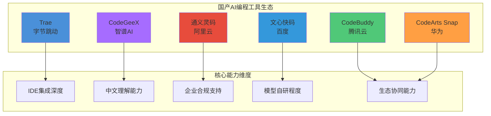
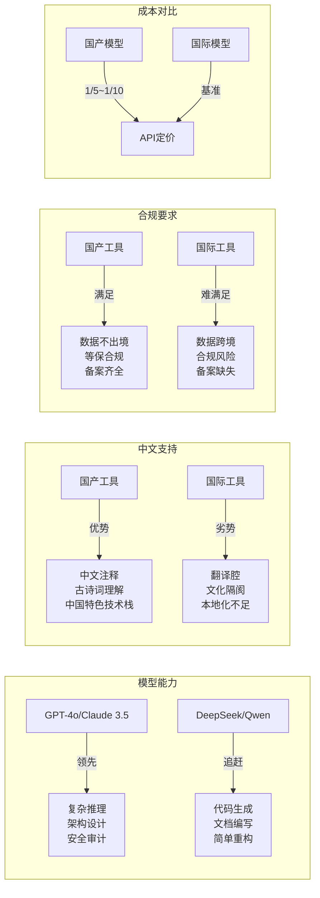
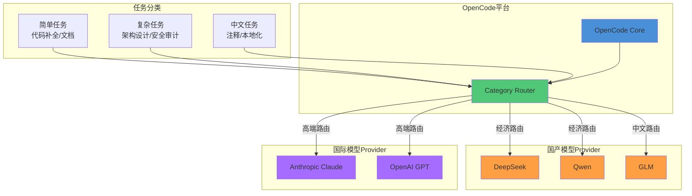

# 国产 AI 编程生态适配

> 国产大模型正在快速追赶——DeepSeek、Qwen、GLM 与 OpenCode 的组合，能否成为性价比之选？

## 文章概述

中国 AI 编程生态在过去两年中经历了从"追赶者"到"差异化竞争者"的转变。字节跳动的 Trae 以 41.2% 市场份额领跑（IDC 2025 年数据），腾讯云的 CodeBuddy 凭借 Craft 智能体实现复杂任务自主执行，华为的 CodeArts Snap 深耕鸿蒙生态，智谱的 CodeGeeX 借力 GLM 大模型站稳脚跟，阿里的通义灵码进入 Gartner 挑战者象限，百度的文心快码在 IDC 评测中斩获 8 项满分——六款国产工具各有侧重，但都在解决一个共同问题：中文开发者的真实需求。与此同时，以 DeepSeek、Qwen、GLM 为代表的国产大模型在推理能力和性价比上不断突破，为 OpenCode 提供了新的 Provider 选择。读完本文，你将能够梳理国产 AI 编程工具的六强格局，配置 DeepSeek/Qwen/GLM 三大模型 Provider，并理解国产方案在合规部署中的关键要点。

本文首先梳理国产 AI 编程工具的现状：Trae 以 IDE 原生体验主打"零配置"开箱即用，CodeBuddy 以双模型架构和 Craft 智能体实现复杂任务自主执行，CodeArts Snap 专为鸿蒙生态深度优化，CodeGeeX 借力智谱大模型在 VS Code 插件市场站稳脚跟，通义灵码在电商场景优化和企业知识库上积累了独特优势，文心快码则在中文理解、SPEC 规范驱动开发和合规部署上投入更多。这些工具与 OpenCode 并非零和竞争关系，而是互补——它们提供了更符合国内开发者使用习惯和合规要求的备选方案。

核心话题是 **OpenCode 与国产模型的结合**。通过配置 DeepSeek、Qwen 等国产 Provider，开发者可以在 OpenCode 生态中享受更低成本的推理服务，同时保持开源工具链的灵活性和可控性。本文提供具体的 Provider 配置示例（包括 API 端点、模型名称、认证方式），并讨论网络代理、数据合规等实际部署中的注意事项。

## 国产 AI 编程工具全景

### 工具矩阵概览



六款国产 AI 编程工具的核心差异如下：

| 工具 | 厂商 | 形态 | 模型 | 核心差异化 | 定价 |
|------|------|------|------|-----------|------|
| **Trae** | 字节 | 独立 IDE | 字节自研+第三方 | 零配置开箱即用，市场份额 41.2% | 个人免费 |
| **CodeBuddy** | 腾讯 | 插件+IDE+CLI | 混元+DeepSeek | Craft 智能体，多文件代码生成 | 专业版 $9.95/月（约 72 元） |
| **CodeArts Snap** | 华为 | 插件 | 盘古 | 鸿蒙生态深度优化 | 基础版 39 元/席位/月 |
| **CodeGeeX** | 智谱 | 插件 | GLM-4 | 代码翻译、中文注释优化 | 免费 |
| **通义灵码** | 阿里 | 插件 | Qwen2.5-Coder | 电商场景优化，Gartner 挑战者 | 个人基础版免费 |
| **文心快码** | 百度 | 插件 | ERNIE | 中文理解、合规部署、SPEC 驱动 | 个人标准版免费 |

## 国产 vs 国际工具差异分析

### 多维度对比矩阵



### 模型能力差距

国产大模型在代码生成领域与国际一线模型（GPT-4o、Claude 3.5 Sonnet）的差距正在缩小，但在以下场景仍存在明显差距：

| 场景 | 国际模型表现 | 国产模型表现 | 差距分析 |
|------|-------------|-------------|----------|
| 复杂架构设计 | 优秀 | 良好 | 跨模块推理能力不足 |
| 安全漏洞检测 | 优秀 | 中等 | 安全知识库覆盖不全 |
| 跨文件重构 | 优秀 | 良好 | 长上下文理解有差距 |
| 代码补全 | 优秀 | 优秀 | 已基本持平 |
| 文档生成 | 良好 | 优秀 | 国产模型中文优势 |
| 注释生成 | 良好 | 优秀 | 国产模型中文优势 |

### 中文理解优势

国产模型在中文场景的独特优势：

1. **中文注释生成**：生成的注释符合中文表达习惯，无"翻译腔"
2. **中文需求理解**：直接理解中文需求文档，无需翻译
3. **中国特色技术栈**：对国产框架（如 Spring Cloud Alibaba、Dubbo、MyBatis-Plus）的理解更深入
4. **古诗词/成语**：在变量命名、注释中恰当使用中文典故

### 合规要求对比

| 合规要求 | 国产工具 | 国际工具 |
|----------|----------|----------|
| 数据不出境 | 默认满足 | 需要特殊配置 |
| 等保合规 | 支持等保三级认证 | 不支持 |
| ICP 备案 | 已完成 | 未完成 |
| 数据安全法 | 符合 | 存在风险 |
| 个人信息保护法 | 符合 | 需要评估 |

### 成本对比

以 100 万 Token 月度消耗为例（1M tokens = 100 万 tokens）：

| 模型 | 单价（元/百万 Token，输入+输出混合） | 月度成本 | 备注 |
|------|--------------------------------------|----------|------|
| GPT-4o | 约 45 元 | 约 45 元 | 输入 $2.50/M + 输出 $10/M，混合估算 |
| Claude Sonnet 4 | 约 58 元 | 约 58 元 | 输入 $3/M + 输出 $15/M，混合估算 |
| DeepSeek-V4-Flash | 约 1.5 元 | 约 1.5 元 | 输入缓存命中 $0.02/M + 输出 $0.28/M |
| DeepSeek-V3 | 约 3.3 元 | 约 3.3 元 | 输入 $2/M + 输出 $8/M，混合估算 |
| Qwen-Max | 约 2.8 元 | 约 2.8 元 | 输入 $1.04/M + 输出 $4.16/M，混合估算 |
| GLM-4-Plus | 约 5 元 | 约 5 元 | 统一计价 ¥5/百万 Token |

> 注：价格为 2026 年 6 月参考值，实际以官方最新定价为准。国际模型价格按汇率 7.2 折算。国内模型价格为 API 直接报价。

## OpenCode 与国产模型结合使用

### 混合架构示意



### DeepSeek Provider 配置

DeepSeek 是目前性价比最高的国产模型之一，其 DeepSeek-V3 在代码生成和数学推理的公开 benchmark 上接近 GPT-4o 水平，但在人类偏好盲测（LMSYS Chatbot Arena）中仍有约 44 点 Elo 差距（GPT-4o 约 1287，DeepSeek-V3 约 1243）。V4-Flash 版本进一步降低了 API 成本。

**配置示例**：

```json:examples/opencode-configs/deepseek-provider.json
{
  "providers": {
    "deepseek": {
      "name": "DeepSeek",
      "base_url": "https://api.deepseek.com",
      "api_key": "${DEEPSEEK_API_KEY}",
      "models": {
        "deepseek-chat": {
          "name": "DeepSeek-V3",
          "context_window": 64000,
          "max_output": 8000,
          "pricing": {
            "input": 0.00028,
            "output": 0.0011,
            "unit": "USD per 1K tokens"
          }
        },
        "deepseek-reasoner": {
          "name": "DeepSeek-R1",
          "context_window": 64000,
          "max_output": 8000,
          "pricing": {
            "input": 0.00055,
            "output": 0.00219,
            "unit": "USD per 1K tokens"
          }
        }
      }
    }
  },
  "default_provider": "deepseek",
  "default_model": "deepseek-chat"
}
```

**使用建议**：

| 参数 | 推荐值 | 说明 |
|------|--------|------|
| temperature | 0.3 | 代码生成任务建议较低温度 |
| top_p | 0.9 | 保持默认即可 |
| max_tokens | 4096 | 根据任务复杂度调整 |
| stream | true | 流式输出提升体验 |

### Qwen Provider 配置

阿里通义千问（Qwen）系列模型在中文理解和长上下文处理上有独特优势。

**配置示例**：

```json:examples/opencode-configs/qwen-provider.json
{
  "providers": {
    "qwen": {
      "name": "Alibaba Qwen",
      "base_url": "https://dashscope.aliyuncs.com/compatible-mode/v1",
      "api_key": "${DASHSCOPE_API_KEY}",
      "models": {
        "qwen-max": {
          "name": "Qwen-Max",
          "context_window": 32000,
          "max_output": 8000,
          "pricing": {
            "input": 0.0075,
            "output": 0.0293,
            "unit": "USD per 1K tokens"
          }
        },
        "qwen-plus": {
          "name": "Qwen-Plus",
          "context_window": 131072,
          "max_output": 8000,
          "pricing": {
            "input": 0.0028,
            "output": 0.0086,
            "unit": "USD per 1K tokens"
          }
        },
        "qwen-turbo": {
          "name": "Qwen-Turbo",
          "context_window": 131072,
          "max_output": 8000,
          "pricing": {
            "input": 0.00036,
            "output": 0.00144,
            "unit": "USD per 1K tokens"
          }
        }
      }
    }
  }
}
```

### Qwen & GLM 关键区别

| 模型 | API 端点 | 特色 | 性价比 |
|------|---------|------|--------|
| Qwen-Max | dashscope.aliyuncs.com | 长上下文（128K），中文处理 | 中 |
| Qwen-Plus | dashscope.aliyuncs.com | 高性价比平衡型 | 高 |
| GLM-4 | open.bigmodel.cn | 代码翻译、中文注释 | 中等 |
| GLM-4-Flash | open.bigmodel.cn | 轻量快速 | 极高 |

完整的 Qwen 和 GLM Provider 配置示例见 → `examples/opencode-configs/qwen-provider.json` 和 `examples/opencode-configs/glm-provider.json`。

### 混合路由策略

通过 OpenCode 的 Category Routing 功能，实现"简单任务用经济模型、复杂任务用高端模型"的分工策略：

```json:examples/opencode-configs/category-routing.json
{
  "routing": {
    "categories": {
      "simple": {
        "description": "简单任务：代码补全、文档生成、注释添加",
        "providers": ["deepseek", "qwen"],
        "models": ["deepseek-chat", "qwen-turbo"],
        "fallback": "qwen-plus"
      },
      "complex": {
        "description": "复杂任务：架构设计、跨文件重构、安全审计",
        "providers": ["anthropic", "openai"],
        "models": ["claude-3-5-sonnet-20241022", "gpt-4o"],
        "fallback": "deepseek-reasoner"
      },
      "chinese": {
        "description": "中文任务：中文注释、本地化文档、中文需求分析",
        "providers": ["qwen", "zhipu"],
        "models": ["qwen-max", "glm-4"],
        "fallback": "deepseek-chat"
      }
    },
    "default_category": "simple"
  }
}
```

## 网络代理与合规部署

### 网络代理配置

国内访问国际 LLM API 需要配置网络代理：

```bash
# 系统级代理配置（PowerShell）
$env:HTTP_PROXY = "http://127.0.0.1:7890"
$env:HTTPS_PROXY = "http://127.0.0.1:7890"

# OpenCode 配置文件中设置代理
# opencode.json
{
  "network": {
    "proxy": {
      "http": "http://127.0.0.1:7890",
      "https": "http://127.0.0.1:7890"
    }
  }
}
```

### 数据合规要点

| 合规要求 | 实施建议 |
|----------|----------|
| 敏感代码不发送至境外 | 使用国产模型 Provider 或本地部署 |
| 企业内部部署方案 | vLLM + OpenCode 或 Ollama + OpenCode |
| 隐私保护 | 配置 `.opencodeignore` 排除敏感文件 |
| 审计日志 | 启用 OpenCode 审计功能，记录所有 API 调用 |

### 本地部署方案

对于数据安全要求极高的场景，可采用本地部署方案：

```yaml:examples/opencode-configs/local-deployment.yaml
# 本地 vLLM 部署配置示例
# 启动命令: vllm serve deepseek-ai/deepseek-v3 --port 8000

opencode:
  providers:
    local-vllm:
      name: "Local vLLM"
      base_url: "http://localhost:8000/v1"
      api_key: "dummy"  # 本地部署无需真实 API Key
      models:
        deepseek-v3:
          name: "DeepSeek-V3 (Local)"
          context_window: 64000
          max_output: 4096

  # 排除敏感目录
  ignore_patterns:
    - "**/secrets/**"
    - "**/.env*"
    - "**/credentials/**"
    - "**/private-keys/**"
```

## 国产 AI 工具的未来趋势

国产 AI 编程生态将经历**追赶期（2024-2025，能力追赶+中文优化）→ 差异化期（2025-2026，垂直深耕+合规放大）→ 融合期（2026-2027，混合架构+开源成熟）** 三阶段演进。关键趋势：模型能力差距持续缩小；电商、政务、金融等垂直场景定制化成为差异点；数据合规推动国产方案普及；混合架构（国产做简单任务+国际做复杂推理）成为标准实践。

### 选型建议

| 场景 | 推荐方案 | 理由 |
|------|----------|------|
| 个人学习/开源项目 | DeepSeek + OpenCode | 成本最低，能力足够 |
| 国内中小企业 | Qwen/DeepSeek + OpenCode | 合规 + 性价比 |
| 跨国企业中国团队 | 混合架构（国产+国际） | 兼顾合规与能力 |
| 政府/国企/金融 | 文心快码/本地部署 | 合规优先 |
| 高端研发团队 | Claude/GPT-4o + 国产备用 | 能力优先 |

## 总结

国产 AI 编程生态正在经历从"追赶者"到"差异化竞争者"的转变。Trae 以 41.2% 市场份额领跑（IDC 2025 数据），CodeBuddy 凭借 Craft 智能体实现复杂任务自主执行，CodeArts Snap 深耕鸿蒙生态，CodeGeeX 借力 GLM 大模型，通义灵码进入 Gartner 挑战者象限，文心快码在 IDC 评测中斩获 8 项满分——六款工具各有侧重，在中文支持、合规部署、垂直场景、智能体能力上形成了独特优势。与此同时，DeepSeek、Qwen、GLM 等国产大模型在性价比上具有压倒性优势，与 OpenCode 的结合为国内开发者提供了"鱼与熊掌兼得"的可能。

**核心建议**：

1. **不要被供应商锁定**：选择 OpenCode 这样的开源平台，保持 Provider 切换的自由度
2. **善用混合架构**：简单任务用国产模型，复杂任务用国际模型，实现成本与质量的平衡
3. **重视合规要求**：在政府、国企、金融等场景，优先选择支持本地化部署的国产方案
4. **持续关注发展**：国产模型能力快速迭代，定期评估是否需要调整选型策略

## 关联章节

- ← [AI 编程工具生态对比](ecosystem-comparison.md)（国产是生态环境的一部分）
- → [国产模型供应商配置](../03-setup/chinese-providers.md)（国产模型 Provider 配置的详细实操）
- → [性能调优与成本管理](../06-advanced/performance-tuning.md)（混合架构的成本优化策略）
- → [案例：国产模型混合架构](../07-case-studies/case-multi-model.md)（混合架构的完整案例）
