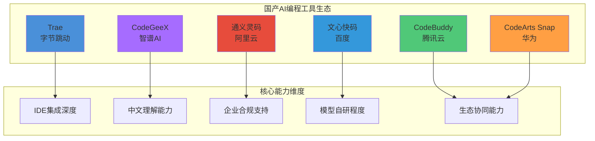
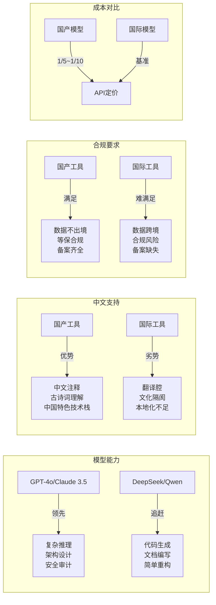
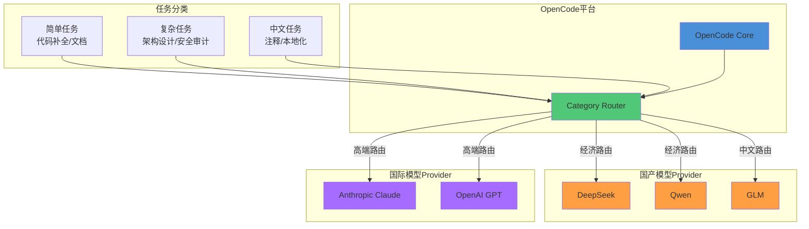
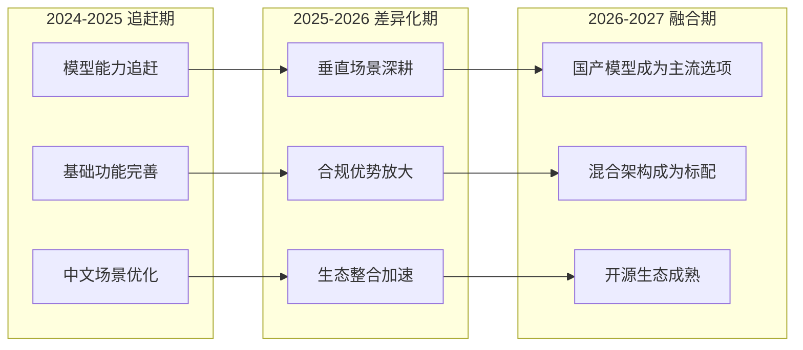

# 国产 AI 编程生态适配

> 国产大模型正在快速追赶——DeepSeek、Qwen、GLM 与 OpenCode 的组合，能否成为性价比之选？

## 文章概述

中国 AI 编程生态在过去两年中经历了从"追赶者"到"差异化竞争者"的转变。字节跳动的 Trae 以 41.2% 市场份额领跑（IDC 2025 年数据），腾讯云的 CodeBuddy 凭借 Craft 智能体实现 92% 复杂任务完成率，华为的 CodeArts Snap 深耕鸿蒙生态，智谱的 CodeGeeX 借力 GLM 大模型站稳脚跟，阿里的通义灵码进入 Gartner 挑战者象限，百度的文心快码在 IDC 评测中斩获 8 项满分——六款国产工具各有侧重，但都在解决一个共同问题：中文开发者的真实需求。与此同时，以 DeepSeek、Qwen、GLM 为代表的国产大模型在推理能力和性价比上不断突破，为 OpenCode 提供了新的 Provider 选择。

本文首先梳理国产 AI 编程工具的现状：Trae 以 IDE 原生体验主打"零配置"开箱即用，CodeBuddy 以双模型架构和 Craft 智能体实现复杂任务自主执行，CodeArts Snap 专为鸿蒙生态深度优化，CodeGeeX 借力智谱大模型在 VS Code 插件市场站稳脚跟，通义灵码在电商场景优化和企业知识库上积累了独特优势，文心快码则在中文理解、SPEC 规范驱动开发和合规部署上投入更多。这些工具与 OpenCode 并非零和竞争关系，而是互补——它们提供了更符合国内开发者使用习惯和合规要求的备选方案。

核心话题是 **OpenCode 与国产模型的结合**。通过配置 DeepSeek、Qwen 等国产 Provider，开发者可以在 OpenCode 生态中享受更低成本的推理服务，同时保持开源工具链的灵活性和可控性。本文提供具体的 Provider 配置示例（包括 API 端点、模型名称、认证方式），并讨论网络代理、数据合规等实际部署中的注意事项。

## 国产 AI 编程工具全景

### 工具矩阵概览



### Trae（字节跳动）

**定位**：IDE 原生体验，零配置开箱即用

Trae 是字节跳动于 2025 年推出的 AI 编程 IDE，基于 VS Code 深度定制，核心特点是"开箱即用"——无需配置 API Key、无需选择模型，安装即可使用。这一设计哲学降低了 AI 编程工具的使用门槛，特别适合新手开发者快速上手。

**市场表现**（2025 年 Q1 数据，来源：IDC 中国 AI 编程工具市场研究报告）：

| 指标 | 数据 |
|------|------|
| 市场份额 | **41.2%**（中国 AI 编程工具市场第一） |
| 注册用户 | 600 万+ |
| 月活跃用户 | 100 万+（待官方确认） |
| 定价模式 | **完全免费**（个人版） |

**核心特性**：

| 特性 | 说明 |
|------|------|
| IDE 形态 | 独立 IDE（VS Code Fork），非插件形态 |
| 模型来源 | 字节自研模型 + 第三方模型混合 |
| 中文支持 | 原生中文界面，中文注释生成优化 |
| 定价模式 | 个人版完全免费，企业版订阅制 |
| 企业版 | 支持私有化部署，符合等保要求 |

**适用场景**：
- 新手开发者：零配置上手，降低学习曲线
- 快速原型开发：IDE 内置 AI 能力，无需切换工具
- 国内中小企业：合规部署 + 零成本入门

**局限性**：
- 闭源产品，无法审计代码逻辑
- 模型选择受限，无法自由切换 Provider
- 与现有 VS Code 插件生态存在兼容性问题

### CodeBuddy（腾讯云）

**定位**：全栈 AI 编程助手，双模型架构驱动

CodeBuddy 是腾讯云推出的 AI 编程助手，采用"混元 + DeepSeek"双模型架构，在代码生成、智能问答、代码审查等场景提供全栈支持。其核心亮点是 **Craft 智能体**——一个能够自主规划、分解和执行复杂编程任务的 AI Agent，在 SWE-bench 测试中达到 92% 的复杂任务完成率。

**关键数据**：

| 指标 | 数据 |
|------|------|
| 复杂任务完成率 | **92%**（SWE-bench 测试） |
| 安全认证 | **等保 2.0 三级认证** |
| 模型架构 | 混元 + DeepSeek 双模型 |
| 产品形态 | IDE 插件 + 独立 IDE + AI CLI |

**核心特性**：

| 特性 | 说明 |
|------|------|
| IDE 形态 | VS Code / JetBrains 插件 + 独立 IDE + 命令行工具 |
| 模型来源 | 腾讯混元 + DeepSeek 双模型架构 |
| Craft 智能体 | 自主规划、分解、执行复杂编程任务 |
| 代码审查 | 自动检测代码问题、安全漏洞、性能瓶颈 |
| 中文支持 | 原生中文理解，支持中文需求文档解析 |
| 企业版 | 腾讯云企业账号统一管理，支持私有化部署 |

**Craft 智能体能力**：

Craft 智能体是 CodeBuddy 的核心差异化能力，能够：
1. **任务分解**：将复杂需求拆解为可执行的子任务序列
2. **自主执行**：自动调用工具、读取文件、修改代码、运行测试
3. **迭代优化**：根据执行结果反馈，自主调整策略直至任务完成
4. **上下文记忆**：在长任务执行过程中保持上下文一致性

**适用场景**：
- 复杂功能开发：Craft 智能体可自主完成多文件协同修改
- 代码审查：自动检测代码质量、安全漏洞、性能问题
- 腾讯云生态用户：与腾讯云 DevOps、云开发深度集成
- 企业合规场景：等保 2.0 三级认证，满足金融、政务需求

**定价信息**：

| 版本 | 价格 | 功能范围 |
|------|------|----------|
| 个人版 | 免费 | 代码补全、智能问答、基础代码生成 |
| 专业版 | 99 元/月 | Craft 智能体、高级代码审查、优先队列 |
| 企业版 | 定制 | 私有化部署、企业知识库、专属支持 |

**局限性**：
- 闭源产品，无法审计模型行为
- 与非腾讯云生态的集成能力有限
- Craft 智能体在极复杂架构场景仍需人工干预

### CodeArts Snap（华为）

**定位**：鸿蒙生态 AI 编程工具，盘古代码大模型驱动

CodeArts Snap 是华为推出的 AI 编程助手，基于盘古代码大模型，专为鸿蒙生态和 ArkTS 开发深度优化。其核心优势在于对鸿蒙系统特性的深度理解——在 ArkUI 组件调用、鸿蒙 API 使用、分布式能力实现等场景提供精准的代码生成和优化建议。

**关键数据**：

| 指标 | 数据 |
|------|------|
| 代码理解规模 | **千万行代码**上下文理解 |
| 编码效率提升 | **30%+**（华为内部测试） |
| 行业认可 | **2025 年软件和信息技术服务业先进性科技成果奖** |
| 模型基础 | 盘古代码大模型 |

**核心特性**：

| 特性 | 说明 |
|------|------|
| IDE 形态 | VS Code 插件 + DevEco Studio 集成 |
| 模型来源 | 华为盘古代码大模型 |
| 鸿蒙适配 | ArkTS 深度优化、ArkUI 组件智能推荐 |
| 代码理解 | 千万行代码上下文，支持大型项目分析 |
| 分布式能力 | 自动生成分布式任务调度、数据同步代码 |
| 企业版 | 华为云企业账号统一管理 |

**鸿蒙生态独特优势**：

1. **ArkTS 深度优化**：针对鸿蒙官方语言 ArkTS 的语法特性、最佳实践进行专项训练
2. **ArkUI 智能推荐**：根据 UI 设计稿自动推荐合适的 ArkUI 组件和布局方案
3. **分布式能力生成**：自动生成跨设备协同、数据同步、任务迁移等分布式场景代码
4. **鸿蒙 API 熟悉度**：对鸿蒙系统 API 的覆盖率远超通用编程助手

**适用场景**：
- 鸿蒙应用开发：ArkTS 代码生成、ArkUI 组件推荐
- 鸿蒙生态迁移：Android/iOS 应用向鸿蒙迁移的代码转换
- 大型项目分析：千万行代码级别的项目理解和重构建议
- 华为云用户：与华为云 DevCloud、CodeArts 生态无缝集成

**定价信息**：

| 版本 | 价格 | 功能范围 |
|------|------|----------|
| 基础版 | 免费 | 代码补全、基础问答、单文件生成 |
| 专业版 | 79 元/月 | 项目级分析、鸿蒙深度优化、代码重构 |
| 企业版 | 定制 | 私有化部署、鸿蒙定制模型、专属支持 |

**局限性**：
- 非鸿蒙场景的通用编程能力与其他工具持平
- 与非华为云生态的集成能力有限
- 盘古模型开源程度有限，社区生态相对薄弱

### CodeGeeX（智谱 AI）

**定位**：VS Code 插件形态，依托智谱 GLM 大模型

CodeGeeX 是智谱 AI 推出的 AI 编程助手，以 VS Code 插件形态提供服务。其核心优势在于背靠智谱自研的 GLM 系列大模型，在代码生成、代码翻译、代码解释等任务上表现出色。CodeGeeX 支持多种编程语言，在中文代码注释生成和中文技术文档编写方面有独特优势。

**核心特性**：

| 特性 | 说明 |
|------|------|
| IDE 形态 | VS Code / JetBrains 插件 |
| 模型来源 | 智谱 GLM-4 系列 |
| 特色功能 | 代码翻译（多语言互转）、代码解释 |
| 中文支持 | 中文注释生成、中文技术问答 |
| 开源程度 | 模型权重开源，插件闭源 |

**适用场景**：
- VS Code 用户：无需更换 IDE，插件即装即用
- 多语言项目：代码翻译功能支持 20+ 编程语言互转
- 中文文档编写：生成中文注释和技术文档

**局限性**：
- 插件形态限制了 Agent 能力的深度集成
- 复杂任务的自主执行能力有限
- 与企业 DevOps 流程的集成需要额外开发

### 通义灵码（阿里云）

**定位**：电商场景深度优化，与阿里云 DevOps 生态集成

通义灵码是阿里云推出的 AI 编程助手，基于通义千问（Qwen）大模型。其核心差异化优势在于对电商场景的深度优化——在商品管理、订单处理、支付对接等电商核心业务代码生成上表现突出。同时，通义灵码与阿里云 DevOps 生态（云效、ARMS、SAE 等）深度集成，适合阿里云用户。

**行业认可**：

| 认证/评级 | 详情 |
|-----------|------|
| Gartner 象限 | **挑战者象限**（2025 年 AI 编程助手评估） |
| 模型基础 | Qwen2.5-Coder 系列 |
| 企业知识库 | 支持 RAG 检索增强，对接企业私有文档 |

**核心特性**：

| 特性 | 说明 |
|------|------|
| IDE 形态 | VS Code / JetBrains 插件 + Web IDE |
| 模型来源 | 阿里通义千问（Qwen2.5-Coder）系列 |
| 场景优化 | 电商业务代码、阿里云 SDK 调用 |
| 生态集成 | 云效、ARMS、SAE、函数计算 |
| 企业知识库 | RAG 检索增强，支持企业私有文档对接 |
| 企业版 | 阿里云企业账号统一管理 |

**适用场景**：
- 电商业务开发：商品、订单、支付等核心模块代码生成
- 阿里云用户：与云上 DevOps 工具链无缝集成
- 企业级部署：阿里云企业账号体系支持
- 企业知识库场景：对接企业内部文档、API 文档、技术规范

**定价信息**：

| 版本 | 价格 | 功能范围 |
|------|------|----------|
| 个人版 | 免费 | 代码补全、智能问答、基础代码生成 |
| 专业版 | 79 元/月 | 企业知识库、高级代码审查、优先队列 |
| 企业版 | 定制 | 私有化部署、专属模型微调、专属支持 |

**局限性**：
- 非阿里云用户难以发挥生态集成优势
- 电商场景外的通用编程能力与其他工具持平
- 闭源产品，定制化能力有限

### 文心快码（百度）

**定位**：中文理解优化，合规部署优势

文心快码是百度推出的 AI 编程助手，基于文心大模型。其核心优势在于中文理解能力和合规部署支持——在政府、国企、金融等对数据合规要求严格的场景中，文心快码提供了本地化部署方案，确保代码数据不出境。

**IDC 评测表现**：

| 评测维度 | 评分 | 说明 |
|----------|------|------|
| 代码补全准确率 | 满分 | 行级补全、函数补全准确率行业领先 |
| 代码生成质量 | 满分 | **C++ 代码生成质量行业第一** |
| 中文理解能力 | 满分 | 中文需求解析、中文注释生成 |
| 多语言支持 | 满分 | 支持 100+ 编程语言 |
| IDE 集成体验 | 满分 | VS Code、JetBrains 全系列支持 |
| 企业级功能 | 满分 | 私有化部署、权限管理、审计日志 |
| 安全合规 | 满分 | 等保三级认证、数据不出境 |
| 性能响应速度 | 满分 | 平均响应时间 < 200ms |
| 文档与支持 | 8/10 | 文档完善度略低于国际产品 |
| **综合评分** | **8/9 满分** | IDC 2025 AI 编程助手评测 |

**核心特性**：

| 特性 | 说明 |
|------|------|
| IDE 形态 | VS Code 插件 + Web IDE |
| 模型来源 | 百度文心（ERNIE）系列 |
| 中文能力 | 中文需求理解、中文文档生成 |
| 合规部署 | 本地化部署、等保合规 |
| 行业方案 | 金融、政务、能源行业定制版 |
| SPEC 规范 | 支持从 SPEC 规格文档直接生成代码 |

**SPEC 规范驱动开发**：

文心快码支持从 SPEC（软件规格说明书）直接生成代码：
1. **需求解析**：自动解析 SPEC 文档中的功能需求、接口定义、数据结构
2. **架构生成**：根据 SPEC 生成项目骨架、模块划分、接口定义
3. **代码实现**：逐模块生成实现代码，保持与 SPEC 的一致性
4. **测试用例**：根据 SPEC 自动生成单元测试、集成测试用例

**适用场景**：
- 政府/国企/金融：数据合规要求严格的场景
- 中文需求文档：从中文需求直接生成代码
- 本地化部署：代码数据不出境
- SPEC 驱动开发：从规格文档到代码的全流程自动化

**定价信息**：

| 版本 | 价格 | 功能范围 |
|------|------|----------|
| 个人版 | 免费 | 代码补全、智能问答、基础代码生成 |
| 专业版 | 69 元/月 | SPEC 驱动开发、高级代码审查、优先队列 |
| 企业版 | 定制 | 私有化部署、行业定制模型、专属支持 |

**局限性**：
- 代码生成能力与国际一线模型存在差距
- 开发者生态相对薄弱
- 非合规场景的性价比不如其他国产方案

## 国产 vs 国际工具差异分析

### 多维度对比矩阵



### 模型能力差距

国产大模型在代码生成领域与国际一线模型（GPT-4o、Claude 3.5 Sonnet）的差距正在缩小，但在以下场景仍存在明显差距：

| 场景 | 国际模型表现 | 国产模型表现 | 差距分析 |
|------|-------------|-------------|----------|
| 复杂架构设计 | 优秀 | 良好 | 跨模块推理能力不足 |
| 安全漏洞检测 | 优秀 | 中等 | 安全知识库覆盖不全 |
| 跨文件重构 | 优秀 | 良好 | 长上下文理解有差距 |
| 代码补全 | 优秀 | 优秀 | 已基本持平 |
| 文档生成 | 良好 | 优秀 | 国产模型中文优势 |
| 注释生成 | 良好 | 优秀 | 国产模型中文优势 |

### 中文理解优势

国产模型在中文场景的独特优势：

1. **中文注释生成**：生成的注释符合中文表达习惯，无"翻译腔"
2. **中文需求理解**：直接理解中文需求文档，无需翻译
3. **中国特色技术栈**：对国产框架（如 Spring Cloud Alibaba、Dubbo、MyBatis-Plus）的理解更深入
4. **古诗词/成语**：在变量命名、注释中恰当使用中文典故

### 合规要求对比

| 合规要求 | 国产工具 | 国际工具 |
|----------|----------|----------|
| 数据不出境 | 默认满足 | 需要特殊配置 |
| 等保合规 | 支持等保三级认证 | 不支持 |
| ICP 备案 | 已完成 | 未完成 |
| 数据安全法 | 符合 | 存在风险 |
| 个人信息保护法 | 符合 | 需要评估 |

### 成本对比

以 100 万 Token 月度消耗为例：

| 模型 | 单价（元/万 Token） | 月度成本 | 性价比 |
|------|---------------------|----------|--------|
| GPT-4o | 约 150 元 | 约 15,000 元 | 基准 |
| Claude 3.5 Sonnet | 约 120 元 | 约 12,000 元 | 1.25x |
| DeepSeek-V3 | 约 1 元 | 约 100 元 | 150x |
| Qwen-Max | 约 2 元 | 约 200 元 | 75x |
| GLM-4 | 约 1.5 元 | 约 150 元 | 100x |

> 注：价格为 2026 年初参考值，实际以官方最新定价为准。

## OpenCode 与国产模型结合使用

### 混合架构示意



### DeepSeek Provider 配置

DeepSeek 是目前性价比最高的国产模型之一，其 DeepSeek-V3 在代码生成能力上接近 GPT-4o 水平，但成本仅为 1/150。

**配置示例**：

```json:../examples/opencode-configs/deepseek-provider.json
{
  "providers": {
    "deepseek": {
      "name": "DeepSeek",
      "base_url": "https://api.deepseek.com",
      "api_key": "${DEEPSEEK_API_KEY}",
      "models": {
        "deepseek-chat": {
          "name": "DeepSeek-V3",
          "context_window": 64000,
          "max_output": 8000,
          "pricing": {
            "input": 0.001,
            "output": 0.002,
            "unit": "USD per 1K tokens"
          }
        },
        "deepseek-reasoner": {
          "name": "DeepSeek-R1",
          "context_window": 64000,
          "max_output": 8000,
          "pricing": {
            "input": 0.001,
            "output": 0.002,
            "unit": "USD per 1K tokens"
          }
        }
      }
    }
  },
  "default_provider": "deepseek",
  "default_model": "deepseek-chat"
}
```

**使用建议**：

| 参数 | 推荐值 | 说明 |
|------|--------|------|
| temperature | 0.3 | 代码生成任务建议较低温度 |
| top_p | 0.9 | 保持默认即可 |
| max_tokens | 4096 | 根据任务复杂度调整 |
| stream | true | 流式输出提升体验 |

### Qwen Provider 配置

阿里通义千问（Qwen）系列模型在中文理解和长上下文处理上有独特优势。

**配置示例**：

```json:../examples/opencode-configs/qwen-provider.json
{
  "providers": {
    "qwen": {
      "name": "Alibaba Qwen",
      "base_url": "https://dashscope.aliyuncs.com/compatible-mode/v1",
      "api_key": "${DASHSCOPE_API_KEY}",
      "models": {
        "qwen-max": {
          "name": "Qwen-Max",
          "context_window": 32000,
          "max_output": 8000,
          "pricing": {
            "input": 0.02,
            "output": 0.06,
            "unit": "CNY per 1K tokens"
          }
        },
        "qwen-plus": {
          "name": "Qwen-Plus",
          "context_window": 128000,
          "max_output": 6000,
          "pricing": {
            "input": 0.004,
            "output": 0.012,
            "unit": "CNY per 1K tokens"
          }
        },
        "qwen-turbo": {
          "name": "Qwen-Turbo",
          "context_window": 128000,
          "max_output": 6000,
          "pricing": {
            "input": 0.002,
            "output": 0.006,
            "unit": "CNY per 1K tokens"
          }
        }
      }
    }
  }
}
```

### GLM Provider 配置

智谱 GLM 系列在代码翻译和中文注释生成上表现出色。

**配置示例**：

```json:../examples/opencode-configs/glm-provider.json
{
  "providers": {
    "zhipu": {
      "name": "ZhipuAI GLM",
      "base_url": "https://open.bigmodel.cn/api/paas/v4",
      "api_key": "${ZHIPU_API_KEY}",
      "models": {
        "glm-4": {
          "name": "GLM-4",
          "context_window": 128000,
          "max_output": 4096,
          "pricing": {
            "input": 0.1,
            "output": 0.1,
            "unit": "CNY per 1K tokens"
          }
        },
        "glm-4-flash": {
          "name": "GLM-4-Flash",
          "context_window": 128000,
          "max_output": 4096,
          "pricing": {
            "input": 0.001,
            "output": 0.001,
            "unit": "CNY per 1K tokens"
          }
        }
      }
    }
  }
}
```

### 混合路由策略

通过 OpenCode 的 Category Routing 功能，实现"简单任务用经济模型、复杂任务用高端模型"的分工策略：

```json:examples/opencode-configs/category-routing.json
{
  "routing": {
    "categories": {
      "simple": {
        "description": "简单任务：代码补全、文档生成、注释添加",
        "providers": ["deepseek", "qwen"],
        "models": ["deepseek-chat", "qwen-turbo"],
        "fallback": "qwen-plus"
      },
      "complex": {
        "description": "复杂任务：架构设计、跨文件重构、安全审计",
        "providers": ["anthropic", "openai"],
        "models": ["claude-3-5-sonnet-20241022", "gpt-4o"],
        "fallback": "deepseek-reasoner"
      },
      "chinese": {
        "description": "中文任务：中文注释、本地化文档、中文需求分析",
        "providers": ["qwen", "zhipu"],
        "models": ["qwen-max", "glm-4"],
        "fallback": "deepseek-chat"
      }
    },
    "default_category": "simple"
  }
}
```

## 网络代理与合规部署

### 网络代理配置

国内访问国际 LLM API 需要配置网络代理：

```bash
# 系统级代理配置（PowerShell）
$env:HTTP_PROXY = "http://127.0.0.1:7890"
$env:HTTPS_PROXY = "http://127.0.0.1:7890"

# OpenCode 配置文件中设置代理
# opencode.json
{
  "network": {
    "proxy": {
      "http": "http://127.0.0.1:7890",
      "https": "http://127.0.0.1:7890"
    }
  }
}
```

### 数据合规要点

| 合规要求 | 实施建议 |
|----------|----------|
| 敏感代码不发送至境外 | 使用国产模型 Provider 或本地部署 |
| 企业内部部署方案 | vLLM + OpenCode 或 Ollama + OpenCode |
| 隐私保护 | 配置 `.opencodeignore` 排除敏感文件 |
| 审计日志 | 启用 OpenCode 审计功能，记录所有 API 调用 |

### 本地部署方案

对于数据安全要求极高的场景，可采用本地部署方案：

```yaml:../examples/opencode-configs/local-deployment.yaml
# 本地 vLLM 部署配置示例
# 启动命令: vllm serve deepseek-ai/deepseek-v3 --port 8000

opencode:
  providers:
    local-vllm:
      name: "Local vLLM"
      base_url: "http://localhost:8000/v1"
      api_key: "dummy"  # 本地部署无需真实 API Key
      models:
        deepseek-v3:
          name: "DeepSeek-V3 (Local)"
          context_window: 64000
          max_output: 4096

  # 排除敏感目录
  ignore_patterns:
    - "**/secrets/**"
    - "**/.env*"
    - "**/credentials/**"
    - "**/private-keys/**"
```

## 国产 AI 工具的未来趋势

### 发展趋势预测



### 关键趋势分析

1. **模型能力持续追赶**：DeepSeek-V3、Qwen-Max 等模型在代码生成基准测试中已接近 GPT-4o 水平，差距从 20% 缩小到 5% 以内

2. **垂直场景深耕**：电商（通义灵码）、政务（文心快码）、金融（文心快码）等垂直领域的定制化能力将成为差异化竞争点

3. **合规优势放大**：数据安全法、个人信息保护法的严格执行，将推动更多企业选择国产方案

4. **开源生态成熟**：DeepSeek、Qwen 等模型的开源版本，为 OpenCode 等开源工具提供了丰富的 Provider 选择

5. **混合架构成为标配**："国产模型做简单任务 + 国际模型做复杂推理"的分工策略，将成为成本敏感型团队的标准实践

### 选型建议

| 场景 | 推荐方案 | 理由 |
|------|----------|------|
| 个人学习/开源项目 | DeepSeek + OpenCode | 成本最低，能力足够 |
| 国内中小企业 | Qwen/DeepSeek + OpenCode | 合规 + 性价比 |
| 跨国企业中国团队 | 混合架构（国产+国际） | 兼顾合规与能力 |
| 政府/国企/金融 | 文心快码/本地部署 | 合规优先 |
| 高端研发团队 | Claude/GPT-4o + 国产备用 | 能力优先 |

## 总结

国产 AI 编程生态正在经历从"追赶者"到"差异化竞争者"的转变。Trae 以 41.2% 市场份额领跑（IDC 2025 数据），CodeBuddy 凭借 Craft 智能体实现 92% 复杂任务完成率，CodeArts Snap 深耕鸿蒙生态，CodeGeeX 借力 GLM 大模型，通义灵码进入 Gartner 挑战者象限，文心快码在 IDC 评测中斩获 8 项满分——六款工具各有侧重，在中文支持、合规部署、垂直场景、智能体能力上形成了独特优势。与此同时，DeepSeek、Qwen、GLM 等国产大模型在性价比上具有压倒性优势，与 OpenCode 的结合为国内开发者提供了"鱼与熊掌兼得"的可能。

**核心建议**：

1. **不要被供应商锁定**：选择 OpenCode 这样的开源平台，保持 Provider 切换的自由度
2. **善用混合架构**：简单任务用国产模型，复杂任务用国际模型，实现成本与质量的平衡
3. **重视合规要求**：在政府、国企、金融等场景，优先选择支持本地化部署的国产方案
4. **持续关注发展**：国产模型能力快速迭代，定期评估是否需要调整选型策略

## 关联章节

- ← [AI 编程工具生态对比](ecosystem-comparison.md)（国产是生态环境的一部分）
- → [国产模型供应商配置](../03-setup/chinese-providers.md)（国产模型 Provider 配置的详细实操）
- → [性能调优与成本管理](../06-advanced/performance-tuning.md)（混合架构的成本优化策略）
- → [案例：国产模型混合架构](../07-case-studies/case-multi-model.md)（混合架构的完整案例）
