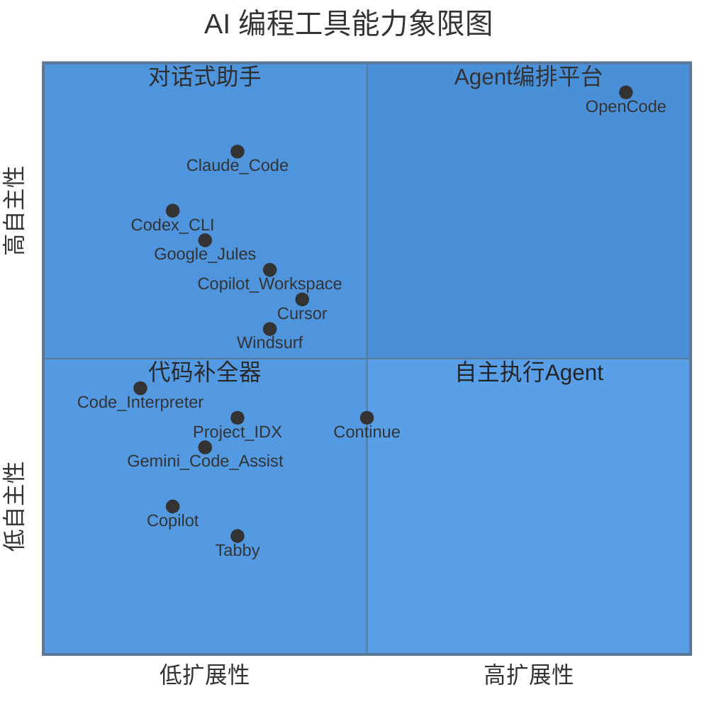
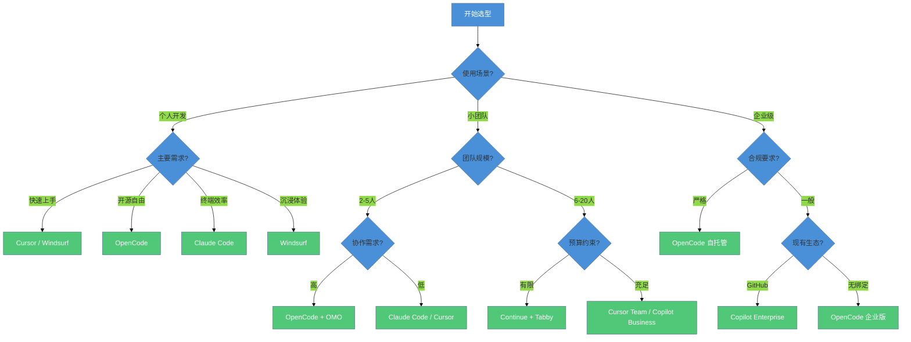
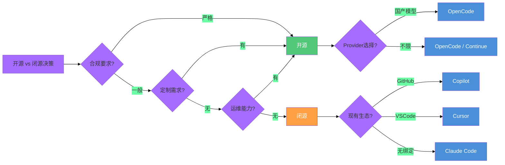

# AI 编程工具生态对比

> 从 Copilot 到 OpenCode，从闭源到开源——一张全景地图帮你找到最适合团队的工具组合。

## 文章概述

AI 编程工具市场正在经历前所未有的繁荣。仅 2025 到 2026 年间，就有超过 20 款新工具进入开发者视野。面对如此多的选择，团队和个人的选型决策变得异常复杂——不仅要考虑功能特性，还要评估开源性、供应商锁定风险、隐私合规、学习曲线、团队适配度等多维因素。读完本文，你应该能够从十四款工具的全景对比中，为自己的团队找到最适合的 AI 编程工具组合。

本文以 **Harness Engineering 理论框架**（Article 1.3 的 5 大分类法）为坐标系，对十四款主流 AI 编程工具——**OpenCode**、**Cursor**、**Claude Code**、**GitHub Copilot**、**Windsurf**、**Continue**、**Tabby**、**Google Gemini Code Assist**、**OpenAI Codex**、**Google Project IDX**、**ChatGPT Code Interpreter**、**Google Jules**、**OpenAI Codex CLI**、**GitHub Copilot Workspace**——进行全方位对比。对比维度涵盖开源性、Provider 自由度、Agent 类型、Plugin/扩展能力、学习曲线、隐私保护、定价模式、企业级集成等 8 个关键维度。

在对比基础上，本文提供**场景化选型指南**：个人开发者看什么、小团队关注什么、企业级部署需要什么。同时，我们将基于 Martin Fowler 的分类法，分析每款工具在 5 大类别中的定位，帮助读者建立从"工具功能"到"工程能力"的升维思考。

## 内容要点

1. **十四款工具全景定位** — OpenCode（开源 Agent 编排平台）、Cursor（编辑器内嵌 AI IDE）、Claude Code（终端 Agent 专家）、GitHub Copilot（生态渗透型代码补全）、Windsurf（AI 原生 IDE）、Continue（开源对话式助手）、Tabby（自托管代码补全）、Google Gemini Code Assist（企业级代码助手）、OpenAI Codex（历史里程碑）、Google Project IDX（云端 AI IDE）、ChatGPT Code Interpreter（对话式代码执行）、Google Jules（异步 Agent）、OpenAI Codex CLI（终端代码 Agent）、GitHub Copilot Workspace（AI 驱动开发工作台）。每款工具的核心理念、目标用户和典型使用场景。

2. **8 维对比矩阵** — 开源性（代码是否可审计/可自建）、Provider 自由度（是否锁定模型供应商）、Agent 类型（补全器/对话式/自主执行/编排）、Plugin/扩展能力（Hook 点数量与生态丰富度）、学习曲线（上手时间与概念复杂度）、隐私保护（数据是否离开本地）、定价模式（免费/订阅/企业版）、企业级集成（SSO/审计/权限）。

3. **场景化选型决策树** — 个人开发者：如果是 VSCode 用户推荐 Cursor，如果追求开源和灵活性推荐 OpenCode。小团队：如果重视协作推荐 OpenCode + OMO，如果要快速上手推荐 Claude Code。企业级：如果合规要求高推荐 OpenCode（自托管），如果要低学习成本推荐 Copilot。决策树将每个场景的关键约束条件串联成清晰的判断路径。

4. **开源 vs 闭源的分水岭** — 开源工具的三大优势：可审计（代码和数据处理逻辑透明）、可定制（可根据团队需求修改和扩展）、无供应商锁定（可自行托管和运维）。闭源工具的两大优势：体验一致性（端到端优化）、开箱即用（零配置）。这个分水岭往往是企业选型的首要决策点。

5. **生态未来趋势** — Agent 化（从补全到 Agent 执行是确定性方向）、开源化（开源工具在 Agent 时代加速追赶闭源）、专业化（垂直场景的工具将不断涌现）、协同化（多工具组合取代单一工具）。这些趋势将影响未来 12-24 个月的选型决策。

---

## 一、AI 编程工具全景定位

十四款工具按核心能力可归纳为四类，下表对比它们的定位、开源性、Provider 灵活度和适用场景：

| 工具 | 类别 | 开源性 | Provider | Agent 类型 | 适合人群 |
|------|------|--------|----------|-----------|---------|
| **OpenCode** | Agent 编排平台 | ✅ 完全开源 | 75+ 自由选择 | 多 Agent 编排 | 追求灵活性的团队 |
| **Cursor** | AI IDE | ❌ 闭源 | 锁定 Claude/OpenAI | 编辑器内嵌 Agent | VSCode 重度用户 |
| **Claude Code** | 终端 Agent | ❌ 闭源 | 仅 Claude | 自主执行 Agent | 终端极客 |
| **GitHub Copilot** | 生态渗透补全 | ❌ 闭源 | 仅 OpenAI | 补全 + Chat | GitHub 生态用户 |
| **Windsurf** | AI 原生 IDE | ❌ 闭源 | 锁定 Codeium | Cascade 单 Agent | 沉浸式编程体验 |
| **Continue** | 对话式助手 | ✅ 开源 | 多模型支持 | 对话式 | 开源爱好者 |
| **Tabby** | 自托管补全 | ✅ 开源 | 自训练 | 仅补全 | 隐私优先企业 |
| **Gemini Code Assist** | 企业级代码助手 | ❌ 闭源 | 仅 Gemini | 补全 + Chat | Google Cloud 用户 |
| **OpenAI Codex** | 历史产品 | ❌ 已下线 | 仅 OpenAI | 代码生成（已下线） | — |
| **Project IDX** | 云端 IDE | ❌ 闭源 | Gemini | 编辑器内嵌 | 跨设备开发者 |
| **ChatGPT Code Interpreter** | 对话式代码执行 | ❌ 闭源 | 仅 OpenAI | 代码执行沙箱 | 数据分析 |
| **Google Jules** | 异步 Agent | ❌ 闭源 | 仅 Gemini | 后台自主执行 | 批量任务团队 |
| **OpenAI Codex CLI** | 终端 Agent | ❌ 闭源 | 仅 OpenAI | 命令执行 | 终端用户 |
| **Copilot Workspace** | 端到端工作台 | ❌ 闭源 | 仅 OpenAI | 全流程 Agent | GitHub 团队 |

> 定价详情：OpenCode 核心开源免费；Coder Pro $20/月；Claude Code Pro $20/月；Copilot Pro $10/月、Business $19/用户/月。此成本对比为写书时（2026年6月）所查询数据，请以当前实际定价为准。

---

## 二、8 维对比矩阵

有了全景定位，我们现在进入量化对比。以下矩阵从 8 个关键维度对十四款工具进行评分，帮助读者快速定位差异。

### 2.1 对比维度定义

| 维度 | 定义 | 评分标准 |
|------|------|----------|
| 开源性 | 代码是否可审计、可自建 | 完全开源(5) / 部分开源(3) / 闭源(1) |
| Provider 自由度 | 是否锁定模型供应商 | 多 Provider(5) / 有限选择(3) / 单一锁定(1) |
| Agent 类型 | 工具的核心能力模式 | 编排平台(5) / 自主执行(4) / 对话式(3) / 补全器(2) |
| Plugin/扩展 | Hook 点数量与生态丰富度 | 丰富(5) / 中等(3) / 有限(1) |
| 学习曲线 | 上手时间与概念复杂度 | 低(5) / 中(3) / 高(1) |
| 隐私保护 | 数据是否离开本地 | 完全自控(5) / 可配置(3) / 云端处理(1) |
| 定价模式 | 免费程度与订阅成本 | 免费(5) / 订阅制(3) / 企业定制(2) |
| 企业级集成 | SSO/审计/权限等 | 完善(5) / 基础(3) / 无(1) |

### 2.2 十四款工具对比矩阵

### 2.3 详细评分表

| 工具 | 开源性 | Provider | Agent类型 | 扩展性 | 学习曲线 | 隐私 | 定价 | 企业集成 | 总分 |
|------|--------|----------|-----------|--------|----------|------|------|----------|------|
| **OpenCode** | 5 | 5 | 5 | 5 | 2 | 5 | 5 | 4 | **36** |
| **Cursor** | 1 | 2 | 4 | 3 | 5 | 2 | 3 | 2 | **22** |
| **Claude Code** | 1 | 1 | 5 | 2 | 4 | 2 | 2 | 1 | **18** |
| **Copilot** | 1 | 1 | 2 | 2 | 5 | 1 | 3 | 4 | **19** |
| **Windsurf** | 1 | 2 | 4 | 2 | 5 | 2 | 3 | 2 | **21** |
| **Continue** | 5 | 4 | 3 | 3 | 4 | 4 | 5 | 2 | **30** |
| **Tabby** | 5 | 4 | 2 | 2 | 3 | 5 | 4 | 3 | **28** |
| **Gemini Code Assist** | 1 | 2 | 3 | 2 | 4 | 2 | 2 | 5 | **21** |
| **OpenAI Codex** | 1 | 1 | 2 | 1 | 4 | 1 | 2 | 2 | **14** |
| **Project IDX** | 1 | 2 | 3 | 2 | 4 | 1 | 4 | 3 | **20** |
| **Code Interpreter** | 1 | 1 | 3 | 1 | 5 | 1 | 3 | 1 | **16** |
| **Google Jules** | 1 | 2 | 4 | 2 | 4 | 2 | 3 | 3 | **21** |
| **Codex CLI** | 1 | 1 | 4 | 2 | 3 | 2 | 3 | 1 | **17** |
| **Copilot Workspace** | 1 | 1 | 4 | 2 | 4 | 1 | 2 | 4 | **19** |

> 注：OpenAI Codex 评分基于其历史地位，当前已被 GPT-4 系列取代。

### 2.4 定价模式对比

以下是各主流 AI 编程工具的定价对比（截至 2026 年 6 月）。

| 工具 | 免费层 | 个人订阅 | 团队/企业 |
|------|--------|---------|----------|
| **OpenCode** | 源码免费（BYOK） | Go $10/月 | 企业版按需定制 |
| **GitHub Copilot** | — | Pro $10/月、Pro+ $39/月、Max $100/月 | Business $19/用户、Enterprise $39/用户 |
| **Cursor** | — | Pro $20/月、Pro+ $60/月、Ultra $200/月 | Teams $40/用户/月 |
| **Claude Code** | — | Pro $20/月（已含）、Max $100–200/月 | Team Premium $125/席位 |
| **Windsurf** | 基础版免费 | Pro $15/月 | 企业按需 |
| **Continue** | 全部免费（开源） | — | 企业支持按需 |
| **Tabby** | 全部免费（开源） | — | 企业支持按需 |
| **Gemini Code Assist** | 个人免费 | — | 企业按需 |

> 此成本对比为写书时（2026年6月）所查询数据，请以当前实际定价为准。各工具定价及套餐内容可能随时调整。

### 2.5 关键洞察

从对比矩阵可得出几个关键结论：**开源性与 Provider 自由度高度相关**（开源工具得分高，闭源工具往往绑定特定模型）；**Agent 能力与学习曲线呈负相关**（能力越强的工具学习越陡峭）；**没有"全能冠军"**（OpenCode 总分最高但学习成本也最高，各工具各有侧重）。整体而言，**Agent 化趋势明确**——从"被动补全"到"主动执行"是确定性方向。

---

## 三、场景化选型决策树

工具没有绝对的好坏，只有"适合"与"不适合"。以下决策树帮助不同场景的用户找到最佳选择。

### 3.1 选型决策树

### 3.2 场景化推荐速查

| 场景 | 推荐工具 | 核心理由 |
|------|----------|----------|
| 个人·VSCode/前端 | **Cursor / Windsurf** | 编辑器集成深，流畅体验 |
| 个人·终端极客 | **Claude Code / Codex CLI** | 终端 Agent 能力强 |
| 个人·开源/Provider 自由 | **OpenCode** | 完全开源，75+ Provider |
| 小团队·协作优先 | **OpenCode + OMO** | Team Mode，Skills 可复用 |
| 小团队·快速上手 | **Cursor Team / Windsurf** | 学习成本低 |
| 企业·合规严格 | **OpenCode 自托管** | 数据不出网，代码可审计 |
| 企业·已有 GitHub | **Copilot Enterprise / Workspace** | 无缝集成 |
| 企业·预算有限 | **Continue + Tabby** | 开源免费，可自托管 |
| 数据分析 | **ChatGPT Code Interpreter** | 对话式代码执行 |
| 后台批量任务 | **Google Jules** | 异步 Agent |

---

## 四、开源 vs 闭源的分水岭

**开源三大优势**：可审计（代码可见、可审查数据处理逻辑）、可定制（添加私有功能、修复 Bug）、无供应商锁定（可自托管、控制升级节奏）。**闭源两大优势**：体验一致（端到端优化）、开箱即用（零配置、学习成本低）。

### 4.3 决策框架

---

## 五、OpenCode 的优势与局限

**核心优势**：(1) **Provider 自由**——支持 75+ LLM，可自由切换、混合使用；(2) **Agent 编排**——内置 Build/Plan/Explore，支持自定义 Agent，通过 Workflow 编排协作；(3) **扩展生态**——Plugin（20+ Hook 点）、MCP 协议、Skills Marketplace 三层扩展。

**主要局限**：(1) 终端界面不如 GUI 直观；(2) 学习曲线陡峭，需理解 Agent/Skill/Workflow/Plugin/MCP/Constraint 六个核心概念；(3) 远程/云端模式仍在完善中。

**适用场景总结**：OpenCode 最擅长企业级自托管部署、多模型混合架构、自定义 Agent 开发；不适合追求零学习成本入门或前端快速原型开发的场景。

---

## 六、工具生态的未来趋势

四个确定性趋势：(1) **Agent 化**——从补全到自主执行是确定性方向，选有 Agent 能力的工具；(2) **开源化**——开源工具在 Agent 时代凭借可定制、可审计、无锁定优势加速追赶闭源；(3) **专业化**——垂直场景的专用 Agent（安全审计、测试生成、文档生成等）将不断涌现；(4) **协同化**——多工具组合（如 Tabby 补全 + OpenCode Agent + Cursor 前端）将取代单一工具策略。

---

## 七、选型决策清单

**快速推荐**：合规严格+国产模型→**OpenCode**；前端为主+低学习成本→**Cursor / Windsurf**；GitHub 生态+企业团队→**Copilot / Copilot Workspace**；预算严格+有运维→**Continue + Tabby**；终端极客→**Claude Code / Codex CLI**。

---

## 关联章节

- ← [Harness Engineering 理论框架](harness-engineering-theory.md)（5 大分类法指导对比维度的选择）
- ← [为什么选择 OpenCode](why-opencode.md)（从 OpenCode 的深入分析扩展到全生态对比）
- → [国产 AI 编程生态适配](chinese-ecosystem.md)（国产模型的详细配置与优化）
- → [环境搭建](../03-setup/)（选定工具后，进入实际的安装和配置）
