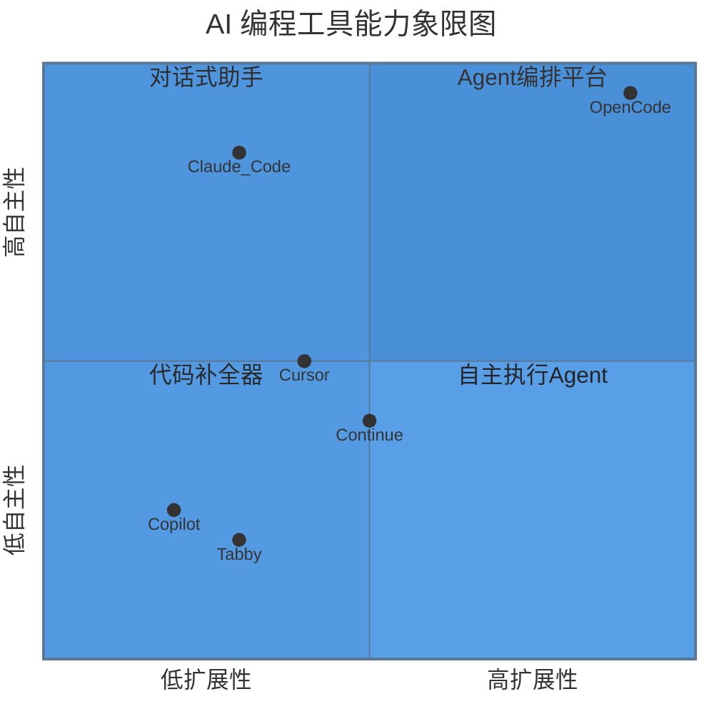
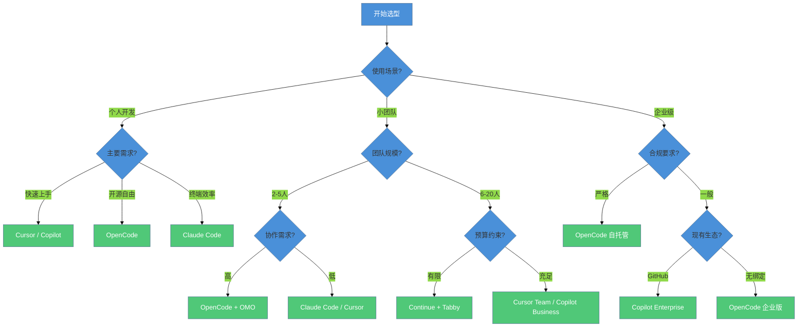
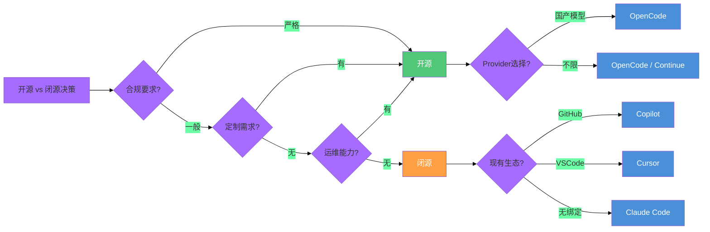

# AI 编程工具生态对比

> 从 Copilot 到 OpenCode，从闭源到开源——一张全景地图帮你找到最适合团队的工具组合。

## 文章概述

AI 编程工具市场正在经历前所未有的繁荣。仅 2025 到 2026 年间，就有超过 20 款新工具进入开发者视野。面对如此多的选择，团队和个人的选型决策变得异常复杂——不仅要考虑功能特性，还要评估开源性、供应商锁定风险、隐私合规、学习曲线、团队适配度等多维因素。

本文以 **Harness Engineering 理论框架**（Article 1.3 的 5 大分类法）为坐标系，对六款主流 AI 编程工具——**OpenCode**、**Cursor**、**Claude Code**、**GitHub Copilot**、**Continue**、**Tabby**——进行全方位对比。对比维度涵盖开源性、Provider 自由度、Agent 类型、Plugin/扩展能力、学习曲线、隐私保护、定价模式、企业级集成等 8 个关键维度。

在对比基础上，本文提供**场景化选型指南**：个人开发者看什么、小团队关注什么、企业级部署需要什么。同时，我们将基于 Martin Fowler 的分类法，分析每款工具在 5 大类别中的定位，帮助读者建立从"工具功能"到"工程能力"的升维思考。

## 内容要点

1. **六款工具全景定位** — OpenCode（开源 Agent 编排平台）、Cursor（编辑器内嵌 AI IDE）、Claude Code（终端 Agent 专家）、GitHub Copilot（生态渗透型代码补全）、Continue（开源对话式助手）、Tabby（自托管代码补全）。每款工具的核心理念、目标用户和典型使用场景。

2. **8 维对比矩阵** — 开源性（代码是否可审计/可自建）、Provider 自由度（是否锁定模型供应商）、Agent 类型（补全器/对话式/自主执行/编排）、Plugin/扩展能力（Hook 点数量与生态丰富度）、学习曲线（上手时间与概念复杂度）、隐私保护（数据是否离开本地）、定价模式（免费/订阅/企业版）、企业级集成（SSO/审计/权限）。

3. **场景化选型决策树** — 个人开发者：如果是 VSCode 用户推荐 Cursor，如果追求开源和灵活性推荐 OpenCode。小团队：如果重视协作推荐 OpenCode + OMO，如果要快速上手推荐 Claude Code。企业级：如果合规要求高推荐 OpenCode（自托管），如果要低学习成本推荐 Copilot。决策树将每个场景的关键约束条件串联成清晰的判断路径。

4. **开源 vs 闭源的分水岭** — 开源工具的三大优势：可审计（代码和数据处理逻辑透明）、可定制（可根据团队需求修改和扩展）、无供应商锁定（可自行托管和运维）。闭源工具的两大优势：体验一致性（端到端优化）、开箱即用（零配置）。这个分水岭往往是企业选型的首要决策点。

5. **生态未来趋势** — Agent 化（从补全到 Agent 执行是确定性方向）、开源化（开源工具在 Agent 时代加速追赶闭源）、专业化（垂直场景的工具将不断涌现）、协同化（多工具组合取代单一工具）。这些趋势将影响未来 12-24 个月的选型决策。

---

## 一、AI 编程工具全景定位

在深入对比之前，我们需要先理解每款工具的"设计哲学"——它为什么存在，解决什么问题，适合谁用。这种理解比功能清单更重要，因为功能可以迭代，但设计哲学决定了工具的边界。

### 1.1 OpenCode：开源 Agent 编排平台

**设计哲学**：把 AI 编程能力变成可组合、可扩展、可审计的基础设施。

OpenCode 的核心定位是"AI 编程操作系统"——它不是一个单一功能的工具，而是一个可以承载各种 Agent、Skill、Workflow 的平台。这种定位决定了它的三个关键特征：

- **Provider 无绑定**：支持 75+ LLM 提供商，从 OpenAI、Anthropic 到国产模型（DeepSeek、通义千问、智谱），用户可以自由切换甚至混合使用
- **Agent 可编排**：内置 Build/Plan/Explore 等多角色 Agent，支持自定义 Agent，天然适配复杂任务分解
- **生态可扩展**：Plugin 系统提供 20+ Hook 点，MCP 协议连接外部服务，Skills Marketplace 共享可复用能力

**目标用户**：追求开源、需要 Provider 灵活性、有复杂工作流需求的团队和个人。

**典型场景**：企业级部署（合规要求高）、多模型混合架构（成本优化）、自定义 Agent 开发（垂直场景）。

### 1.2 Cursor：编辑器内嵌 AI IDE

**设计哲学**：让 AI 成为编辑器的"原生能力"，而非外挂插件。

Cursor 的核心创新是"编辑器即 AI"——它不是在 VSCode 上装一个插件，而是 Fork 了 VSCode 并深度改造，让 AI 能力渗透到编辑器的每个角落。Tab 键补全、Cmd+K 内联编辑、Chat 面板、Composer 多文件编辑，这些功能的设计都围绕"最小化上下文切换"展开。

**目标用户**：前端开发者、追求流畅体验的个人开发者、VSCode 重度用户。

**典型场景**：前端项目开发（React/Vue 组件编写）、快速原型开发、代码重构。

**关键限制**：Provider 锁定（默认 Claude + OpenAI，无法接入国产模型）、闭源（代码不可审计）、订阅制（$20/月）。

### 1.3 Claude Code：终端 Agent 专家

**设计哲学**：让 AI 在终端里"像工程师一样工作"。

Claude Code 是 Anthropic 官方推出的终端 Agent，它的核心能力是"自主执行"——不是被动回答问题，而是主动读取文件、执行命令、运行测试、提交代码。这种能力让它特别适合"交给它一个任务，然后去做别的事"的工作模式。

**目标用户**：终端重度用户、追求效率的极客、需要自动化复杂任务的开发者。

**典型场景**：遗留代码重构、测试覆盖率提升、文档生成、Bug 修复。

**关键限制**：Provider 锁定（仅支持 Claude 模型）、闭源、按 Token 计费（复杂任务成本高）。

### 1.4 GitHub Copilot：生态渗透型代码补全

**设计哲学**：让 AI 无处不在——渗透到开发者工作流的每个环节。

Copilot 的核心策略是"生态渗透"——从 VSCode 插件到 JetBrains 插件，从 GitHub 网页到 CLI，从 PR Review 到 Commit Message 生成，它试图覆盖开发者触达的所有界面。这种策略让它成为装机量最高的 AI 编程工具。

**目标用户**：GitHub 生态用户、企业团队（已有 GitHub Enterprise）、追求低学习成本的开发者。

**典型场景**：代码补全（IDE 内）、PR Review（GitHub 网页）、CLI 辅助（GitHub CLI）。

**关键限制**：Provider 锁定（仅 OpenAI 模型）、闭源、企业版定价高（$19/月/用户）、隐私争议（代码用于训练）。

### 1.5 Continue：开源对话式助手

**设计哲学**：开源的 Copilot 替代品——把选择权还给用户。

Continue 的核心定位是"开源的 AI 编程助手"——它提供类似 Copilot Chat 的对话能力，但完全开源、支持多种模型、可自行部署。它的设计哲学是"用户应该控制自己的 AI 编程体验"。

**目标用户**：开源爱好者、需要自托管的团队、追求隐私保护的开发者。

**典型场景**：代码问答、文档查询、简单代码生成。

**关键限制**：Agent 能力弱（主要是对话，缺乏自主执行）、扩展生态较小、企业级功能不足。

### 1.6 Tabby：自托管代码补全

**设计哲学**：代码补全的"私有云"——模型和数据都在自己手里。

Tabby 的核心定位是"自托管的代码补全服务器"——它不是 IDE 插件，而是一个可以部署在私有服务器上的补全引擎。企业可以用自己的代码库训练模型，完全控制数据流向。

**目标用户**：对隐私有严格要求的企业、需要定制模型的团队。

**典型场景**：企业内部代码补全、敏感代码库辅助、定制化模型训练。

**关键限制**：仅限补全（无 Agent 能力）、需要自行部署和维护、模型能力受限于自托管资源。

---

## 二、8 维对比矩阵

有了全景定位，我们现在进入量化对比。以下矩阵从 8 个关键维度对六款工具进行评分，帮助读者快速定位差异。

### 2.1 对比维度定义

| 维度 | 定义 | 评分标准 |
|------|------|----------|
| 开源性 | 代码是否可审计、可自建 | 完全开源(5) / 部分开源(3) / 闭源(1) |
| Provider 自由度 | 是否锁定模型供应商 | 多 Provider(5) / 有限选择(3) / 单一锁定(1) |
| Agent 类型 | 工具的核心能力模式 | 编排平台(5) / 自主执行(4) / 对话式(3) / 补全器(2) |
| Plugin/扩展 | Hook 点数量与生态丰富度 | 丰富(5) / 中等(3) / 有限(1) |
| 学习曲线 | 上手时间与概念复杂度 | 低(5) / 中(3) / 高(1) |
| 隐私保护 | 数据是否离开本地 | 完全自控(5) / 可配置(3) / 云端处理(1) |
| 定价模式 | 免费程度与订阅成本 | 免费(5) / 订阅制(3) / 企业定制(2) |
| 企业级集成 | SSO/审计/权限等 | 完善(5) / 基础(3) / 无(1) |

### 2.2 六款工具对比矩阵

### 2.3 详细评分表

| 工具 | 开源性 | Provider | Agent类型 | 扩展性 | 学习曲线 | 隐私 | 定价 | 企业集成 | 总分 |
|------|--------|----------|-----------|--------|----------|------|------|----------|------|
| **OpenCode** | 5 | 5 | 5 | 5 | 2 | 5 | 5 | 4 | **36** |
| **Cursor** | 1 | 2 | 4 | 2 | 5 | 2 | 3 | 2 | **21** |
| **Claude Code** | 1 | 1 | 4 | 2 | 4 | 2 | 2 | 1 | **17** |
| **Copilot** | 1 | 1 | 2 | 2 | 5 | 1 | 3 | 4 | **19** |
| **Continue** | 5 | 4 | 3 | 3 | 4 | 4 | 5 | 2 | **30** |
| **Tabby** | 5 | 4 | 2 | 2 | 3 | 5 | 4 | 3 | **28** |

### 2.4 关键洞察

从对比矩阵中，我们可以得出几个关键洞察：

**洞察一：开源性与 Provider 自由度高度相关**

开源工具（OpenCode、Continue、Tabby）在 Provider 自由度上普遍得分高，因为它们的架构设计就考虑了"用户应该选择自己的模型"。闭源工具（Cursor、Claude Code、Copilot）往往绑定特定模型，这是商业策略的一部分。

**洞察二：Agent 能力与学习曲线呈负相关**

Agent 能力越强的工具（OpenCode、Claude Code），学习曲线越陡峭。这是因为 Agent 编排需要理解"任务分解"、"上下文管理"、"验证机制"等概念。补全型工具（Copilot、Tabby）几乎零学习成本，但能力边界也最窄。

**洞察三：没有"全能冠军"**

总分最高的 OpenCode（36 分）在学习曲线上得分最低（2 分），这意味着它不适合"追求开箱即用"的用户。总分最低的 Claude Code（17 分）在 Agent 执行能力上表现出色，适合"终端极客"。

---

## 三、场景化选型决策树

工具没有绝对的好坏，只有"适合"与"不适合"。以下决策树帮助不同场景的用户找到最佳选择。

### 3.1 选型决策树

### 3.2 个人开发者选型指南

| 如果你是... | 推荐工具 | 理由 |
|-------------|----------|------|
| VSCode 重度用户，追求流畅体验 | **Cursor** | 编辑器深度集成，Tab 补全体验最佳 |
| 终端极客，习惯命令行工作流 | **Claude Code** | 终端 Agent 能力强，自动化程度高 |
| 开源爱好者，追求 Provider 自由 | **OpenCode** | 完全开源，支持 75+ Provider |
| 预算有限，需要免费方案 | **Continue** | 开源免费，基础功能完善 |
| 前端开发者，React/Vue 为主 | **Cursor** | 多文件编辑（Composer）体验好 |

### 3.3 小团队选型指南

| 如果你的团队... | 推荐工具 | 理由 |
|-----------------|----------|------|
| 2-5 人，重视协作和知识沉淀 | **OpenCode + OMO** | Team Mode 支持多 Agent 协作，Skills 可复用 |
| 2-5 人，追求快速上手 | **Cursor Team** | 学习成本低，团队共享配置 |
| 6-20 人，预算充足 | **Copilot Business** | 企业级管理功能，GitHub 生态集成 |
| 6-20 人，预算有限 | **Continue + Tabby** | 开源免费，可自托管 |
| 有定制化需求 | **OpenCode** | Plugin 系统灵活，可自定义 Agent |

### 3.4 企业级选型指南

| 如果你的企业... | 推荐工具 | 理由 |
|-----------------|----------|------|
| 合规要求严格（金融/医疗/政务） | **OpenCode 自托管** | 数据不出内网，代码可审计 |
| 已有 GitHub Enterprise | **Copilot Enterprise** | 无缝集成，统一管理 |
| 需要国产模型支持 | **OpenCode** | 支持国产 Provider，无锁定风险 |
| 有专门的 DevOps 团队 | **OpenCode + Tabby** | 补全 + Agent 双轨并行 |
| 追求最低运维成本 | **Copilot / Cursor** | SaaS 模式，无需自建 |

---

## 四、开源 vs 闭源的分水岭

在所有选型决策中，"开源还是闭源"往往是第一个需要回答的问题。这个选择会深刻影响团队的长期技术路线。

### 4.1 开源工具的三大优势

**优势一：可审计**

开源意味着代码透明。对于企业而言，这意味着：
- 可以审计 AI 如何处理敏感数据
- 可以验证是否存在后门或数据泄露风险
- 可以满足合规审计要求（如 SOC2、ISO27001）

**优势二：可定制**

开源意味着可以修改。对于有特殊需求的团队：
- 可以添加自定义 Hook 点
- 可以集成内部工具链
- 可以针对垂直场景优化

**优势三：无供应商锁定**

开源意味着可以自托管。对于担心"被绑架"的企业：
- 可以部署在私有云或内网
- 可以控制升级节奏
- 可以在供应商倒闭时继续使用

### 4.2 闭源工具的两大优势

**优势一：体验一致性**

闭源工具往往提供"端到端优化"的体验：
- 模型与工具深度适配
- 交互设计经过大量用户验证
- Bug 修复和功能迭代更快

**优势二：开箱即用**

闭源工具追求"零配置"：
- 无需部署和维护
- 无需理解底层架构
- 学习成本最低

### 4.3 决策框架

---

## 五、OpenCode 的优势与局限

作为本书的核心工具，我们有必要对 OpenCode 进行更深入的"诚实分析"——既讲优势，也讲局限。

### 5.1 核心优势

**优势一：Provider 自由度无与伦比**

OpenCode 支持 75+ LLM 提供商，包括：
- 国际主流：OpenAI、Anthropic、Google Gemini、Mistral
- 国产模型：DeepSeek、通义千问、智谱 GLM、百川、Moonshot
- 本地模型：Ollama、LM Studio、vLLM

这意味着你可以：
- 根据成本选择最便宜的 Provider
- 根据任务类型选择最合适的模型
- 在 Provider 出现故障时快速切换
- 混合使用多个 Provider（如用 DeepSeek 做规划，用 Claude 做执行）

**优势二：Agent 编排能力领先**

OpenCode 的 Agent 架构设计借鉴了 LangChain 的思想，但更轻量：
- 内置 Agent：Build（执行）、Plan（规划）、Explore（探索）
- 自定义 Agent：通过配置文件定义新的 Agent 角色
- Agent 协作：通过 Workflow 编排多个 Agent 协同工作

**优势三：扩展生态丰富**

OpenCode 提供了三层扩展机制：
- Plugin：20+ Hook 点覆盖工具链全生命周期
- MCP：通过 Model Context Protocol 连接外部服务
- Skills：可复用的能力模块，支持 Marketplace 共享

### 5.2 主要局限

**局限一：终端界面体验不如 GUI**

OpenCode 的主要交互界面是终端，这意味着：
- 无法像 Cursor 那样提供所见即所得的编辑体验
- 多文件编辑需要通过命令切换
- 视觉反馈不如 GUI 直观

**局限二：学习曲线陡峭**

OpenCode 有六个核心概念需要理解：
- Agent（执行单元）
- Skill（能力模块）
- Workflow（协作流程）
- Plugin（扩展点）
- MCP（外部连接）
- Constraint（约束系统）

这些概念虽然强大，但需要时间消化。

**局限三：远程/云端模式仍在完善**

OpenCode 的远程模式（在服务器上运行 Agent）还在积极开发中，这意味着：
- 目前更适合本地开发场景
- 团队协作需要额外的配置
- 云端 IDE 集成不如 Cursor 成熟

### 5.3 适用场景总结

| 场景 | OpenCode 适用度 | 替代方案 |
|------|-----------------|----------|
| 企业级自托管部署 | ★★★★★ | Tabby（仅补全） |
| 多模型混合架构 | ★★★★★ | 无 |
| 自定义 Agent 开发 | ★★★★★ | Claude Code（有限） |
| 前端快速原型开发 | ★★★☆☆ | Cursor |
| 零学习成本入门 | ★★☆☆☆ | Copilot / Cursor |
| 团队实时协作编辑 | ★★★☆☆ | Cursor Team |

---

## 六、工具生态的未来趋势

理解未来趋势，有助于做出更有前瞻性的选型决策。

### 6.1 趋势一：Agent 化

从"代码补全"到"Agent 执行"是确定性方向。

2024 年的主流是 Copilot 式的补全——AI 给建议，人来选择。2025 年开始，Claude Code、OpenCode 等 Agent 工具崛起——AI 可以自主执行多步任务。到 2026 年，Agent 编排（多 Agent 协作）将成为主流。

**选型启示**：选择有 Agent 能力的工具，为未来留足空间。

### 6.2 趋势二：开源化

开源工具在 Agent 时代加速追赶闭源。

在"补全时代"，闭源工具（Copilot、Cursor）凭借模型优势领先。但在"Agent 时代"，开源工具（OpenCode、Continue）凭借可定制、可审计、无锁定的优势快速追赶。

**选型启示**：不要因为"闭源工具目前体验更好"就忽视开源选项。

### 6.3 趋势三：专业化

垂直场景的专用工具将不断涌现。

我们已经看到：
- 安全审计专用 Agent（如本书 Ch7 的安全审计流水线）
- 测试生成专用工具
- 文档生成专用工具
- 遗留代码现代化专用 Agent

**选型启示**：通用工具 + 专用工具的组合可能比单一工具更有效。

### 6.4 趋势四：协同化

多工具组合取代单一工具。

未来的开发环境可能是：
- Tabby 做日常补全（低成本）
- OpenCode 做复杂任务（Agent 能力）
- Cursor 做前端原型（GUI 体验）
- Claude Code 做终端自动化（效率）

**选型启示**：不要追求"一个工具解决所有问题"，而是构建"工具组合拳"。

---

## 七、选型决策清单

最后，提供一个快速决策清单，帮助你在 5 分钟内做出初步判断。

### 7.1 必答问题

- [ ] 你的合规要求是什么？（严格/一般/无）
- [ ] 你是否需要国产模型支持？（是/否）
- [ ] 你的运维能力如何？（有专门团队/有限/无）
- [ ] 你的预算约束是什么？（无/有限/严格）
- [ ] 你的主要技术栈是什么？（前端/后端/全栈）
- [ ] 你是否需要自定义 Agent？（是/否）
- [ ] 你的团队规模？（个人/2-5人/6-20人/20+人）

### 7.2 快速推荐

| 答案组合 | 推荐工具 |
|----------|----------|
| 合规严格 + 国产模型 + 自定义 Agent | **OpenCode** |
| 合规一般 + 无运维能力 + 前端为主 | **Cursor** |
| 合规一般 + GitHub 生态 + 企业团队 | **Copilot** |
| 预算严格 + 有运维能力 | **Continue + Tabby** |
| 终端极客 + 追求效率 | **Claude Code** |

---

## 关联章节

- ← [Harness Engineering 理论框架](harness-engineering-theory.md)（5 大分类法指导对比维度的选择）
- ← [为什么选择 OpenCode](why-opencode.md)（从 OpenCode 的深入分析扩展到全生态对比）
- → [国产 AI 编程生态适配](chinese-ecosystem.md)（国产模型的详细配置与优化）
- → [Ch3 环境搭建](../03-setup/README.md)（选定工具后，进入实际的安装和配置）
