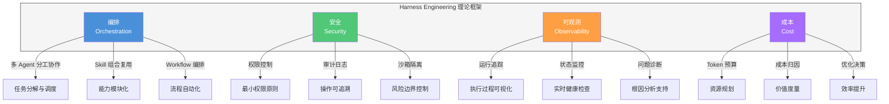
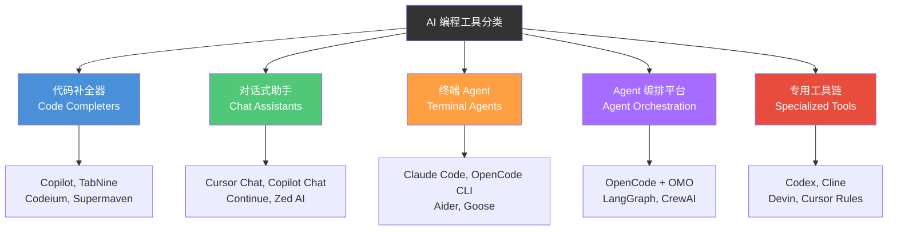
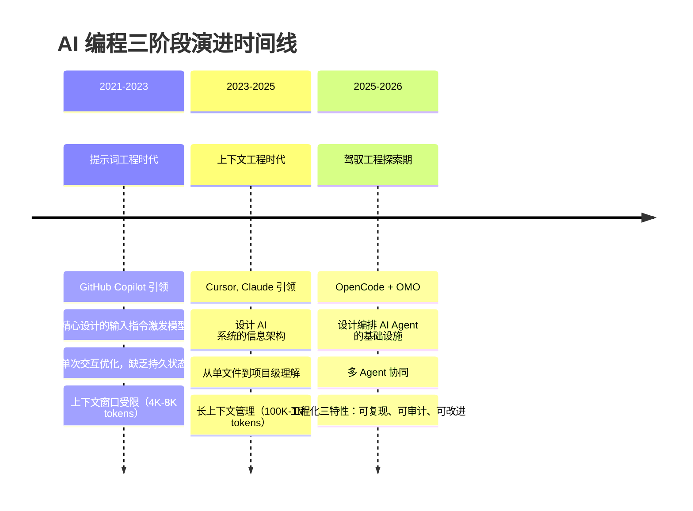

# Harness Engineering 理论框架

> 从"驾驭 AI 写代码"到"设计 AI 工程体系"——建立 Harness Engineering 的系统理论模型，为全书实践提供统一的思维框架。

## 文章概述

上一篇文章 [什么是 Harness Engineer](what-is-harness-engineer.md) 讲了"谁是驾驭工程师"，这篇文章回答两个问题：**Harness Engineering 是什么？为什么现在需要它？**——这里讲的是理论基础，后面各章都是这套理论在具体场景中的实践展开。

Harness Engineering 的理论核心包含四个支柱，每个支柱解决一个工程问题：**编排（Orchestration）**——多 Agent 如何分工协作、**安全（Security）**——Agent 权限控制与审计、**可观测（Observability）**——运行过程可追踪可理解、**成本（Cost）**——Token 和 API 调用的精细化管理。这四个支柱缺一不可，合起来回答一个核心问题：**怎么让 AI 编程可靠、可控、可持续？**

本文将介绍 Martin Fowler 的 **5 大分类法**，将 AI 编程工具分为五个类别，为全书讨论提供统一的分类框架。同时通过 2024 到 2026 的演进时间线，解释"为什么是现在"需要 Harness Engineering——从对话编程到 Agent 自主执行，再到 Agent 编排体系，每一次跃迁都对工程化提出了更高要求。

## AI 编程的核心张力

### 一个每天都在发生的困境

先回想一个你可能亲身经历过的场景：

你用 AI 写完了一段核心逻辑。3 分钟不到，代码跑起来了，测试通过了，效果不错。但当你准备把它合入主分支时，你犹豫了——这段代码到底靠不靠谱？它有没有隐性的边界问题？会不会在生产环境里做出什么意料之外的事情？于是你花 30 分钟逐行审查，改了几处逻辑，才敢点下"合并"。

这个场景揭示了 AI 编程中最根本的一个困境：**AI 做事越来越快，但我们验证和信任它的能力，没有跟上这个速度。**

这不是某个工具的问题，也不是某个人的问题。它是整个 AI 编程领域正在经历的结构性张力。而且随着 AI 能力的提升，这个张力只会越来越明显：

- AI 写代码的速度在提升，但安全风险也在放大。一个能 3 分钟完成编码任务的 Agent，同样能在 3 秒钟内执行一个危险命令。速度让效率更高，也让失控的破坏力更大。
- Agent 能做的事情越来越多——多文件重构、跨服务调试、甚至生产环境操作——但开发者对输出结果的信任并没有同步提升。不是因为开发者"保守"，而是缺少系统化的验证手段来支撑这份信任。
- 当单 Agent 变成多 Agent 协作，效率确实上去了（SWE-bench 数据显示多 Agent 比单 Agent 完成率提升 40%），但管理复杂度涨得更快——协调开销、状态同步、安全边界，每一个维度都在非线性增长。

### 四个你绕不开的权衡

把这些观察放到日常的开发场景里，你会发现它们最终归结为四个反复出现的权衡：

1. **效率 vs 安全**——AI 帮你加速，但误操作的代价谁来兜底？
2. **能力 vs 信任**——AI 能做越来越多的事，但你凭什么相信它做对了？
3. **规模 vs 管理**——多 Agent 协作让产出倍增，但协调的复杂度谁在控制？
4. **速度 vs 成本**——迭代越来越快，但 Token 消耗也在飞涨，怎么让速度可持续？

这四个权衡不是彼此孤立的。它们有一个共同的根：**AI 正在以远超预期的速度扩展能力边界，而我们用来保障"它做得对、做得稳、做得省"的工程体系，还没有跟上。**

### 四个支柱如何回应这四个权衡

Harness Engineering 的四个核心支柱——安全、可观测、编排、成本——恰好分别回应了这四个权衡。这不是巧合，而是有意为之：它们正是为了解决同一个根源问题而设计的四套工程手段。

- **安全（Security）**回应"效率 vs 安全"——通过权限最小化、沙箱隔离、审计追踪，让效率的提升不以牺牲安全为代价。
- **可观测（Observability）**回应"能力 vs 信任"——通过过程透明、结果可验证、根因可追溯，让信任建立在可观测的事实上，而不是盲目的信心。
- **编排（Orchestration）**回应"规模 vs 管理"——通过任务分解、Agent 协作、Workflow 自动化，让规模扩大不意味着管理失控。
- **成本（Cost）**回应"速度 vs 成本"——通过 Token 预算、成本归因、效率优化，让速度的提升在经济上可持续。

这四套手段合在一起，回答了同一个问题：**如何在享受 AI 能力增长的同时，也建立起与之匹配的保障体系？**

这不是一个能一劳永逸解决的问题。AI 的能力会继续增长，新的张力会不断出现。但 Harness Engineering 提供的不是一个固定的答案，而是一套可以持续迭代的工程框架。这恰恰是"驾驭"（Harness）的本意——不是限制 AI，而是建立一套让 AI 可以被信任、被管理、被持续运用的系统。

## Harness Engineering 定义深化

### 从"驾驭 AI 写代码"到"设计 AI 工程体系"

明确了"谁是 Harness Engineer"之后，这一节深入讲"什么是 Harness Engineering"——它不是什么理论空谈，而是一套可操作的工程方法论。

Harness Engineering 不仅仅是"让 AI 帮你写代码"，而是一套完整的**工程化体系**——它关注如何将 AI 编程能力转化为可重复、可审计、可改进的工程化流程。这个定义的转变至关重要：

| 维度 | 传统 AI 编程思维 | Harness Engineering 思维 |
|------|-----------------|-------------------------|
| 核心问题 | "如何让 AI 写出好代码" | "如何设计 AI 工程体系" |
| 关注焦点 | 单次输出质量 | 系统化交付能力 |
| 可复现性 | 依赖运气和提示词技巧 | 标准化流程保证一致性 |
| 知识沉淀 | 在个人脑海中 | 在 Skill 和 Workflow 中 |
| 团队协作 | 难以共享和传承 | 可复制、可演进的组织能力 |

### 四个核心支柱

Harness Engineering 的理论框架建立在四个核心支柱之上，它们把 AI 编程从"碰运气"变成"有章法"：

### 原则与支柱的映射关系

三大原则（可复现、可审计、可改进）与四个支柱之间存在紧密的映射关系。原则是"为什么"，支柱是"怎么做"——原则定义了工程化目标，支柱提供了实现路径。

| 原则 | 对应支柱 | 说明 |
|------|---------|------|
| 可复现 | 编排 + 成本 | 标准化流程确保可复现执行，成本控制使复现可持续 |
| 可审计 | 安全 + 可观测 | 安全基线提供审计依据，可观测性记录执行轨迹 |
| 可改进 | 编排 + 可观测 + 成本 | 编排数据驱动迭代，可观测性识别瓶颈，成本指导优化方向 |

**支柱一：编排（Orchestration）**

编排解决的核心问题是：**多个 Agent 如何分工协作完成复杂任务？**

在单 Agent 时代，一个 AI 助手需要同时处理需求理解、代码生成、测试验证等所有工作。这种"全能型"设计带来了两个问题：一是能力边界模糊，什么都能做但什么都不精；二是上下文膨胀，所有信息挤在一个对话窗口里，效率和成本都不理想。

编排思维引入了"分工"的概念：
- **任务分解**：将复杂需求拆解为可独立执行的子任务
- **角色分工**：不同 Agent 承担不同职责（规划、执行、审查）
- **流程编排**：定义子任务之间的依赖关系和执行顺序

这就像从"一人全包"进化到"专业分工"，每个环节专业化，整体效率和质量大幅提升。

**支柱二：安全（Security）**

安全解决的核心问题是：**如何让 Agent 在可控边界内自主执行？**

Agent 的"自主性"是一把双刃剑——它能让 AI 独立完成任务，但也可能带来不可预期的行为。Harness Engineering 的安全支柱包含三个层次：

- **权限控制**：Agent 只能访问完成任务所需的最小权限集
- **审计日志**：每一步操作都有记录，支持事后审查和回放
- **沙箱隔离**：敏感操作在隔离环境中执行，风险可控

安全不是限制 Agent 的能力，而是让 Agent 的能力在可信边界内发挥。这就像给赛车装上刹车系统——不是为了让它跑得慢，而是为了让它敢跑得快。

**支柱三：可观测（Observability）**

可观测解决的核心问题是：**Agent 在做什么？做得怎么样？出了问题怎么办？**

AI 编程的"黑盒"特性是工程化的最大障碍。当 Agent 执行一个复杂任务时，开发者需要知道：
- 当前执行到哪个步骤？
- 每个步骤的输入输出是什么？
- 如果失败，失败的原因是什么？

可观测性通过**运行追踪**、**状态监控**、**问题诊断**三个层次，让 AI 编程从"盲盒"变成"透明盒"。这对于企业级落地尤为重要——没有可观测性，就没有可控性。

**支柱四：成本（Cost）**

成本解决的核心问题是：**如何让 AI 编程在经济效益上可持续？**

Token 成本是 AI 编程绕不开的现实问题。一个复杂任务可能消耗数万甚至数十万 Token，如果缺乏管理，成本会迅速失控。成本支柱包含：

- **Token 预算**：为任务设定资源上限，避免无意识超支
- **成本归因**：追踪每个任务、每个 Agent 的 Token 消耗
- **优化决策**：基于成本数据做出架构和流程优化决策

成本管理不是"省钱"，而是"让每一分钱花得明白"。当 AI 编程从个人探索走向团队协作、从实验项目走向生产系统时，成本支柱的重要性会指数级上升。

## Martin Fowler 5 大分类法

### 分类法的来源与意义

Martin Fowler 在 2024 年的博客文章中，系统性地将 AI 编程工具分为五个类别。这个分类法的价值在于：它提供了**统一的分类标准**，让我们能说清楚不同工具的能力边界和适用场景。

在此之前，AI 编程工具的讨论常常陷入"苹果和橘子"式的无效比较——有人把 Copilot 和 Claude Code 放在一起对比，却忽略了它们属于完全不同的类别。Fowler 的分类法帮助我们建立了一个共识框架：**不同类别的工具解决不同类别的问题，不存在"谁更好"，只有"谁更适合"**。

### 五大分类详解

**类别一：代码补全器（Code Completers）**

这是 AI 编程工具的起点。代码补全器的工作方式是：**基于光标位置和上下文，预测并补全开发者即将输入的代码**。

| 特征 | 说明 |
|------|------|
| 交互模式 | 被动响应——开发者输入触发，AI 补全 |
| 能力边界 | 单行或小块代码补全，不理解整体任务 |
| 典型工具 | GitHub Copilot、TabNine、Codeium、Supermaven |
| 适用场景 | 日常编码的效率提升，减少重复输入 |

代码补全器的优势是**低侵入性**——它不改变开发者的工作流程，只是让打字更快。但它的局限也很明显：无法理解复杂意图，无法执行多步操作，无法处理跨文件的重构任务。

**类别二：对话式助手（Chat Assistants）**

对话式助手在补全器的基础上引入了**自然语言交互**。开发者可以用自然语言描述需求，AI 通过对话理解意图并给出建议。

| 特征 | 说明 |
|------|------|
| 交互模式 | 主动对话——开发者提问，AI 回答 |
| 能力边界 | 可以讨论代码、解释概念、给出建议，但执行仍需人工 |
| 典型工具 | Cursor Chat、Copilot Chat、Continue、Zed AI |
| 适用场景 | 代码理解、问题诊断、方案探讨 |

对话式助手解决了"沟通"问题，但带来了新的挑战：**对话上下文的膨胀**。长对话会消耗大量 Token，且跨 Session 的上下文难以保持。这些问题在 [什么是 Harness Engineer](what-is-harness-engineer.md) 中有详细讨论。

**类别三：终端 Agent（Terminal Agents）**

终端 Agent 是 AI 编程工具的重大跃迁——从"建议者"变成"执行者"。Agent 可以**自主执行多步操作**，包括读写文件、运行命令、调用工具等。

| 特征 | 说明 |
|------|------|
| 交互模式 | 任务委托——开发者描述任务，Agent 自主执行 |
| 能力边界 | 可以独立完成端到端任务，如实现功能、修复 Bug |
| 典型工具 | Claude Code、OpenCode CLI、Aider、Goose |
| 适用场景 | 功能开发、Bug 修复、代码重构 |

终端 Agent 的出现标志着 AI 编程进入"工程化"阶段——开发者不再需要一步步指导 AI，而是可以委托完整的任务。但单 Agent 的能力仍然有限，复杂任务需要多个 Agent 协作。

**类别四：Agent 编排平台（Agent Orchestration）**

Agent 编排平台解决的是**多 Agent 协作**问题。当任务复杂到单个 Agent 无法有效处理时，需要将任务分解、分配给不同角色的 Agent、协调执行过程。

| 特征 | 说明 |
|------|------|
| 交互模式 | 流程编排——开发者设计工作流，多 Agent 协作执行 |
| 能力边界 | 可以处理复杂的多步骤、多角色任务 |
| 典型工具 | OpenCode + OMO、LangGraph、CrewAI |
| 适用场景 | 企业级项目、复杂系统开发、团队协作 |

Agent 编排平台是 Harness Engineering 的核心载体。本书的实践部分主要围绕这一类别展开。

**类别五：专用工具链（Specialized Tools）**

专用工具链针对特定场景或领域进行优化，通常具有高度定制化的能力。

| 特征 | 说明 |
|------|------|
| 交互模式 | 场景定制——针对特定工作流优化 |
| 能力边界 | 在特定领域表现优异，但通用性受限 |
| 典型工具 | Codex、Cline、Devin、Cursor Rules |
| 适用场景 | 特定领域深度优化、企业定制需求 |

### 分类法的工程实践意义

理解五大分类法的价值在于：**它帮助我们在正确的场景选择正确的工具**。

- 如果你需要日常编码的效率提升，代码补全器足够
- 如果你需要讨论方案和理解代码，对话式助手更合适
- 如果你希望 AI 独立完成任务，终端 Agent 是起点
- 如果你面临复杂的多步骤任务，Agent 编排平台是答案
- 如果你有特定的领域需求，专用工具链可能更高效

更重要的是，这五个类别不是互斥的，而是可以**组合使用**的。一个成熟的 AI 编程工作流可能同时使用补全器（日常编码）、对话助手（方案讨论）和 Agent 编排平台（复杂任务）。

## AI 编程三阶段演进

### 为什么是现在？

Harness Engineering 的理论框架不是凭空产生的，而是 AI 编程工具演进的必然结果。从 2021 年到 2026 年，AI 编程经历了三个阶段的演进：**提示词工程 → 上下文工程 → 驾驭工程**。这个演进框架得到了多位业界权威的理论支撑：

- **Martin Fowler** 在 2024 年提出 Harness Engineering 的三分法，将 AI 编程能力分为"提示、上下文、编排"三个层次
- **Anthropic** 在其 Agent 开发指南中明确定义了 Agent Harness 的概念——"设计和构建编排 AI Agent 的基础设施"
- **Vivek Haldar** 在 Agent Engineering Trilogy 课程中系统阐述了从 Prompt Engineering 到 Context Engineering 再到 Agent Engineering 的能力跃迁

### 阶段 1：提示词工程（2021-2023）

**定义**：通过精心设计的输入指令，最大限度地激发模型的正确能力。

2021 年，GitHub Copilot 的发布标志着 AI 编程进入"提示词工程"时代。这个阶段的核心特征是：**开发者通过自然语言描述需求，AI 基于提示词生成代码建议**。

**核心能力**：
- 零样本/少样本提示（Zero-shot/Few-shot Prompting）
- 思维链（Chain of Thought）
- 角色扮演（Role-playing）
- 提示链（Prompt Chaining）

**代表工具**：GitHub Copilot、Tabnine、CodeWhisperer

**用户角色**：操作员（Operator）—— 需要逐行审查生成代码

**安全关注点**：Prompt Injection 防护

**工程化挑战**：
- **单次交互优化，缺乏持久状态**：每次对话独立，无法继承历史
- **上下文窗口受限**：4K-8K tokens，无法处理大型项目
- **无法处理跨文件依赖**：只能理解当前文件上下文
- **质量不稳定**：依赖提示词技巧，输出质量参差不齐

这些挑战推动着工具向下一个阶段演进——如果单次交互有局限，那就需要持久化的上下文管理。

### 阶段 2：上下文工程（2023-2025）

**定义**：设计和构建 AI 系统的信息架构，决定哪些信息进入上下文窗口以及如何组织。

2023 年，Claude 2 支持 100K tokens 上下文，Cursor 推出项目级代码理解，标志着 AI 编程进入"上下文工程"时代。这个阶段的核心特征是：**从单次交互到持久会话，从文件级到项目级理解**。

**核心能力**：
- 检索增强生成（RAG）
- 长上下文管理（100K-1M tokens）
- 多文件编辑
- 项目级理解

**代表工具**：Cursor、Sourcegraph Cody、Codeium

**用户角色**：协作者（Collaborator）—— 描述需求，审查结果

**安全关注点**：敏感数据过滤、访问控制

**突破**：
- 从"单次交互"到"持久会话"
- 从"文件级"到"项目级"理解
- 从"被动补全"到"主动编辑"

**工程化挑战**：
- **仍需人工干预调试**：复杂问题需要开发者介入
- **缺乏独立执行环境**：AI 无法自主运行和验证
- **工作流无法固化复用**：每次重复相似的对话过程
- **安全边界模糊**：AI 可以访问哪些代码和数据？

这些挑战指向了一个共同的方向：**需要工程化的框架来约束和管理 Agent 的行为**。Harness Engineering 的四个支柱（编排、安全、可观测、成本）正是对这些挑战的系统性回应。

### 阶段 3：驾驭工程探索期（2025-2026）

**定义**：设计、构建和维护编排 AI Agent 的基础设施，使其在生产环境中可靠运行。

2025 年，Claude Code、OpenCode + OMO 等工具的出现标志着 AI 编程进入"驾驭工程"探索期。Agent 不再只是对话，而是可以**独立执行多步操作**——读写文件、运行命令、调用工具。更重要的是，多个 Agent 可以协同工作，通过 Workflow 编排完成复杂任务。

**核心能力**：
- 多 Agent 编排
- 工作流固化与复用
- 质量门禁与审计日志
- 知识沉淀与持续改进

**三大工程化特性**：
1. **可复现性**（Reproducible）：确定性配置、版本锁定、环境隔离
2. **可审计性**（Auditable）：操作日志、决策追溯、变更审计
3. **可改进性**（Improveable）：效果度量、反馈闭环、A/B 测试

**代表工具**：OpenCode + OMO、Claude Code、Windsurf、Cursor Agent Mode

**用户角色**：观察者/审批者（Observer/Approver）—— 设定目标，验收结果

**安全关注点**：安全审计、沙箱隔离、合规检查

**突破**：
- 从"辅助工具"到"自主系统"
- 从"单 Agent"到"多 Agent 协作"
- 从"不可控"到"工程化"

**当前状态**：这一阶段仍处于**探索期**，工具和最佳实践正在快速演进。企业落地需要谨慎评估风险和收益。

### 能力叠加的演进模式

需要特别说明的是：**实际演进是能力叠加，而非阶段替代**。

2026 年的企业可能同时存在三个阶段的能力：
- **阶段 1 能力**：日常编码使用 Copilot 补全
- **阶段 2 能力**：复杂功能使用 Cursor 项目级编辑
- **阶段 3 能力**：企业级工作流使用 OpenCode + OMO 编排

这种叠加模式意味着：
- 不同场景选择不同阶段的工具
- 团队成员可以根据能力水平使用不同阶段的工具
- 企业可以渐进式地引入更高阶段的能力

### 读者角色与三阶段对应关系

不同读者角色在三阶段演进中的起点和路径不同：

| 读者角色 | 建议起始阶段 | 说明 |
|---------|-------------|------|
| 入门开发者 | 阶段 1（简化术语） | 聚焦"如何与 AI 对话"，而非"提示词工程"理论 |
| 效率开发者 | 阶段 2 | 已有基础，直接学习上下文管理 |
| 技术负责人 | 阶段 2 + 阶段 3 | 关注团队级编排和质量门禁 |
| Skill 作者 | 阶段 3 | 直接学习 Agent 编排和工作流固化 |
| 工程经理 | 全局视角 | 关注三阶段的 ROI 演进 |
| 安全工程师 | 全局视角 | 关注安全治理在三阶段中的演进 |

这是 Harness Engineering 理论框架走向成熟的阶段——从概念到实践，从个人工具到团队能力，从实验探索到生产落地。

## 理论框架在全书中的位置

### 从理论到实践的映射

本文建立的理论框架贯穿全书，后续章节都是对这一框架的具体展开：

| 理论支柱 | 对应章节 | 核心内容 |
|----------|----------|----------|
| 编排（Orchestration） | 核心概念、工作流实战 | Agent/Skill/Workflow 三层抽象、Ultrawork 模式 |
| 安全（Security） | 高级话题 | 沙箱系统、Hook 机制、CLAUDE.md 约定 |
| 可观测（Observability） | 高级话题 | 运行追踪、日志系统、监控指标 |
| 成本（Cost） | 高级话题 | Token 预算、提示词缓存、上下文压缩 |

### 三层抽象模型预告

Harness Engineering 的核心架构模式是 **Agent-Skill-Workflow 三层抽象**，这将在 [核心概念](../02-core-concepts/) 中详细展开。这里先给出一个概念预览：

- **Agent（执行单元）**：承担特定角色的智能体，如规划 Agent、执行 Agent、审查 Agent
- **Skill（能力模块）**：可复用的能力单元，封装特定领域的知识和技能
- **Workflow（协作流程）**：定义多个 Agent 如何协作完成复杂任务

三层抽象的关系是：Workflow 编排多个 Agent，每个 Agent 调用多个 Skill，Skill 通过 MCP 协议连接外部工具和服务。这个模型是 Harness Engineering 从理论走向实践的关键桥梁。

### 企业级落地价值

Harness Engineering 的理论框架在企业场景中具有明确的落地价值：

**可重复的交付质量**
- 从依赖个人经验到标准化流程
- 同样的需求产生同样质量的交付物
- 新成员可以快速复用已有的工作流

**可追溯的安全合规**
- 每一步操作都有审计日志
- 支持合规审查和安全审计
- 敏感操作在沙箱中隔离执行

**可度量的效率改进**
- 从"感觉快了"到数据驱动
- Token 消耗、任务耗时、成功率可量化
- 基于数据持续优化工作流

这些价值将在 [案例研究](../07-case-studies/) 中通过具体案例展示。

## 小结

Harness Engineering 的理论框架由四个支柱支撑：**编排**解决多 Agent 协作问题，**安全**解决权限和审计问题，**可观测**解决过程透明问题，**成本**解决经济效益问题。四个支柱缺一不可，共同构成 AI 编程工程化的完整理论基础。

Martin Fowler 的 5 大分类法为我们提供了统一的讨论坐标系，帮助我们在正确的场景选择正确的工具。从代码补全器到 Agent 编排平台，每个类别都有其独特的价值定位。

2024 到 2026 的演进时间线解释了"为什么是现在"——对话编程的瓶颈催生了 Agent 自主执行，Agent 自主执行的挑战催生了 Agent 编排体系，每一次跃迁都对工程化提出了更高要求。

理解这个理论框架，是阅读后续章节的前提。接下来，我们将在 [AI 编程工具生态对比](ecosystem-comparison.md) 中深入分析各类工具的具体能力，为实践选型提供参考。

---

## 关联章节

- ← 承接 [什么是 Harness Engineer](what-is-harness-engineer.md)（从概念到理论的深化）
- → [AI 编程工具生态对比](ecosystem-comparison.md)（5 大分类法为工具对比提供理论框架）
- → [核心概念](../02-core-concepts/)（三层抽象模型的详细展开）
- → [工作流实战](../04-workflows/)（编排支柱的实践落地）
- → [高级话题](../06-advanced/)（安全、可观测、成本支柱的深入探讨）
