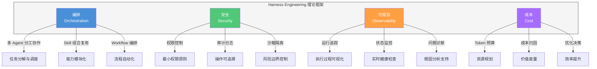
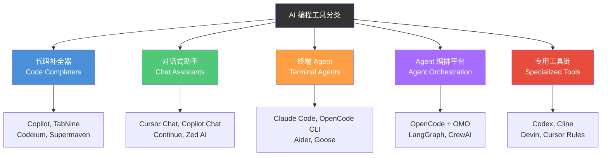
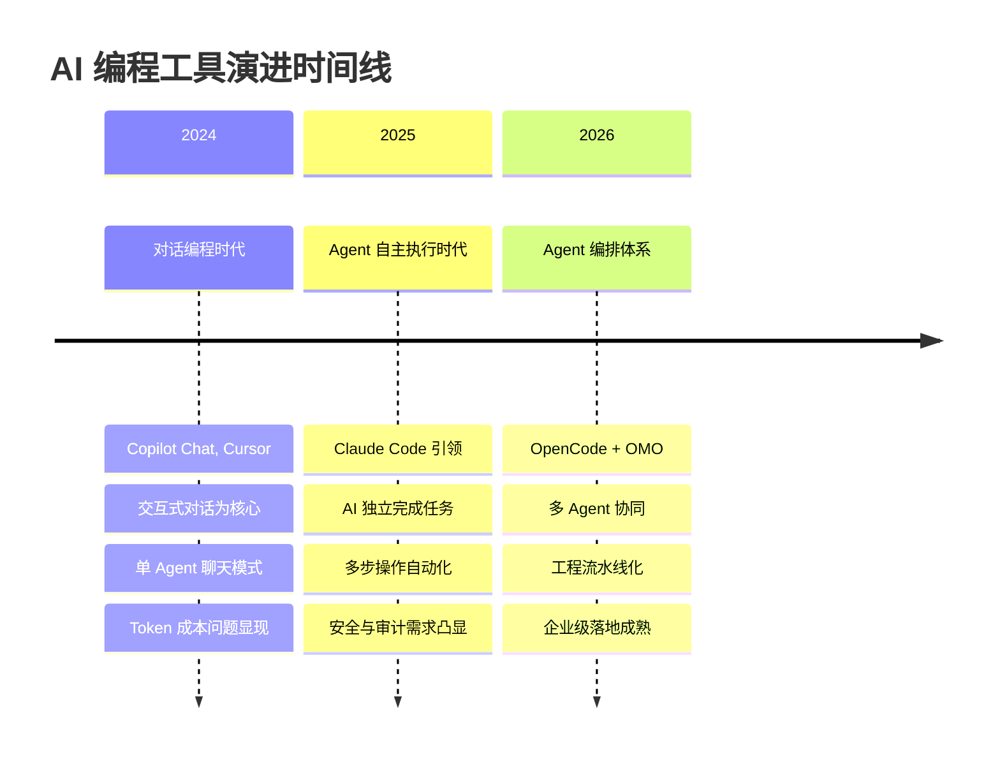
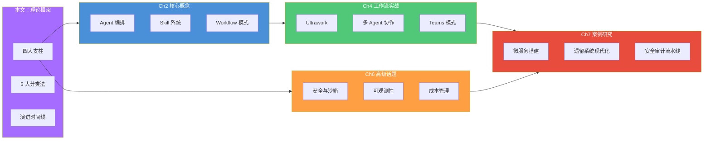

# Harness Engineering 理论框架

> 从"驾驭 AI 写代码"到"设计 AI 工程流水线"——建立 Harness Engineering 的系统理论模型，为全书实践提供统一的思维框架。

## 文章概述

如果说 [什么是 Harness Engineer](what-is-harness-engineer.md) 回答的是"谁"的问题，那么本文回答的是"什么"和"为什么"——Harness Engineering 的系统理论框架是什么，它是如何被提出和定义的，以及为什么在今天这个时间节点变得至关重要。本文提供了全书所有实践章节的理论基础。

Harness Engineering 的理论核心包含四个支柱：**编排（Orchestration）**——多 Agent 如何分工协作、**安全（Security）**——Agent 权限控制与审计、**可观测（Observability）**——运行过程可追踪可理解、**成本（Cost）**——Token 和 API 调用的精细化管理。这四个支柱共同构成了 Harness Engineering 的完整理论边界。

本文将介绍 Martin Fowler 的 **5 大分类法**，将 AI 编程工具分为五个类别，帮助读者建立统一的讨论坐标系。同时通过 2024 到 2026 的演进时间线，解释"为什么是现在"需要 Harness Engineering——从对话编程到 Agent 自主执行，再到 Agent 编排体系，每一次跃迁都对工程化提出了更高要求。

## Harness Engineering 定义深化

### 从"驾驭 AI 写代码"到"设计 AI 工程流水线"

在 [什么是 Harness Engineer](what-is-harness-engineer.md) 中，我们定义了 Harness Engineer 的角色定位。现在让我们深入探讨 Harness Engineering 作为一门工程方法论的本质。

Harness Engineering 不仅仅是"让 AI 帮你写代码"，而是一套完整的**工程化体系**——它关注如何将 AI 编程能力转化为可重复、可审计、可改进的工程流水线。这个定义的转变至关重要：

| 维度 | 传统 AI 编程思维 | Harness Engineering 思维 |
|------|-----------------|-------------------------|
| 核心问题 | "如何让 AI 写出好代码" | "如何设计 AI 工程流水线" |
| 关注焦点 | 单次输出质量 | 系统化交付能力 |
| 可复现性 | 依赖运气和提示词技巧 | 标准化流程保证一致性 |
| 知识沉淀 | 在个人脑海中 | 在 Skill 和 Workflow 中 |
| 团队协作 | 难以共享和传承 | 可复制、可演进的组织能力 |

### 四个核心支柱

Harness Engineering 的理论框架建立在四个核心支柱之上，它们共同支撑起 AI 编程从"手工作坊"到"工业化流水线"的跨越：

**支柱一：编排（Orchestration）**

编排解决的核心问题是：**多个 Agent 如何分工协作完成复杂任务？**

在单 Agent 时代，一个 AI 助手需要同时处理需求理解、代码生成、测试验证等所有工作。这种"全能型"设计带来了两个问题：一是能力边界模糊，什么都能做但什么都不精；二是上下文膨胀，所有信息挤在一个对话窗口里，效率和成本都不理想。

编排思维引入了"分工"的概念：
- **任务分解**：将复杂需求拆解为可独立执行的子任务
- **角色分工**：不同 Agent 承担不同职责（规划、执行、审查）
- **流程编排**：定义子任务之间的依赖关系和执行顺序

这就像从"一人包打天下"进化到"流水线作业"，每个环节专业化，整体效率和质量大幅提升。

**支柱二：安全（Security）**

安全解决的核心问题是：**如何让 Agent 在可控边界内自主执行？**

Agent 的"自主性"是一把双刃剑——它能让 AI 独立完成任务，但也可能带来不可预期的行为。Harness Engineering 的安全支柱包含三个层次：

- **权限控制**：Agent 只能访问完成任务所需的最小权限集
- **审计日志**：每一步操作都有记录，支持事后审查和回放
- **沙箱隔离**：敏感操作在隔离环境中执行，风险可控

安全不是限制 Agent 的能力，而是让 Agent 的能力在可信边界内发挥。这就像给赛车装上刹车系统——不是为了让它跑得慢，而是为了让它敢跑得快。

**支柱三：可观测（Observability）**

可观测解决的核心问题是：**Agent 在做什么？做得怎么样？出了问题怎么办？**

AI 编程的"黑盒"特性是工程化的最大障碍。当 Agent 执行一个复杂任务时，开发者需要知道：
- 当前执行到哪个步骤？
- 每个步骤的输入输出是什么？
- 如果失败，失败的原因是什么？

可观测性通过**运行追踪**、**状态监控**、**问题诊断**三个层次，让 AI 编程从"盲盒"变成"透明盒"。这对于企业级落地尤为重要——没有可观测性，就没有可控性。

**支柱四：成本（Cost）**

成本解决的核心问题是：**如何让 AI 编程在经济效益上可持续？**

Token 成本是 AI 编程绕不开的现实问题。一个复杂任务可能消耗数万甚至数十万 Token，如果缺乏管理，成本会迅速失控。成本支柱包含：

- **Token 预算**：为任务设定资源上限，避免无意识超支
- **成本归因**：追踪每个任务、每个 Agent 的 Token 消耗
- **优化决策**：基于成本数据做出架构和流程优化决策

成本管理不是"省钱"，而是"让每一分钱花得明白"。当 AI 编程从个人探索走向团队协作、从实验项目走向生产系统时，成本支柱的重要性会指数级上升。

## Martin Fowler 5 大分类法

### 分类法的来源与意义

Martin Fowler 在 2024 年的博客文章中，系统性地将 AI 编程工具分为五个类别。这个分类法的价值在于：它提供了一个**统一的讨论坐标系**，让我们能够准确描述不同工具的能力边界和适用场景。

在此之前，AI 编程工具的讨论常常陷入"苹果和橘子"式的无效比较——有人把 Copilot 和 Claude Code 放在一起对比，却忽略了它们属于完全不同的类别。Fowler 的分类法帮助我们建立了一个共识框架：**不同类别的工具解决不同类别的问题，不存在"谁更好"，只有"谁更适合"**。

### 五大分类详解

**类别一：代码补全器（Code Completers）**

这是 AI 编程工具的起点。代码补全器的工作方式是：**基于光标位置和上下文，预测并补全开发者即将输入的代码**。

| 特征 | 说明 |
|------|------|
| 交互模式 | 被动响应——开发者输入触发，AI 补全 |
| 能力边界 | 单行或小块代码补全，不理解整体任务 |
| 典型工具 | GitHub Copilot、TabNine、Codeium、Supermaven |
| 适用场景 | 日常编码的效率提升，减少重复输入 |

代码补全器的优势是**低侵入性**——它不改变开发者的工作流程，只是让打字更快。但它的局限也很明显：无法理解复杂意图，无法执行多步操作，无法处理跨文件的重构任务。

**类别二：对话式助手（Chat Assistants）**

对话式助手在补全器的基础上引入了**自然语言交互**。开发者可以用自然语言描述需求，AI 通过对话理解意图并给出建议。

| 特征 | 说明 |
|------|------|
| 交互模式 | 主动对话——开发者提问，AI 回答 |
| 能力边界 | 可以讨论代码、解释概念、给出建议，但执行仍需人工 |
| 典型工具 | Cursor Chat、Copilot Chat、Continue、Zed AI |
| 适用场景 | 代码理解、问题诊断、方案探讨 |

对话式助手解决了"沟通"问题，但带来了新的挑战：**对话上下文的膨胀**。长对话会消耗大量 Token，且跨 Session 的上下文难以保持。这些问题在 [什么是 Harness Engineer](what-is-harness-engineer.md) 中有详细讨论。

**类别三：终端 Agent（Terminal Agents）**

终端 Agent 是 AI 编程工具的重大跃迁——从"建议者"变成"执行者"。Agent 可以**自主执行多步操作**，包括读写文件、运行命令、调用工具等。

| 特征 | 说明 |
|------|------|
| 交互模式 | 任务委托——开发者描述任务，Agent 自主执行 |
| 能力边界 | 可以独立完成端到端任务，如实现功能、修复 Bug |
| 典型工具 | Claude Code、OpenCode CLI、Aider、Goose |
| 适用场景 | 功能开发、Bug 修复、代码重构 |

终端 Agent 的出现标志着 AI 编程进入"工程化"阶段——开发者不再需要一步步指导 AI，而是可以委托完整的任务。但单 Agent 的能力仍然有限，复杂任务需要多个 Agent 协作。

**类别四：Agent 编排平台（Agent Orchestration）**

Agent 编排平台解决的是**多 Agent 协作**问题。当任务复杂到单个 Agent 无法有效处理时，需要将任务分解、分配给不同角色的 Agent、协调执行过程。

| 特征 | 说明 |
|------|------|
| 交互模式 | 流程编排——开发者设计工作流，多 Agent 协作执行 |
| 能力边界 | 可以处理复杂的多步骤、多角色任务 |
| 典型工具 | OpenCode + OMO、LangGraph、CrewAI |
| 适用场景 | 企业级项目、复杂系统开发、团队协作 |

Agent 编排平台是 Harness Engineering 的核心载体。本书的实践部分（Ch2-Ch6）主要围绕这一类别展开。

**类别五：专用工具链（Specialized Tools）**

专用工具链针对特定场景或领域进行优化，通常具有高度定制化的能力。

| 特征 | 说明 |
|------|------|
| 交互模式 | 场景定制——针对特定工作流优化 |
| 能力边界 | 在特定领域表现优异，但通用性受限 |
| 典型工具 | Codex、Cline、Devin、Cursor Rules |
| 适用场景 | 特定领域深度优化、企业定制需求 |

### 分类法的工程实践意义

理解五大分类法的价值在于：**它帮助我们在正确的场景选择正确的工具**。

- 如果你需要日常编码的效率提升，代码补全器足够
- 如果你需要讨论方案和理解代码，对话式助手更合适
- 如果你希望 AI 独立完成任务，终端 Agent 是起点
- 如果你面临复杂的多步骤任务，Agent 编排平台是答案
- 如果你有特定的领域需求，专用工具链可能更高效

更重要的是，这五个类别不是互斥的，而是可以**组合使用**的。一个成熟的 AI 编程工作流可能同时使用补全器（日常编码）、对话助手（方案讨论）和 Agent 编排平台（复杂任务）。

## 演进时间线 2024→2026

### 为什么是现在？

Harness Engineering 的理论框架不是凭空产生的，而是 AI 编程工具演进的必然结果。通过 2024 到 2026 的时间线，我们可以清晰地看到"工程化"需求是如何一步步浮现的。

### 2024：对话编程时代

2024 年是 AI 编程工具"对话化"的一年。GitHub Copilot Chat 和 Cursor 代表了这个阶段的主流形态：**以交互式对话为核心交互模式**。

**核心特征**：
- 开发者通过自然语言描述需求
- AI 通过对话理解意图并给出代码建议
- 单 Agent 聊天模式，一个对话窗口处理所有问题

**工程化挑战**：
- **Token 成本失控**：长对话上下文持续膨胀，成本难以预测
- **上下文丢失**：跨 Session 无法继承历史，每次重新开始
- **质量不稳定**：依赖提示词技巧，输出质量参差不齐

这些挑战推动着工具向下一个阶段演进——如果对话模式本身有局限，那就需要一种新的模式。

### 2025：Agent 自主执行时代

2025 年，Claude Code 的出现标志着 AI 编程进入"Agent 自主执行"时代。Agent 不再只是对话，而是可以**独立执行多步操作**——读写文件、运行命令、调用工具。

**核心特征**：
- 开发者委托任务，Agent 自主规划和执行
- 多步操作自动化，无需人工干预每一步
- 工具调用能力扩展了 Agent 的行动边界

**工程化挑战**：
- **安全边界**：Agent 能做什么？应该允许它做什么？
- **审计需求**：Agent 执行了哪些操作？如何追溯？
- **成本管理**：一个任务消耗多少 Token？如何优化？

这些挑战指向了一个共同的方向：**需要工程化的框架来约束和管理 Agent 的行为**。Harness Engineering 的四个支柱（编排、安全、可观测、成本）正是对这些挑战的系统性回应。

### 2026：Agent 编排体系

2026 年，OpenCode + OMO 构建了完整的 Agent 编排体系。多个 Agent 可以协同工作，每个 Agent 承担特定角色，通过 Workflow 编排完成复杂任务。

**核心特征**：
- 多 Agent 协同：规划 Agent、执行 Agent、审查 Agent 分工协作
- Workflow 编排：定义任务流程、依赖关系、异常处理
- 企业级能力：安全审计、成本管控、知识沉淀

**工程化成熟**：
- **可复现**：同样的输入产生同样的输出，消除随机性
- **可审计**：每一步操作有记录，支持合规审查
- **可改进**：从每次运行中学习，持续优化流水线

这是 Harness Engineering 理论框架走向成熟的阶段——从概念到实践，从个人工具到团队能力，从实验探索到生产落地。

## 理论框架在全书中的位置

### 从理论到实践的映射

本文建立的理论框架是全书的"思想坐标"，后续章节都是对这一框架的具体展开：

| 理论支柱 | 对应章节 | 核心内容 |
|----------|----------|----------|
| 编排（Orchestration） | Ch2 核心概念、Ch4 工作流实战 | Agent/Skill/Workflow 三层抽象、Ultrawork 模式 |
| 安全（Security） | Ch6 高级话题 | 沙箱系统、Hook 机制、CLAUDE.md 约定 |
| 可观测（Observability） | Ch6 高级话题 | 运行追踪、日志系统、监控指标 |
| 成本（Cost） | Ch6 高级话题 | Token 预算、提示词缓存、上下文压缩 |

### 三层抽象模型预告

Harness Engineering 的核心架构模式是 **Agent-Skill-Workflow 三层抽象**，这将在 [Ch2 核心概念](../02-core-concepts/) 中详细展开。这里先给出一个概念预览：

- **Agent（执行单元）**：承担特定角色的智能体，如规划 Agent、执行 Agent、审查 Agent
- **Skill（能力模块）**：可复用的能力单元，封装特定领域的知识和技能
- **Workflow（协作流程）**：定义多个 Agent 如何协作完成复杂任务

三层抽象的关系是：Workflow 编排多个 Agent，每个 Agent 调用多个 Skill，Skill 通过 MCP 协议连接外部工具和服务。这个模型是 Harness Engineering 从理论走向实践的关键桥梁。

### 企业级落地价值

Harness Engineering 的理论框架在企业场景中具有明确的落地价值：

**可重复的交付质量**
- 从依赖个人经验到标准化流程
- 同样的需求产生同样质量的交付物
- 新成员可以快速复用已有的工作流

**可追溯的安全合规**
- 每一步操作都有审计日志
- 支持合规审查和安全审计
- 敏感操作在沙箱中隔离执行

**可度量的效率改进**
- 从"感觉快了"到数据驱动
- Token 消耗、任务耗时、成功率可量化
- 基于数据持续优化工作流

这些价值将在 [Ch7 案例研究](../07-case-studies/) 中通过具体案例展示。

## 小结

Harness Engineering 的理论框架由四个支柱支撑：**编排**解决多 Agent 协作问题，**安全**解决权限和审计问题，**可观测**解决过程透明问题，**成本**解决经济效益问题。四个支柱缺一不可，共同构成 AI 编程从"手工作坊"到"工业化流水线"的理论基础。

Martin Fowler 的 5 大分类法为我们提供了统一的讨论坐标系，帮助我们在正确的场景选择正确的工具。从代码补全器到 Agent 编排平台，每个类别都有其独特的价值定位。

2024 到 2026 的演进时间线解释了"为什么是现在"——对话编程的瓶颈催生了 Agent 自主执行，Agent 自主执行的挑战催生了 Agent 编排体系，每一次跃迁都对工程化提出了更高要求。

理解这个理论框架，是阅读后续章节的前提。接下来，我们将在 [AI 编程工具生态对比](ecosystem-comparison.md) 中深入分析各类工具的具体能力，为实践选型提供参考。

---

## 关联章节

- ← 承接 [什么是 Harness Engineer](what-is-harness-engineer.md)（从概念到理论的深化）
- → [AI 编程工具生态对比](ecosystem-comparison.md)（5 大分类法为工具对比提供理论框架）
- → [Ch2 核心概念](../02-core-concepts/)（三层抽象模型的详细展开）
- → [Ch4 工作流实战](../04-workflows/)（编排支柱的实践落地）
- → [Ch6 高级话题](../06-advanced/)（安全、可观测、成本支柱的深入探讨）
