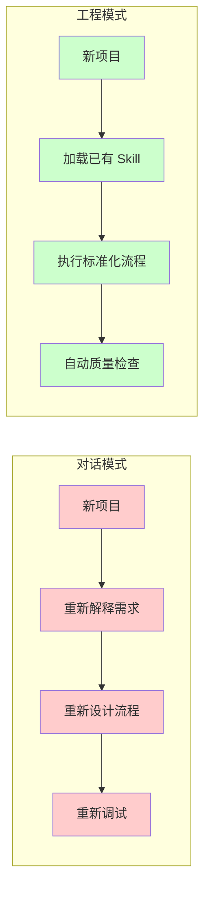
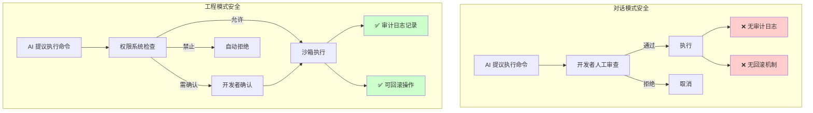
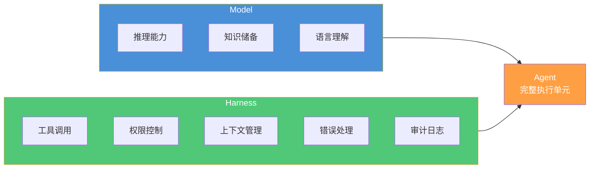
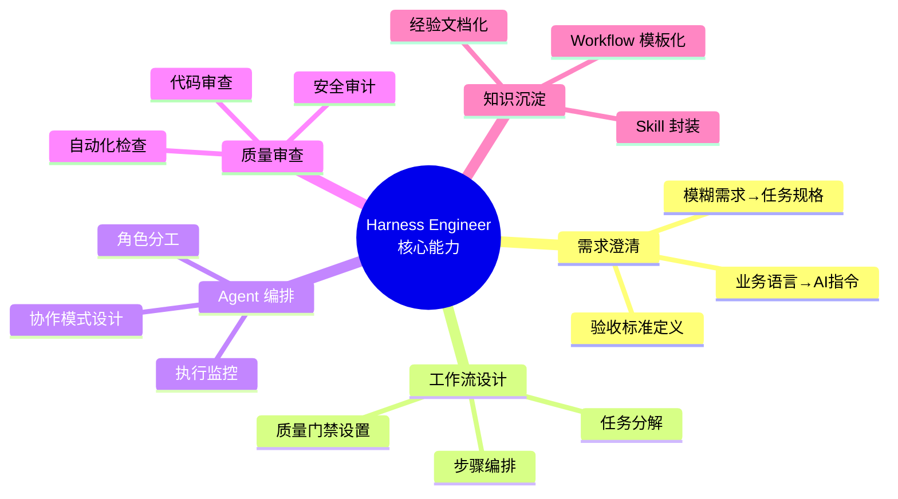
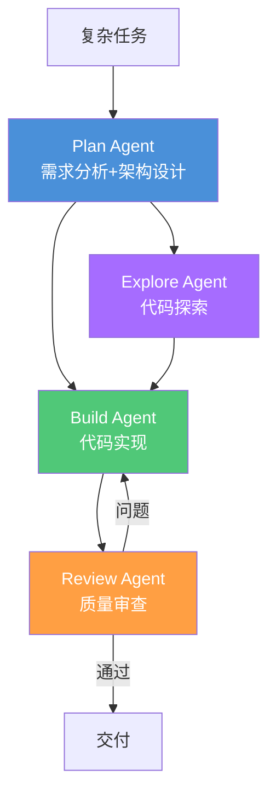
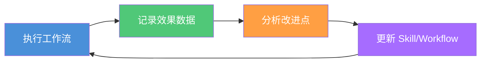

# 什么是 Harness Engineer

> 从"跟 AI 聊天写代码"到"用工程体系做开发"——定义 AI 编程第三时代的核心角色。

## 文章概述

AI 编程工具在短短五年内经历了三次浪潮：从 2021 年的代码补全（GitHub Copilot），到 2024 年的对话编程（Cursor、Claude Code），再到 2026 年的工程化 AI 编程（OpenCode）。每一次浪潮都重新定义了开发者与 AI 的关系。**Harness Engineer（驾驭工程师）** 就是第三时代的核心角色——不是简单地用 AI 写代码，而是设计和管理 AI 工程体系的人。读完本文，你将能够清晰定义 Harness Engineer 的概念、掌握其核心能力，并理解贯穿全书的三大原则——可复现、可审计、可改进。

> **⏱ 时间有限？先读这些：** 为什么"对话"不够？ → Harness Engineer 定义 → Harness Engineering 的三大核心原则

为什么"对话"不够？单纯依赖聊天式交互带来了四个根本性问题：Token 成本失控（长对话上下文膨胀）、跨 Session 上下文丢失（失忆问题）、生成结果质量不可控（缺乏审查机制）、以及优质工作流无法复用（重复劳动）。更危险的是，当 Agent 获得执行终端命令的权限后，一次误操作可能导致数据泄露、系统崩溃甚至安全入侵——这是"安全失控"痛点，也是推动工程化范式转变的关键驱动力。

本文从 AI 编程的发展历程讲起，定义 Harness Engineer 的概念与核心能力，并阐述 Harness Engineering 的三大核心原则——**可复现（Reproducible）**、**可审计（Auditable）**、**可改进（Improveable）**。这三大原则贯穿全书，是衡量一切 AI 工程实践的标准。

## AI 编程的三次浪潮

AI 编程工具在短短五年内经历了三个阶段的演进：从 2021–2022 年的**提示词工程**（Prompt Engineering），到 2023–2024 年的**上下文工程**（Context Engineering），再到 2026 年的**驾驭工程**（Harness Engineering）。每一次跃迁都解决了前一代的核心瓶颈，同时引入了新的工程化挑战。

各阶段的详细分析（代表工具、核心能力、安全关注点、工程化挑战）在 → [Harness Engineering 理论框架](harness-engineering-theory.md) 中有完整阐述。下文直接进入 Harness Engineer 和三大核心原则的定义。

## 为什么"对话"不够？

对话编程模式在短期内极大提升了开发效率，但随着使用深入，四个根本性瓶颈逐渐暴露。

### 瓶颈一：Token 成本失控

长对话的上下文会持续累积，每次提问都要携带完整历史。一个 30 分钟的对话可能消耗 50K+ Token，而大多数历史内容与当前任务已无关。

```
Session 开始：5K Token（项目上下文）
↓ 第 10 轮对话：25K Token（历史累积）
↓ 第 20 轮对话：60K Token（继续膨胀）
↓ 第 30 轮对话：120K Token（成本失控）
```

更糟糕的是，Token 膨胀不仅增加成本，还会降低模型推理质量——过多无关上下文会稀释有效信息。

### 瓶颈二：失忆问题

每次启动新 Session，之前的对话历史、项目理解、代码决策全部丢失。开发者被迫重复"教 AI 认识项目"的过程。

```markdown
Session 1（上午）：
> 用户：这个项目使用 React 18 + TypeScript，状态管理用 Zustand...
> AI：明白了，我会记住这些...

Session 2（下午）：
> 用户：帮我添加一个新功能...
> AI：请问这个项目使用什么技术栈？
> 用户：（再次解释 React + TypeScript + Zustand...）
```

这种"金鱼记忆"让 AI 无法积累项目知识，每次都从零开始。

### 瓶颈三：质量不可控

对话模式下，AI 生成的代码"生成即信任"——没有自动审查机制，质量完全依赖开发者的即时判断。当代码量增大、逻辑变复杂时，潜在问题容易被忽略。

```javascript
// AI 生成的代码，看起来正确
async function fetchUserData(userId) {
    const response = await fetch(`/api/users/${userId}`);
    return response.json();
}

// 潜在问题：
// 1. 无错误处理
// 2. 无超时机制
// 3. 无输入验证
// 4. 无类型安全
```

在对话模式下，这些问题需要开发者主动发现并要求修复。而在工程化模式下，审查 Agent 会自动检查并生成改进建议。

### 瓶颈四：重复劳动

当你在某个项目中摸索出一套高效的工作流（例如"先分析依赖 → 生成测试 → 实现功能 → 运行验证"），这套流程无法被保存和复用。下一个项目，你又要重新"教"AI 这个流程。



### 瓶颈五：安全失控（关键痛点）

当 Agent 获得执行终端命令的权限后，一次误操作可能导致严重后果。这是对话模式最危险的隐患。

**风险场景示例**：

```bash
# 用户意图：删除测试目录
> 用户：删除 test 文件夹

# AI 误判执行
> AI：执行 rm -rf test /
# 注意：多了一个空格，变成删除根目录！

# 或者更隐蔽的风险
> 用户：帮我清理临时文件
> AI：执行 rm -rf /tmp/*
# 可能误删其他程序正在使用的文件
```

**安全失控的具体表现**：

| 风险类型 | 场景描述 | 潜在后果 |
|---------|---------|---------|
| **命令误执行** | AI 理解错误或命令拼接错误 | 数据丢失、系统崩溃 |
| **权限越界** | AI 访问了不该访问的敏感文件 | 数据泄露、合规违规 |
| **代码注入** | AI 生成的代码包含恶意片段 | 安全漏洞、后门植入 |
| **配置篡改** | AI 修改了关键配置文件 | 服务中断、安全策略失效 |
| **凭证泄露** | AI 将密钥写入日志或临时文件 | 凭证暴露、账号被盗 |

在对话模式下，这些风险完全依赖开发者的即时审查——但人总会疲劳、会遗漏。工程化模式通过**权限控制**、**审计日志**、**沙箱隔离**等机制，将安全防护系统化。



## Harness Engineer 定义

### 从 Prompt Engineer 到 Harness Engineer

要理解 Harness Engineer，先看看它和 Prompt Engineer 有什么区别。

**Prompt Engineer** 关注的是"怎么写好的提示词"——这是战术层面的技巧。例如：

```markdown
# Prompt Engineer 的典型工作
优化提示词：
"你是一个专业的 React 开发者，请帮我实现一个带有分页功能的数据表格组件，
要求：1) 使用 TypeScript 2) 支持排序 3) 支持自定义列渲染..."
```

**Harness Engineer** 关注的是"怎么设计好的 AI 工程体系"——这是战略层面的能力。例如：

```yaml:examples/workflows/feature-pipeline.yaml
# Harness Engineer 的典型工作
workflow:
  name: feature-implementation-pipeline
  steps:
    - agent: plan
      skill: requirements-analysis
      output: design-doc
    - agent: build
      skill: tdd-implementation
      input: design-doc
      gates:
        - type: test-coverage
          threshold: 80%
        - type: lint-check
    - agent: review
      skill: code-review
      input: build-output
```

两者的核心差异：

| 维度 | Prompt Engineer | Harness Engineer |
|------|----------------|------------------|
| **关注点** | 单次交互质量 | 工作流整体效能 |
| **时间尺度** | 即时响应 | 长期可维护 |
| **复用性** | 提示词难以复用 | Workflow 可模板化 |
| **质量保障** | 依赖人工判断 | 自动化门禁 |
| **能力沉淀** | 个人经验 | 组织知识库 |

### Mitchell Hashimoto 的原始定义

**Mitchell Hashimoto**（HashiCorp 创始人）在 2026 年 2 月首次提出 Harness Engineer 概念[^1]：

> "The future of programming is not about writing code, but about **harnessing** AI systems to write code. A Harness Engineer doesn't just prompt an AI—they design the systems, constraints, and workflows that make AI output reliable, reproducible, and valuable."
> 
> "编程的未来不是写代码，而是**驾驭** AI 系统来写代码。Harness Engineer 不仅仅是给 AI 发指令——他们设计系统、约束和工作流，使 AI 的输出可靠、可复现、有价值。"

这个定义的关键词是 **Harness（驾驭）**，而非 **Use（使用）** 或 **Prompt（提示）**。"驾驭"意味着：

1. **主动设计**：不是被动接受 AI 输出，而是主动设计 AI 的行为边界
2. **系统思维**：不是单点优化，而是端到端的系统设计
3. **可控性**：AI 的每一步操作都在预期范围内，可预测、可干预

### 可靠性边界：Harness 不是银弹

需要诚实指出：Harness Engineering 可以显著提升 AI 输出的可靠性，但它**不能突破底层模型的能力天花板**。当模型本身在某个任务类型上的 baseline 准确率低于 70% 时，Harness 可以检测和修正一部分错误，但无法消除所有风险。在关键生产场景中，建议保留人工审批环节。

同样需要客观看待的是：Harness Engineer 作为一个明确定义的角色，截至本书写作时诞生仅数月。其方法和最佳实践仍在快速演进。本书的内容是基于当前实践的前沿总结，而非经过长期验证的成熟体系。这意味着：

- 早期采用者需要承担框架迭代的成本
- 部分工作流和 Skill 可能在半年后需要重构
- 最佳实践的共识仍在形成过程中

这并不削弱 Harness Engineer 概念的价值——恰恰相反，诚实地承认边界和时间检验的不足，才能让框架经得起有经验工程师的质问。

### Agent 公式：Agent = Model + Harness

在 Hashimoto 提出 Harness Engineer 概念后，**Harrison Chase**（LangChain 创始人）进一步将其提炼为可操作的 Agent 公式，并通过 LangChain 的实验证明了它的有效性[^2]：

$$\text{Agent} = \text{Model} + \text{Harness}$$

这个公式揭示了一个关键点：**Agent 不等于 Model**。

- **Model（模型）**：大语言模型本身，如 GPT-4、Claude、Gemini。它提供推理能力，但本身不具备执行能力。
- **Harness（驾驭框架）**：围绕模型的工程化框架，包括工具调用、权限控制、上下文管理、错误处理、审计日志等。



**为什么这个公式重要？**

它解释了为什么"同样的模型"在不同工具上表现差别很大：

| 工具 | Model | Harness | Agent 能力 |
|------|-------|---------|-----------|
| ChatGPT | GPT-4 | 基础对话 | 只能聊天 |
| GitHub Copilot | GPT-4 | 编辑器集成 | 代码补全 |
| Cursor | Claude/GPT-4 | IDE + 对话 | 对话编程 |
| OpenCode | 多模型可选 | Agent 编排 + Skill + Workflow | 工程化 Agent 工作流 |

同样的底层模型，不同的 Harness，产生截然不同的 Agent 能力。Harness Engineer 的核心工作，就是设计和管理这个 Harness 层。

不过，`Agent = Model + Harness` 是一个简洁的抽象，但在当前模型可靠性水平下（见前文可靠性边界），这个二维公式需要补充第三维：**Human-in-the-Loop**。当前阶段，Harness Engineer 的工作不仅是设计 Harness 层，还包括设计**人机协作的决策点**——哪些步骤自动放行，哪些需要人工审批，哪些需要人类亲自执行。这并非对 Harness 框架的否定，而是对工程现实主义的尊重。

换句话说，Harness Engineering 不是"全部自动化"或"全部手动"的二元选择。它是一个**自主度光谱**：

| 自主度 | 模式 | 适用场景 | 示例 |
|-------|------|---------|------|
| **L1: 建议** | AI 生成建议，人类执行 | 架构决策、安全策略 | AI 推荐方案，开发者选择并实施 |
| **L2: 辅助** | AI 执行，人类实时确认 | 关键代码实现、数据操作 | AI 写代码，每步需要开发者审批 |
| **L3: 半自主** | AI 执行标准流程，人工兜底 | 常见功能开发、Bug 修复 | AI 跑完整工作流，PR 需要代码审查 |
| **L4: 自主** | AI 端到端执行，人工旁路监督 | 低风险重构、测试生成 | AI 自动完成并提交，开发者异步审查 |

Harness Engineer 的关键能力之一，就是判断当前任务应该放在光谱的哪个位置——以及在什么条件下向更高自主度迁移。随着模型能力提升和 Harness 层完善，Human-in-the-Loop 节点会逐渐后移，但这个演进是渐进的（从 99% 到 99.9% 的爬坡），不会一夜完成。

### Harness Engineer 的五大核心能力

基于以上定义，我们可以提炼出 Harness Engineer 的五大核心能力框架：



**能力差距分析**：入门开发者成长为 Harness Engineer 需要补足的能力差距

| 能力维度 | Harness Engineer 要求 | 入门开发者常见状态 | 核心差距 |
|---------|---------------------|-------------------|---------|
| 需求澄清 | 能将模糊需求拆解为 AI 可执行的任务规格 | 直接粘贴需求，期望 AI 自己理解 | 缺少需求拆解和结构化能力 |
| 工作流设计 | 能设计可复用的多步工作流 | 每次都从头写提示词 | 缺少流程抽象和模板化能力 |
| Agent 编排 | 能根据任务类型选择合适的 Agent 组合 | 只用单一 Agent 处理所有任务 | 缺少 Agent 分工和协作设计 |
| 质量审查 | 能建立自动化验证门禁确保输出质量 | 人工阅读 AI 输出判断好坏 | 缺少系统化的质量保障机制 |
| 知识沉淀 | 能将经验封装为可复用的 Skill | 经验留在脑子里，下次重来 | 缺少知识工程化能力 |

#### 1. 需求澄清能力

将模糊的业务需求转化为 AI 可执行的任务规格。

```markdown
# 模糊需求
"帮我做一个用户登录功能"

# 澄清后的任务规格
任务：实现用户登录功能
技术栈：React + Node.js + JWT
验收标准：
  - 支持邮箱/手机号登录
  - 密码错误 5 次锁定账户
  - 登录状态 7 天有效
  - 单元测试覆盖率 ≥ 80%
约束条件：
  - 不存储明文密码
  - 使用 HTTPS 传输
```

#### 2. 工作流设计能力

将复杂任务分解为可编排的步骤序列。

```yaml:examples/workflows/user-auth-workflow.yaml
workflow:
  name: user-auth-implementation
  steps:
    - step: design
      agent: plan
      skill: architecture-design
      output: architecture.md
    
    - step: implement
      agent: build
      skill: tdd-development
      input: architecture.md
      gates:
        - test-coverage >= 80%
        - no-security-warnings
    
    - step: review
      agent: review
      skill: security-review
      input: implementation
      output: review-report
```

#### 3. Agent 编排能力

理解不同 Agent 的能力边界，合理分配任务。



#### 4. 质量审查能力

建立自动化质量门禁，而非依赖人工检查。

```yaml:examples/quality-gates/example-gates.yaml
quality_gates:
  - name: test-coverage
    condition: coverage >= 80%
    action: block_if_failed
  
  - name: lint-check
    condition: no-errors
    action: warn_if_failed
  
  - name: security-scan
    condition: no-critical-vulnerabilities
    action: block_if_failed
  
  - name: code-review
    condition: approved-by-review-agent
    action: block_if_failed
```

#### 5. 知识沉淀能力

将项目经验转化为可复用的 Skill 和 Workflow。

```markdown
# Skill: react-component-tdd

## 描述
使用测试驱动开发模式实现 React 组件

## 工作流
1. 分析组件需求，编写测试用例
2. 实现最小代码通过测试
3. 重构优化代码
4. 运行完整测试套件

## 输出规范
- 组件源码：src/components/{ComponentName}.tsx
- 测试文件：src/components/{ComponentName}.test.tsx
- 文档：src/components/{ComponentName}.md
```

## Harness Engineering 的三大核心原则

Harness Engineering 的所有实践都围绕三个核心原则展开：**可复现**、**可审计**、**可改进**。这三个原则是衡量一切 AI 工程实践的标准。

### 原则一：可复现（Reproducible）

**定义**：同样的输入，经过同样的工作流，得到同样质量的输出。

**为什么重要**：AI 模型的输出具有随机性（Temperature 参数、采样策略）。如果没有工程化约束，同样的需求可能得到截然不同的结果。可复现性消除了这种不确定性。

**实现机制**：

| 机制 | 说明 |
|------|------|
| **确定性配置** | 固定 Temperature、Seed 等参数 |
| **版本锁定** | Skill、Workflow、Model 版本明确记录 |
| **环境隔离** | 项目级配置，避免全局污染 |
| **输入标准化** | 任务规格模板化，减少歧义 |

**示例**：

```yaml:examples/opencode-configs/reproducible-config.yaml
# 可复现的配置
workflow:
  name: feature-implementation
  version: 1.2.0
  model: claude-3-opus
  model_config:
    temperature: 0.1
    seed: 42
  skill: tdd-development@2.1.0
```

### 原则二：可审计（Auditable）

**定义**：每一步操作有记录、可回放、可审查。

**为什么重要**：当 AI 获得执行权限后，必须知道它"做了什么"、"为什么做"、"结果如何"。可审计性是安全合规的基础，也是问题排查的关键。

**实现机制**：

| 机制 | 说明 |
|------|------|
| **操作日志** | 记录每次工具调用、文件修改、命令执行 |
| **决策追溯** | 记录 AI 的推理过程和决策依据 |
| **变更审计** | 记录谁在何时修改了什么配置 |
| **合规映射** | 日志格式符合 NIST/SOC2/等保要求 |

**安全审计日志示例**：

```json:examples/audit-logs/security-audit.json
{
  "timestamp": "2026-06-01T14:32:15Z",
  "session_id": "sess-abc123",
  "agent": "build",
  "action": "file_write",
  "target": "src/auth/login.ts",
  "reason": "实现登录功能",
  "changes": {
    "lines_added": 45,
    "lines_removed": 3
  },
  "approval": {
    "required": true,
    "granted_by": "developer@example.com",
    "granted_at": "2026-06-01T14:32:10Z"
  }
}
```

**与安全审计的关联**：

可审计原则直接支撑安全合规：

- **事后追责**：发生安全事件时，可追溯操作链
- **合规证明**：审计日志是 SOC2/等保的必要证据
- **异常检测**：通过日志分析发现异常行为模式
- **权限审查**：定期审查权限使用情况，优化策略

### 原则三：可改进（Improveable）

**定义**：从每次运行中学习，持续优化工作流。

**为什么重要**：AI 编程是新兴领域，最佳实践仍在快速演进。如果工作流是"黑盒"，就无法从经验中学习。可改进性确保持续优化。

**实现机制**：

| 机制 | 说明 |
|------|------|
| **效果度量** | 记录每次运行的耗时、Token 消耗、质量指标 |
| **反馈闭环** | 开发者评价、问题记录、改进建议 |
| **A/B 测试** | 对比不同配置的效果差异 |
| **版本演进** | Skill/Workflow 的版本管理和变更日志 |

**改进循环**：



**度量指标示例**（以下为示意数据，非实测结果）：

```yaml
metrics:
  efficiency:
    - avg_task_duration: 15min
    - avg_token_consumption: 12K
    - first_pass_success_rate: 78%
  
  quality:
    - test_coverage: 85%
    - lint_error_rate: 2%
    - security_issue_rate: 0%
  
  improvement:
    - last_month_success_rate: 72%
    - this_month_success_rate: 78%
    - improvement: +6%
```

## 小结

Harness Engineer 是 AI 编程第三时代的核心角色。他们不是简单地"用 AI 写代码"，而是：

1. **设计** AI 工程体系（Workflow）
2. **编排** 多个专业 Agent（Agent Orchestration）
3. **建立** 质量门禁和审查机制（Quality Gates）
4. **沉淀** 可复用的领域知识（Skill System）
5. **保障** 安全可控的执行环境（Security Harness）

Harness Engineering 的三大原则——可复现、可审计、可改进——是贯穿全书的指导思想。下一篇文章将探讨"为什么选择 OpenCode"，看看 OpenCode 如何成为承载 Harness Engineering 理念的最佳平台。

### 何时不需要 Harness Engineering

并不是所有场景都需要完整的工程化流程。以下情况可以考虑更轻量的方案：

- **一次性脚本**：单次使用的数据分析、文件转换等任务，直接提示即可
- **快速原型**：探索性编程，不确定方向时先用聊天模式快速验证
- **简单问答**：需要解释代码或概念时，无需启动完整工作流

判断标准：如果任务在 50 行以内且不需要持久化，直接使用聊天模式可能更高效。

### 团队导入建议

对于希望引入 Harness Engineering 的技术负责人，建议分阶段推进，而不是一步到位：

| 阶段 | 时间 | 目标 | 参与人 | 成功标准 |
|------|------|------|--------|---------|
| **Phase 1: 个人试点** | 1-2 周 | 1-2 人在工作流中应用 Harness | AI 工具经验最丰富的 1-2 人 | 完成一个完整工作流（如 feature-pipeline），记录耗时和 Token 消耗 |
| **Phase 2: 小团队推广** | 2-4 周 | 3-5 人在日常开发中使用标准化工作流 | Phase 1 参与者 + 2-3 人 | 工作流复用率 > 50%，代码审查返工率下降 |
| **Phase 3: 全团队标准化** | 4-8 周 | 全团队统一 Workflow、Skill 库、质量门禁 | 全团队 | 新成员入职后 3 天内能独立使用标准工作流 |

**选项目原则**：Phase 1 选择确定性、低风险、边界清晰的任务（如 API 接口实现、CRUD 代码生成），避免选架构设计或安全敏感任务。每个阶段结束前收集至少 3 个量化指标（完成时间、Token 消耗、审查通过率）。

### 常见采用陷阱

1. **一步到位陷阱**：试图在第一天就设计完美的工作流。→ 建议：从 L2（辅助模式）开始，逐步过渡到更高自主度。
2. **门禁迷信陷阱**：相信所有质量门禁通过就代表代码没问题。→ 建议：门禁是"最低门槛"，不是"质量保证"。
3. **知识囤积陷阱**：Skill 写好了但不维护，半年后全部过时。→ 建议：将 Skill 维护纳入定期的技术债务清理。
4. **分工混乱陷阱**：Harness Engineer 和 Tech Lead 的职责重叠。→ 建议：初期由 Tech Lead 兼任，等体系成熟后再考虑角色分离。

[^1]: Mitchell Hashimoto, "My AI Adoption Journey," February 2026. 来源: https://mitchellh.com/writing/ai-adoption-journey
[^2]: LangChain 团队实验表明，改进 Harness 层可将 Agent 准确率从 52.8% 提升至 66.5%。需要注意的是，66.5% 的准确率距离生产级可靠性（99.9%+）仍有较大差距，但这一提升证明了 Harness 层的方向价值——它通过系统化的错误检测和预防机制，在模型 baseline 基础上减少了 AI 输出的不可靠性。Harrison Chase, "Harness Engineering: The Missing Piece in AI Development," VentureBeat 播客, 2026 年 3 月 7 日.

## 关联章节

- → [为什么选择 OpenCode](why-opencode.md)（理解概念后，自然延伸至工具选择）
- → [Harness Engineering 理论框架](harness-engineering-theory.md)（从概念到理论的深化）
- → [核心概念](../02-core-concepts/)（为理解 Agent、Skill、Workflow 等概念奠定基础）
- → [工作流实战](../04-workflows/)（工程化工作流的具体实现与最佳实践）
- ← 承接 [读者导航](../00-guide/)（建立对全书结构的基本认知后，从这里正式开始）
