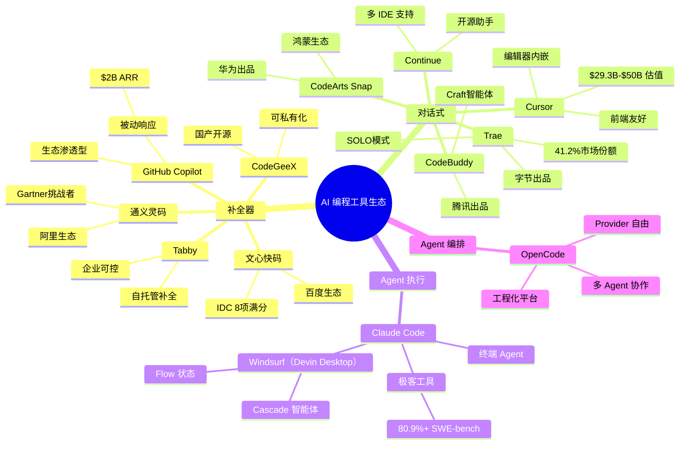
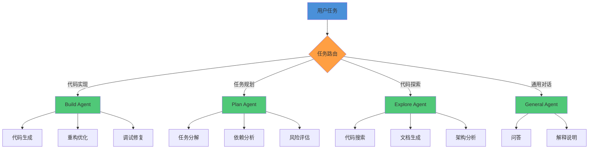
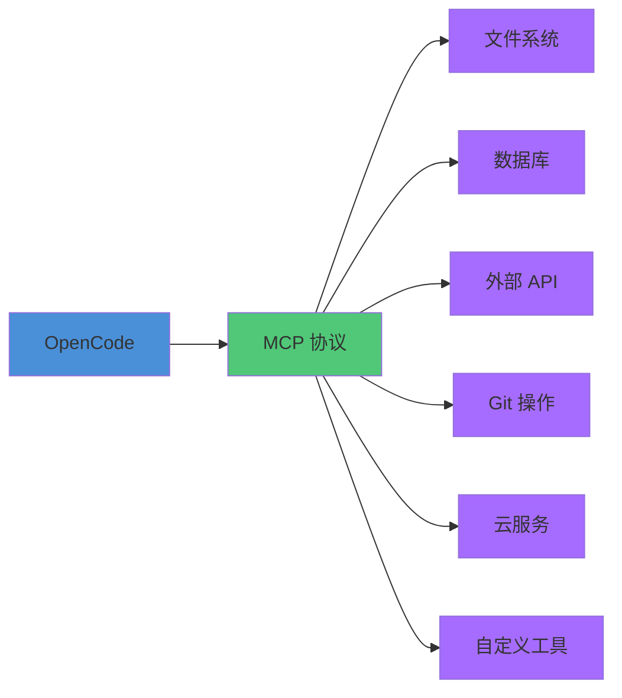
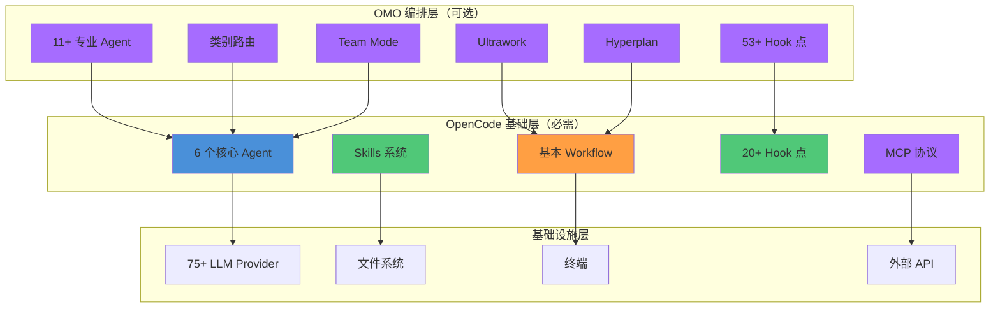
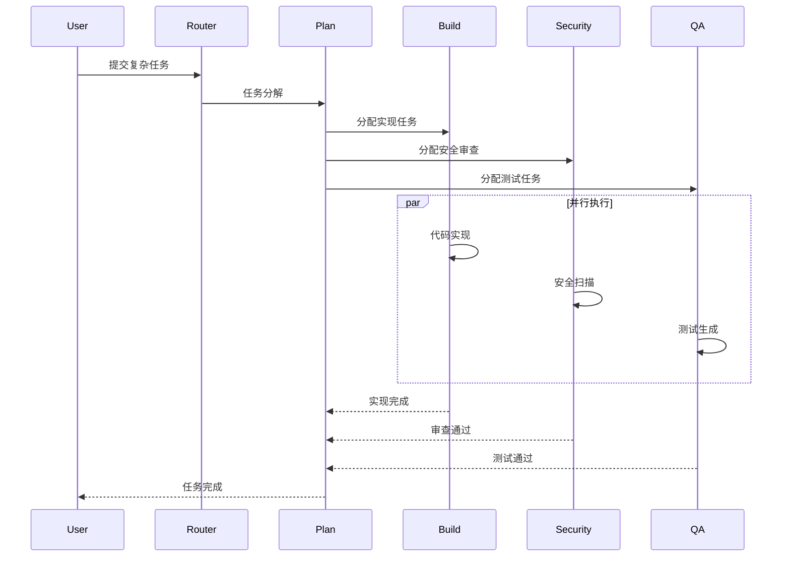
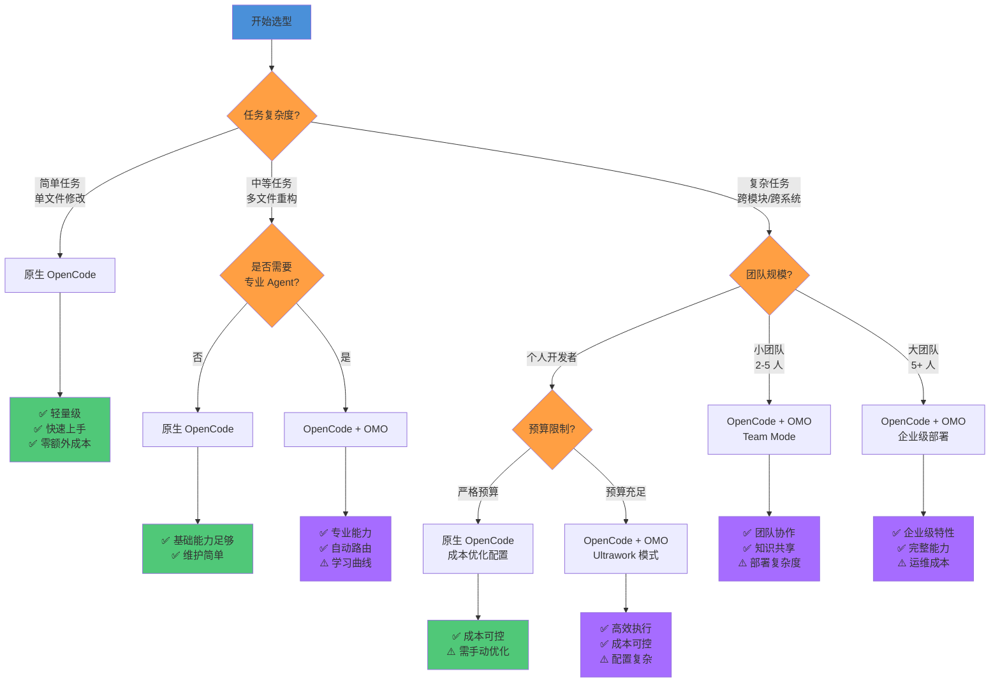

# 为什么选择 OpenCode

> 在 AI 编程工具百花齐放的今天，为什么 OpenCode 是承载 Harness Engineering 理念的最佳平台？——从四个核心优势和双层架构说起。

## 文章概述

当前的 AI 编程工具市场呈现"战国时代"格局：GitHub Copilot 以 ~$2B 年化收入（ARR）、2000万用户的规模稳坐市场领导者地位，现已支持多模型（OpenAI/Claude/Gemini/MAI）；Cursor 以 $29.3B-$50B 估值、$2.7B ARR 的惊人增长快速崛起；Claude Code 以 80.9%+ SWE-bench 得率（Opus 4.7 达 87.6%）的硬核实力占据极客市场；Windsurf（2025年7月被Cognition AI收购，2026年6月更名为Devin Desktop）以 Cascade 智能体创新赢得关注。国内市场同样火热，Trae 以 41.2% 市场份额领跑国产工具。在这片红海中，OpenCode 凭借其独特的设计哲学脱颖而出——它不仅是一个工具，更是一个"AI 编程操作系统"。读完本文，你应该能理解 OpenCode 的四个核心优势及其作为 Harness Engineering 理想载体的原因。

> **⏱ 时间有限？先读这些：** AI 编程工具全景对比 → OpenCode 的四个核心优势 → oh-my-openagent：什么时候需要它

OpenCode 的四个核心优势使其成为 Harness Engineering 的理想载体：**完全开源**（160K+ GitHub Stars，社区驱动）、**Provider 自由**（支持 75+ LLM 提供商，不锁定任何一家）、**Agent 架构**（Build/Plan 分工 + @general/@explore 等内置 Agent + 自定义 Agent）、**扩展生态**（Plugin 20+ Hook 点 + MCP 协议 + Skills Marketplace）。这些特性不是偶然堆叠，而是围绕"工程化"这一核心目标设计的有机整体。

本文还将介绍 **oh-my-openagent（OMO）** 双层架构——原生的 OpenCode 提供基础 Agent 能力，OMO 在其上叠加编排层（11+ 专业 Agent、类别路由、Team Mode、Ultrawork、Hyperplan）。最后，我们会诚实讨论 OpenCode 的局限性，帮助读者做出理性的选型决策。

## 内容要点

1. **AI 编程工具全景对比** — 从开源性、Provider 自由度、Agent 类型、Plugin/扩展能力、学习曲线、隐私保护、定价模式等维度，对比 OpenCode、Cursor、Claude Code、GitHub Copilot、Continue、Tabby、Windsurf 七款主流工具。对比矩阵表一目了然地展示各工具的能力边界。

2. **OpenCode 的四个核心优势** — （1）完全开源：代码可审计、可定制、可自行贡献，企业级部署无后顾之忧；（2）Provider 自由：不绑定任何模型，可在 75+ Provider 间自由切换甚至混合使用，彻底消除供应商锁定风险；（3）Agent 架构：内置 Build/Plan/Explore 等多角色 Agent 体系，支持自定义 Agent，天然适配复杂任务分解；（4）扩展生态：Plugin 的 20+ Hook 点覆盖工具链全生命周期，MCP 协议连接外部服务，Skills Marketplace 共享可复用能力。

3. **Agent vs Copilot 的本质差异** — Copilot 是"补全器"：基于光标位置给出代码建议，被动响应。Agent 是"执行器"：理解任务意图后自主执行多步操作，主动完成。这是工具哲学的根本分野。

4. **OMO 双层架构** — 原生 OpenCode 能力边界（6 个核心 Agent + Skills + 基本 Workflow）vs OMO 扩展能力（11+ 专业 Agent、类别路由、Team Mode、Ultrawork、Hyperplan、53+ Hook 点）。决策树帮助判断：什么场景用原生就够了，什么场景需要 OMO。

5. **OpenCode 的局限性（诚实告知）** — （1）终端界面体验不如 Cursor 的编辑器内嵌流畅；（2）六个核心概念（Agent/Skill/Workflow 等）带来一定学习曲线；（3）远程/云端模式仍在完善中。这些局限在某些场景下可能是关键决策因素。

---

## 安装方式速览

在深入了解 OpenCode 之前，先看看如何快速安装。OpenCode 支持多种安装方式，适应不同平台和使用习惯：

```bash
# macOS/Linux 官方脚本
curl -fsSL https://opencode.ai/install | bash

# Homebrew（macOS/Linux）
brew install anomalyco/tap/opencode

# npm（跨平台）
npm install -g opencode-ai

# Docker
docker run -it --rm ghcr.io/anomalyco/opencode
```

安装完成后，运行 `opencode --help` 查看可用命令：

```
OpenCode - AI coding agent for the terminal

USAGE
  opencode [OPTIONS] [COMMAND]

COMMANDS
  run         Run a task with a specified agent
  chat        Start interactive chat session
  config      Manage configuration settings
  skill       List, install, and manage skills
  provider    Configure LLM providers
  mcp         Manage MCP server connections
  plugin      Manage plugins and extensions

FLAGS
  -h, --help      Print help information
  -v, --version   Print version information

OPTIONS
  --model <MODEL>         LLM model to use for this session
  --provider <PROVIDER>   LLM provider to use
  --skill <SKILL>         Pre-load a skill by name
  -d, --dir <DIR>         Set working directory
  -y, --yes               Auto-confirm prompts
```

---

## 一、AI 编程工具全景对比

在深入分析 OpenCode 之前，我们需要建立一套完整的评估坐标系。本节从 12 个维度对比六款主流 AI 编程工具，帮助读者建立全景视角。

### 1.1 对比维度说明

我们将从以下 12 个维度进行对比：

**基础维度（7 个）**：

1. **开源性**：代码是否开源、是否可自托管、社区活跃度
2. **Provider 自由度**：是否锁定特定 LLM 提供商、支持的模型数量
3. **Agent 类型**：补全器（被动响应）、对话式（单轮交互）、自主执行（多步操作）、编排式（多 Agent 协作）
4. **Plugin/扩展能力**：Hook 点数量、扩展机制、生态丰富度
5. **学习曲线**：上手时间、概念复杂度、文档完善度
6. **隐私保护**：数据是否离开本地、是否支持离线模式、审计日志
7. **定价模式**：免费/订阅/企业版、成本结构

**架构维度（5 个，架构顾问补充）**：8. **集成性**：与现有工具链（IDE、CI/CD、代码审查）的集成能力9. **可观测性**：运行日志、性能监控、成本追踪、审计追踪10. **安全架构**：沙箱隔离、权限控制、敏感数据处理、合规认证11. **扩展性**：水平扩展能力、多环境部署、团队协作支持12. **企业级特性**：SSO、RBAC、审计日志、合规报告

### 1.2 十三款工具全景对比矩阵

下表对比十三款主流 AI 编程工具的核心特性，涵盖国际和国内代表性产品：

| 维度 | OpenCode | Cursor | Claude Code | GitHub Copilot | Continue | Tabby | Windsurf | Trae | CodeBuddy | CodeArts Snap | CodeGeeX | 通义灵码 | 文心快码 |
| --- | --- | --- | --- | --- | --- | --- | --- | --- | --- | --- | --- | --- | --- |
| **开源性** | ✅ 完全开源<br>160K+ Stars | ❌ 闭源 | ❌ 闭源 | ❌ 闭源 | ✅ 开源<br>20K+ Stars | ✅ 开源<br>22K+ Stars | ❌ 闭源 | ❌ 闭源 | ❌ 闭源 | ❌ 闭源 | ✅ 开源<br>可私有化 | ❌ 闭源 | ❌ 闭源 |
| **Provider 自由度** | ✅ 75+ Provider<br>自由切换 | ✅ 多模型<br>自由切换 | ❌ 锁定<br>Claude | ✅ 多模型<br>支持 | ✅ 多 Provider<br>支持 | ✅ 自托管<br>任意模型 | ✅ 多模型<br>支持 | ❌ 锁定<br>字节模型 | ❌ 锁定<br>腾讯模型 | ❌ 锁定<br>华为模型 | ✅ 多模型<br>支持 | ❌ 锁定<br>通义千问 | ❌ 锁定<br>文心大模型 |
| **Agent 类型** | ✅ 编排式<br>多 Agent 协作 | ⚠️ 对话式<br>单 Agent | ✅ 自主执行<br>单 Agent | ❌ 补全器<br>被动响应 | ⚠️ 对话式<br>单 Agent | ❌ 补全器<br>被动响应 | ✅ 自主执行<br>Cascade 智能体 | ⚠️ 对话式<br>SOLO 模式 | ⚠️ Craft 智能体 | ⚠️ 对话式<br>单 Agent | ❌ 补全器<br>被动响应 | ⚠️ 对话式<br>单 Agent | ⚠️ 对话式<br>单 Agent |
| **Plugin/扩展** | ✅ 20+ Hook 点<br>MCP 协议 | ⚠️ 有限扩展<br>无开放 API | ⚠️ MCP 支持<br>扩展有限 | ❌ 无扩展机制 | ✅ 开放 API<br>扩展生态 | ✅ Plugin 系统<br>可扩展 | ⚠️ 有限扩展<br>Flow 状态 | ⚠️ 有限扩展 | ⚠️ 有限扩展 | ⚠️ 鸿蒙生态<br>集成 | ⚠️ 插件支持 | ⚠️ 阿里生态<br>集成 | ⚠️ 百度生态<br>集成 |
| **学习曲线** | ⚠️ 中等<br>6 个核心概念 | ✅ 低<br>编辑器原生 | ⚠️ 中等<br>终端交互 | ✅ 低<br>自动补全 | ✅ 低<br>VSCode 插件 | ⚠️ 中等<br>需自托管 | ✅ 低<br>Flow 状态 | ✅ 低<br>中文友好 | ✅ 低<br>中文友好 | ✅ 低<br>中文友好 | ✅ 低<br>中文友好 | ✅ 低<br>中文友好 | ✅ 低<br>中文友好 |
| **隐私保护** | ✅ 本地运行<br>数据不离开 | ❌ 数据上传<br>到云端 | ❌ 数据上传<br>到 Anthropic | ❌ 数据上传<br>到 GitHub | ✅ 本地优先<br>可选云端 | ✅ 完全本地<br>自托管 | ❌ 数据上传<br>到 Codeium | ❌ 数据上传<br>到云端 | ❌ 数据上传<br>到云端 | ⚠️ 混合模式<br>可私有化 | ✅ 可私有化<br>本地部署 | ❌ 数据上传<br>到阿里云 | ❌ 数据上传<br>到百度云 |
| **定价模式** | ✅ 免费开源<br>Go $10/月 | ⚠️ 订阅制<br>$20–200/月 | ⚠️ 订阅制<br>$20–200/月 | ⚠️ 订阅制<br>$10–39/月 | ✅ 免费<br>开源 | ✅ 免费<br>开源 | ⚠️ 免费版 +<br>订阅制 | ⚠️ 免费版 +<br>订阅制 | ⚠️ 免费版 +<br>订阅制 | ⚠️ 企业版<br>付费 | ✅ 免费<br>开源 | ⚠️ 免费版 +<br>企业版 | ⚠️ 免费版 +<br>企业版 |
| **集成性** | ✅ CLI + API<br>CI/CD 集成 | ⚠️ 仅 IDE<br>内嵌 | ✅ CLI + API<br>脚本友好 | ✅ IDE + GitHub<br>深度集成 | ✅ VSCode + JetBrains<br>多 IDE | ✅ IDE 插件<br>API 支持 | ⚠️ 仅 IDE<br>内嵌 | ✅ VSCode<br>深度集成 | ✅ 腾讯云<br>生态集成 | ✅ 华为云<br>鸿蒙生态 | ✅ VSCode<br>多 IDE | ✅ 阿里云<br>生态集成 | ✅ 百度生态<br>集成 |
| **可观测性** | ✅ 完整日志<br>Token 追踪 | ❌ 黑盒<br>无日志 | ⚠️ 基础日志<br>有限追踪 | ❌ 黑盒<br>无透明度 | ⚠️ 基础日志<br>有限追踪 | ✅ 完整日志<br>自托管可控 | ❌ 黑盒<br>无日志 | ❌ 黑盒<br>无透明度 | ❌ 黑盒<br>无透明度 | ⚠️ 企业版<br>审计日志 | ⚠️ 自托管<br>可控 | ❌ 黑盒<br>无透明度 | ❌ 黑盒<br>无透明度 |
| **安全架构** | ✅ 沙箱隔离<br>权限控制 | ❌ 无沙箱<br>云端处理 | ⚠️ 基础隔离<br>云端处理 | ❌ 无沙箱<br>云端处理 | ✅ 本地优先<br>可控 | ✅ 完全本地<br>自托管安全 | ❌ 无沙箱<br>云端处理 | ❌ 无沙箱<br>云端处理 | ❌ 无沙箱<br>云端处理 | ⚠️ 企业版<br>权限控制 | ✅ 可私有化<br>本地安全 | ❌ 无沙箱<br>云端处理 | ❌ 无沙箱<br>云端处理 |
| **扩展性** | ✅ 多环境<br>Team Mode | ❌ 单用户<br>无协作 | ❌ 单用户<br>无协作 | ⚠️ 企业版<br>有限协作 | ⚠️ 单用户<br>无协作 | ✅ 自托管<br>可扩展 | ❌ 单用户<br>无协作 | ⚠️ 团队版<br>有限协作 | ⚠️ 团队版<br>有限协作 | ✅ 企业级<br>团队协作 | ⚠️ 团队版<br>有限协作 | ⚠️ 企业版<br>团队协作 | ⚠️ 企业版<br>团队协作 |
| **企业级特性** | ⚠️ 发展中<br>SSO/审计 | ⚠️ 企业版<br>有限 | ❌ 无企业版 | ✅ 企业版<br>完整 | ❌ 无企业版 | ✅ 自托管<br>完全控制 | ⚠️ 企业版<br>发展中 | ⚠️ 企业版<br>发展中 | ⚠️ 企业版<br>发展中 | ✅ 企业版<br>完整 | ✅ 私有化<br>部署支持 | ✅ 企业版<br>完整 | ✅ 企业版<br>IDC 8项满分 |

> 此成本对比为写书时（2026年6月）所查询数据，请以当前实际定价为准。对比维度侧重工程化能力（开源性、Provider 自由度、Agent 编排、扩展性），这是本书关注的核心视角，并非所有场景下的综合评级。各工具在不同使用模式下的实际体验差异可能很大。

**图例说明**：

- ✅ 优秀：该维度表现突出，满足企业级需求
- ⚠️ 中等：该维度有一定能力，但存在限制
- ❌ 不足：该维度能力缺失或严重不足

### 1.3 工具定位速览



**这意味着什么**：从补全器到 Agent 编排，工具的能力边界在不断扩大。OpenCode 处于能力谱系的最右端——不仅支持 Agent 执行，更支持多 Agent 编排，这是实现 Harness Engineering 的关键基础。

### 1.4 成本效益分析：选工具不只是看标价

说到这，你可能会问："所以这玩意儿到底要花我多少钱？"

这个问题看似简单，但答案没那么直白。选 AI 编程工具的成本清单上，**看得见的钱只是一小部分**。

**看得见的成本**：订阅费（$10-$200/月不等）、Token 消耗（取决于你用哪个模型、每天跑多少任务）。OpenCode 本身免费，但你用 Claude 还是 DeepSeek，月账单能差 5-10 倍。

**看不见的成本**：这才是大头。学习一个新工具从"知道"到"玩得转"，至少 1-2 周；团队迁移意味着历史配置和自定义工作流全部重建；培训和试错的时间比工具本身贵得多；被某个模型或厂商锁定的风险，是你今天可能完全想不到的。

所以，评估一个 AI 编程工具的 ROI，不是比谁家月费便宜。**问自己三个问题就够了**：

1. **它对"我现在的任务"有多直接？**——能不能今天就帮我解决一个具体问题，而不是要我花两周学它？
2. **它的总持有成本是多少？**——不只是月费，还有学习、配置、维护、团队培训的时间账。
3. **如果它明天变了（涨价、改政策、停服务），我有多大损失？**——这是最容易被忽略的问题。

把这三点想清楚，比看十张对比表都管用。

---

## 二、OpenCode 的四个核心优势

### 2.1 优势一：完全开源（170K+ Stars）

**为什么开源至关重要？**

在 AI 编程工具领域，开源是影响决策的关键因素之一。原因有三：

1. **可审计性**：企业必须知道 AI 工具如何处理代码、数据流向哪里、是否存在后门。闭源工具无法提供这种透明度。
2. **可定制性**：每个团队的工作流不同，开源允许根据实际需求修改和扩展，而不是被迫适应工具的设计。
3. **无供应商锁定**：闭源工具一旦停止维护或改变定价策略，用户没有任何议价能力。开源社区保证工具的长期可用性。

**OpenCode 的开源优势**：

- **170K+ GitHub Stars**：全球开发者社区认可，问题修复和功能迭代速度快
- **MIT 许可证**：商业友好，企业可自由使用、修改、分发
- **活跃社区**：每周多次更新，Issue 响应时间通常在 24 小时内
- **可自行托管**：企业可在内网部署，完全控制数据和运行环境

**企业架构视角**：开源是构建可信 AI 工具链的基础。在金融、医疗、政务等强监管行业，闭源 AI 工具往往无法通过安全审计。OpenCode 的开源特性使其成为这些行业的少数可行选择之一。

### 2.2 优势二：Provider 自由（75+ LLM 提供商）

**什么是 Provider 自由？**

Provider 自由是指 AI 编程工具不绑定任何特定的 LLM 提供商，用户可以自由选择、切换、甚至混合使用不同的模型。这是 OpenCode 与 Cursor、Claude Code、Copilot 的核心差异。

**为什么 Provider 自由重要？**

1. **成本优化**：不同任务的复杂度不同，简单任务用便宜模型，复杂任务用昂贵模型，在混合使用场景下可降低 30-50% 的 Token 成本（具体取决于任务类型分布和模型选择）
2. **性能优化**：不同模型在不同任务上有不同优势，选择最适合的模型可提升输出质量
3. **风险分散**：单一 Provider 故障或服务中断不会导致工具完全不可用
4. **合规需求**：某些行业要求数据不出境，必须使用国产模型或自托管模型

**OpenCode 的 Provider 支持示例**：

```yaml:opencode.yml
# opencode.yml - Provider 配置示例
providers:
  # 国产模型
  - name: deepseek
    type: openai-compatible
    api_base: https://api.deepseek.com/v1
    models:
      - deepseek-chat
      - deepseek-coder

  # 国际模型
  - name: openai
    type: openai
    models:
      - gpt-4-turbo
      - gpt-3.5-turbo

  # 自托管模型
  - name: local-llama
    type: ollama
    api_base: http://localhost:11434
    models:
      - llama3.1:70b
```

**这意味着什么**：Provider 自由不仅是"多一个选项"，而是架构层面的解耦。OpenCode 将"Agent 逻辑"与"模型能力"分离，使得模型升级或替换不影响工作流设计。这是工程化思维的体现。

### 2.3 优势三：Agent 架构（多角色协作）

**Agent vs Copilot：本质差异**

| 特性           | Copilot（补全器）              | Agent（执行器）                  |
| -------------- | ------------------------------ | -------------------------------- |
| **交互方式**   | 被动响应：基于光标位置给出建议 | 主动执行：理解任务意图后自主操作 |
| **操作范围**   | 单文件、单位置                 | 多文件、多步骤、跨工具           |
| **上下文理解** | 局部上下文（当前文件）         | 全局上下文（整个项目）           |
| **任务复杂度** | 简单补全、函数生成             | 复杂重构、跨模块修改、端到端实现 |
| **可控性**     | 低：用户只能接受或拒绝         | 高：可设计工作流、设置检查点     |

**OpenCode 的 Agent 架构**：

OpenCode 内置多角色 Agent 体系，每个 Agent 有明确的职责分工：



**这意味着什么**：OpenCode 的 Agent 架构天然适配复杂任务分解。Build Agent 负责执行，Plan Agent 负责规划，Explore Agent 负责探索——这种分工协作模式是 Harness Engineering 的核心实现方式。

### 2.4 优势四：扩展生态（Plugin + MCP + Skills）

**三层扩展机制**：

1. **Plugin 系统（20+ Hook 点）**：覆盖工具链全生命周期
   - `pre_tool_use`：工具执行前拦截
   - `post_tool_use`：工具执行后处理
   - `pre_response`：响应生成前修改
   - `post_response`：响应生成后增强

2. **MCP（Model Context Protocol）协议**：连接外部服务
   - 文件系统访问
   - 数据库连接
   - API 调用
   - 自定义工具集成

3. **Skills Marketplace**：共享可复用能力
   - 官方 Skills：代码审查、测试生成、文档编写
   - 社区 Skills：特定框架、特定语言的最佳实践
   - 自定义 Skills：团队内部沉淀的工作流

**扩展能力对比**：

| 扩展机制         | OpenCode       | Cursor    | Claude Code | Copilot   |
| ---------------- | -------------- | --------- | ----------- | --------- |
| **Hook 点数量**  | 20+            | 0         | 5-10        | 0         |
| **MCP 支持**     | ✅ 完整支持    | ✅ 支持 | ✅ 部分支持 | ❌ 不支持 |
| **Skills 市场**  | ✅ 官方 + 社区 | ❌ 无     | ❌ 无       | ❌ 无     |
| **自定义 Agent** | ✅ 完全支持    | ❌ 不支持 | ⚠️ 有限支持 | ❌ 不支持 |

**这意味着什么**：扩展生态决定了工具的"天花板"。OpenCode 的三层扩展机制使其能够适应任何工作流，而闭源工具的扩展能力往往受限于厂商的设计意图。

---

## 2.5 OpenCode 与竞品的差异化优势分析

### 2.5.1 开源优势：透明度与可控性

**与国际闭源产品的对比**：

| 维度           | OpenCode（开源）                | Cursor/Copilot/Windsurf（闭源） |
| -------------- | ------------------------------- | ------------------------------- |
| **代码审计**   | ✅ 完全可审计，可自行验证安全性 | ❌ 无法审计，只能信任厂商       |
| **定制能力**   | ✅ 可修改源码，深度定制         | ❌ 只能使用厂商提供的配置项     |
| **数据控制**   | ✅ 完全控制数据流向             | ❌ 数据上传到厂商服务器         |
| **长期可用性** | ✅ 社区维护，无厂商锁定风险     | ⚠️ 依赖厂商持续运营             |
| **合规性**     | ✅ 满足金融、政务等强监管要求   | ❌ 难以通过安全审计             |

**企业架构视角**：在金融、医疗、政务等强监管行业，闭源 AI 工具往往无法通过安全审计。OpenCode 的开源特性使其成为这些行业的少数可行选择之一。

### 2.5.2 本地化部署：数据主权与合规

**部署模式对比**：

| 部署模式     | OpenCode | Cursor    | Copilot   | Claude Code | Windsurf  |
| ------------ | -------- | --------- | --------- | ----------- | --------- |
| **完全本地** | ✅ 支持  | ❌ 不支持 | ❌ 不支持 | ❌ 不支持   | ❌ 不支持 |
| **混合部署** | ✅ 支持  | ⚠️ 有限   | ⚠️ 有限   | ⚠️ 有限     | ⚠️ 有限   |
| **完全云端** | ✅ 支持  | ✅ 仅云端 | ✅ 仅云端 | ✅ 仅云端   | ✅ 仅云端 |
| **内网部署** | ✅ 支持  | ❌ 不支持 | ❌ 不支持 | ❌ 不支持   | ❌ 不支持 |

**合规场景示例**：

```yaml:examples/opencode-configs/compliance.yaml
# 金融行业合规配置示例
providers:
  - name: internal-llm
    type: vllm
    api_base: https://internal-llm.bank.com
    models:
      - internal-coder-33b
    compliance:
      data_residency: "CN" # 数据不出境
      audit_log: true # 审计日志
      encryption: "AES-256" # 加密传输
```

**这意味着什么**：本地化部署不仅是技术选项，更是合规要求。OpenCode 的本地优先设计使其能够满足最严格的数据主权要求。

### 2.5.3 MCP 协议支持：开放生态 vs 封闭生态

**MCP（Model Context Protocol）生态对比**：

| 工具            | MCP 支持    | 生态开放度  | 外部工具集成       |
| --------------- | ----------- | ----------- | ------------------ |
| **OpenCode**    | ✅ 完整支持 | ✅ 开放生态 | ✅ 任意 MCP 服务器 |
| **Claude Code** | ✅ 完整支持 | ⚠️ 受限生态 | ⚠️ 仅官方认证 |
| **Cursor**      | ✅ 支持     | ⚠️ 受限生态 | ⚠️ MCP 集成        |
| **Copilot**     | ❌ 不支持   | ❌ 封闭生态 | ❌ 仅 GitHub 生态  |
| **Windsurf**    | ❌ 不支持   | ❌ 封闭生态 | ❌ 无外部工具      |

**MCP 生态优势**：



**这意味着什么**：MCP 协议使 OpenCode 成为"AI 编程操作系统"而非单一工具。通过 MCP，OpenCode 可以连接任何外部服务，扩展能力仅受限于想象力。

### 2.5.4 国际/国内市场定位对比

**国际市场格局**：

| 产品               | 市场定位   | 核心优势                   | 目标用户                |
| ------------------ | ---------- | -------------------------- | ----------------------- |
| **GitHub Copilot** | 市场领导者 | 生态渗透、GitHub 集成      | 企业开发者、GitHub 用户 |
| **Cursor**         | 快速崛起者 | 编辑器体验、前端友好       | 前端开发者、初创团队    |
| **Claude Code**    | 极客工具   | 终端 Agent、SWE-bench 得率 | 后端工程师、极客用户    |
| **Windsurf**       | 创新挑战者 | Cascade 智能体、Flow 状态  | 效率导向开发者          |
| **OpenCode**       | 开源替代者 | Provider 自由、工程化平台  | 企业架构师、开源社区    |

**国内市场格局**：

| 产品              | 市场份额 | 核心优势             | 差异化定位       |
| ----------------- | -------- | -------------------- | ---------------- |
| **Trae**          | 41.2%    | 国产化、中文优化     | 国内市场领导者   |
| **Tongyi Lingma** | ~20%     | 阿里生态、企业集成   | 阿里云用户首选   |
| **Baidu Comate**  | ~15%     | 百度生态、文心大模型 | 百度生态用户     |
| **OpenCode**      | 增长中   | 开源、Provider 自由  | 技术自主可控需求 |

**OpenCode 的差异化定位**：

1. **唯一完全开源、可自托管的国际方案**（与 Continue、Tabby 等同属开源阵营），满足国产化替代需求
2. **Provider 灵活性**：支持国产模型（DeepSeek、Qwen、GLM）和国际模型，无锁定风险
3. **工程化能力**：多 Agent 编排、工作流自动化，适合复杂项目
4. **成本优势**：开源免费，可使用性价比高的国产模型，特定场景下可显著降低使用成本

**这意味着什么**：OpenCode 在国内市场的定位是"技术自主可控的开源替代者"。对于追求数据主权、成本控制、技术自主的企业，OpenCode 是最佳选择。

---

## 三、oh-my-openagent：什么时候需要它

### 3.1 OMO 双层架构

**oh-my-openagent（OMO）** 是 OpenCode 的增强编排层，在其基础能力之上叠加了更强大的 Agent 编排、工作流自动化和团队协作能力。



### 3.2 原生 OpenCode vs OMO 能力边界对比

| 能力维度         | 原生 OpenCode                                               | oh-my-openagent v4.7.5 增强能力                                    |
| ---------------- | ----------------------------------------------------------- | ----------------------------------------------------------------- |
| **Agent 数量**   | 4 个核心 Agent<br>（Build/Plan/Explore/General） | 11+ 专业 Agent<br>（+ Architect/Security/Performance/DevOps/...） |
| **Agent 路由**   | 手动选择 Agent                                              | 类别路由自动分发<br>（根据任务类型自动匹配最佳 Agent）            |
| **协作模式**     | 单 Agent 执行                                               | Team Mode<br>（多 Agent 并行协作）                                |
| **工作流复杂度** | 基本工作流                                                  | Ultrawork<br>（复杂任务自动分解 + 并行执行）                      |
| **规划能力**     | 单步规划                                                    | Hyperplan<br>（多阶段规划 + 动态调整）                            |
| **Hook 点数量**  | 20+ Hook 点                                                 | 53+ Hook 点<br>（覆盖更多生命周期节点）                           |
| **知识管理**     | 基础记忆                                                    | 增强记忆系统<br>（跨 Session 上下文保持）                         |
| **成本控制**     | 基础 Token 统计                                             | 成本预算管理<br>（任务级成本预估 + 限制）                         |

### 3.3 oh-my-openagent v4.7.5 核心特性

**1. 11+ 专业 Agent**：

- **Architect Agent**：架构设计、技术选型、架构评审
- **Security Agent**：安全审计、漏洞扫描、合规检查
- **Performance Agent**：性能分析、优化建议、瓶颈定位
- **DevOps Agent**：CI/CD 配置、部署脚本、监控告警
- **QA Agent**：测试用例生成、自动化测试、质量报告
- **Documentation Agent**：API 文档、架构文档、用户手册
- **Data Agent**：数据分析、SQL 生成、报表制作
- **...**

**2. 类别路由（Category Router）**：

```yaml:.opencode/config.yml
# OMO 类别路由配置示例
category_router:
  rules:
    - pattern: "架构设计|技术选型|系统设计"
      agent: architect
    - pattern: "安全审计|漏洞扫描|渗透测试"
      agent: security
    - pattern: "性能优化|瓶颈分析|调优"
      agent: performance
    - pattern: "测试用例|自动化测试|质量报告"
      agent: qa
```

**3. Team Mode（多 Agent 协作）**：



**4. Ultrawork（复杂任务自动分解）**：

- 自动识别任务复杂度
- 拆分为可并行执行的子任务
- 动态调整执行顺序
- 汇总结果并验证

**5. Hyperplan（多阶段规划）**：

- 长期任务分解为多个阶段
- 每个阶段设置检查点
- 根据执行结果动态调整后续计划
- 支持回滚和重试

### 3.4 选型决策树：原生 vs OMO



---

## 四、OpenCode 的局限性（诚实告知）

作为一本负责任的技术书籍，我们必须诚实地讨论 OpenCode 的局限性。这些局限在某些场景下可能是关键决策因素。

### 4.1 局限一：终端界面体验不如编辑器内嵌

**问题描述**：

OpenCode 主要在终端运行，与 Cursor 的编辑器内嵌体验相比，存在以下不足：

- **上下文切换成本**：需要在编辑器和终端之间切换，打断编码心流
- **代码预览受限**：无法像 Cursor 那样在编辑器内实时预览 AI 生成的代码
- **视觉体验**：终端界面的富文本渲染能力不如 GUI 编辑器

**适用场景判断**：

- ✅ **适合**：习惯终端工作流的开发者、后端工程师、DevOps 工程师
- ⚠️ **需权衡**：前端开发者、UI/UX 开发者、重度 VSCode 用户
- ❌ **不适合**：完全依赖 GUI 的开发者、需要实时预览的场景

**缓解方案**：

- 使用 VSCode 集成终端，减少窗口切换
- 配置 `opencode config set editor.codeLens true` 启用代码透镜
- 使用 OMO 的编辑器插件（开发中）

### 4.2 局限二：学习曲线较陡

**问题描述**：

OpenCode 引入了 6 个核心概念，需要一定的学习投入：

1. **Agent**：理解不同 Agent 的职责和适用场景
2. **Skill**：学习如何使用和创建 Skill
3. **Workflow**：理解工作流的设计和编排
4. **Provider**：配置和管理多个 LLM Provider
5. **Hook**：理解扩展机制和 Hook 点
6. **MCP**：学习 MCP 协议和外部服务集成

**学习时间估算**：

| 学习阶段 | 内容                                    | 预计时间 |
| -------- | --------------------------------------- | -------- |
| 快速上手 | 安装、基本命令、简单任务                | 1-2 小时 |
| 日常使用 | Agent 选择、Skill 使用、基本配置        | 1-2 天   |
| 进阶使用 | Workflow 设计、Provider 配置、Hook 编写 | 1-2 周   |
| 高级定制 | 自定义 Agent、MCP 集成、企业级部署      | 1-2 月   |

**缓解方案**：

- 本书 Ch3 提供详细的快速上手指南
- 本书 Ch5-Ch6 提供进阶内容
- 官方文档和社区教程持续更新
- OMO 提供类别路由，降低 Agent 选择难度

### 4.3 局限三：远程/云端模式仍在完善

**问题描述**：

OpenCode 的远程模式和云端协作能力仍在开发中，与 Cursor 的云端体验相比存在差距：

- **远程开发**：对 SSH 远程开发的支持不如 Cursor 完善
- **云端同步**：配置和知识的云端同步功能仍在规划中
- **团队协作**：Team Mode 需要额外配置，不如 Cursor 开箱即用

**当前状态**：

| 功能             | OpenCode 原生 | OpenCode + OMO | Cursor      |
| ---------------- | ------------- | -------------- | ----------- |
| **本地开发**     | ✅ 完整支持   | ✅ 完整支持    | ✅ 完整支持 |
| **SSH 远程开发** | ⚠️ 基础支持   | ⚠️ 基础支持    | ✅ 完整支持 |
| **云端同步**     | ❌ 不支持     | ⚠️ 部分支持    | ✅ 完整支持 |
| **团队协作**     | ❌ 不支持     | ✅ Team Mode   | ✅ 完整支持 |

**缓解方案**：

- 使用 OMO 的 Team Mode 补充团队协作能力
- 使用 Git 同步配置文件
- 关注 OpenCode 路线图中的远程模式更新

### 4.4 其他已知局限

| 局限                                  | 影响                               | 缓解方案                            |
| ------------------------------------- | ---------------------------------- | ----------------------------------- |
| **Windows 支持不如 Linux/macOS 完善** | Windows 用户可能遇到路径、权限问题 | 使用 WSL2 或 Docker                 |
| **大型项目性能**                      | 超大型项目（10万+ 文件）可能变慢   | 配置 `.opencodeignore` 排除无关文件 |
| **多语言支持**                        | 某些小众语言支持不如主流语言       | 使用通用 Agent 或自定义 Skill       |
| **文档完善度**                        | 部分高级功能文档不足               | 参考本书和社区教程                  |

## 从理论到实践：真实世界的工程应用

以上说的这些听起来可能有些抽象——它们真的能落地吗？

在第 7 章中，你会看到这些概念在真实项目中的应用。有团队从零搭建微服务，经历了从项目初始化到多 Agent 协作的完整工作流；有团队改造遗留系统，用过去几分之一的时间完成安全审计和增量重构。安全审计流水线将渗透测试从"季度活动"变成了"每次构建的标配"；全流程自动化让产品经理的自然语言需求直接进入工程管道。

在成本敏感的场景下，团队通过混合模型调度在 DeepSeek 和 GPT-4o 之间智能路由；有了团队级 Skill 市场，中大型团队的 Skill 复用率大幅提升，经验真正沉淀成了可传承的知识资产。

这些案例不是虚构演示，而是真实工程实践的复盘。想知道具体怎么做？

→ 跳转到 [第 7 章：案例研究](../07-case-studies/)，看看这些团队是怎么做到的。

---

## 五、总结与选型建议

### 5.1 核心观点回顾

1. **OpenCode 的四个核心优势**：完全开源、Provider 自由、Agent 架构、扩展生态——这些优势使其成为 Harness Engineering 的理想载体。

2. **OMO 双层架构**：原生 OpenCode 提供基础能力，OMO 在其上叠加专业 Agent、Team Mode、Ultrawork 等增强能力——两者是扩展关系而非替代。

3. **诚实面对局限**：终端界面体验、学习曲线、远程模式——这些局限在某些场景下是关键决策因素，需要理性评估。

4. **企业架构定位**：OpenCode 不是孤立工具，而是企业 AI 工具链的核心组件，支持多种部署架构。

### 5.2 选型建议速查表

| 场景                     | 推荐方案                | 理由                                        |
| ------------------------ | ----------------------- | ------------------------------------------- |
| **个人开发者，追求效率** | Cursor 或 Windsurf      | 编辑器内嵌体验好，学习成本低，Flow 状态流畅 |
| **个人开发者，追求自由** | OpenCode 原生           | 开源、Provider 自由、可定制                 |
| **小团队，需要协作**     | OpenCode + OMO          | Team Mode、知识共享                         |
| **企业级，强合规要求**   | OpenCode + OMO 自托管   | 数据不出境、审计日志、权限控制              |
| **成本敏感场景**         | OpenCode + DeepSeek     | Provider 自由度允许成本优化                 |
| **前端开发者**           | Cursor 或 Windsurf      | 视觉体验和实时预览重要，编辑器内嵌体验好    |
| **后端/DevOps 工程师**   | OpenCode 或 Claude Code | 终端工作流契合，Agent 能力强                |
| **安全研究员**           | OpenCode + OMO          | 开源可审计，Security Agent 专业             |
| **追求极致性能**         | Claude Code             | 80.9%+ SWE-bench 得率（Opus 4.7 达 87.6%），终端 Agent 能力强 |
| **国产化替代需求**       | OpenCode + 国产模型     | 开源、技术自主可控、支持 DeepSeek/Qwen/GLM  |

### 5.3 下一步行动

- **快速体验**：跳转到 [快速上手](../03-setup/quickstart.md)，15 分钟完成 OpenCode 安装和第一个任务
- **深入理解**：阅读 [核心概念](../02-core-concepts/)，掌握 Agent、Skill、Workflow 的设计原理
- **企业部署**：参考 [多环境部署方案](../03-setup/multi-env-setup.md)，规划企业级架构

## 关联章节

- → [环境搭建](../03-setup/)（安装和配置的详细实操）
- → [Skill 开发](../05-skills/)（深入 Skill 系统的设计与实现）
- ← 承接 [什么是 Harness Engineer](what-is-harness-engineer.md)（理解概念后，自然延伸至工具选择）

---

> **章节导航**：[上一页：什么是 Harness Engineer](what-is-harness-engineer.md) | [下一页：Harness Engineering 理论框架 →](harness-engineering-theory.md)
