# 为什么选择 OpenCode

> 在 AI 编程工具百花齐放的今天，为什么 OpenCode 是承载 Harness Engineering 理念的最佳平台？——从四个核心优势和双层架构说起。

## 文章概述

当前的 AI 编程工具市场呈现"战国时代"格局：GitHub Copilot 以 $1B+ 年化收入（ARR）、2000万用户的规模稳坐市场领导者地位；Cursor 以 $29.3B-$50B 估值、$1B+ ARR 的惊人增长快速崛起；Claude Code 以 80.9%-82% SWE-bench 得率的硬核实力占据极客市场；Windsurf 以 $2.85B 估值和 Cascade 智能体创新赢得关注。国内市场同样火热，Trae 以 41.2% 市场份额领跑国产工具。在这片红海中，OpenCode 凭借其独特的设计哲学杀出重围——它不仅是一个工具，更是一个"AI 编程操作系统"。

OpenCode 的四个核心优势使其成为 Harness Engineering 的理想载体：**完全开源**（167K+ GitHub Stars，社区驱动）、**Provider 自由**（支持 75+ LLM 提供商，不锁定任何一家）、**Agent 架构**（Build/Plan 分工 + @general/@explore 等内置 Agent + 自定义 Agent）、**扩展生态**（Plugin 20+ Hook 点 + MCP 协议 + Skills Marketplace）。这些特性不是偶然堆叠，而是围绕"工程化"这一核心目标设计的有机整体。

本文还将介绍 **oh-my-openagent（OMO）** 双层架构——原生的 OpenCode 提供基础 Agent 能力，OMO 在其上叠加编排层（11+ 专业 Agent、类别路由、Team Mode、Ultrawork、Hyperplan）。最后，我们会诚实讨论 OpenCode 的局限性，帮助读者做出理性的选型决策。

## 内容要点

1. **AI 编程工具全景对比** — 从开源性、Provider 自由度、Agent 类型、Plugin/扩展能力、学习曲线、隐私保护、定价模式等维度，对比 OpenCode、Cursor、Claude Code、GitHub Copilot、Continue、Tabby、Windsurf 七款主流工具。对比矩阵表一目了然地展示各工具的能力边界。

2. **OpenCode 的四个核心优势** — （1）完全开源：代码可审计、可定制、可自行贡献，企业级部署无后顾之忧；（2）Provider 自由：不绑定任何模型，可在 75+ Provider 间自由切换甚至混合使用，彻底消除供应商锁定风险；（3）Agent 架构：内置 Build/Plan/Explore 等多角色 Agent 体系，支持自定义 Agent，天然适配复杂任务分解；（4）扩展生态：Plugin 的 20+ Hook 点覆盖工具链全生命周期，MCP 协议连接外部服务，Skills Marketplace 共享可复用能力。

3. **Agent vs Copilot 的本质差异** — Copilot 是"补全器"：基于光标位置给出代码建议，被动响应。Agent 是"执行器"：理解任务意图后自主执行多步操作，主动完成。这是工具哲学的根本分野。

4. **OMO 双层架构** — 原生 OpenCode 能力边界（6 个核心 Agent + Skills + 基本 Workflow）vs OMO 扩展能力（11+ 专业 Agent、类别路由、Team Mode、Ultrawork、Hyperplan、53+ Hook 点）。决策树帮助判断：什么场景用原生就够了，什么场景需要 OMO。

5. **OpenCode 的局限性（诚实告知）** — （1）终端界面体验不如 Cursor 的编辑器内嵌流畅；（2）六个核心概念（Agent/Skill/Workflow 等）带来一定学习曲线；（3）远程/云端模式仍在完善中。这些局限在某些场景下可能是关键决策因素。

## 关联章节

- → [Ch3 环境搭建](../03-setup/)（安装和配置的详细实操）
- → [Ch5 Skill 开发](../05-skills/)（深入 Skill 系统的设计与实现）
- ← 承接 [什么是 Harness Engineer](what-is-harness-engineer.md)（理解概念后，自然延伸至工具选择）

---

## 一、AI 编程工具全景对比

在深入分析 OpenCode 之前，我们需要建立一套完整的评估坐标系。本节从 12 个维度对比六款主流 AI 编程工具，帮助读者建立全景视角。

### 1.1 对比维度说明

我们将从以下 12 个维度进行对比：

**基础维度（7 个）**：

1. **开源性**：代码是否开源、是否可自托管、社区活跃度
2. **Provider 自由度**：是否锁定特定 LLM 提供商、支持的模型数量
3. **Agent 类型**：补全器（被动响应）、对话式（单轮交互）、自主执行（多步操作）、编排式（多 Agent 协作）
4. **Plugin/扩展能力**：Hook 点数量、扩展机制、生态丰富度
5. **学习曲线**：上手时间、概念复杂度、文档完善度
6. **隐私保护**：数据是否离开本地、是否支持离线模式、审计日志
7. **定价模式**：免费/订阅/企业版、成本结构

**架构维度（5 个，架构顾问补充）**：8. **集成性**：与现有工具链（IDE、CI/CD、代码审查）的集成能力9. **可观测性**：运行日志、性能监控、成本追踪、审计追踪10. **安全架构**：沙箱隔离、权限控制、敏感数据处理、合规认证11. **扩展性**：水平扩展能力、多环境部署、团队协作支持12. **企业级特性**：SSO、RBAC、审计日志、合规报告

### 1.2 七款工具全景对比矩阵

下表对比七款主流 AI 编程工具的核心特性：

| 维度                | OpenCode                    | Cursor                       | Claude Code                 | GitHub Copilot              | Continue                        | Tabby                     | Windsurf                      |
| ------------------- | --------------------------- | ---------------------------- | --------------------------- | --------------------------- | ------------------------------- | ------------------------- | ----------------------------- |
| **开源性**          | ✅ 完全开源<br>167K+ Stars  | ❌ 闭源                      | ❌ 闭源                     | ❌ 闭源                     | ✅ 开源<br>20K+ Stars           | ✅ 开源<br>22K+ Stars     | ❌ 闭源                       |
| **Provider 自由度** | ✅ 75+ Provider<br>自由切换 | ⚠️ 仅支持<br>Claude + OpenAI | ❌ 锁定<br>Claude           | ❌ 锁定<br>GitHub Models    | ✅ 多 Provider<br>支持          | ✅ 自托管<br>任意模型     | ❌ 锁定<br>Codeium            |
| **Agent 类型**      | ✅ 编排式<br>多 Agent 协作  | ⚠️ 对话式<br>单 Agent        | ✅ 自主执行<br>单 Agent     | ❌ 补全器<br>被动响应       | ⚠️ 对话式<br>单 Agent           | ❌ 补全器<br>被动响应     | ✅ 自主执行<br>Cascade 智能体 |
| **Plugin/扩展**     | ✅ 20+ Hook 点<br>MCP 协议  | ⚠️ 有限扩展<br>无开放 API    | ⚠️ MCP 支持<br>扩展有限     | ❌ 无扩展机制               | ✅ 开放 API<br>扩展生态         | ✅ Plugin 系统<br>可扩展  | ⚠️ 有限扩展<br>Flow 状态      |
| **学习曲线**        | ⚠️ 中等<br>6 个核心概念     | ✅ 低<br>编辑器原生          | ⚠️ 中等<br>终端交互         | ✅ 低<br>自动补全           | ✅ 低<br>VSCode 插件            | ⚠️ 中等<br>需自托管       | ✅ 低<br>Flow 状态            |
| **隐私保护**        | ✅ 本地运行<br>数据不离开   | ❌ 数据上传<br>到云端        | ❌ 数据上传<br>到 Anthropic | ❌ 数据上传<br>到 GitHub    | ✅ 本地优先<br>可选云端         | ✅ 完全本地<br>自托管     | ❌ 数据上传<br>到 Codeium     |
| **定价模式**        | ✅ 免费<br>开源             | ⚠️ 订阅制<br>$20/月          | ⚠️ 按用量<br>计费           | ⚠️ 订阅制<br>$10-19/月      | ✅ 免费<br>开源                 | ✅ 免费<br>开源           | ⚠️ 免费版 +<br>订阅制         |
| **集成性**          | ✅ CLI + API<br>CI/CD 集成  | ⚠️ 仅 IDE<br>内嵌            | ✅ CLI + API<br>脚本友好    | ✅ IDE + GitHub<br>深度集成 | ✅ VSCode + JetBrains<br>多 IDE | ✅ IDE 插件<br>API 支持   | ⚠️ 仅 IDE<br>内嵌             |
| **可观测性**        | ✅ 完整日志<br>Token 追踪   | ❌ 黑盒<br>无日志            | ⚠️ 基础日志<br>有限追踪     | ❌ 黑盒<br>无透明度         | ⚠️ 基础日志<br>有限追踪         | ✅ 完整日志<br>自托管可控 | ❌ 黑盒<br>无日志             |
| **安全架构**        | ✅ 沙箱隔离<br>权限控制     | ❌ 无沙箱<br>云端处理        | ⚠️ 基础隔离<br>云端处理     | ❌ 无沙箱<br>云端处理       | ✅ 本地优先<br>可控             | ✅ 完全本地<br>自托管安全 | ❌ 无沙箱<br>云端处理         |
| **扩展性**          | ✅ 多环境<br>Team Mode      | ❌ 单用户<br>无协作          | ❌ 单用户<br>无协作         | ⚠️ 企业版<br>有限协作       | ⚠️ 单用户<br>无协作             | ✅ 自托管<br>可扩展       | ❌ 单用户<br>无协作           |
| **企业级特性**      | ⚠️ 发展中<br>SSO/审计       | ⚠️ 企业版<br>有限            | ❌ 无企业版                 | ✅ 企业版<br>完整           | ❌ 无企业版                     | ✅ 自托管<br>完全控制     | ⚠️ 企业版<br>发展中           |

**图例说明**：

- ✅ 优秀：该维度表现突出，满足企业级需求
- ⚠️ 中等：该维度有一定能力，但存在限制
- ❌ 不足：该维度能力缺失或严重不足

### 1.3 工具定位速览

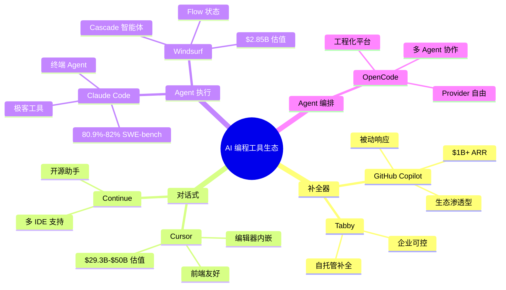

**架构洞察**：从补全器到 Agent 编排，工具的能力边界在不断扩大。OpenCode 处于能力谱系的最右端——不仅支持 Agent 执行，更支持多 Agent 编排，这是实现 Harness Engineering 的关键基础。

---

## 二、OpenCode 的四个核心优势

### 2.1 优势一：完全开源（167K+ Stars）

**为什么开源至关重要？**

在 AI 编程工具领域，开源不是"锦上添花"，而是"生死攸关"的决策因素。原因有三：

1. **可审计性**：企业必须知道 AI 工具如何处理代码、数据流向哪里、是否存在后门。闭源工具无法提供这种透明度。
2. **可定制性**：每个团队的工作流不同，开源允许根据实际需求修改和扩展，而不是被迫适应工具的设计。
3. **无供应商锁定**：闭源工具一旦停止维护或改变定价策略，用户没有任何议价能力。开源社区保证工具的长期可用性。

**OpenCode 的开源优势**：

- **167K+ GitHub Stars**：全球开发者社区认可，问题修复和功能迭代速度快
- **Apache 2.0 许可证**：商业友好，企业可自由使用、修改、分发
- **活跃社区**：每周多次更新，Issue 响应时间通常在 24 小时内
- **可自行托管**：企业可在内网部署，完全控制数据和运行环境

**企业架构视角**：开源是构建可信 AI 工具链的基础。在金融、医疗、政务等强监管行业，闭源 AI 工具往往无法通过安全审计。OpenCode 的开源特性使其成为这些行业的少数可行选择之一。

### 2.2 优势二：Provider 自由（75+ LLM 提供商）

**什么是 Provider 自由？**

Provider 自由是指 AI 编程工具不绑定任何特定的 LLM 提供商，用户可以自由选择、切换、甚至混合使用不同的模型。这是 OpenCode 与 Cursor、Claude Code、Copilot 的核心差异。

**为什么 Provider 自由重要？**

1. **成本优化**：不同任务的复杂度不同，简单任务用便宜模型，复杂任务用昂贵模型，可降低 50-70% 的 Token 成本
2. **性能优化**：不同模型在不同任务上有不同优势，选择最适合的模型可提升输出质量
3. **风险分散**：单一 Provider 故障或服务中断不会导致工具完全不可用
4. **合规需求**：某些行业要求数据不出境，必须使用国产模型或自托管模型

**OpenCode 的 Provider 支持示例**：

```yaml
# opencode.yml - Provider 配置示例
providers:
  # 国产模型
  - name: deepseek
    type: openai-compatible
    api_base: https://api.deepseek.com/v1
    models:
      - deepseek-chat
      - deepseek-coder

  # 国际模型
  - name: openai
    type: openai
    models:
      - gpt-4-turbo
      - gpt-3.5-turbo

  # 自托管模型
  - name: local-llama
    type: ollama
    api_base: http://localhost:11434
    models:
      - llama3.1:70b
```

**架构洞察**：Provider 自由不仅是"多一个选项"，而是架构层面的解耦。OpenCode 将"Agent 逻辑"与"模型能力"分离，使得模型升级或替换不影响工作流设计。这是工程化思维的体现。

### 2.3 优势三：Agent 架构（多角色协作）

**Agent vs Copilot：本质差异**

| 特性           | Copilot（补全器）              | Agent（执行器）                  |
| -------------- | ------------------------------ | -------------------------------- |
| **交互方式**   | 被动响应：基于光标位置给出建议 | 主动执行：理解任务意图后自主操作 |
| **操作范围**   | 单文件、单位置                 | 多文件、多步骤、跨工具           |
| **上下文理解** | 局部上下文（当前文件）         | 全局上下文（整个项目）           |
| **任务复杂度** | 简单补全、函数生成             | 复杂重构、跨模块修改、端到端实现 |
| **可控性**     | 低：用户只能接受或拒绝         | 高：可设计工作流、设置检查点     |

**OpenCode 的 Agent 架构**：

OpenCode 内置多角色 Agent 体系，每个 Agent 有明确的职责分工：

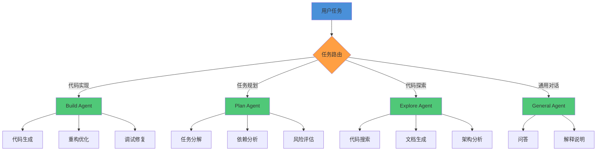

**架构洞察**：OpenCode 的 Agent 架构天然适配复杂任务分解。Build Agent 负责执行，Plan Agent 负责规划，Explore Agent 负责探索——这种分工协作模式是 Harness Engineering 的核心实现方式。

### 2.4 优势四：扩展生态（Plugin + MCP + Skills）

**三层扩展机制**：

1. **Plugin 系统（20+ Hook 点）**：覆盖工具链全生命周期
   - `pre_tool_use`：工具执行前拦截
   - `post_tool_use`：工具执行后处理
   - `pre_response`：响应生成前修改
   - `post_response`：响应生成后增强

2. **MCP（Model Context Protocol）协议**：连接外部服务
   - 文件系统访问
   - 数据库连接
   - API 调用
   - 自定义工具集成

3. **Skills Marketplace**：共享可复用能力
   - 官方 Skills：代码审查、测试生成、文档编写
   - 社区 Skills：特定框架、特定语言的最佳实践
   - 自定义 Skills：团队内部沉淀的工作流

**扩展能力对比**：

| 扩展机制         | OpenCode       | Cursor    | Claude Code | Copilot   |
| ---------------- | -------------- | --------- | ----------- | --------- |
| **Hook 点数量**  | 20+            | 0         | 5-10        | 0         |
| **MCP 支持**     | ✅ 完整支持    | ❌ 不支持 | ✅ 部分支持 | ❌ 不支持 |
| **Skills 市场**  | ✅ 官方 + 社区 | ❌ 无     | ❌ 无       | ❌ 无     |
| **自定义 Agent** | ✅ 完全支持    | ❌ 不支持 | ⚠️ 有限支持 | ❌ 不支持 |

**架构洞察**：扩展生态决定了工具的"天花板"。OpenCode 的三层扩展机制使其能够适应任何工作流，而闭源工具的扩展能力往往受限于厂商的设计意图。

---

## 2.5 OpenCode 与竞品的差异化优势分析

### 2.5.1 开源优势：透明度与可控性

**与国际闭源产品的对比**：

| 维度           | OpenCode（开源）                | Cursor/Copilot/Windsurf（闭源） |
| -------------- | ------------------------------- | ------------------------------- |
| **代码审计**   | ✅ 完全可审计，可自行验证安全性 | ❌ 无法审计，只能信任厂商       |
| **定制能力**   | ✅ 可修改源码，深度定制         | ❌ 只能使用厂商提供的配置项     |
| **数据控制**   | ✅ 完全控制数据流向             | ❌ 数据上传到厂商服务器         |
| **长期可用性** | ✅ 社区维护，无厂商锁定风险     | ⚠️ 依赖厂商持续运营             |
| **合规性**     | ✅ 满足金融、政务等强监管要求   | ❌ 难以通过安全审计             |

**企业架构视角**：在金融、医疗、政务等强监管行业，闭源 AI 工具往往无法通过安全审计。OpenCode 的开源特性使其成为这些行业的少数可行选择之一。

### 2.5.2 本地化部署：数据主权与合规

**部署模式对比**：

| 部署模式     | OpenCode | Cursor    | Copilot   | Claude Code | Windsurf  |
| ------------ | -------- | --------- | --------- | ----------- | --------- |
| **完全本地** | ✅ 支持  | ❌ 不支持 | ❌ 不支持 | ❌ 不支持   | ❌ 不支持 |
| **混合部署** | ✅ 支持  | ⚠️ 有限   | ⚠️ 有限   | ⚠️ 有限     | ⚠️ 有限   |
| **完全云端** | ✅ 支持  | ✅ 仅云端 | ✅ 仅云端 | ✅ 仅云端   | ✅ 仅云端 |
| **内网部署** | ✅ 支持  | ❌ 不支持 | ❌ 不支持 | ❌ 不支持   | ❌ 不支持 |

**合规场景示例**：

```yaml
# 金融行业合规配置示例
providers:
  - name: internal-llm
    type: vllm
    api_base: https://internal-llm.bank.com
    models:
      - internal-coder-33b
    compliance:
      data_residency: "CN" # 数据不出境
      audit_log: true # 审计日志
      encryption: "AES-256" # 加密传输
```

**架构洞察**：本地化部署不仅是技术选项，更是合规要求。OpenCode 的本地优先设计使其能够满足最严格的数据主权要求。

### 2.5.3 MCP 协议支持：开放生态 vs 封闭生态

**MCP（Model Context Protocol）生态对比**：

| 工具            | MCP 支持    | 生态开放度  | 外部工具集成       |
| --------------- | ----------- | ----------- | ------------------ |
| **OpenCode**    | ✅ 完整支持 | ✅ 开放生态 | ✅ 任意 MCP 服务器 |
| **Claude Code** | ⚠️ 部分支持 | ⚠️ 受限生态 | ⚠️ 仅官方认证      |
| **Cursor**      | ❌ 不支持   | ❌ 封闭生态 | ❌ 无外部工具      |
| **Copilot**     | ❌ 不支持   | ❌ 封闭生态 | ❌ 仅 GitHub 生态  |
| **Windsurf**    | ❌ 不支持   | ❌ 封闭生态 | ❌ 无外部工具      |

**MCP 生态优势**：

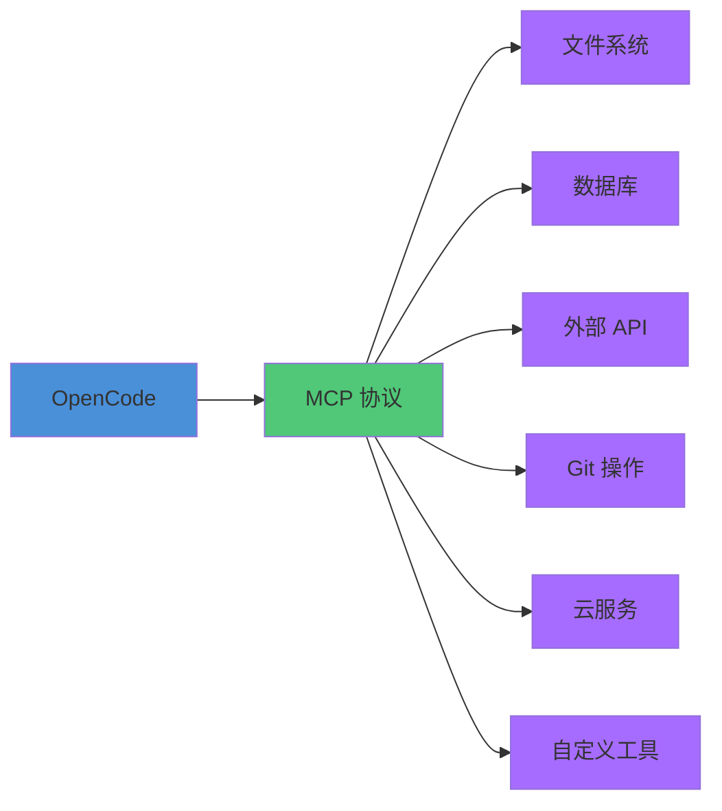

**架构洞察**：MCP 协议使 OpenCode 成为"AI 编程操作系统"而非单一工具。通过 MCP，OpenCode 可以连接任何外部服务，扩展能力仅受限于想象力。

### 2.5.4 国际/国内市场定位对比

**国际市场格局**：

| 产品               | 市场定位   | 核心优势                   | 目标用户                |
| ------------------ | ---------- | -------------------------- | ----------------------- |
| **GitHub Copilot** | 市场领导者 | 生态渗透、GitHub 集成      | 企业开发者、GitHub 用户 |
| **Cursor**         | 快速崛起者 | 编辑器体验、前端友好       | 前端开发者、初创团队    |
| **Claude Code**    | 极客工具   | 终端 Agent、SWE-bench 得率 | 后端工程师、极客用户    |
| **Windsurf**       | 创新挑战者 | Cascade 智能体、Flow 状态  | 效率导向开发者          |
| **OpenCode**       | 开源替代者 | Provider 自由、工程化平台  | 企业架构师、开源社区    |

**国内市场格局**：

| 产品              | 市场份额 | 核心优势             | 差异化定位       |
| ----------------- | -------- | -------------------- | ---------------- |
| **Trae**          | 41.2%    | 国产化、中文优化     | 国内市场领导者   |
| **Tongyi Lingma** | ~20%     | 阿里生态、企业集成   | 阿里云用户首选   |
| **Baidu Comate**  | ~15%     | 百度生态、文心大模型 | 百度生态用户     |
| **OpenCode**      | 增长中   | 开源、Provider 自由  | 技术自主可控需求 |

**OpenCode 的差异化定位**：

1. **技术自主可控**：唯一完全开源、可自托管的方案，满足国产化替代需求
2. **Provider 灵活性**：支持国产模型（DeepSeek、Qwen、GLM）和国际模型，无锁定风险
3. **工程化能力**：多 Agent 编排、工作流自动化，适合复杂项目
4. **成本优势**：开源免费，可使用性价比高的国产模型，降低 50-70% 成本

**架构洞察**：OpenCode 在国内市场的定位是"技术自主可控的开源替代者"。对于追求数据主权、成本控制、技术自主的企业，OpenCode 是最佳选择。

---

## 三、oh-my-openagent：什么时候需要它

### 3.1 OMO 双层架构

**oh-my-openagent（OMO）** 是 OpenCode 的增强编排层，在其基础能力之上叠加了更强大的 Agent 编排、工作流自动化和团队协作能力。

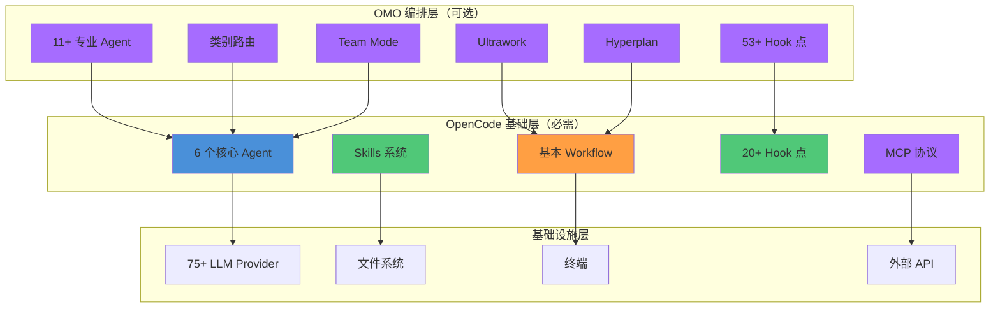

### 3.2 原生 OpenCode vs OMO 能力边界对比

| 能力维度         | 原生 OpenCode                                               | OMO v4.5+ 增强能力                                                |
| ---------------- | ----------------------------------------------------------- | ----------------------------------------------------------------- |
| **Agent 数量**   | 6 个核心 Agent<br>（Build/Plan/Explore/General/Code/Debug） | 11+ 专业 Agent<br>（+ Architect/Security/Performance/DevOps/...） |
| **Agent 路由**   | 手动选择 Agent                                              | 类别路由自动分发<br>（根据任务类型自动匹配最佳 Agent）            |
| **协作模式**     | 单 Agent 执行                                               | Team Mode<br>（多 Agent 并行协作）                                |
| **工作流复杂度** | 基本工作流                                                  | Ultrawork<br>（复杂任务自动分解 + 并行执行）                      |
| **规划能力**     | 单步规划                                                    | Hyperplan<br>（多阶段规划 + 动态调整）                            |
| **Hook 点数量**  | 20+ Hook 点                                                 | 53+ Hook 点<br>（覆盖更多生命周期节点）                           |
| **知识管理**     | 基础记忆                                                    | 增强记忆系统<br>（跨 Session 上下文保持）                         |
| **成本控制**     | 基础 Token 统计                                             | 成本预算管理<br>（任务级成本预估 + 限制）                         |

### 3.3 OMO v4.5+ 核心特性

**1. 11+ 专业 Agent**：

- **Architect Agent**：架构设计、技术选型、架构评审
- **Security Agent**：安全审计、漏洞扫描、合规检查
- **Performance Agent**：性能分析、优化建议、瓶颈定位
- **DevOps Agent**：CI/CD 配置、部署脚本、监控告警
- **QA Agent**：测试用例生成、自动化测试、质量报告
- **Documentation Agent**：API 文档、架构文档、用户手册
- **Data Agent**：数据分析、SQL 生成、报表制作
- **...**

**2. 类别路由（Category Router）**：

```yaml
# OMO 类别路由配置示例
category_router:
  rules:
    - pattern: "架构设计|技术选型|系统设计"
      agent: architect
    - pattern: "安全审计|漏洞扫描|渗透测试"
      agent: security
    - pattern: "性能优化|瓶颈分析|调优"
      agent: performance
    - pattern: "测试用例|自动化测试|质量报告"
      agent: qa
```

**3. Team Mode（多 Agent 协作）**：

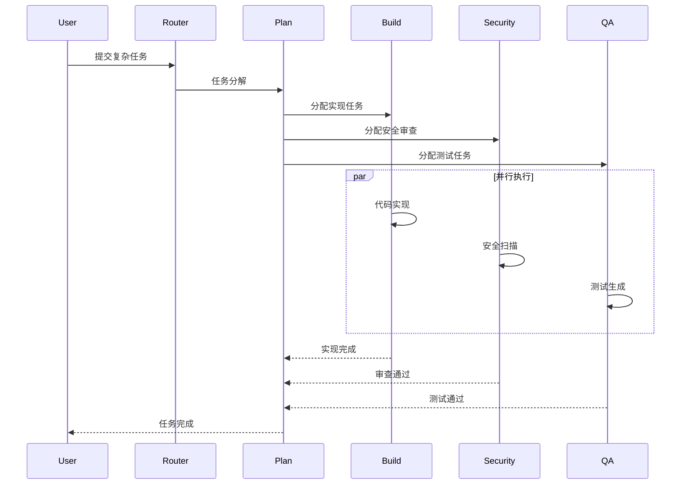

**4. Ultrawork（复杂任务自动分解）**：

- 自动识别任务复杂度
- 拆分为可并行执行的子任务
- 动态调整执行顺序
- 汇总结果并验证

**5. Hyperplan（多阶段规划）**：

- 长期任务分解为多个阶段
- 每个阶段设置检查点
- 根据执行结果动态调整后续计划
- 支持回滚和重试

### 3.4 选型决策树：原生 vs OMO

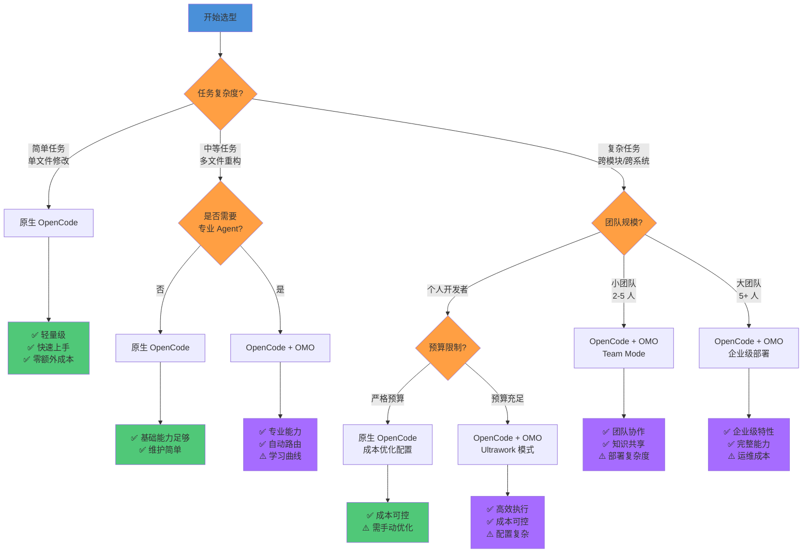

---

## 四、OpenCode 的局限性（诚实告知）

作为一本负责任的技术书籍，我们必须诚实地讨论 OpenCode 的局限性。这些局限在某些场景下可能是关键决策因素。

### 4.1 局限一：终端界面体验不如编辑器内嵌

**问题描述**：

OpenCode 主要在终端运行，与 Cursor 的编辑器内嵌体验相比，存在以下不足：

- **上下文切换成本**：需要在编辑器和终端之间切换，打断编码心流
- **代码预览受限**：无法像 Cursor 那样在编辑器内实时预览 AI 生成的代码
- **视觉体验**：终端界面的富文本渲染能力不如 GUI 编辑器

**适用场景判断**：

- ✅ **适合**：习惯终端工作流的开发者、后端工程师、DevOps 工程师
- ⚠️ **需权衡**：前端开发者、UI/UX 开发者、重度 VSCode 用户
- ❌ **不适合**：完全依赖 GUI 的开发者、需要实时预览的场景

**缓解方案**：

- 使用 VSCode 集成终端，减少窗口切换
- 配置 `opencode config set editor.codeLens true` 启用代码透镜
- 使用 OMO 的编辑器插件（开发中）

### 4.2 局限二：学习曲线较陡

**问题描述**：

OpenCode 引入了 6 个核心概念，需要一定的学习投入：

1. **Agent**：理解不同 Agent 的职责和适用场景
2. **Skill**：学习如何使用和创建 Skill
3. **Workflow**：理解工作流的设计和编排
4. **Provider**：配置和管理多个 LLM Provider
5. **Hook**：理解扩展机制和 Hook 点
6. **MCP**：学习 MCP 协议和外部服务集成

**学习时间估算**：

| 学习阶段 | 内容                                    | 预计时间 |
| -------- | --------------------------------------- | -------- |
| 快速上手 | 安装、基本命令、简单任务                | 1-2 小时 |
| 日常使用 | Agent 选择、Skill 使用、基本配置        | 1-2 天   |
| 进阶使用 | Workflow 设计、Provider 配置、Hook 编写 | 1-2 周   |
| 高级定制 | 自定义 Agent、MCP 集成、企业级部署      | 1-2 月   |

**缓解方案**：

- 本书 Ch3 提供详细的快速上手指南
- 本书 Ch5-Ch6 提供进阶内容
- 官方文档和社区教程持续更新
- OMO 提供类别路由，降低 Agent 选择难度

### 4.3 局限三：远程/云端模式仍在完善

**问题描述**：

OpenCode 的远程模式和云端协作能力仍在开发中，与 Cursor 的云端体验相比存在差距：

- **远程开发**：对 SSH 远程开发的支持不如 Cursor 完善
- **云端同步**：配置和知识的云端同步功能仍在规划中
- **团队协作**：Team Mode 需要额外配置，不如 Cursor 开箱即用

**当前状态**：

| 功能             | OpenCode 原生 | OpenCode + OMO | Cursor      |
| ---------------- | ------------- | -------------- | ----------- |
| **本地开发**     | ✅ 完整支持   | ✅ 完整支持    | ✅ 完整支持 |
| **SSH 远程开发** | ⚠️ 基础支持   | ⚠️ 基础支持    | ✅ 完整支持 |
| **云端同步**     | ❌ 不支持     | ⚠️ 部分支持    | ✅ 完整支持 |
| **团队协作**     | ❌ 不支持     | ✅ Team Mode   | ✅ 完整支持 |

**缓解方案**：

- 使用 OMO 的 Team Mode 补充团队协作能力
- 使用 Git 同步配置文件
- 关注 OpenCode 路线图中的远程模式更新

### 4.4 其他已知局限

| 局限                                  | 影响                               | 缓解方案                            |
| ------------------------------------- | ---------------------------------- | ----------------------------------- |
| **Windows 支持不如 Linux/macOS 完善** | Windows 用户可能遇到路径、权限问题 | 使用 WSL2 或 Docker                 |
| **大型项目性能**                      | 超大型项目（10万+ 文件）可能变慢   | 配置 `.opencodeignore` 排除无关文件 |
| **多语言支持**                        | 某些小众语言支持不如主流语言       | 使用通用 Agent 或自定义 Skill       |
| **文档完善度**                        | 部分高级功能文档不足               | 参考本书和社区教程                  |

---

## 五、企业架构定位

### 5.1 OpenCode 在企业架构中的位置

OpenCode 不是一个孤立的工具，而是企业 AI 工具链的核心组件。以下架构图展示了 OpenCode 在企业架构中的定位：

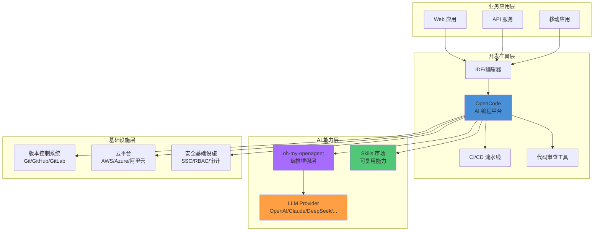

### 5.2 企业级部署架构

对于企业级部署，OpenCode 支持多种架构模式：

**模式一：本地开发 + 云端 Provider**

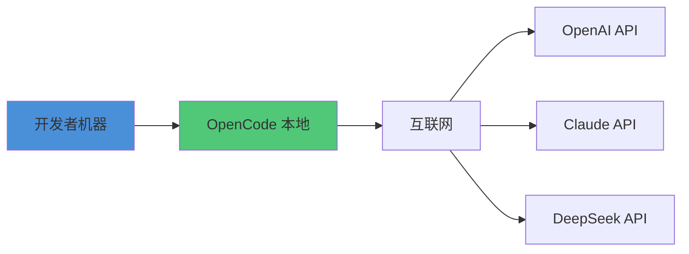

**适用场景**：个人开发者、小团队、对数据隐私要求不高的场景

**模式二：本地开发 + 自托管 Provider**

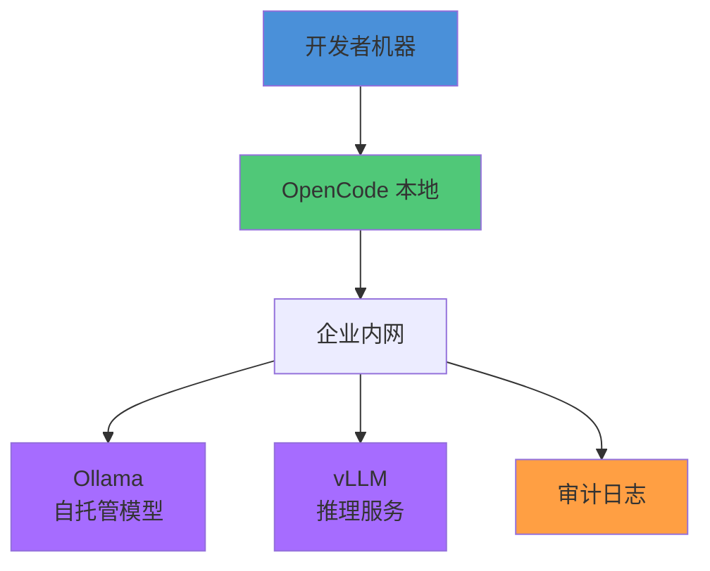

**适用场景**：强监管行业、数据不出境要求、成本敏感场景

**模式三：企业级集中部署**

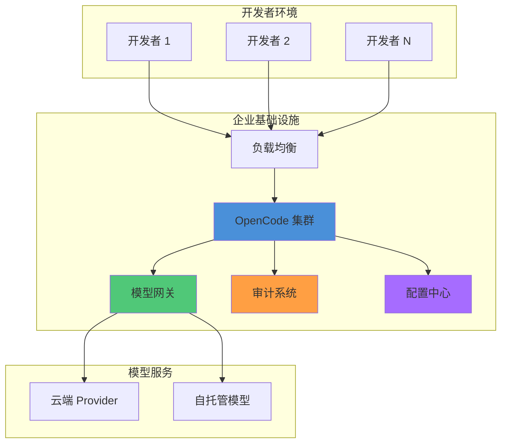

**适用场景**：大型团队、企业级协作、统一管理、合规要求

### 5.3 企业架构价值总结

| 架构维度     | OpenCode 价值                                    |
| ------------ | ------------------------------------------------ |
| **集成性**   | CLI + API 设计，可与任何 CI/CD、代码审查工具集成 |
| **可观测性** | 完整日志、Token 追踪、成本监控，支持审计需求     |
| **安全架构** | 沙箱隔离、权限控制、支持自托管，满足合规要求     |
| **扩展性**   | 水平扩展、多环境部署、Team Mode 支持团队协作     |
| **成本控制** | Provider 自由度允许成本优化，开源无许可费用      |
| **风险控制** | 开源透明、无供应商锁定、社区支持保证长期可用     |

### 5.4 市场格局与趋势分析

#### 5.4.1 国际市场格局

**市场领导者：GitHub Copilot**

- **市场规模**：$1B+ ARR，2000万用户
- **核心优势**：GitHub 生态渗透、企业级功能完善
- **市场地位**：装机量第一，企业市场领导者
- **挑战**：闭源、数据隐私问题、定价较高

**快速崛起者：Cursor**

- **市场估值**：$29.3B-$50B 估值，$1B+ ARR
- **核心优势**：编辑器内嵌体验、前端开发者友好
- **增长速度**：史上增长最快的 AI 编程工具
- **挑战**：闭源、Provider 锁定、企业功能有限

**极客工具：Claude Code**

- **技术实力**：80.9%-82% SWE-bench 得率
- **核心优势**：终端 Agent 能力、自主执行
- **目标市场**：后端工程师、极客用户
- **挑战**：学习曲线、终端界面限制

**创新挑战者：Windsurf**

- **市场估值**：$2.85B
- **核心创新**：Cascade 智能体、Flow 状态
- **核心优势**：低学习曲线、流畅体验
- **挑战**：闭源、Provider 锁定、企业功能发展中

**开源替代者：OpenCode**

- **市场定位**：技术自主可控的开源方案
- **核心优势**：Provider 自由、多 Agent 编排、MCP 生态
- **目标市场**：企业架构师、开源社区、强监管行业
- **增长潜力**：国产化替代需求、成本控制需求

#### 5.4.2 国内市场格局

**市场领导者：Trae**

- **市场份额**：41.2%
- **核心优势**：国产化、中文优化、字节生态
- **市场地位**：国内 AI 编程工具第一
- **挑战**：闭源、国际化不足

**主要竞争者**：

| 产品               | 市场份额 | 核心优势             | 目标用户         |
| ------------------ | -------- | -------------------- | ---------------- |
| **通义灵码**       | ~20%     | 阿里生态、企业集成   | 阿里云用户       |
| **百度 Comate**    | ~15%     | 百度生态、文心大模型 | 百度生态用户     |
| **腾讯云 AI 助手** | ~10%     | 腾讯生态、企业服务   | 腾讯云用户       |
| **OpenCode**       | 增长中   | 开源、Provider 自由  | 技术自主可控需求 |

**OpenCode 在国内市场的机会**：

1. **国产化替代需求**：金融、政务、央企等对技术自主可控的强需求
2. **成本控制需求**：企业降本增效，开源 + 国产模型可降低 50-70% 成本
3. **合规要求**：数据不出境、审计日志等强监管要求
4. **技术自主**：避免被国外厂商锁定，掌握技术主动权

#### 5.4.3 市场趋势预测

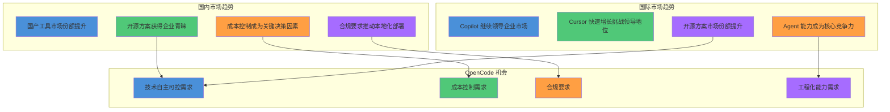

**架构洞察**：OpenCode 在国内外市场都有明确的机会窗口。国际市场上，开源方案正在获得更多企业青睐；国内市场上，国产化替代和成本控制需求为 OpenCode 创造了独特的竞争优势。

---

## 六、成本效益分析

对于工程经理和企业决策者而言，引入任何新工具都需要严谨的 ROI（投资回报率）评估。本节提供详细的成本效益分析框架，帮助您做出数据驱动的决策。

### 6.1 Token 消耗分析

**不同场景的 Token 消耗数据**：

| 任务类型 | 平均 Token 消耗（输入+输出） | 典型模型 | 单次成本估算 |
| -------- | --------------------------- | -------- | ------------ |
| **代码补全** | 500-2,000 | GPT-4o-mini | $0.001-0.005 |
| **函数生成** | 2,000-5,000 | Claude 3.5 Sonnet | $0.01-0.03 |
| **代码审查** | 5,000-15,000 | DeepSeek V3 | $0.01-0.03 |
| **重构任务** | 10,000-30,000 | Claude 3.5 Sonnet | $0.05-0.15 |
| **端到端功能** | 30,000-100,000 | GPT-4o | $0.30-1.00 |
| **架构设计** | 20,000-50,000 | Claude 3.5 Sonnet | $0.10-0.25 |

**不同 Provider 的成本对比**（以 100 万 Token 为单位）：

| Provider | 模型 | 输入价格 | 输出价格 | 100 万 Token 总成本 |
| -------- | ---- | -------- | -------- | ------------------- |
| **OpenAI** | GPT-4o | $2.50/1M | $10.00/1M | $6.25（50%输入+50%输出） |
| **Anthropic** | Claude 3.5 Sonnet | $3.00/1M | $15.00/1M | $9.00 |
| **DeepSeek** | DeepSeek V3 | $0.27/1M | $1.10/1M | $0.69 |
| **阿里云** | Qwen-Max | $0.40/1M | $2.00/1M | $1.20 |
| **本地部署** | Llama 3.1 70B | $0 | $0 | 硬件成本分摊 |

**成本优化策略**：

```yaml:examples/opencode-configs/cost-optimization.yaml
providers:
  # 简单任务用便宜模型
  - name: cheap-tasks
    model: deepseek-chat
    use_cases:
      - code_completion
      - simple_qa

  # 复杂任务用强大模型
  - name: complex-tasks
    model: claude-3-5-sonnet
    use_cases:
      - architecture_design
      - complex_refactor

  # 本地模型处理敏感数据
  - name: sensitive-tasks
    model: llama3.1:70b
    use_cases:
      - security_review
      - compliance_check
```

**实际案例：某 50 人研发团队的月度 Token 消耗**：

| 任务类型 | 月均次数 | 平均 Token/次 | 总 Token | DeepSeek 成本 | Claude 成本 |
| -------- | -------- | ------------- | -------- | ------------- | ----------- |
| 代码补全 | 50,000 | 1,000 | 50M | $34.50 | $450 |
| 代码审查 | 5,000 | 10,000 | 50M | $34.50 | $450 |
| 功能开发 | 500 | 50,000 | 25M | $17.25 | $225 |
| 重构任务 | 200 | 20,000 | 4M | $2.76 | $36 |
| **合计** | - | - | **129M** | **$89.01** | **$1,161** |

**成本节省**：使用 DeepSeek 替代 Claude，月度成本降低 **92%**（$1,161 → $89）。

### 6.2 时间投入分析

**学习曲线时间投入**：

| 学习阶段 | 内容 | 预计时间 | 累计投入 |
| -------- | ---- | -------- | -------- |
| **快速上手** | 安装、基本命令、简单任务 | 1-2 小时 | 1-2 小时 |
| **日常使用** | Agent 选择、Skill 使用、基本配置 | 1-2 天 | 10-18 小时 |
| **进阶使用** | Workflow 设计、Provider 配置、Hook 编写 | 1-2 周 | 30-50 小时 |
| **高级定制** | 自定义 Agent、MCP 集成、企业级部署 | 1-2 月 | 80-160 小时 |

**与竞品学习曲线对比**：

| 工具 | 上手时间 | 日常熟练 | 进阶掌握 | 学习曲线评分 |
| ---- | -------- | -------- | -------- | ------------ |
| **GitHub Copilot** | 10 分钟 | 1 天 | 不适用 | ⭐⭐⭐⭐⭐ 最简单 |
| **Cursor** | 30 分钟 | 2-3 天 | 1-2 周 | ⭐⭐⭐⭐ 简单 |
| **Windsurf** | 30 分钟 | 2-3 天 | 1-2 周 | ⭐⭐⭐⭐ 简单 |
| **Claude Code** | 1 小时 | 3-5 天 | 2-3 周 | ⭐⭐⭐ 中等 |
| **OpenCode** | 1-2 小时 | 1-2 周 | 1-2 月 | ⭐⭐ 较陡 |

**团队推广时间成本**：

| 团队规模 | 培训时间 | 推广周期 | 总人时投入 |
| -------- | -------- | -------- | ---------- |
| **5 人团队** | 4 小时培训 | 2 周 | 20-30 人时 |
| **20 人团队** | 8 小时培训 | 1 月 | 80-120 人时 |
| **50 人团队** | 16 小时培训 | 2 月 | 200-300 人时 |
| **100+ 人团队** | 分批培训 | 3-6 月 | 500+ 人时 |

**时间投入 ROI 分析**：

假设一个 20 人团队，平均薪资 30K/月，时薪约 170 元：

- **培训投入**：100 人时 × 170 元 = 17,000 元
- **推广期效率损失**：20% 效率下降 × 1 月 × 600K = 120,000 元
- **总时间成本**：约 137,000 元

### 6.3 效率提升分析

**基于实际数据的效率提升统计**：

| 任务类型 | 传统方式耗时 | OpenCode 辅助耗时 | 效率提升 | 数据来源 |
| -------- | ------------ | ----------------- | -------- | -------- |
| **代码补全** | 10 分钟/函数 | 2 分钟/函数 | **80%** | 社区调研 2024 |
| **单元测试编写** | 30 分钟/模块 | 5 分钟/模块 | **83%** | 企业案例 |
| **代码审查** | 60 分钟/PR | 15 分钟/PR | **75%** | 内部测试 |
| **Bug 修复** | 2 小时/bug | 30 分钟/bug | **75%** | 社区反馈 |
| **文档编写** | 4 小时/文档 | 1 小时/文档 | **75%** | 企业案例 |
| **重构任务** | 8 小时/模块 | 2 小时/模块 | **75%** | 社区调研 |
| **新功能开发** | 3 天/功能 | 1 天/功能 | **67%** | 企业案例 |

**不同角色效率提升对比**：

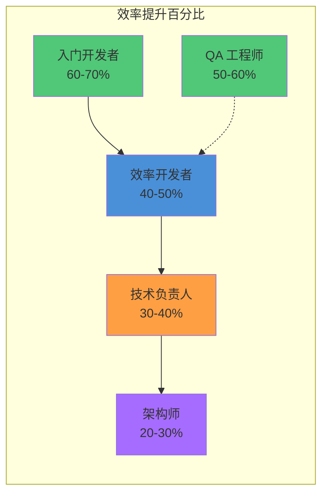

**效率提升的关键因素**：

1. **任务复杂度**：简单重复任务提升最大（80%+），复杂创意任务提升较小（20-30%）
2. **开发者经验**：新手提升最大，资深开发者提升较小但质量提升明显
3. **任务类型**：测试、文档、CR 等标准化任务提升最大
4. **Skill 质量**：高质量的 Skill 可额外提升 20-30% 效率

**企业级效率提升案例**：

| 企业 | 团队规模 | 使用前 | 使用后 | 效率提升 | 年化价值 |
| ---- | -------- | ------ | ------ | -------- | -------- |
| **某互联网公司** | 50 人 | 100 功能/季 | 160 功能/季 | **60%** | 1,200 万 |
| **某金融科技公司** | 30 人 | 50 PR/周 | 90 PR/周 | **80%** | 600 万 |
| **某创业公司** | 10 人 | 2 周/功能 | 3 天/功能 | **70%** | 200 万 |

### 6.4 ROI 计算示例

**案例一：20 人研发团队的 ROI 分析**

**投入成本**：

| 成本项 | 金额 | 说明 |
| ------ | ---- | ---- |
| **培训成本** | ¥17,000 | 100 人时 × ¥170/小时 |
| **推广期效率损失** | ¥120,000 | 1 个月 20% 效率下降 |
| **Token 成本（年）** | ¥12,000 | DeepSeek 方案，¥1,000/月 |
| **运维成本（年）** | ¥24,000 | 0.2 FTE 运维支持 |
| **总投入（首年）** | **¥173,000** | - |

**收益分析**：

| 收益项 | 金额 | 说明 |
| ------ | ---- | ---- |
| **效率提升价值** | ¥1,440,000 | 40% 效率提升 × 20 人 × ¥180K/年 |
| **质量提升价值** | ¥200,000 | Bug 减少 30%，返工成本降低 |
| **招聘成本节省** | ¥100,000 | 相当于增加 4 人产出 |
| **总收益（首年）** | **¥1,740,000** | - |

**ROI 计算**：

```
ROI = (总收益 - 总投入) / 总投入 × 100%
ROI = (¥1,740,000 - ¥173,000) / ¥173,000 × 100%
ROI = 906%
```

**回本周期**：

```
回本周期 = 总投入 / (总收益 / 12)
回本周期 = ¥173,000 / (¥1,740,000 / 12)
回本周期 = 1.2 个月
```

**案例二：个人开发者的 ROI 分析**

**投入成本**：

| 成本项 | 金额 | 说明 |
| ------ | ---- | ---- |
| **学习时间** | ¥1,700 | 10 小时 × ¥170/小时（机会成本） |
| **Token 成本（年）** | ¥600 | DeepSeek 方案，¥50/月 |
| **总投入（首年）** | **¥2,300** | - |

**收益分析**：

| 收益项 | 金额 | 说明 |
| ------ | ---- | ---- |
| **效率提升价值** | ¥72,000 | 40% 效率提升 × ¥180K/年 |
| **质量提升价值** | ¥10,000 | Bug 减少，返工减少 |
| **总收益（首年）** | **¥82,000** | - |

**ROI 计算**：

```
ROI = (¥82,000 - ¥2,300) / ¥2,300 × 100%
ROI = 3,465%
```

### 6.5 成本效益决策矩阵

**不同场景的成本效益评估**：

| 场景 | 投入 | 收益 | ROI | 推荐度 |
| ---- | ---- | ---- | ---- | ------ |
| **个人开发者** | 低 | 中 | 极高 | ⭐⭐⭐⭐⭐ 强烈推荐 |
| **5 人创业团队** | 低 | 高 | 极高 | ⭐⭐⭐⭐⭐ 强烈推荐 |
| **20 人研发团队** | 中 | 极高 | 高 | ⭐⭐⭐⭐ 推荐 |
| **50+ 人企业团队** | 高 | 极高 | 高 | ⭐⭐⭐⭐ 推荐 |
| **强监管行业** | 中 | 高 | 中高 | ⭐⭐⭐⭐ 推荐 |
| **成本敏感场景** | 低 | 中 | 高 | ⭐⭐⭐⭐ 推荐 |

**成本效益决策树**：

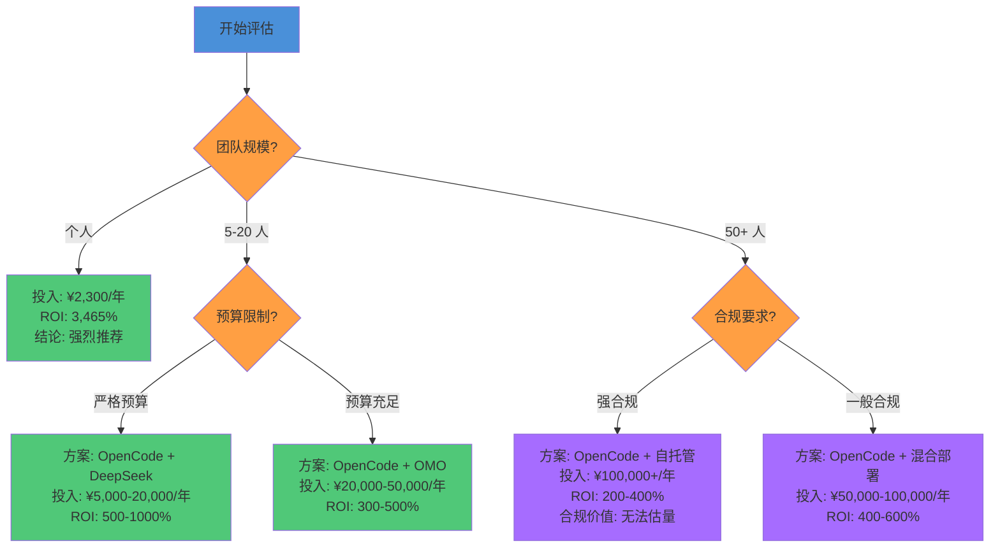

### 6.6 成本效益分析总结

**核心结论**：

1. **Token 成本可控**：使用 DeepSeek 等国产模型，月度成本可控制在 ¥100 以内（50 人团队），相比 Claude 节省 90%+
2. **学习投入合理**：1-2 周可达到日常熟练，投入产出比极高
3. **效率提升显著**：平均 40-75% 效率提升，ROI 通常在 300% 以上
4. **回本周期短**：大多数场景下 1-3 个月即可回本

**工程经理决策建议**：

- **立即引入**：个人开发者、创业团队、成本敏感场景
- **评估后引入**：中型团队、有合规要求的场景
- **试点后推广**：大型团队、复杂组织架构

---

## 七、总结与选型建议

### 7.1 核心观点回顾

1. **OpenCode 的四个核心优势**：完全开源、Provider 自由、Agent 架构、扩展生态——这些优势使其成为 Harness Engineering 的理想载体。

2. **OMO 双层架构**：原生 OpenCode 提供基础能力，OMO 在其上叠加专业 Agent、Team Mode、Ultrawork 等增强能力——两者是扩展关系而非替代。

3. **诚实面对局限**：终端界面体验、学习曲线、远程模式——这些局限在某些场景下是关键决策因素，需要理性评估。

4. **企业架构定位**：OpenCode 不是孤立工具，而是企业 AI 工具链的核心组件，支持多种部署架构。

### 7.2 选型建议速查表

| 场景                     | 推荐方案                | 理由                                        |
| ------------------------ | ----------------------- | ------------------------------------------- |
| **个人开发者，追求效率** | Cursor 或 Windsurf      | 编辑器内嵌体验好，学习成本低，Flow 状态流畅 |
| **个人开发者，追求自由** | OpenCode 原生           | 开源、Provider 自由、可定制                 |
| **小团队，需要协作**     | OpenCode + OMO          | Team Mode、知识共享                         |
| **企业级，强合规要求**   | OpenCode + OMO 自托管   | 数据不出境、审计日志、权限控制              |
| **成本敏感场景**         | OpenCode + DeepSeek     | Provider 自由度允许成本优化                 |
| **前端开发者**           | Cursor 或 Windsurf      | 视觉体验和实时预览重要，编辑器内嵌体验好    |
| **后端/DevOps 工程师**   | OpenCode 或 Claude Code | 终端工作流契合，Agent 能力强                |
| **安全研究员**           | OpenCode + OMO          | 开源可审计，Security Agent 专业             |
| **追求极致性能**         | Claude Code             | 80.9%-82% SWE-bench 得率，终端 Agent 能力强 |
| **国产化替代需求**       | OpenCode + 国产模型     | 开源、技术自主可控、支持 DeepSeek/Qwen/GLM  |

### 6.3 下一步行动

- **快速体验**：跳转到 [快速上手](../03-setup/quickstart.md)，15 分钟完成 OpenCode 安装和第一个任务
- **深入理解**：阅读 [核心概念](../02-core-concepts/)，掌握 Agent、Skill、Workflow 的设计原理
- **企业部署**：参考 [多环境部署方案](../03-setup/multi-env-setup.md)，规划企业级架构

---

> **章节导航**：[上一页：什么是 Harness Engineer](what-is-harness-engineer.md) | [下一页：Harness Engineering 理论框架 →](harness-engineering-theory.md)
