# 约束系统解析

> 为 Agent 构建"牢笼"——通过权限、架构与规范三层约束实现可控的 AI 行为。

> **前置条件**
> - 已完成 [上下文工程核心](context-engineering-core.md)，理解上下文管理的基本原理
> - 已安装 OpenCode CLI 并完成基础配置
> - 已了解基本的权限控制和安全概念

## 文章概述

Agent 需要牢笼才能自由发挥。约束系统是 Harness Engineering 中确保 Agent 行为可控的核心机制。没有约束的 Agent 就像没有围栏的施工现场——效率再高也无法让人放心。本章节详解约束系统的三大支柱：权限模型（能不能做）、架构护栏（怎么做）、Lint 规范（做得对）。读者将理解 OpenCode 的 6 种权限模式与三级策略（allow/ask/deny）的实际含义，掌握工具级与文件级权限控制的配置方法。

在架构护栏部分，我们讲解 AGENTS.md 如何作为架构决策的约束载体，以及如何通过规范文档约束 Agent 的代码生成方向。Lint 规则约束利用 LSP 诊断和 AST-grep 模式匹配在输出阶段进行自动校验。本章还包含威胁建模分析，涵盖越权访问、配置篡改、权限升级等典型攻击场景及其防御策略。学完本节，读者应能理解"好的约束让 Agent 更高效而不是更慢"的设计哲学，并构建适配项目需求的约束体系。

### 操作系统类比：约束系统 = 操作系统安全机制

理解约束系统最直观的方式是将其类比为操作系统的**安全管理机制**：

| 操作系统概念 | OpenCode 对应 | 说明 |
|-------------|---------------|------|
| Unix 权限（rwx）+ SELinux 策略 | Permission Model | 定义 Agent 能做什么、不能做什么 |
| OS 安全策略 / 组策略（GPO） | Architecture Guardrails | 定义 Agent 应该怎么做，引导架构方向 |
| 内核 → 用户 → 进程权限层级 | Constraints Hierarchy | 全局约束→会话约束→任务约束的层级结构 |
| 系统调用门控 | 工具级权限 | 监控和限制 Agent 的每一次"系统调用" |
| 文件系统 ACL | 文件级权限 | 精确控制 Agent 对每个文件/路径的访问 |
| 审计日志（auditd） | 操作审计 | 记录所有权限决策和操作行为 |

这个类比帮助理解几个关键设计：

1. **层级隔离**：操作系统有内核态/用户态隔离，约束系统有全局/会话/任务的分层控制
2. **最小权限**：操作系统遵循最小权限原则，约束系统的权限模型同样精确到文件级别
3. **纵深防御**：SELinux 在传统 Unix 权限之上增加安全策略，约束系统的三大支柱同样层层叠加

## 内容要点

1. **约束系统总览** — Agent 需要"牢笼"的设计哲学，三大支柱：权限（能不能做）→架构（怎么做）→规范（做得对），职责分离原则。
2. **权限模型** — 6 种权限模式概览（allow/deny/ask/passive/restricted/inherit），三级策略的具体含义，工具级与文件级的粒度控制，passive 模式的安全审查价值。
3. **架构护栏** — 约束 Agent 架构决策的方法论，AGENTS.md 作为架构护栏的实现载体，实战示例（规范 Service/Repository 层生成规则，API 路径约定）。
4. **Lint 规则约束** — 利用 LSP 诊断自动约束 Agent 输出，AST-grep 模式匹配的代码规则检查，Code Review 作为人工约束的最后环节。
5. **约束的层级结构** — 全局约束（项目级默认）、会话约束（当前会话生效）、任务约束（单次任务），冲突检测机制与优先级裁定规则。
6. **约束与权限的关系** — 约束定义"行为规则"，权限定义"能力边界"，两者互补形成完整的 Agent 行为控制体系。
7. **威胁建模分析** — 攻击者绕过约束的典型场景（越权访问、配置篡改、权限升级），约束系统如何防御这些攻击，以及纵深防御的最佳实践。

## 关联章节

- ← [上下文工程核心](context-engineering-core.md)：上下文工程为约束提供信息基础，约束反过来限制上下文的使用范围
- → [验证护栏体系](validation-harness.md)：验证护栏是约束的补充——约束管"准入"，验证管"准出"
- → [Ch3 环境搭建](../03-setup/)：权限模型在 opencode.json 中的具体配置实现

---

### 最小示例

用一个最简单的权限配置来理解约束系统：

```json
{
  "permissions": {
    "tools": {
      "read_file": "allow",
      "write_file": "ask",
      "delete_file": "deny"
    }
  }
}
```

三行配置定义了 Agent 的行为边界：文件随便读（allow），写入要问一声（ask），删除直接不让干（deny）。这就是约束系统的核心——用 `allow/ask/deny` 三级策略给 Agent 画一个安全"牢笼"。

## 一、约束系统总览

### 1.1 为什么 Agent 需要"牢笼"

当 AI Agent 获得执行终端命令、读写文件、访问网络的能力后，它不再只是一个"聊天机器人"，而是一个具有实际执行能力的"数字员工"。这带来了巨大的效率提升，同时也引入了前所未有的风险。

**没有约束的 Agent 会发生什么？**

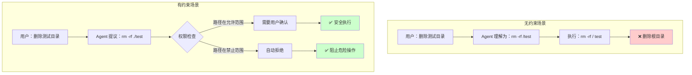
```mermaid
flowchart TB
    subgraph 无约束场景
        A1[用户：删除测试目录] --> B1[Agent 理解为：rm -rf /test]
        B1 --> C1[执行：rm -rf / test]
        C1 --> D1[❌ 删除根目录]
    end

    subgraph 有约束场景
        A2[用户：删除测试目录] --> B2[Agent 提议：rm -rf ./test]
        B2 --> C2{权限检查}
        C2 -->|路径在允许范围| D2[需要用户确认]
        C2 -->|路径在禁止范围| E2[自动拒绝]
        D2 --> F2[✅ 安全执行]
        E2 --> G2[✅ 阻止危险操作]
    end

    style D1 fill:#ffcccc
    style F2 fill:#ccffcc
    style G2 fill:#ccffcc
```

**约束的核心价值**：

| 价值维度 | 无约束 | 有约束 |
|---------|--------|--------|
| **安全性** | 一次误操作可能导致数据丢失、系统崩溃 | 危险操作被拦截或需确认 |
| **可控性** | Agent 行为不可预测 | 行为在预期范围内 |
| **可审计** | 无法追溯"谁做了什么" | 每一步操作有记录 |
| **可信任** | 不敢让 Agent 执行关键任务 | 可以放心委派复杂任务 |

### 1.2 三大支柱：权限 → 架构 → 规范

约束系统由三大支柱构成，形成从"能不能做"到"怎么做"再到"做得对"的完整约束链：

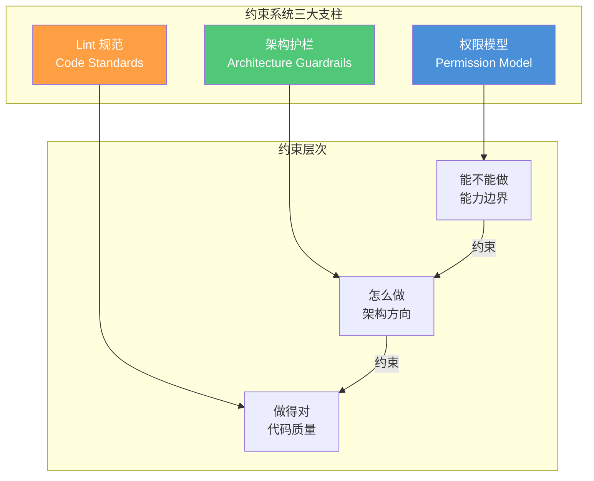
```mermaid
graph TB
    subgraph 约束系统三大支柱
        P1[权限模型<br/>Permission Model]
        P2[架构护栏<br/>Architecture Guardrails]
        P3[Lint 规范<br/>Code Standards]
    end

    subgraph 约束层次
        L1["能不能做<br/>能力边界"]
        L2["怎么做<br/>架构方向"]
        L3["做得对<br/>代码质量"]
    end

    P1 --> L1
    P2 --> L2
    P3 --> L3

    L1 --> |约束| L2
    L2 --> |约束| L3

    style P1 fill:#4A90D9,color:#fff
    style P2 fill:#50C878,color:#fff
    style P3 fill:#FF9F43,color:#fff
```

**三大支柱的职责分工**：

| 支柱 | 核心问题 | 约束对象 | 实现载体 |
|------|---------|---------|---------|
| **权限模型** | Agent 能不能做这件事？ | 工具调用、文件访问、命令执行 | opencode.json 权限配置 |
| **架构护栏** | Agent 应该怎么做？ | 代码结构、模块划分、技术选型 | AGENTS.md 架构规范 |
| **Lint 规范** | Agent 做得对不对？ | 代码风格、潜在错误、安全漏洞 | LSP + AST-grep + CI 门禁 |

### 1.3 约束金字塔

三大支柱形成金字塔结构，越底层的约束越基础、越严格：

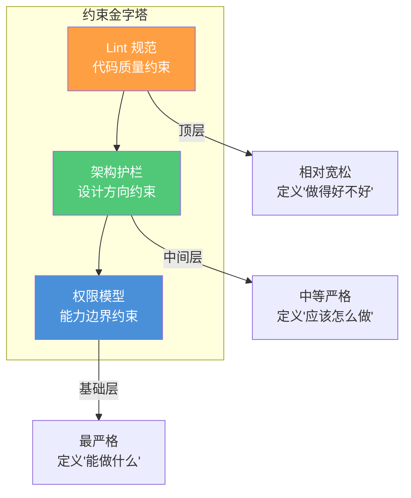
```mermaid
graph TB
    subgraph 约束金字塔
        A[Lint 规范<br/>代码质量约束]
        B[架构护栏<br/>设计方向约束]
        C[权限模型<br/>能力边界约束]
    end

    A --> B
    B --> C

    C --> |基础层| D["最严格<br/>定义'能做什么'"]
    B --> |中间层| E["中等严格<br/>定义'应该怎么做'"]
    A --> |顶层| F["相对宽松<br/>定义'做得好不好'"]

    style C fill:#4A90D9,color:#fff
    style B fill:#50C878,color:#fff
    style A fill:#FF9F43,color:#fff
```

**金字塔原则**：

- **底层约束决定上层边界**：权限模型禁止的操作，架构护栏和 Lint 规范无需再检查
- **上层约束补充下层不足**：权限允许的操作，仍需符合架构规范和代码质量要求
- **越底层越严格**：权限约束是硬性边界，架构约束是方向指导，Lint 约束是质量要求

---

## 二、权限模型

### 2.1 六种权限模式

OpenCode 提供六种权限模式，覆盖从"完全信任"到"完全禁止"的全部场景：

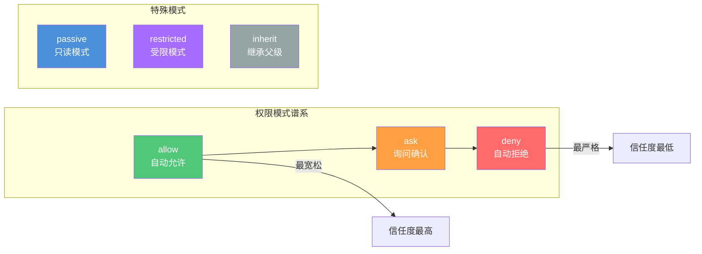
```mermaid
graph LR
    subgraph 权限模式谱系
        A[allow<br/>自动允许] --> B[ask<br/>询问确认]
        B --> C[deny<br/>自动拒绝]
    end

    subgraph 特殊模式
        D[passive<br/>只读模式]
        E[restricted<br/>受限模式]
        F[inherit<br/>继承父级]
    end

    A --> |最宽松| G[信任度最高]
    C --> |最严格| H[信任度最低]

    style A fill:#50C878,color:#fff
    style B fill:#FF9F43,color:#fff
    style C fill:#ff6b6b,color:#fff
    style D fill:#4A90D9,color:#fff
    style E fill:#A66CFF,color:#fff
    style F fill:#95a5a6,color:#fff
```

**六种权限模式详解**：

| 模式 | 行为 | 适用场景 | 安全等级 |
|------|------|---------|---------|
| **allow** | 自动允许，无需确认 | 安全操作（读取非敏感文件、运行测试） | 低风险 |
| **ask** | 每次询问用户确认 | 敏感操作（写入文件、执行命令） | 中风险 |
| **deny** | 自动拒绝，禁止执行 | 危险操作（删除文件、访问密钥） | 高风险 |
| **passive** | 只读模式，禁止所有写操作 | 安全审查、代码分析 | 审计专用 |
| **restricted** | 受限模式，仅允许白名单操作 | 生产环境、敏感项目 | 高安全 |
| **inherit** | 继承父级权限设置 | 模块化权限配置 | 可变 |

### 2.2 三级策略：allow/ask/deny

三级策略是权限控制的核心机制，决定了 Agent 执行操作的流程：

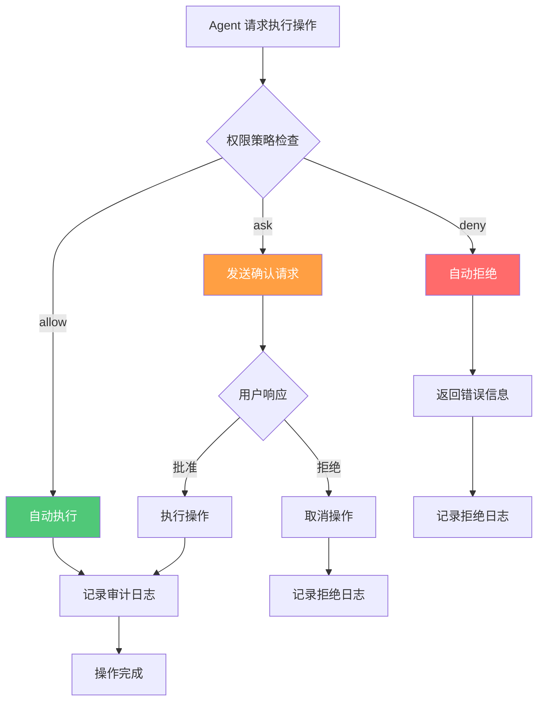
```mermaid
flowchart TB
    A[Agent 请求执行操作] --> B{权限策略检查}

    B -->|allow| C[自动执行]
    C --> D[记录审计日志]
    D --> E[操作完成]

    B -->|ask| F[发送确认请求]
    F --> G{用户响应}
    G -->|批准| H[执行操作]
    G -->|拒绝| I[取消操作]
    H --> D
    I --> J[记录拒绝日志]

    B -->|deny| K[自动拒绝]
    K --> L[返回错误信息]
    L --> M[记录拒绝日志]

    style C fill:#50C878,color:#fff
    style F fill:#FF9F43,color:#fff
    style K fill:#ff6b6b,color:#fff
```

**三级策略的配置示例**：

```json:examples/opencode-configs/permissions.jsonc
// Requires OpenCode >= v1.15.x, OMO >= v4.5.x
{
  "permissions": {
    "tools": {
      "read_file": "allow",
      "write_file": "ask",
      "delete_file": "deny",
      "execute_command": "ask",
      "network_request": "deny"
    },
    "paths": {
      "src/**": "allow",
      "test/**": "allow",
      ".env": "deny",
      "config/secrets/**": "deny"
    },
    "commands": {
      "npm test": "allow",
      "npm run build": "allow",
      "rm -rf": "deny",
      "sudo *": "deny"
    }
  }
}
```

### 2.3 工具级与文件级权限控制

权限控制可以在不同粒度上实施：

**工具级权限控制**：

| 工具类别 | 工具名称 | 推荐策略 | 理由 |
|---------|---------|---------|------|
| **文件读取** | read_file | allow | 读取操作风险低 |
| **文件写入** | write_file | ask | 需确认修改内容 |
| **文件删除** | delete_file | deny | 高风险操作 |
| **命令执行** | execute_command | ask | 需确认命令内容 |
| **网络访问** | network_request | deny | 防止数据外泄 |
| **代码搜索** | search_code | allow | 只读操作 |

**文件级权限控制**：

```json:examples/opencode-configs/path-permissions.jsonc
{
  "pathPermissions": {
    "src/": {
      "read": "allow",
      "write": "ask",
      "delete": "deny"
    },
    "test/": {
      "read": "allow",
      "write": "allow",
      "delete": "ask"
    },
    ".env": {
      "read": "deny",
      "write": "deny",
      "delete": "deny"
    },
    "config/secrets/": {
      "read": "deny",
      "write": "deny",
      "delete": "deny"
    },
    "node_modules/": {
      "read": "allow",
      "write": "deny",
      "delete": "deny"
    }
  }
}
```

### 2.4 Passive 模式的安全审查价值

**Passive 模式**是一种特殊的权限模式，Agent 以只读方式运行，禁止所有写操作。这在安全审查场景中极具价值：

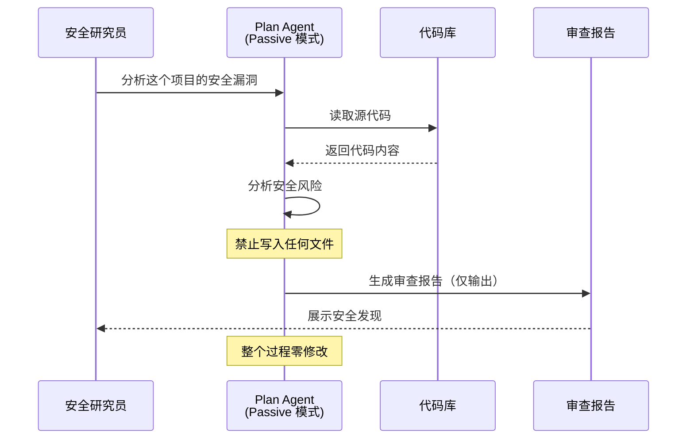
```mermaid
sequenceDiagram
    participant User as 安全研究员
    participant Agent as Plan Agent<br/>(Passive 模式)
    participant Code as 代码库
    participant Report as 审查报告

    User->>Agent: 分析这个项目的安全漏洞
    Agent->>Code: 读取源代码
    Code-->>Agent: 返回代码内容
    Agent->>Agent: 分析安全风险
    Note over Agent: 禁止写入任何文件
    Agent->>Report: 生成审查报告（仅输出）
    Report-->>User: 展示安全发现

    Note over Agent: 整个过程零修改
```

**Passive 模式的典型应用场景**：

1. **安全审计**：分析代码漏洞，不修改任何文件
2. **架构评审**：评估架构设计，输出建议报告
3. **代码审查**：检查代码质量，生成审查意见
4. **依赖分析**：分析依赖关系，识别风险组件

**Passive 模式的配置**：

```json:examples/opencode-configs/passive-mode.jsonc
{
  "agent": {
    "mode": "passive",
    "allowedOperations": ["read", "search", "analyze"],
    "deniedOperations": ["write", "delete", "execute", "network"]
  }
}
```

---

## 三、架构护栏

### 3.1 什么是架构护栏

架构护栏（Architecture Guardrails）是一套约束 Agent 架构决策的规则体系。它不关心"代码写得对不对"（这是 Lint 的职责），而是关心"架构方向对不对"。

**为什么需要架构护栏？**

没有架构护栏的 Agent 可能生成"能运行但架构混乱"的代码：

```javascript
// Agent 生成的代码：功能正确，架构混乱
// 所有逻辑堆在一个文件里，没有分层
// user-controller.js
export async function handleUserRequest(req, res) {
    // 直接在这里写数据库操作
    const connection = await mysql.createConnection(config);
    const [users] = await connection.execute('SELECT * FROM users');
    // 直接在这里写业务逻辑
    const processedUsers = users.map(u => ({
        ...u,
        displayName: u.first_name + ' ' + u.last_name
    }));
    // 直接在这里写响应格式化
    res.json({
        success: true,
        data: processedUsers,
        timestamp: new Date().toISOString()
    });
}
```

有架构护栏的 Agent 会遵循项目架构规范：

```javascript
// Agent 生成的代码：功能正确，架构清晰
// controllers/user-controller.js
export class UserController {
    constructor(userService) {
        this.userService = userService;
    }
    async handleGetUsers(req, res) {
        const users = await this.userService.getAllUsers();
        res.json(UserResponseFormatter.format(users));
    }
}

// services/user-service.js
export class UserService {
    constructor(userRepository) {
        this.userRepository = userRepository;
    }
    async getAllUsers() {
        return this.userRepository.findAll();
    }
}

// repositories/user-repository.js
export class UserRepository {
    async findAll() {
        return db.query('SELECT * FROM users');
    }
}
```

### 3.2 AGENTS.md 作为架构护栏载体

**AGENTS.md** 是 OpenCode 的项目指令文件，它告诉 Agent 这个项目的架构规范、技术栈、约束条件。这是实现架构护栏的核心载体。

**AGENTS.md 的典型结构**：

```markdown:AGENTS.md
# 项目架构规范

## 技术栈
- 后端：Node.js + Express + TypeScript
- 数据库：PostgreSQL + Prisma ORM
- 前端：React + TypeScript + Tailwind CSS

## 架构分层
项目采用三层架构，Agent 生成代码时必须遵循：

### Controller 层（controllers/）
- 只负责 HTTP 请求处理
- 调用 Service 层处理业务逻辑
- 不直接访问数据库

### Service 层（services/）
- 封装业务逻辑
- 调用 Repository 层访问数据
- 不直接处理 HTTP 请求/响应

### Repository 层（repositories/）
- 封装数据库操作
- 使用 Prisma Client
- 不包含业务逻辑

## API 路径约定
- RESTful 风格
- 路径前缀：/api/v1/
- 命名规范：kebab-case

## 禁止事项
- 禁止在 Controller 中直接写 SQL
- 禁止在 Service 中处理 HTTP 响应格式化
- 禁止跳过 Repository 直接访问数据库
```

### 3.3 架构护栏实战示例

**示例一：规范 Service/Repository 层生成规则**

当用户请求"添加用户登录功能"时，有架构护栏的 Agent 会：

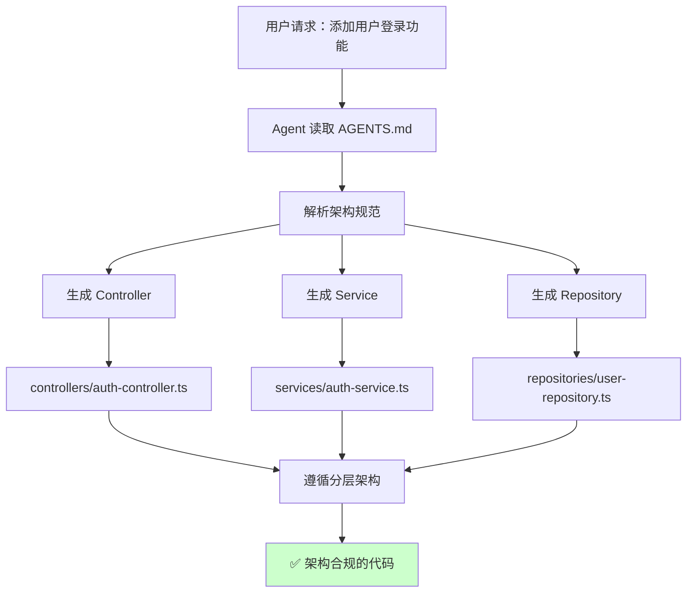
```mermaid
flowchart TB
    A[用户请求：添加用户登录功能] --> B[Agent 读取 AGENTS.md]
    B --> C[解析架构规范]

    C --> D[生成 Controller]
    C --> E[生成 Service]
    C --> F[生成 Repository]

    D --> D1[controllers/auth-controller.ts]
    E --> E1[services/auth-service.ts]
    F --> F1[repositories/user-repository.ts]

    D1 --> G[遵循分层架构]
    E1 --> G
    F1 --> G

    G --> H[✅ 架构合规的代码]

    style H fill:#ccffcc
```

**示例二：API 路径约定**

```markdown:AGENTS.md
## API 路径约定

### RESTful 规范
- GET /api/v1/users - 获取用户列表
- GET /api/v1/users/:id - 获取单个用户
- POST /api/v1/users - 创建用户
- PUT /api/v1/users/:id - 更新用户
- DELETE /api/v1/users/:id - 删除用户

### 命名规范
- 路径使用 kebab-case：/api/v1/user-profiles
- 禁止使用 camelCase：/api/v1/userProfiles ❌
- 禁止使用 snake_case：/api/v1/user_profiles ❌
```

### 3.4 架构护栏与权限模型的协作

架构护栏与权限模型形成双层约束：

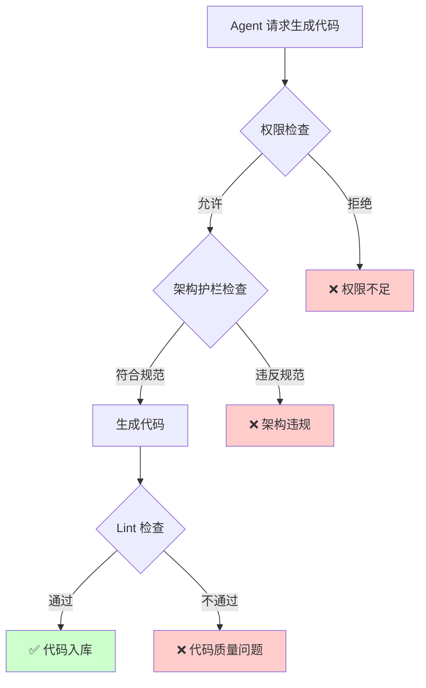
```mermaid
flowchart TB
    A[Agent 请求生成代码] --> B{权限检查}
    B -->|允许| C{架构护栏检查}
    B -->|拒绝| D[❌ 权限不足]

    C -->|符合规范| E[生成代码]
    C -->|违反规范| F[❌ 架构违规]

    E --> G{Lint 检查}
    G -->|通过| H[✅ 代码入库]
    G -->|不通过| I[❌ 代码质量问题]

    style H fill:#ccffcc
    style D fill:#ffcccc
    style F fill:#ffcccc
    style I fill:#ffcccc
```

---

## 四、Lint 规则约束

### 4.1 LSP 诊断自动约束

**LSP（Language Server Protocol）** 诊断是约束 Agent 输出的第一道质量门禁。当 Agent 生成代码后，LSP 会自动检查语法错误、类型错误、潜在问题。

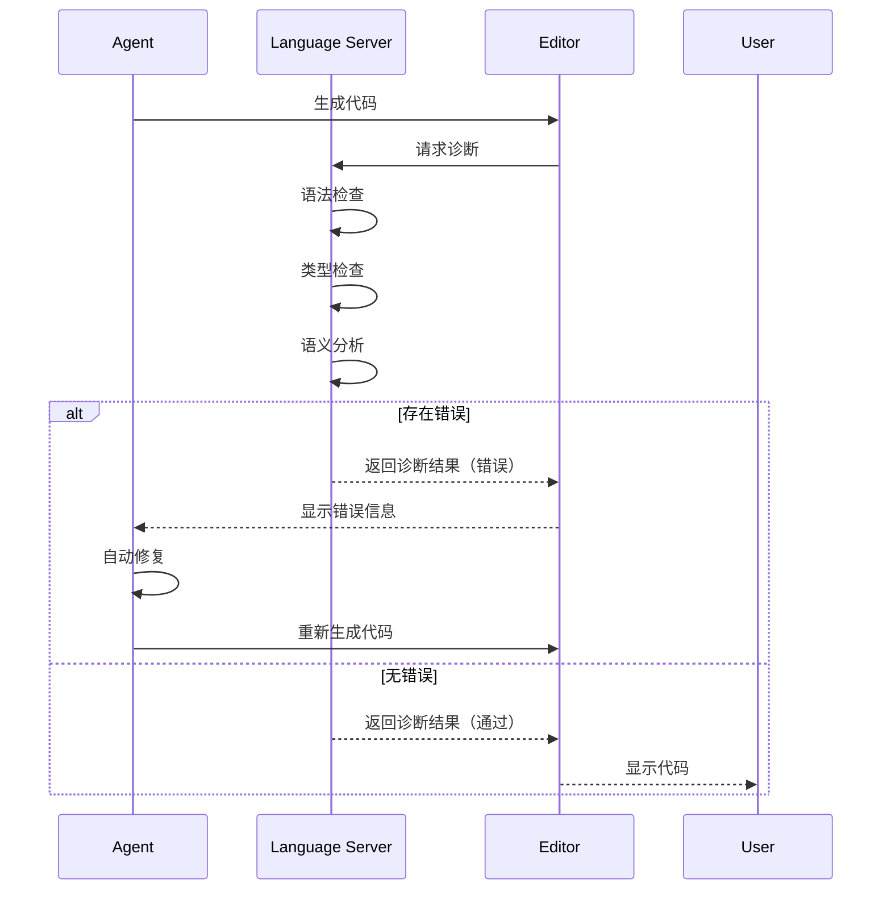
```mermaid
sequenceDiagram
    participant Agent
    participant LSP as Language Server
    participant Editor
    participant User

    Agent->>Editor: 生成代码
    Editor->>LSP: 请求诊断
    LSP->>LSP: 语法检查
    LSP->>LSP: 类型检查
    LSP->>LSP: 语义分析

    alt 存在错误
        LSP-->>Editor: 返回诊断结果（错误）
        Editor-->>Agent: 显示错误信息
        Agent->>Agent: 自动修复
        Agent->>Editor: 重新生成代码
    else 无错误
        LSP-->>Editor: 返回诊断结果（通过）
        Editor-->>User: 显示代码
    end
```

**LSP 诊断能力矩阵**：

| 语言 | LSP 实现 | 诊断能力 |
|------|---------|---------|
| **TypeScript** | tsserver | 语法、类型、语义 |
| **Python** | Pylance/pyright | 语法、类型、导入 |
| **Go** | gopls | 语法、类型、格式 |
| **Rust** | rust-analyzer | 语法、类型、借用检查 |
| **Java** | jdtls | 语法、类型、风格 |

### 4.2 AST-grep 模式匹配

**AST-grep** 是一种基于抽象语法树（AST）的模式匹配工具，可以检测代码中的特定模式并自动修复。它比正则表达式更精确，因为它理解代码结构。

**AST-grep 规则示例**：

```yaml:examples/ast-grep-rules/no-direct-sql.yaml
# 规则：禁止在 Controller 中直接写 SQL
id: no-direct-sql-in-controller
language: typescript
severity: error
message: "Controller 中禁止直接执行 SQL，请使用 Repository 层"

rule:
  pattern: |
    await $CONNECTION.execute($SQL)

  kind: call_expression

constraints:
  SQL:
    regex: "^['\"`].*SELECT|INSERT|UPDATE|DELETE.*['\"`]$"

files:
  include: ["controllers/**/*.ts"]
  exclude: ["repositories/**/*.ts"]
```

**AST-grep 检测流程**：

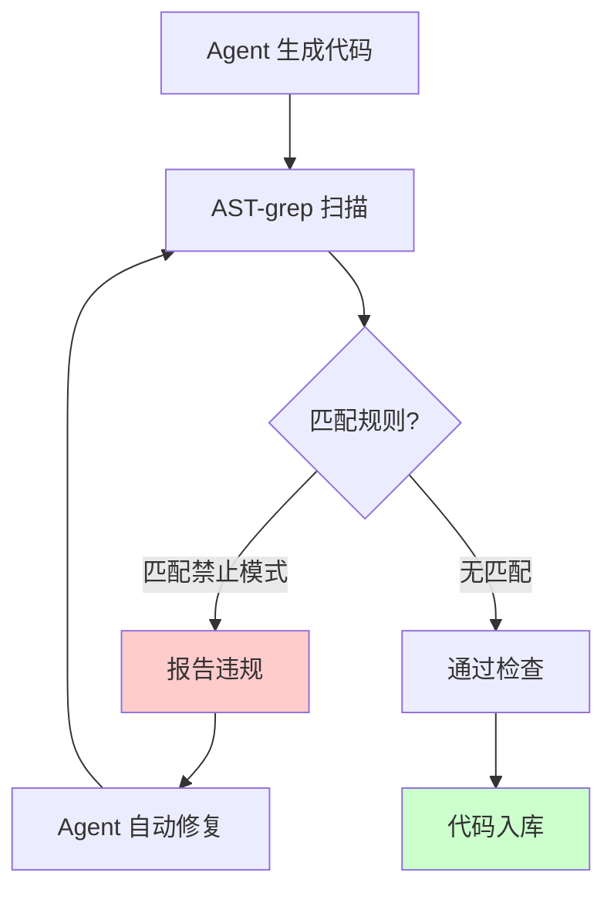
```mermaid
flowchart TB
    A[Agent 生成代码] --> B[AST-grep 扫描]
    B --> C{匹配规则?}

    C -->|匹配禁止模式| D[报告违规]
    D --> E[Agent 自动修复]
    E --> B

    C -->|无匹配| F[通过检查]
    F --> G[代码入库]

    style D fill:#ffcccc
    style G fill:#ccffcc
```

### 4.3 Code Review 作为人工约束

自动化约束无法覆盖所有场景，**Code Review** 是人工约束的最后环节：

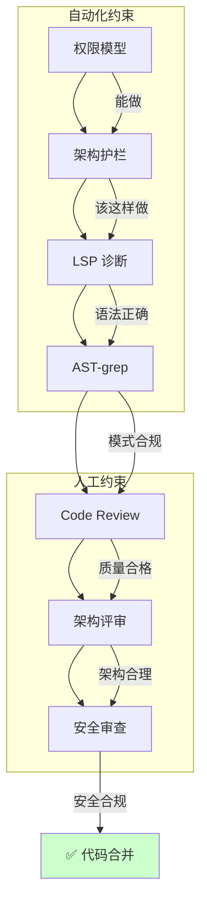
```mermaid
graph TB
    subgraph 自动化约束
        A1[权限模型]
        A2[架构护栏]
        A3[LSP 诊断]
        A4[AST-grep]
    end

    subgraph 人工约束
        B1[Code Review]
        B2[架构评审]
        B3[安全审查]
    end

    A1 --> A2 --> A3 --> A4 --> B1
    B1 --> B2 --> B3

    A1 --> |"能做"| A2
    A2 --> |"该这样做"| A3
    A3 --> |"语法正确"| A4
    A4 --> |"模式合规"| B1
    B1 --> |"质量合格"| B2
    B2 --> |"架构合理"| B3
    B3 --> |"安全合规"| C[✅ 代码合并]

    style C fill:#ccffcc
```

**Code Review 检查清单**：

| 检查维度 | 检查项 | 自动化程度 |
|---------|--------|-----------|
| **功能正确性** | 是否满足需求？ | 部分自动化（测试覆盖） |
| **架构合规性** | 是否遵循分层架构？ | 部分自动化（AST-grep） |
| **代码可读性** | 命名是否清晰？ | 人工检查 |
| **性能影响** | 是否有性能问题？ | 部分自动化（性能测试） |
| **安全风险** | 是否有安全漏洞？ | 部分自动化（安全扫描） |

---

## 五、约束的层级结构

### 5.1 三层约束模型

约束系统采用三层结构，从全局到任务逐级细化：

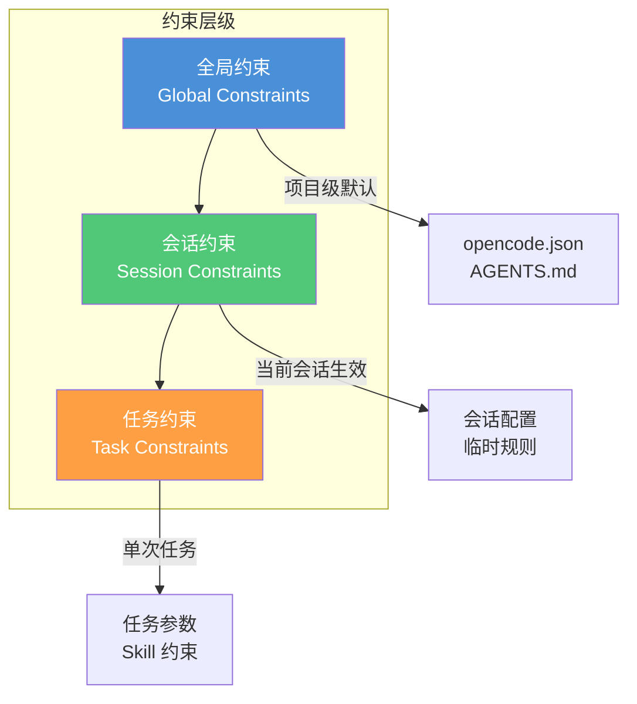
```mermaid
graph TB
    subgraph 约束层级
        A[全局约束<br/>Global Constraints]
        B[会话约束<br/>Session Constraints]
        C[任务约束<br/>Task Constraints]
    end

    A --> B --> C

    A --> |"项目级默认"| D["opencode.json<br/>AGENTS.md"]
    B --> |"当前会话生效"| E["会话配置<br/>临时规则"]
    C --> |"单次任务"| F["任务参数<br/>Skill 约束"]

    style A fill:#4A90D9,color:#fff
    style B fill:#50C878,color:#fff
    style C fill:#FF9F43,color:#fff
```

**三层约束详解**：

| 层级 | 作用范围 | 生效时机 | 配置载体 |
|------|---------|---------|---------|
| **全局约束** | 整个项目 | 项目加载时 | opencode.json、AGENTS.md |
| **会话约束** | 当前会话 | 会话启动时 | 会话参数、环境变量 |
| **任务约束** | 单次任务 | 任务执行时 | Skill 配置、命令参数 |

### 5.2 冲突检测与优先级裁定

当不同层级的约束发生冲突时，系统按以下规则裁定：

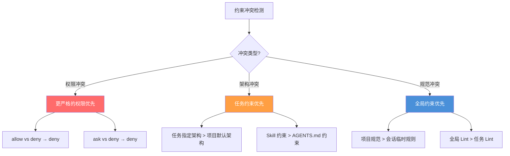
```mermaid
flowchart TB
    A[约束冲突检测] --> B{冲突类型?}

    B -->|权限冲突| C[更严格的权限优先]
    B -->|架构冲突| D[任务约束优先]
    B -->|规范冲突| E[全局约束优先]

    C --> C1["allow vs deny → deny"]
    C --> C2["ask vs deny → deny"]

    D --> D1["任务指定架构 > 项目默认架构"]
    D --> D2["Skill 约束 > AGENTS.md 约束"]

    E --> E1["项目规范 > 会话临时规则"]
    E --> E2["全局 Lint > 任务 Lint"]

    style C fill:#ff6b6b,color:#fff
    style D fill:#FF9F43,color:#fff
    style E fill:#4A90D9,color:#fff
```

**优先级规则总结**：

1. **安全优先原则**：涉及安全的冲突，始终选择更严格的约束
2. **任务优先原则**：架构和规范冲突，任务级约束优先
3. **显式优先原则**：显式配置优先于隐式继承

---

## 六、威胁建模分析

### 6.1 STRIDE 威胁建模方法

**STRIDE** 是微软提出的安全威胁分类框架，用于系统性地识别和分析安全威胁。我们使用 STRIDE 方法分析攻击者可能如何绕过约束系统：

| 威胁类型 | 英文全称 | 中文含义 | 在约束系统中的体现 |
|---------|---------|---------|------------------|
| **S** | Spoofing | 身份欺骗 | 伪造 Agent 身份绕过权限 |
| **T** | Tampering | 数据篡改 | 篡改权限配置文件 |
| **R** | Repudiation | 否认 | 否认执行过危险操作 |
| **I** | Information Disclosure | 信息泄露 | 通过约束漏洞读取敏感文件 |
| **D** | Denial of Service | 拒绝服务 | 耗尽权限检查资源 |
| **E** | Elevation of Privilege | 权限提升 | 从低权限提升到高权限 |

### 6.2 典型攻击场景分析

**场景一：权限提升攻击（Elevation of Privilege）**

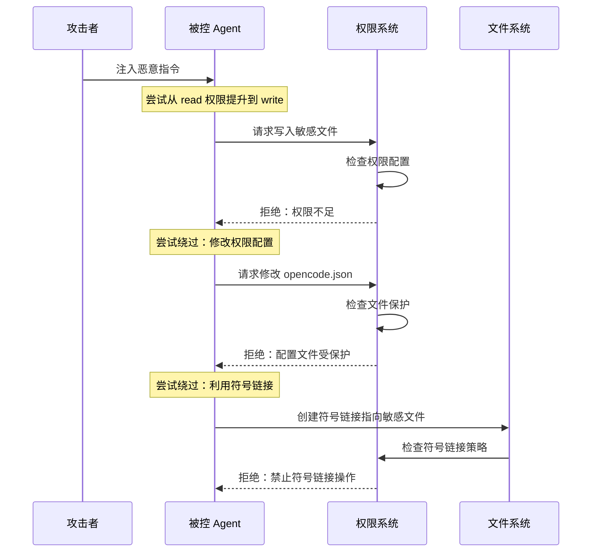
```mermaid
sequenceDiagram
    participant Attacker as 攻击者
    participant Agent as 被控 Agent
    participant Permission as 权限系统
    participant FS as 文件系统

    Attacker->>Agent: 注入恶意指令
    Note over Agent: 尝试从 read 权限提升到 write

    Agent->>Permission: 请求写入敏感文件
    Permission->>Permission: 检查权限配置
    Permission-->>Agent: 拒绝：权限不足

    Note over Agent: 尝试绕过：修改权限配置

    Agent->>Permission: 请求修改 opencode.json
    Permission->>Permission: 检查文件保护
    Permission-->>Agent: 拒绝：配置文件受保护

    Note over Agent: 尝试绕过：利用符号链接

    Agent->>FS: 创建符号链接指向敏感文件
    FS->>Permission: 检查符号链接策略
    Permission-->>Agent: 拒绝：禁止符号链接操作
```

**防御策略**：

1. **配置文件保护**：权限配置文件本身受最高级别保护
2. **符号链接检测**：解析真实路径，防止符号链接绕过
3. **权限边界隔离**：Agent 无法修改自己的权限配置

**场景二：配置篡改攻击（Tampering）**

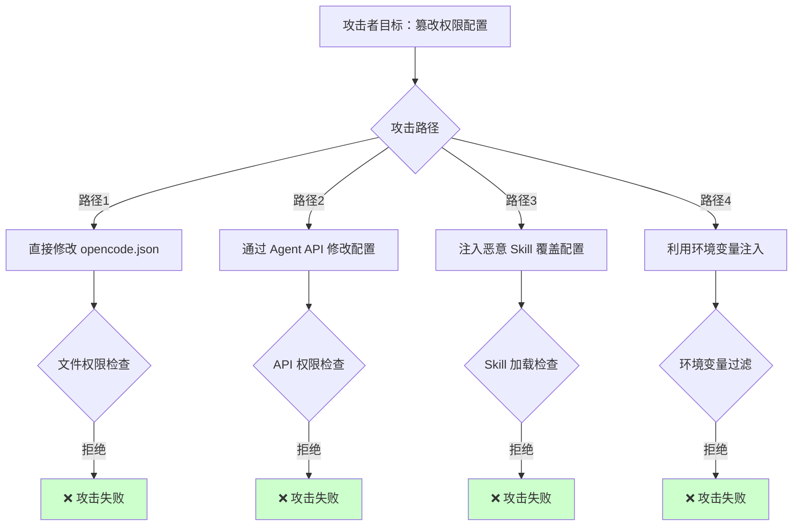
```mermaid
flowchart TB
    A[攻击者目标：篡改权限配置] --> B{攻击路径}

    B -->|路径1| C[直接修改 opencode.json]
    C --> C1{文件权限检查}
    C1 -->|拒绝| C2[❌ 攻击失败]

    B -->|路径2| D[通过 Agent API 修改配置]
    D --> D1{API 权限检查}
    D1 -->|拒绝| D2[❌ 攻击失败]

    B -->|路径3| E[注入恶意 Skill 覆盖配置]
    E --> E1{Skill 加载检查}
    E1 -->|拒绝| E2[❌ 攻击失败]

    B -->|路径4| F[利用环境变量注入]
    F --> F1{环境变量过滤}
    F1 -->|拒绝| F2[❌ 攻击失败]

    style C2 fill:#ccffcc
    style D2 fill:#ccffcc
    style E2 fill:#ccffcc
    style F2 fill:#ccffcc
```

**防御策略**：

1. **配置签名验证**：配置文件需要签名，防止篡改
2. **API 权限隔离**：配置修改 API 需要管理员权限
3. **Skill 沙箱隔离**：Skill 在沙箱中运行，无法访问配置
4. **环境变量过滤**：过滤危险的环境变量注入

**场景三：信息泄露攻击（Information Disclosure）**

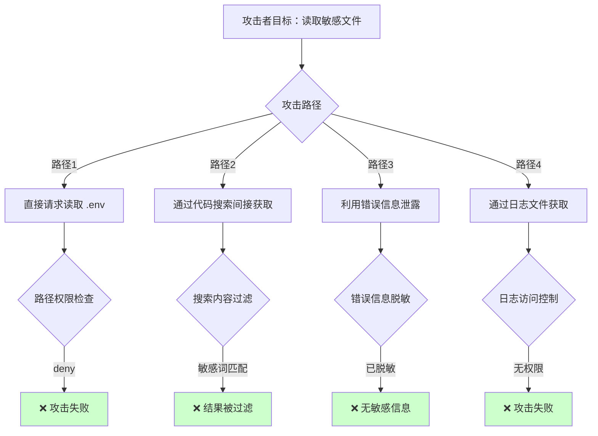
```mermaid
flowchart TB
    A[攻击者目标：读取敏感文件] --> B{攻击路径}

    B -->|路径1| C[直接请求读取 .env]
    C --> C1{路径权限检查}
    C1 -->|deny| C2[❌ 攻击失败]

    B -->|路径2| D[通过代码搜索间接获取]
    D --> D1{搜索内容过滤}
    D1 -->|敏感词匹配| D2[❌ 结果被过滤]

    B -->|路径3| E[利用错误信息泄露]
    E --> E1{错误信息脱敏}
    E1 -->|已脱敏| E2[❌ 无敏感信息]

    B -->|路径4| F[通过日志文件获取]
    F --> F1{日志访问控制}
    F1 -->|无权限| F2[❌ 攻击失败]

    style C2 fill:#ccffcc
    style D2 fill:#ccffcc
    style E2 fill:#ccffcc
    style F2 fill:#ccffcc
```

**防御策略**：

1. **敏感路径黑名单**：.env、secrets/、credentials/ 等路径默认 deny
2. **搜索内容过滤**：搜索结果自动过滤敏感信息（密钥、密码）
3. **错误信息脱敏**：错误信息不包含敏感路径和内容
4. **日志访问控制**：日志文件需要管理员权限访问

### 6.3 约束系统的纵深防御

约束系统采用纵深防御策略，多层保护确保安全：

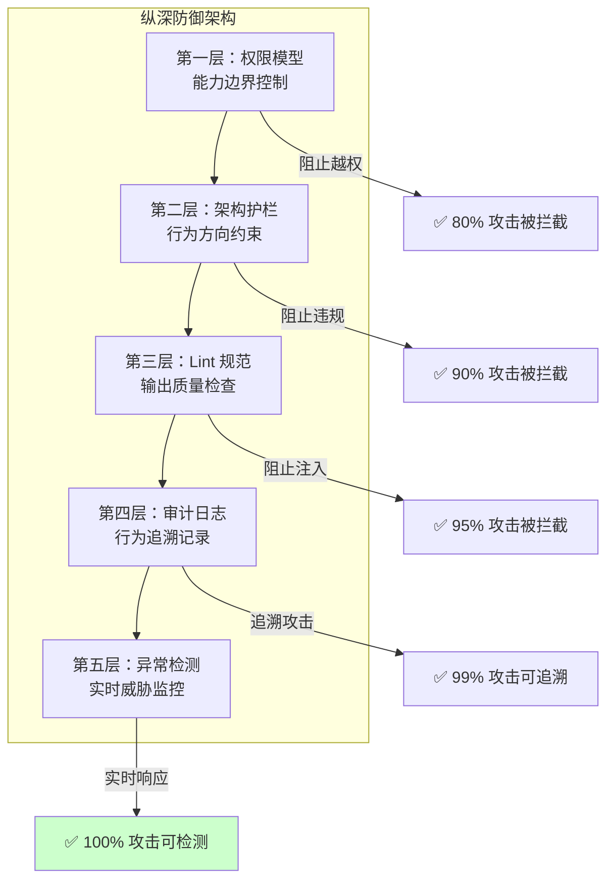
```mermaid
graph TB
    subgraph 纵深防御架构
        L1[第一层：权限模型<br/>能力边界控制]
        L2[第二层：架构护栏<br/>行为方向约束]
        L3[第三层：Lint 规范<br/>输出质量检查]
        L4[第四层：审计日志<br/>行为追溯记录]
        L5[第五层：异常检测<br/>实时威胁监控]
    end

    L1 --> L2 --> L3 --> L4 --> L5

    L1 --> |"阻止越权"| A1[✅ 80% 攻击被拦截]
    L2 --> |"阻止违规"| A2[✅ 90% 攻击被拦截]
    L3 --> |"阻止注入"| A3[✅ 95% 攻击被拦截]
    L4 --> |"追溯攻击"| A4[✅ 99% 攻击可追溯]
    L5 --> |"实时响应"| A5[✅ 100% 攻击可检测]

    style A5 fill:#ccffcc
```

**纵深防御原则**：

1. **没有银弹**：没有任何单一防御措施能阻止所有攻击
2. **层层设防**：每一层防御都能拦截部分攻击
3. **防御多样性**：不同层使用不同的防御机制
4. **失败安全**：任一层失效时，其他层仍能提供保护

### 6.4 威胁建模总结

| STRIDE 威胁 | 在约束系统中的风险 | 防御措施 |
|------------|------------------|---------|
| **身份欺骗** | 伪造 Agent 身份 | Agent 身份认证、会话令牌验证 |
| **数据篡改** | 篡改权限配置 | 配置签名、文件保护、审计日志 |
| **否认** | 否认执行操作 | 完整审计日志、操作签名 |
| **信息泄露** | 读取敏感文件 | 路径黑名单、内容过滤、访问控制 |
| **拒绝服务** | 耗尽系统资源 | 资源配额、请求限流、超时控制 |
| **权限提升** | 从低权限到高权限 | 权限边界隔离、配置保护 |

---

## 七、约束系统最佳实践

### 7.1 约束设计原则

**原则一：最小权限原则（Principle of Least Privilege）**

只授予 Agent 完成任务所需的最小权限，不多给一分。

```json:examples/opencode-configs/least-privilege.jsonc
// Requires OpenCode >= v1.15.x, OMO >= v4.5.x
{
  "permissions": {
    "tools": {
      "read_file": "allow",
      "write_file": "ask",
      "delete_file": "deny",
      "execute_command": "ask"
    },
    "paths": {
      "src/**": "allow",
      "test/**": "allow",
      ".env": "deny",
      "secrets/**": "deny"
    }
  }
}
```

**原则二：默认拒绝原则（Default Deny）**

未知操作默认拒绝，只有明确允许的操作才能执行。

```json:examples/opencode-configs/default-deny.jsonc
{
  "permissions": {
    "defaultAction": "deny",
    "allowedTools": [
      "read_file",
      "search_code",
      "write_file"
    ],
    "deniedTools": [
      "delete_file",
      "network_request",
      "execute_shell"
    ]
  }
}
```

**原则三：职责分离原则（Separation of Duties）**

不同职责的 Agent 使用不同的权限配置，避免权限集中。

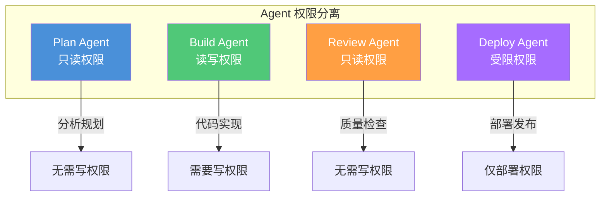
```mermaid
graph TB
    subgraph Agent 权限分离
        A1[Plan Agent<br/>只读权限]
        A2[Build Agent<br/>读写权限]
        A3[Review Agent<br/>只读权限]
        A4[Deploy Agent<br/>受限权限]
    end

    A1 --> |"分析规划"| B1[无需写权限]
    A2 --> |"代码实现"| B2[需要写权限]
    A3 --> |"质量检查"| B3[无需写权限]
    A4 --> |"部署发布"| B4[仅部署权限]

    style A1 fill:#4A90D9,color:#fff
    style A2 fill:#50C878,color:#fff
    style A3 fill:#FF9F43,color:#fff
    style A4 fill:#A66CFF,color:#fff
```

### 7.2 约束配置模板

**模板一：开发环境配置**

```json:examples/opencode-configs/dev-permissions.jsonc
{
  "environment": "development",
  "permissions": {
    "tools": {
      "read_file": "allow",
      "write_file": "ask",
      "delete_file": "ask",
      "execute_command": "ask",
      "network_request": "allow"
    },
    "paths": {
      "src/**": "allow",
      "test/**": "allow",
      "docs/**": "allow",
      ".env.local": "deny"
    },
    "commands": {
      "npm *": "allow",
      "git *": "ask",
      "docker *": "ask"
    }
  }
}
```

**模板二：生产环境配置**

```json:examples/opencode-configs/prod-permissions.jsonc
{
  "environment": "production",
  "permissions": {
    "tools": {
      "read_file": "ask",
      "write_file": "deny",
      "delete_file": "deny",
      "execute_command": "deny",
      "network_request": "deny"
    },
    "paths": {
      "**": "ask",
      "secrets/**": "deny",
      "config/**": "deny"
    },
    "commands": {
      "*": "deny"
    }
  },
  "audit": {
    "enabled": true,
    "logLevel": "verbose",
    "retentionDays": 365
  }
}
```

### 7.3 约束系统演进建议

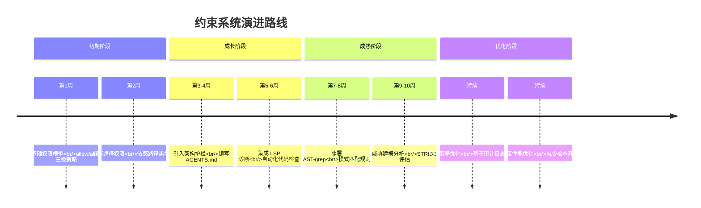
```mermaid
timeline
    title 约束系统演进路线
    section 初期阶段
        第1周 : 建立基础权限模型<br/>allow/ask/deny 三级策略
        第2周 : 配置路径权限<br/>敏感路径黑名单
    section 成长阶段
        第3-4周 : 引入架构护栏<br/>编写 AGENTS.md
        第5-6周 : 集成 LSP 诊断<br/>自动化代码检查
    section 成熟阶段
        第7-8周 : 部署 AST-grep<br/>模式匹配规则
        第9-10周 : 威胁建模分析<br/>STRIDE 评估
    section 优化阶段
        持续 : 权限策略优化<br/>基于审计日志调整
        持续 : 约束性能优化<br/>减少检查开销
```

---

## 八、反面案例：没有约束系统会发生什么

理论讲得再多，不如一个真实事故让人警醒。以下是两个真实发生的（已脱敏）生产事故，它们都源于约束系统的缺失或配置不当。

### 8.1 案例：生产数据库误删事故

**事故背景**

2024 年某初创公司，团队规模 5 人，使用 AI 编程助手加速开发。项目没有配置任何权限约束，Agent 以"完全信任"模式运行。

**事故经过**

```
时间线：
14:32  开发者在聊天中说："帮我清理一下测试数据库的旧数据"
14:33  Agent 理解为：删除测试数据库
14:34  Agent 执行命令：DROP DATABASE production;  -- 误连到生产库
14:35  生产服务全部报错，用户无法访问
14:40  运维发现数据库消失，开始紧急恢复
16:30  从备份恢复完成，损失 2 小时数据
```

**问题分析**

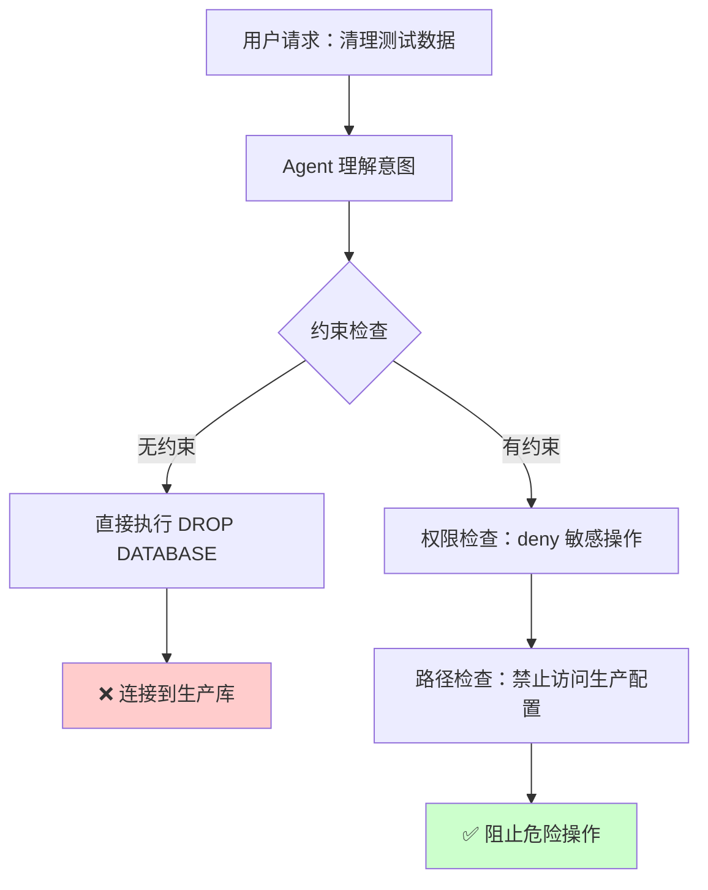
```mermaid
flowchart TB
    A[用户请求：清理测试数据] --> B[Agent 理解意图]
    B --> C{约束检查}
    C -->|无约束| D[直接执行 DROP DATABASE]
    D --> E[❌ 连接到生产库]

    C -->|有约束| F[权限检查：deny 敏感操作]
    F --> G[路径检查：禁止访问生产配置]
    G --> H[✅ 阻止危险操作]

    style E fill:#ffcccc
    style H fill:#ccffcc
```

**根因分析**：

| 问题 | 具体表现 | 缺失的约束 |
|------|---------|-----------|
| **环境隔离缺失** | Agent 能访问生产环境配置 | 路径权限：`config/prod/**: deny` |
| **危险操作无门禁** | `DROP DATABASE` 直接执行 | 命令权限：`DROP *: deny` |
| **无操作预览** | 没有确认要执行的 SQL | 权限模式：`ask` 而非 `allow` |
| **连接池共享** | 测试和生产共用连接配置 | 环境变量隔离 |

**正确的约束配置**：

```json:examples/opencode-configs/database-safety.jsonc
{
  "permissions": {
    "tools": {
      "execute_command": "ask"
    },
    "commands": {
      "DROP *": "deny",
      "TRUNCATE *": "deny",
      "DELETE FROM *": "ask"
    },
    "paths": {
      "config/prod/**": "deny",
      ".env.production": "deny"
    },
    "database": {
      "production": {
        "read": "ask",
        "write": "deny",
        "ddl": "deny"
      }
    }
  },
  "preview": {
    "enabled": true,
    "dangerousOperations": ["DROP", "TRUNCATE", "DELETE"]
  }
}
```

**事故损失**：

- 直接损失：2 小时服务中断，约 5000 用户受影响
- 数据损失：2 小时交易数据丢失，需人工补录
- 信任损失：用户投诉激增，品牌形象受损
- 人力损失：团队 2 天时间用于事故处理和复盘

### 8.2 案例：密钥泄露导致云账户被盗

**事故背景**

2024 年某 SaaS 公司，开发者让 Agent 帮忙"检查一下配置文件有没有问题"。Agent 读取了 `.env` 文件，发现里面有 AWS 密钥，然后在日志中输出了完整内容。日志被上传到公开的调试平台，导致 AWS 账户被盗用。

**事故经过**

```
时间线：
09:15  开发者：帮我检查配置文件有没有问题
09:16  Agent：读取 .env 文件（包含 AWS_ACCESS_KEY_ID 和 AWS_SECRET_ACCESS_KEY）
09:17  Agent：在日志中输出配置内容以便"展示问题"
09:18  开发者将日志粘贴到公开的 Pastebin 寻求帮助
09:30  攻击者发现泄露的密钥，开始挖矿
12:00  AWS 账单告警：异常高额费用
14:00  确认账户被盗，紧急冻结密钥
```

**问题分析**

```mermaid
sequenceDiagram
    participant Dev as 开发者
    participant Agent as AI Agent
    participant Log as 日志系统
    participant Public as 公开平台
    participant Attacker as 攻击者

    Dev->>Agent: 检查配置文件
    Agent->>Agent: 读取 .env
    Note over Agent: 无敏感信息过滤
    Agent->>Log: 输出完整配置（含密钥）
    Log-->>Dev: 显示日志
    Dev->>Public: 粘贴日志求助
    Public-->>Attacker: 攻击者发现密钥
    Attacker->>Attacker: 使用密钥挖矿
```

**根因分析**：

| 问题 | 具体表现 | 缺失的约束 |
|------|---------|-----------|
| **敏感文件无保护** | `.env` 文件可被随意读取 | 路径权限：`.env: deny` |
| **输出无过滤** | 日志直接输出敏感信息 | 输出过滤：密钥模式匹配 |
| **无安全意识** | 开发者不知道日志包含密钥 | 安全培训 + Agent 警告 |

**正确的约束配置**：

```json:examples/opencode-configs/secrets-protection.jsonc
{
  "permissions": {
    "paths": {
      ".env": "deny",
      ".env.*": "deny",
      "secrets/**": "deny",
      "credentials/**": "deny",
      "*_key*": "deny",
      "*_secret*": "deny"
    }
  },
  "outputFilter": {
    "enabled": true,
    "patterns": [
      "AWS_ACCESS_KEY_ID=*",
      "AWS_SECRET_ACCESS_KEY=*",
      "PRIVATE_KEY*",
      "PASSWORD=*",
      "API_KEY=*"
    ],
    "replacement": "[REDACTED]"
  },
  "warnings": {
    "sensitiveFileAccess": "检测到敏感文件访问请求，已自动拒绝。如确需访问，请使用显式授权。"
  }
}
```

**事故损失**：

- 直接损失：AWS 账单 $12,000（挖矿费用）
- 时间损失：4 小时紧急响应 + 密钥轮换
- 风险损失：潜在的数据泄露风险

### 8.3 两个事故的共同教训

```mermaid
graph TB
    subgraph 事故根因
        R1[权限约束缺失]
        R2[敏感路径未保护]
        R3[危险操作无门禁]
        R4[输出无安全过滤]
    end

    subgraph 防御措施
        D1[最小权限原则]
        D2[敏感路径黑名单]
        D3[危险操作 deny 策略]
        D4[输出内容过滤]
    end

    R1 --> D1
    R2 --> D2
    R3 --> D3
    R4 --> D4

    D1 --> P[✅ 事故可预防]
    D2 --> P
    D3 --> P
    D4 --> P

    style P fill:#ccffcc
```

**约束系统的价值量化**：

| 约束措施 | 实施成本 | 预防损失 | ROI |
|---------|---------|---------|-----|
| 敏感路径 deny | 5 分钟配置 | $12,000+ | 2400x+ |
| 危险命令 deny | 10 分钟配置 | 服务中断损失 | 100x+ |
| 输出过滤 | 15 分钟配置 | 数据泄露损失 | 50x+ |
| 操作预览 | 5 分钟配置 | 误操作损失 | 200x+ |

### 8.4 约束系统的"安全带"隐喻

约束系统就像汽车的安全带：

| 隐喻 | 安全带 | 约束系统 |
|------|--------|---------|
| **日常感知** | 有点麻烦，限制自由 | 有点繁琐，需要确认 |
| **事故时刻** | 救命的关键 | 阻止灾难的屏障 |
| **正确态度** | 系好安全带是习惯 | 配置约束是基本功 |
| **错误态度** | "我开车技术好，不需要" | "我小心使用，不需要" |

**记住**：约束系统不是在怀疑你的能力，而是在保护你免受不可预见的错误。就像安全带不是在怀疑你的驾驶技术，而是在保护你免受意外伤害。

---

## 反向思考：使用 AI 编程时的认知陷阱

为什么有时候明知道 AI 不可靠，还是忍不住直接用了它的输出？这不是技术问题，而是认知偏差在作祟。反面案例让我们看到了事故的后果，但更值得追问的是——事故发生之前，是什么让开发者放下了警惕？

以下是 AI 编程中最常见的四个"陷阱"：

**陷阱一：信任平滑** — AI 生成的代码看起来"挺专业的"，变量命名规范、注释齐全，你就会下意识觉得它是对的。漂亮的代码 ≠ 正确的代码。怎么避开：每次审查 AI 代码时，刻意怀疑写得最漂亮的那几行。

**陷阱二：确认偏误** — 你心里已经有答案，让 AI 帮你实现。AI 给出的方案就算有漏洞，你也会自动忽略，因为它"符合我的想法"。怎么避开：让没参与讨论的同事或另一个 Agent 做交叉审查。

**陷阱三：省力惯性** — "这个函数我自己写要 10 分钟，AI 10 秒就生成了，应该没问题吧？"省下的时间越多，你就越不愿意仔细检查。怎么避开：对 AI 生成速度越快的代码，投入等比例的审查时间——至少逐行阅读一遍。

**陷阱四：责任稀释** — 出 bug 时心想"是 AI 写的"，但代码是你提交的。AI 不会为事故负责，你会。怎么避开：提交前问自己一句："如果这是我自己一行行写的，我敢不敢上线？"

这些陷阱的共同解药只有一个：**把 AI 当实习生，不要当专家。** 实习生写的代码你会逐行 review，对 AI 的输出也该如此。

## 九、小结

约束系统是 Harness Engineering 的安全基石。通过权限模型、架构护栏、Lint 规范三大支柱，我们为 Agent 构建了一个"牢笼"——这个牢笼不是限制 Agent 的能力，而是让 Agent 在安全的边界内自由发挥。

**核心要点回顾**：

1. **权限模型**定义 Agent "能做什么"，是约束系统的基础层
2. **架构护栏**定义 Agent "应该怎么做"，是约束系统的方向层
3. **Lint 规范**定义 Agent "做得对不对"，是约束系统的质量层
4. **威胁建模**帮助我们识别和防御约束绕过攻击
5. **纵深防御**确保任一层失效时，其他层仍能提供保护

好的约束让 Agent 更高效而不是更慢。当 Agent 清楚知道自己的行为边界时，它可以更自信地执行任务，减少不必要的确认和回退。约束系统不是 Agent 的枷锁，而是 Agent 的安全带——让 Agent 在高速行驶时依然安全可控。

---

## 学习检查清单

完成本章学习后，请确认你能够：

- [ ] 解释约束系统三大支柱（权限模型、架构护栏、Lint 规范）的职责分工
- [ ] 区分六种权限模式（allow/ask/deny/passive/restricted/inherit）的适用场景
- [ ] 配置工具级与文件级的权限控制规则
- [ ] 编写 AGENTS.md 作为架构护栏载体
- [ ] 使用 STRIDE 威胁建模方法分析约束系统的安全风险
- [ ] 从反面案例中理解约束系统缺失的严重后果

## 关联章节

- ← [上下文工程核心](context-engineering-core.md)：上下文工程为约束提供信息基础，约束反过来限制上下文的使用范围
- → [验证护栏体系](validation-harness.md)：验证护栏是约束的补充——约束管"准入"，验证管"准出"
- → [环境搭建](../03-setup/)：权限模型在 opencode.json 中的具体配置实现
- → [安全总览](../06-advanced/security-overview.md)：约束系统在整体安全架构中的位置
- → [沙箱与 Hook 系统](../06-advanced/sandbox-hooks.md)：约束的执行层实现
