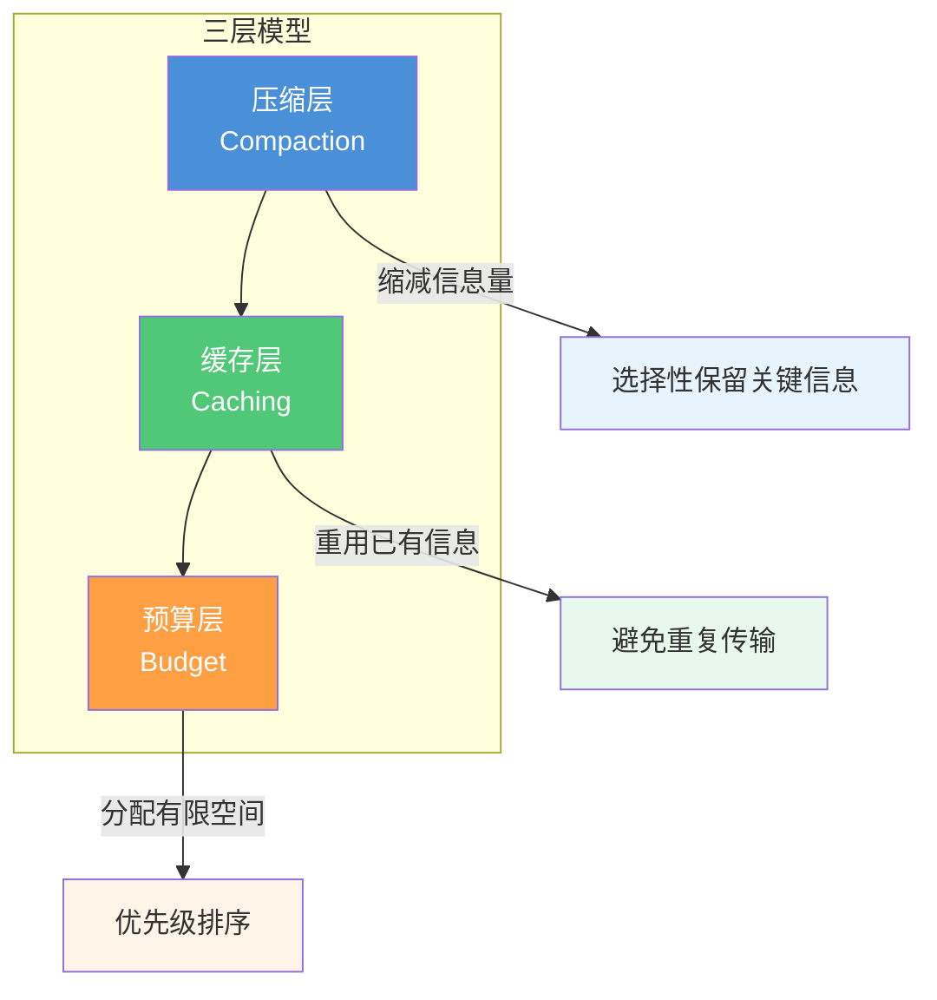
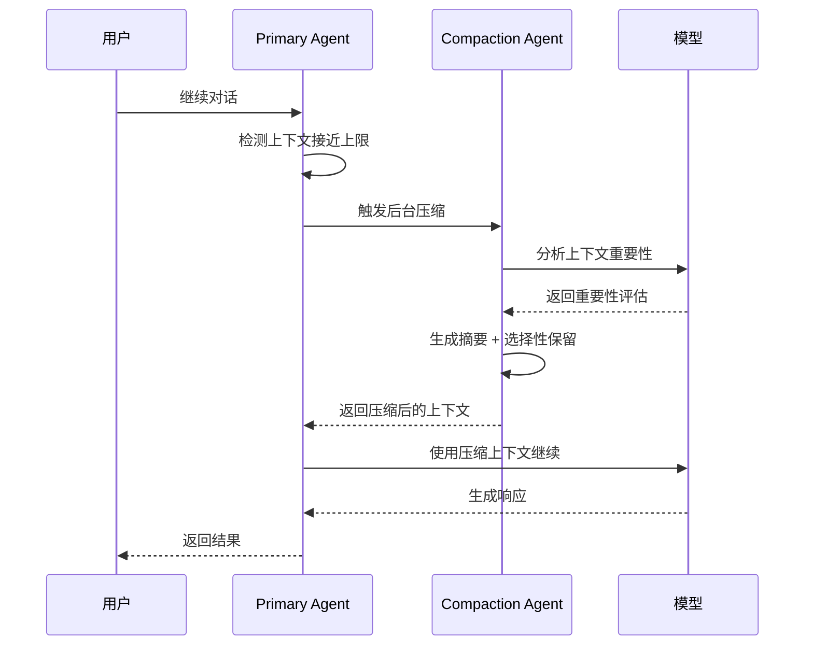
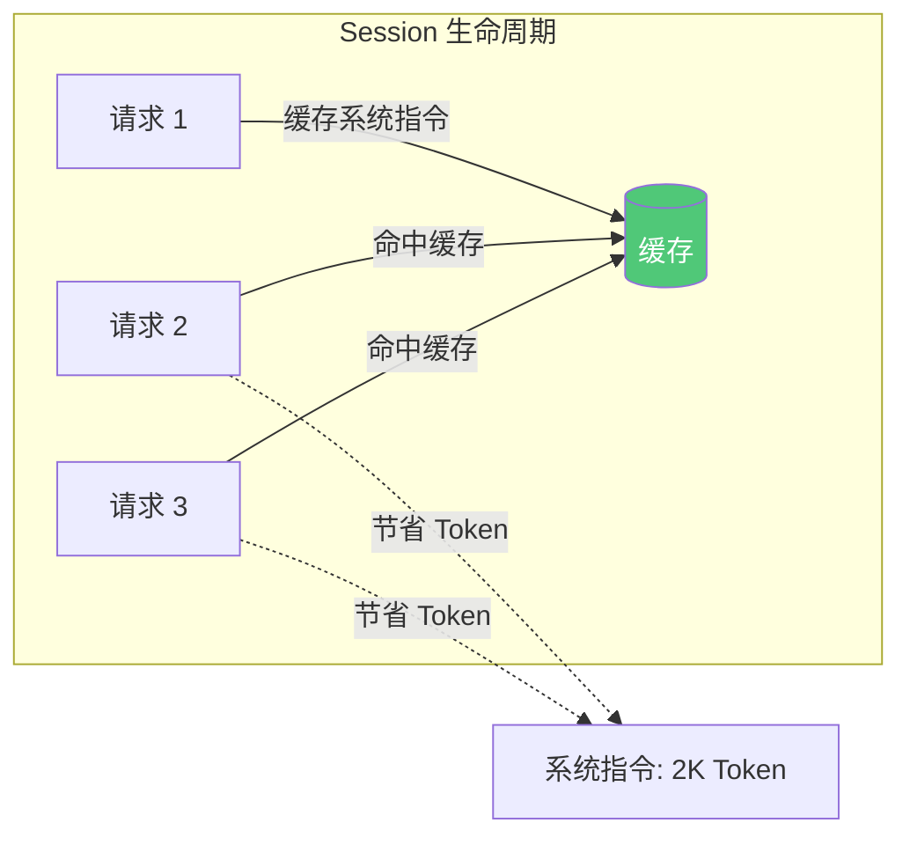
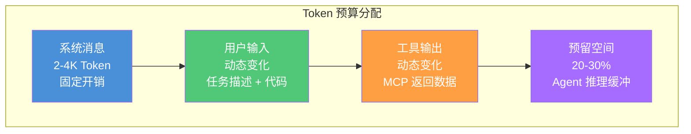
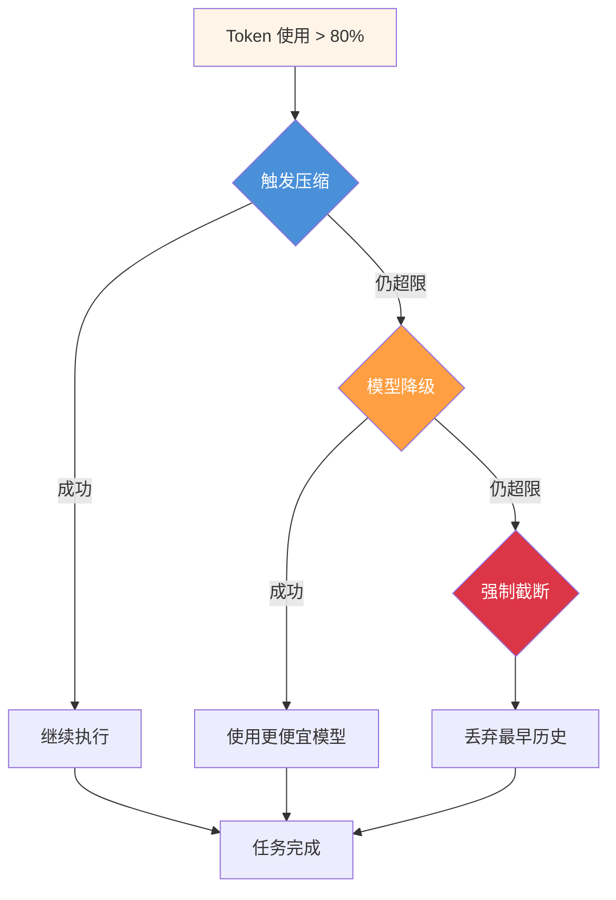
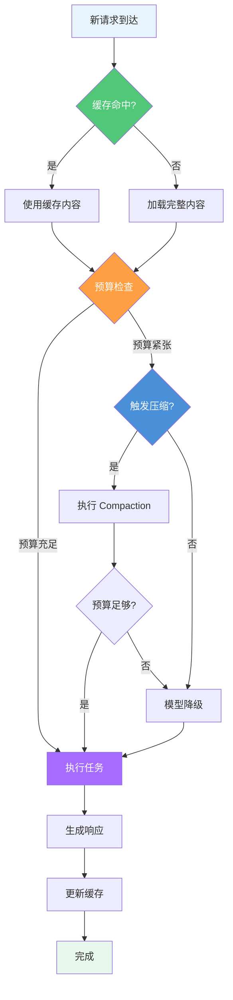
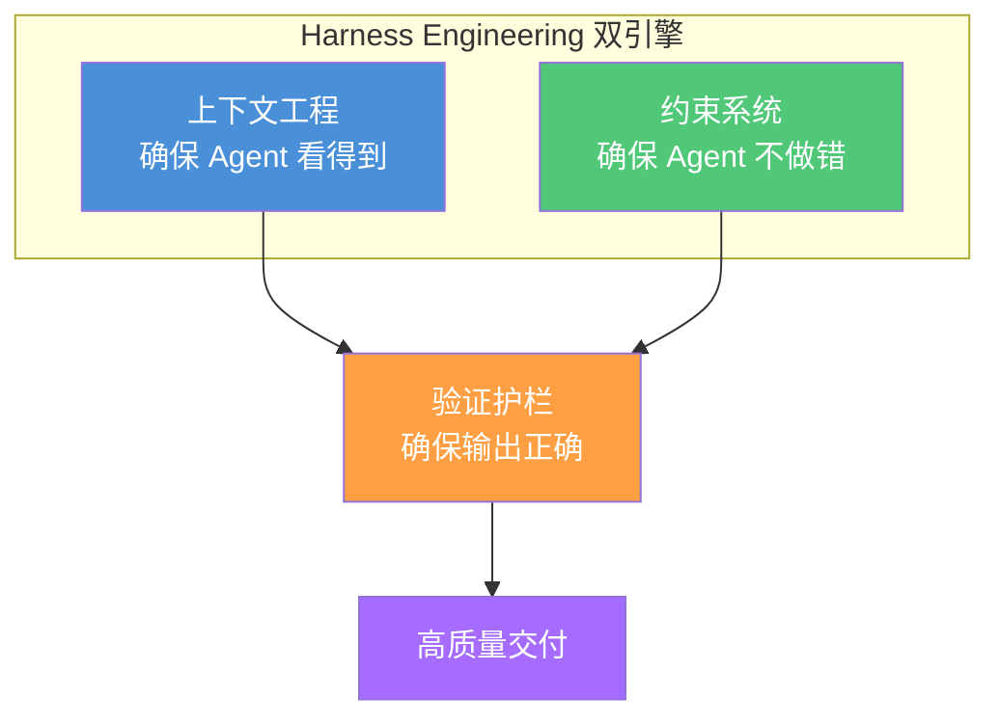
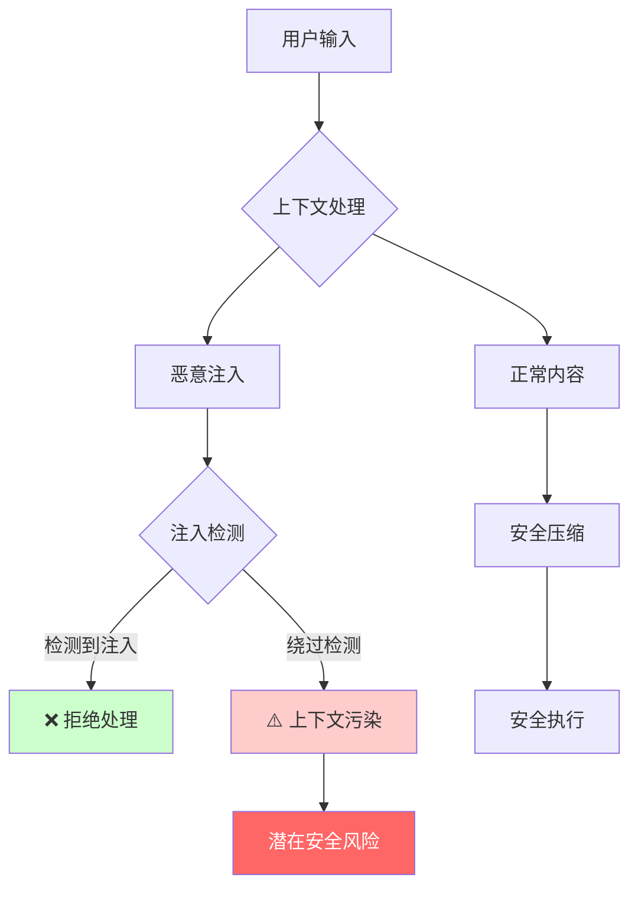
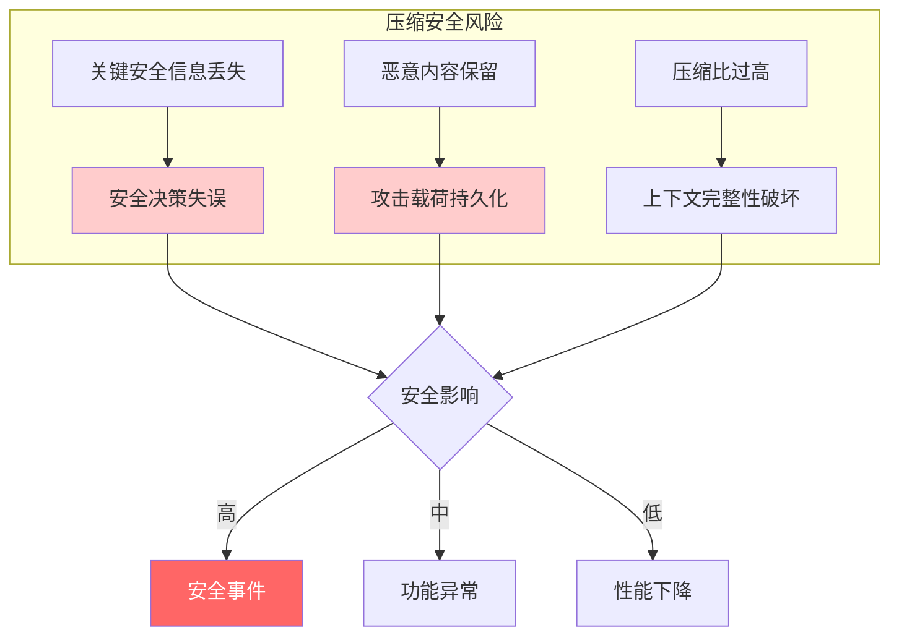
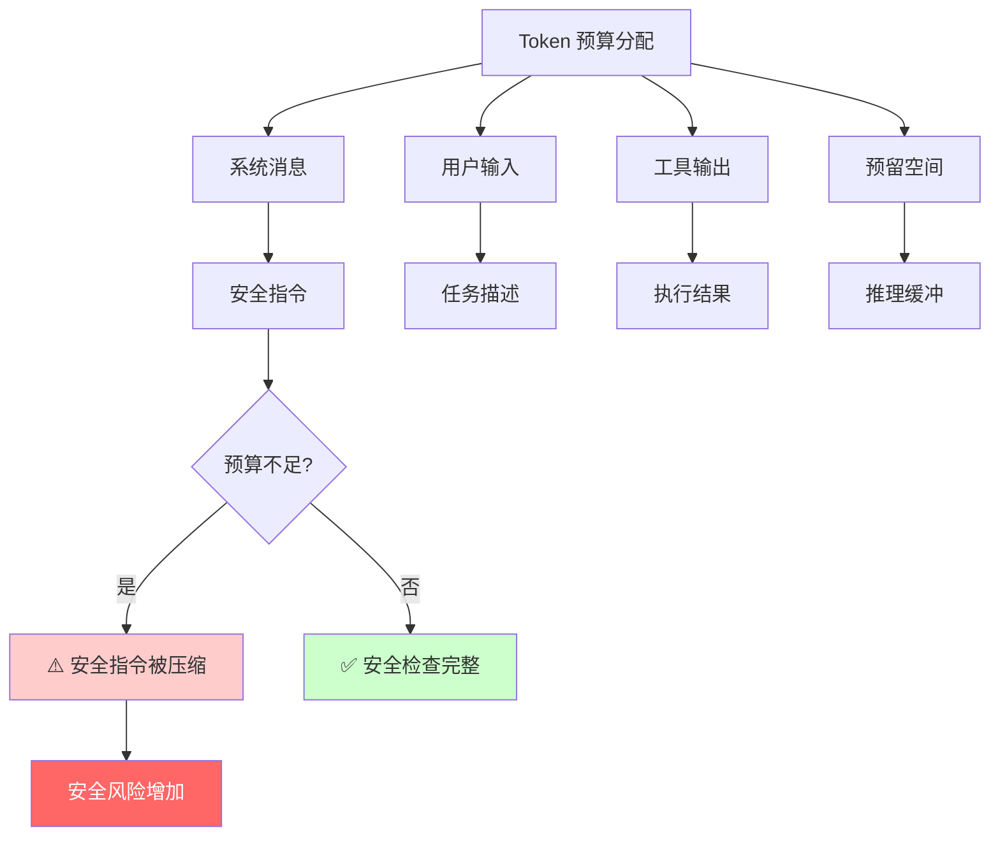

# 上下文工程核心

> 管理 Agent 的"工作记忆"——在有限的 Token 空间内实现信息优先级的精准编排。

> **前置条件**
> - 已完成 [简介](../01-introduction/)，理解 Harness Engineering 基本概念
> - 已安装 OpenCode CLI 并完成基础配置
> - 已了解 LLM 上下文窗口和 Token 计数的基本概念

## 文章概述

上下文窗口是 AI Agent 最稀缺的资源。上下文工程正是管理这一有限空间的方法论，它直接影响 Agent 的决策准确度和任务完成质量。本章节定义上下文工程的三个核心维度——压缩（缩减信息量）、缓存（重用已有信息）、预算（分配有限空间）——并讲解每个维度的实现原理。读者将理解 Compaction 自动压缩机制如何选择性保留关键信息、Session 级与跨 Session 缓存的差异、以及 Token 预算在系统指令/用户输入/工具输出之间的分配策略与超限处理机制。

上下文工程不是孤立的技术实现。它与约束系统共同构成 Agent 行为可控的双引擎——上下文工程确保 Agent"看得到"需要的信息，约束系统确保 Agent"不做"不该做的事。验证护栏则在输出阶段验证结果正确性。学完本节，读者应能根据任务特征配置上下文管理参数，理解压缩后信息保真度与性能的权衡关系，并掌握跨会话上下文保持的基本方法。

### 最小示例

用一个最简单的配置来理解上下文工程：

```json
{
  "tokenBudget": {
    "total": 200000,
    "reserved": 0.25
  }
}
```

这短短两行配置说的是：Agent 的"工作记忆"最多 200K Token，其中 25% 要预留出来供 Agent 思考。就像你写代码时要给大脑留缓存空间一样——不设预留，Agent 可能在关键时刻"失忆"。

### 操作系统类比：Context = 工作记忆

理解上下文工程最直观的方式是将其类比为操作系统的**内存管理**：

| 操作系统概念 | OpenCode 对应 | 说明 |
|-------------|---------------|------|
| RAM / 工作记忆 | Context Window | Agent 的有限工作空间 |
| Swap / 页面文件压缩 | Compaction | 空间不足时压缩不活跃内容腾出空间 |
| CPU 缓存层级（L1/L2/L3） | Caching | 按层级缓存内容，命中越快成本越低 |
| 内存分配（heap/stack/reserved） | Token Budget | 为不同用途预分配有限空间 |
| 内存碎片整理 | 上下文压缩 | 消除冗余内容，提高空间利用率 |
| 虚拟内存 | 跨 Session 缓存 | 将持久化内容映射到上下文空间 |

这个类比帮助理解几个关键设计：

1. **空间有限性**：RAM 有限，Agent 的 Context Window 也有限——必须精打细算
2. **层级缓存**：CPU 缓存有 L1/L2/L3 层级，Context 缓存也有 Session 级和跨 Session 级
3. **压缩换空间**：操作系统用 Swap 换内存空间，Context 用 Compaction 换 Token 空间

## 为什么需要上下文工程

### Token 空间有限，信息无限

每个 AI 模型都有固定的上下文窗口上限——Claude 的 200K Token、GPT-4 的 128K Token。这个窗口就是 Agent 的"工作记忆"，所有对话历史、代码片段、工具输出、系统指令都必须塞进这个有限空间。

然而，软件开发的信息量几乎是无限的：

- 一个中型项目可能有数十万行代码
- 完整的 API 文档可能超过 10 万字
- 一次长会话的对话历史可能积累数万 Token
- MCP 工具返回的查询结果可能非常庞大

**核心矛盾**：有限的工作记忆 vs 无限的信息需求。上下文工程就是为了解决这个矛盾而诞生的方法论。

### 上下文质量决定决策质量

Agent 的每一次决策都依赖于当前上下文。上下文不完整，决策就会出错：

```
用户：修复登录模块的 bug

上下文缺失场景：
- Agent 不知道登录模块在哪里 → 随机搜索，浪费时间
- Agent 不知道之前的修复历史 → 重复已尝试的方案
- Agent 不知道项目规范 → 生成不符合风格的代码

上下文完整场景：
- Agent 精确定位登录模块 → 直接进入修复
- Agent 了解历史上下文 → 避免重复劳动
- Agent 掌握项目规范 → 生成一致风格的代码
```

上下文工程的目标，就是让 Agent 在任何时刻都拥有做出正确决策所需的信息——不多不少，恰到好处。

## 上下文工程的三层模型

上下文工程从三个维度管理有限的工作记忆空间：



| 层级 | 核心问题 | 解决思路 | 触发时机 |
|------|----------|----------|----------|
| **压缩层** | 信息太多怎么办？ | 选择性保留，丢弃低价值内容 | 上下文接近上限时 |
| **缓存层** | 重复内容怎么处理？ | 一次传输，多次复用 | 每次请求时 |
| **预算层** | 空间如何分配？ | 按优先级预分配，动态调整 | 任务开始时 |

三层之间存在依赖关系：**缓存优先**（能复用就不重传），**预算控制**（分配各部分空间），**压缩兜底**（超限时智能缩减）。

## 上下文压缩原理

### 自动压缩机制（Compaction）

当上下文接近窗口上限时，OpenCode 会自动触发 Compaction——一个后台 Agent 会分析当前上下文，生成摘要并选择性保留关键信息。



**Compaction 的核心原则**：

1. **用户指令优先保留** — 用户明确说过的话不能丢
2. **关键决策记录** — Agent 做出的重要选择必须保留
3. **错误信息保留** — 失败的尝试是宝贵的学习材料
4. **代码片段压缩** — 用文件路径 + 摘要替代完整代码
5. **对话历史摘要** — 多轮对话合并为简洁摘要

### 微压缩策略

除了自动压缩，OpenCode 还支持细粒度的微压缩配置：

```json
// Requires OpenCode >= v1.15.x, OMO >= v4.5.x
{
  "compaction": {
    "strategy": "selective",
    "rules": [
      {
        "type": "code",
        "action": "summarize",
        "keepSignature": true
      },
      {
        "type": "tool_output",
        "action": "protect",
        "window": "40K"
      },
      {
        "type": "conversation",
        "action": "summarize",
        "keepUserMessages": true
      }
    ]
  }
}
```

**三种压缩动作**：

| 动作 | 含义 | 适用场景 |
|------|------|----------|
| `summarize` | 生成摘要，丢弃原文 | 对话历史、长文档 |
| `protect` | 完整保留，不压缩 | 用户指令、关键决策 |
| `truncate` | 截断，只保留开头/结尾 | 超长的工具输出 |

**工具输出保护窗口**：最近 40K Token 的工具输出不受压缩影响，确保 Agent 能看到最新的执行结果。

### 压缩后的信息保真度

压缩是有损的，但损失可控。关键在于区分"必须保留"和"可以压缩"：

```
必须保留（保真度 100%）：
├── 用户明确的指令
├── Agent 的关键决策
├── 错误信息和失败原因
└── 当前任务的核心上下文

可以压缩（保真度 70-90%）：
├── 历史对话 → 摘要
├── 完整代码 → 文件路径 + 关键函数签名
├── 工具输出 → 结果摘要
└── 探索过程 → 结论性发现
```

**压缩比 vs 保真度的权衡**：更高的压缩比意味着更多的信息损失。OpenCode 默认在压缩比 3:1 时可保持大部分关键信息保真度（经验估算）。

## 上下文缓存策略

### 缓存 vs 压缩

缓存和压缩是互补的两种策略：

| 策略 | 解决的问题 | 核心机制 | 效果 |
|------|------------|----------|------|
| **缓存** | 消除重复传输 | 一次发送，多次复用 | 可显著节省 Token 消耗（经验估算） |
| **压缩** | 精简必要内容 | 选择性保留，丢弃冗余 | 可有效延长会话寿命 |

**最佳实践**：缓存优先，压缩兜底。先通过缓存消除重复，再通过压缩精简必要内容。

### Session 级缓存

Session 级缓存在单个会话内有效，自动管理，无需配置：



**Session 级缓存的内容**：

- 系统指令（System Prompt）— 每个 Session 固定
- 工具定义（Tool Definitions）— MCP 工具的 JSON Schema
- 项目上下文（Project Context）— README、CLAUDE.md 等

### 跨 Session 缓存

跨 Session 缓存需要显式配置，适用于长期项目：

```json
// Requires OpenCode >= v1.15.x, OMO >= v4.5.x
{
  "caching": {
    "crossSession": {
      "enabled": true,
      "persistPath": ".opencode/cache",
      "maxAge": "7d",
      "entries": [
        {
          "type": "project_knowledge",
          "files": ["README.md", "CLAUDE.md", "docs/**/*.md"]
        },
        {
          "type": "tool_definitions",
          "tools": ["filesystem", "git", "mcp-*"]
        }
      ]
    }
  }
}
```

**跨 Session 缓存的生命周期**：

| 缓存类型 | 生命周期 | 失效条件 |
|----------|----------|----------|
| 项目知识 | 项目持续期 | 文件内容变更 |
| 工具定义 | 工具版本更新 | 配置变更 |
| 用户偏好 | 用户修改 | 手动清除 |

### 缓存命中率优化

缓存命中率是衡量缓存效果的关键指标：

```
缓存命中率 = 命中缓存的 Token 数 / 总请求 Token 数

优化目标：命中率通常可达 60% 以上（取决于使用模式）
```

**提升命中率的策略**：

1. **固化系统指令** — 使用稳定的 System Prompt，避免频繁修改
2. **结构化项目知识** — 将常用文档放在固定位置
3. **合理设置缓存粒度** — 太小命中率低，太大更新成本高
4. **预热缓存** — Session 开始时主动加载常用内容

## Token 预算管理

### 预算分配策略

Token 预算将有限的上下文窗口划分为四个区域：



**预算配置示例**：

```json
{
  "tokenBudget": {
    "total": 200000,
    "allocation": {
      "system": 4000,
      "user": 50000,
      "tools": 80000,
      "reserved": 66000
    },
    "enforcement": "strict"
  }
}
```

**各区域的作用**：

| 区域 | 占比 | 内容 | 管理策略 |
|------|------|------|----------|
| 系统消息 | 2-5% | System Prompt、工具定义 | 固定，通过缓存优化 |
| 用户输入 | 25-30% | 任务描述、代码上下文 | 按需加载，智能截断 |
| 工具输出 | 40-50% | MCP 返回、文件内容 | 结果压缩、分页返回 |
| 预留空间 | 20-30% | Agent 推理、生成响应 | 必须保留，不可侵占 |

### 预算超限的处理机制

当 Token 使用接近上限时，系统依次触发三级响应：



**三级响应详解**：

| 级别 | 触发条件 | 动作 | 影响 |
|------|----------|------|------|
| **压缩** | Token > 80% | 执行 Compaction | 有损但保留关键信息 |
| **降级** | Token > 90% | 切换到更便宜的模型 | 响应质量下降 |
| **截断** | Token > 95% | 丢弃最早的历史 | 可能丢失重要上下文 |

**配置超限响应**：

```json
{
  "tokenBudget": {
    "overrunHandling": {
      "compression": {
        "threshold": 0.8,
        "priority": 1
      },
      "modelDowngrade": {
        "threshold": 0.9,
        "fallbackModel": "claude-haiku",
        "priority": 2
      },
      "truncation": {
        "threshold": 0.95,
        "strategy": "fifo",
        "priority": 3
      }
    }
  }
}
```

## 三层协作的决策流程

压缩、缓存、预算三层如何协作？以下是完整的决策流程：



**决策要点**：

1. **缓存优先** — 每次请求先检查缓存，命中则节省 Token
2. **预算控制** — 加载内容后检查预算，决定是否需要压缩
3. **压缩兜底** — 预算紧张时触发压缩，而非直接降级
4. **渐进降级** — 压缩 → 降级 → 截断，逐级响应

## 上下文工程在 Harness Engineering 中的位置

上下文工程是 Harness Engineering 框架的核心支柱之一：



**三者的协作关系**：

| 组件 | 职责 | 作用阶段 |
|------|------|----------|
| **上下文工程** | 提供决策所需信息 | 输入阶段 |
| **约束系统** | 限制危险操作 | 执行阶段 |
| **验证护栏** | 验证输出正确性 | 输出阶段 |

上下文工程确保 Agent 拥有做出正确决策的信息基础；约束系统防止 Agent 执行危险操作；验证护栏在输出阶段进行最终检验。三者形成完整的质量保障闭环。

## 配置示例汇总

### 基础上下文管理配置

```json
{
  "context": {
    "compaction": {
      "enabled": true,
      "threshold": 0.8,
      "strategy": "selective"
    },
    "caching": {
      "sessionLevel": true,
      "crossSession": false
    },
    "budget": {
      "total": 200000,
      "reserved": 0.25
    }
  }
}
```

### 高级上下文管理配置

```json
{
  "context": {
    "compaction": {
      "enabled": true,
      "threshold": 0.75,
      "strategy": "selective",
      "rules": [
        {
          "type": "code",
          "action": "summarize",
          "keepSignature": true
        },
        {
          "type": "tool_output",
          "action": "protect",
          "window": "40K"
        },
        {
          "type": "conversation",
          "action": "summarize",
          "keepUserMessages": true
        }
      ]
    },
    "caching": {
      "sessionLevel": true,
      "crossSession": {
        "enabled": true,
        "persistPath": ".opencode/cache",
        "maxAge": "7d",
        "entries": [
          {
            "type": "project_knowledge",
            "files": ["README.md", "CLAUDE.md", "docs/**/*.md"]
          }
        ]
      }
    },
    "budget": {
      "total": 200000,
      "allocation": {
        "system": 4000,
        "user": 50000,
        "tools": 80000,
        "reserved": 66000
      },
      "overrunHandling": {
        "compression": {
          "threshold": 0.8,
          "priority": 1
        },
        "modelDowngrade": {
          "threshold": 0.9,
          "fallbackModel": "claude-haiku",
          "priority": 2
        },
        "truncation": {
          "threshold": 0.95,
          "strategy": "fifo",
          "priority": 3
        }
      }
    }
  }
}
```

## 上下文工程安全风险分析

上下文工程管理 Agent 的"工作记忆"，其安全性直接影响 Agent 的决策质量和数据安全。以下分析上下文工程的主要安全风险及防御策略。

### 上下文注入攻击

**威胁描述**：攻击者可能通过精心构造的输入污染上下文，诱导 Agent 执行危险操作。



**典型攻击向量**：

| 攻击类型 | 描述 | 风险等级 |
|---------|------|---------|
| Prompt 注入 | 在用户输入中嵌入恶意指令 | 高 |
| 上下文投毒 | 通过历史对话污染上下文 | 高 |
| 工具输出伪造 | MCP 工具返回恶意内容 | 中 |
| 文件内容注入 | 通过 `@file` 引入恶意内容 | 中 |

**防御策略**：

1. **输入内容扫描**：检测并标记可疑的 Prompt 注入模式
2. **上下文隔离**：区分用户输入和系统指令的信任边界
3. **工具输出校验**：验证 MCP 工具返回内容的完整性
4. **敏感信息过滤**：压缩时自动脱敏敏感数据

### 压缩机制安全风险

**威胁描述**：压缩过程可能丢失关键安全信息或保留恶意内容。



**压缩安全配置**：

```json
{
  "compaction": {
    "securityRules": [
      {
        "type": "security_events",
        "action": "protect",
        "reason": "安全事件必须完整保留"
      },
      {
        "type": "user_permissions",
        "action": "protect",
        "reason": "权限变更记录不可丢失"
      },
      {
        "type": "error_messages",
        "action": "protect",
        "reason": "错误信息用于问题排查"
      },
      {
        "type": "malicious_patterns",
        "action": "alert",
        "reason": "检测到恶意模式时告警"
      }
    ]
  }
}
```

### 缓存安全风险

**威胁描述**：缓存可能被污染或泄露敏感信息。

| 风险类型 | 描述 | 防御措施 |
|---------|------|---------|
| 缓存投毒 | 攻击者污染缓存内容 | 缓存内容签名验证 |
| 敏感信息泄露 | 缓存中存储敏感数据 | 敏感数据不缓存或加密存储 |
| 缓存篡改 | 本地缓存文件被修改 | 文件完整性校验 |
| 跨会话污染 | 缓存在会话间传播恶意内容 | 会话隔离 + 缓存清理策略 |

**缓存安全配置**：

```json
{
  "caching": {
    "security": {
      "sensitivePatterns": [
        "password", "secret", "token", "api_key", "private_key"
      ],
      "action": "exclude",
      "encryption": {
        "enabled": true,
        "algorithm": "AES-256-GCM"
      },
      "integrityCheck": true,
      "maxAge": "24h"
    }
  }
}
```

### Token 预算安全影响

**威胁描述**：不当的预算分配可能导致安全检查被跳过。



**预算安全原则**：

1. **系统消息优先**：安全指令属于系统消息，享有最高优先级
2. **保护安全上下文**：安全相关内容标记为 `protect`
3. **预留安全缓冲**：为安全检查预留足够的 Token 空间
4. **降级安全策略**：预算紧张时优先保留安全相关内容

### 安全检查清单

- [ ] 用户输入经过 Prompt 注入检测
- [ ] 压缩规则保护安全相关内容
- [ ] 缓存不存储敏感信息或已加密
- [ ] Token 预算优先保障安全指令
- [ ] 工具输出经过完整性校验
- [ ] 上下文变更记录审计日志

## 小结

上下文工程是 AI Agent 的"记忆管理"方法论，核心解决有限 Token 空间与无限信息需求之间的矛盾。三层模型——压缩、缓存、预算——从不同维度管理上下文：

- **压缩层**：选择性保留关键信息，丢弃低价值内容
- **缓存层**：一次传输重复内容，避免浪费 Token
- **预算层**：预分配空间，优先保障关键区域

三层协作的决策流程遵循"缓存优先、预算控制、压缩兜底"的原则。在实际配置中，需要根据任务特征调整参数，在 Token 节省和信息保真度之间找到最佳平衡点。

---

## 学习检查清单

完成本章学习后，请确认你能够：

- [ ] 解释上下文工程三层模型（压缩、缓存、预算）的核心职责
- [ ] 描述 Compaction 自动压缩机制的触发时机和保留原则
- [ ] 区分 Session 级缓存与跨 Session 缓存的应用场景
- [ ] 配置 Token 预算分配策略并说明四个区域的作用
- [ ] 说明上下文工程与约束系统、验证护栏的协作关系

## 关联章节

- → [约束系统解析](constraints-system.md)：约束系统是上下文工程的安全补充，防止上下文被恶意利用
- → [验证护栏体系](validation-harness.md)：验证护栏与上下文的交互，确保基于上下文的输出正确
- ← [简介](../01-introduction/)：Harness Engineering 理论框架为上下文工程提供方法论基础
- → [高级话题](../06-advanced/)：上下文工程的深入实现与调优
- → [上下文压缩技术](../06-advanced/context-compression.md)：压缩机制的深入原理与调优
- → [Token 预算策略](../06-advanced/token-budget.md)：预算分配的详细策略
- → [提示词缓存机制](../06-advanced/prompt-caching.md)：缓存机制的完整实现
