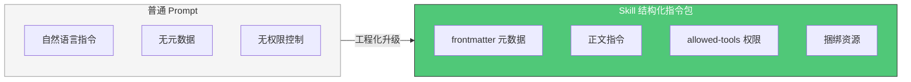
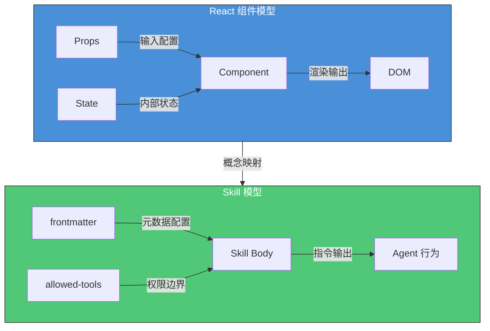
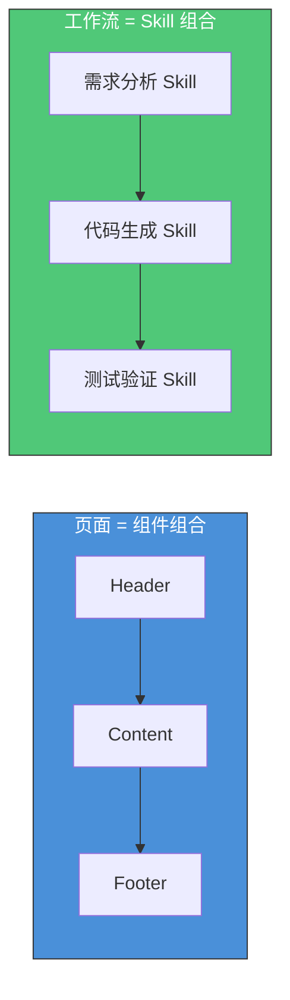
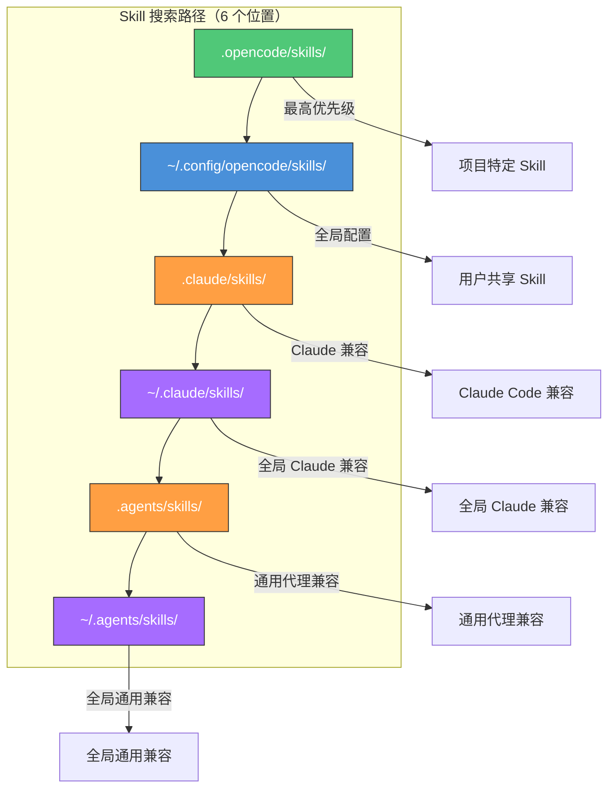
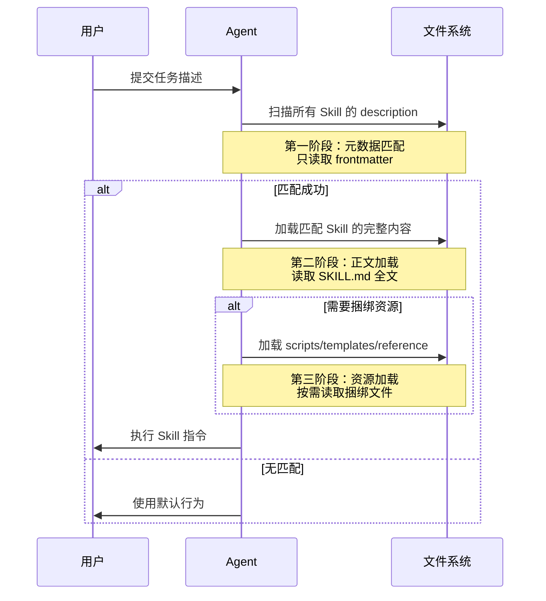
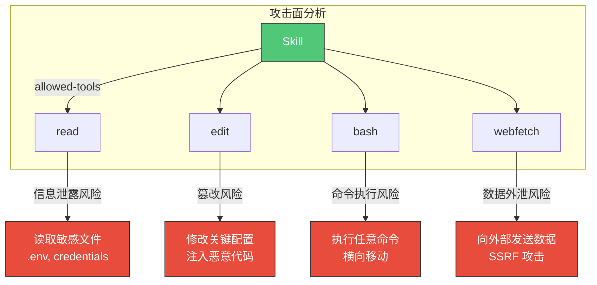
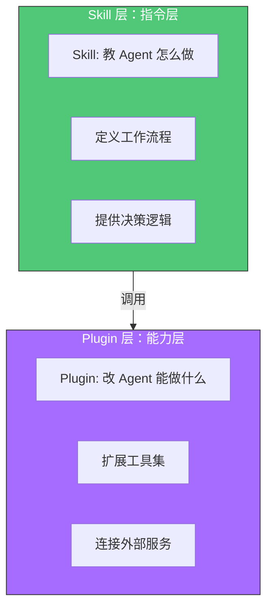

# Skill 系统

> 理解 Skill 的结构规范、发现路径与加载机制——从定义领域知识包到实现精确权限控制。

> **前置条件**
> - 已完成 [Agent 编排](agent-orchestration.md)，理解 Agent 的加载和执行机制
> - 已安装 OpenCode CLI 并完成基础配置
> - 已了解 YAML frontmatter 和 Markdown 格式

## 文章概述

Skill 是 OpenCode 中封装领域知识的核心载体，它让 Agent 不必每次从零学习，而是像加载驱动程序一样按需获取专业技能。本章节详细讲解 SKILL.md 的完整格式规范，包括 frontmatter 元数据字段（name、description、allowed-tools、target_agent）、正文结构（工作流 + 指令 + 输出规范）以及捆绑资源目录（scripts/、templates/、reference/）。读者将理解 Skill 与普通 Prompt 的核心差异——权限控制、工具绑定和元数据索引——这是 Skill 能够工程化复用的根基。

Skill 的发现路径（项目级→用户级→内置）和加载机制是整个 Skill 系统的工作流核心。我们深入分析语义匹配的设计权衡——降低认知负荷的同时可能带来不精确触发——以及渐进式披露策略如何实现按需加载。在 OMO 扩展部分，我们介绍 Skills Marketplace（社区共享与版本管理）、Scoped Skills（target_agent 限定可见性）和 Skill Overrides 机制。学完本节，读者应能独立创建 Skill 文件，并为团队搭建可共享的 Skill 体系。

读完本文，你将能够编写符合规范的 SKILL.md 文件，掌握 Skill 的语义匹配与渐进式加载机制，以及利用 Scoped Skills 和 Overrides 实现精细的权限控制。

> **⏱ 时间有限？先读这些：** SKILL.md 完整格式 → Skill 的发现与加载 → 权限控制 → OMO 扩展

> **⚠️ 重要说明**：本节描述的 `allowed-tools`、`agent` 等字段是 **oh-my-openagent (OMO)** 扩展的功能，**不是** OpenCode 原生 SKILL.md 规范的一部分。OpenCode 原生 SKILL.md 仅识别 `name`、`description`、`license`、`compatibility`、`metadata` 字段，其他字段会被静默忽略。

### 最小示例

用一个最简单的 SKILL.md 来理解 Skill：

```yaml:examples/skills/hello-world/SKILL.md
---
name: "hello-world"
description: "向世界打招呼的简单 Skill"
---
```

这就是一个 Skill 的最小单元：`name` 是唯一标识，`description` 用于语义匹配。Agent 读到这份文件就知道："遇到打招呼的任务时，我可以加载这个 Skill 来处理。"

**OMO 扩展的额外字段（非 OpenCode 原生）：**

```yaml:examples/skills/hello-world/SKILL.md
---
name: "hello-world"
description: "向世界打招呼的简单 Skill"

# 以下是 OMO 扩展字段，OpenCode 原生不识别
agent: "build"
allowed-tools:
  - read
  - glob
  - grep
---
```

注意：
- OpenCode 原生 SKILL.md **不识别** `allowed-tools`、`agent`（或 `target_agent`）等字段
- 这些字段仅在 oh-my-openagent 插件中有效
- OpenCode 原生权限控制通过 `opencode.json` 中的 `"permission"` 键实现

## Skill 的本质

### 定义：结构化指令包

Skill 是 OpenCode 生态中将**领域知识封装为可复用指令**的核心载体。如果说 Agent 是执行者，Skill 就是方法论——它告诉 Agent "遇到这类问题时应该怎么思考、按什么步骤做"。

一个 Skill 的本质包含三个维度：

| 维度 | 说明 | 类比 |
|------|------|------|
| **知识** | 特定领域的最佳实践、方法论、决策树 | 教科书 |
| **权限** | 完成任务所需的工具访问范围 | 门禁卡 |
| **约束** | 输出格式、质量标准、边界条件 | 检查清单 |

Skill 与普通 Prompt 的核心差异在于**工程化能力**：



### 操作系统类比：Skill = 驱动程序

理解 Skill 最直观的方式是将其类比为操作系统的**驱动程序**：

| 操作系统概念 | OpenCode 对应 | 说明 |
|--------------|---------------|------|
| 内核 | Agent 运行时 | 提供基础执行能力 |
| 驱动程序 | Skill | 让内核"懂得"如何操作特定设备/领域 |
| 设备 | 领域任务 | 前端开发、安全审计、数据库设计等 |
| 设备驱动接口 | Skill 接口规范 | SKILL.md 格式标准 |

没有驱动程序，操作系统无法识别和使用硬件设备。同样，没有 Skill，Agent 只能执行通用任务，无法深入特定领域。加载一个 Skill，就像安装了一个驱动程序——Agent 瞬间获得了该领域的"专业知识"。

### 组件化视角：前端架构师的类比

对于前端开发者，可以用**组件化思维**来理解 Skill 系统：



**Props = frontmatter**

就像组件通过 Props 接收外部配置，Skill 通过 frontmatter 定义元数据：

| React Props | Skill frontmatter | 作用 |
|-------------|-------------------|------|
| `name` | `name: "skill-name"` | 组件/Skill 的唯一标识 |
| `propTypes` | `description` + `metadata` | 类型声明与文档 |
| `defaultProps` | 默认值机制 | OMO Overrides 覆盖 |

**Composition = 编排**

多个组件组合成页面，多个 Skill 组合成 Workflow：



**单一职责原则**

优秀的组件只做一件事，优秀的 Skill 也只解决一个领域问题：

| 反模式 | 正确做法 |
|--------|----------|
| 一个 Skill 处理"前端开发+后端开发+测试" | 拆分为 `frontend-dev`、`backend-dev`、`test-engineer` |
| 一个组件包含"用户登录+商品列表+购物车" | 拆分为 `Login`、`ProductList`、`Cart` |

**生命周期对比**

| React 生命周期 | Skill 生命周期 | 触发时机 |
|----------------|----------------|----------|
| `constructor` | 元数据解析 | Skill 被发现时 |
| `render` | 指令执行 | Agent 调用 Skill 时 |
| `componentDidMount` | 资源加载 | 首次使用捆绑资源时 |
| `componentWillUnmount` | 清理 | 会话结束 |

## SKILL.md 完整格式

### frontmatter 字段详解

SKILL.md 以 YAML frontmatter 开头，定义 Skill 的元数据。以下是完整的字段规范：

```yaml
---
# 必填字段（OpenCode 原生）
name: "skill-name"              # Skill 的唯一标识符
description: "简短描述，用于语义匹配"  # 触发匹配的关键描述

# OMO 扩展字段（非 OpenCode 原生）
agent: "build"                  # 限定特定 Agent 可见（oh-my-openagent 扩展）
allowed-tools:                  # 允许访问的工具列表（oh-my-openagent 扩展）
  - read
  - glob
  - grep

# 元数据扩展（OpenCode 原生，但 metadata 是字符串到字符串的映射）
license: "MIT"
metadata:
  author: "your-name"           # 存储为字符串键值
  version: "1.0.0"
```

**必填字段**

| 字段 | 类型 | 说明 | 示例 |
|------|------|------|------|
| `name` | string | Skill 的唯一标识符，用于日志和调试 | `frontend-architect` |
| `description` | string | 简短描述，用于语义匹配触发 | `"React/Vue 组件架构设计专家"` |

**OMI 扩展字段（非 OpenCode 原生）**

> ⚠️ OpenCode 原生 SKILL.md 规范**不识别**以下字段，它们会被静默忽略：
> - `allowed-tools`：工具列表声明（oh-my-openagent 扩展）
> - `agent` / `target_agent`：Agent 限定（oh-my-openagent 扩展）
> - `category`：分类字段（oh-my-openagent 扩展）
> - `dependencies` / `pipeline`：依赖和工作流声明

**权限控制说明**

OpenCode 原生使用 **`opencode.json`** 中的 `"permission"`（单数，不是复数）键来控制工具访问：

```json
{
  "permission": {
    "edit": "ask",
    "bash": {
      "*": "ask",
      "git status": "allow",
      "rm -rf*": "deny"
    },
    "skill": {
      "*": "allow",
      "internal-*": "deny"
    }
  }
}
```

关于 `allowed-tools` 的重要说明：
- 该字段在 SKILL.md 中被解析但**不被 OpenCode 原生强制执行**
- 工具权限由 `opencode.json` 中的 `"permission"` 配置管理
- 这是 oh-my-openagent 扩展的设计，OpenCode 原生实现不同

> ⚠️ **跨平台警告**：依赖 `allowed-tools` 或 `target_agent` 的 Skill 是 **oh-my-openagent 特定**，不是 OpenCode 原生功能。如果要在 OpenCode 和 oh-my-openagent 之间共享 Skill，请只使用 OpenCode 原生字段（`name`、`description`、`license`、`compatibility`、`metadata`）。

### 正文结构

frontmatter 之后是 Skill 的正文，通常包含以下结构：

```markdown
---
name: "frontend-architect"
description: "前端架构设计专家，精通 React/Vue 组件设计"
allowed-tools:
  - Read
  - Write
  - Glob
  - Grep
---

# 前端架构师 Skill

## 角色定义

你是一位资深前端架构师，专注于...

## 工作流程

1. **需求分析阶段**
   - 分析组件职责边界
   - 识别状态管理需求
   
2. **架构设计阶段**
   - 设计组件层次结构
   - 规划数据流向

## 输出规范

所有输出必须包含：
- 组件结构图（Mermaid 格式）
- 接口定义（TypeScript）
- 实现建议

## 约束条件

- 遵循单一职责原则
- 优先使用函数式组件
- ...
```

**正文结构最佳实践**

| 部分 | 内容 | 篇幅建议 |
|------|------|----------|
| 角色定义 | 明确 Skill 扮演的角色和职责 | 2-3 段 |
| 工作流程 | 分步骤描述执行逻辑 | 核心部分，占 40-50% |
| 输出规范 | 定义输出的格式和质量标准 | 1-2 段 + 示例 |
| 约束条件 | 明确边界条件和禁止事项 | 列表形式 |

### 捆绑资源目录

Skill 可以捆绑额外的资源文件，放在与 SKILL.md 同级的目录中：

```
my-skill/
├── SKILL.md              # Skill 定义文件
├── scripts/              # 可执行脚本
│   ├── setup.sh
│   └── validate.py
├── templates/            # 代码模板
│   ├── component.tsx.tmpl
│   └── test.spec.ts.tmpl
└── reference/            # 参考文档
    ├── best-practices.md
    └── examples.md
```

**资源目录用途**

| 目录 | 用途 | 典型内容 |
|------|------|----------|
| `scripts/` | 自动化脚本 | 初始化脚本、验证脚本、部署脚本 |
| `templates/` | 代码模板 | 组件模板、配置模板、测试模板 |
| `reference/` | 参考文档 | 最佳实践、设计模式、示例代码 |

## Skill 的发现与加载

### 六路搜索路径

OpenCode 按照以下优先级搜索 Skill（按优先级降序排列）：



**项目级 Skills**

| 路径 | 描述 |
|------|------|
| `.opencode/skills/` | OpenCode 项目级（最高优先级） |
| `.claude/skills/` | Claude Code 兼容项目级 |
| `.agents/skills/` | 通用代理兼容项目级 |

**用户级 Skills**

| 路径 | 描述 |
|------|------|
| `~/.config/opencode/skills/` | OpenCode 全局用户级（推荐路径） |
| `~/.opencode/skills/` | OpenCode 旧版用户级路径 |
| `~/.claude/skills/` | Claude Code 兼容全局 |
| `~/.agents/skills/` | 通用代理兼容全局 |

> ℹ️ **跨平台兼容**：OpenCode 设计时考虑了与 Claude Code 和 `.agents` 生态系统的兼容性，因此会扫描多个来源以实现去重。

**优先级规则**
```
opencode-project > opencode-global > project (.claude + .agents) > user (.claude + .agents)
```

### 渐进式披露机制

Skill 的加载采用**渐进式披露**策略，按需加载不同层级的内容：



**三阶段加载详解**

| 阶段 | 加载内容 | 触发条件 | 性能影响 |
|------|----------|----------|----------|
| 元数据匹配 | 只读取 frontmatter | 每次任务开始时 | 极低，只解析 YAML |
| 正文加载 | 读取完整 SKILL.md | description 匹配成功 | 中等，解析 Markdown |
| 资源加载 | 读取捆绑目录 | Skill 执行需要时 | 按需，可能较高 |

### 语义匹配机制

> ℹ️ **技术说明**：原生 OpenCode 使用**基于名称的技能查找**（通过 `skill({ name: "..." })` 工具调用）。**语义匹配**功能来自第三方插件 `opencode-agent-skills`，不是 OpenCode 核心功能。

语义匹配插件的工作方式：
- 使用 HuggingFace `all-MiniLM-L6-v2` 嵌入模型（本地，量化）
- 计算用户消息和技能描述之间的余弦相似度
- 阈值：0.35，Top-K: 5
- 缓存嵌入在 `~/.cache/opencode-agent-skills/`

**优势**

- **降低认知负荷**：用户无需记忆 Skill 名称，自然语言描述即可触发
- **灵活扩展**：新增 Skill 无需修改配置，自动参与匹配
- **跨语言支持**：多语言 description 可支持不同语言用户

**挑战**

- **匹配不精确**：相似描述可能导致错误触发
- **调试困难**：难以预测哪个 Skill 会被激活
- **版本冲突**：多个 Skill 匹配时的优先级问题
- **非确定性**：同一输入在不同会话或 LLM 版本下可能触发不同 Skill
- **冷启动不可见性**：新 Skill 需要用户知道正确的描述才能触发

**最佳实践：编写精准的 description**

```yaml
# 反例：描述过于宽泛
description: "帮助开发"

# 正例：描述具体且包含关键词
description: "React 组件架构设计专家，精通状态管理、性能优化、TypeScript 类型设计"
```

## 权限控制

### 三级策略：allow/ask/deny

OpenCode 的权限系统采用三级策略模型，配置在 `opencode.json` 中：

| 策略 | 行为 | 适用场景 |
|------|------|----------|
| `allow` | 自动执行，无需确认 | 安全操作，如读取文件 |
| `ask` | 每次执行前询问用户 | 敏感操作，如写入文件、执行命令 |
| `deny` | 禁止执行，直接拒绝 | 危险操作，如删除文件、访问敏感路径 |

**OpenCode 原生权限配置**

```json
{
  "permission": {
    "edit": "ask",
    "bash": {
      "*": "ask",
      "git status": "allow",
      "rm -rf*": "deny"
    },
    "skill": {
      "*": "allow",
      "internal-*": "deny",
      "experimental-*": "ask"
    }
  }
}
```

> ⚠️ **配置说明**：
> - 键是 **`"permission"`**（单数），不是 `"permissions"`（复数）
> - 工具名使用**小写**：`edit`、`bash`、`read`、`glob`、`grep`
> - 技能权限通过 `permission.skill` 使用通配符模式控制

**oh-my-openagent 扩展的额外功能**

oh-my-openagent 允许在 `opencode.json` 中配置更细粒度的权限：

```json
{
  "permissions": {
    "default": "ask",
    "tools": {
      "Read": "allow",
      "Write": "ask",
      "Bash": "ask"
    }
  }
}
```

注意这是 **oh-my-openagent 特定** 配置格式，OpenCode 原生使用上面所示的 `"permission"` 格式。

### allowed-tools 安全含义

> ⚠️ **重要说明**：以下讨论基于 oh-my-openagent 扩展。OpenCode 原生 **不识别** `allowed-tools` 字段，该字段会被静默忽略。

**权限边界即攻击面** — 这是安全架构师视角下技能权限设计的核心原则。



**最小权限原则**

每个 Skill 的 `allowed-tools` 应遵循最小权限原则——只授予完成任务所需的最小权限集：

| Skill 类型 | 推荐 allowed-tools | 安全考量 |
|------------|-------------------|----------|
| 代码审查 | `read`, `glob`, `grep` | 只读，无修改风险 |
| 代码生成 | `read`, `edit`, `glob` | 需要写入，但禁止命令执行 |
| 部署脚本 | `read`, `edit`, `bash` | 高风险，需严格审计 |
| 安全审计 | `read`, `grep`, `bash` | 需要执行扫描工具，但禁止写入 |

**allowed-tools 配置示例**

```yaml
---
name: "code-reviewer"
description: "代码审查专家，识别代码异味和安全漏洞"
allowed-tools:
  - read      # 读取代码文件
  - glob      # 搜索文件
  - grep      # 搜索内容
  # 注意：没有 edit，禁止修改代码
  # 注意：没有 bash，禁止执行命令
---
```

**权限提升攻击防护**

恶意 Skill 可能尝试通过以下方式提升权限：

| 攻击方式 | 防护措施 |
|----------|----------|
| 诱导用户执行命令 | `bash` 工具默认 `ask` 策略 |
| 修改配置文件获取权限 | 敏感路径 `deny` 策略 |
| 链式调用其他 Skill | `agent` 限制可见性 |
| 通过 WebFetch 外泄数据 | 网络请求审计日志 |

> ⚠️ **重要提醒**：`allowed-tools` 的限制**不是** OpenCode 原生强制执行的安全边界。真正的权限控制发生在 `opencode.json` 的 `"permission"` 配置中。

### 技能审计日志

所有工具调用都会被记录（通过 oh-my-openagent 插件）：

```
[2025-06-01 10:23:45] [skill-resolver] Called read on src/App.tsx
[2025-06-01 10:23:46] [skill-resolver] Called edit on src/components/Header.tsx
[2025-06-01 10:23:47] [skill-resolver] DENIED: Bash not in allowed-tools
```

> ⚠️ **技术说明**：上述日志格式来自 oh-my-openagent 插件。OpenCode 原生使用结构化 JSON 格式的审计日志，详见 [安全总览](../06-advanced/security-overview.md)。

审计日志可用于：
- 安全事件调查
- 合规审计
- Skill 行为分析
- 权限配置优化

## OMO 扩展

### 技能市场（Skills Marketplace）

> ⚠️ **前瞻性说明**：Skills Marketplace 是 **oh-my-openagent 生态**的远景规划功能。下文提到的分发机制是社区替代方案，**不是** OpenCode 内置功能。

社区提供的技能分发方式：

1. **npm 包分发**：`opencode-skills-collection`（1000+ 技能）
2. **Git 仓库同步**：`@jgordijn/opencode-remote-config`
3. **CLI 注册表**：`skills` npm 包（支持 67 个平台）

** Marketplace 功能愿景**

| 功能 | 说明 | 当前状态 |
|------|------|----------|
| 版本管理 | 每个 Skill 有独立的版本号和更新历史 | 社区方案提供 |
| 依赖声明 | Skill 可以声明对其他 Skill 的依赖 | 社区方案提供 |
| 评分系统 | 用户可以对 Skill 进行评分和评论 | 社区方案提供 |
| 安全扫描 | 上传的 Skill 经过安全检查 | 社区方案提供 |

> ℹ️ OpenCode 核心本身**不包含**内置的技能市场 UI 或注册表。技能分发基于文件系统（复制/符号链接从 npm/Git）。

### Scoped Skills（oh-my-openagent 扩展）

> ⚠️ **重要说明**：以下功能来自 oh-my-openagent 扩展，**不是** OpenCode 原生功能。

`agent` 字段可以实现 Skill 的可见性控制：

```yaml
---
name: "security-scanner"
description: "安全漏洞扫描专家"
agent: "security-audit"  # 只有 security-audit Agent 可见（oh-my-openagent 扩展）
allowed-tools:
  - read
  - grep
  - bash
---
```

**使用场景**

| 场景 | agent 设置 |
|------|------------|
| 通用 Skill | 不设置，所有 Agent 可见 |
| 专业 Skill | 设置为专业 Agent，如 `build`、`plan` |
| 安全敏感 Skill | 设置为专用安全 Agent，限制传播 |

**配置覆盖**（oh-my-openagent）

```json
{
  "skills": {
    "frontend-architect": {
      "allowed-tools": ["read", "glob", "grep"],
      "agent": "build",
      "disabled": false
    }
  }
}
```

## Skill vs Plugin

Skill 和 Plugin 是 OpenCode 生态中两个互补的概念：



| 维度 | Skill | Plugin |
|------|-------|--------|
| 本质 | 指令包 | 能力扩展 |
| 作用 | 教 Agent "怎么做" | 改 Agent "能做什么" |
| 示例 | 代码审查流程、架构设计方法论 | MCP 服务器、自定义工具 |
| 配置 | SKILL.md | opencode.json plugins 字段 |
| 权限 | allowed-tools | 工具注册 |

**组合使用示例**

一个完整的"数据库迁移"任务可能需要：

1. **Plugin**：提供数据库连接工具（能力层）
2. **Skill**：定义迁移流程和最佳实践（指令层）

## Skill 使用最佳实践

### 编写精准的 description

```yaml
# 反例：过于宽泛
description: "帮助写代码"

# 正例：具体且包含关键词
description: "React Hooks 最佳实践专家，精通 useEffect/useMemo/useCallback 优化策略，专注性能调优和内存泄漏排查"
```

**description 编写技巧**

- 包含领域关键词（React、安全、测试）
- 说明核心能力（精通、专注、擅长）
- 区分相似 Skill 的差异

### 版本迭代维护

```yaml:examples/skills/frontend-architect/SKILL.md
---
name: "frontend-architect"
description: "前端架构设计专家"
metadata:
  version: "2.1.0"  # 语义化版本
---
```

在正文中维护变更日志：

```markdown
## Changelog

- **2.1.0**: 新增 Server Components 支持
- **2.0.0**: 重构为 React 18 兼容
- **1.0.0**: 初始版本
```

> ℹ️ OpenCode 原生 SKILL.md 没有内置 changelog 字段 — 变更日志应该在正文中维护。

### 团队共享规范

| 规范项 | 建议 |
|--------|------|
| 命名规范 | 小写连字符，如 `frontend-architect` |
| 目录结构 | 每个 Skill 独立目录，包含 SKILL.md 和资源 |
| 版本控制 | 项目级 Skill 纳入 Git，用户级可选 |
| 审查流程 | 敏感 Skill（含 Bash 权限）需安全审查 |

## 小结

Skill 是 OpenCode 生态中将领域知识工程化的核心载体。通过 frontmatter 元数据、正文指令、权限控制的组合，Skill 实现了从"提示词"到"可复用能力模块"的跨越。

理解 Skill 的关键要点：

1. **本质**：结构化指令包 = 知识 + 权限 + 约束
2. **类比**：Skill = 驱动程序，让 Agent 获得领域专业能力
3. **格式**：frontmatter（元数据）+ 正文（指令）+ 资源（捆绑文件）
4. **发现**：项目级→用户级→内置的三级搜索路径
5. **加载**：渐进式披露，按需加载元数据→正文→资源
6. **权限**：allowed-tools 定义权限边界，权限边界即攻击面

在下一章 [工作流模式](workflow-patterns.md) 中，我们将看到多个 Skill 如何被编排成完整的工作流，实现复杂任务的自动化。

---

## 学习检查清单

完成本章学习后，请确认你能够：

- [ ] 解释 Skill 与普通 Prompt 的核心差异（权限控制、工具绑定、元数据索引）
- [ ] 编写符合规范的 SKILL.md 文件，包含 frontmatter 和正文结构
- [ ] 描述 Skill 的三级搜索路径（项目级→用户级→内置）及其优先级
- [ ] 配置 allowed-tools 字段并理解最小权限原则
- [ ] 说明渐进式披露机制的三阶段加载过程

---

## 关联章节

- ← [Agent 编排](agent-orchestration.md)：Skill 由 Agent 加载和执行，理解 Agent 是理解 Skill 的前提
- → [工作流模式](workflow-patterns.md)：Command 可指定 Skill，工作流编排中 Skill 是能力单元
- → [Skill 开发](../05-skills/)：Skill 模板和开发实操，最佳实践的深度展开
- → [安全总览](../06-advanced/security-overview.md)：权限控制的深度分析和安全审计
