# 验证护栏体系

> 确保 AI 生成代码的"最后一道防线"——从质量门禁到自动修复循环的验证系统。

> **前置条件**
> - 已完成 [约束系统解析](constraints-system.md)，理解约束系统的三层架构
> - 已完成 [上下文工程核心](context-engineering-core.md)，理解上下文与约束的协作关系
> - 已安装 OpenCode CLI 并完成基础配置
> - 已了解 LSP（Language Server Protocol）和代码质量检查的基本概念

## 文章概述

如果说约束系统管理 Agent 的"准入"（什么可以做），验证护栏就管理"准出"（做的结果对不对）。这是 AI 编程流水线中防止低质量代码进入仓库的最后一道防线。本章节系统讲解验证护栏的定位——与约束系统的根本区别——以及 Harness Engineering 中验证的三个原则（自动化、可追溯、可配置）。读者将理解质量门禁的三大分级：硬性门禁（编译/语法检查必须通过）、质量门禁（测试覆盖率/代码规范）、量化门禁（性能指标/安全评分），以及门禁的阻断与告警两种模式。

风险分类器 (Risk Classifier) 是验证护栏的决策引擎。基于规则的风险分类引擎，根据操作内容判定风险等级：高风险（阻止执行）、中风险（确认后执行）、低风险（自动执行）。自动验证机制涵盖 LSP 验证链（语法→类型→lint→语义）、测试自动执行和架构符合性检查。本章还分析攻击者如何利用分类器误判绕过门禁、伪造通行报文等风险及防御策略。学完本节，你应能设计并配置适配项目质量要求的验证体系。

读完本文，你将能够设计分级质量门禁体系，配置风险分类器的判定策略，以及搭建自动验证与修复循环的验证流水线。

### 操作系统类比：验证护栏 = CI 质量门禁

理解验证护栏最直观的方式是将其类比为操作系统和 CI 系统的**质量保障机制**：

| 操作系统概念 | OpenCode 对应 | 说明 |
|-------------|---------------|------|
| CI Pipeline 质量门禁 / Git Hook | Validation Gate | 代码入库前必须通过的质量检查关卡 |
| 防火墙 DPI / 深度包检测 | Risk Classifier | 深入分析操作内容，智能判定风险等级 |
| 操作系统自动错误恢复 / fsck | Auto-fix | 检测到问题时自动修复，减少人工介入 |
| 系统日志 / Event Viewer | Audit Log | 完整记录所有验证过程和结果 |
| 文件系统配额 | 量化门禁 | 对代码质量、性能指标设置硬性阈值 |
| 签名校验 / 代码签名 | 验证结果签名 | 防止伪造通过报文，确保验证结果可信 |

这个类比帮助理解几个关键设计：

1. **门禁阻断**：就像 Git Hook 在 commit 前拦截问题，验证门禁在代码入库前拦截低质量代码
2. **深度检测**：DPI 不仅看报文头，分类器也不仅匹配文本模式——两者都深入分析行为特征
3. **自动修复**：fsck 自动修复文件系统错误，Auto-fix 自动修复代码问题——都是"发现问题→修复→验证"循环

### 最小示例

用一个最简单的门禁配置来理解验证护栏：

```json
{
  "validation": {
    "gates": {
      "hard": [
        {
          "name": "compile",
          "command": "npm run build",
          "action": "block"
        }
      ]
    }
  }
}
```

这段配置的意思是：Agent 修改代码后，自动运行 `npm run build`，编译失败就阻断入库。这就是验证护栏的最小闭环——**改完代码 → 自动检查 → 不过就拦**。

## 验证护栏的定义

### 约束管"准入"，验证管"准出"

在 Harness Engineering 体系中，约束系统（Constraints System）和验证护栏（Validation Harness）构成 Agent 行为管控的双翼：

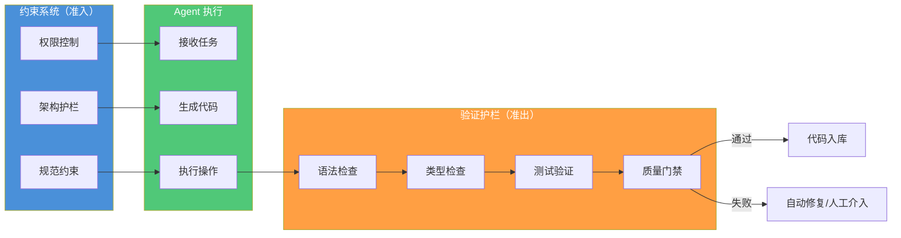

**约束系统**在 Agent 执行前生效，回答"能不能做"的问题：

- 权限控制：Agent 是否有权限访问这个文件？
- 架构护栏：这个修改是否符合架构规范？
- 规范约束：生成的代码是否符合团队编码规范？

**验证护栏**在 Agent 执行后生效，回答"做得对不对"的问题：

- 语法检查：代码能否通过编译？
- 类型检查：TypeScript 类型是否正确？
- 测试验证：单元测试是否通过？
- 质量门禁：覆盖率、安全扫描是否达标？

### 验证三原则

Harness Engineering 中的验证遵循三个核心原则：

| 原则 | 定义 | 实践体现 |
|------|------|---------|
| **自动化** | 验证过程无需人工干预 | LSP 诊断、测试执行、门禁检查全部自动化 |
| **可追溯** | 验证结果有据可查 | 每次验证生成审计日志，记录通过/失败原因 |
| **可配置** | 验证标准可按项目定制 | 门禁阈值、风险等级、阻断策略均可配置 |

### 验证护栏在流水线中的位置

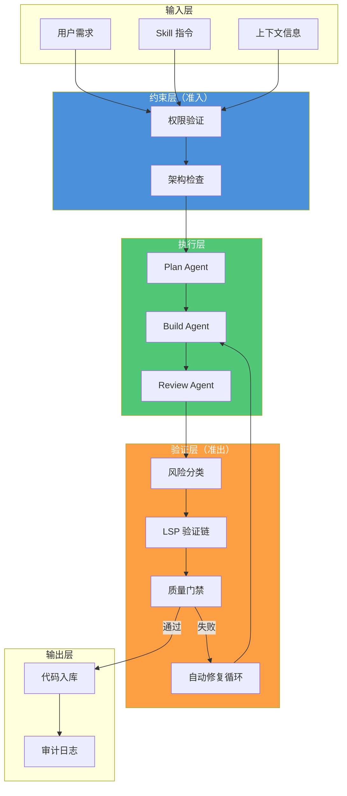

## 质量门禁体系

### 门禁分级

质量门禁按严重程度分为三级：

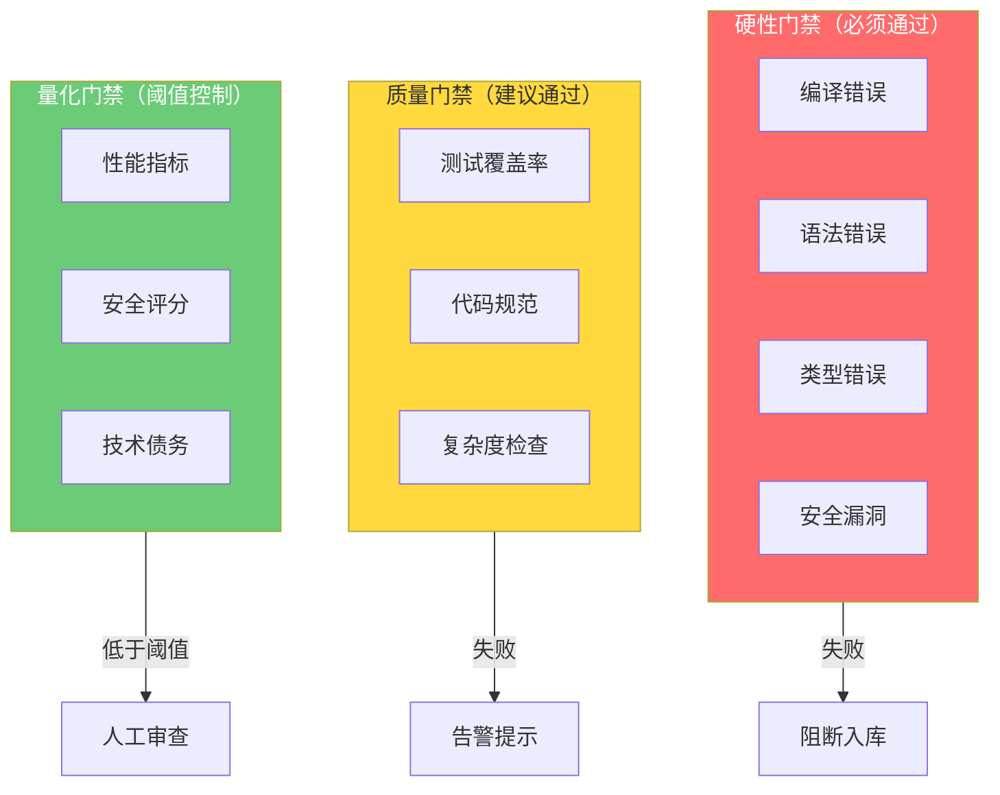

#### 硬性门禁

硬性门禁是代码入库的必要条件，任何一项失败都会阻断入库：

| 门禁类型 | 检查内容 | 失败后果 |
|---------|---------|---------|
| **编译检查** | 代码能否成功编译 | 阻断入库 |
| **语法检查** | 是否存在语法错误 | 阻断入库 |
| **类型检查** | TypeScript 类型是否正确 | 阻断入库 |
| **安全扫描** | 是否存在高危漏洞 | 阻断入库 |

```yaml
# 硬性门禁配置示例
hard_gates:
  - name: compile-check
    type: build
    command: npm run build
    action: block
    message: "编译失败，请修复错误后重试"
  
  - name: type-check
    type: typescript
    command: npx tsc --noEmit
    action: block
    message: "类型检查失败"
  
  - name: security-scan
    type: security
    command: npm audit --audit-level=high
    action: block
    message: "发现高危安全漏洞"
```

#### 质量门禁

质量门禁关注代码质量，失败时通常告警而非阻断：

| 门禁类型 | 检查内容 | 失败后果 |
|---------|---------|---------|
| **测试覆盖率** | 单元测试覆盖率是否达标 | 告警提示 |
| **代码规范** | ESLint/Prettier 检查 | 告警提示 |
| **复杂度检查** | 圈复杂度是否超标 | 告警提示 |

```yaml
# 质量门禁配置示例
quality_gates:
  - name: test-coverage
    type: coverage
    threshold: 80
    action: warn
    message: "测试覆盖率 {current}% 低于阈值 {threshold}%"
  
  - name: lint-check
    type: lint
    command: npm run lint
    action: warn
    message: "代码规范检查未通过"
  
  - name: complexity-check
    type: complexity
    max_cyclomatic: 10
    action: warn
    message: "圈复杂度超标，建议重构"
```

#### 量化门禁

量化门禁基于指标阈值，用于性能和安全评分：

| 门禁类型 | 检查内容 | 阈值示例 |
|---------|---------|---------|
| **性能指标** | 首屏加载时间、包体积 | 加载 < 3s，包 < 500KB |
| **安全评分** | 依赖安全评分、代码安全评分 | 评分 ≥ 80 |
| **技术债务** | 代码重复率、注释覆盖率 | 重复 < 5%，注释 > 20% |

```yaml:examples/validation/metric-gates.yaml
metric_gates:
  - name: bundle-size
    type: performance
    metric: bundle_size_kb
    threshold: 500
    action: review
    message: "包体积 {current}KB 超过阈值 {threshold}KB"
  
  - name: security-score
    type: security
    metric: security_score
    threshold: 80
    action: review
    message: "安全评分 {current} 低于阈值 {threshold}"
  
  - name: code-duplication
    type: quality
    metric: duplication_rate
    threshold: 5
    action: warn
    message: "代码重复率 {current}% 超过阈值 {threshold}%"
```

### 阻断模式 vs 告警模式

门禁支持两种执行模式：

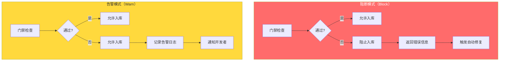

**阻断模式适用场景**：

- 编译错误、语法错误
- 高危安全漏洞
- 类型错误
- 核心功能测试失败

**告警模式适用场景**：

- 测试覆盖率不足
- 代码规范警告
- 复杂度超标
- 非关键性能指标

### 门禁配置示例

以下是完整的质量门禁配置示例：

```json:examples/opencode-configs/quality-gates.jsonc
// Requires OpenCode >= v1.15.x, OMO >= v4.5.x
{
  "$schema": "https://opencode.ai/config.json",
  "validation": {
    "enabled": true,
    "gates": {
      // 硬性门禁
      "hard": [
        {
          "name": "compile",
          "type": "build",
          "command": "npm run build",
          "action": "block",
          "timeout": 120000
        },
        {
          "name": "typecheck",
          "type": "typescript",
          "command": "npx tsc --noEmit",
          "action": "block"
        },
        {
          "name": "security",
          "type": "audit",
          "command": "npm audit --audit-level=high",
          "action": "block"
        }
      ],
      // 质量门禁
      "quality": [
        {
          "name": "coverage",
          "type": "test",
          "threshold": 80,
          "action": "warn"
        },
        {
          "name": "lint",
          "type": "lint",
          "command": "npm run lint",
          "action": "warn"
        }
      ],
      // 量化门禁
      "metric": [
        {
          "name": "bundle-size",
          "type": "performance",
          "threshold": 500,
          "unit": "KB",
          "action": "review"
        }
      ]
    },
    // 自动修复配置
    "auto_fix": {
      "enabled": true,
      "max_attempts": 3,
      "fixable_gates": ["lint", "typecheck"]
    }
  }
}
```

## 风险分类器

### 风险分级原理

风险分类器 (Risk Classifier)（基于规则的风险分类引擎）是验证护栏的智能决策核心，它根据操作的风险程度自动决定执行策略：

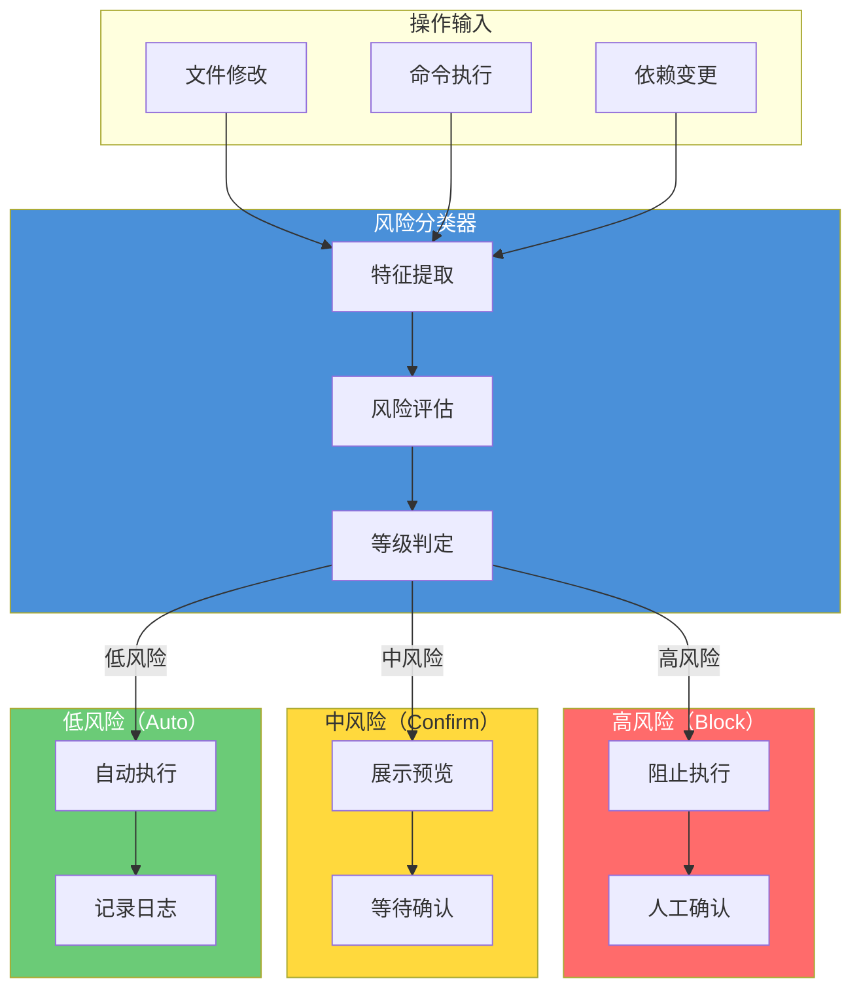

### 三级分类详解

#### 高风险（Block）

高风险操作必须阻止自动执行，强制人工确认：

| 操作类型 | 风险特征 | 示例 |
|---------|---------|------|
| **系统命令** | 删除、格式化、权限变更 | `rm -rf`、`chmod 777` |
| **敏感文件** | 配置文件、密钥文件 | `.env`、`credentials.json` |
| **数据库操作** | 删表、清空数据 | `DROP TABLE`、`TRUNCATE` |
| **网络操作** | 开放端口、暴露服务 | `0.0.0.0:8080` |

```yaml
# 高风险规则配置
high_risk_rules:
  - pattern: "rm\\s+-rf\\s+/"
    reason: "删除根目录"
    action: block
  
  - pattern: "DROP\\s+TABLE"
    reason: "删除数据库表"
    action: block
  
  - pattern: "\\.env"
    reason: "修改环境变量文件"
    action: block
  
  - pattern: "chmod\\s+777"
    reason: "设置危险权限"
    action: block
```

#### 中风险（Confirm）

中风险操作需要展示预览并等待确认：

| 操作类型 | 风险特征 | 示例 |
|---------|---------|------|
| **文件修改** | 修改现有文件内容 | 重构核心模块 |
| **依赖变更** | 添加/更新依赖包 | `npm install` |
| **批量操作** | 同时修改多个文件 | 批量重命名 |
| **配置修改** | 修改非敏感配置 | `tsconfig.json` |

```yaml
# 中风险规则配置
medium_risk_rules:
  - pattern: "npm\\s+install"
    reason: "安装新依赖"
    action: confirm
    preview: true
  
  - pattern: "git\\s+push"
    reason: "推送到远程仓库"
    action: confirm
  
  - pattern: "\\*\\.ts"
    reason: "批量修改 TypeScript 文件"
    action: confirm
    threshold: 5  # 超过 5 个文件需确认
```

#### 低风险（Auto）

低风险操作可自动执行并记录日志：

| 操作类型 | 风险特征 | 示例 |
|---------|---------|------|
| **新建文件** | 创建新文件（非敏感目录） | 新建组件文件 |
| **只读操作** | 读取文件、查询数据 | `cat`、`ls`、`grep` |
| **注释修改** | 仅修改注释内容 | 更新文档注释 |
| **格式化** | 代码格式化（无逻辑变更） | Prettier 格式化 |

```yaml
# 低风险规则配置
low_risk_rules:
  - pattern: "cat\\s+"
    reason: "读取文件"
    action: auto
  
  - pattern: "ls\\s+"
    reason: "列出目录"
    action: auto
  
  - pattern: "prettier\\s+--write"
    reason: "代码格式化"
    action: auto
  
  - pattern: "new file: src/components/"
    reason: "新建组件文件"
    action: auto
```

### 分类决策流程

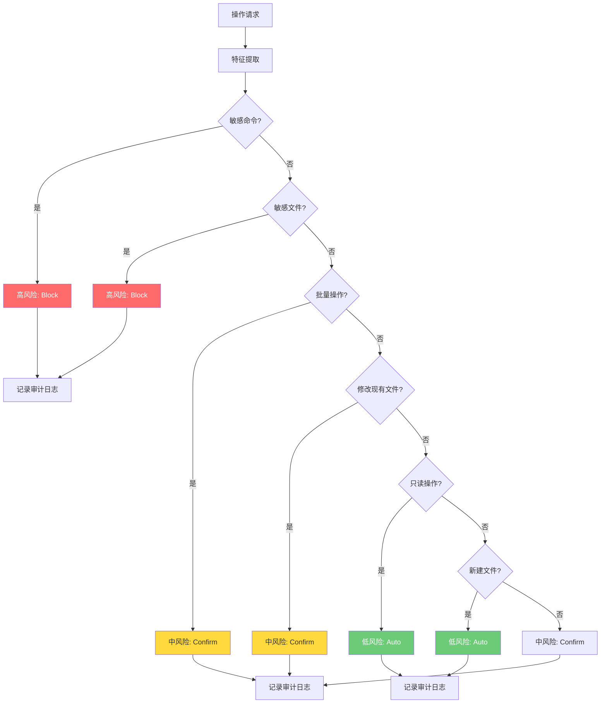

> 注意：此处的"分类"为基于规则的模式匹配，而非机器学习分类。规则包括命令黑名单、文件路径模式匹配、批量操作检测等。

### 自定义分类规则

项目可根据自身需求自定义分类规则：

```yaml
# .opencode/yolo-rules.yaml
version: "1.0"
rules:
  # 覆盖默认规则
  overrides:
    - pattern: "npm\\s+run\\s+build"
      default_risk: medium
      custom_risk: low
      reason: "构建命令已验证安全"
  
  # 新增项目特定规则
  custom:
    - pattern: "scripts/deploy\\.sh"
      risk: high
      reason: "部署脚本影响生产环境"
    
    - pattern: "src/legacy/"
      risk: medium
      reason: "遗留代码区域需谨慎修改"
    
    - pattern: "docs/"
      risk: low
      reason: "文档修改低风险"
  
  # 白名单配置
  whitelist:
    - pattern: "README.md"
      risk: low
    - pattern: "CHANGELOG.md"
      risk: low
```

### 误判处理与人工介入

分类器可能出现误判，需要建立人工介入机制：

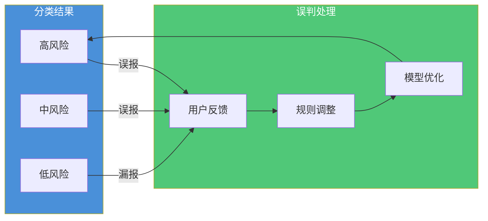

**误判类型**：

| 类型 | 定义 | 处理方式 |
|------|------|---------|
| **误报（False Positive）** | 低风险被判定为高风险 | 用户反馈后调整规则 |
| **漏报（False Negative）** | 高风险被判定为低风险 | 安全审计发现后紧急修复 |
| **边界模糊** | 风险等级难以判定 | 默认提升风险等级 |

## 自动验证机制

### LSP 验证链

LSP（Language Server Protocol）验证链是自动验证的核心，按顺序执行多级检查：

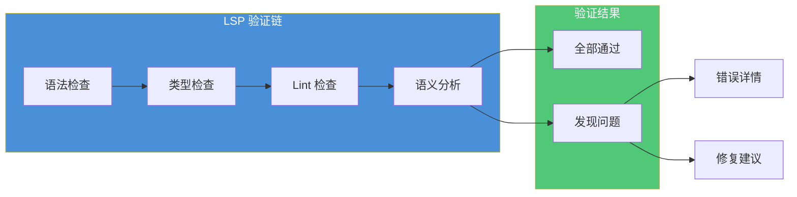

#### 语法检查

语法检查是第一道关卡，确保代码能够被解析：

```typescript
// 语法错误示例
function calculateTotal(items: Item[]) {
  return items.reduce((sum, item) => {
    return sum + item.price * item.quantity
    // 缺少右括号和分号
}
```

语法检查失败时，后续检查无法进行，必须优先修复。

#### 类型检查

TypeScript 类型检查确保类型安全：

```typescript
// 类型错误示例
interface User {
  id: number;
  name: string;
}

const user: User = {
  id: "123",  // 类型错误：string 不能赋值给 number
  name: "Alice"
};
```

类型检查覆盖：

- 类型赋值兼容性
- 函数参数类型
- 返回值类型
- 泛型约束

#### Lint 检查

Lint 检查确保代码符合规范：

```yaml:examples/validation/eslint-rules.yaml
rules:
  # 可能的问题
  "no-unused-vars": error
  "no-undef": error
  "no-console": warn
  
  # 最佳实践
  "eqeqeq": ["error", "always"]
  "curly": ["error", "all"]
  "no-var": error
  
  # 代码风格
  "indent": ["error", 2]
  "quotes": ["error", "single"]
  "semi": ["error", "always"]
```

#### 语义分析

语义分析检查代码逻辑正确性：

- 未使用的变量和导入
- 不可达代码
- 死循环检测
- 空值检查

### 测试自动执行

验证护栏自动触发测试执行：

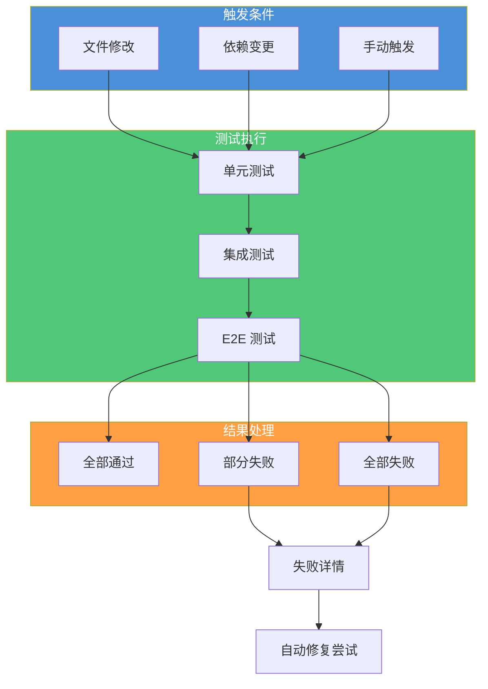

测试执行配置：

```yaml
# 测试配置
test_execution:
  # 单元测试
  unit:
    command: "npm run test:unit"
    coverage: true
    threshold: 80
    timeout: 60000
  
  # 集成测试
  integration:
    command: "npm run test:integration"
    trigger: "on_demand"  # 或 "always"
    timeout: 120000
  
  # E2E 测试
  e2e:
    command: "npm run test:e2e"
    trigger: "on_demand"
    timeout: 300000
```

### 架构符合性检查

验证护栏还检查代码是否符合项目架构规范：

```yaml
# 架构检查规则
architecture_rules:
  # 目录结构检查
  directory_structure:
    - path: "src/components/"
      allowed_files: ["*.tsx", "*.css", "*.test.tsx"]
    - path: "src/services/"
      allowed_files: ["*.ts", "*.test.ts"]
    - path: "src/utils/"
      allowed_files: ["*.ts", "*.test.ts"]
  
  # 命名规范检查
  naming_conventions:
    components: "PascalCase"
    functions: "camelCase"
    constants: "UPPER_SNAKE_CASE"
    files: "kebab-case"
  
  # 依赖方向检查
  dependency_direction:
    - from: "src/components/"
      to: "src/services/"
      allowed: true
    - from: "src/services/"
      to: "src/components/"
      allowed: false
      message: "服务层不应依赖组件层"
```

## 自动修复循环

### 修复流程

当验证失败时，自动修复循环尝试修复问题：

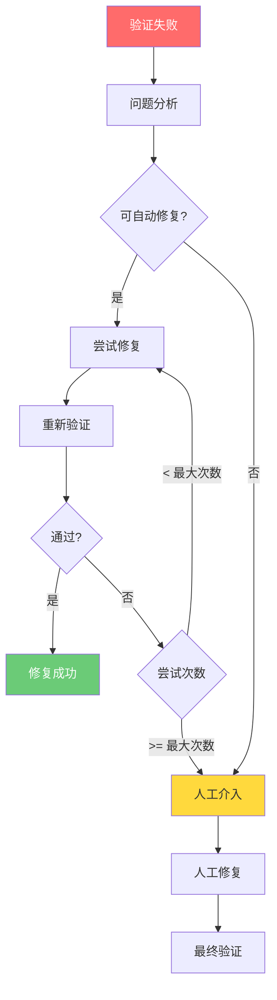

### 可自动修复的问题

| 问题类型 | 修复策略 | 成功率 |
|---------|---------|--------|
| **格式问题** | Prettier 自动格式化 | 99% |
| **Lint 错误** | ESLint --fix | 85% |
| **简单类型错误** | 类型推断和补全 | 60% |
| **导入问题** | 自动导入/删除未使用 | 90% |
| **测试失败** | 分析失败原因并修复 | 40% |

### 修复配置

```yaml
# 自动修复配置
auto_fix:
  enabled: true
  max_attempts: 3
  
  # 可自动修复的门禁
  fixable_gates:
    - lint
    - format
    - typecheck
  
  # 修复策略
  strategies:
    lint:
      command: "npm run lint --fix"
      timeout: 30000
    
    format:
      command: "npm run format"
      timeout: 30000
    
    typecheck:
      method: "ai_suggest"
      confidence_threshold: 0.8
  
  # 人工介入触发条件
  human_intervention:
    - gate: security
      always: true
    - gate: test
      after_attempts: 2
    - gate: coverage
      threshold_gap: 20  # 覆盖率差距 > 20%
```

### 修复日志与追溯

每次修复尝试都记录详细日志：

```json
{
  "timestamp": "2026-06-01T14:32:15Z",
  "session_id": "sess-abc123",
  "validation_failure": {
    "gate": "lint",
    "errors": [
      {
        "file": "src/components/Button.tsx",
        "line": 15,
        "rule": "react-hooks/exhaustive-deps",
        "message": "缺少依赖项 'onClick'"
      }
    ]
  },
  "fix_attempt": {
    "attempt": 1,
    "strategy": "ai_suggest",
    "changes": [
      {
        "file": "src/components/Button.tsx",
        "action": "modify",
        "diff": "@@ -15,3 +15,3 @@\n-  }, []);\n+  }, [onClick]);"
      }
    ],
    "confidence": 0.92
  },
  "revalidation": {
    "passed": true,
    "duration_ms": 1200
  }
}
```

## STRIDE 威胁建模分析

### STRIDE 威胁分类映射

STRIDE 是微软提出的安全威胁分类框架，用于系统性地识别和分析安全威胁。以下将验证护栏面临的主要威胁映射到 STRIDE 分类：

| STRIDE 威胁 | 验证护栏中的体现 | 风险等级 |
|------------|----------------|---------|
| **S** Spoofing（身份欺骗） | 伪造验证结果身份，冒充合法验证系统 | 中 |
| **T** Tampering（数据篡改） | 篡改门禁配置、分类规则、验证结果数据 | 高 |
| **R** Repudiation（否认） | 否认执行过验证失败的操作，缺少不可否认性 | 中 |
| **I** Information Disclosure（信息泄露） | 通过验证日志或错误信息泄露敏感代码内容 | 低 |
| **D** Denial of Service（拒绝服务） | 利用自动修复循环消耗系统资源，耗尽 Token 预算 | 中 |
| **E** Elevation of Privilege（权限提升） | 绕过 分类器，让高风险操作获得自动执行权限 | 高 |

### 验证护栏的攻击面

作为安全边界，验证护栏本身也是攻击目标：

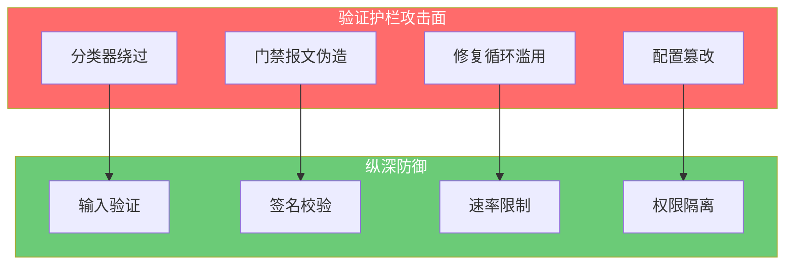

### 威胁一：分类器绕过

**攻击场景**：攻击者构造特殊输入，使高风险操作被误判为低风险。

**攻击向量**：

```javascript
// 攻击者尝试通过注释混淆绕过检测
const command = "rm -rf /";  // harmless comment

// 或使用编码绕过
const encoded = "cm0gLXJmIC8=";  // base64 编码
eval(atob(encoded));

// 或使用字符串拼接
const cmd = "rm" + " -rf " + "/";
```

**防御策略**：

| 防御措施 | 实现方式 |
|---------|---------|
| **多维度特征提取** | 不仅匹配文本，还分析 AST 结构 |
| **上下文感知分析** | 追踪变量赋值和函数调用链 |
| **沙箱预执行** | 在隔离环境中预执行，观察行为 |
| **异常行为检测** | 监控资源消耗、网络请求等异常指标 |

```yaml:examples/validation/yolo-classifier.yaml
# Requires OpenCode >= v1.15.x, OMO >= v4.5.x
yolo_classifier:
  # 多维度特征提取
  feature_extraction:
    - text_pattern
    - ast_analysis
    - data_flow
    - context_aware
  
  # 沙箱预执行
  sandbox_preview:
    enabled: true
    timeout: 5000
    resource_limits:
      cpu: "10%"
      memory: "100MB"
      network: "deny"
  
  # 异常行为检测
  anomaly_detection:
    - high_cpu_usage
    - unexpected_network
    - file_system_changes
    - process_spawning
```

### 威胁二：门禁报文伪造

**攻击场景**：攻击者伪造门禁通过报文，绕过验证直接入库。

**攻击向量**：

```json
// 攻击者尝试伪造验证结果
{
  "validation_result": "passed",
  "gates": {
    "compile": "passed",
    "security": "passed"
  },
  "signature": "forged_signature"
}
```

**防御策略**：

| 防御措施 | 实现方式 |
|---------|---------|
| **数字签名** | 所有验证结果使用私钥签名 |
| **时间戳验证** | 防止重放攻击 |
| **会话绑定** | 验证结果与特定会话绑定 |
| **审计日志** | 完整记录验证过程 |

```yaml
# 验证结果签名配置
validation_signing:
  algorithm: "RS256"
  key_rotation: "30d"
  timestamp_tolerance: 300  # 5 分钟有效期
  
  audit:
    enabled: true
    retention: "365d"
    format: "json"
    storage: "secure_log"
```

### 威胁三：修复循环滥用

**攻击场景**：攻击者利用自动修复循环消耗系统资源或触发意外行为。

**攻击向量**：

- 构造难以修复的问题，触发大量修复尝试
- 利用修复过程中的副作用执行恶意操作
- 通过修复循环绕过速率限制

**防御策略**：

| 防御措施 | 实现方式 |
|---------|---------|
| **修复次数限制** | 最大修复次数 + 冷却期 |
| **资源配额** | 单次修复的 CPU/内存/时间限制 |
| **副作用隔离** | 修复过程在沙箱中执行 |
| **行为监控** | 监控修复过程的异常行为 |

```yaml
# 修复循环防护配置
fix_loop_protection:
  max_attempts: 3
  cooldown_period: 300  # 5 分钟冷却
  
  resource_quotas:
    cpu: "50%"
    memory: "512MB"
    time: 60000  # 60 秒
  
  sandbox:
    enabled: true
    network: "deny"
    filesystem: "read_write_restricted"
  
  monitoring:
    alert_on_threshold:
      - attempts: 3
        action: "notify_admin"
      - attempts: 5
        action: "disable_auto_fix"
```

### 威胁四：配置篡改

**攻击场景**：攻击者修改验证护栏配置，降低安全级别。

**攻击向量**：

- 修改 `quality-gates.json` 降低门禁阈值
- 篡改分类规则将高风险操作标记为低风险
- 禁用关键验证门禁

**防御策略**：

| 防御措施 | 实现方式 |
|---------|---------|
| **配置文件权限** | 限制配置文件写入权限 |
| **配置签名验证** | 配置文件需要签名才能生效 |
| **变更审计** | 记录所有配置变更 |
| **基线检查** | 定期检查配置是否偏离安全基线 |

```yaml:examples/validation/config-protection.yaml
# Requires OpenCode >= v1.15.x, OMO >= v4.5.x
config_protection:
  # 文件权限
  file_permissions:
    "quality-gates.json": "0644"  # 只读
    "yolo-rules.yaml": "0644"
  
  # 签名验证
  signature_verification:
    required: true
    algorithm: "RS256"
  
  # 变更审计
  change_audit:
    enabled: true
    notify: ["security-team@example.com"]
  
  # 基线检查
  baseline_check:
    enabled: true
    schedule: "daily"
    alert_on_drift: true
```

### 纵深防御架构

验证护栏采用纵深防御策略，多层防护确保安全：

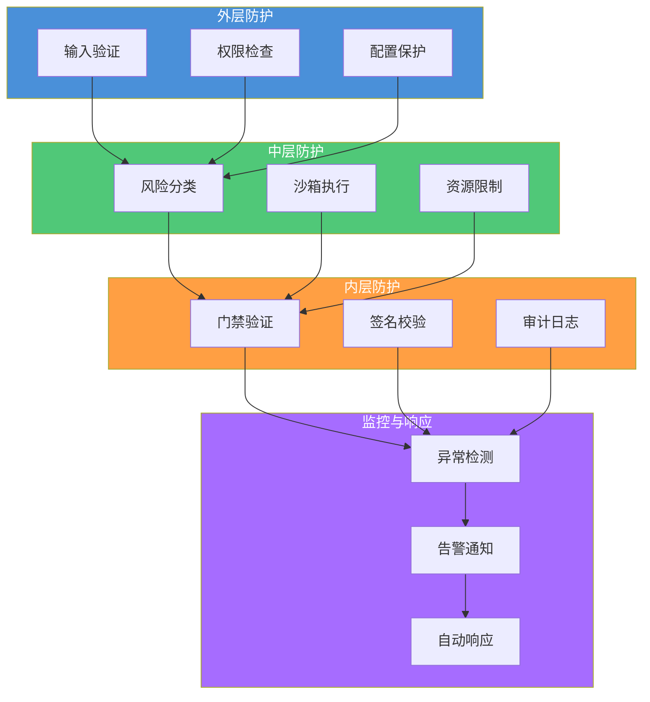

## 小结

验证护栏是 Harness Engineering 中确保代码质量的最后一道防线。它与约束系统形成互补：约束管"准入"，验证管"准出"。通过三级质量门禁（硬性/质量/量化）、风险分类器、LSP 验证链和自动修复循环，验证护栏实现了自动化、可追溯、可配置的验证体系。

安全是验证护栏设计的核心考量。通过威胁建模分析，我们识别了 分类器绕过、门禁报文伪造、修复循环滥用、配置篡改等主要威胁，并设计了相应的纵深防御策略。在实际应用中，验证护栏需要根据项目特点持续优化，平衡安全性与开发效率。

下一章将进入环境搭建实战，读者将学习如何在 OpenCode 中配置完整的验证护栏体系。

---

## 学习检查清单

完成本章学习后，请确认你能够：

- [ ] 解释约束系统与验证护栏的根本区别（准入 vs 准出）
- [ ] 区分三级质量门禁（硬性/质量/量化）的检查内容和失败后果
- [ ] 说明 分类器的三级风险分类（高/中/低）及其执行策略
- [ ] 描述 LSP 验证链的四个检查阶段（语法→类型→Lint→语义）
- [ ] 配置自动修复循环的最大尝试次数和可修复门禁类型

## 关联章节

- ← [约束系统解析](constraints-system.md)：约束系统是验证的前置条件，约束管"准入"、验证管"准出"
- ← [上下文工程核心](context-engineering-core.md)：验证结果反馈到上下文，影响后续 Agent 决策
- → [环境搭建](../03-setup/)：验证护栏在 opencode.json 中的具体配置实现
- → [Skill 开发](../05-skills/)：Skill 输出的验证标准与最佳实践
- → [高级话题](../06-advanced/)：安全总览、沙箱与 Hook 系统的深度展开
- → [案例研究](../07-case-studies/)：质量门禁在真实项目中的应用与效果
