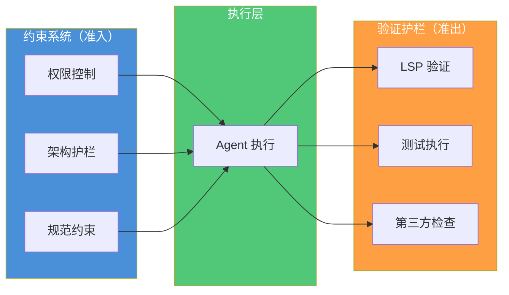
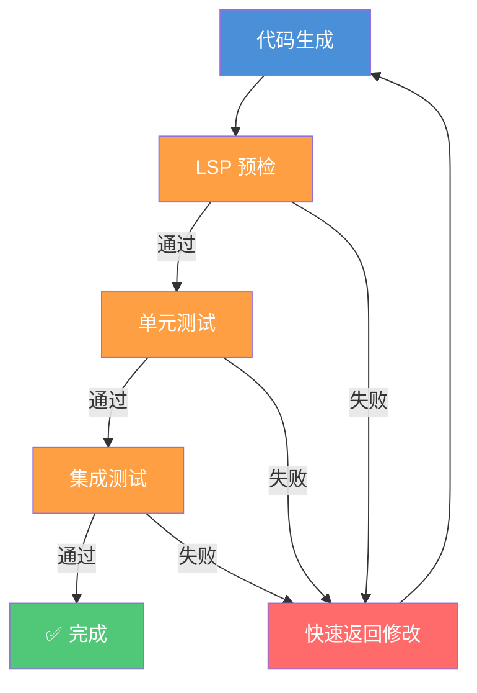

# 验证护栏体系

> 确保 AI 生成代码的质量保障——从权限控制到 LSP 验证的验证系统。

> **前置条件**
> - 已完成 [约束系统解析](constraints-system.md)，理解约束系统的三层架构
> - 已完成 [上下文工程核心](context-engineering-core.md)，理解上下文与约束的协作关系
> - 已安装 OpenCode CLI 并完成基础配置
> - 已了解 LSP（Language Server Protocol）和代码质量检查的基本概念

## 文章概述

如果说约束系统管理 **Agent（智能体）** 的"准入"（什么可以做），验证护栏就管理"准出"（做的结果对不对）。这是 AI 编程工作流中防止低质量代码进入仓库的最后一道防线。本章节系统讲解验证护栏的定位——与约束系统的根本区别——以及 **Harness Engineering（驾驭工程）** 中验证的三个原则（自动化、可追溯、可配置）。

读者将理解 OpenCode 中验证的核心机制：权限控制（allow/ask/deny）、LSP 验证链（语法→类型→lint→语义）、以及第三方工具（如 opencode-swarm）实现的门禁功能。**重要说明**：本文描述的部分功能（如"质量门禁"、"风险分类器"）是架构设计建议，OpenCode 原生实现通过 `permission` 配置和第三方插件系统提供类似能力。

读完本文，你将能够配置 OpenCode 的验证系统，理解权限控制机制，以及选择适合项目的第三方验证工具。

> **⏱ 时间有限？先读这些：** 权限控制机制 → LSP 验证链 → 第三方验证工具 → 最佳实践建议

### 操作系统类比：验证护栏 = CI 质量门禁

理解验证护栏最直观的方式是将其类比为操作系统和 CI 系统的**质量保障机制**：

| 操作系统概念 | OpenCode 对应 | 说明 |
|-------------|---------------|------|
| CI Pipeline 质量门禁 / Git Hook | Validation Gate | 代码入库前必须通过的质量检查关卡 |
| 权限控制 / 访问管理 | Permission System | 控制工具调用的 allow/ask/deny 策略 |
| 操作系统自动错误恢复 / fsck | 工具辅助修复 | 检测到问题时提供修复建议 |
| 系统日志 / Event Viewer | Audit Log | 完整记录所有操作过程 |
| 文件系统配额 | 资源限制 | 对 Token、时间、资源使用设置限制 |
| 插件系统 | 扩展能力 | 通过第三方插件实现自定义验证 |

这个类比帮助理解几个关键设计：

1. **门禁阻断**：就像 Git Hook 在 commit 前拦截问题，验证门禁在代码入库前拦截低质量代码
2. **权限控制**：OpenCode 通过 `permission` 系统控制工具调用，而非"风险分类器"
3. **工具辅助**：利用 LSP、ESLint、测试工具等第三方工具提供验证能力

### 最小示例

用一个最简单的配置来理解验证护栏：

```json:examples/opencode-configs/basic.jsonc
{
  "yolo": true,
  "lsp": {
    "enabled": true
  }
}
```

这段配置的意思是：启用 YOLO 模式（自动通过权限请求）和 LSP 验证。这就是验证护栏的基础配置——**控制权限 + LSP 验证**。

## 权限控制系统

### OpenCode 原生权限机制

OpenCode 的权限控制是验证系统的核心，通过 `permission` 配置实现：

```jsonc:examples/opencode-configs/basic.jsonc
{
  "permission": {
    "read": "allow",
    "edit": "allow",
    "bash": "ask",
    "glob": "deny"
  }
}
```

OpenCode 权限系统的特点：每个工具可以设置为 **allow**（自动执行）、**ask**（请求确认）或 **deny**（禁止执行）：

| 控制级别 | 说明 | 使用场景 |
|---------|------|---------|
| **allow** | 允许自动执行 | 读取文件、写入文件等安全操作 |
| **ask** | 请求用户确认 | 执行 shell 命令、修改配置文件 |
| **deny** | 禁止执行 | 危险操作、敏感文件修改 |

### 权限作用域

OpenCode 的权限控制可以在多个作用域配置：

| 作用域 | 配置位置 | 说明 |
|-------|---------|------|
| **全局** | `opencode.json` | 适用于所有项目 |
| **项目级** | `.opencode/config.json` | 仅当前项目 |
| **会话级** | 会话内临时配置 | 临时调整 |
| **工具级** | 工具特定的配置 | 针对特定工具 |

### 权限与约束系统的关系



**约束系统**在 Agent 执行前生效，回答"能不能做"的问题：
- 权限控制：Agent 是否有权限访问这个文件？
- 架构护栏：这个修改是否符合架构规范？
- 规范约束：生成的代码是否符合团队编码规范？

**验证护栏**在 Agent 执行后生效，回答"做得对不对"的问题：
- LSP 验证：代码能否通过 LSP 检查？
- 测试验证：单元测试是否通过？
- 第三方检查：使用 ESLint、prettier 等工具检查

## LSP 验证机制

### LSP 在 OpenCode 中的作用

LSP（Language Server Protocol）是 OpenCode 原生的代码质量检查机制。当启用 LSP 时，OpenCode 会：

1. **加载语言服务器**：根据当前文件类型加载对应的 LSP 服务器（如 TypeScript、Python、Go 等）
2. **实时诊断**：在 view/write/edit 操作后展示所有诊断信息
3. **辅助修复**：提供代码修复建议和快速修复命令

### LSP 验证流程

```mermaid
flowchart TB
    subgraph LSP 流程 ["LSP 验证流程"]
        A[Agent 操作] --> B{文件类型？}
        B -->|TypeScript| C[加载 TypeScript LSP]
        B -->|Python| D[加载 Python LSP]
        B -->|其他| E[加载对应 LSP]
        C --> F[执行诊断]
        D --> F
        E --> F
        F --> G[返回诊断结果]
        G --> H[展示给 LLM]
        H --> I[LLM 修复问题]
    end
    
    style LSP 流程 fill:#4A90D9,color:#fff
```

**注意**：OpenCode 的 LSP 验证是**一次性诊断**，不是"语法→类型→lint→语义"的顺序检查链。LSP 服务器会一次性返回所有诊断信息。

### 启用 LSP 配置

```jsonc:examples/opencode-configs/basic.jsonc
{
  "lsp": {
    "enabled": true,
    "servers": [
      "typescript",
      "eslint",
      "prettier"
    ]
  }
}
```

### LSP 工具的使用

OpenCode 提供了 `lsp` 工具，当设置 `OPENCODE_EXPERIMENTAL_LSP_TOOL=true` 环境变量时可用：

```bash:terminal
# 启用 LSP 工具
export OPENCODE_EXPERIMENTAL_LSP_TOOL=true

# 使用 LSP 工具
opencode --lsp
```

## 第三方验证工具

### 为什么需要第三方工具？

OpenCode 原生提供基础的权限控制和 LSP 验证，但更复杂的验证需求（如门禁配置、自动化测试、代码质量检查）需要通过第三方工具实现。

### 主流第三方验证方案

#### 1. opencode-swarm

**opencode-swarm**（zaxbysauce/opencode-swarm）是一个多 Agent 协作框架，提供完整的验证流水线：

- **reviewer Agent**：代码审查
- **test_engineer Agent**：自动化测试
- **SAST 门禁**：静态应用安全测试
- **质量预算（quality_budget）**：限制代码变更范围

#### 2. oh-my-openagent (OMO)

**oh-my-openagent** 提供了 gate primitives，可以在复杂的代码库中实现门禁控制。

#### 3. Open Code Review

**Open Code Review**（raye-deng）是专门用于 CI/CD 质量门禁的工具，检测 AI 生成的代码缺陷。

### 配置示例

```yaml:examples/skills/custom-skill-example.yaml
# 使用 Skill 实现验证逻辑
name: custom-validation
description: 自定义验证逻辑
language: yaml
entry: ./entry.sh
config:
  command: npm run test
  timeout: 60000
```

## 最佳实践建议

以下是推荐的做法，不是 OpenCode 的强制要求。根据项目规模和团队情况选择适合的方案。

### 1. 渐进式验证策略

对于新项目，建议从简单到复杂逐步启用验证功能：

1. **第一阶段**：基础 LSP 验证
2. **第二阶段**：添加单元测试
3. **第三阶段**：引入第三方门禁工具
4. **第四阶段**：配置自动化审查流程

### 2. 平衡安全与效率

验证系统的设计需要在安全性和开发效率之间找到平衡：

| 验证级别 | 安全性 | 开发效率 | 推荐场景 |
|---------|-------|---------|---------|
| **基础 LSP** | 中 | 高 | 所有项目 |
| **单元测试** | 高 | 中 | 核心功能 |
| **门禁系统** | 高 | 低 | 生产环境 |
| **完整审查** | 极高 | 低 | 关键变更 |

### 3. 避免过度工程化

根据项目规模和复杂度选择合适的验证方案：

- **小型项目**：基础 LSP + ESLint 即可
- **中型项目**：添加单元测试 + 简单的门禁检查
- **大型项目**：完整的验证流水线 + CI/CD 集成

## 循环中的验证

验证护栏在前述章节被定位为"准出"机制。但在循环工程场景中，验证的角色更为动态——它不再是一次性关卡，而是迭代循环中的**质量门控信号**。以下描述的是推荐的验证模式，可通过 OpenCode 的 LSP 集成和第三方工具组合实现。

**验证在循环中的三种工作模式**：

1. **轻量预检（快速失败）**：在完整验证前先用 LSP 做语法检查，语法错误直接返回修改。越早失败，浪费越少
2. **渐进式验证**：先做轻量检查（LSP → lint），再做深度检查（单元测试 → 集成测试）。每通过一级，置信度提升一级
3. **基于验证的停止条件**：验证结果作为循环终止信号。定义明确的停止规则能有效防止死循环：
   - **通过停止**：连续 3 次验证通过 → 循环结束
   - **失败熔断**：同一验证连续失败 N 次 → 切换人工模式
   - **超时停止**：验证总耗时超过阈值 → 终止并输出部分结果



> → 上下文窗口膨胀导致的 Agent 输出退化是循环工程中的常见陷阱，详见 [性能调优与成本管理](../06-advanced/context/performance-tuning.md)。

## 架构建议（设计模式）

> **注意**：以下内容是架构设计建议，不是 OpenCode 的内置功能。OpenCode 原生提供权限系统（`permission` 配置）和 LSP 集成，更复杂的验证模式可通过第三方工具或自定义脚本实现。

### 验证护栏设计模式

虽然 OpenCode 原生不直接提供"质量门禁"、"风险分类器"等配置，但作为架构设计模式，以下设计值得参考：

#### 三级门禁架构（建议）

```text:terminal
┌─────────────────────────────────────────┐
│   硬性门禁（Block）     │
│   - 编译/语法检查      │
│   - 类型检查           │
└─────────────────────────────────────────┘
              ↓
┌─────────────────────────────────────────┐
│   质量门禁（Warn）     │
│   - 测试覆盖率          │
│   - 代码规范           │
│   - 复杂度检查          │
└─────────────────────────────────────────┘
              ↓
┌─────────────────────────────────────────┐
│   量化门禁（Review）   │
│   - 性能指标           │
│   - 安全评分           │
│   - 技术债务           │
└─────────────────────────────────────────┘
```

**说明**：这是建议性的架构设计，可通过第三方工具（如 opencode-swarm）实现。

### 风险分类器设计模式（建议）

**注意**：OpenCode YOLO mode 是简单的布尔开关（`"yolo": true`），不是复杂的规则引擎。以下设计模式仅供参考：

| 风险等级 | 策略 | 示例 |
|---------|------|------|
| **低风险** | 自动执行 | 新建文件、只读操作 |
| **中风险** | 请求确认 | 修改文件、添加依赖 |
| **高风险** | 阻止或人工 | 系统命令、数据库操作 |

### 自动修复循环设计（建议）

**说明**：OpenCode 不提供内置的自动修复循环，但可通过以下方式实现：

1. **ESLint --fix**：自动化修复 lint 问题
2. **Prettier**：代码格式化
3. **TypeScript**：类型推断和补全
4. **自定义脚本**：针对特定问题的修复脚本

## 安全考虑

### 安全威胁分析

验证系统本身也可能面临安全威胁，需要了解主要风险：

| 威胁类型 | 说明 | 缓解措施 |
|---------|------|---------|
| **配置篡改** | 修改验证配置 | 配置文件权限控制 |
| **绕过验证** | 直接跳过门禁 | CI/CD 集成验证 |
| **工具漏洞** | 第三方工具存在漏洞 | 定期更新和审计 |

### 纵深防御策略

建议采用多层验证确保代码质量。OpenCode 原生提供 LSP 集成和权限控制，以下层级可通过组合原生功能和第三方工具实现：

1. **本地验证**：LSP、ESLint、prettier
2. **CI 验证**：单元测试、集成测试
3. **人工审查**：PR 审查、代码评审
4. **监控告警**：生产环境监控

## 小结

验证护栏是 Harness Engineering 中确保代码质量的关键机制。OpenCode 通过以下方式提供验证能力：

- **权限系统**：控制工具调用的 allow/ask/deny 策略
- **LSP 集成**：实时代码质量检查
- **插件系统**：通过第三方工具扩展验证能力

**重要说明**：本文描述的部分高级功能（如"质量门禁"、"风险分类器"）是架构设计建议，当前 OpenCode 实现主要通过权限系统和第三方插件提供类似能力。

下一章将进入环境搭建实战，读者将学习如何在 OpenCode 中配置完整的验证体系。

---

## 学习检查清单

完成本章学习后，请确认你能够：

- [ ] 解释约束系统与验证护栏的根本区别（准入 vs 准出）
- [ ] 说明 OpenCode 权限控制机制（allow/ask/deny）
- [ ] 描述 LSP 验证机制的工作方式
- [ ] 选择合适的第三方验证工具
- [ ] 配置 OpenCode 的基本验证系统

## 关联章节

- ← [约束系统解析](constraints-system.md)：约束系统是验证的前置条件
- ← [上下文工程核心](context-engineering-core.md)：验证结果反馈到上下文
- → [环境搭建](../03-setup/)：验证护栏在 opencode.json 中的具体配置实现
- → [**Skill（技能）** 开发](../05-skills/)：Skill 输出的验证标准与最佳实践
- → [高级话题](../06-advanced/)：**MCP（模型上下文协议）** 服务器、安全模型、可观测性
- → [案例研究](../07-case-studies/)：质量门禁在真实项目中的应用
