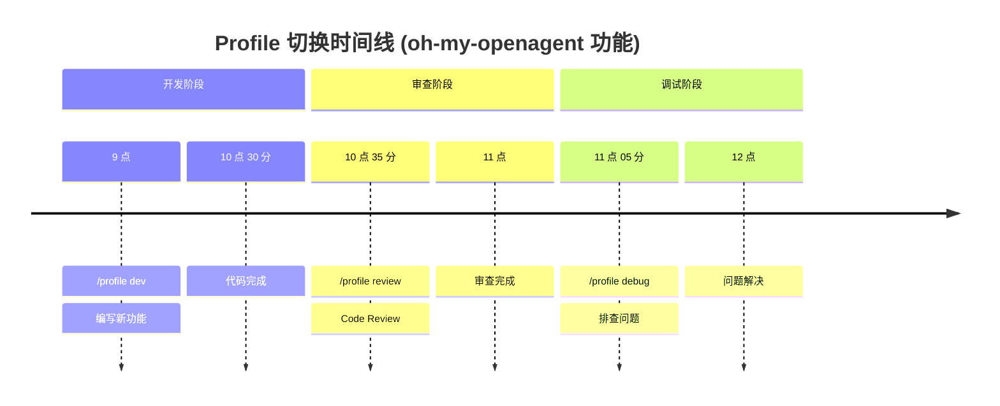
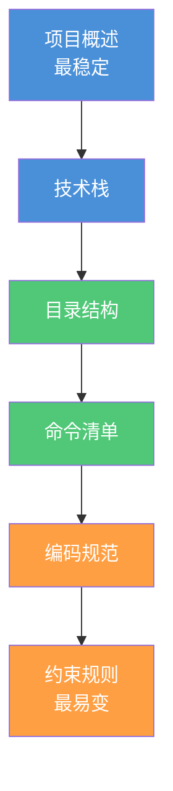

# 工作流模式

> 将 Agent 与 Skill 组合为可重复的执行流程——从命令快捷方式到高级编排模式的完整工作流体系。

工作流把 Agent 和 Skill 串联成可重复的执行流程。Agent 是执行者，Skill 是技能包，工作流就是把这些要素组合起来完成实际任务的操作指南。本章从 Command 系统入手，讲解如何将日常操作固化为可复用的命令，如何通过 Profile 切换适应不同工作状态，以及如何借助 AGENTS.md 实现项目知识的持久化。最后，我们对比 Ultrawork 与 Prometheus 两种高级工作流模式，帮助读者在不同场景下做出合理选择。

读完本文，你将能够将日常操作封装为可复用的 Command，通过 Profile 适配不同工作场景，以及选择适合的任务编排模式。

> **⏱ 时间有限？先读这些：** Command 系统 → Profile 切换 → AGENTS.md：项目知识库

### 最小示例

用一个最简单的自定义命令来理解工作流：

```markdown
# 保存为 .opencode/commands/hello.md
你好世界

请用中文回复"你好，世界！"，并加上当前时间。
```

保存后，在 OpenCode 中输入 `/你好世界`，Agent 就会自动执行这条命令。工作流的本质就是**把固定步骤封装为可复用的命令**——就像写 Shell 脚本一样简单。

### 操作系统类比：Workflow = Shell Pipeline

理解工作流最直观的方式是将其类比为操作系统的 **Shell 流水线**：

| 操作系统概念 | OpenCode 对应 | 说明 |
|-------------|---------------|------|
| Shell Pipeline | Workflow | 将多个命令串联成自动化流程 |
| Shell Alias / PATH 命令 | Command | 将复杂操作封装为简短命令 |
| 环境变量 / Profile.d 配置 | Profile | 按场景切换运行时环境配置 |
| Cron Job | 定时工作流 | 按计划自动执行预定义流程 |
| Shell 脚本 | AGENTS.md | 项目级别的执行指令和规范集合 |

这个类比帮助理解几个关键设计：

1. **可组合性**：就像 Shell Pipeline 用 `|` 串联命令，Workflow 将多个 Skill 和 Command 串联成完整流程
2. **可复用性**：Shell Alias 将复杂命令简化为别名，Command 系统同样将操作序列封装为 `/command`
3. **场景切换**：Profile.d 配置按场景加载不同环境变量，Profile 按工作场景切换 Agent 行为

## Command 系统

Command（命令）是 OpenCode 中最直观的工作流入口。它将复杂的操作序列封装为简单的 `/command` 形式，让用户无需记忆繁琐的步骤，只需一个关键词即可触发预设行为。

### 内置命令一览

OpenCode 提供了 5 个核心内置命令，覆盖项目初始化、会话管理、模型切换等核心场景：

| 命令 | 功能 | 典型使用场景 |
|------|------|-------------|
| `/init` | 生成 AGENTS.md | 新项目首次打开，建立项目知识库 |
| `/undo` | 撤销上一步操作 | 回滚错误的文件修改 |
| `/redo` | 重做撤销的操作 | 恢复误撤销的修改 |
| `/share` | 导出会话 | 分享调试过程或协作排查 |
| `/help` | 显示帮助 | 查看可用命令和快捷键 |

> **说明**：Plan 是 OpenCode 的**只读分析模式**，通过 **Tab 键**切换到 Plan Agent。其他内置命令包括 `/new`（新建会话）、`/sessions`（会话管理）、`/compact`（上下文压缩）、`/export`（导出）、`/connect`（添加 LLM Provider）、`/models`（模型列表）、`/themes`（主题）、`/editor`（编辑器）、`/details`（工具详情）、`/thinking`（推理显示）、`/exit`（退出）。

**`/init` 的工程价值**：`/init` 命令会扫描项目结构，自动生成 AGENTS.md 文件。这是 OpenCode 工程化的起点——让 Agent "认识"你的项目。生成的 AGENTS.md 包含项目概述、技术栈识别、目录结构说明等基础信息，后续可根据团队规范扩展。

**Plan 模式的安全意义**：切换到 Plan 模式后，Agent 进入只读分析状态，文件编辑被禁止，命令执行需用户确认。这是 Harness Engineering "先思考后执行"原则的具体体现，适用于需要分析但不应该改动的场景。

### 自定义命令的两种方式

OpenCode 支持两种自定义命令的方式：**Markdown 文件（推荐）** 和 **opencode.json 配置**。

#### 方式一：Markdown 文件（推荐）

在 `.opencode/commands/` 目录下创建 Markdown 文件，文件名即为命令名：

```markdown:examples/skills/hello-world/SKILL.md
# review-pr

你是一个专业的代码审查助手。请执行以下步骤：

1. 使用 `git diff main...HEAD` 获取当前分支的所有变更
2. 逐文件审查变更内容，关注：
   - 代码逻辑正确性
   - 潜在的安全风险
   - 性能问题
   - 代码风格一致性
3. 输出结构化的审查报告

## 输出格式

### 审查摘要
- 文件数量：X 个
- 发现问题：Y 个（严重 Z 个，一般 W 个）

### 问题清单
| 文件 | 行号 | 级别 | 问题描述 | 建议修复 |
|------|------|------|---------|---------|
| ... | ... | ... | ... | ... |
```

将此文件保存为 `.opencode/commands/review-pr.md`，即可通过 `/review-pr` 调用。

**优势**：
- 版本控制友好，可直接提交到 Git
- 团队共享方便，克隆仓库即可获得所有命令
- 支持 Markdown 格式化，可读性强

#### 方式二：opencode.json 配置

在 `opencode.json` 的 `command` 字段中定义：

```json:examples/opencode-configs/basic.jsonc
{
  "$schema": "https://opencode.ai/config.json",
  "command": {
    "test-coverage": {
      "template": "运行测试并生成覆盖率报告，标记覆盖率低于 80% 的文件",
      "description": "测试覆盖率检查",
      "agent": "build",
      "model": "anthropic/claude-sonnet-4-20250514"
    },
    "security-scan": {
      "template": "执行安全扫描，检查依赖漏洞和代码风险",
      "description": "安全扫描"
    }
  }
}
```

**适用场景**：需要指定特定 Agent 或模型的命令，或需要限制工具权限的场景。

### 模板语法

自定义命令支持三种模板语法，实现动态内容注入：

| 语法 | 功能 | 示例 |
|------|------|------|
| `$ARGUMENTS` | 命令参数替换 | `/search $ARGUMENTS` |
| `!shell` | Shell 命令输出 | `!git branch --show-current` |
| `@file` | 文件内容引用 | `@docs/api-spec.md` |

**$ARGUMENTS 示例**：

```markdown
# search

在代码库中搜索 $ARGUMENTS，返回匹配的文件和行号。
使用 ripgrep 进行高效搜索，忽略 node_modules 和 .git 目录。
```

调用方式：`/search API_KEY`，Agent 会将 `$ARGUMENTS` 替换为 `API_KEY`。

**!shell 示例**：

```markdown
# branch-status

当前分支：!git branch --show-current
最近提交：!git log -1 --oneline
未提交变更：!git status --short
```

每次执行 `/branch-status` 时，会动态获取当前 Git 状态。

**@file 示例**：

```markdown
# implement-api

根据以下 API 规范实现接口：

@docs/api-spec.md

请遵循项目的编码规范，并添加单元测试。
```

`@file` 语法会将指定文件的内容完整注入到 Prompt 中。

### 高级特性

**指定 Agent**：通过 frontmatter 指定执行命令的 Agent 类型：

```markdown
---
agent: plan
---

# analyze-architecture

分析当前项目的架构设计，输出架构图和改进建议。
```

**指定模型**：为特定命令指定使用的模型：

```markdown
---
model: claude-opus-4
---

# complex-refactor

执行复杂的重构任务，需要深度推理能力。
```

**子命令**：支持 `command:subcommand` 形式的命令层级：

```
/review:security    # 安全审查
/review:performance # 性能审查
/review:style       # 代码风格审查
```

### 团队共享命令库

将 `.opencode/commands/` 目录提交到 Git，团队成员克隆仓库后即可使用所有自定义命令。建议的目录结构：

```
.opencode/
├── commands/
│   ├── review/
│   │   ├── security.md
│   │   ├── performance.md
│   │   └── style.md
│   ├── deploy/
│   │   ├── staging.md
│   │   └── production.md
│   └── utils/
│       ├── branch-status.md
│       └── search.md
└── AGENTS.md
```

---

## Profile 切换

不同的工作场景需要不同的 Agent 行为偏好。写代码时需要高效执行，Code Review 时需要谨慎分析，Debug 时需要详细日志。Profile（配置档案）机制让用户可以在多套预设配置之间快速切换。

### 三套 Profile 示例

#### dev Profile（开发模式）

```json:examples/opencode-configs/profiles/dev.json
{
  "profile": "dev",
  "model": {
    "default": "claude-sonnet-4-20250514"
  },
  "agent": {
    "default_mode": "build",
    "auto_approve": true
  },
  "tools": {
    "bash": "allow",
    "edit": "allow",
    "write": "allow"
  },
  "behavior": {
    "verbose": false,
    "confirm_before_execute": false
  }
}
```

**特点**：
- 默认 Build 模式，允许文件编辑和命令执行
- 自动批准工具调用，减少交互中断
- 适合日常开发、快速迭代

#### review Profile（审查模式）

```json:examples/opencode-configs/profiles/review.json
{
  "profile": "review",
  "model": {
    "default": "claude-sonnet-4-20250514"
  },
  "agent": {
    "default_mode": "plan",
    "auto_approve": false
  },
  "tools": {
    "bash": "ask",
    "edit": "deny",
    "write": "deny"
  },
  "behavior": {
    "verbose": true,
    "confirm_before_execute": true
  }
}
```

**特点**：
- 默认 Plan 模式，只读分析
- 禁止文件编辑，防止误操作
- 详细输出，便于审查
- 适合 Code Review、安全审计

#### debug Profile（调试模式）

```json:examples/opencode-configs/profiles/debug.json
{
  "profile": "debug",
  "model": {
    "default": "claude-sonnet-4-20250514"
  },
  "agent": {
    "default_mode": "build",
    "auto_approve": false
  },
  "tools": {
    "bash": "ask",
    "edit": "ask",
    "write": "ask"
  },
  "behavior": {
    "verbose": true,
    "confirm_before_execute": true,
    "log_level": "debug"
  }
}
```

**特点**：
- 允许执行但需要确认
- 详细日志输出
- 适合问题排查、故障诊断

### Profile 继承机制

通过 `$extends` 字段实现配置复用：

```json:examples/opencode-configs/profiles/extended.json
{
  "profile": "debug-verbose",
  "$extends": "debug",
  "behavior": {
    "log_level": "trace",
    "show_token_usage": true
  }
}
```

`debug-verbose` 继承了 `debug` 的所有配置，并覆盖了日志级别。

> **注意**：Profile 系统（`$extends` 继承、`/profile` 命令、`opencode --profile` 标志）是 **oh-my-openagent** 插件的功能，而非 OpenCode 核心系统。OpenCode 原生支持通过 Tab 键切换 Plan/Build 两种 Agent 模式，配置层级为：全局配置 → 项目配置 → 环境变量 → CLI 标志。

### 命令行选择 Profile

```bash
# 注意：--profile 和 /profile 命令是 oh-my-openagent 插件功能，非 OpenCode 核心特性
# OpenCode 原生通过 Tab 键切换 Plan/Build 模式

# 启动时指定 Profile (oh-my-openagent 功能)
opencode --profile review

# 会话中切换 Profile (oh-my-openagent 功能)
/profile review
```



---

## AGENTS.md：项目知识库

AGENTS.md 是 OpenCode 工程化的核心契约文件。它让 Agent "理解"项目上下文，是团队开发规范的代码化载体。

### /init 生成机制

执行 `/init` 命令时，OpenCode 会：

1. 扫描项目根目录结构
2. 识别技术栈（通过 package.json、go.mod、requirements.txt 等）
3. 检测构建工具和测试框架
4. 生成初始 AGENTS.md 文件

生成的文件包含项目概述、技术栈、目录结构等基础信息，是进一步定制的起点。

### AGENTS.md 的金字塔结构

一个完整的 AGENTS.md 应遵循"金字塔"结构——从宏观到微观，从稳定到易变：



**层级说明**：

| 层级 | 内容 | 稳定性 | 更新频率 |
|------|------|--------|---------|
| 项目概述 | 项目目标、核心功能 | 极高 | 极少 |
| 技术栈 | 语言、框架、数据库 | 高 | 按季度 |
| 目录结构 | 主要目录职责 | 中 | 按月 |
| 命令清单 | 自定义命令说明 | 中 | 按月 |
| 编码规范 | 代码风格、命名约定 | 低 | 按周 |
| 约束规则 | 文件访问限制、工具权限 | 低 | 按需 |

### AGENTS.md 完整模板

```markdown
# 项目名称 — AGENTS.md

## 项目概述

[一句话描述项目目标和核心价值]

## 技术栈

- **语言**：[编程语言及版本]
- **框架**：[主要框架]
- **数据库**：[数据库类型]
- **构建工具**：[构建/包管理工具]
- **测试框架**：[测试工具]

## 目录结构

project/
├── src/           # 源代码
├── tests/         # 测试文件
├── docs/          # 文档
├── scripts/       # 脚本工具
└── config/        # 配置文件


## 常用命令

| 命令 | 说明 |
|------|------|
| `npm run dev` | 启动开发服务器 |
| `npm test` | 运行测试 |
| `npm run build` | 构建生产版本 |

## 编码规范

- [代码风格要求]
- [命名约定]
- [注释规范]

## 约束规则

- 禁止修改 `config/` 目录下的生产配置
- 测试文件必须与源文件同名加 `.test` 后缀
- 所有 API 变更需更新 `docs/api.md`
```

### AGENTS.md 后端专用模板

作为后端架构师，我建议在标准模板基础上增加后端专用部分：

```markdown
## API 规范

### 路径约定

- **RESTful 资源路径**：`/api/v1/{resource}/{id}`
- **嵌套资源**：`/api/v1/{parent}/{parentId}/{child}`
- **操作端点**：`/api/v1/{resource}/{id}/{action}`

示例：

GET    /api/v1/users           # 获取用户列表
GET    /api/v1/users/{id}      # 获取单个用户
POST   /api/v1/users           # 创建用户
PUT    /api/v1/users/{id}      # 更新用户
DELETE /api/v1/users/{id}      # 删除用户
POST   /api/v1/users/{id}/activate  # 激活用户


### 请求/响应格式

**请求头**：

Content-Type: application/json
Authorization: Bearer {token}
X-Request-ID: {uuid}


**成功响应**：


{
  "code": 0,
  "message": "success",
  "data": { ... },
  "timestamp": "2026-06-01T12:00:00Z"
}

**错误响应**：

{
  "code": 10001,
  "message": "用户不存在",
  "data": null,
  "timestamp": "2026-06-01T12:00:00Z",
  "traceId": "abc123"
}

### 分页规范

**请求参数**：
| 参数 | 类型 | 默认值 | 说明 |
|------|------|--------|------|
| page | int | 1 | 页码（从 1 开始） |
| pageSize | int | 20 | 每页数量（最大 100） |
| sortBy | string | createdAt | 排序字段 |
| sortOrder | string | desc | 排序方向（asc/desc） |

**响应格式**：

{
  "code": 0,
  "data": {
    "items": [...],
    "pagination": {
      "page": 1,
      "pageSize": 20,
      "total": 100,
      "totalPages": 5
    }
  }
}

### 错误码约定

| 范围 | 类别 | 示例 |
|------|------|------|
| 0 | 成功 | 0 = 操作成功 |
| 10000-19999 | 业务错误 | 10001 = 用户不存在 |
| 20000-29999 | 参数错误 | 20001 = 参数格式错误 |
| 30000-39999 | 权限错误 | 30001 = 未授权访问 |
| 40000-49999 | 系统错误 | 40001 = 数据库连接失败 |
| 50000-59999 | 第三方服务错误 | 50001 = 支付网关超时 |

### 数据库规范

- **表名**：小写下划线命名，如 `user_orders`
- **主键**：使用 `id` 作为自增主键或 UUID
- **时间戳**：`created_at`、`updated_at`、`deleted_at`
- **软删除**：使用 `deleted_at` 字段，非空表示已删除

### 安全要求

Command 系统涉及 Shell 执行和文件引用，安全配置至关重要。完整的安全配置示例（参数校验、Shell 白名单、路径限制）和检查清单 → [安全总览](../06-advanced/security-overview.md)。

---

## 小结

工作流模式是 Harness Engineering 的核心实践。通过 Command 系统，我们将日常操作固化为可复用的命令；通过 Profile 切换，我们适应不同工作场景的行为偏好；通过 AGENTS.md，我们实现项目知识的持久化和团队规范的一致性。

Ultrawork 与 Prometheus 代表了两种不同的工作哲学——前者是"目标驱动"的自主探索，后者是"计划驱动"的精准执行。选择哪种模式，取决于任务的性质、控制的需求和审计的要求。

工作流模式的选择应基于任务特性：对于需要自主探索的任务，Ultrawork 更合适；对于需要精确控制的工程化任务，Prometheus 更可靠。

---

## 下一步

至此，你已经掌握了 Harness Engineering 的三大核心概念：Agent 是执行者，Skill 是能力单元，Workflow 是编排流程。三者协同构成了 AI 编程工程化的基石。

接下来，[环境搭建](../03-setup/) 将引导你完成 OpenCode 的安装与配置，将本章学到的概念转化为可运行的实践环境。如果你已经完成环境配置，可以直接跳转到 [工作流实战](../04-workflows/) 深入学习工作流的团队级编排。

---

## 学习检查清单

完成本章学习后，请确认你能够：

- [ ] 解释 Command 系统的 8 个内置命令及其典型使用场景
- [ ] 使用 Markdown 文件或 opencode.json 创建自定义命令
- [ ] 配置 dev/review/debug 三种 Profile 并理解它们的差异
- [ ] 编写符合金字塔结构的 AGENTS.md 文件
- [ ] 区分 Ultrawork 与 Prometheus 两种工作流模式的适用场景

## 关联章节

- ← [Agent 编排](agent-orchestration.md)：Command 调用 Agent 执行，Agent 是工作流的基本单元
- ← [Skill 系统](skills-system.md)：Command 可指定 Skill，工作流组合依赖 Skill 的能力
- → [工作流实战](../04-workflows/)：工作流模式的深入展开与团队级编排
- → [Skill 开发](../05-skills/)：自定义命令的维护与 Skill 同理
