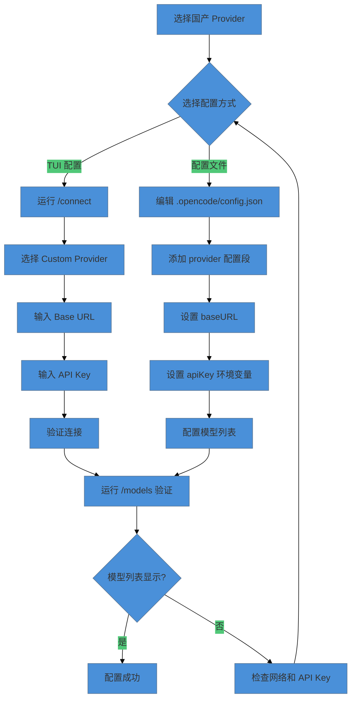
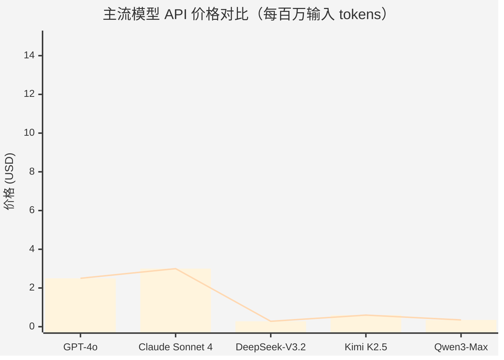

# 国产模型供应商配置

> DeepSeek、Qwen、Kimi 等国产大模型的 API 接入方法，以及 Provider 切换策略。

OpenCode 的设计哲学之一是 Provider 无关性——你不被任何模型供应商锁定。对于国内开发者来说，这意味着可以直接接入国产大模型，享受更低的 API 成本（通常为 GPT-4 的 1/10 到 1/20）和更稳定的网络连接。但国产模型的 API 格式、参数含义、Token 计算方式和内容安全策略各有不同，需要针对性配置。

这篇文章覆盖 DeepSeek、阿里 Qwen、月之暗面 Kimi 三个主流国产 Provider 的完整配置流程，包括 Base URL、API Key、模型名称等关键字段。还会讨论国产模型的典型参数调优建议、Token 计算差异、速率限制和内容安全过滤的影响，以及如何在 OpenCode 的类别路由中实现国产模型与国际模型的混合路由策略。

> 注意：下文使用层级化模型名称标识模型在能力/成本谱系中的位置，具体映射请参考 OpenCode 官方文档的模型支持列表。

## 国产 AI 模型概览

国产大模型在 2024-2025 年取得了显著进步，在代码生成、数学推理、长文本处理等场景已经接近甚至超越国际一流模型。以下是三个主流国产 Provider 的定位对比。

### DeepSeek：性价比之王

DeepSeek（深度求索）是目前最具性价比的国产大模型。其旗舰模型 DeepSeek-V3.2 采用 MoE（Mixture of Experts）架构，671B 总参数，激活 37B，在代码、数学、推理等任务上表现优异。

**核心优势：**

- **极致性价比**：API 价格约为 GPT-4o 的 1/30，Claude 的 1/20
- **代码能力强**：在 Codeforces 算法竞赛评测中超越所有非 o1 类模型
- **推理透明**：`deepseek-reasoner` 模型提供可见的思维链（Chain-of-Thought）
- **上下文缓存**：自动缓存重复前缀，最高节省 90% 输入成本

**适用场景：**

- 大规模代码生成和重构
- 算法竞赛题目求解
- 成本敏感的批量处理任务
- 需要推理过程可解释的场景

### Kimi：长上下文专家

Kimi（月之暗面）以超长上下文处理能力著称。最新的 Kimi K2.5 模型支持 256K tokens 上下文窗口，是处理长文档、代码库分析的理想选择。

**核心优势：**

- **超长上下文**：256K tokens 窗口，可处理整本技术书籍
- **原生多模态**：支持图像、视频、文档输入
- **智能体优化**：针对工具调用和多智能体协作优化
- **文档理解强**：在长文本摘要、信息提取任务上表现突出

**适用场景：**

- 大型代码库分析
- 技术文档和论文阅读
- 法律合同、财务报告分析
- 多轮复杂对话

### Qwen：生态最完整

Qwen（阿里通义千问）是国产模型中生态最完整的选择。从 0.5B 到万亿参数，覆盖边缘设备到云端推理的全场景需求。

**核心优势：**

- **模型矩阵完整**：从 qwen3-0.5b 到 qwen3-max，满足不同场景
- **企业级支持**：阿里云百炼平台提供完整的 MLOps 工具链
- **多模态成熟**：Qwen-VL、Qwen-Audio 等多模态模型已成熟
- **开源生态**：模型权重开源，支持私有化部署

**适用场景：**

- 企业级应用集成
- 需要阿里云生态支持的项目
- 多模态处理需求
- 私有化部署需求

> 此成本对比为写书时（2026年6月）所查询数据，请以当前实际定价为准。

### 国产 Provider 对比

| 特性 | DeepSeek | Kimi | Qwen |
|------|----------|------|------|
| **旗舰模型** | DeepSeek-V3.2 | Kimi K2.5 | Qwen3-Max |
| **上下文窗口** | 128K | 256K | 256K |
| **输入价格** | $0.28/百万 | $0.60/百万 | ¥2.5/百万 |
| **输出价格** | $0.42/百万 | $3.00/百万 | ¥10/百万 |
| **缓存折扣** | 90% | 75% | 80% |
| **代码能力** | ⭐⭐⭐⭐⭐ | ⭐⭐⭐⭐ | ⭐⭐⭐⭐ |
| **长文本能力** | ⭐⭐⭐⭐ | ⭐⭐⭐⭐⭐ | ⭐⭐⭐⭐ |
| **企业支持** | ⭐⭐⭐ | ⭐⭐⭐ | ⭐⭐⭐⭐⭐ |

## 配置方法

国产 Provider 的配置遵循 OpenCode 的标准 Provider 配置模式。由于国产模型大多采用 OpenAI 兼容的 API 格式，配置过程与国际 Provider 类似，主要差异在于 Base URL 和模型名称。

### 国产 Provider 配置流程



### DeepSeek 配置

DeepSeek 提供两个主要模型标识符：

- `deepseek-chat`：非思考模式，适合快速响应场景
- `deepseek-reasoner`：思考模式，提供可见的思维链

**方式一：TUI 配置**

1. 在 OpenCode 中运行 `/connect`：

```
/connect
```

2. 选择 **Custom Provider** 或搜索 **DeepSeek**

3. 输入配置信息：

```
Base URL: https://api.deepseek.com
API Key: sk-xxxxxxxxxxxxxxxx
```

4. 运行 `/models` 验证：

```
/models
```

**方式二：配置文件**

在项目根目录创建或编辑 `.opencode/config.json`：

```json
{
  "$schema": "https://opencode.ai/config.json",
  "provider": {
    "deepseek": {
      "name": "DeepSeek",
      "baseURL": "https://api.deepseek.com",
      "apiKey": "{env:DEEPSEEK_API_KEY}",
      "models": {
        "deepseek-chat": {
          "name": "DeepSeek Chat",
          "context": 128000,
          "maxOutput": 8000
        },
        "deepseek-reasoner": {
          "name": "DeepSeek Reasoner",
          "context": 128000,
          "maxOutput": 64000
        }
      }
    }
  },
  "models": {
    "default": "deepseek/deepseek-chat"
  }
}
```

**环境变量配置：**

```bash
export DEEPSEEK_API_KEY="sk-xxxxxxxxxxxxxxxx"
```

**获取 API Key：**

1. 访问 [platform.deepseek.com](https://platform.deepseek.com/)
2. 注册并完成邮箱验证
3. 进入 API Keys 页面创建新密钥
4. 新用户赠送 500 万 tokens 免费额度（有效期 30 天）

### Kimi 配置

Kimi（Moonshot）提供多个模型版本，按上下文长度区分：

- `kimi-k2.5`：最新旗舰模型，256K 上下文
- `moonshot-v1-8k`：8K 上下文，低成本
- `moonshot-v1-32k`：32K 上下文
- `moonshot-v1-128k`：128K 上下文

**方式一：TUI 配置**

1. 运行 `/connect`：

```
/connect
```

2. 选择 **Custom Provider**

3. 输入配置：

```
Base URL: https://api.moonshot.cn/v1
API Key: sk-xxxxxxxxxxxxxxxx
```

**方式二：配置文件**

```json
{
  "$schema": "https://opencode.ai/config.json",
  "provider": {
    "moonshot": {
      "name": "Kimi",
      "baseURL": "https://api.moonshot.cn/v1",
      "apiKey": "{env:MOONSHOT_API_KEY}",
      "models": {
        "kimi-k2.5": {
          "name": "Kimi K2.5",
          "context": 262144,
          "maxOutput": 8192
        },
        "moonshot-v1-8k": {
          "name": "Moonshot V1 8K",
          "context": 8192,
          "maxOutput": 4096
        },
        "moonshot-v1-32k": {
          "name": "Moonshot V1 32K",
          "context": 32768,
          "maxOutput": 4096
        },
        "moonshot-v1-128k": {
          "name": "Moonshot V1 128K",
          "context": 131072,
          "maxOutput": 4096
        }
      }
    }
  },
  "models": {
    "default": "moonshot/kimi-k2.5"
  }
}
```

**环境变量配置：**

```bash
export MOONSHOT_API_KEY="sk-xxxxxxxxxxxxxxxx"
```

**获取 API Key：**

1. 访问 [platform.moonshot.cn](https://platform.moonshot.cn/)
2. 注册并完成验证
3. 进入控制台创建 API Key
4. 新用户赠送 15 元体验金

### Qwen 配置

Qwen 通过阿里云百炼平台提供 API 服务。支持两种 API 格式：

- **OpenAI 兼容格式**：`https://dashscope.aliyuncs.com/compatible-mode/v1`
- **原生格式**：`https://dashscope.aliyuncs.com/api/v1`

推荐使用 OpenAI 兼容格式，与 OpenCode 集成更顺畅。

**方式一：TUI 配置**

1. 运行 `/connect`：

```
/connect
```

2. 选择 **Custom Provider**

3. 输入配置：

```
Base URL: https://dashscope.aliyuncs.com/compatible-mode/v1
API Key: sk-xxxxxxxxxxxxxxxx
```

**方式二：配置文件**

```json
{
  "$schema": "https://opencode.ai/config.json",
  "provider": {
    "qwen": {
      "name": "Qwen",
      "baseURL": "https://dashscope.aliyuncs.com/compatible-mode/v1",
      "apiKey": "{env:DASHSCOPE_API_KEY}",
      "models": {
        "qwen3-max": {
          "name": "Qwen3 Max",
          "context": 262144,
          "maxOutput": 8192
        },
        "qwen3-max-2026-01-23": {
          "name": "Qwen3 Max (2026-01-23)",
          "context": 262144,
          "maxOutput": 8192
        },
        "qwen-max": {
          "name": "Qwen Max",
          "context": 32768,
          "maxOutput": 8192
        },
        "qwen-plus": {
          "name": "Qwen Plus",
          "context": 131072,
          "maxOutput": 8192
        },
        "qwen-turbo": {
          "name": "Qwen Turbo",
          "context": 131072,
          "maxOutput": 8192
        }
      }
    }
  },
  "models": {
    "default": "qwen/qwen3-max"
  }
}
```

**环境变量配置：**

```bash
export DASHSCOPE_API_KEY="sk-xxxxxxxxxxxxxxxx"
```

**获取 API Key：**

1. 访问 [bailian.console.aliyun.com](https://bailian.console.aliyun.com/)
2. 开通阿里云百炼服务
3. 进入 API-KEY 管理创建密钥
4. 新用户赠送 100 万 tokens 免费额度（有效期 90 天）

### 多 Provider 混合配置

OpenCode 支持同时配置多个 Provider，并通过类别路由实现智能切换。以下是一个国产模型与国际模型混合的配置示例：

```json
{
  "$schema": "https://opencode.ai/config.json",
  "provider": {
    "anthropic": {
      "name": "Anthropic",
      "apiKey": "{env:ANTHROPIC_API_KEY}",
      "models": {
        "balanced-model": {},
        "best-capability-model": {}
      }
    },
    "deepseek": {
      "name": "DeepSeek",
      "baseURL": "https://api.deepseek.com",
      "apiKey": "{env:DEEPSEEK_API_KEY}",
      "models": {
        "deepseek-chat": {},
        "deepseek-reasoner": {}
      }
    },
    "moonshot": {
      "name": "Kimi",
      "baseURL": "https://api.moonshot.cn/v1",
      "apiKey": "{env:MOONSHOT_API_KEY}",
      "models": {
        "kimi-k2.5": {}
      }
    }
  },
  "categories": {
    "quick": {
      "model": "deepseek/deepseek-chat"
    },
    "plan": {
      "model": "balanced-model"
    },
    "research": {
      "model": "moonshot/kimi-k2.5"
    },
    "review": {
      "model": "deepseek/deepseek-reasoner"
    }
  },
  "models": {
    "default": "deepseek/deepseek-chat",
    "fallback": "balanced-model"
  }
}
```

**配置说明：**

- **quick**：快速任务使用 DeepSeek，成本最低
- **plan**：规划任务使用 balanced-model，推理能力强
- **research**：研究任务使用 Kimi，长上下文优势
- **review**：代码审查使用 DeepSeek Reasoner，推理过程可解释
- **fallback**：主 Provider 不可用时自动切换到备用模型

## 典型参数调优

国产模型的参数调优与国际模型类似，但有一些特殊注意事项。

### 核心参数说明

| 参数 | 说明 | 推荐范围 |
|------|------|---------|
| `temperature` | 控制输出随机性，0 最确定，2 最随机 | 0.0 - 1.0 |
| `top_p` | 核采样阈值，控制候选词范围 | 0.9 - 1.0 |
| `max_tokens` | 最大输出长度 | 根据任务设置 |
| `frequency_penalty` | 频率惩罚，减少重复 | 0.0 - 0.5 |
| `presence_penalty` | 存在惩罚，鼓励多样性 | 0.0 - 0.5 |

### 不同任务的参数推荐

**代码生成：**

```json
{
  "temperature": 0.2,
  "top_p": 0.95,
  "max_tokens": 4096
}
```

代码生成需要较高的确定性，使用较低的 temperature。

**创意写作：**

```json
{
  "temperature": 0.7,
  "top_p": 0.95,
  "max_tokens": 2048
}
```

创意任务可以适当提高 temperature，增加多样性。

**代码审查：**

```json
{
  "temperature": 0.3,
  "top_p": 0.95,
  "max_tokens": 2048
}
```

代码审查需要平衡确定性和全面性。

**长文本分析：**

```json
{
  "temperature": 0.1,
  "top_p": 0.95,
  "max_tokens": 8192
}
```

长文本分析需要高确定性，避免偏离主题。

### DeepSeek 特殊参数

DeepSeek Reasoner 模型支持额外的参数：

```json
{
  "model": "deepseek-reasoner",
  "messages": [...],
  "temperature": 0.0,
  "max_tokens": 8192,
  "reasoning_effort": "medium"
}
```

`reasoning_effort` 控制推理深度：

- `low`：快速响应，推理较浅
- `medium`：平衡模式
- `high`：深度推理，响应较慢

### Qwen 思考模式参数

Qwen3-Max 支持思考模式（Thinking Mode），通过参数控制：

```json
{
  "model": "qwen3-max",
  "messages": [...],
  "enable_thinking": true,
  "thinking_budget_tokens": 4096
}
```

## 国产模型与国际模型成本对比

国产模型的核心优势之一是成本。以下对比图展示了主流模型的 API 价格差异。



> 此成本对比为写书时（2026年6月）所查询数据，请以当前实际定价为准。

### 成本对比表

| 模型 | 输入价格 ($/百万) | 输出价格 ($/百万) | 上下文窗口 | 缓存折扣 |
|------|------------------|------------------|-----------|---------|
| **GPT-4o** | 2.50 | 10.00 | 128K | 无 |
| **Claude Sonnet 4** | 3.00 | 15.00 | 200K | 有 |
| **DeepSeek-V3.2** | 0.28 | 0.42 | 128K | 90% |
| **Kimi K2.5** | 0.60 | 3.00 | 256K | 75% |
| **Qwen3-Max** | 0.35 | 1.40 | 256K | 80% |

> 此成本对比为写书时（2026年6月）所查询数据，请以当前实际定价为准。

### 实际成本计算示例

假设每天处理 100 万 tokens（50 万输入 + 50 万输出）：

| 模型 | 日成本 | 月成本 | 年成本 |
|------|--------|--------|--------|
| GPT-4o | $6.25 | $187.50 | $2,281.25 |
| Claude Sonnet 4 | $9.00 | $270.00 | $3,285.00 |
| **DeepSeek-V3.2** | **$0.35** | **$10.50** | **$127.75** |
| Kimi K2.5 | $1.80 | $54.00 | $657.00 |
| Qwen3-Max | $0.88 | $26.25 | $319.38 |

**结论：** DeepSeek 的年成本仅为 GPT-4o 的 5.6%，为 Claude 的 3.9%。对于成本敏感的项目，国产模型是极具吸引力的选择。

## 注意事项和常见问题

### Token 计算差异

国产模型的 Token 计算方式与国际模型略有不同：

**中文 Token 效率：**

国产模型对中文的 Token 效率通常更高。以"人工智能正在改变世界"为例：

| 模型 | Token 数量 |
|------|-----------|
| GPT-4 | 8-10 |
| Claude | 6-8 |
| DeepSeek | 4-5 |
| Qwen | 3-4 |

**实际影响：**

处理中文内容时，国产模型的实际成本可能比标称价格更低，因为相同内容消耗的 Token 更少。

### 内容安全过滤

国产模型受中国法律法规约束，会对部分内容进行安全过滤：

**可能触发过滤的内容：**

- 政治敏感话题
- 暴力、色情内容
- 部分国际政治讨论

**应对策略：**

1. **技术场景通常不受影响**：代码生成、技术文档等场景很少触发过滤
2. **调整提示词**：避免敏感表述，聚焦技术问题
3. **使用国际模型备用**：在类别路由中配置国际模型作为 fallback

### API 可用性和速率限制

国产 Provider 的速率限制策略：

| Provider | RPM（请求/分钟） | TPM（Token/分钟） | 并发数 |
|----------|-----------------|------------------|--------|
| DeepSeek | 60（免费）/ 500+（付费） | 60K+ | 5-10 |
| Kimi | 60（免费）/ 300+（付费） | 60K+ | 5 |
| Qwen | 60（免费）/ 1000+（付费） | 100K+ | 10+ |

**提升配额方法：**

1. 完成实名认证
2. 充值付费
3. 联系客服申请企业配额

### 网络代理设置

如果遇到网络问题，可以配置代理：

```bash
export HTTP_PROXY="http://127.0.0.1:7890"
export HTTPS_PROXY="http://127.0.0.1:7890"
```

或在 OpenCode 配置中设置：

```json
{
  "provider": {
    "deepseek": {
      "baseURL": "https://api.deepseek.com",
      "proxy": "http://127.0.0.1:7890"
    }
  }
}
```

### 常见错误排查

| 错误信息 | 原因 | 解决方案 |
|---------|------|---------|
| `401 Unauthorized` | API Key 无效或过期 | 检查 Key 格式和有效期 |
| `429 Too Many Requests` | 超过速率限制 | 降低请求频率或升级配额 |
| `500 Internal Server Error` | 服务端错误 | 稍后重试或联系客服 |
| `Connection refused` | 网络问题 | 检查网络或配置代理 |
| `Content filtered` | 触发安全过滤 | 调整提示词或切换模型 |
| `Fallback 未生效` | fallback 指向的 Provider 配置不完整或 Key 缺失 | 检查 fallback Provider 的 API Key 和模型定义是否正确 |
| `Provider 未显示在 /models` | 配置后未重启 OpenCode，或 Provider/模型名称拼写错误 | 重启 OpenCode 使配置生效，对照官方文档检查名称 |

## 小结

国产大模型已经具备了与国际一流模型竞争的实力，在成本、中文处理、长上下文等方面甚至具有独特优势。通过 OpenCode 的 Provider 抽象层，你可以无缝切换国产模型和国际模型，根据任务需求和成本预算灵活选择。

### 核心要点

1. **DeepSeek 性价比最高**：适合大规模代码生成和成本敏感场景
2. **Kimi 长上下文最强**：适合大型代码库分析和长文档处理
3. **Qwen 生态最完整**：适合企业级应用和多模态需求
4. **混合路由策略**：国产模型用于日常任务，国际模型作为备用

### 下一步

- → [性能调优与成本管理](../06-advanced/performance-tuning.md) — 国产模型在模型降级链中的应用
- ← [快速上手](quickstart.md) — Provider 配置基础
- ← [国产 AI 编程生态适配](../01-introduction/chinese-ecosystem.md) — 生态现状与配置前提
