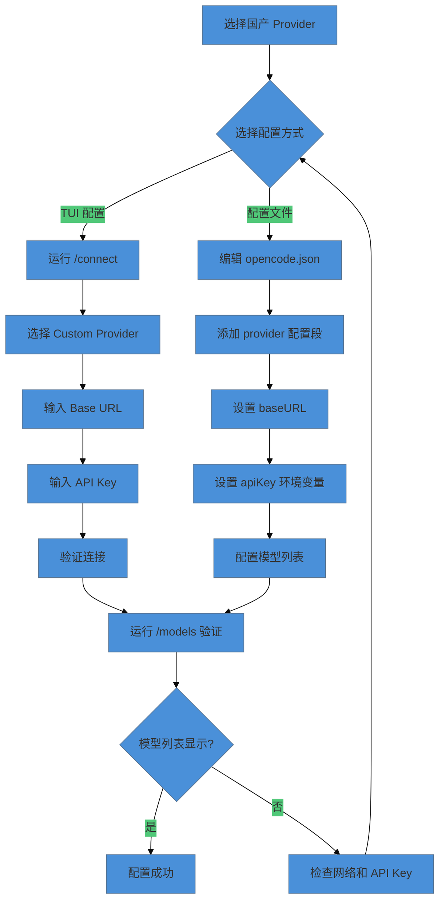
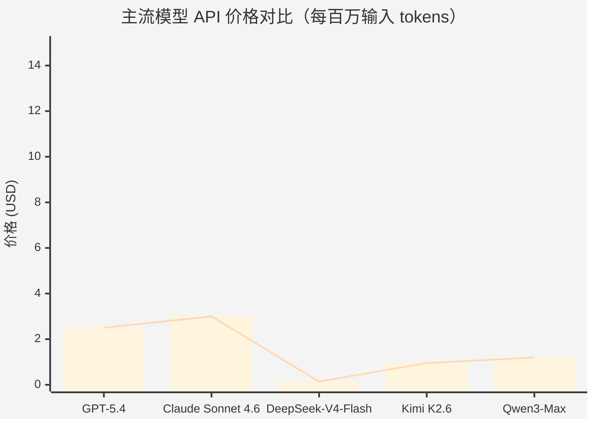

# 国产模型供应商配置

> DeepSeek、Qwen、Kimi 等国产大模型的 API 接入方法，以及 Provider 切换策略。

OpenCode 的设计哲学之一是 Provider 无关性——你不被任何模型供应商锁定。对于国内开发者来说，这意味着可以直接接入国产大模型，享受更低的 API 成本（通常为 GPT-4 的 1/10 到 1/20）和更稳定的网络连接。但国产模型的 API 格式、参数含义、Token 计算方式和内容安全策略各有不同，需要针对性配置。读完本文，你将能够完成 DeepSeek、Qwen、Kimi 三个主流国产 Provider 的完整配置，并掌握国产模型的参数调优和混合路由策略。

这篇文章覆盖 DeepSeek、阿里 Qwen、月之暗面 Kimi 三个主流国产 Provider 的完整配置流程，包括 Base URL、API Key、模型名称等关键字段。还会讨论国产模型的典型参数调优建议、Token 计算差异、速率限制和内容安全过滤的影响，以及如何在 OpenCode 的类别路由中实现国产模型与国际模型的混合路由策略。

> 注意：下文使用层级化模型名称标识模型在能力/成本谱系中的位置，具体映射请参考 OpenCode 官方文档的模型支持列表。

> **⏱ 时间有限？先读这些：** 国产 AI 模型概览 → 配置方法 → 典型参数调优 → 注意事项和常见问题

## 国产 AI 模型概览

国产大模型在 2024-2025 年取得了显著进步，在代码生成、数学推理、长文本处理等场景已经接近甚至超越国际一流模型。以下是三个主流国产 Provider 的定位对比。

### DeepSeek：性价比之王

DeepSeek（深度求索）是目前最具性价比的国产大模型。其旗舰模型 DeepSeek-V4 采用 MoE（Mixture of Experts）架构，V4-Flash 为 284B 总参数、13B 激活，V4-Pro 为 1.6T 总参数、49B 激活，在代码、数学、推理等任务上表现优异。

> **重要提示**：Legacy 模型 ID `deepseek-chat` 和 `deepseek-reasoner` 将于 2026 年 7 月 24 日停止支持，建议迁移至 `deepseek-v4-flash` 或 `deepseek-v4-pro`。

**核心优势：**

- **极致性价比**：V4-Flash API 价格约为 GPT-4o 的 1/15–1/30（取决于输入/输出比例）
- **代码能力强**：DeepSeek-V4 在 Codeforces 算法竞赛中表现优异（标准思考模式 2386 分；Speciale 变体 2701 分，超越 GPT-5）
- **推理透明**：`deepseek-v4-flash` 思考模式提供可见的思维链（Chain-of-Thought）
- **超长上下文**：V4 模型支持 1M tokens 上下文窗口
- **上下文缓存**：自动缓存重复前缀，最高节省 98% 输入成本

**适用场景：**

- 大规模代码生成和重构
- 算法竞赛题目求解
- 成本敏感的批量处理任务
- 需要推理过程可解释的场景

### Kimi：长上下文专家

Kimi（月之暗面）以超长上下文处理能力著称。最新的 Kimi K2.5 模型支持 256K tokens 上下文窗口，是处理长文档、代码库分析的理想选择。

**核心优势：**

- **超长上下文**：256K tokens 窗口，可处理整本技术书籍
- **原生多模态**：支持图像、视频、文档输入
- **智能体优化**：针对工具调用和多智能体协作优化
- **文档理解强**：在长文本摘要、信息提取任务上表现突出

**适用场景：**

- 大型代码库分析
- 技术文档和论文阅读
- 法律合同、财务报告分析
- 多轮复杂对话

### Qwen：生态最完整

Qwen（阿里通义千问）是国产模型中生态最完整的选择。从 0.5B 到万亿参数，覆盖边缘设备到云端推理的全场景需求。

**核心优势：**

- **模型矩阵完整**：从 qwen3-0.5b 到 qwen3-max，满足不同场景
- **企业级支持**：阿里云百炼平台提供完整的 MLOps 工具链
- **多模态成熟**：Qwen-VL、Qwen-Audio 等多模态模型已成熟
- **开源生态**：模型权重开源，支持私有化部署

**适用场景：**

- 企业级应用集成
- 需要阿里云生态支持的项目
- 多模态处理需求
- 私有化部署需求

> 此成本对比为写书时（2026年6月）所查询数据，请以当前实际定价为准。

### 国产 Provider 对比

| 特性 | DeepSeek (V4-Flash) | Kimi K2.6 | Qwen3-Max |
|------|----------|------|------|
| **旗舰模型** | deepseek-v4-flash | Kimi K2.6 | Qwen3-Max |
| **上下文窗口** | 1M | 256K | 256K |
| **输入价格** | $0.14/百万（缓存 miss） | $0.95/百万 | ¥2.5/百万（China tier-1）/$1.2/百万（International） |
| **输出价格** | $0.28/百万 | $4.00/百万 | ¥10/百万（China tier-1）/$6.0/百万（International） |
| **缓存折扣** | 98% | 83% | 80% |
| **代码能力** | ⭐⭐⭐⭐⭐ | ⭐⭐⭐⭐ | ⭐⭐⭐⭐ |
| **长文本能力** | ⭐⭐⭐⭐⭐ | ⭐⭐⭐⭐⭐ | ⭐⭐⭐⭐ |
| **企业支持** | ⭐⭐⭐ | ⭐⭐⭐ | ⭐⭐⭐⭐⭐ |

## 配置方法

国产 Provider 的配置遵循 OpenCode 的标准 Provider 配置模式。由于国产模型大多采用 OpenAI 兼容的 API 格式，配置过程与国际 Provider 类似，主要差异在于 Base URL 和模型名称。

### 国产 Provider 配置流程

下图展示了国产 Provider 的完整配置流程，从模型选择到参数设置的各步骤顺序。



### DeepSeek 配置

DeepSeek 提供两个主要模型标识符（Legacy）和新的 V4 模型：

**Legacy 模型（将于 2026-07-24 退役，建议使用 V4）：**
- `deepseek-chat`：非思考模式，路由到 V4-Flash
- `deepseek-reasoner`：思考模式，路由到 V4-Flash

**V4 模型（当前推荐）：**
- `deepseek-v4-flash`：284B/13B，1M 上下文，$0.14/$0.28 每百万 tokens
- `deepseek-v4-pro`：1.6T/49B，1M 上下文，$0.435/$0.87 每百万 tokens

**方式一：TUI 配置**

1. 在 OpenCode 中运行 `/connect`：

```bash:terminal
/connect
```

2. 搜索 **DeepSeek**（内置提供商）

3. 输入配置信息：

```text:terminal
Base URL: https://api.deepseek.com
API Key: sk-xxxxxxxxxxxxxxxx
```

4. 运行 `/models` 验证：

```bash:terminal
/models
```

**方式二：配置文件**

在项目根目录创建或编辑 `opencode.json`：

```json:opencode.json
{
  "$schema": "https://opencode.ai/config.json",
  "provider": {
    "deepseek": {
      "env": ["DEEPSEEK_API_KEY"],
      "name": "DeepSeek",
      "models": {
        "deepseek-v4-flash": {
          "name": "DeepSeek V4 Flash",
          "limit": {
            "context": 1000000,
            "output": 384000
          }
        },
        "deepseek-v4-pro": {
          "name": "DeepSeek V4 Pro",
          "limit": {
            "context": 1000000,
            "output": 384000
          }
        },
        "deepseek-chat": {
          "name": "DeepSeek Chat (Legacy, retires 2026-07-24)",
          "limit": {
            "context": 64000,
            "output": 8000
          }
        }
      }
    }
  },
  "model": "deepseek/deepseek-v4-flash"
}
```

**环境变量配置：**

```bash:terminal
export DEEPSEEK_API_KEY="sk-xxxxxxxxxxxxxxxx"
```

**获取 API Key：**

1. 访问 [platform.deepseek.com](https://platform.deepseek.com/)
2. 注册并完成邮箱验证
3. 进入 API Keys 页面创建新密钥
4. 新用户赠送 500 万 tokens 免费额度（有效期 30 天）

### Kimi 配置

Kimi（月之暗面）提供多个模型版本：

**当前旗舰：**
- `kimi-k2.6`：最新旗舰模型，256K 上下文，$0.95/$4.00 每百万 tokens

**其他可用模型：**
- `kimi-k2.5`：K2.6 的前一代，256K 上下文，$0.60/$3.00 每百万 tokens
- `moonshot-v1-8k`：8K 上下文，低成本
- `moonshot-v1-32k`：32K 上下文
- `moonshot-v1-128k`：128K 上下文

**注意：** Kimi 提供两个 API 端点：
- `https://api.moonshot.cn/v1` — 中国地区
- `https://api.moonshot.ai/v1` — 国际用户

**方式一：TUI 配置**

1. 运行 `/connect`：

```bash:terminal
/connect
```

2. 搜索 **Moonshot AI**（内置提供商）

3. 配置完成后选择 Kimi K2.6 或 K2.5

**方式二：配置文件**

```json:opencode.json
{
  "$schema": "https://opencode.ai/config.json",
  "provider": {
    "moonshot": {
      "env": ["MOONSHOT_API_KEY"],
      "name": "Kimi",
      "models": {
        "kimi-k2.6": {
          "name": "Kimi K2.6",
          "limit": {
            "context": 262144,
            "output": 8192
          }
        },
        "kimi-k2.5": {
          "name": "Kimi K2.5",
          "limit": {
            "context": 262144,
            "output": 8192
          }
        },
        "moonshot-v1-8k": {
          "name": "Moonshot V1 8K",
          "limit": {
            "context": 8192,
            "output": 4096
          }
        },
        "moonshot-v1-32k": {
          "name": "Moonshot V1 32K",
          "limit": {
            "context": 32768,
            "output": 4096
          }
        },
        "moonshot-v1-128k": {
          "name": "Moonshot V1 128K",
          "limit": {
            "context": 131072,
            "output": 4096
          }
        }
      }
    }
  },
  "model": "moonshot/kimi-k2.6"
}
```

**环境变量配置：**

```bash:terminal
export MOONSHOT_API_KEY="sk-xxxxxxxxxxxxxxxx"
```

**获取 API Key：**

1. 访问 [platform.moonshot.cn](https://platform.moonshot.cn/)（中国）或 [platform.kimi.ai](https://platform.kimi.ai)（国际）
2. 注册并完成验证
3. 进入控制台创建 API Key
4. 新用户赠送 15 元体验金

### Qwen 配置

Qwen（阿里通义千问）通过阿里云百炼平台提供 API 服务。注意：Qwen 是**自定义提供商**，需要使用 `@ai-sdk/openai-compatible` 适配器。

**Base URL（国际用户推荐）：**
- 新加坡（国际）：`https://dashscope-intl.aliyuncs.com/compatible-mode/v1`
- 美国（弗吉尼亚）：`https://dashscope-us.aliyuncs.com/compatible-mode/v1`
- 中国（北京）：`https://dashscope.aliyuncs.com/compatible-mode/v1`

**可用模型：**
- `qwen3-max`：256K 上下文，$1.20/$6.00 每百万 tokens（International）
- `qwen3.5-plus`：1M 上下文，$0.4/$2.4 每百万 tokens（International）
- `qwen3.5-flash`：1M 上下文，$0.1/$0.4 每百万 tokens（International）
- 旧版：`qwen-max`, `qwen-plus`, `qwen-turbo`（qwen-turbo 已废弃，建议迁移到 qwen-flash）

**定价说明：** Qwen 使用阶梯定价，基于输入 token 数量。以上价格为 0-32K tokens 档位的最低价格。

**方式一：TUI 配置**

1. 运行 `/connect`：

```bash:terminal
/connect
```

2. 选择 **Custom Provider**

3. 输入配置：

```text:terminal
Base URL: https://dashscope-intl.aliyuncs.com/compatible-mode/v1
API Key: sk-xxxxxxxxxxxxxxxx
```

**方式二：配置文件**

```json:opencode.json
{
  "$schema": "https://opencode.ai/config.json",
  "provider": {
    "qwen": {
      "npm": "@ai-sdk/openai-compatible",
      "env": ["DASHSCOPE_API_KEY"],
      "name": "Qwen",
      "options": {
        "baseURL": "https://dashscope-intl.aliyuncs.com/compatible-mode/v1"
      },
      "models": {
        "qwen3-max": {
          "name": "Qwen3 Max",
          "limit": {
            "context": 262144,
            "output": 8192
          }
        },
        "qwen3.5-plus": {
          "name": "Qwen3.5 Plus",
          "limit": {
            "context": 1000000,
            "output": 8192
          }
        },
        "qwen3.5-flash": {
          "name": "Qwen3.5 Flash",
          "limit": {
            "context": 1000000,
            "output": 8192
          }
        }
      }
    }
  },
  "model": "qwen/qwen3.5-plus"
}
```

**环境变量配置：**

```bash:terminal
export DASHSCOPE_API_KEY="sk-xxxxxxxxxxxxxxxx"
```

**获取 API Key：**

1. 访问 [bailian.console.aliyun.com](https://bailian.console.aliyun.com/)
2. 开通阿里云百炼服务
3. 进入 API-KEY 管理创建密钥
4. 新用户赠送 100 万 tokens 免费额度（有效期 90 天，仅限新加坡区域）

### 多 Provider 混合配置

OpenCode 支持同时配置多个 Provider，并通过类别路由实现智能切换。以下是一个国产模型与国际模型混合的配置示例：

```json:opencode.json
{
  "$schema": "https://opencode.ai/config.json",
  "provider": {
    "anthropic": {
      "name": "Anthropic",
      "options": {
        "apiKey": "{env:ANTHROPIC_API_KEY}"
      },
      "models": {
        "balanced-model": {},
        "best-capability-model": {}
      }
    },
    "deepseek": {
      "name": "DeepSeek",
      "options": {
        "baseURL": "https://api.deepseek.com",
        "apiKey": "{env:DEEPSEEK_API_KEY}"
      },
      "models": {
        "deepseek-chat": {},
        "deepseek-reasoner": {}
      }
    },
    "moonshot": {
      "name": "Kimi",
      "options": {
        "baseURL": "https://api.moonshot.cn/v1",
        "apiKey": "{env:MOONSHOT_API_KEY}"
      },
      "models": {
        "kimi-k2.5": {}
      }
    }
  },
  "model": "deepseek/deepseek-chat",
  "small_model": "balanced-model",
  "categories": {
    "quick": {
      "model": "deepseek/deepseek-chat"
    },
    "plan": {
      "model": "balanced-model"
    },
    "research": {
      "model": "moonshot/kimi-k2.5"
    },
    "review": {
      "model": "deepseek/deepseek-reasoner"
    }
  }
}
```

**配置说明：**

- **quick**：快速任务使用 DeepSeek，成本最低
- **plan**：规划任务使用 balanced-model，推理能力强
- **research**：研究任务使用 Kimi，长上下文优势
- **review**：代码审查使用 DeepSeek Reasoner，推理过程可解释
- **fallback**：主 Provider 不可用时自动切换到备用模型

## 典型参数调优

国产模型的参数调优与国际模型类似，但有一些特殊注意事项。

### 核心参数说明

| 参数 | 说明 | 推荐范围 |
|------|------|---------|
| `temperature` | 控制输出随机性，0 最确定，2 最随机 | 0.0 - 1.0 |
| `top_p` | 核采样阈值，控制候选词范围 | 0.9 - 1.0 |
| `max_tokens` | 最大输出长度 | 根据任务设置 |
| `frequency_penalty` | 频率惩罚，减少重复 | 0.0 - 0.5 |
| `presence_penalty` | 存在惩罚，鼓励多样性 | 0.0 - 0.5 |

### 不同任务的参数推荐

**代码生成：**

```json:opencode.json
{
  "temperature": 0.2,
  "top_p": 0.95,
  "max_tokens": 4096
}
```

代码生成需要较高的确定性，使用较低的 temperature。

**创意写作：**

```json:opencode.json
{
  "temperature": 0.7,
  "top_p": 0.95,
  "max_tokens": 2048
}
```

创意任务可以适当提高 temperature，增加多样性。

**代码审查：**

```json:opencode.json
{
  "temperature": 0.3,
  "top_p": 0.95,
  "max_tokens": 2048
}
```

代码审查需要平衡确定性和全面性。

**长文本分析：**

```json:opencode.json
{
  "temperature": 0.1,
  "top_p": 0.95,
  "max_tokens": 8192
}
```

长文本分析需要高确定性，避免偏离主题。

### DeepSeek 特殊参数

DeepSeek-V4 模型支持额外的推理深度控制：

```json:opencode.json
{
  "model": "deepseek-v4-flash",
  "messages": [...],
  "temperature": 1.0,
  "max_tokens": 8192,
  "reasoning_effort": "high"
}
```

`reasoning_effort` 控制推理深度：

- `high`（默认）：平衡推理深度和响应速度
- `max`：最大推理深度，响应较慢

> **注意**：`low`和`medium` 参数已映射到 `high`，只有 `high` 和 `max` 产生不同行为。

### Qwen 思考模式参数

Qwen3-Max 支持思考模式（Thinking Mode），通过参数控制：

```json:opencode.json
{
  "model": "qwen3-max",
  "messages": [...],
  "enable_thinking": true,
  "thinking_budget": 4096
}
```

注意：`enable_thinking` 和 `thinking_budget` 需要通过 `extra_body` 传递（OpenAI SDK 兼容）。

## 国产模型与国际模型成本对比

国产模型的核心优势之一是成本。以下对比图展示了主流模型的 API 价格差异。

> **注意**：所有定价为 2026 年 6 月数据，以官方定价为准。



### 成本对比表

| 模型 | 输入价格 ($/百万) | 输出价格 ($/百万) | 上下文窗口 | 缓存折扣 |
|------|------------------|------------------|-----------|---------|
| **GPT-5.4** | 2.50 | 15.00 | 128K | 无 |
| **Claude Sonnet 4.6** | 3.00 | 15.00 | 200K | 有 |
| **DeepSeek-V4-Flash** | 0.14 | 0.28 | 1M | 98% |
| **Kimi K2.6** | 0.95 | 4.00 | 256K | 83% |
| **Qwen3-Max (International)** | 1.20 | 6.00 | 256K | 80% |
| **Qwen3.5-Plus (International)** | 0.40 | 2.40 | 1M | 80% |

> **注意**：Qwen 使用阶梯定价。以上价格为 0-32K tokens 档位的最低价格。
>
> **注意**：Qwen China 定价（第一档）：输入 ¥2.5/百万，输出 ¥10/百万 ≈ $0.35/$1.40 每百万（约 7.2 CNY/USD）

### 实际成本计算示例

假设每天处理 100 万 tokens（50 万输入 + 50 万输出）：

| 模型 | 日成本 | 月成本 | 年成本 |
|------|--------|--------|--------|
| GPT-5.4 | $6.25 | $187.50 | $2,281.25 |
| Claude Sonnet 4.6 | $9.00 | $270.00 | $3,285.00 |
| **DeepSeek-V4-Flash** | **$0.21** | **$6.30** | **$76.65** |
| Kimi K2.6 | $2.48 | $74.40 | $905.70 |
| Qwen3.5-Plus | $0.52 | $15.60 | $190.20 |

**结论：** DeepSeek-V4-Flash 的年成本为 GPT-5.4 的 3.4%，为 Claude 的 2.3%。对于成本敏感的项目，国产模型是极具吸引力的选择。

## 注意事项和常见问题

### Token 计算差异

国产模型的 Token 计算方式与国际模型略有不同：

**中文 Token 效率：**

国产模型对中文的 Token 效率通常更高。以"人工智能正在改变世界"为例：

| 模型 | Token 数量 |
|------|-----------|
| GPT-4 | 8-10 |
| Claude | 6-8 |
| DeepSeek | 4-5 |
| Qwen | 3-4 |

**实际影响：**

处理中文内容时，国产模型的实际成本可能比标称价格更低，因为相同内容消耗的 Token 更少。

### 内容安全过滤

国产模型受中国法律法规约束，会对部分内容进行安全过滤：

**可能触发过滤的内容：**

- 政治敏感话题
- 暴力、色情内容
- 部分国际政治讨论

**应对策略：**

1. **技术场景通常不受影响**：代码生成、技术文档等场景很少触发过滤
2. **调整提示词**：避免敏感表述，聚焦技术问题
3. **使用国际模型备用**：在类别路由中配置国际模型作为 fallback

### API 可用性和速率限制

国产 Provider 的速率限制策略：

| Provider | RPM（请求/分钟） | 并发数 |
|----------|-----------------|--------|
| DeepSeek | 不限（基于并发） | V4-Flash: 2500 / V4-Pro: 500 |
| Kimi | 根据账户等级 | 5-50 |
| Qwen | 根据账户等级 | 10-100 |

**提升配额方法：**

1. 完成实名认证
2. 充值付费
3. 联系客服申请企业配额

### 网络代理设置

如果遇到网络问题，可以配置代理：

```bash:terminal
export HTTP_PROXY="http://127.0.0.1:7890"
export HTTPS_PROXY="http://127.0.0.1:7890"
```

或在 OpenCode 配置中设置：

```json:opencode.json
{
  "provider": {
    "deepseek": {
      "baseURL": "https://api.deepseek.com",
      "proxy": "http://127.0.0.1:7890"
    }
  }
}
```

### 常见错误排查

| 错误信息 | 原因 | 解决方案 |
|---------|------|---------|
| `401 Unauthorized` | API Key 无效或过期 | 检查 Key 格式和有效期 |
| `429 Too Many Requests` | 超过速率限制 | 降低请求频率或升级配额 |
| `500 Internal Server Error` | 服务端错误 | 稍后重试或联系客服 |
| `Connection refused` | 网络问题 | 检查网络或配置代理 |
| `Content filtered` | 触发安全过滤 | 调整提示词或切换模型 |
| `Fallback 未生效` | fallback 指向的 Provider 配置不完整或 Key 缺失 | 检查 fallback Provider 的 API Key 和模型定义是否正确 |
| `Provider 未显示在 /models` | 配置后未重启 OpenCode，或 Provider/模型名称拼写错误 | 重启 OpenCode 使配置生效，对照官方文档检查名称 |

## 常见反模式

### 在生产环境使用未限流的 API Key

**现象**：使用免费或低配额的 API Key 直接用于生产环境的 Agent 调用，遇到突发请求时出现 `429 Too Many Requests`。

**原因**：国内模型服务商的免费 Key 通常有严格的 RPM/TPM 限制。未配置限流和降级策略时，高并发场景直接触发速率限制。

**对策**：生产环境使用付费配额 Key，配置 fallback Provider 链，并启用 `max_concurrent_requests` 限制并发量。免费 Key 只用于开发和测试。

### 忽略模型命名差异

**现象**：配置文件中模型名称使用了非官方名称（如将 `deepseek-chat` 写成 `deepseek-v2`），Agent 启动时提示 `Model not found`。

**原因**：国内模型服务商的模型命名频繁变更，且不同服务商使用的模型别名不同。

**对策**：配置后运行 `/models` 确认可用模型列表。定期查阅模型服务商官方文档更新模型名称，使用文档中的标准名称。

## 常见错误与陷阱

### API Rate Limit 超过限额

**场景**：多个 Agent 同时调用同一个 Provider 的 API，触发账户级别的速率限制。

**后果**：API 返回 429 错误，Agent 任务失败或进入不可预测的回退行为。

**预防**：配置 fallback 模型链，在 Provider 设置中使用 `max_concurrent_requests` 限制并发。国内模型建议备用一个不同服务商的 Provider 作为降级选项。

### Token Endpoint 配置错误

**场景**：使用 Azure OpenAI 或国内私有部署的模型时，baseURL 或 endpoint 路径配置错误。

**后果**：Agent 反复重试连接直到超时，浪费时间。错误不提示具体原因，排查困难。

**预防**：使用 `curl` 手动测试 API endpoint 的连通性后再配置。注意国内服务商的 endpoint 路径格式通常与国际版不同。

## 适用场景与限制

国产模型在某些场景下具有显著优势：中文理解和生成质量普遍优于同等参数规模的国际模型；DeepSeek 在代码生成和数学推理方面表现出色；Kimi 的 128K+ 长上下文窗口适合大型代码库分析。

以下情况建议选用国际模型：需要处理大量英文术语和文档的场景（如 Spring Boot、Kubernetes）；涉及前沿 Agent 能力（如 Tool Use、Function Calling）且国产模型支持不完善的场景；需要严格遵守 OpenAI API 兼容性标准的第三方工具集成。

国内模型服务商的 API 稳定性 和模型更新频率与国际厂商存在差距。建议在关键生产路径中配置多 Provider fallback 链，并定期测试各模型的准确率变化。

## 小结

国产大模型已经具备了与国际一流模型竞争的实力，在成本、中文处理、长上下文等方面甚至具有独特优势。通过 OpenCode 的 Provider 抽象层，你可以无缝切换国产模型和国际模型，根据任务需求和成本预算灵活选择。

### 核心要点

1. **DeepSeek 性价比最高**：适合大规模代码生成和成本敏感场景
2. **Kimi 长上下文最强**：适合大型代码库分析和长文档处理
3. **Qwen 生态最完整**：适合企业级应用和多模态需求
4. **混合路由策略**：国产模型用于日常任务，国际模型作为备用

### 下一步

- → [性能调优与成本管理](../06-advanced/context/performance-tuning.md) — 国产模型在模型降级链中的应用
- ← [快速上手](quickstart.md) — Provider 配置基础
- ← [国产 AI 编程生态适配](../01-introduction/chinese-ecosystem.md) — 生态现状与配置前提
