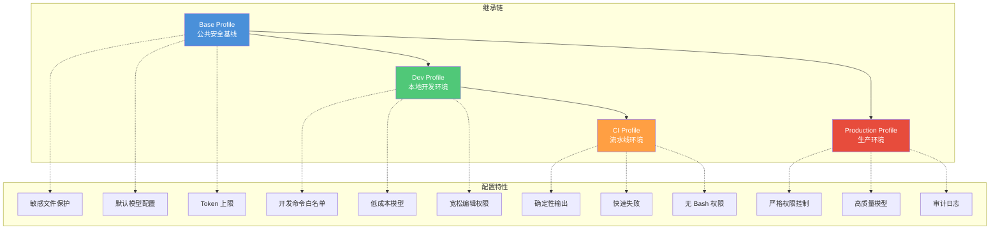
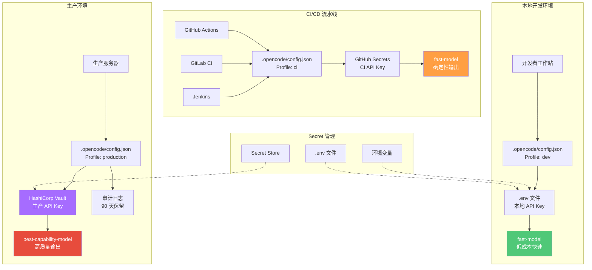

# 多环境部署方案

> 开发、CI/CD、生产环境的配置分离与 Profile 继承机制的最佳实践。
>
> **本文适用于团队负责人和 DevOps 工程师。如果只是个人使用 OpenCode，可以暂时跳过本章。**

## 文章概述

个人开发者在笔记本上跑 OpenCode 和团队在生产环境中运行 OpenCode 是两回事。不同环境对模型选择、权限级别、Token 预算、安全策略有完全不同的需求。本地开发可能用低成本模型加高权限，CI/CD 需要低权限加快速模型，生产环境则要求严格权限控制和高 Token 预算。

OpenCode 的 Profile 系统通过 `$extends` 继承机制优雅地解决了这个问题。你可以定义一个 Base Profile 包含公共配置，然后为每个环境创建派生 Profile，只覆盖需要差异化的部分。这篇文章从 Profile 继承的设计模式出发，给出本地开发、CI/CD 流水线、生产环境三套完整模板，并讨论团队级 Git 管理的配置治理、Secret Store 集成和多环境测试策略。

> 注意：下文使用层级化模型名称标识模型在能力/成本谱系中的位置，具体映射请参考 OpenCode 官方文档的模型支持列表。

## 多环境部署的挑战

### 环境差异的本质

在 AI 辅助编程的工程实践中，不同环境面临截然不同的约束条件：

| 维度 | 本地开发 | CI/CD 流水线 | 生产环境 |
|------|---------|-------------|---------|
| **模型选择** | 低成本、快速响应 | 快速模型、确定性输出 | 高质量、高 Token 预算 |
| **权限级别** | 高权限（开发者可控） | 低权限（自动化执行） | 严格限制（审计合规） |
| **Token 预算** | 灵活、可超支 | 固定预算、快速失败 | 高预算、成本可控 |
| **安全策略** | 开发者自决 | 最小权限原则 | 零信任、审计日志 |
| **失败容忍** | 高（可手动干预） | 低（阻塞流水线） | 极低（影响业务） |

### 配置泄漏的风险

多环境配置管理最危险的陷阱是**敏感信息泄漏**。生产环境的 API Key、数据库凭证、签名密钥一旦提交到版本控制，即使后续删除也会永久留在 Git 历史中。常见的泄漏路径包括：

1. **硬编码凭证**：将 API Key 直接写入 `opencode.json`
2. **环境混淆**：开发环境配置意外部署到生产
3. **日志泄露**：调试信息中包含敏感参数
4. **依赖供应链**：第三方 Skill 或 Plugin 窃取配置

### 配置管理的工程目标

一个成熟的多环境配置方案应该实现：

- **配置即代码**：所有非敏感配置纳入版本控制，可审计、可复现
- **环境隔离**：不同环境使用不同的凭证和权限边界
- **继承复用**：公共配置只定义一次，各环境继承覆盖
- **安全注入**：敏感信息通过 Secret Store 或环境变量注入，永不落盘

## Profile 继承机制详解

### $extends 语法

OpenCode 的 Profile 系统支持通过 `$extends` 字段实现配置继承。继承机制遵循以下规则：

1. **单继承**：一个 Profile 只能继承一个父 Profile
2. **深度合并**：子 Profile 的配置与父 Profile 深度合并（mergeDeep）
3. **覆盖优先**：子 Profile 中明确定义的值覆盖父 Profile 的同名配置
4. **无循环引用**：继承链不能形成环（验证时会报错）

### 继承链示例：Base → Dev → CI → Production

下面展示一个完整的多环境 Profile 继承链，从公共基础配置逐层派生出四个环境 Profile。

```json
{
  "profiles": {
    "base": {
      "description": "公共基础配置，所有环境继承",
      "permission": {
        "edit": {
          ".env": "deny",
          "secrets/**": "deny",
          "*.pem": "deny",
          "*.key": "deny"
        }
      },
      "defaults": {
        "model": "balanced-model",
        "temperature": 0.7,
        "max_tokens": 4096
      }
    }
  }
}
```

**Base Profile 设计原则**：

- 定义所有环境共享的安全基线（敏感文件保护）
- 设置合理的默认模型和参数
- 不包含任何环境特定的覆盖

```json
{
  "profiles": {
    "dev": {
      "$extends": "base",
      "description": "本地开发环境：高权限、低成本模型",
      "permission": {
        "edit": {
          "*": "ask"
        },
        "bash": {
          "npm *": "allow",
          "git *": "allow",
          "bun *": "allow",
          "*": "ask"
        }
      },
      "defaults": {
        "model": "fast-model",
        "temperature": 0.8
      }
    }
  }
}
```

**Dev Profile 设计要点**：

- 继承 Base 的安全基线（敏感文件仍然 deny）
- 放宽编辑权限为 `ask`，方便快速迭代
- 白名单常用开发命令（npm/git/bun）
- 使用低成本模型（fast-model）降低开发成本
- 在 `defaults` 中通过 `max_tokens` 控制输出长度，支持复杂重构任务

```json
{
  "profiles": {
    "ci": {
      "$extends": "dev",
      "description": "CI/CD 流水线环境：低权限、快速模型、确定性输出",
      "permission": {
        "edit": {
          "*": "allow"
        },
        "bash": {
          "*": "deny"
        }
      },
      "defaults": {
        "model": "fast-model",
        "temperature": 0.3
      },
      "hooks": {
        "onSessionEnd": "exit-code"
      }
    }
  }
}
```

**CI Profile 设计要点**：

- 继承 Dev 的开发便利性
- 完全放开编辑权限（自动化执行，无需确认）
- 完全禁止 Bash 命令（安全边界）
- 降低温度参数提高输出确定性
- 通过 `max_tokens` 限制输出长度，实现快速失败
- 配置会话结束 Hook 返回退出码

```json
{
  "profiles": {
    "production": {
      "$extends": "base",
      "description": "生产环境：严格权限、高质量模型、审计日志",
      "permission": {
        "edit": {
          "*": "deny"
        },
        "bash": {
          "*": "deny"
        },
        "read": {
          "/etc/**": "deny",
          "/var/**": "deny"
        }
      },
      "defaults": {
        "model": "best-capability-model",
        "temperature": 0.5
      },
      "audit": {
        "enabled": true,
        "log_level": "verbose",
        "retention_days": 90
      }
    }
  }
}
```

**Production Profile 设计要点**：

- 直接继承 Base（跳过 Dev 的宽松权限）
- 默认拒绝所有编辑和 Bash 操作
- 限制系统目录读取权限
- 使用最高质量模型（best-capability-model）
- 启用完整审计日志

### Profile 继承关系图



> **Profile 继承的风险管理：继承链越长，base 配置变更对子 profile 的意外影响越大。建议控制继承深度不超过 2 层，并为每个生产 profile 编写显式的安全配置覆盖。**

### 环境变量注入

Profile 配置支持通过环境变量实现动态注入，这是区分环境的关键机制。

```json
{
  "profiles": {
    "dev": {
      "$extends": "base",
      "env": {
        "OPENCODE_ENV": "development",
        "LOG_LEVEL": "debug"
      }
    },
    "ci": {
      "$extends": "dev",
      "env": {
        "OPENCODE_ENV": "ci",
        "LOG_LEVEL": "info"
      }
    },
    "production": {
      "$extends": "base",
      "env": {
        "OPENCODE_ENV": "production",
        "LOG_LEVEL": "warn"
      }
    }
  }
}
```

在运行时，可以通过环境变量覆盖 Profile 选择：

```bash
# 使用 dev Profile
export OPENCODE_PROFILE=dev
opencode

# 或通过 CLI flag 临时指定
opencode --profile ci

# CI 流水线中的典型用法
opencode --profile ci --non-interactive
```

### CLI Flag 临时覆盖

对于一次性操作，可以使用 CLI flag 临时覆盖 Profile 配置，无需修改配置文件：

```bash
# 临时使用生产模型但保持开发权限
opencode --model best-capability-model --profile dev

# CI 中临时提高 Token 上限
opencode --profile ci --max-tokens 8192

# 紧急情况下临时放宽权限（不推荐）
opencode --profile production --permission "edit:*:ask"
```

## 三套环境完整模板

### 本地开发环境

本地开发环境追求**开发效率**和**成本控制**的平衡。

```json
{
  "profiles": {
    "dev": {
      "$extends": "base",
      "description": "本地开发环境",
      "permission": {
        "edit": {
          "*": "ask"
        },
        "bash": {
          "npm *": "allow",
          "yarn *": "allow",
          "pnpm *": "allow",
          "bun *": "allow",
          "git *": "allow",
          "cargo *": "allow",
          "go *": "allow",
          "python *": "allow",
          "pytest *": "allow",
          "*": "ask"
        }
      },
      "defaults": {
        "model": "fast-model",
        "temperature": 0.8,
        "max_tokens": 8192
      },
      "compaction": {
        "auto": true,
        "prune": true,
        "tail_turns": 2
      }
    }
  }
}
```

**配置解读**：

- **模型选择**：fast-model 成本低、速度快，适合频繁交互
- **权限策略**：编辑操作需确认，常用开发命令白名单放行
- **上下文压缩**：开启自动压缩（`auto: true`），裁剪历史工具输出（`prune: true`），保留最近 2 轮对话完整（`tail_turns: 2`）

### CI/CD 流水线环境

CI/CD 环境追求**确定性**和**快速失败**。

```json
{
  "profiles": {
    "ci": {
      "$extends": "dev",
      "description": "CI/CD 流水线环境",
      "permission": {
        "edit": {
          "src/**": "allow",
          "tests/**": "allow",
          "*.md": "allow",
          "*": "ask"
        },
        "bash": {
          "*": "deny"
        }
      },
      "defaults": {
        "model": "fast-model",
        "temperature": 0.3,
        "max_tokens": 4096
      },
      "hooks": {
        "onSessionStart": "log-start",
        "onSessionEnd": "exit-code",
        "onError": "capture-logs"
      },
      "output": {
        "format": "json",
        "include_metrics": true
      }
    }
  }
}
```

**配置解读**：

- **权限策略**：仅允许编辑源码和测试目录，禁止所有 Bash 命令
- **确定性输出**：低温度参数（0.3）减少随机性
- **快速失败**：保守设置 `max_tokens` 限制输出长度，避免长时间等待
- **流水线集成**：Hook 支持状态上报和日志记录

### 生产环境

生产环境追求**安全性**和**可审计性**。

```json
{
  "profiles": {
    "production": {
      "$extends": "base",
      "description": "生产环境",
      "permission": {
        "edit": {
          "*": "deny"
        },
        "bash": {
          "*": "deny"
        },
        "read": {
          "/etc/**": "deny",
          "/var/**": "deny",
          "/home/**": "deny",
          "*.env": "deny",
          "secrets/**": "deny"
        }
      },
      "defaults": {
        "model": "best-capability-model",
        "temperature": 0.5,
        "max_tokens": 16384
      },
      "audit": {
        "enabled": true,
        "log_level": "verbose",
        "retention_days": 90,
        "include_prompts": true,
        "include_responses": true
      }
    }
  }
}
```

**配置解读**：

- **零信任权限**：默认拒绝所有编辑和 Bash 操作
- **系统隔离**：禁止读取系统目录和敏感文件
- **高质量模型**：最佳能力模型提供最佳输出质量
- **完整审计**：90 天日志保留，记录完整对话

## 多环境部署架构图



## Secret 管理最佳实践

### 方案一：环境变量（推荐入门）

最简单的 Secret 管理方式是使用环境变量。OpenCode 会自动读取以下环境变量：

```bash
# Anthropic API Key
export ANTHROPIC_API_KEY="sk-ant-..."

# OpenAI API Key
export OPENAI_API_KEY="sk-..."

# Google Gemini API Key
export GOOGLE_API_KEY="..."

# 自定义 Provider
export CUSTOM_PROVIDER_API_KEY="..."
```

**优点**：简单直接，无需额外工具
**缺点**：环境变量可能被进程列表泄露，不适合生产环境

### 方案二：.env 文件（推荐本地开发）

使用 `.env` 文件管理本地开发的 Secret：

```text
# .env - 不要提交到 Git！
ANTHROPIC_API_KEY=sk-ant-...
OPENAI_API_KEY=sk-...
LOG_LEVEL=debug
OPENCODE_PROFILE=dev
```

**务必将 `.env` 添加到 `.gitignore`**：

```text
# .gitignore
.env
.env.local
.env.*.local
```

OpenCode 会自动加载项目根目录的 `.env` 文件。

### 方案三：Secret Store（推荐企业）

企业环境应使用专业的 Secret Store：

**HashiCorp Vault**：

```bash
# 从 Vault 读取 API Key
vault kv get -field=api_key secret/opencode/anthropic

# 在 CI 中注入
export ANTHROPIC_API_KEY=$(vault kv get -field=api_key secret/opencode/anthropic)
```

**AWS Secrets Manager**：

```bash
# 使用 AWS CLI 读取
aws secretsmanager get-secret-value \
  --secret-id opencode/anthropic-api-key \
  --query SecretString --output text
```

**Azure Key Vault**：

```bash
# 使用 Azure CLI 读取
az keyvault secret show \
  --vault-name my-vault \
  --name anthropic-api-key \
  --query value -o tsv
```

**1Password Connect**：

```bash
# 使用 1Password CLI
op item get "Anthropic API Key" --fields label=credential
```

### Secret 轮换策略

定期轮换 API Key 是安全最佳实践：

1. **创建新 Key**：在 Provider 控制台创建新的 API Key
2. **更新 Secret Store**：将新 Key 存入 Secret Store
3. **验证新 Key**：确认新 Key 正常工作
4. **撤销旧 Key**：在 Provider 控制台撤销旧 Key
5. **审计日志**：记录轮换操作

### 安全检查清单

在部署多环境配置前，请确认：

- [ ] API Key 未硬编码在 `opencode.json` 中
- [ ] `.env` 文件已添加到 `.gitignore`
- [ ] 生产环境使用 Secret Store 而非环境变量
- [ ] 不同环境使用不同的 API Key
- [ ] API Key 定期轮换（建议 90 天）
- [ ] 有 API Key 泄露的应急响应流程

## 团队级配置管理

### Git 管理的配置治理

将 `opencode.json` 纳入版本控制，实现配置即代码：

```
project/
├── .opencode/
│   └── config.json      # 项目级配置（提交到 Git）
├── .env.example         # 环境变量模板（提交到 Git）
├── .env                 # 实际环境变量（不提交）
└── .gitignore           # 排除 .env
```

**配置审查流程**：

1. 开发者创建配置变更 PR
2. 自动化检查：JSON 格式验证、Profile 继承链检查
3. 代码审查：安全架构师审核权限变更
4. 合并后自动部署到各环境

### Profile 继承链验证

确保继承链无循环引用：

```bash
# 验证 Profile 配置
opencode config validate

# 检查继承链
opencode profile list --show-inheritance
```

### 多环境测试策略

在部署到生产环境前，应在测试环境验证配置：

```yaml
# .github/workflows/opencode-test.yml
name: OpenCode Config Test

on: push

jobs:
  test-config:
    runs-on: ubuntu-latest
    steps:
      - uses: actions/checkout@v4
      
      - name: Validate config
        run: opencode config validate
        
      - name: Test dev profile
        run: opencode --profile dev --test
        
      - name: Test ci profile
        run: opencode --profile ci --test
        
      - name: Security audit
        run: opencode security audit
```

## 关联章节

- ← [OpenCode 配置详解](opencode-config.md) — Profile 配置基础
- → [性能调优与成本管理](../06-advanced/performance-tuning.md) — 环境相关的成本管控配置
- → [工作流实战](../04-workflows/) — 不同环境使用不同的工作流模式
