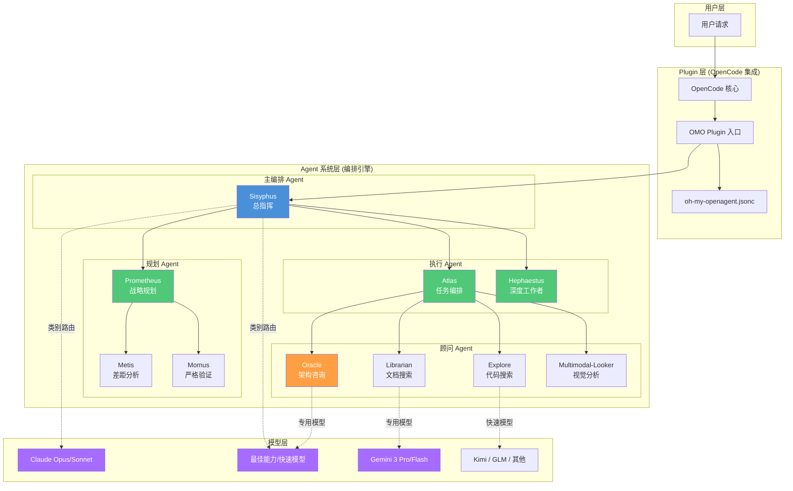
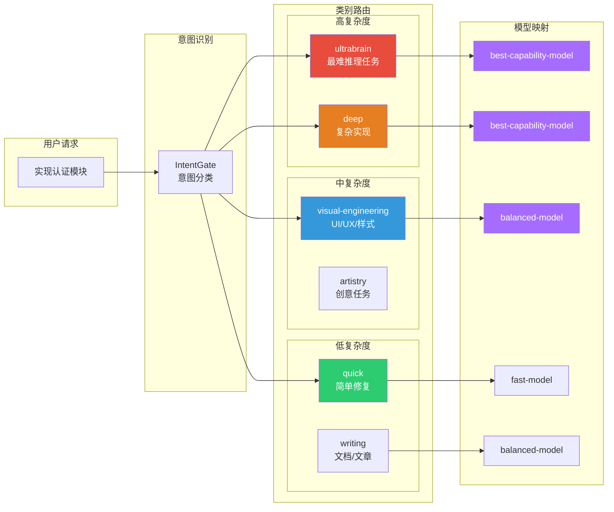

# oh-my-openagent 集成

> OMO 是叠加在 OpenCode 之上的社区编排框架，将单 **Agent（智能体）** 能力扩展为多 Agent 协作系统。

opencode.json 配好了，OpenCode 已经能完成单 Agent 任务。但 **Harness Engineering（驾驭工程）** 的核心是编排，而编排需要多个专业化 Agent 协同工作。oh-my-openagent（OMO）正是为此而生——它不是一个独立工具，而是一个以 **Plugin（插件）** 形式运行在 OpenCode 上的编排框架，类似于"操作系统内核"之上的"Shell 增强工具"。

这篇文章覆盖 OMO 的安装、架构理解和基本配置。你会了解 OMO 的 11 个核心 Agent（Sisyphus / Prometheus / Atlas / Hephaestus / Oracle 等）各自负责什么工作模式，类别路由如何在 OpenCode 原生路由之上叠加工作流路由和模型路由，以及 Ultrawork 和 Prometheus 模式的配置方法。读完本文，你的 OpenCode 将从"一个人的工具"升级为"一个 Agent 团队的引擎"。

> **⏱ 时间有限？先读这些：** OMO 概览 → 安装与验证 → OMO 双层架构详解 → OMO 基本配置

## OMO 概览

### 什么是 oh-my-openagent

**oh-my-openagent（OMO）** 是 OpenCode 生态中最受欢迎的多 Agent 编排框架，截至 2026 年 6 月已获得 GitHub 61K+ Stars、4.9K+ Forks。它的核心价值是将单一 AI Agent 转化为一个协同工作的开发团队。

OMO 的设计哲学可以用一句话概括：**让正确的模型做正确的事**。它不绑定任何特定模型提供商——不锁定 Claude，不锁定 GPT，也不锁定 Gemini。相反，它根据任务类型自动路由到最适合的模型：Claude 用于编排，GPT 用于深度推理，Gemini 用于前端任务，轻量模型用于快速任务。所有这些自动协同，无需人工干预。

> 注意：下文使用层级化模型名称标识模型在能力/成本谱系中的位置，具体映射请参考 OpenCode 官方文档的模型支持列表。

### OMO vs 原生 OpenCode

| 维度 | 原生 OpenCode | OpenCode + OMO |
|------|--------------|----------------|
| **Agent 数量** | 单一 Agent | 11 个专业化 Agent |
| **模型选择** | 手动切换或简单路由 | 按任务类别自动路由 |
| **任务分解** | 依赖用户明确指令 | 自动分解、委派、验证 |
| **并行执行** | 串行处理 | 支持 5-8 个 Agent 并行 |
| **会话连续性** | 会话结束即丢失 | Boulder 系统支持断点续传 |
| **规划模式** | Plan/Build 双模式 | Prometheus 面试式规划 + Atlas 执行 |
| **验证机制** | 依赖用户审查 | Momus 独立验证 + 自动诊断 |
| **成本优化** | 固定模型 | 按任务复杂度自动降级 |

### 何时需要 OMO

**你需要 OMO，如果：**

- 面对复杂的多文件重构任务，单一 Agent 容易遗漏依赖
- 需要同时进行代码编写、文档查阅、架构分析
- 希望任务在后台自动推进，而不是逐步确认
- 项目规模较大，需要系统性的任务分解能力

**你暂时不需要 OMO，如果：**

- 只是简单的单文件修改或快速问答
- 刚接触 OpenCode，还在熟悉基本操作
- 项目规模小，单 Agent 足以应对

## 安装与验证

### 前置条件

- **OpenCode >= 1.0.150** 已安装并配置
- 至少一个 AI 服务订阅（Claude / ChatGPT / Gemini / GitHub Copilot 等）
- **bun >= 1.x**（交互式安装需要）

验证 OpenCode 版本：

```bash:terminal
opencode --version
# 应显示 1.0.150 或更高
```

### 方式一：Agent 辅助安装（推荐）

OMO 官方推荐让 AI Agent 帮你完成安装。在你的 LLM Agent 会话中粘贴：

```text:terminal
Install and configure oh-my-openagent by following the instructions here:
https://raw.githubusercontent.com/code-yeongyu/oh-my-openagent/refs/heads/dev/docs/guide/installation.md
```

Agent 会自动：
- 询问你的订阅情况（Claude Pro/Max、ChatGPT Plus、Gemini 等）
- 下载并安装 `oh-my-openagent` 包
- 在 `opencode.json` 中注册插件
- 配置基础设置

### 方式二：手动交互式安装

如果你更喜欢手动控制，运行交互式安装器：

```bash:terminal
bunx oh-my-openagent install
```

> 如果没有安装 Bun，可通过 `curl -fsSL https://bun.sh/install | bash` 安装，或使用 `npx oh-my-openagent install`（如果包已发布到 npm）

安装器会询问你的订阅情况：

1. **是否有 Claude Pro/Max 订阅？**
   - 是，且是 max20 模式 → `--claude=max20`
   - 是，非 max20 → `--claude=yes`
   - 否 → `--claude=no`

2. **是否有 OpenAI/ChatGPT Plus 订阅？**
   - 是 → `--openai=yes`（Oracle Agent 使用最强推理模型）
   - 否 → `--openai=no`

3. **是否集成 Gemini 模型？**
   - 是 → `--gemini=yes`
   - 否 → `--gemini=no`

4. **是否有 GitHub Copilot 订阅？**
   - 是 → `--copilot=yes`
   - 否 → `--copilot=no`

5. **是否有 OpenCode Zen 访问权限？**
   - 是 → `--opencode-zen=yes`
   - 否 → `--opencode-zen=no`

### 非交互式安装（自动化场景）

对于 CI/CD 或脚本化部署，使用非交互模式：

```bash:terminal
# 示例：拥有 Claude Max + OpenAI 订阅
bunx oh-my-openagent install --no-tui \
  --claude=max20 \
  --openai=yes \
  --gemini=no \
  --copilot=no

# 示例：仅有 GitHub Copilot
bunx oh-my-openagent install --no-tui \
  --claude=no \
  --gemini=no \
  --copilot=yes

# 示例：使用 OpenCode Zen
bunx oh-my-openagent install --no-tui \
  --claude=no \
  --gemini=no \
  --copilot=no \
  --opencode-zen=yes
```

### 验证安装

安装完成后，运行诊断命令验证：

```bash:terminal
bunx oh-my-openagent doctor
```

该命令会检查六个方面：
- **System**：二进制版本、插件注册
- **Config**：JSONC + Schema 验证
- **TUI Plugin**：TUI 插件功能
- **Tools**：AST-grep、LSP、GitHub CLI、comment-checker 等工具可用性
- **Models**：缓存、每 Agent 解析、回退链可用性
- **Team Mode**：如果启用的话

退出代码：`0` 表示正常，`1` 表示错误，`2` 表示仅有警告。

确认插件已注册：

```bash:terminal
cat ~/.config/opencode/opencode.json
# Plugin 数组应包含 "oh-my-openagent"（旧版 "oh-my-opencode" 仍会加载并显示警告）
```

### Sisyphus 与 Claude 订阅说明

> **陷阱提示**：Sisyphus 的提示词针对 Claude 优化。如果你没有 Claude 订阅，建议使用 Hephaestus 作为主力 Agent（GPT 原生优化）。

**症状**：Sisyphus Agent 无法正常工作或频繁报错。

**原因**：Sisyphus 的提示词针对 Claude 优化，没有 Claude 订阅时体验大幅下降。

**解决方案**：
- 使用 Hephaestus 作为主力 Agent（GPT 原生优化）
- 或配置 Kimi K2.6 / GLM 5 作为回退

```json:.opencode/oh-my-openagent.jsonc
"agents": {
  "sisyphus": {
    "fallbackChain": [
      { "providers": ["opencode"], "model": "balanced-model" },
      { "providers": ["zai-coding-plan"], "model": "fast-model" }
    ]
  }
}
```

## OMO 双层架构详解

OMO 采用双层架构设计：**Plugin 层**负责与 OpenCode 集成，**Agent 系统层**负责多 Agent 编排。

### 整体架构



### 核心 Agent 体系

OMO 内置 11 个专业化 Agent，分为三大类：

#### 主编排 Agent

| Agent | 角色 | 默认模型 | 职责 |
|-------|------|---------|------|
| **Sisyphus** | 总指挥 | best-capability-model | 理解用户意图、分解任务、协调调用其他 Agent、驱动任务完成 |
| **Hephaestus** | 深度工作者 | best-capability-model | 接收目标而非指令，自主探索代码库、研究模式、端到端执行 |
| **Atlas** | 任务编排器 | balanced-model | 读取已验证计划，委派给专业化 Agent，跟踪跨任务学习 |

#### 规划 Agent

| Agent | 角色 | 默认模型 | 职责 |
|-------|------|---------|------|
| **Prometheus** | 战略规划师 | best-capability-model | 面试式需求收集、代码库探索、创建详细作战计划（不写代码） |
| **Metis** | 差距分析师 | best-capability-model | 在规划阶段发现歧义和边界情况 |
| **Momus** | 严格验证师 | best-capability-model | 对计划进行无情验证，只在计划无懈可击时才批准 |

#### 顾问 Agent（Subagent）

| Agent | 角色 | 默认模型 | 职责 |
|-------|------|---------|------|
| **Oracle** | 架构顾问 | best-capability-model | 复杂调试和架构决策，只读分析 |
| **Librarian** | 文档搜索师 | fast-model | 查找真实 GitHub 示例和官方文档 |
| **Explore** | 代码搜索师 | fast-model | 快速代码库 grep，便宜且并行 |
| **Multimodal-Looker** | 视觉分析师 | balanced-model | PDF/图像/截图分析 |
| **Sisyphus-Junior** | 轻量级执行器 | balanced-model | 类别委派的任务执行，自动创建和完成 |

### 类别路由系统

OMO 的核心创新是**类别路由（Category Routing）**——Agent 不直接指定模型名称，而是指定任务类别，系统自动映射到最优模型。



**类别定义**：

| 类别 | 用途 | 默认模型 | 典型场景 |
|------|------|---------|---------|
| `ultrabrain` | 最难推理任务 | best-capability-model | 架构决策、复杂重构 |
| `deep` | 复杂实现 | best-capability-model | 多文件修改、算法实现 |
| `visual-engineering` | UI/UX/样式 | balanced-model | 前端开发、动画 |
| `artistry` | 创意任务 | best-capability-model | 设计建议、文案 |
| `quick` | 简单修复 | fast-model | 小改动、格式化 |
| `writing` | 文档/文章 | balanced-model | README、注释 |

### 模型解析优先级

每个 Agent 的模型解析遵循三级优先级：

1. **用户覆盖**：配置文件中明确指定的模型
2. **Provider 回退链**：按优先级尝试 `Native > GitHub Copilot > OpenCode Zen > Z.ai`
3. **系统默认**：所有 Provider 不可用时的兜底模型

## OMO 基本配置

### 配置文件位置

OMO 配置文件支持全局和项目两级：

| 位置 | 用途 | 优先级 |
|------|------|--------|
| `~/.config/opencode/oh-my-openagent.jsonc` | 全局默认配置 | 低 |
| `.opencode/oh-my-openagent.jsonc` | 项目级配置 | 高（覆盖全局） |

### 完整配置示例

```json:.opencode/oh-my-openagent.jsonc
{
  "$schema": "https://raw.githubusercontent.com/code-yeongyu/oh-my-openagent/dev/assets/oh-my-openagent.schema.json",
  
  "agents": {
    "sisyphus": {
      "model": "best-capability-model",
      "variant": "max",
      "temperature": 0.1,
      "fallbackChain": [
        { "providers": ["anthropic", "github-copilot", "opencode"], "model": "best-capability-model", "variant": "max" },
        { "providers": ["opencode"], "model": "balanced-model" },
        { "providers": ["zai-coding-plan", "opencode"], "model": "balanced-model" },
        { "providers": ["opencode"], "model": "fast-model" }
      ]
    },
    "hephaestus": {
      "model": "best-capability-model",
      "variant": "medium",
      "temperature": 0.1,
      "requiredProvider": ["openai", "github-copilot", "venice", "opencode"]
    },
    "atlas": {
      "model": "balanced-model",
      "temperature": 0.1
    },
    "prometheus": {
      "model": "best-capability-model",
      "temperature": 0.1
    },
    "oracle": {
      "model": "best-capability-model",
      "temperature": 0.1
    },
    "librarian": {
      "model": "fast-model",
      "temperature": 0.1
    },
    "explore": {
      "model": "fast-model",
      "temperature": 0.1
    },
    "metis": {
      "model": "best-capability-model",
      "temperature": 0.3
    },
    "momus": {
      "model": "best-capability-model",
      "temperature": 0.1
    },
    "multimodal-looker": {
      "model": "balanced-model",
      "temperature": 0.1
    }
  },
  
  "categories": {
    "ultrabrain": {
      "model": "best-capability-model",
      "variant": "max",
      "fallbackChain": [
        { "model": "best-capability-model" },
        { "model": "balanced-model" }
      ]
    },
    "deep": {
      "model": "best-capability-model",
      "variant": "high"
    },
    "visual-engineering": {
      "model": "balanced-model",
      "fallbackChain": [
        { "model": "balanced-model" },
        { "model": "fast-model" }
      ]
    },
    "artistry": {
      "model": "best-capability-model",
      "variant": "medium"
    },
    "quick": {
      "model": "fast-model",
      "fallbackChain": [
        { "model": "fast-model" }
      ]
    },
    "writing": {
      "model": "balanced-model",
      "fallbackChain": [
        { "model": "balanced-model" }
      ]
    }
  },
  
  "skills": {
    "sources": [
      "~/.config/opencode/skills",
      "./.config/opencode/skills"
    ],
    "disabled": [],
    "overrides": {}
  },
  
  "ultrawork": {
    "enabled": true,
    "maxParallelAgents": 5,
    "autoVerify": true,
    "verificationLevel": "strict"
  },
  
  "prometheus": {
    "interviewMode": true,
    "maxQuestions": 10,
    "requireMomusApproval": true
  },
  
  "team_mode": {
    "enabled": false,
    "maxMembers": 8,
    "visualization": "tmux"
  },
  
  "boulder": {
    "persistencePath": "./.opencode/boulder.json",
    "autoResume": true,
    "maxHistorySize": 100
  },
  
  "telemetry": {
    "enabled": true,
    "anonymousId": true
  }
}
```

### 关键配置段说明

#### agents 配置

定义每个 Agent 的模型和参数：

```json:.opencode/oh-my-openagent.jsonc
"agents": {
  "sisyphus": {
    "model": "best-capability-model",     // 默认模型
    "variant": "max",                // 模型变体（max/high/medium/low）
    "temperature": 0.1,              // 温度参数
    "fallbackChain": [...]           // 回退链
  }
}
```

**重要提示**：Sisyphus 的提示词针对 Claude 优化。如果你没有 Claude 订阅，建议使用 Hephaestus 作为主力 Agent（GPT 原生优化）。

#### categories 配置

定义类别到模型的映射：

```json:.opencode/oh-my-openagent.jsonc
"categories": {
  "visual-engineering": {
    "model": "balanced-model",
    "fallbackChain": [
      { "model": "balanced-model" },
      { "model": "fast-model" }
    ]
  }
}
```

当 Sisyphus 委派任务时，它选择类别而非模型名称：

```text:terminal
task(category="visual-engineering", prompt="优化登录页面的动画效果")
```

系统自动将 `visual-engineering` 映射到 Gemini 3 Pro。

#### skills 配置

控制 **Skill（技能）** 的来源和行为：

```json:.opencode/oh-my-openagent.jsonc
"skills": {
  "sources": [                       // Skill 搜索路径
    "~/.config/opencode/skills",
    "./.config/opencode/skills"
  ],
  "disabled": ["legacy-skill"],      // 禁用的 Skill
    "overrides": {                     // 覆盖特定 Skill 配置
      "my-custom-skill": {
        "model": "fast-model"
      }
  }
}
```

#### ultrawork 配置

Ultrawork 是 OMO 的核心工作模式——输入三个字母 `ulw`，系统自动完成规划、研究、实现、验证全流程：

```json:.opencode/oh-my-openagent.jsonc
"ultrawork": {
  "enabled": true,
  "maxParallelAgents": 5,           // 最大并行 Agent 数
  "autoVerify": true,                // 自动验证
  "verificationLevel": "strict"      // 验证级别：strict/normal/relaxed
}
```

#### prometheus 配置

Prometheus 模式提供面试式规划：

```json:.opencode/oh-my-openagent.jsonc
"prometheus": {
  "interviewMode": true,             // 启用面试模式
  "maxQuestions": 10,                // 最大提问数
  "requireMomusApproval": true       // 需要 Momus 验证通过
}
```

### 在 opencode.json 中注册 OMO

OMO 作为 Plugin 运行，需要在 `opencode.json` 中注册：

```json:opencode.json
{
  "plugin": [
    "oh-my-openagent"
  ]
}
```

如果使用旧版包名，会看到警告提示。建议更新为新名称。

## Ultrawork 实战

### 第一次 Ultrawork

安装完成后，立即尝试 Ultrawork：

```text:terminal
ultrawork: 重构认证模块，提高代码可测试性
```

或使用简短别名：

```text:terminal
ulw: 修复所有 lint 警告
```

### Ultrawork 执行流程

1. **IntentGate**：解析你的真实意图
2. **Sisyphus 接管**：评估代码库成熟度
3. **并行探索**：启动 2-5 个 Explore Agent 扫描代码库
4. **规划与委派**：创建执行计划，委派给专业化 Agent
5. **独立验证**：Momus 验证结果，运行诊断
6. **持续迭代**：直到任务完成

### Prometheus 规划模式

对于复杂任务，先进入 Prometheus 模式：

```text:terminal
/prometheus
```

Prometheus 会：
1. 面试式收集需求
2. 探索代码库
3. Metis 分析差距
4. Momus 验证计划
5. 生成详细作战计划

确认计划后，运行 `/start-work` 开始执行。

## 版本演进与兼容性

### 重要说明

> ⚠️ **版本信息**：oh-my-openagent 处于活跃开发中，具体版本号可能频繁变化。官方仓库的 [Releases 页面](https://github.com/code-yeongyu/oh-my-openagent/releases) 提供了最新的发行信息。
>
> 本文档基于官方最新文档编写，但建议始终查阅 [官方安装指南](https://raw.githubusercontent.com/code-yeongyu/oh-my-openagent/refs/heads/dev/docs/guide/installation.md) 获取最新的安装说明。

### 常见陷阱与排查

#### 陷阱 2：插件加载失败

**症状**：`bunx oh-my-openagent doctor` 报告插件未加载。

**排查步骤**：

```bash:terminal
# 1. 检查 opencode.json
cat ~/.config/opencode/opencode.json | grep -A5 "plugin"

# 2. 检查配置文件语法
cat ~/.config/opencode/oh-my-openagent.jsonc

# 3. 查看运行时日志
cat /tmp/oh-my-openagent.log
```

#### 陷阱 3：模型解析失败

**症状**：Agent 报告"无法解析模型"。

**原因**：Provider 未正确认证或模型不在支持列表中。

**解决方案**：

```bash:terminal
# 重新认证 Provider
opencode auth login

# 刷新模型能力缓存
bunx oh-my-openagent refresh-model-capabilities
```

#### 陷阱 4：Ultrawork 无响应

**症状**：输入 `ultrawork` 后无反应或报错。

**排查清单**：
- [ ] OpenCode 版本 >= 1.0.150
- [ ] 至少一个 Provider 已认证
- [ ] oh-my-openagent.jsonc 语法正确
- [ ] ultrawork.enabled = true

## 关联章节

- ← [OpenCode 配置详解](opencode-config.md) — 需要在 opencode.json 中配置 OMO 插件
- → [工作流实战](../04-workflows/) — OMO 的工作流模式在 Ch4 深入展开
- → [**MCP（模型上下文协议）** 服务器](../06-advanced/mcp-servers.md) — OMO 与 MCP 的协同
- → [自定义 Agent 与 Plugin](../06-advanced/custom-agents.md) — 自定义 Agent 依赖 OMO 的扩展能力
