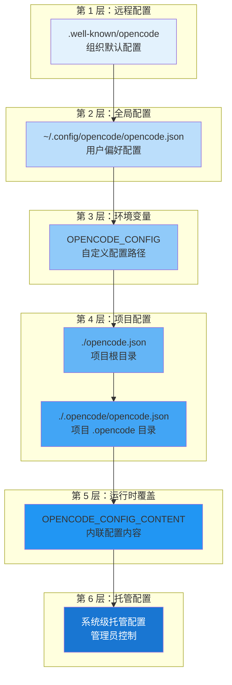
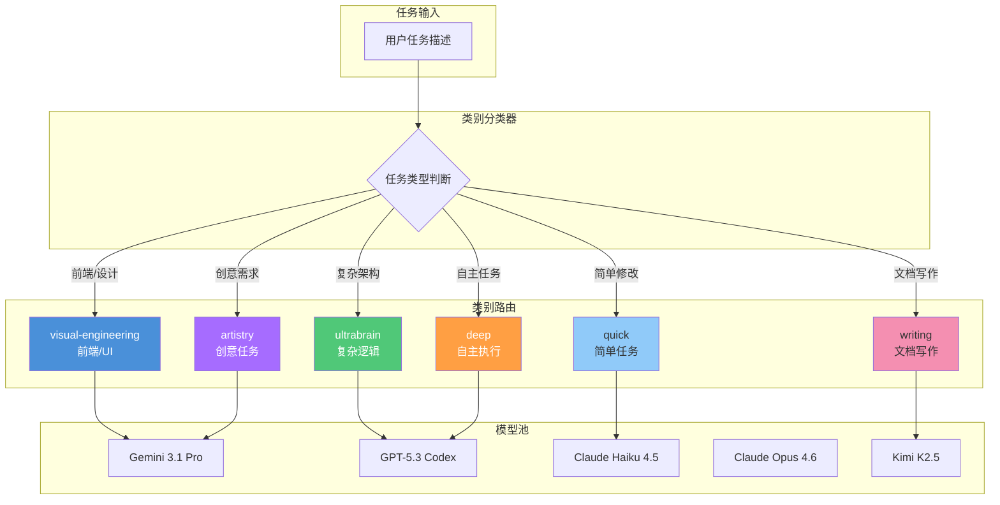
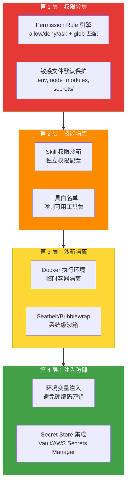
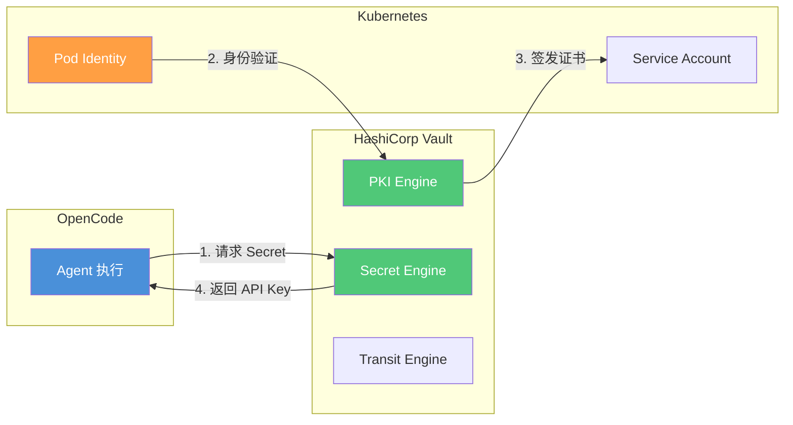

# OpenCode 配置深度解析

> opencode.json 的完整参考：从 Agent 定义到安全模型，理解配置即代码的设计哲学。

## 文章概述

快速上手之后，你的 OpenCode 已经能跑了。但"能跑"和"好用"之间隔着一个配置文件的深度理解。opencode.json 不仅是参数列表，更是一个声明式的工程流水线定义文件。它的分层设计（全局→项目→环境变量→CLI flag）允许团队将配置纳入版本控制，实现配置可审计、可复现。

这篇文章逐一拆解配置文件的每个关键段：agents 定义、skills 注册、mcpServers 集成、权限规则引擎、成本管控策略，以及最重要的类别路由系统。类别路由（Category Routing）决定了 Agent 如何根据任务类型自动分派到合适的模型，是整个工作流引擎的调度核心。读完本文，你将能够手写或评审一份工程级的 opencode.json 配置。

## 配置范围与合并逻辑

### 配置文件位置与优先级

OpenCode 的配置系统采用分层架构，配置文件可放置于多个位置，按优先级从低到高依次加载：



**关键原则**：配置文件是**合并（merge）** 而非替换。后加载的配置仅覆盖冲突的键，非冲突配置会保留。例如，全局配置设置 `autoupdate: true`，项目配置设置 `model: "anthropic/claude-sonnet-4-5"`，最终配置将同时包含这两个设置。

### 托管配置（企业部署）

企业环境中，管理员可通过系统级目录强制配置，用户无法覆盖：

| 平台 | 托管配置路径 |
|------|-------------|
| macOS | `/Library/Application Support/opencode/` |
| Linux | `/etc/opencode/` |
| Windows | `%ProgramData%\opencode` |

macOS 还支持通过 MDM（如 Jamf、Kandji）部署 `.mobileconfig` 配置文件，实现最高优先级的强制配置。

### 配置格式

OpenCode 支持 **JSON** 和 **JSONC**（带注释的 JSON）两种格式：

```jsonc
{
  "$schema": "https://opencode.ai/config.json",
  "model": "anthropic/claude-sonnet-4-5",
  "autoupdate": true,
  "server": {
    "port": 4096
  }
}
```

`$schema` 字段指向 JSON Schema 定义，启用编辑器的语法提示和校验功能。

## opencode.json 完整结构详解

### 核心配置段概览

```json
{
  "$schema": "https://opencode.ai/config.json",
  "model": "anthropic/claude-sonnet-4-5",
  "small_model": "anthropic/claude-haiku-4-5",
  "default_agent": "build",
  "provider": {},
  "agent": {},
  "command": {},
  "mcp": {},
  "permission": {},
  "tools": {},
  "server": {},
  "formatter": {},
  "lsp": {},
  "compaction": {},
  "autoupdate": true,
  "snapshot": true
}
```

### Provider 配置

Provider 配置定义模型提供者及其连接参数：

```json
{
  "provider": {
    "anthropic": {
      "options": {
        "apiKey": "{env:ANTHROPIC_API_KEY}",
        "baseURL": "https://api.anthropic.com",
        "timeout": 600000,
        "setCacheKey": true
      }
    },
    "openai": {
      "options": {
        "apiKey": "{env:OPENAI_API_KEY}",
        "baseURL": "https://api.openai.com/v1"
      }
    },
    "amazon-bedrock": {
      "options": {
        "region": "us-east-1",
        "profile": "production"
      }
    }
  }
}
```

**Provider Options 字段说明**：

| 字段 | 类型 | 说明 |
|------|------|------|
| `apiKey` | string | API 密钥，支持 `{env:VAR_NAME}` 环境变量引用 |
| `baseURL` | string | 自定义 API 端点（代理场景常用） |
| `timeout` | number \| false | 请求超时（毫秒），默认 300000 |
| `chunkTimeout` | number | 流式响应的块超时（毫秒） |
| `setCacheKey` | boolean | 启用 Prompt Cache 密钥（Anthropic 专用） |

### Agent 配置

自定义 Agent 允许为特定任务创建专用角色：

```json
{
  "agent": {
    "code-reviewer": {
      "description": "代码审查专家，关注安全、性能和可维护性",
      "model": "anthropic/claude-sonnet-4-5",
      "prompt": "你是一名资深代码审查专家。重点关注：\n1. 安全漏洞\n2. 性能瓶颈\n3. 代码可读性\n4. 设计模式合规性",
      "tools": {
        "write": false,
        "edit": false,
        "bash": {
          "git diff*": "allow",
          "git log*": "allow",
          "*": "deny"
        }
      }
    },
    "test-writer": {
      "description": "测试用例生成专家",
      "model": "anthropic/claude-haiku-4-5",
      "prompt": "专注于编写高质量的单元测试和集成测试",
      "tools": {
        "write": "allow",
        "edit": "allow",
        "bash": {
          "npm test*": "allow",
          "*": "ask"
        }
      }
    }
  }
}
```

Agent 也可通过 Markdown 文件定义，放置于 `~/.config/opencode/agents/` 或 `.opencode/agents/` 目录。

### Command 配置

自定义命令用于封装重复性工作流：

```json
{
  "command": {
    "test": {
      "template": "运行完整测试套件并生成覆盖率报告。重点关注失败的测试用例，分析根因并提出修复建议。",
      "description": "运行测试并生成覆盖率报告",
      "agent": "build",
      "model": "anthropic/claude-haiku-4-5"
    },
    "review": {
      "template": "审查当前 Git 暂存区的所有变更，检查代码质量、安全性和最佳实践。",
      "description": "审查暂存区变更",
      "agent": "code-reviewer"
    },
    "component": {
      "template": "创建名为 $ARGUMENTS 的 React 组件，包含 TypeScript 类型定义和基础结构。",
      "description": "创建新组件"
    }
  }
}
```

`$ARGUMENTS` 占位符会被命令行参数替换，例如 `/component Button` 会将 `$ARGUMENTS` 替换为 `Button`。

### MCP Servers 配置

MCP（Model Context Protocol）服务器扩展 Agent 的能力边界：

```json
{
  "mcp": {
    "filesystem": {
      "type": "local",
      "command": "mcp-filesystem",
      "args": ["--root", "/workspace"],
      "enabled": true
    },
    "postgres": {
      "type": "local",
      "command": "mcp-postgres",
      "args": ["--connection-string", "{env:DATABASE_URL}"],
      "enabled": true
    },
    "jira": {
      "type": "remote",
      "url": "https://jira.example.com/mcp",
      "headers": {
        "Authorization": "Bearer {env:JIRA_TOKEN}"
      },
      "enabled": false
    }
  }
}
```

**MCP 配置字段说明**：

| 字段 | 类型 | 说明 |
|------|------|------|
| `type` | string | `local`（本地进程）或 `remote`（HTTP 服务） |
| `command` | string | 本地 MCP 的启动命令 |
| `args` | array | 命令行参数 |
| `url` | string | 远程 MCP 的 URL |
| `headers` | object | HTTP 请求头 |
| `enabled` | boolean | 是否启用 |

### Server 配置

配置 OpenCode 服务端参数：

```json
{
  "server": {
    "port": 4096,
    "hostname": "0.0.0.0",
    "mdns": true,
    "mdnsDomain": "myproject.local",
    "cors": ["http://localhost:5173", "https://app.example.com"]
  }
}
```

| 字段 | 说明 |
|------|------|
| `port` | 监听端口，默认 4096 |
| `hostname` | 监听地址，`0.0.0.0` 允许外部访问 |
| `mdns` | 启用 mDNS 服务发现 |
| `mdnsDomain` | 自定义 mDNS 域名 |
| `cors` | CORS 允许的额外源 |

### Tools 配置

控制 Agent 可用的工具集：

```json
{
  "tools": {
    "write": false,
    "edit": true,
    "bash": true,
    "webfetch": true,
    "grep": true
  }
}
```

禁用工具可限制 Agent 的能力范围，适用于只读分析场景。

### Formatter 配置

配置代码格式化工具：

```json
{
  "formatter": {
    "prettier": {
      "disabled": false
    },
    "custom-prettier": {
      "command": ["npx", "prettier", "--write", "$FILE"],
      "environment": {
        "PRETTIER_CONFIG": ".prettierrc.custom.json"
      }
    }
  }
}
```

### LSP Servers 配置

配置语言服务器协议（LSP）集成：

```json
{
  "lsp": {
    "typescript": {
      "command": ["typescript-language-server", "--stdio"]
    },
    "python": {
      "command": ["pylsp"]
    },
    "go": {
      "command": ["gopls"]
    }
  }
}
```

### Compaction 配置

上下文压缩策略配置：

```json
{
  "compaction": {
    "enabled": true,
    "threshold": 0.8,
    "strategy": "summarize"
  }
}
```

当上下文使用率达到 `threshold` 时，OpenCode 会自动压缩历史对话以释放空间。

## 类别路由系统详解

### 核心概念

类别路由（Category Routing）是 OpenCode 工作流引擎的调度核心。它根据**任务类型**而非模型名称来分派工作，实现"按意图委托"：

- 传统方式：手动指定模型 `model="gemini-3.1-pro"`
- 类别路由：按意图委托 `category="visual-engineering"`

系统自动选择最优模型，并在模型不可用时自动降级到备选方案。

### 内置类别一览

OpenCode 内置 8 个类别，覆盖常见任务场景：

| 类别 | 默认模型 | 变体 | 适用场景 |
|------|----------|------|----------|
| **visual-engineering** | google/gemini-3.1-pro | high | 前端、UI/UX、设计、样式、动画 |
| **ultrabrain** | openai/gpt-5.3-codex | xhigh | 复杂逻辑、架构设计、算法实现 |
| **deep** | openai/gpt-5.3-codex | medium | 目标驱动的自主问题解决 |
| **artistry** | google/gemini-3.1-pro | high | 创意任务、非传统方案 |
| **quick** | anthropic/claude-haiku-4-5 | - | 简单任务、单文件修改 |
| **unspecified-low** | anthropic/claude-sonnet-4-6 | - | 中等复杂度、不匹配其他类别 |
| **unspecified-high** | anthropic/claude-opus-4-6 | max | 高复杂度、不匹配其他类别 |
| **writing** | kimi-for-coding/k2p5 | - | 文档、技术写作 |

### 类别路由映射图



### 类别详解与使用示例

#### visual-engineering

**适用场景**：前端实现、UI/UX 设计、样式布局、动画效果、组件库开发。

**类别提示词核心**：
```
设计优先思维：
- 大胆的美学选择优于安全默认值
- 意想不到的布局、不对称、打破网格的元素
- 独特的字体（避免：Arial、Inter、Roboto）
- 有凝聚力的配色方案，配以鲜明的强调色
- 高冲击力的动画，带有交错显示效果
```

**使用示例**：
```json
{
  "category": "visual-engineering",
  "load_skills": ["tailwind", "framer-motion"],
  "prompt": "创建一个 Hero 区域：\n- 全屏渐变背景\n- 滚动时文字动画显示\n- 非对称布局配 CTA 按钮\n- 移动端响应式断点"
}
```

**降级链**：`gemini-3.1-pro` → `glm-5` → `claude-opus-4-6`

#### ultrabrain

**适用场景**：深度逻辑推理、复杂架构、系统设计、算法实现、性能优化、疑难调试。

**类别提示词核心**：
```
关键代码风格要求：
1. 写代码前，先搜索现有代码库中的类似模式
2. 代码必须匹配项目约定——无缝融入
3. 编写可读代码——不要花哨技巧
4. 如不确定风格，继续探索直到找到模式

战略顾问思维：
- 偏向简单性：最不复杂的解决方案
- 利用现有代码/模式而非新组件
- 一个明确的建议，附带工作量估算
```

**使用示例**：
```json
{
  "category": "ultrabrain",
  "load_skills": ["algorithms", "performance"],
  "prompt": "目标：优化数据库查询性能。\n\n上下文：\n- 用户搜索查询耗时 3-5 秒\n- users 表有 100 万+ 记录\n- 当前查询做全表扫描\n\n探索代码库，识别瓶颈，提出索引策略。"
}
```

**降级链**：`gpt-5.3-codex` → `gemini-3.1-pro` → `claude-opus-4-6`

#### quick

**适用场景**：简单任务、单文件修改、拼写修正、简单配置变更。

**重要提示**：quick 类别使用能力较弱的模型（claude-haiku-4-5），**必须提供详尽明确的指令**：

```json
{
  "category": "quick",
  "prompt": "任务：修复 README.md 第 42 行的拼写错误\n\n必须做：\n1. 打开 README.md\n2. 找到第 42 行：\"documentaiton\"\n3. 改为：\"documentation\"\n4. 保存文件\n\n禁止做：\n- 做任何其他修改\n- 重新格式化文件\n- 添加注释\n\n预期输出：\n- 仅编辑 README.md\n- 仅修改第 42 行"
}
```

**降级链**：`claude-haiku-4-5` → `gemini-3-flash` → `gpt-5-nano`

### 自定义类别

可在配置中定义自定义类别：

```json
{
  "categories": {
    "backend-api": {
      "model": "openai/gpt-5.3-codex",
      "variant": "high",
      "description": "后端 API 开发专用"
    },
    "mobile": {
      "model": "google/gemini-3.1-pro",
      "variant": "high",
      "description": "移动应用开发（React Native、Flutter）"
    }
  }
}
```

### 降级链机制

每个类别都有预设的降级链，确保模型不可用时自动切换：

```json
{
  "visual-engineering": {
    "fallbackChain": [
      { "providers": ["google", "github-copilot"], "model": "gemini-3.1-pro", "variant": "high" },
      { "providers": ["zai-coding"], "model": "glm-5" },
      { "providers": ["anthropic"], "model": "claude-opus-4-6", "variant": "max" }
    ]
  }
}
```

**解析逻辑**：
1. 尝试第一个条目：通过 google/github-copilot 使用 `gemini-3.1-pro`
2. 若不可用，尝试第二个：通过 zai-coding 使用 `glm-5`
3. 若仍不可用，尝试第三个：通过 anthropic 使用 `claude-opus-4-6`
4. 全部失败则报错

## 四层安全模型配置

### 安全架构概览

OpenCode 采用纵深防御策略，构建四层安全架构：



### 第 1 层：权限规则引擎

#### 权限动作类型

| 动作 | 说明 | 适用场景 |
|------|------|----------|
| `allow` | 无需确认直接执行 | 受信任的操作 |
| `ask` | 执行前请求用户确认 | 潜在风险操作 |
| `deny` | 完全禁止执行 | 高风险操作 |

#### 权限配置语法

**简单语法**：
```json
{
  "permission": {
    "edit": "ask",
    "bash": "ask",
    "webfetch": "allow"
  }
}
```

**详细语法（支持 glob 匹配）**：
```json
{
  "permission": {
    "edit": "ask",
    "bash": {
      "*": "ask",
      "git status": "allow",
      "git diff*": "allow",
      "git log*": "allow",
      "npm run*": "allow",
      "rm -rf*": "deny",
      "git push --force*": "deny"
    }
  }
}
```

**规则评估顺序**：规则按顺序评估，**最后匹配的规则生效**。因此应将通配符 `*` 规则放在前面，具体规则放在后面。

#### 敏感文件保护

OpenCode 默认保护以下敏感路径：

```json
{
  "permission": {
    "edit": {
      "*": "ask",
      ".env": "deny",
      ".env.*": "deny",
      "**/secrets/**": "deny",
      "**/credentials/**": "deny",
      "node_modules/**": "deny",
      ".git/**": "deny"
    }
  }
}
```

#### Per-Agent 权限覆盖

可为特定 Agent 设置独立权限：

```json
{
  "permission": {
    "edit": "ask",
    "bash": "ask"
  },
  "agent": {
    "build": {
      "permission": {
        "edit": "allow",
        "bash": "allow"
      }
    },
    "plan": {
      "permission": {
        "edit": "deny",
        "bash": {
          "*": "deny",
          "git status": "allow",
          "git diff*": "allow"
        }
      }
    }
  }
}
```

### 第 2 层：技能隔离

每个 Skill 可配置独立的权限边界：

```json
{
  "skills": {
    "database-migration": {
      "permissions": {
        "bash": {
          "npm run migrate*": "allow",
          "*": "deny"
        },
        "edit": {
          "migrations/**": "allow",
          "*": "deny"
        }
      }
    }
  }
}
```

### 第 3 层：沙箱隔离

#### Docker 执行环境

OpenCode 支持在 Docker 容器中执行代码，实现进程级隔离：

```json
{
  "sandbox": {
    "enabled": true,
    "image": "opencode-runner:latest",
    "memory": "2g",
    "cpu": 2,
    "timeout": 300000,
    "network": false
  }
}
```

**Docker 隔离特性**：
- 每次执行创建全新容器
- 仅挂载当前项目目录
- 限制网络访问（可配置）
- 执行完毕立即销毁
- 资源限制（CPU/内存）

#### 系统级沙箱

macOS 使用 Seatbelt，Linux 使用 Bubblewrap 实现系统级沙箱：

```json
{
  "sandbox": {
    "backend": "native",
    "read_only_paths": ["/usr", "/lib"],
    "write_only_paths": ["/tmp"],
    "denied_paths": ["/etc/passwd", "/etc/shadow"]
  }
}
```

### 第 4 层：注入防御

#### 环境变量注入

避免在配置文件中硬编码敏感信息，使用环境变量引用：

```json
{
  "provider": {
    "anthropic": {
      "options": {
        "apiKey": "{env:ANTHROPIC_API_KEY}"
      }
    }
  },
  "mcp": {
    "postgres": {
      "args": ["--connection-string", "{env:DATABASE_URL}"]
    }
  }
}
```

#### Secret Store 集成

企业环境推荐集成专业 Secret 管理服务：

**HashiCorp Vault**：
```json
{
  "secrets": {
    "backend": "vault",
    "vault": {
      "address": "https://vault.example.com",
      "path": "secret/data/opencode",
      "role": "opencode-agent"
    }
  }
}
```

**AWS Secrets Manager**：
```json
{
  "secrets": {
    "backend": "aws-secrets-manager",
    "aws": {
      "region": "us-east-1",
      "secret_id": "opencode/api-keys"
    }
  }
}
```

## STRIDE 威胁建模

基于 STRIDE 模型分析 OpenCode 面临的安全威胁及防护措施：

| 威胁类型 | 描述 | OpenCode 防护措施 | 配置示例 |
|----------|------|-------------------|----------|
| **S**poofing（欺骗） | 冒充合法用户或系统 | API Key 验证、环境变量注入、托管配置强制 | `{ "provider": { "anthropic": { "options": { "apiKey": "{env:ANTHROPIC_API_KEY}" } } } }` |
| **T**ampering（篡改） | 修改数据或代码 | 权限规则、文件保护、Git 集成审计 | `{ "permission": { "edit": { ".env": "deny", "**/secrets/**": "deny" } } }` |
| **R**epudiation（否认） | 否认操作行为 | 审计日志、Hook 事件记录、Snapshot 快照 | `{ "snapshot": true, "audit": { "enabled": true, "log_file": "/var/log/opencode/audit.log" } }` |
| **I**nformation Disclosure（信息泄露） | 敏感数据暴露 | .opencodeignore、Secret 管理、沙箱隔离 | `.opencodeignore` 排除敏感文件 |
| **D**enial of Service（拒绝服务） | 资源耗尽攻击 | Token 预算、速率限制、容器资源限制 | `{ "limit": { "output": 32768 }, "sandbox": { "memory": "2g" } }` |
| **E**levation of Privilege（特权提升） | 获取未授权权限 | 沙箱隔离、权限分层、最小权限原则 | Bash 白名单 + Seatbelt/Bubblewrap |

### .opencodeignore 配置

创建 `.opencodeignore` 文件排除敏感目录：

```gitignore
# 环境变量文件
.env
.env.*
.env.local
.env.*.local

# 密钥和凭证
secrets/
credentials/
*.pem
*.key
*.p12

# 依赖目录
node_modules/
vendor/
__pycache__/

# 构建产物
dist/
build/
.target/

# IDE 配置
.idea/
.vscode/
*.swp

# 日志和临时文件
*.log
*.tmp
.cache/
```

### 合规映射

| 合规框架 | 相关控制 | OpenCode 配置映射 |
|----------|----------|-------------------|
| **NIST CSF** | PR.AC-4 访问控制 | Permission Rule 引擎 |
| **NIST CSF** | PR.DS-5 数据保护 | .opencodeignore + 沙箱隔离 |
| **NIST CSF** | DE.CM-1 恶意代码检测 | 审计日志 + Hook 事件 |
| **SOC 2** | CC6.1 逻辑访问 | 权限分层 + Secret Store |
| **SOC 2** | CC6.6 安全传输 | 环境变量注入 + TLS |
| **等保 2.0** | 身份鉴别 | API Key 验证 + MDM 托管 |
| **等保 2.0** | 访问控制 | Permission Rule + Agent 权限覆盖 |

## 企业集成架构

### CI/CD 集成

#### GitHub Actions 集成

```yaml
name: AI Code Review

on:
  pull_request:
    types: [opened, synchronize]

jobs:
  review:
    runs-on: ubuntu-latest
    steps:
      - uses: actions/checkout@v4
        with:
          fetch-depth: 0
      
      - name: Setup OpenCode
        run: |
          curl -fsSL https://opencode.ai/install | bash
          echo "$HOME/.opencode/bin" >> $GITHUB_PATH
      
      - name: Run AI Review
        env:
          ANTHROPIC_API_KEY: ${{ secrets.ANTHROPIC_API_KEY }}
        run: |
          opencode run "Review the changes in this PR for:
          - Security vulnerabilities
          - Performance issues
          - Code style consistency
          - Missing tests
          
          Output a structured review comment." \
            --agent code-reviewer \
            --output review.md
      
      - name: Post Review Comment
        uses: actions/github-script@v7
        with:
          script: |
            const fs = require('fs');
            const review = fs.readFileSync('review.md', 'utf8');
            await github.rest.issues.createComment({
              owner: context.repo.owner,
              repo: context.repo.repo,
              issue_number: context.issue.number,
              body: review
            });
```

#### GitLab CI 集成

```yaml
ai-review:
  stage: test
  image: node:20
  before_script:
    - curl -fsSL https://opencode.ai/install | bash
    - export PATH="$HOME/.opencode/bin:$PATH"
  script:
    - opencode run "Analyze the codebase and identify potential issues" --agent plan
  rules:
    - if: $CI_PIPELINE_SOURCE == "merge_request_event"
  artifacts:
    reports:
      junit: review-report.xml
```

### Secret Store 集成

#### HashiCorp Vault 集成架构



**配置示例**：
```json
{
  "secrets": {
    "backend": "vault",
    "vault": {
      "address": "https://vault.example.com",
      "auth": {
        "method": "kubernetes",
        "role": "opencode-agent"
      },
      "secrets": [
        {
          "path": "secret/data/anthropic",
          "key": "api_key",
          "env": "ANTHROPIC_API_KEY"
        }
      ]
    }
  }
}
```

#### AWS Secrets Manager 集成

```json
{
  "secrets": {
    "backend": "aws-secrets-manager",
    "aws": {
      "region": "us-east-1",
      "secrets": [
        {
          "secret_id": "opencode/anthropic-api-key",
          "env": "ANTHROPIC_API_KEY"
        },
        {
          "secret_id": "opencode/database-url",
          "env": "DATABASE_URL"
        }
      ]
    }
  }
}
```

### 监控集成

#### Prometheus 指标导出

```json
{
  "telemetry": {
    "metrics": {
      "enabled": true,
      "port": 9090,
      "path": "/metrics"
    }
  }
}
```

**关键指标**：
- `opencode_sessions_total`：会话总数
- `opencode_tokens_used_total`：Token 使用总量
- `opencode_request_duration_seconds`：请求延迟
- `opencode_errors_total`：错误总数

#### Grafana 仪表板

推荐监控面板配置：
- Token 消耗趋势图
- 模型响应延迟热力图
- 错误率告警规则
- 成本分析仪表板

#### 日志聚合

**ELK Stack 配置**：
```json
{
  "logging": {
    "level": "info",
    "format": "json",
    "output": "/var/log/opencode/opencode.log",
    "rotation": {
      "max_size": "100M",
      "max_age": 30,
      "max_backups": 10
    }
  }
}
```

**Loki 配置**：
```yaml
clients:
  - url: http://loki:3100/loki/api/v1/push
    labels:
      app: opencode
      environment: production
```

## 成本管控配置

### Token 预算配置

```json
{
  "limit": {
    "input": 128000,
    "output": 32768,
    "total": 160000
  },
  "budget": {
    "daily": 1000000,
    "monthly": 20000000,
    "alert_threshold": 0.8
  }
}
```

### 模型降级链

配置模型不可用时的自动降级：

```json
{
  "model_fallback": {
    "primary": "anthropic/claude-opus-4-6",
    "fallback_chain": [
      "anthropic/claude-sonnet-4-6",
      "anthropic/claude-haiku-4-5",
      "openai/gpt-4o-mini"
    ]
  }
}
```

### 上下文压缩策略

```json
{
  "compaction": {
    "enabled": true,
    "threshold": 0.75,
    "strategy": "summarize",
    "preserve": [
      "system_prompt",
      "recent_messages",
      "tool_results"
    ]
  }
}
```

## 配置最佳实践

### 团队协作配置模板

**全局配置（~/.config/opencode/opencode.json）**：
```json
{
  "$schema": "https://opencode.ai/config.json",
  "autoupdate": true,
  "provider": {
    "anthropic": {
      "options": {
        "apiKey": "{env:ANTHROPIC_API_KEY}",
        "timeout": 600000
      }
    }
  },
  "permission": {
    "edit": "ask",
    "bash": "ask"
  }
}
```

**项目配置（./.opencode/opencode.json）**：
```json
{
  "$schema": "https://opencode.ai/config.json",
  "model": "anthropic/claude-sonnet-4-5",
  "agent": {
    "code-reviewer": {
      "description": "代码审查专家",
      "model": "anthropic/claude-sonnet-4-5",
      "tools": {
        "write": false,
        "edit": false
      }
    }
  },
  "command": {
    "review": {
      "template": "审查当前变更",
      "agent": "code-reviewer"
    }
  },
  "mcp": {
    "postgres": {
      "type": "local",
      "command": "mcp-postgres",
      "args": ["--connection-string", "{env:DATABASE_URL}"]
    }
  }
}
```

### 安全配置检查清单

- [ ] API Key 使用环境变量注入，不硬编码
- [ ] `.env` 文件已添加到 `.gitignore`
- [ ] 敏感目录已配置 `deny` 权限
- [ ] 生产环境使用 Secret Store
- [ ] 定期轮换 API Key
- [ ] 启用审计日志
- [ ] 配置 Token 预算告警

## 关联章节

- ← [快速上手](quickstart.md) — 基础配置的深化
- → [工作流实战](../04-workflows/) — 工作流模式依赖正确的类别路由配置
- → [性能调优与成本管理](../06-advanced/performance-tuning.md) — 成本管控配置的进阶应用
