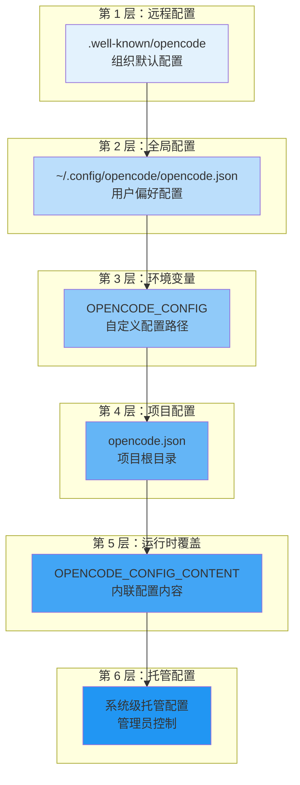
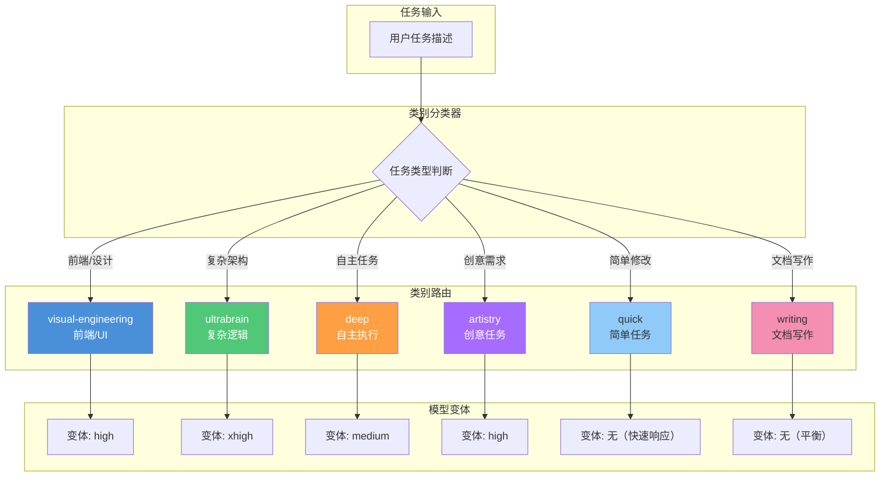
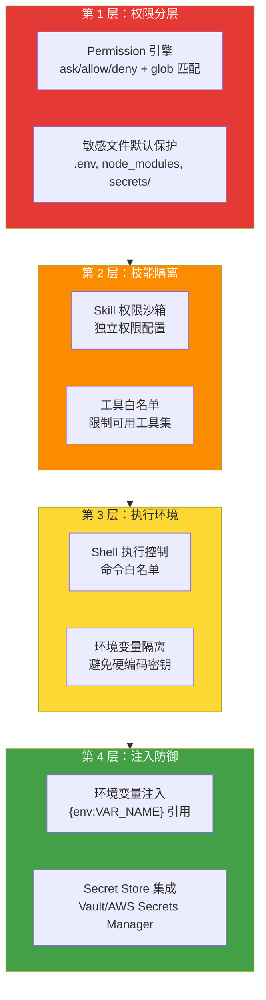

# OpenCode 配置深度解析

> opencode.json 的完整参考：从 **Agent（智能体）** 定义到安全模型，理解配置即代码的设计哲学。
>
> 如果你是初学者，请先阅读[配置基础](#配置格式)和[Provider 配置](#provider-配置)。高级配置部分可以根据需要选择性阅读。

## 文章概述

快速上手之后，你的 OpenCode 已经能跑了。但"能跑"和"好用"之间隔着一个配置文件的深度理解。opencode.json 不仅是参数列表，更是一个声明式的工程规范文件。它的分层设计（全局→项目→环境变量→CLI flag）允许团队将配置纳入版本控制，实现配置可审计、可复现。

这篇文章逐一拆解配置文件的每个关键段：Agent 定义、Skills 注册、**MCP（模型上下文协议）** 服务器集成、权限规则引擎、类别路由系统（oh-my-openagent 扩展功能）。类别路由（Category Routing）决定了 Agent 如何根据任务类型自动分派到合适的模型，是整个工作流引擎的调度核心。读完本文，你将能够手写或评审一份工程级的 opencode.json 配置。

> **⏱ 时间有限？先读这些：** 配置范围与合并逻辑 → opencode.json 完整结构详解 → 类别路由系统详解 → 四层安全模型配置

## 配置范围与合并逻辑

### 配置文件位置与优先级

OpenCode 的配置系统采用分层架构，配置文件可放置于多个位置，按优先级从低到高依次加载：



**关键原则**：配置文件是**合并（merge）** 而非替换。后加载的配置仅覆盖冲突的键，非冲突配置会保留。例如，全局配置设置 `autoupdate: true`，项目配置设置 `model: "anthropic/claude-sonnet-4-5"`，最终配置将同时包含这两个设置。

### 托管配置（企业部署）

企业环境中，管理员可通过系统级目录强制配置，用户无法覆盖：

| 平台 | 托管配置路径 |
|------|-------------|
| macOS | `/Library/Application Support/opencode/` |
| Linux | `/etc/opencode/` |
| Windows | `%ProgramData%\opencode` |

macOS 还支持通过 MDM（如 Jamf、Kandji）部署 `.mobileconfig` 配置文件，实现最高优先级的强制配置。

### 配置格式

OpenCode 支持 **JSON** 和 **JSONC**（带注释的 JSON）两种格式：

```json:opencode.json
{
  "$schema": "https://opencode.ai/config.json",
  "model": "anthropic/claude-sonnet-4-5",
  "autoupdate": true,
  "server": {
    "port": 4096
  }
}
```

`$schema` 字段指向 JSON Schema 定义，启用编辑器的语法提示和校验功能。

## opencode.json 完整结构详解

### 核心配置段概览

```json:opencode.json
{
  "$schema": "https://opencode.ai/config.json",
  "model": "anthropic/claude-sonnet-4-5",
  "small_model": "anthropic/claude-haiku-4-5",
  "default_agent": "build",
  "provider": {},
  "agent": {},
  "command": {},
  "mcp": {},
  "permission": {},
  "server": {},
  "formatter": {},
  "lsp": {},
  "compaction": {},
  "autoupdate": true,
  "snapshot": true
}
```

### Provider 配置

Provider 配置定义模型提供者及其连接参数。每个 Provider 可以使用 `env` 字段声明所需的环境变量，并通过 `whitelist`/`blacklist` 过滤可用模型：

```json:opencode.json
{
  "provider": {
    "anthropic": {
      "env": ["ANTHROPIC_API_KEY"],
      "options": {
        "apiKey": "{env:ANTHROPIC_API_KEY}",
        "baseURL": "https://api.anthropic.com",
        "timeout": 600000,
        "headerTimeout": 30000,
        "chunkTimeout": 30000,
        "setCacheKey": true
      }
    },
    "openai": {
      "options": {
        "apiKey": "{env:OPENAI_API_KEY}",
        "baseURL": "https://api.openai.com/v1"
      }
    },
    "amazon-bedrock": {
      "options": {
        "region": "us-east-1",
        "profile": "production"
      }
    }
  }
}
```

**Provider 配置字段说明**：

| 字段 | 类型 | 说明 |
|------|------|------|
| `env` | string[] | 该 Provider 所需的环境变量名称列表，用于启动时验证 |
| `whitelist` | string[] | 仅允许使用这些模型 ID（模型白名单） |
| `blacklist` | string[] | 禁用这些模型 ID（模型黑名单） |
| `options.apiKey` | string | API 密钥，支持 `{env:VAR_NAME}` 环境变量引用 |
| `options.baseURL` | string | 自定义 API 端点（代理场景常用） |
| `options.enterpriseUrl` | string | GitHub Enterprise URL（用于 copilot 认证） |
| `options.timeout` | number \| false | 请求超时（毫秒），设为 `false` 禁用超时，默认 300000 |
| `options.headerTimeout` | number \| false | 等待响应头的超时（毫秒），设为 `false` 禁用 |
| `options.chunkTimeout` | number | 流式 SSE 块超时（毫秒），超时未收到新块则中断请求 |
| `options.setCacheKey` | boolean | 启用 **Prompt（提示词）** Cache 密钥（Anthropic 专用，默认 false） |

### Agent 配置

自定义 Agent 允许为特定任务创建专用角色。Agent 的权限控制使用 `permission` 字段（**取代**已废弃的 `tools` 字段）：

```json:opencode.json
{
  "agent": {
    "code-reviewer": {
      "description": "代码审查专家，关注安全、性能和可维护性",
      "model": "anthropic/claude-sonnet-4-5",
      "prompt": "你是一名资深代码审查专家。重点关注：\n1. 安全漏洞\n2. 性能瓶颈\n3. 代码可读性\n4. 设计模式合规性",
      "permission": {
        "edit": "deny",
        "read": "allow",
        "bash": {
          "git diff*": "allow",
          "git log*": "allow",
          "*": "deny"
        }
      },
      "color": "#4A90D9"
    },
    "test-writer": {
      "description": "测试用例生成专家",
      "model": "anthropic/claude-haiku-4-5",
      "prompt": "专注于编写高质量的单元测试和集成测试",
      "permission": {
        "edit": "allow",
        "bash": {
          "npm test*": "allow",
          "*": "ask"
        }
      }
    }
  }
}
```

**Agent 配置字段说明**：

| 字段 | 类型 | 说明 |
|------|------|------|
| `model` | string | 指定模型，格式为 `provider/model` |
| `variant` | string | 模型变体（如 `"high"`、`"max"`），仅在使用该 Agent 的模型时生效 |
| `temperature` | number | 温度参数 |
| `top_p` | number | Top-p 采样参数 |
| `prompt` | string | 系统提示词，定义 Agent 的行为和角色 |
| `description` | string | Agent 描述，用于自动选择时的说明 |
| `permission` | object \| string | 权限配置，支持 `"ask"`\|`"allow"`\|`"deny"` 字符串或按工具细分的对象 |
| `mode` | string | 模式：`"subagent"`（子 Agent）、`"primary"`（主 Agent）、`"all"`（两者均可） |
| `hidden` | boolean | 隐藏此 Agent（不显示在 @ 自动补全菜单中，默认 false，仅 `mode: subagent` 时生效） |
| `disable` | boolean | 禁用此 Agent |
| `color` | string | 十六进制颜色码或主题色（`primary`、`secondary`、`success` 等），用于界面区分 |
| `steps` | number | 最大 Agent 迭代步数，超限后强制纯文本响应 |

Agent 也可通过 Markdown 文件定义，放置于 `~/.config/opencode/agents/` 或 `.opencode/agents/` 目录。

### Command 配置

自定义命令用于封装重复性工作流：

```json:opencode.json
{
  "command": {
    "test": {
      "template": "运行完整测试套件并生成覆盖率报告。重点关注失败的测试用例，分析根因并提出修复建议。",
      "description": "运行测试并生成覆盖率报告",
      "agent": "build",
      "model": "anthropic/claude-haiku-4-5"
    },
    "review": {
      "template": "审查当前 Git 暂存区的所有变更，检查代码质量、安全性和最佳实践。",
      "description": "审查暂存区变更",
      "agent": "code-reviewer"
    },
    "component": {
      "template": "创建名为 $ARGUMENTS 的 React 组件，包含 TypeScript 类型定义和基础结构。",
      "description": "创建新组件"
    }
  }
}
```

`$ARGUMENTS` 占位符会被命令行参数替换，例如 `/component Button` 会将 `$ARGUMENTS` 替换为 `Button`。

### MCP Servers 配置

MCP（Model **Context（上下文）** Protocol）服务器扩展 Agent 的能力边界。**注意**：`command` 字段为数组类型，同时包含命令和参数：

```json:opencode.json
{
  "mcp": {
    "filesystem": {
      "type": "local",
      "command": ["npx", "-y", "@modelcontextprotocol/server-filesystem", "/workspace"],
      "enabled": true
    },
    "postgres": {
      "type": "local",
      "command": ["npx", "-y", "@modelcontextprotocol/server-postgres", "--connection-string", "{env:DATABASE_URL}"],
      "enabled": true,
      "timeout": 10000
    },
    "jira": {
      "type": "remote",
      "url": "https://jira.example.com/mcp",
      "headers": {
        "Authorization": "Bearer {env:JIRA_TOKEN}"
      },
      "enabled": false
    }
  }
}
```

**MCP 配置字段说明**：

| 字段 | 类型 | 说明 |
|------|------|------|
| `type` | string | `"local"`（本地进程）或 `"remote"`（HTTP 服务） |
| `command` | string[] | **整个命令**（含参数）的数组，例如 `["npx", "server-postgres", "--port", "5432"]` |
| `environment` | object | 设置环境变量（仅 local 类型） |
| `url` | string | 远程 MCP 的 URL（仅 remote 类型） |
| `headers` | object | HTTP 请求头（仅 remote 类型） |
| `oauth` | object \| false | OAuth 认证配置。设为 `false` 禁用自动 OAuth 检测 |
| `timeout` | number | 请求超时（毫秒），默认 5000 |
| `enabled` | boolean | 是否启用 |

### Server 配置

配置 OpenCode 服务端参数：

```json:opencode.json
{
  "server": {
    "port": 4096,
    "hostname": "0.0.0.0",
    "mdns": true,
    "mdnsDomain": "myproject.local",
    "cors": ["http://localhost:5173", "https://app.example.com"]
  }
}
```

| 字段 | 说明 |
|------|------|
| `port` | 监听端口，默认 4096 |
| `hostname` | 监听地址，`0.0.0.0` 允许外部访问 |
| `mdns` | 启用 mDNS 服务发现 |
| `mdnsDomain` | 自定义 mDNS 域名（默认 `opencode.local`） |
| `cors` | CORS 允许的额外源 |

### Formatter 配置

格式化器支持 **boolean** 和 **对象** 两种格式。设为 `false` 禁用所有格式化器，设为 `true` 启用内置格式化器：

```json:opencode.json
{
  "formatter": true
}
```

对象格式允许自定义和覆盖：

```json:opencode.json
{
  "formatter": {
    "prettier": {
      "disabled": false
    },
    "custom-prettier": {
      "command": ["npx", "prettier", "--write", "$FILE"],
      "environment": {
        "PRETTIER_CONFIG": ".prettierrc.custom.json"
      },
      "extensions": [".ts", ".tsx", ".json"]
    }
  }
}
```

| 字段 | 类型 | 说明 |
|------|------|------|
| `disabled` | boolean | 禁用该格式化器 |
| `command` | string[] | 格式化命令（含参数），`$FILE` 占位符代表当前文件 |
| `environment` | object | 环境变量覆盖 |
| `extensions` | string[] | 该格式化器处理的文件扩展名 |

### LSP Servers 配置

语言服务器协议（LSP）集成同样支持 **boolean** 和 **对象** 两种格式。设为 `false` 禁用所有 LSP：

```json:opencode.json
{
  "lsp": true
}
```

对象格式允许自定义和覆盖：

```json:opencode.json
{
  "lsp": {
    "typescript": {
      "command": ["typescript-language-server", "--stdio"],
      "extensions": [".ts", ".tsx"],
      "disabled": false
    },
    "python": {
      "command": ["pylsp"],
      "env": {
        "PYTHONPATH": "${workspaceFolder}/src"
      }
    },
    "custom-lsp": {
      "command": ["my-lsp-server"],
      "initialization": {
        "settingKey": "value"
      }
    }
  }
}
```

| 字段 | 类型 | 说明 |
|------|------|------|
| `disabled` | boolean | 禁用该 LSP 服务器 |
| `command` | string[] | LSP 启动命令（含参数） |
| `extensions` | string[] | 该 LSP 处理的文件扩展名 |
| `env` | object | 环境变量覆盖 |
| `initialization` | object | LSP 初始化参数（`initialize` 请求的 `initializationOptions`） |

### Compaction 配置

上下文压缩策略配置，当上下文窗口接近满时自动压缩历史对话以释放空间：

```json:opencode.json
{
  "compaction": {
    "auto": true,
    "prune": true,
    "tail_turns": 2,
    "preserve_recent_tokens": 4096,
    "reserved": 1024
  }
}
```

| 字段 | 类型 | 默认值 | 说明 |
|------|------|--------|------|
| `auto` | boolean | `true` | 启用自动压缩，上下文满时自动触发 |
| `prune` | boolean | `false` | 启用旧工具输出裁剪 |
| `tail_turns` | number | `2` | 保留最近 N 轮用户对话（含对应的助手/工具响应）保持不变 |
| `preserve_recent_tokens` | number | — | 压缩后保留的最近对话 Token 数上限 |
| `reserved` | number | — | 预留 Token 缓冲区，防止压缩过程中溢出 |

### Shell 配置

自定义 OpenCode 使用的默认 Shell：

```json:opencode.json
{
  "shell": "/bin/zsh"
}
```

默认跟随系统 Shell。在 Windows 上可设为 `"powershell"` 或 `"cmd"`。

### 其他全局字段

| 字段 | 类型 | 说明 |
|------|------|------|
| `logLevel` | string | 日志级别：`"DEBUG"`、`"INFO"`、`"WARN"`、`"ERROR"` |
| `username` | string | 对话中显示的自定义用户名（替代系统用户名） |
| `autoupdate` | boolean \| `"notify"` | 自动更新：`true` 自动更新、`false` 禁用、`"notify"` 仅通知 |
| `snapshot` | boolean | 启用文件快照（默认 true），关闭后无法 `undo`/`redo` 文件变更 |
| `default_agent` | string | 默认 Agent（不指定时使用），默认回退到 `"build"` |

## 上下文工程配置决策指南

> 上下文工程是驾驭工程（**Harness Engineering（驾驭工程）**）的核心实践之一。本节帮助你根据项目特点选择合适的上下文策略。完整的机制详解请参见[上下文压缩与 Token 预算](../06-advanced/context-compression.md)。

上下文工程处理的核心问题不是"模型能否看懂提示词"，而是"模型是否看到正确的信息"。OpenCode 提供了三种上下文策略：**压缩（Compaction）**、**缓存（Cache）** 和 **注入（Injection）**。三者各有适用场景，配置决策直接影响 Agent 的工作效率和质量。

### 三种策略概述

| 策略 | 机制 | 适用场景 | 对工作流的影响 |
|------|------|----------|---------------|
| **Compaction（压缩）** | 自动压缩历史对话释放空间 | 长对话、多轮交互、需要保留上下文记忆的场景 | 压缩后可能丢失细节，`tail_turns` 决定保留的最新轮次 |
| **Cache（缓存）** | 缓存系统提示和常用内容减少重复计算 | 固定工作流、模板化任务、需要快速响应的场景 | 降低延迟和成本，但缓存可能过期 |
| **Injection（注入）** | 在对话开始前注入预定义上下文 | 需要精准角色定义、领域知识注入的场景 | 增加初始 Token 消耗，但可显著提高首次回答质量 |

### 何时使用哪种策略

**优先使用 Compaction 的场景**：
- 对话已超过 10 轮，上下文窗口接近上限
- 任务需要回顾历史讨论（如多轮代码审查）
- Agent 出现"遗忘"早期约定的症状

此时调整 `tail_turns` 和 `preserve_recent_tokens` 参数：偏重详细审查的任务保留更多轮次（`tail_turns: 3`），偏重快速执行的保留更少（`tail_turns: 1`）。

**优先使用 Cache 的场景**：
- 团队有标准化的系统提示词
- 工作流模板化，每次任务结构类似
- 需要控制成本，减少 API 重复调用

```json:opencode.json (示例)
{
  "provider": {
    "anthropic": {
      "options": {
        "setCacheKey": true
      }
    }
  }
}
```

**优先使用 Injection 的场景**：
- 需要 Agent 扮演特定角色（如安全审计、架构评审）
- 项目有复杂的编码规范或领域术语表
- Agent 必须了解项目结构后才能开始工作

### Compact / Micro / Auto 压缩策略的选择

压缩策略通过 `compaction` 配置控制，不同模式影响上下文保留的粒度：

| 策略模式 | 配置要点 | 效果 | 风险 |
|---------|---------|------|------|
| **Auto** | `auto: true`, `prune: false` | 上下文满时自动触发摘要压缩 | 压缩后的摘要可能丢失非关键但有用的细节 |
| **Prune** | `auto: true`, `prune: true` | 压缩 + 裁剪旧工具输出 | 更激进，可能丢失工具执行的历史记录 |
| **Micro** | 未显式配置（使用默认值） | 自动压缩，仅保留最后 2 轮用户对话 | 适合简单任务，但复杂多步工作流中可能导致智能体"断片" |

**工作流匹配建议**：
- 简单编辑任务 → Auto 即可，`tail_turns: 1` 足够
- 多步骤实现任务 → Auto + Prune，`tail_turns: 3` 保留关键上下文
- 长期架构调研任务 → Auto + Prune，`tail_turns: 5` + 手动触发压缩
- 安全敏感任务 → 建议禁用 Auto，使用手动压缩避免上下文信息泄露

> 上下文工程的完整机制（上下文窗口模型、Token 计算、压缩算法、Prompt Cache 策略）请参见[第 6 章上下文压缩与 Token 预算](../06-advanced/context-compression.md)，缓存优化见[提示词缓存机制](../06-advanced/context/prompt-caching.md)，注入策略见[上下文注入与检索](../06-advanced/context/context-injection-patterns.md)。

## Skills 配置

注册额外的 **Skill（技能）** 路径和远程来源：

```json:opencode.json
{
  "skills": {
    "paths": [
      "~/.config/opencode/custom-skills",
      ".opencode/team-skills"
    ],
    "urls": [
      "https://example.com/.well-known/skills/"
    ]
  }
}
```

| 字段 | 类型 | 说明 |
|------|------|------|
| `paths` | string[] | 本地 Skill 文件夹额外路径 |
| `urls` | string[] | 远程 Skill 来源 URL |

## Reference 配置

命名 Git 仓库或本地目录引用，可在对话中通过 `@alias` 快速引用：

```json:opencode.json
{
  "reference": {
    "api-spec": {
      "repository": "my-org/api-specs",
      "branch": "main"
    },
    "design-docs": {
      "path": "~/projects/design-docs"
    }
  }
}
```

引用方式：在对话中输入 `@api-spec` 或 `@api-spec/path/to/file.md`。

## **Plugin（插件）** 配置

插件系统，用于扩展 OpenCode 功能。每个插件可以是包名字符串或 `[名称, 配置]` 数组：

```json:opencode.json
{
  "plugin": [
    "opencode-plugin-starter",
    ["opencode-plugin-custom", { "option1": true }]
  ]
}
```

## Provider 控制

控制哪些 Provider 被加载：

```json:opencode.json
{
  "disabled_providers": ["github-copilot", "amazon-bedrock"],
  "enabled_providers": ["anthropic", "openai"]
}
```

| 字段 | 类型 | 说明 |
|------|------|------|
| `disabled_providers` | string[] | 禁用自动加载的 Provider |
| `enabled_providers` | string[] | **仅**启用这些 Provider，其余全部忽略 |

## Share 配置

控制对话分享行为：

| 值 | 说明 |
|------|------|
| `"manual"` | 允许手动分享（默认） |
| `"auto"` | 自动分享新会话 |
| `"disabled"` | 禁用所有分享功能 |

## Attachment 配置

文件附件处理配置，主要针对图片的大小限制和调整行为：

```json:opencode.json
{
  "attachment": {
    "image": {
      "auto_resize": true,
      "max_width": 2000,
      "max_height": 2000,
      "max_base64_bytes": 5242880
    }
  }
}
```

| 字段 | 默认值 | 说明 |
|------|--------|------|
| `image.auto_resize` | `true` | 超限时自动调整图片大小 |
| `image.max_width` | `2000` | 最大宽度（像素） |
| `image.max_height` | `2000` | 最大高度（像素） |
| `image.max_base64_bytes` | `5242880` | 最大 Base64 载荷字节数 |

## Enterprise 配置

企业部署配置：

```json:opencode.json
{
  "enterprise": {
    "url": "https://opencode.internal.company.com"
  }
}
```

## Tool Output 配置

控制工具输出截断阈值。当输出超过限制时，完整内容写入磁盘，对话中仅返回预览：

```json:opencode.json
{
  "tool_output": {
    "max_lines": 2000,
    "max_bytes": 51200
  }
}
```

| 字段 | 默认值 | 说明 |
|------|--------|------|
| `max_lines` | 2000 | 工具输出的最大行数 |
| `max_bytes` | 51200 | 工具输出的最大字节数 |

## Experimental 配置

实验性功能开关：

```json:opencode.json
{
  "experimental": {
    "batch_tool": false,
    "openTelemetry": false,
    "disable_paste_summary": false,
    "continue_loop_on_deny": false,
    "mcp_timeout": 5000,
    "primary_tools": ["bash", "edit", "write"],
    "policies": [
      {
        "action": "provider.use",
        "effect": "deny",
        "resource": "openai"
      }
    ]
  }
}
```

| 字段 | 类型 | 说明 |
|------|------|------|
| `batch_tool` | boolean | 启用批量工具调用 |
| `openTelemetry` | boolean | 启用 AI SDK 调用的 OpenTelemetry spans |
| `disable_paste_summary` | boolean | 禁用粘贴内容摘要 |
| `continue_loop_on_deny` | boolean | 工具调用被拒绝后继续 Agent 循环 |
| `mcp_timeout` | number | MCP 请求超时（毫秒） |
| `primary_tools` | string[] | 仅主 Agent 可用的工具列表 |
| `policies` | array | 策略语句，支持 Provider 访问控制 |

## 类别路由系统详解

> **重要说明**: 类别路由（Category Routing）是 **oh-my-openagent** 扩展功能，不是基础 OpenCode 配置。本文档为了完整性保留了这部分内容，但请注意这些配置不适用于基础 OpenCode。基础 OpenCode 仅通过 `model` 和 `small_model` 实现降级机制。

### 核心概念

类别路由（Category Routing）是 OpenCode 工作流引擎的调度核心。它根据**任务类型**而非模型名称来分派工作，实现"按意图委托"：

- 传统方式：手动指定模型 `model="anthropic/claude-sonnet-4-5"`
- 类别路由：按意图委托 `category="visual-engineering"`

每个类别预定义了模型变体（variant），系统自动选择最优配置，并在模型不可用时自动降级到备选方案。

### 内置类别一览

OpenCode 内置 8 个类别，覆盖常见任务场景。每个类别使用配置中设定的 `model` 和 `small_model`，并应用不同的变体（variant）来控制推理质量：

| 类别 | 变体 | 适用场景 |
|------|------|----------|
| **visual-engineering** | high | 前端、UI/UX、设计、样式、动画 |
| **ultrabrain** | xhigh | 复杂逻辑、架构设计、算法实现 |
| **deep** | medium | 目标驱动的自主问题解决 |
| **artistry** | high | 创意任务、非传统方案 |
| **quick** | — | 简单任务、单文件修改 |
| **unspecified-low** | — | 中等复杂度、不匹配其他类别 |
| **unspecified-high** | max | 高复杂度、不匹配其他类别 |
| **writing** | — | 文档、技术写作 |

### 类别路由映射图



### 类别详解与使用示例

#### visual-engineering

**适用场景**：前端实现、UI/UX 设计、样式布局、动画效果、组件库开发。

**类别提示词核心**：
```text:terminal
设计优先思维：
- 大胆的美学选择优于安全默认值
- 意想不到的布局、不对称、打破网格的元素
- 独特的字体（避免：Arial、Inter、Roboto）
- 有凝聚力的配色方案，配以鲜明的强调色
- 高冲击力的动画，带有交错显示效果
```

**使用示例**：
```json:opencode.json
{
  "category": "visual-engineering",
  "load_skills": ["tailwind", "framer-motion"],
  "prompt": "创建一个 Hero 区域：\n- 全屏渐变背景\n- 滚动时文字动画显示\n- 非对称布局配 CTA 按钮\n- 移动端响应式断点"
}
```

**降级链**：配置的 `model`（variant: high）→ `small_model` → 回退模型

#### ultrabrain

**适用场景**：深度逻辑推理、复杂架构、系统设计、算法实现、性能优化、疑难调试。

**类别提示词核心**：
```text:terminal
关键代码风格要求：
1. 写代码前，先搜索现有代码库中的类似模式
2. 代码必须匹配项目约定——无缝融入
3. 编写可读代码——不要花哨技巧
4. 如不确定风格，继续探索直到找到模式

战略顾问思维：
- 偏向简单性：最不复杂的解决方案
- 利用现有代码/模式而非新组件
- 一个明确的建议，附带工作量估算
```

**使用示例**：
```json:opencode.json
{
  "category": "ultrabrain",
  "load_skills": ["algorithms", "performance"],
  "prompt": "目标：优化数据库查询性能。\n\n上下文：\n- 用户搜索查询耗时 3-5 秒\n- users 表有 100 万+ 记录\n- 当前查询做全表扫描\n\n探索代码库，识别瓶颈，提出索引策略。"
}
```

**降级链**：配置的 `model`（variant: xhigh）→ `small_model` → 回退模型

#### quick

**适用场景**：简单任务、单文件修改、拼写修正、简单配置变更。

**重要提示**：quick 类别使用 `small_model` 配置的模型（能力较弱），**必须提供详尽明确的指令**：

```json:opencode.json
{
  "category": "quick",
  "prompt": "任务：修复 README.md 第 42 行的拼写错误\n\n必须做：\n1. 打开 README.md\n2. 找到第 42 行：\"documentaiton\"\n3. 改为：\"documentation\"\n4. 保存文件\n\n禁止做：\n- 做任何其他修改\n- 重新格式化文件\n- 添加注释\n\n预期输出：\n- 仅编辑 README.md\n- 仅修改第 42 行"
}
```

**降级链**：`small_model` → `model`（回退）

### 降级链机制

每个类别都有预设的降级链，确保模型不可用时自动切换。降级链通过在配置中设置 `model` 和 `small_model`，结合类别变体自动生成：

```json:opencode.json
{
  "model": "anthropic/claude-sonnet-4-5",
  "small_model": "anthropic/claude-haiku-4-5"
}
```

**解析逻辑**：
1. 类别使用 `model` 配置的模型，并应用对应的 variant（如 `xhigh`、`high`、`medium`）
2. 若主模型不可用，尝试 `small_model` 配置的模型
3. 若仍不可用，尝试其他已配置的 Provider 中的等效模型
4. 全部失败则报错

## 四层安全模型配置

### 安全架构概览

OpenCode 采用纵深防御策略，构建四层安全架构：



### 第 1 层：权限规则引擎

#### 权限动作类型

| 动作 | 说明 | 适用场景 |
|------|------|----------|
| `allow` | 无需确认直接执行 | 受信任的操作 |
| `ask` | 执行前请求用户确认 | 潜在风险操作 |
| `deny` | 完全禁止执行 | 高风险操作 |

#### 支持的工具权限列表

OpenCode 的 permission 系统控制以下工具的访问权限：

| 工具 | 支持细粒度规则 | 说明 |
|------|--------------|------|
| `read` | ✅ glob 匹配 | 读取文件 |
| `edit` | ✅ glob 匹配 | 编辑文件 |
| `glob` | ✅ glob 匹配 | 文件搜索匹配 |
| `grep` | ✅ glob 匹配 | 内容搜索 |
| `list` | ✅ glob 匹配 | 列出目录 |
| `bash` | ✅ glob 匹配 | Shell 命令执行（最常用，建议精细控制） |
| `task` | ✅ glob 匹配 | 子任务分派 |
| `external_directory` | ✅ glob 匹配 | 外部目录访问 |
| `lsp` | ✅ glob 匹配 | LSP 工具 |
| `skill` | ✅ glob 匹配 | Skill 加载 |
| `todowrite` | 简单动作 | 待办列表写入 |
| `question` | 简单动作 | 提问 |
| `webfetch` | 简单动作 | 网页抓取 |
| `websearch` | 简单动作 | 网页搜索 |
| `doom_loop` | 简单动作 | Doom Loop 循环 |

#### 权限配置语法

**简单语法**（对所有操作统一动作）：
```json:opencode.json
{
  "permission": "ask"
}
```

**按工具配置**（推荐）：
```json:opencode.json
{
  "permission": {
    "edit": "ask",
    "bash": "ask",
    "webfetch": "allow",
    "websearch": "allow"
  }
}
```

**详细语法（支持 glob 匹配）**：
```json:opencode.json
{
  "permission": {
    "edit": "ask",
    "bash": {
      "*": "ask",
      "git status": "allow",
      "git diff*": "allow",
      "git log*": "allow",
      "npm run*": "allow",
      "rm -rf*": "deny",
      "git push --force*": "deny"
    }
  }
}
```

**规则评估顺序**：规则按顺序评估，**最后匹配的规则生效**。因此应将通配符 `*` 规则放在前面，具体规则放在后面。

#### 敏感文件保护

OpenCode 默认保护以下敏感路径：

```json:opencode.json
{
  "permission": {
    "edit": {
      "*": "ask",
      ".env": "deny",
      ".env.*": "deny",
      "**/secrets/**": "deny",
      "**/credentials/**": "deny",
      "node_modules/**": "deny",
      ".git/**": "deny"
    }
  }
}
```

#### Per-Agent 权限覆盖

可为特定 Agent 设置独立权限：

```json:opencode.json
{
  "permission": {
    "edit": "ask",
    "bash": "ask"
  },
  "agent": {
    "build": {
      "permission": {
        "edit": "allow",
        "bash": "allow"
      }
    },
    "plan": {
      "permission": {
        "edit": "deny",
        "bash": {
          "*": "deny",
          "git status": "allow",
          "git diff*": "allow"
        }
      }
    }
  }
}
```

### 第 2 层：技能隔离

每个 Skill 可配置独立的权限边界：

```json:opencode.json
{
  "skills": {
    "paths": ["~/.config/opencode/custom-skills"],
    "urls": []
  }
}
```

Skill 自身的权限定义在其 SKILL.md 文件中，通过 `permission` 字段约束该 Skill 调用时的工具访问范围。

### 第 3 层：执行环境安全

**Shell 命令控制**：通过 permission 系统的 `bash` 规则精细控制可执行的命令，结合 glob 模式匹配实现最小权限原则。

**环境变量隔离**：API Key 等敏感信息通过 `{env:VAR_NAME}` 语法引用，避免在配置文件中明文存储。

### 第 4 层：注入防御

#### 环境变量注入

避免在配置文件中硬编码敏感信息，使用环境变量引用：

```json:opencode.json
{
  "provider": {
    "anthropic": {
      "options": {
        "apiKey": "{env:ANTHROPIC_API_KEY}"
      }
    }
  },
  "mcp": {
    "postgres": {
      "command": ["npx", "-y", "@modelcontextprotocol/server-postgres", "--connection-string", "{env:DATABASE_URL}"]
    }
  }
}
```

#### Secret Store 集成

企业级 Secret 管理（HashiCorp Vault、AWS Secrets Manager）请参见 [安全总览](../06-advanced/security-overview.md)。

### STRIDE 威胁建模

企业级安全威胁分析（STRIDE 模型、合规映射）请参见 [安全总览](../06-advanced/security-overview.md)。

## 企业集成架构

企业级 CI/CD 集成、Secret Store 架构和监控集成（Prometheus/Grafana/ELK）请参见：
- [安全总览](../06-advanced/security-overview.md) — Secret Store 集成与合规映射
- [可观测性](../06-advanced/observability.md) — Prometheus/Grafana/ELK 监控配置

## 配置最佳实践

### 团队协作配置模板

**全局配置（~/.config/opencode/opencode.json）**：
```json:~/.config/opencode/opencode.json
{
  "$schema": "https://opencode.ai/config.json",
  "autoupdate": true,
  "provider": {
    "anthropic": {
      "options": {
        "apiKey": "{env:ANTHROPIC_API_KEY}",
        "timeout": 600000
      }
    }
  },
  "permission": {
    "edit": "ask",
    "bash": "ask"
  }
}
```

**项目配置（./opencode.json）**：
```json:opencode.json
{
  "$schema": "https://opencode.ai/config.json",
  "model": "anthropic/claude-sonnet-4-5",
  "small_model": "anthropic/claude-haiku-4-5",
  "agent": {
    "code-reviewer": {
      "description": "代码审查专家",
      "model": "anthropic/claude-sonnet-4-5",
      "permission": {
        "edit": "deny",
        "read": "allow",
        "bash": "allow"
      }
    }
  },
  "command": {
    "review": {
      "template": "审查当前变更",
      "agent": "code-reviewer"
    },
    "test": {
      "template": "运行测试并分析结果",
      "agent": "build",
      "model": "anthropic/claude-haiku-4-5"
    }
  },
  "mcp": {
    "postgres": {
      "type": "local",
      "command": ["npx", "-y", "@modelcontextprotocol/server-postgres", "--connection-string", "{env:DATABASE_URL}"]
    }
  },
  "compaction": {
    "auto": true,
    "prune": true,
    "tail_turns": 3
  }
}
```

### 紧凑示例：一份完整的工程级配置

以下是一个真实项目的精简配置，展示了各模块的典型组合：

```json:opencode.json
{
  "$schema": "https://opencode.ai/config.json",
  // === 模型配置 ===
  "model": "anthropic/claude-sonnet-4-5",
  "small_model": "anthropic/claude-haiku-4-5",
  "default_agent": "build",

  // === 全局设置 ===
  "autoupdate": "notify",
  "snapshot": true,
  "logLevel": "INFO",

  // === Provider ===
  "provider": {
    "anthropic": {
      "env": ["ANTHROPIC_API_KEY"],
      "options": {
        "apiKey": "{env:ANTHROPIC_API_KEY}",
        "timeout": 600000
      }
    },
    "openai": {
      "options": {
        "apiKey": "{env:OPENAI_API_KEY}"
      }
    }
  },

  // === Agent ===
  "agent": {
    "build": {
      "permission": {
        "edit": "allow",
        "bash": "allow"
      }
    },
    "plan": {
      "permission": {
        "edit": "deny",
        "bash": {
          "*": "deny",
          "git status": "allow",
          "git diff*": "allow",
          "git log*": "allow"
        }
      }
    }
  },

  // === MCP ===
  "mcp": {
    "filesystem": {
      "type": "local",
      "command": ["npx", "-y", "@modelcontextprotocol/server-filesystem", "/workspace"]
    }
  },

  // === 权限 ===
  "permission": {
    "edit": "ask",
    "bash": {
      "*": "ask",
      "git status": "allow",
      "git diff*": "allow",
      "npm test*": "allow",
      "rm -rf*": "deny"
    }
  },

  // === 上下文压缩 ===
  "compaction": {
    "auto": true,
    "prune": true,
    "tail_turns": 2
  },

  // === 工具输出 ===
  "tool_output": {
    "max_lines": 3000,
    "max_bytes": 65536
  }
}
```

### 验证你的配置

修改配置后，可通过以下方式验证：

- 运行 `opencode --version` 确认版本
- 在 OpenCode 中运行 `/models` 确认 Provider 连接正常
- 检查 OpenCode 启动日志中是否加载了你的配置文件

如果配置有误，OpenCode 会在启动时给出明确的错误提示。

### 安全配置检查清单

- [ ] API Key 使用环境变量注入，不硬编码
- [ ] `.env` 文件已添加到 `.gitignore`
- [ ] 敏感目录已配置 `deny` 权限
- [ ] 生产环境使用 Secret Store
- [ ] 定期轮换 API Key
- [ ] 配置 `disabled_providers`/`enabled_providers` 限制可用 Provider

## 关联章节

- ← [快速上手](quickstart.md) — 基础配置的深化
- → [多环境部署方案](multi-env-setup.md) — 多环境配置与 Profile 继承
- → [工作流实战](../04-workflows/) — 工作流模式依赖正确的类别路由配置
- → [安全总览](../06-advanced/security-overview.md) — 企业级安全配置（STRIDE、Secret Store、合规映射）
- → [可观测性](../06-advanced/observability.md) — 监控集成与日志聚合
