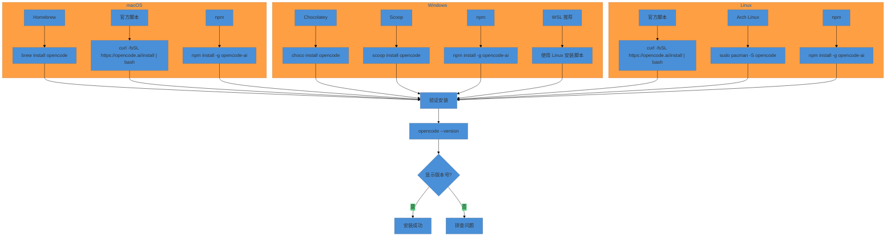

# 快速上手

> 预计 20-30 分钟完成 OpenCode 安装和第一个 AI 编程任务（假设已安装 Node.js 并拥有 API Key），感受工程化 AI 编程的基础操作。

> 如果你已完成《5 分钟快速体验》（第 0 章）的安装步骤，可以直接跳到[配置 Provider](opencode-config.md#provider-配置)部分。

本章是全书动手的起点。之前两章讨论了"为什么要工程化"和"核心概念是什么"，现在到了"怎么做到"的时候。快速上手的定位是让读者在约 20 分钟内完成 OpenCode 的安装、Provider 配置、项目初始化和第一个有意义的任务（首次使用需注册 API 账户，约 5 分钟）。

读完这篇文章后，你不会成为配置专家，但会理解 OpenCode 的基本操作循环：配置 Provider、启动 Session、执行任务、查看结果。更重要的是，你会理解 `/init` 命令为什么是项目的"出生证明"，以及安全权限控制为什么是 Harness Engineering 的第一道防线。

> **⏱ 时间有限？先读这些：** 安装 OpenCode → 配置 Provider → 第一个 Session → 安全配置

## 前置条件

在开始之前，你需要：

1. **Node.js >= 18**
    - npm 安装方式需要 Node.js 运行时
    - 使用 `node --version` 验证版本
    - 推荐使用 [nvm](https://github.com/nvm-sh/nvm) 管理 Node.js 版本

2. **现代终端模拟器**
    - 跨平台：WezTerm、Alacritty
    - macOS/Linux: Ghostty、Kitty、iTerm2
    - Windows：Windows Terminal、PowerShell

3. **至少一个 LLM Provider 的访问权限**
    - OpenCode Zen 账户（推荐新手，在 https://opencode.ai/auth 注册）
    - 或 Anthropic（API Key 以 `sk-ant-api03-` 开头） / OpenAI（API Key 以 `sk-proj-` 开头） / Google API Key
    - 或 GitHub Copilot 订阅

## 安装 OpenCode

OpenCode 支持多种安装方式，覆盖 macOS、Windows、Linux 三大平台。选择适合你系统的安装方法即可。

### 安装流程图



### macOS 安装

**方式一：Homebrew（推荐）**

```bash:terminal
brew install opencode
```

Homebrew 官方 formula 在 Homebrew 主仓库中维护，开箱即用。如需更新频率更快的官方 tap，可使用 `brew install anomalyco/tap/opencode`。

**方式二：官方安装脚本**

```bash:terminal
curl -fsSL https://opencode.ai/install | bash
```

**方式三：npm 全局安装**

```bash:terminal
npm install -g opencode-ai
```

> 中国大陆用户可通过 `npm config set registry https://registry.npmmirror.com` 加速 npm 安装（使用 `opencode-ai` 包）。

### Windows 安装

**推荐：使用 WSL**

为了获得最佳体验，建议在 Windows 上使用 WSL（Windows Subsystem for Linux）。WSL 提供更好的性能和完整的 OpenCode 功能兼容性。

```powershell:terminal
# 在 WSL 中使用官方安装脚本
curl -fsSL https://opencode.ai/install | bash
```

**方式一：Chocolatey**

```powershell:terminal
choco install opencode
```

**方式二：Scoop**

```powershell:terminal
scoop install opencode
```

**方式三：npm 全局安装**

```powershell:terminal
npm install -g opencode-ai
```

**方式四：mise**

```powershell:terminal
mise use -g opencode
```

### Linux 安装

**方式一：官方安装脚本（推荐）**

```bash:terminal
curl -fsSL https://opencode.ai/install | bash
```

**方式二：Arch Linux**

```bash:terminal
# 稳定版
sudo pacman -S opencode

# 最新版（从 AUR）
paru -S opencode-bin
```

**方式三：npm 全局安装**

```bash:terminal
npm install -g opencode-ai
```

**方式四：Docker**

```bash:terminal
docker run -it --rm ghcr.io/anomalyco/opencode
```

**方式五：mise**

```bash:terminal
mise use -g opencode
```

### 验证安装

安装完成后，运行以下命令验证：

```bash:terminal
opencode --version
```

如果显示版本号（v1.16.x 或更高版本），说明安装成功。

如果遇到 `command not found` 错误，请检查：

1. 安装路径是否在系统 PATH 中
2. 是否需要重启终端
3. 是否有权限执行该命令

### 常见安装问题

| 问题 | 原因 | 解决方案 |
|------|------|---------|
| `command not found` | PATH 未包含安装路径 | 重启终端或手动添加 PATH |
| `permission denied` | 执行权限不足 | 使用 `chmod +x` 或以管理员身份运行 |
| 版本过旧 | 包管理器缓存 | 使用官方脚本安装或更新包管理器 |
| 网络超时 | 网络连接问题 | 使用镜像源或代理 |

## 配置 Provider

OpenCode 支持 75+ 种 LLM Provider，你可以根据现有订阅或 API 访问权限选择最适合的方式。以下是三种最常见的配置方式。

### 方式一：OpenCode Zen（推荐新手）

OpenCode Zen 是由 OpenCode 团队提供的模型清单，这些模型已经过测试并验证可与 OpenCode 良好配合。这是最省心的选择，适合刚接触 AI 编程的用户。

**配置步骤：**

1. 在 OpenCode TUI 中运行 `/connect` 命令：

```bash:terminal
/connect
```

2. 在 Provider 列表中选择 **OpenCode Zen**

3. 浏览器会自动打开 [opencode.ai/auth](https://opencode.ai/auth)，完成登录并填写账单信息

4. 复制生成的 API Key

5. 回到终端，粘贴 API Key：

```text:terminal
┌ API key
│ sk-proj-xxxxx
│
└ enter
```

6. 运行 `/models` 查看可用模型列表：

```bash:terminal
/models
```

> 提示：如果浏览器未自动打开，请手动访问 https://opencode.ai/auth 完成认证。

**优势：**

- 无需分别注册多个 Provider
- 模型已经过 OpenCode 团队验证
- 统一计费，简化管理
- 支持多种高质量模型

### 方式二：自有 API Key

如果你已有 Anthropic、OpenAI 或 Google 的 API Key，可以直接配置使用。

> **⚠️ 重要提示**：Anthropic 禁止使用 Claude Pro/Max 订阅 OAuth 方式访问 OpenCode（Jan 2026）。请使用标准的 Anthropic API Key（按 token 计费）来配置。

**Anthropic Claude 配置：**

1. 运行 `/connect` 命令：

```bash:terminal
/connect
```

2. 选择 **Anthropic**

3. 输入你的 Anthropic API Key（以 `sk-ant-api03-` 开头）

4. 运行 `/models` 选择模型

**OpenAI GPT 配置：**

1. 运行 `/connect`：

```bash:terminal
/connect
```

2. 选择 **OpenAI**

3. 输入你的 OpenAI API Key（以 `sk-proj-` 开头）

**Google Gemini 配置：**

1. 运行 `/connect`：

```bash:terminal
/connect
```

2. 选择 **Google**

3. 输入你的 Google API Key

**环境变量配置（推荐）：**

你也可以通过环境变量配置 API Key，避免在配置文件中存储敏感信息：

```bash:terminal
# Anthropic
export ANTHROPIC_API_KEY="sk-ant-api03-xxxxx"

# OpenAI
export OPENAI_API_KEY="sk-proj-xxxxx"

# Google
export GOOGLE_API_KEY="xxxxx"
```

在项目级配置文件 `opencode.json` 中引用：

```json:opencode.json
{
  "$schema": "https://opencode.ai/config.json",
  "model": "anthropic/claude-sonnet-4-5",
  "provider": {
    "anthropic": {
      "options": {
        "apiKey": "{env:ANTHROPIC_API_KEY}"
      }
    }
  }
}
```

### 方式三：GitHub Copilot 登录

如果你已有 GitHub Copilot 订阅（Pro $10/月、Business $19/用户或 Enterprise $39/用户），可以在 OpenCode 中复用，无需额外购买 API。

> **注意**：自 2026 年 6 月起，GitHub Copilot 采用基于用量的 AI Credits 计费模式。Copilot Pro 每月包含 $15 的 AI Credits，超出部分需额外付费（约 $0.01/credit）。

**配置步骤：**

1. 验证你的 Copilot 订阅状态：

访问 [https://github.com/settings/copilot](https://github.com/settings/copilot)，确认状态为 Active。

2. 在 OpenCode 中运行 `/connect`：

```bash:terminal
/connect
```

3. 在 Provider 列表中搜索并选择 **GitHub Copilot**

4. OpenCode 会显示设备授权链接：

```text:terminal
Please visit: https://github.com/login/device
And enter code: XXXX-XXXX
```

5. 打开浏览器，访问 `https://github.com/login/device`

6. 输入屏幕上显示的设备码（如 `XXXX-XXXX`）

7. 点击 "Authorize" 授权 OpenCode

8. 授权成功后，OpenCode 显示：

```text:terminal
✓ Provider added successfully!
```

9. 运行 `/models` 查看 Copilot 提供的模型：

```bash:terminal
/models
```

**可用模型示例：**

| 模型 | 说明 |
|------|------|
| `gpt-5.3-codex` | 推荐，旗舰多模态模型 |
| `gpt-5.1` | 快速，低成本 |
| `claude-sonnet-4.6` | 平衡性能与成本 |
| `claude-opus-4.7` | 最强推理模型 |

> 注意：实际可用模型列表会随 GitHub Copilot 的更新而变化，请以 `/models` 命令输出为准。

**注意事项：**

- 部分高级模型（如 `gpt-5.3-codex`）可能需要 GitHub Copilot Pro+ 订阅
- 普通订阅可能只能访问部分模型
- 凭证存储在 `~/.local/share/opencode/auth.json`，请勿提交到 Git

### Provider 配置对比

| 方式 | 适合人群 | 优势 | 劣势 |
|------|---------|------|------|
| **OpenCode Zen** | 新手、想省心的用户 | 一站式、已验证模型、统一计费 | 需要注册 OpenCode 账户 |
| **自有 API Key** | 已有 API 访问权限的用户 | 灵活、直接控制、无中间层 | 需要管理多个 Key |
| **GitHub Copilot** | 已有 Copilot 订阅的用户 | 复用现有订阅、无需额外付费 | 模型选择受订阅等级限制 |

> 注意：下文使用层级化模型名称标识模型在能力/成本谱系中的位置，具体映射请参考 OpenCode 官方文档的模型支持列表。

## 第一个 Session

完成安装和 Provider 配置后，让我们开始第一个 OpenCode Session。

### 启动 OpenCode

进入你的项目目录并启动 OpenCode：

```bash:terminal
cd /path/to/your/project
opencode
```

首次启动时，OpenCode 会显示一个终端用户界面（TUI），底部是输入框，上方是对话区域。

### 初始化项目：/init

`/init` 命令是 OpenCode 理解你项目的关键步骤。它会分析项目结构并生成 `AGENTS.md` 文件——这是项目的"出生证明"。

在 OpenCode 输入框中输入：

```bash:terminal
/init
```

OpenCode 会：

1. 扫描项目目录结构
2. 识别技术栈（语言、框架、工具）
3. 分析代码模式和约定
4. 生成 `AGENTS.md` 文件

**AGENTS.md 示例：**

```markdown:AGENTS.md
# 项目名称

## 技术栈

- 语言：TypeScript
- 框架：React + Vite
- 测试：Vitest
- 包管理：pnpm

## 项目结构

- `src/components/` - React 组件
- `src/hooks/` - 自定义 Hooks
- `src/utils/` - 工具函数

## 常用命令

- `pnpm dev` - 启动开发服务器
- `pnpm build` - 构建生产版本
- `pnpm test` - 运行测试

## 编码规范

- 使用函数组件和 Hooks
- 组件命名使用 PascalCase
- 文件命名使用 kebab-case
```

**重要提示：** 应该将 `AGENTS.md` 提交到 Git。这帮助 OpenCode 理解项目结构和编码模式。

### Plan 模式：提问和分析

OpenCode 有两种主要模式：**Plan 模式** 和 **Build 模式**。

- **Plan 模式**：只读，适合提问、分析、规划
- **Build 模式**：可以修改文件、执行命令

按 `Tab` 键切换模式。右下角会显示当前模式。

**切换到 Plan 模式：**

```bash:terminal
<TAB>
```

现在，尝试问几个关于项目的问题：

```text:terminal
这个项目的认证流程是怎样的？
```

```text:terminal
@src/api/index.ts 这个文件的主要功能是什么？
```

**提示：** 使用 `@` 键可以模糊搜索项目文件，将其添加到上下文中。

### Build 模式：执行第一个改动

当你准备好让 OpenCode 修改代码时，切换到 Build 模式：

```bash:terminal
<TAB>
```

尝试一个简单的任务：

```text:terminal
在 README.md 中添加一个"快速开始"章节，说明如何安装和运行项目。
```

OpenCode 会：

1. 分析你的请求
2. 读取 README.md
3. 生成修改建议
4. 应用修改

### 撤销操作：/undo

如果修改不符合预期，可以使用 `/undo` 命令撤销：

```bash:terminal
/undo
```

OpenCode 会撤销最近的修改，并显示原始消息，让你可以调整提示词后重试。

**提示：** 可以多次运行 `/undo` 来撤销多个操作。

### 重做操作：/redo

如果你想恢复撤销的操作：

```bash:terminal
/redo
```

## 常用命令速查

以下是 OpenCode 最常用的命令：

| 命令 | 功能 | 使用场景 |
|------|------|---------|
| `/help` | 显示帮助信息 | 查看可用命令和快捷键 |
| `/connect` | 配置 Provider | 添加或切换 LLM Provider |
| `/init` | 初始化项目 | 生成 AGENTS.md |
| `/models` | 查看和选择模型 | 切换不同的 AI 模型 |
| `/undo` | 撤销最近操作 | 回滚不满意的修改 |
| `/redo` | 重做撤销的操作 | 恢复已撤销的修改 |
| `/share` | 分享对话 | 生成可分享的对话链接 |

**快捷键：**

| 快捷键 | 功能 |
|--------|------|
| `Tab` | 切换 Plan/Build 模式 |
| `@` | 搜索并引用文件 |
| `Ctrl+C` | 中断当前操作 |
| `Ctrl+D` | 退出 OpenCode |

## 安全配置

Harness Engineering 的第一条原则是**可控**。OpenCode 的权限系统让你精确控制 Agent 能做什么、不能做什么。

### 权限级别

每个权限规则可以设置为三种级别：

| 级别 | 说明 | 效果 |
|------|------|------|
| `allow` | 允许 | 直接执行，无需确认 |
| `ask` | 询问 | 显示确认对话框，用户决定 |
| `deny` | 拒绝 | 禁止执行，Agent 收到错误 |

### 推荐新用户的安全配置

对于新用户，我们强烈建议将 `edit` 和 `bash` 权限设为 `ask`，这样所有文件编辑和命令执行都需要你的确认。

在项目根目录创建 `opencode.json`：

```json:opencode.json
{
  "$schema": "https://opencode.ai/config.json",
  "permission": {
    "*": "ask",
    "edit": "ask",
    "bash": "ask"
  }
}
```

**配置解释：**

- `"*": "ask"` — 所有未明确配置的权限都需要确认
- `"edit": "ask"` — 所有文件编辑操作都需要确认
- `"bash": "ask"` — 所有 Bash 命令执行都需要确认

### 细粒度权限配置

你可以根据命令模式或文件路径设置更精细的权限：

```json:opencode.json
{
  "$schema": "https://opencode.ai/config.json",
  "permission": {
    "bash": {
      "*": "ask",
      "git status": "allow",
      "git log*": "allow",
      "git diff*": "allow",
      "npm install*": "allow",
      "npm run*": "allow",
      "rm -rf*": "deny"
    },
    "edit": {
      "*": "ask",
      "*.env": "deny",
      "*.env.*": "deny",
      "*.env.example": "allow"
    }
  }
}
```

**规则优先级：** 最后匹配的规则生效。建议将通配符 `*` 规则放在前面，更具体的规则放在后面。

### 排除文件：.ignore

OpenCode 默认使用 `.ignore` 文件（ripgrep 格式）来排除不需要跟踪的文件：

```text:terminal
# 环境变量
.env
.env.*
!.env.example

# 依赖目录
node_modules/
vendor/

# 构建产物
dist/
build/
out/

# 敏感配置
secrets/
credentials/
*.pem
*.key

# 数据库文件
*.db
*.sqlite
```

> **注意**：也可以通过 `opencode.json` 中的 `watcher.ignore` 配置来排除文件。


### 默认安全行为

OpenCode 默认对以下情况采用保守策略：

- `.env` 文件默认需要确认（`ask`）
- `doom_loop`（重复调用检测）默认需要确认
- `external_directory`（访问项目外目录）默认需要确认

### 权限确认对话框

当 Agent 尝试执行需要确认的操作时，你会看到：

```text:terminal
┌ Agent wants to edit file
│ File: src/components/Button.tsx
│ Action: Modify
│
│ [Once] [Always] [Reject]
└
```

选择：

- **Once**：仅允许本次操作
- **Always**：本次会话中允许所有类似操作
- **Reject**：拒绝操作

## 小结

恭喜你完成了 OpenCode 的快速上手！让我们回顾一下学到的内容：

1. **安装**：OpenCode 支持多平台安装，macOS 推荐 Homebrew，Windows 推荐 WSL，Linux 推荐官方脚本

2. **Provider 配置**：三种方式满足不同需求——OpenCode Zen 最省心、自有 API Key 最灵活、GitHub Copilot 可复用现有订阅

3. **第一个 Session**：`/init` 初始化项目生成 AGENTS.md，`Tab` 切换 Plan/Build 模式，`/undo` 撤销操作

4. **安全配置**：权限系统让你精确控制 Agent 的能力，新用户建议将 `edit` 和 `bash` 设为 `ask`

### 核心概念回顾

- **AGENTS.md 是项目的"出生证明"**：第一次 `/init` 建立项目知识库，告诉 Agent 项目是什么、用什么技术、怎么运行

- **Provider 自由度意味着什么**：不锁定任何模型提供商，可以根据场景/成本灵活切换

- **安全先行**：Harness Engineering 的第一条原则是可控，权限控制是最基础的可控手段

### 下一步

- → [OpenCode 配置详解](opencode-config.md) — 深入了解配置文件结构和高级选项
- → [oh-my-openagent 集成](oh-my-openagent-setup.md) — 扩展 OpenCode 的能力
- ← [核心概念](../02-core-concepts/) — 回顾 Agent、Skill、Workflow 基础
