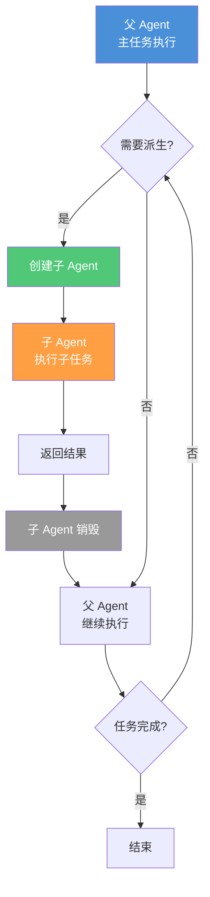
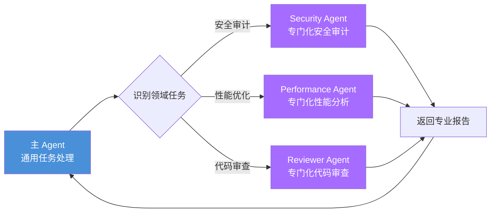
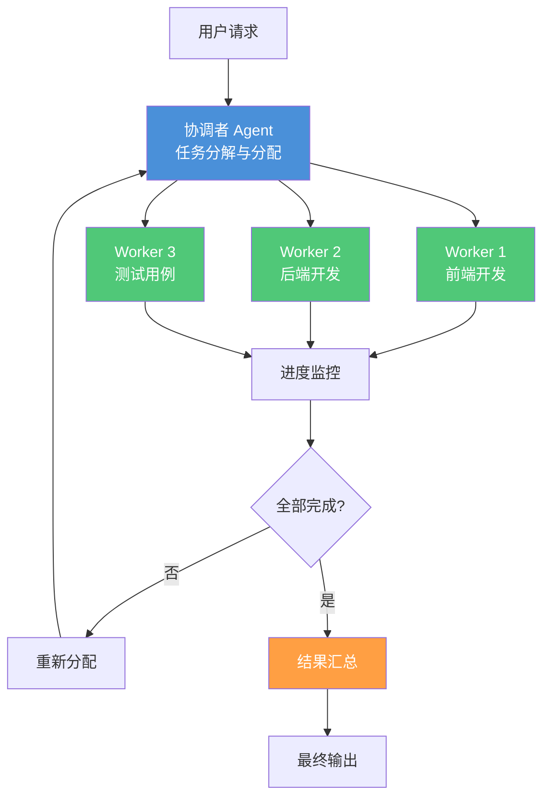
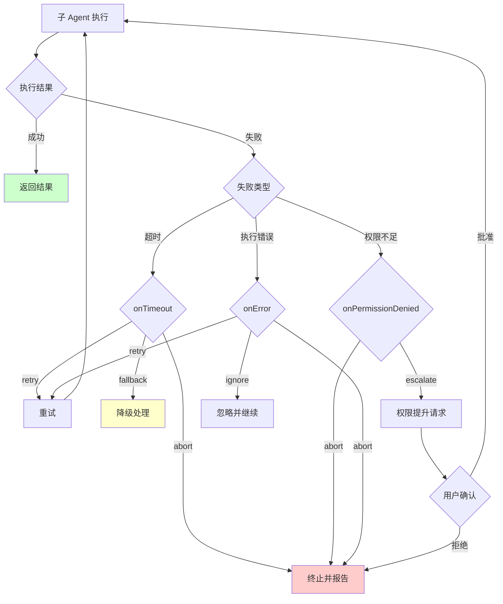
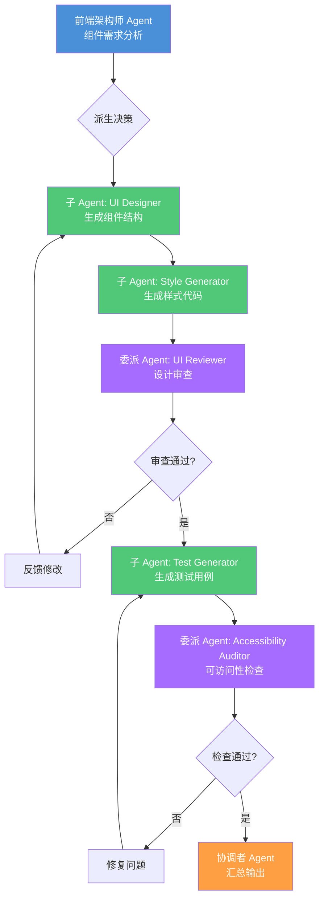

# Agent 派生模式

> 父 Agent 动态生成子 Agent 处理子任务——子 Agent、委派、协调者三种派生模式的设计原理和工程实践。

## 文章概述

Agent 派生是扩展单一 Agent 能力边界的关键机制。当一个 Agent 面对超出自身能力范围的任务时，它可以派生子 Agent 来分担工作。派生不是替代，而是能力延伸——子 Agent 继承父 Agent 的上下文和权限，专注于完成特定的子任务。

读完本文，你将能够理解子 Agent、委派、协调者三种派生模式的设计原理，掌握 `task()` API 的派生实现机制，以及在安全边界内有效利用派生能力扩展 Agent 的能力范围。

本文介绍三种 Agent 派生模式：子 Agent 模式（父 Agent 创建子 Agent 执行独立的子任务）、委派模式（将特定领域任务委托给专门化的 Agent 处理）和协调者模式（一个协调者 Agent 分配和汇总多个 Agent 的输出）。我们深入分析 `task()` API 的派生实现机制——`category` 参数如何选择派生目标、`load_skills` 如何传递技能上下文、结果如何合并。

从前端架构师视角，我们将探讨如何利用派生模式实现组件生成、UI 审查、响应式适配的工作流；从渗透测试员视角，我们将深入分析派生模式的安全边界——权限继承风险、上下文泄露防护、递归攻击防御。

---

## Agent 派生的概念

### 为什么需要派生

单一 Agent 的能力存在边界，这源于三个核心限制：

1. **认知负载限制**：一个 Agent 同时处理的上下文越多，决策质量越低。当任务涉及多个领域（前端 UI、后端 API、数据库设计、安全审计）时，单一 Agent 难以在所有领域都保持高质量输出。

2. **权限隔离需求**：某些任务需要最小权限原则。例如，代码审查 Agent 不应该有修改代码的权限，安全审计 Agent 不应该访问生产环境凭证。

3. **专业化分工**：不同任务需要不同的 Skill 组合。前端组件生成需要 `ui-designer` 和 `frontend-architect`，安全审计需要 `penetration-tester` 和 `vulnerability-manager`。

派生机制让父 Agent 能够"分身"——创建专注于特定子任务的子 Agent，每个子 Agent 拥有独立的上下文窗口、权限边界和 Skill 配置。

### 派生 vs 协作

派生和协作都是多 Agent 工作模式，但本质不同：

| 维度 | 派生（Derivation） | 协作（Collaboration） |
|------|-------------------|----------------------|
| **关系结构** | 纵向（父子关系） | 横向（平级关系） |
| **生命周期** | 子 Agent 随任务创建和销毁 | Agent 独立存在，长期运行 |
| **权限来源** | 子 Agent 从父 Agent 继承 | 各 Agent 独立配置 |
| **上下文共享** | 父 → 子单向传递 | 双向或多方共享 |
| **控制方式** | 父 Agent 控制子 Agent | 协调者或协议协调 |

**配合方式**：派生是协作的基础。一个协调者 Agent 可以派生多个工作 Agent，形成"协调者 → 工作者"的协作结构。在 7-Agent Pipeline 中，Primary Agent 可以派生 Reviewer Agent 和 Tester Agent，实现角色分离。

---

## 三种派生模式

### 子 Agent 模式

子 Agent 模式是最基础的派生形式：父 Agent 创建子 Agent 执行独立子任务，子任务完成后子 Agent 销毁，结果返回给父 Agent。



**核心特征**：

- **临时性**：子 Agent 生命周期绑定到子任务
- **继承性**：子 Agent 继承父 Agent 的部分上下文和权限
- **隔离性**：子 Agent 的执行不影响父 Agent 的状态

**典型场景**：

前端架构师在实现一个复杂组件时，可以派生子 Agent 处理不同关注点：

```json
{
  "parentAgent": "frontend-lead",
  "childAgents": [
    {
      "task": "生成组件基础结构",
      "skill": "frontend-architect",
      "permissions": ["read", "edit"]
    },
    {
      "task": "生成样式代码",
      "skill": "ui-designer",
      "permissions": ["read", "edit"]
    },
    {
      "task": "生成测试用例",
      "skill": "qa-engineer",
      "permissions": ["read", "bash"]
    }
  ]
}
```

### 委派模式

委派模式将特定领域任务委托给专门训练过的 Agent 处理。与子 Agent 模式的区别在于：委派的 Agent 是预定义的专门化 Agent，而非临时创建。



**核心特征**：

- **专业化**：委派 Agent 针对特定领域优化
- **预定义**：委派 Agent 在配置中预先定义
- **独立权限**：委派 Agent 有独立的权限配置

**委派 Agent 配置示例**：

```json
{
  "delegatedAgents": {
    "security-auditor": {
      "model": "best-capability-model",
      "skills": ["penetration-tester", "vulnerability-manager", "blue-team-defender"],
      "permissions": {
        "read": "allow",
        "edit": "deny",
        "bash": "ask"
      },
      "context": {
        "inherit": false,
        "fresh": true
      },
      "output": {
        "format": "security-report",
        "include": ["findings", "severity", "recommendations"]
      }
    },
    "performance-analyst": {
      "model": "balanced-model",
      "skills": ["backend-architect"],
      "permissions": {
        "read": "allow",
        "edit": "deny",
        "bash": "allow"
      },
      "tools": ["profiler", "benchmark"]
    }
  }
}
```

**前端场景委派示例**：

前端架构师在组件开发完成后，委派给专门的审查 Agent：

| 委派目标 | 触发条件 | Skill | 输出 |
|---------|---------|-------|------|
| UI 审查 Agent | 组件代码变更 | `steve-jobs-perspective` | 设计改进建议 |
| 可访问性 Agent | UI 审查通过 | `ui-designer` | WCAG 合规报告 |
| 性能分析 Agent | 可访问性通过 | `backend-architect` | 性能优化建议 |

### 协调者模式

协调者模式引入一个专门的协调者 Agent，负责分配任务、监控进度、汇总结果。协调者不直接执行任务，而是管理多个工作 Agent。



**核心特征**：

- **分离关注点**：协调者专注管理，Worker 专注执行
- **动态分配**：根据执行情况实时调整任务分配
- **容错机制**：Worker 失败可重新分配

**协调者配置示例**：

```json
{
  "orchestrator": {
    "name": "development-coordinator",
    "model": "best-capability-model",
    "skills": ["dispatching-parallel-agents", "overall-planning"],
    "permissions": {
      "read": "allow",
      "edit": "deny",
      "bash": "deny",
      "delegate": "allow"
    },
    "workers": {
      "frontend": {
        "agent": "frontend-worker",
        "maxInstances": 3,
        "skills": ["frontend-architect", "ui-designer"]
      },
      "backend": {
        "agent": "backend-worker",
        "maxInstances": 2,
        "skills": ["backend-architect"]
      },
      "testing": {
        "agent": "test-worker",
        "maxInstances": 2,
        "skills": ["qa-engineer", "test-driven-development"]
      }
    },
    "strategy": {
      "taskSplit": "auto",
      "retryCount": 2,
      "timeout": 300000,
      "mergeStrategy": "consolidate"
    }
  }
}
```

### 三种派生模式对比

| 特征 | 子 Agent 模式 | 委派模式 | 协调者模式 |
|------|-------------|---------|-----------|
| **创建方式** | 动态创建 | 预定义调用 | 预定义协调 |
| **生命周期** | 任务绑定 | 独立存在 | 独立存在 |
| **上下文继承** | 完整继承 | 部分继承 | 不继承 |
| **权限配置** | 从父 Agent 继承 | 独立定义 | 独立定义 |
| **适用场景** | 简单子任务 | 专业领域任务 | 复杂多任务协调 |
| **复杂度** | 低 | 中 | 高 |
| **灵活性** | 高 | 中 | 低 |
| **安全风险** | 高（权限过大） | 中（上下文泄露） | 低（隔离良好） |

---

## task() API 的派生实现

`task()` 是 OpenCode 提供的子 Agent 调用 API，它实现了三种派生模式的统一接口。

### task() 参数体系概述

`task()` API 的核心参数与完整说明已在[多 Agent 协作](multi-agent-collab.md)的"task() 参数体系"一节中详细展开。以下仅列出与派生模式直接相关的关键参数，完整参数说明请参见上文。

| 参数 | 类型 | 必填 | 说明 |
|------|------|------|------|
| `category` | string | 是 | 派生类型：`subagent`（子 Agent）、`delegate`（委派）、`orchestrator`（协调者） |
| `load_skills` | string[] | 否 | 子 Agent 加载的 Skill 列表，不继承父 Agent 已加载的 Skill。如果指定的 Skill 不存在，Agent 会静默跳过该 Skill 并继续执行 |
| `prompt` | string | 是 | 子 Agent 的任务指令 |
| `context` | object | 否 | 上下文继承配置：`inherit` 指定继承的权限，`isolate` 指定隔离的权限 |
| `timeout` | number | 否 | 超时时间（毫秒），默认 300000 |
| `onFailure` | string | 否 | 失败策略：`report`、`retry`、`abort` |

### category 选择决策

`category` 参数决定派生模式，三种取值对应三种派生方式：

| 场景 | 推荐 category | 原因 |
|------|--------------|------|
| 简单子任务（代码格式化、文件搜索） | `subagent` | 快速创建，自动销毁 |
| 专业领域任务（安全审计、性能分析） | `delegate` | 专业化 Agent，独立权限 |
| 复杂多任务（全栈开发、多模块重构） | `orchestrator` | 动态分配，容错机制 |

### load_skills 传递技能上下文

`load_skills` 参数向子 Agent 传递 Skill 上下文：

```json
{
  "task": {
    "category": "delegate",
    "load_skills": [
      "penetration-tester",
      "vulnerability-manager",
      "incident-responder"
    ],
    "prompt": "对 /api/auth 路由进行渗透测试，生成漏洞报告",
    "context": {
      "inherit": ["read"],
      "isolate": ["edit", "bash", "write"]
    }
  }
}
```

**Skill 传递规则**：

1. **显式传递**：只有 `load_skills` 中列出的 Skill 会传递给子 Agent
2. **不继承父 Skill**：子 Agent 默认不继承父 Agent 已加载的 Skill
3. **Skill 依赖**：如果 Skill 有依赖，依赖的 Skill 也会自动加载

### 结果合并策略

子 Agent 执行完成后，父 Agent 需要合并结果：

```javascript
const mergeStrategies = {
  append: (results) => results.map(r => r.output).join('\n---\n'),
  
  consolidate: (results) => {
    const merged = {}
    for (const result of results) {
      for (const [key, value] of Object.entries(result.output)) {
        if (merged[key]) {
          merged[key] = deepMerge(merged[key], value)
        } else {
          merged[key] = value
        }
      }
    }
    return merged
  },
  
  vote: (results) => {
    const votes = {}
    for (const result of results) {
      const key = JSON.stringify(result.output.decision)
      votes[key] = (votes[key] || 0) + 1
    }
    return JSON.parse(Object.entries(votes)
      .sort((a, b) => b[1] - a[1])[0][0])
  },
  
  best: (results, criteria) => {
    return results.reduce((best, current) => {
      const bestScore = evaluateScore(best, criteria)
      const currentScore = evaluateScore(current, criteria)
      return currentScore > bestScore ? current : best
    })
  }
}
```

**策略选择指南**：

| 策略 | 适用场景 | 示例 |
|------|---------|------|
| `append` | 独立输出拼接 | 多文件审查报告 |
| `consolidate` | 结构化数据合并 | 多 Agent 修改同一文件 |
| `vote` | 决策类任务 | 架构方案选择 |
| `best` | 质量优先任务 | 代码优化建议 |

---

## Agent 派生安全边界

从渗透测试员视角，派生模式引入了新的攻击面。理解这些安全边界对于构建安全的 AI 编程系统至关重要。

### 三种派生模式的安全边界

| 派生模式 | 上下文继承 | 权限继承 | 安全风险 | 缓解措施 |
|---------|-----------|---------|---------|---------|
| **子 Agent** | 完整继承 | 完整继承 | 高（权限过大） | 限制 `allowed-tools` |
| **委派 Agent** | 部分继承 | 独立定义 | 中（上下文泄露） | 敏感信息过滤 |
| **协调者 Agent** | 不继承 | 独立定义 | 低（隔离良好） | 无需额外措施 |

### 权限继承风险

子 Agent 默认继承父 Agent 的权限，这可能导致权限提升攻击：

**攻击场景**：

```
父 Agent（权限：read + edit）
  └─ 子 Agent（继承全部权限）
       └─ 恶意 prompt 注入
            └─ 子 Agent 执行未授权的 edit 操作
```

**防护配置**：

```json
{
  "parentAgent": "reviewer",
  "childTask": {
    "category": "subagent",
    "load_skills": ["vulnerability-manager"],
    "context": {
      "inherit": ["read", "search"],
      "isolate": ["edit", "bash", "write", "delegate"]
    },
    "permissionOverrides": {
      "edit": "deny",
      "bash": "deny",
      "write": "deny"
    }
  }
}
```

### 上下文泄露防护

委派模式中，父 Agent 的上下文部分传递给委派 Agent。如果上下文包含敏感信息（API Key、数据库凭证），可能导致泄露。

**防护措施**：

```json
{
  "delegation": {
    "contextFilter": {
      "excludePatterns": [
        "*.key",
        "*.pem",
        ".env*",
        "*secret*",
        "*password*",
        "*token*"
      ],
      "redactPatterns": [
        "sk-[a-zA-Z0-9]{48}",
        "xox[baprs]-[a-zA-Z0-9-]+",
        "eyJ[a-zA-Z0-9_-]*\\.eyJ[a-zA-Z0-9_-]*\\.[a-zA-Z0-9_-]*"
      ]
    },
    "logSensitiveAccess": true,
    "auditTrail": true
  }
}
```

### 递归派生攻击防御

攻击者可能利用递归派生消耗系统资源：

**攻击场景**：

```
Agent A
  └─ 派生 Agent B
       └─ 派生 Agent C
            └─ 派生 Agent D
                 └─ ...（无限递归）
```

**防护配置**：

```json
{
  "derivationLimits": {
    "maxDepth": 3,
    "maxChildren": 10,
    "maxTotalAgents": 50,
    "timeout": 60000,
    "memoryLimit": "512MB"
  },
  "enforcement": {
    "strict": true,
    "onViolation": "abort",
    "logViolation": true
  }
}
```

### 安全配置示例

```json
{
  "agents": {
    "child-agent": {
      "mode": "subagent",
      "allowedTools": ["read", "search"],
      "permissions": [
        { "permission": "edit", "pattern": "*", "action": "deny" },
        { "permission": "bash", "pattern": "*", "action": "deny" },
        { "permission": "delegate", "pattern": "*", "action": "deny" }
      ],
      "contextFilter": {
        "excludePatterns": ["*.env", "*.key", "config/prod.*"],
        "redactPatterns": ["sk-.*", "password=.*"]
      },
      "limits": {
        "maxTokens": 100000,
        "timeout": 300000
      }
    }
  }
}
```

---

## 《马书》Agent 派生框架对比

《驾驭工程：从 Claude Code 源码到 AI 编码最佳实践》（简称《马书》）第 20 章详细分析了 Claude Code 的 Agent 派生体系。以下是《马书》框架与 OpenCode 实现的对比。

### 派生模式映射

| 《马书》模式 | OpenCode 对应 | 差异说明 |
|-------------|--------------|---------|
| Task Agent | `category: "subagent"` | 基本一致 |
| Delegate Agent | `category: "delegate"` | OpenCode 支持更细粒度的权限控制 |
| Orchestrator | `category: "orchestrator"` | OpenCode 的 Team Mode 提供更强的协调能力 |

### 上下文继承深度对比

| 特征 | 《马书》框架 | OpenCode |
|------|------------|----------|
| 继承层级 | 单层（父 → 子） | 多层（可配置） |
| 选择性继承 | 不支持 | 支持（`context.inherit`） |
| 敏感信息过滤 | 无 | 支持（`contextFilter`） |
| 继承深度限制 | 固定 3 层 | 可配置（`maxDepth`） |

### 权限颗粒度对比

| 特征 | 《马书》框架 | OpenCode |
|------|------------|----------|
| 权限类型 | read/write/execute | read/edit/bash/write/delegate |
| 权限继承 | 全继承或全不继承 | 选择性继承 |
| 权限覆盖 | 不支持 | 支持（`permissionOverrides`） |
| 动态权限调整 | 不支持 | 支持（运行时调整） |

### 可借鉴的设计思想

1. **最小权限原则**：《马书》强调子 Agent 应该以最小权限运行，OpenCode 通过 `context.isolate` 实现了这一原则。

2. **上下文隔离**：《马书》建议敏感操作使用独立上下文，OpenCode 的委派模式支持 `context.inherit: false`。

3. **错误传播策略**：《马书》定义了三种错误处理策略（abort/retry/fallback），OpenCode 通过 `onFailure` 参数实现。

---

## 派生模式的工程实践

### 派生深度限制

避免递归失控的关键是设置合理的深度限制：

```json
{
  "derivationLimits": {
    "maxDepth": 3,
    "depthBehavior": {
      "level1": { "maxChildren": 10, "timeout": 300000 },
      "level2": { "maxChildren": 5, "timeout": 180000 },
      "level3": { "maxChildren": 2, "timeout": 60000 }
    }
  }
}
```

**深度选择原则**：

| 深度 | 适用场景 | 风险等级 |
|------|---------|---------|
| 1 层 | 简单任务分解 | 低 |
| 2 层 | 中等复杂度任务 | 中 |
| 3 层 | 复杂多阶段任务 | 高 |
| >3 层 | 不推荐 | 极高 |

### 派生 Agent 的权限隔离

权限隔离遵循三个原则：

1. **最小权限**：子 Agent 只拥有完成任务所需的最小权限
2. **职责分离**：审查类 Agent 不应有 edit 权限，测试类 Agent 不应有 write 权限
3. **敏感操作审批**：涉及敏感文件或关键操作需要 `ask` 确认

**权限隔离矩阵**：

| Agent 类型 | read | edit | bash | write | delegate |
|-----------|------|------|------|-------|----------|
| 审查 Agent | ✓ | ✗ | ✗ | ✗ | ✗ |
| 测试 Agent | ✓ | ✗ | ✓ | ✗ | ✗ |
| 实现 Agent | ✓ | ✓ | ask | ✗ | ✗ |
| 协调 Agent | ✓ | ✗ | ✗ | ✗ | ✓ |

### 错误传播和处理

子 Agent 失败时，父 Agent 需要决定如何处理：



**错误处理配置**：

```json
{
  "errorHandling": {
    "onTimeout": "retry",
    "maxRetries": 2,
    "retryDelay": 5000,
    "onPermissionDenied": "escalate",
    "onError": "abort",
    "fallbackAgent": "simple-agent",
    "logLevel": "verbose",
    "notifyOnFailure": true
  }
}
```

### 派生 Agent 的生命周期管理

```json
{
  "lifecycle": {
    "creation": {
      "validateSkills": true,
      "validatePermissions": true,
      "warmUpCache": true
    },
    "execution": {
      "heartbeat": 30000,
      "progressReport": 60000,
      "resourceMonitor": true
    },
    "termination": {
      "gracefulShutdown": true,
      "timeout": 10000,
      "cleanupResources": true,
      "persistState": true
    }
  }
}
```

---

## 前端场景派生实践

前端开发场景中，派生模式可以显著提升组件开发效率和质量。

### 组件开发派生流程



### 前端派生配置示例

```json
{
  "frontendComponentPipeline": {
    "parent": {
      "agent": "frontend-architect",
      "skills": ["frontend-architect", "ui-designer"]
    },
    "derivation": {
      "ui-designer": {
        "category": "subagent",
        "skills": ["ui-designer"],
        "permissions": { "edit": "allow" },
        "output": "components/"
      },
      "style-generator": {
        "category": "subagent",
        "skills": ["frontend-architect"],
        "permissions": { "edit": "allow" },
        "output": "styles/"
      },
      "ui-reviewer": {
        "category": "delegate",
        "skills": ["steve-jobs-perspective"],
        "permissions": { "edit": "deny" },
        "criteria": [
          "视觉层次清晰",
          "交互反馈及时",
          "设计系统一致"
        ]
      },
      "accessibility-auditor": {
        "category": "delegate",
        "skills": ["ui-designer"],
        "permissions": { "edit": "deny", "bash": "allow" },
        "tools": ["axe-core", "lighthouse"],
        "standards": ["WCAG2.1-AA"]
      }
    },
    "flow": [
      { "agent": "ui-designer", "parallel": false },
      { "agent": "style-generator", "parallel": true },
      { "agent": "ui-reviewer", "parallel": false },
      { "agent": "accessibility-auditor", "parallel": false }
    ]
  }
}
```

---

## 小结

Agent 派生是扩展单一 Agent 能力边界的关键机制。通过子 Agent 模式、委派模式和协调者模式，我们可以将复杂任务分解为多个专注的子任务，每个子 Agent 拥有独立的上下文窗口、权限边界和 Skill 配置。

`task()` API 是派生实现的核心接口，通过 `category` 参数选择派生模式，`load_skills` 传递技能上下文，`context` 控制权限继承。结果合并策略（append/consolidate/vote/best）确保多 Agent 输出的有效整合。

安全边界是派生模式的关键考量。权限继承风险需要通过 `context.isolate` 缓解，上下文泄露需要通过 `contextFilter` 防护，递归派生攻击需要通过 `maxDepth` 限制。从前端架构师视角，派生模式可以实现组件开发、UI 审查、可访问性检查的工作流；从渗透测试员视角，理解这些安全边界对于构建安全的 AI 编程系统至关重要。

---

## 学习检查清单

完成本章学习后，请确认你能够：

- [ ] 解释三种 Agent 派生模式的区别和适用场景
- [ ] 使用 `task()` API 创建和管理子 Agent
- [ ] 配置 `category`、`load_skills`、`context` 参数
- [ ] 选择合适的结果合并策略
- [ ] 理解派生模式的安全边界和防护措施
- [ ] 配置派生深度限制和权限隔离
- [ ] 为前端场景设计派生工作流

---

## 关联章节

- ← [多 Agent 协作](multi-agent-collab.md) — 派生是多 Agent 协作的一种形式
- → [Teams 多进程协作](teams-collaboration.md) — Teams 是更高级的派生模式
- → [自定义 Agent 与 Plugin](../06-advanced/custom-agents.md) — 自定义 Agent 中的派生实现
