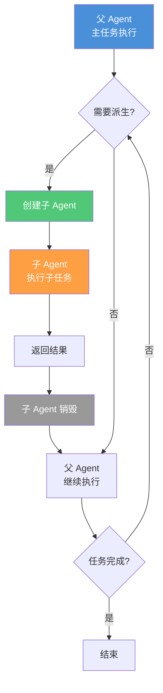
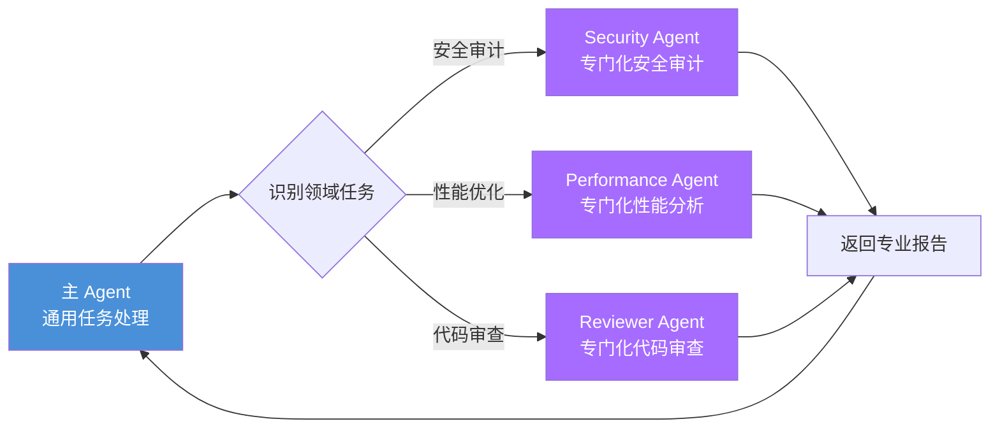
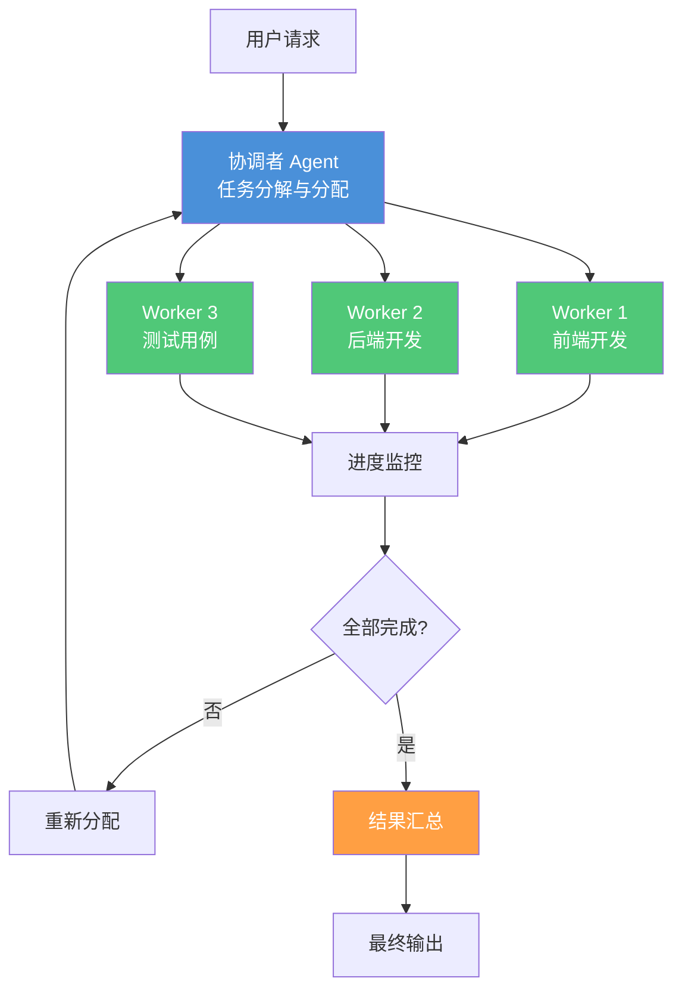
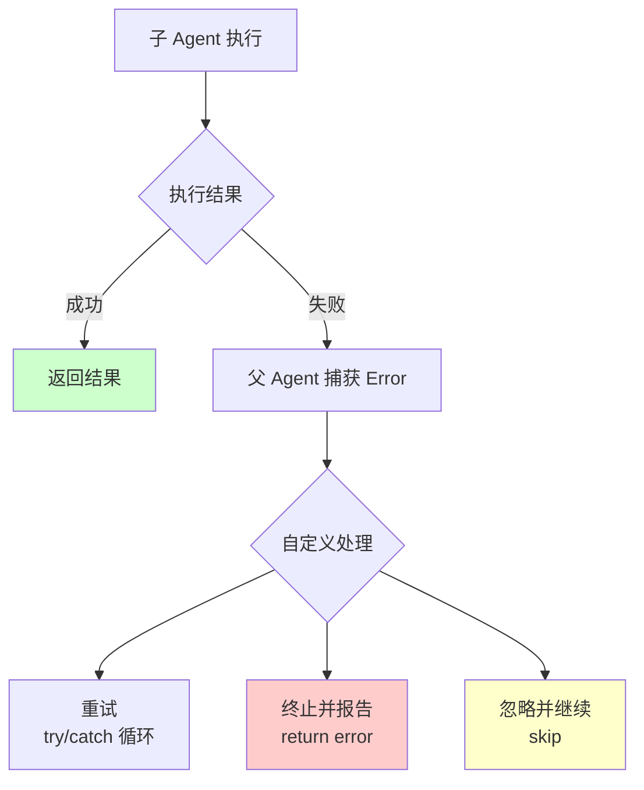
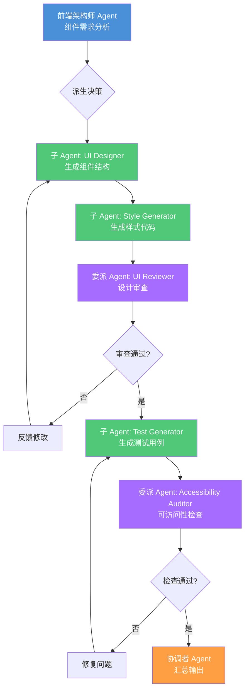

# Agent 派生模式

> 父 Agent 动态生成子 Agent 处理子任务——子 Agent、委派、协调者三种派生模式的设计原理和工程实践。

## 文章概述

Agent 派生是扩展单一 Agent 能力边界的关键机制。当一个 Agent 面对超出自身能力范围的任务时，它可以派生子 Agent 来分担工作。派生不是替代，而是能力延伸——子 Agent 接收父 Agent 通过 prompt 传递的上下文，以受限的权限专注于完成特定的子任务。

读完本文，你将能够理解子 Agent、委派、协调者三种派生模式的设计原理，掌握 `task()` API 和 `delegate_task()` 的派生实现机制，以及在安全边界内有效利用派生能力扩展 Agent 的能力范围。

本文介绍三种 Agent 派生模式：子 Agent 模式（父 Agent 创建子 Agent 执行独立的子任务）、委派模式（将特定领域任务委托给专门化的 Agent 处理）和协调者模式（一个协调者 Agent 分配和汇总多个 Agent 的输出）。我们深入分析 `task()` 和 `delegate_task()` 的派生实现机制——`subagent_type` 如何选择 Agent 类型、`load_skills` 如何传递技能上下文、结果如何合并。

从前端架构师视角，我们将探讨如何利用派生模式实现组件生成、UI 审查、响应式适配的工作流；从渗透测试员视角，我们将深入分析派生模式的安全边界——权限继承风险、上下文泄露防护、递归攻击防御。

> **⏱ 时间有限？先读这些：** Agent 派生的概念 → 三种派生模式 → task() API 的派生实现 → Agent 派生安全边界

---

## Agent 派生的概念

### 为什么需要派生

单一 Agent 的能力存在边界，这源于三个核心限制：

1. **认知负载限制**：一个 Agent 同时处理的上下文越多，决策质量越低。当任务涉及多个领域（前端 UI、后端 API、数据库设计、安全审计）时，单一 Agent 难以在所有领域都保持高质量输出。

2. **权限隔离需求**：某些任务需要最小权限原则。例如，代码审查 Agent 不应该有修改代码的权限，安全审计 Agent 不应该访问生产环境凭证。

3. **专业化分工**：不同任务需要不同的 Skill 组合。前端组件生成需要 `ui-designer` 和 `frontend-architect`，安全审计需要 `penetration-tester` 和 `vulnerability-manager`。

派生机制让父 Agent 能够"分身"——创建专注于特定子任务的子 Agent，每个子 Agent 拥有独立的上下文窗口、权限边界和 Skill 配置。

### 派生 vs 协作

派生和协作都是多 Agent 工作模式，但本质不同：

| 维度 | 派生（Derivation） | 协作（Collaboration） |
|------|-------------------|----------------------|
| **关系结构** | 纵向（父子关系） | 横向（平级关系） |
| **生命周期** | 子 Agent 随任务创建和销毁 | Agent 独立存在，长期运行 |
| **权限来源** | 子 Agent 权限比父 Agent 更受限 | 各 Agent 独立配置 |
| **上下文共享** | 父 → 子单向传递 | 双向或多方共享 |
| **控制方式** | 父 Agent 控制子 Agent | 协调者或协议协调 |

**配合方式**：派生是协作的基础。一个协调者 Agent 可以派生多个工作 Agent，形成"协调者 → 工作者"的协作结构。在 7-Agent Pipeline 中，Primary Agent 可以派生 Reviewer Agent 和 Tester Agent，实现角色分离。

---

## 三种派生模式

> **概念框架说明**：以下三种模式为概念分类，辅助理解 Agent 之间的协作关系。实际实现中均通过 `task()`（OpenCode 核心）或 `delegate_task()`（oh-my-openagent 插件）完成，并非独立的 API 参数取值。具体的 API 调用方式见下一节。

### 子 Agent 模式

子 Agent 模式是最基础的派生形式：父 Agent 创建子 Agent 执行独立子任务，子任务完成后子 Agent 销毁，结果返回给父 Agent。



**核心特征**：

- **临时性**：子 Agent 生命周期绑定到子任务
- **上下文传递**：父 Agent 通过 prompt 向子 Agent 传递上下文
- **隔离性**：子 Agent 的执行不影响父 Agent 的状态

**典型场景**：

前端架构师在实现一个复杂组件时，可以派生子 Agent 处理不同关注点：

```json:terminal
{
  "parentAgent": "frontend-lead",
  "childAgents": [
    {
      "task": "生成组件基础结构",
      "skill": "frontend-architect",
      "permissions": ["read", "edit"]
    },
    {
      "task": "生成样式代码",
      "skill": "ui-designer",
      "permissions": ["read", "edit"]
    },
    {
      "task": "生成测试用例",
      "skill": "qa-engineer",
      "permissions": ["read", "bash"]
    }
  ]
}
```

### 委派模式

委派模式将特定领域任务委托给专门训练过的 Agent 处理。与子 Agent 模式的区别在于：委派的 Agent 是预定义的专门化 Agent，而非临时创建。



**核心特征**：

- **专业化**：委派 Agent 针对特定领域优化
- **预定义**：委派 Agent 在配置中预先定义
- **独立权限**：委派 Agent 有独立的权限配置

**委派 Agent 配置示例**：

```json:.opencode/agents/delegated-agents.json
{
  "delegatedAgents": {
    "security-auditor": {
      "model": "best-capability-model",
      "skills": ["penetration-tester", "vulnerability-manager", "blue-team-defender"],
      "permissions": {
        "read": "allow",
        "edit": "deny",
        "bash": "ask"
      },
      "context": {
        "inherit": false,
        "fresh": true
      },
      "output": {
        "format": "security-report",
        "include": ["findings", "severity", "recommendations"]
      }
    },
    "performance-analyst": {
      "model": "balanced-model",
      "skills": ["backend-architect"],
      "permissions": {
        "read": "allow",
        "edit": "deny",
        "bash": "allow"
      },
      "tools": ["profiler", "benchmark"]
    }
  }
}
```

**前端场景委派示例**：

前端架构师在组件开发完成后，委派给专门的审查 Agent：

| 委派目标 | 触发条件 | Skill | 输出 |
|---------|---------|-------|------|
| UI 审查 Agent | 组件代码变更 | `steve-jobs-perspective` | 设计改进建议 |
| 可访问性 Agent | UI 审查通过 | `ui-designer` | WCAG 合规报告 |
| 性能分析 Agent | 可访问性通过 | `backend-architect` | 性能优化建议 |

### 协调者模式

协调者模式引入一个专门的协调者 Agent，负责分配任务、监控进度、汇总结果。协调者不直接执行任务，而是管理多个工作 Agent。



**核心特征**：

- **分离关注点**：协调者专注管理，Worker 专注执行
- **动态分配**：根据执行情况实时调整任务分配
- **容错机制**：Worker 失败可重新分配

**协调者配置示例**：

```json:.opencode/workflows/development-coordinator.json
{
  "orchestrator": {
    "name": "development-coordinator",
    "model": "best-capability-model",
    "skills": ["dispatching-parallel-agents", "overall-planning"],
    "permissions": {
      "read": "allow",
      "edit": "deny",
      "bash": "deny",
      "task": "allow"       // 允许协调者派生 Worker
    },
    "workers": {
      "frontend": {
        "agent": "frontend-worker",
        "maxInstances": 3,
        "skills": ["frontend-architect", "ui-designer"]
      },
      "backend": {
        "agent": "backend-worker",
        "maxInstances": 2,
        "skills": ["backend-architect"]
      },
      "testing": {
        "agent": "test-worker",
        "maxInstances": 2,
        "skills": ["qa-engineer", "test-driven-development"]
      }
    },
    "strategy": {
      "taskSplit": "auto",
      "retryCount": 2,
      "timeout": 300000,
      "mergeStrategy": "consolidate"
    }
  }
}
```

### 三种派生模式对比

| 特征 | 子 Agent 模式 | 委派模式 | 协调者模式 |
|------|-------------|---------|-----------|
| **创建方式** | 动态创建 | 预定义调用 | 预定义协调 |
| **生命周期** | 任务绑定 | 独立存在 | 独立存在 |
| **上下文传递** | prompt 传递 | prompt 传递 | 协调者持有摘要 |
| **权限配置** | 子 Agent 更受限 | 子 Agent 更受限 | 各 Worker 独立 |
| **适用场景** | 简单子任务 | 专业领域任务 | 复杂多任务协调 |
| **复杂度** | 低 | 中 | 高 |
| **灵活性** | 高 | 中 | 低 |
| **安全风险** | 中（需防 prompt 注入） | 中（上下文泄露） | 低（隔离良好） |

---

## task() API 的派生实现

`task()` 是 OpenCode **核心内置函数**，用于创建子 Agent 执行子任务。同一模式下，**oh-my-openagent（OMO）插件** 提供了 `delegate_task()` 扩展，增加了委托编排能力。本节分别说明两种 API 的用法，并在概念层面映射到三种派生模式。

### OpenCode 核心 task() 函数

`task()` 是 OpenCode 最基础的子 Agent 调用接口，其参数体系如下：

| 参数 | 类型 | 必填 | 说明 |
|------|------|------|------|
| `description` | string | 是 | 子 Agent 的角色描述 |
| `prompt` | string | 是 | 子 Agent 的任务指令 |
| `subagent_type` | string | 是 | 指定 Agent 类型（如 `explore`、`librarian`、`orchestrator` 等） |
| `session_id` | string | 否 | 继承已有对话的上下文 |
| `command` | string | 否 | 直接执行的命令 |

**典型用法**：

```javascript:terminal
// 派生子 Agent 执行探索任务
const result = task(
  description: "分析代码安全漏洞",
  prompt: "对 src/auth/ 目录进行安全审计，找出潜在的 SQL 注入和 XSS 漏洞",
  subagent_type: "explore"
)

// 输出格式：{ title, metadata, output }
// 执行成功返回结果，失败则抛出 Error / Effect.fail()
```

`task()` 的三种派生模式（子 Agent、委派、协调者）并非通过 `category` 参数区分，而是通过 `description` + `subagent_type` + `prompt` 的组合来体现。具体来说：

| 概念模式 | 实现方式 | 说明 |
|---------|---------|------|
| **子 Agent** | `task(description, prompt)` | 创建临时子 Agent 执行独立子任务，任务完成即销毁 |
| **委派** | `task(subagent_type: "explore"/"librarian", ...)` | 使用预定义类型 Agent 处理专业领域任务 |
| **协调者** | 结合 `subagent_type: "orchestrator"` + 多路 `task()` 调用 | 一个协调 Agent 分发多个子任务并汇总结果 |

> `subagent_type` 是一个**调度分类标签**，并非"子 Agent / 委派 / 协调者"这三种概念模式的直接对应。概念模式是理解思路的工具，实际调用通过参数组合体现。

#### task() 权限行为

派生出的子 Agent **不继承**父 Agent 的权限。实际行为：
- **v1.14.46 之前**：子 Agent 以 **RESTRICTED** 权限启动，默认禁用 `todowrite`、`todoread`、`task` 等敏感操作
- **v1.14.46 之后**：`deriveSubagentSessionPermission()` 会将父 Agent 的所有 deny 规则**追加**到子 Agent 中，可能导致子 Agent 权限**比父 Agent 更严格**
- **建议显式指定权限**：不要在子 Agent 中开启 `tools: { task: true }`，否则可能引发无限递归

### oh-my-openagent delegate_task() 扩展

OMO 的 `delegate_task()` 是对 `task()` 的扩展封装，提供了更高层次的委托编排能力：

| 参数 | 类型 | 必填 | 说明 |
|------|------|------|------|
| `description` | string | 是 | 子 Agent 的角色描述 |
| `prompt` | string | 是 | 子 Agent 的任务指令 |
| `category` | string | 否 | 任务分类标签，用于统计/过滤（**非**派生模式选择） |
| `load_skills` | string[] | 否 | 子 Agent 加载的 Skill 列表，不继承父 Agent 已加载的 Skill |
| `run_in_background` | boolean | 否 | 是否后台异步执行，默认 `false` |
| `session_id` | string | 否 | 继承已有对话的上下文 |

**典型用法**：

```javascript:terminal
// 在后台派发安全审计任务
delegate_task(
  description: "安全审计 Agent",
  prompt: "对 /api/auth 路由进行渗透测试，生成漏洞报告",
  category: "security",
  load_skills: ["penetration-tester", "vulnerability-manager"],
  run_in_background: true
)
```

> `delegate_task()` 是 OMO 插件提供的能力，并非 OpenCode 核心 API。使用前需确认项目中已集成 oh-my-openagent。

### load_skills 传递技能上下文

`load_skills` 参数（仅 `delegate_task()` 支持）向子 Agent 传递 Skill 上下文：

**Skill 传递规则**：

1. **显式传递**：只有 `load_skills` 中列出的 Skill 会传递给子 Agent
2. **不继承父 Skill**：子 Agent 默认不继承父 Agent 已加载的 Skill
3. **Skill 依赖**：如果 Skill 有依赖，依赖的 Skill 也会自动加载

### 结果合并策略（概念模式）

子 Agent 执行完成后，父 Agent 需要合并多个子任务的结果。以下是一组实用的合并模式（**并非 API 内置参数**，而是工程实践中常用的数据处理方式）：

```javascript:terminal
// 实用合并模式合集（非 API 参数，可自行实现）
const mergeStrategies = {
  append: (results) => results.map(r => r.output).join('\n---\n'),
  
  consolidate: (results) => {
    const merged = {}
    for (const result of results) {
      for (const [key, value] of Object.entries(result.output)) {
        if (merged[key]) {
          merged[key] = deepMerge(merged[key], value)
        } else {
          merged[key] = value
        }
      }
    }
    return merged
  },
  
  vote: (results) => {
    const votes = {}
    for (const result of results) {
      const key = JSON.stringify(result.output.decision)
      votes[key] = (votes[key] || 0) + 1
    }
    return JSON.parse(Object.entries(votes)
      .sort((a, b) => b[1] - a[1])[0][0])
  },
  
  best: (results, criteria) => {
    return results.reduce((best, current) => {
      const bestScore = evaluateScore(best, criteria)
      const currentScore = evaluateScore(current, criteria)
      return currentScore > bestScore ? current : best
    })
  }
}
```

**策略选择指南**：

| 策略 | 适用场景 | 示例 |
|------|---------|------|
| `append` | 独立输出拼接 | 多文件审查报告 |
| `consolidate` | 结构化数据合并 | 多 Agent 修改同一文件 |
| `vote` | 决策类任务 | 架构方案选择 |
| `best` | 质量优先任务 | 代码优化建议 |

---

## Agent 派生安全边界

从渗透测试员视角，派生模式引入了新的攻击面。理解这些安全边界对于构建安全的 AI 编程系统至关重要。

### 三种派生模式的安全边界

> **注意**：下表中的风险等级是**概念层面的定性指导**，并非由 API 参数直接控制。OpenCode 的 `task()` 机制对三种概念模式使用同一套权限规则，差异体现在使用方式上，而非 API 层面。

| 派生模式 | 上下文继承 | 权限继承 | 安全风险（概念） | 缓解措施 |
|---------|-----------|---------|----------------|---------|
| **子 Agent** | 父 Agent 通过 prompt 传递上下文 | 子 Agent 权限**更受限** | 中（需注意 prompt 注入） | 不在 prompt 中携带敏感信息 |
| **委派 Agent** | 父 Agent 通过 prompt 传递上下文 | 子 Agent 权限**更受限** | 中（上下文泄露） | 敏感信息过滤 |
| **协调者 Agent** | 协调者持有汇总上下文，不传递给 Worker | 各 Worker 独立 | 低（隔离良好） | 无需额外措施 |

### 权限继承风险

子 Agent **不继承**父 Agent 的权限。实际情况恰恰相反：

- **v1.14.46 之前**：派生出的子 Agent 默认以 **RESTRICTED** 权限启动，`todowrite`、`todoread`、`task` 等敏感功能默认禁用
- **v1.14.46 之后**：`deriveSubagentSessionPermission()` 将父 Agent 的**所有 deny 规则追加**到子 Agent，子 Agent 的权限约束**比父 Agent 更严格**

因此权限提升攻击的威胁模型需要重新评估——攻击者更可能通过 **prompt 注入** 让子 Agent 执行超出预期的操作（在其有限权限范围内），而非继承到父 Agent 的高权限。

**攻击场景**（修正版）：

```text:terminal
父 Agent（权限：read + edit）
  └─ 子 Agent（权限受限：只有 read，无 edit）
       └─ 恶意 prompt 注入
            └─ 子 Agent 尝试执行 edit → 被权限系统拒绝
```

**防护建议**：

```json:opencode.json
{
  "tools": {
    "task": false   // 禁止子 Agent 再派生新 Agent，防止递归
  }
}
```

### 上下文泄露防护

委派模式中，父 Agent 的上下文部分传递给委派 Agent。如果上下文包含敏感信息（API Key、数据库凭证），可能导致泄露。

**防护措施**（需在 prompt 层面自行实现）：

> OpenCode 和 OMO **不提供内置的上下文过滤器配置**（不存在 `delegation.contextFilter`、`contextFilter.excludePatterns` 等配置项）。上下文过滤需通过以下实践实现：

1. **不在 prompt 中传递敏感信息**：只传递子任务需要的上下文
2. **使用环境变量管理密钥**：不要将凭证硬编码在 prompt 中
3. **最小化上下文**：只传递具体的文件路径和关键信息，不要传递完整的环境变量列表
4. **对子 Agent 输出进行安全审查**：检查子 Agent 的输出是否无意中泄露了敏感信息

### 递归派生攻击防御

攻击者可能利用递归派生消耗系统资源：

**攻击场景**：

```text:terminal
Agent A
  └─ 派生 Agent B
       └─ 派生 Agent C
            └─ 派生 Agent D
                 └─ ...（无限递归）
```

**真实案例**：OpenCode issue [#18100](https://github.com/anomalyco/opencode/issues/18100) 记录了一次真实事故——由于子 Agent 配置了 `tools: { task: true }`，一个任务在 73 分钟内递归派生出 **612 层嵌套会话**，几乎耗尽系统资源。

**OpenCode 的实际防护机制**：

OpenCode 不提供 `maxDepth`、`maxChildren`、`memoryLimit` 等虚构配置项。实际防护依赖以下真实机制：

| 机制 | 说明 | 默认值 |
|------|------|--------|
| `level_limit` | 限制子 Agent 的最大递归深度 | 5 层 |
| `task_budget` | 每个 Session 可创建的子任务总数上限 | 由 OMO 配置决定 |
| `steps` | 单次任务的最大执行步数，作为电路断路器 | 通常 50-100 |
| 禁用 `task` 权限 | 子 Agent 配置 `tools: { task: false }`，禁止再派生 | 推荐开启 |

**推荐防护配置**：

```json:opencode.json
{
  // 在 Agent 定义中限制递归深度
  "level_limit": 5,
  "task_budget": 20,
  
  // 关键：禁止子 Agent 再次派生
  "tools": {
    "task": false
  }
}
```

> 最有效的防御是**不要在子 Agent 中启用 `task` 工具**。如果子 Agent 无法调用 `task()`，递归链自然终止。

### 安全配置建议

OpenCode 不提供 `mode`、`allowedTools`、`permissions`（复数）、`contextFilter` 等配置项。以下是实现最小权限原则的正确方式：

**在父 Agent 中控制权限**：

```javascript:terminal
// 父 Agent 通过 task() 控制子 Agent 的权限范围
// 子 Agent 默认以 RESTRICTED 权限运行，无需额外配置
const result = task(
  description: "只读审查 Agent",
  prompt: "审查代码变更，不要修改任何文件。只输出审查报告。",
  subagent_type: "oracle"  // oracle 是内置只读 Agent 类型
)

// 如需更严格的限制，在父 Agent 的权限配置中追加 deny 规则
// OpenCode v1.14.46+ 的 deriveSubagentSessionPermission() 会自动
// 将父 Agent 的 deny 规则追加到子 Agent
```

**关键的安全实践**：

1. **子 Agent 默认权限受限**：无需额外配置，子 Agent 权限本身就比父 Agent 更严格
2. **使用内置 Agent 类型**：`oracle`（只读审查）、`explore`（探索）等内置类型已有合理的默认权限
3. **禁用 `task` 工具**：在父 Agent 的权限设置中添加 `"tools": { "task": false }` 防止递归派生
4. **不要手动提升子 Agent 权限**：让子 Agent 保持受限状态是最安全的做法

---

## 派生模式的设计原则总结

基于派生模式的工程实践，可以总结出以下关键设计原则：

### 最小权限原则

子 Agent 应该以最小权限运行。OpenCode 的默认行为（子 Agent 权限比父 Agent 更受限）与此原则一致。创建子 Agent 时应当只授予完成任务所需的权限，不要主动扩展子 Agent 的权限范围。

### 上下文隔离

敏感操作应使用独立上下文。实践中通过控制 prompt 内容和禁用子 Agent 的 `task` 权限来隔离。如果子 Agent 不需要知道敏感信息（如 API Key、数据库凭证），就不要在 prompt 中传递这些信息。

### 错误处理策略

`task()` API 的错误模型相对简单——执行成功返回结果，失败则抛出 `Error`。父 Agent 需要自行实现以下错误处理模式：

| 策略 | 实现方式 | 适用场景 |
|------|---------|---------|
| **重试（retry）** | try/catch 循环 | 临时性故障 |
| **终止（abort）** | 直接抛出错误 | 不可恢复的错误 |
| **降级（fallback）** | 返回默认值或简化结果 | 非关键路径 |

---

## 派生模式的工程实践

### 派生深度限制

避免递归失控的关键是设置合理的深度限制。OpenCode 通过 `level_limit` 参数控制派生深度：

```json:opencode.json
{
  "level_limit": 5,    // 最大递归深度，默认 5
  "task_budget": 20,   // 每 Session 最大子任务数
  "tools": {
    "task": false      // 禁止子 Agent 再派生（最有效的防御）
  }
}
```

**深度选择原则**：

| 深度 | 适用场景 | 风险等级 |
|------|---------|---------|
| 1 层 | 简单任务分解 | 低 |
| 2 层 | 中等复杂度任务 | 中 |
| 3-5 层 | 复杂多阶段任务 | 中高 |
| >5 层（超过默认 `level_limit`） | 需显式配置 | 极高 |

> 超过 `level_limit` 上限的派生请求会被系统自动拒绝，无需额外配置。

### 派生 Agent 的权限隔离

权限隔离遵循三个原则：

1. **最小权限**：子 Agent 只拥有完成任务所需的最小权限
2. **职责分离**：审查类 Agent 不应有 edit 权限，测试类 Agent 不应有 write 权限
3. **敏感操作审批**：涉及敏感文件或关键操作需要 `ask` 确认

**权限隔离矩阵**：

| Agent 类型 | read | edit | bash | write | task |
|-----------|------|------|------|-------|------|
| 审查 Agent | ✓ | ✗ | ✗ | ✗ | ✗ |
| 测试 Agent | ✓ | ✗ | ✓ | ✗ | ✗ |
| 实现 Agent | ✓ | ✓ | ask | ✗ | ✗ |
| 协调 Agent | ✓ | ✗ | ✗ | ✗ | ✓ |

### 错误传播和处理

`task()` API 的错误模型相对简单——它**没有内置的 `onTimeout`、`retry`、`fallback`、`escalate` 等错误处理配置**。实际的行为如下：

- **执行成功**：返回 `{ title, metadata, output }`
- **执行失败**：抛出 `Error` 或 `Effect.fail()`，父 Agent 看到错误消息

父 Agent 必须使用代码逻辑自行处理子 Agent 的错误：

```javascript:terminal
// OpenCode core: try/catch 处理子 Agent 错误
try {
  const result = task(
    description: "安全审计 Agent",
    prompt: "对 src/auth/ 进行扫描",
    subagent_type: "explore"
  )
  // 处理成功结果
  return result.output
} catch (error) {
  // 处理失败：重试、跳过、或告警
  console.error("子 Agent 执行失败:", error.message)
  // 重试逻辑需自行实现
  if (retryCount < 2) {
    return retryTask()
  }
  return { error: error.message, fallback: true }
}
```

```javascript:terminal
// OMO delegate_task() 同样无内置错误处理配置
const bgTaskId = delegate_task(
  description: "后台审计",
  prompt: "执行安全扫描",
  category: "security",
  run_in_background: true
)
// 通过 background_output() 获取结果，自行处理超时/失败
```

**概念上的错误处理策略**（需自行实现）：



> 没有配置化的错误处理管道并不意味着无法实现复杂策略——只是需要在父 Agent 的代码中自行实现 try/catch、重试循环和降级逻辑。

### 派生 Agent 的生命周期管理（概念模式）

> OpenCode 和 OMO **均无内置的生命周期配置参数**。以下模式是工程实践中的概念描述，并非 API 支持的配置项。

派生 Agent 的典型生命周期分为三个阶段：

1. **创建阶段**：`task()` 或 `delegate_task()` 调用时，系统自动初始化子 Agent
2. **执行阶段**：子 Agent 运行任务，完成后自动销毁
3. **结束阶段**：结果返回给父 Agent，子 Session 释放

在实践中，生命周期管理主要通过以下方式控制：

- 使用 `task_budget` 限制并发的子任务数量
- 使用 `level_limit` 控制派生深度
- 父 Agent 通过 `background_output()` 异步获取后台任务结果
- 超时的任务由父 Agent 的代码逻辑处理

---

## 前端场景派生实践

前端开发场景中，派生模式可以显著提升组件开发效率和质量。

### 组件开发派生流程



### 前端派生配置示例（概念设计）

> 以下配置是**概念化的工作流描述**，并非任何 API 的直接输入格式。实际实现中，每个派生动作对应一次 `task()` 或 `delegate_task()` 调用。

```json:.opencode/workflows/frontend-derivation-pipeline.json
{
  "frontendComponentPipeline": {
    "parent": {
      "agent": "frontend-architect",
      "skills": ["frontend-architect", "ui-designer"]
    },
    "derivation": {
      "ui-designer": {
        "mode": "subagent",
        "skills": ["ui-designer"],
        "permissions": { "edit": "allow" },
        "output": "components/"
      },
      "style-generator": {
        "mode": "subagent",
        "skills": ["frontend-architect"],
        "permissions": { "edit": "allow" },
        "output": "styles/"
      },
      "ui-reviewer": {
        "mode": "delegate",
        "skills": ["steve-jobs-perspective"],
        "permissions": { "edit": "deny" },
        "criteria": [
          "视觉层次清晰",
          "交互反馈及时",
          "设计系统一致"
        ]
      },
      "accessibility-auditor": {
        "mode": "delegate",
        "skills": ["ui-designer"],
        "permissions": { "edit": "deny", "bash": "allow" },
        "tools": ["axe-core", "lighthouse"],
        "standards": ["WCAG2.1-AA"]
      }
    },
    "flow": [
      { "agent": "ui-designer", "parallel": false },
      { "agent": "style-generator", "parallel": true },
      { "agent": "ui-reviewer", "parallel": false },
      { "agent": "accessibility-auditor", "parallel": false }
    ]
  }
}
```

---

## 小结

Agent 派生是扩展单一 Agent 能力边界的关键机制。通过子 Agent 模式、委派模式和协调者模式，我们可以将复杂任务分解为多个专注的子任务，每个子 Agent 拥有独立的上下文窗口、权限边界和 Skill 配置。

`task()` API 是 OpenCode 核心的派生实现接口，通过 `description`、`prompt`、`subagent_type` 参数组合实现三种派生模式；OMO 的 `delegate_task()` 扩展增加了 `load_skills` 技能传递和 `run_in_background` 后台执行能力。结果合并策略（append/consolidate/vote/best）是工程实践中常用的数据处理模式。

安全边界是派生模式的关键考量。子 Agent 默认以**更受限的权限**运行（而非继承父权限），递归派生攻击需要通过 `level_limit` 和 `task_budget` 限制，并禁用子 Agent 的 `task` 工具来彻底阻断递归。从前端架构师视角，派生模式可以实现组件开发、UI 审查、可访问性检查的工作流；从渗透测试员视角，理解这些安全边界对于构建安全的 AI 编程系统至关重要。

---

## 学习检查清单

完成本章学习后，请确认你能够：

- [ ] 解释三种 Agent 派生模式的区别和适用场景
- [ ] 使用 `task()` API 创建和管理子 Agent
- [ ] 使用 `delegate_task()`（OMO）传递技能和后台执行
- [ ] 选择合适的结果合并策略
- [ ] 理解派生模式的安全边界和防护措施
- [ ] 掌握 `level_limit`、`task_budget` 等深度限制配置
- [ ] 为前端场景设计派生工作流

---

## 关联章节

- ← [多 Agent 协作](multi-agent-collab.md) — 派生是多 Agent 协作的一种形式
- → [Teams 并行 Agent 协作](teams-collaboration.md) — Teams 是更高级的派生模式
- → [自定义 Agent 与 Plugin](../06-advanced/custom-agents.md) — 自定义 Agent 中的派生实现
