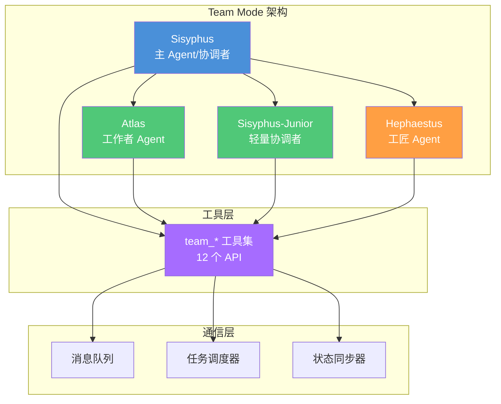
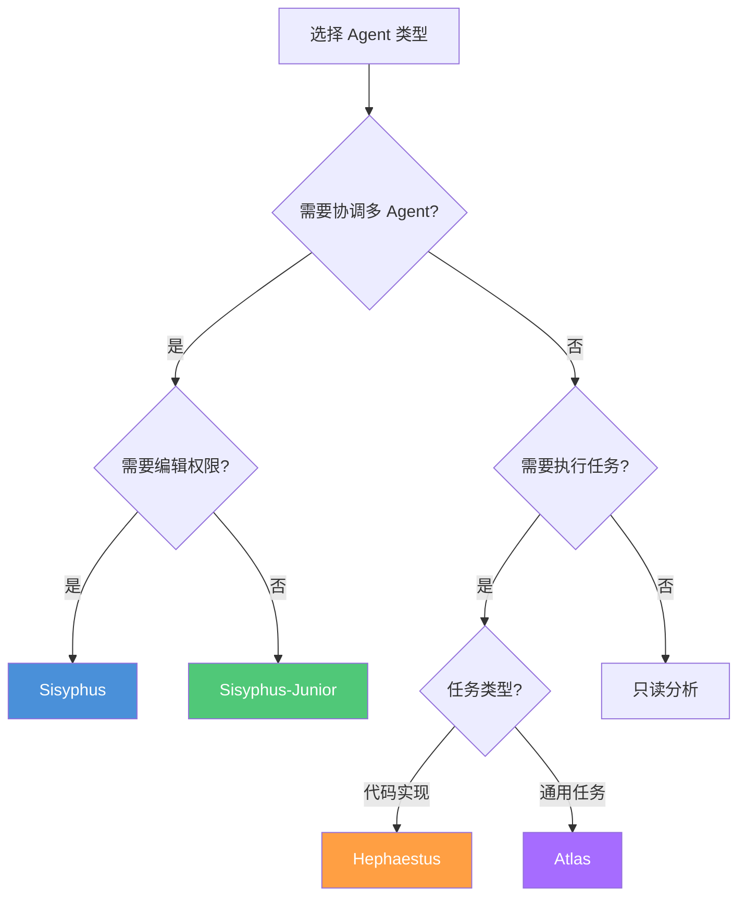
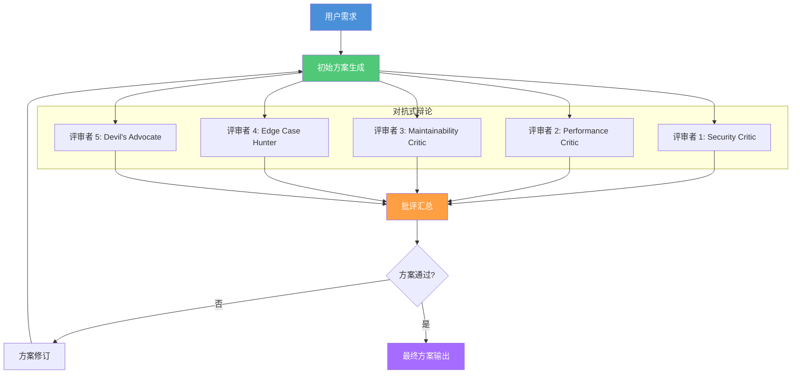
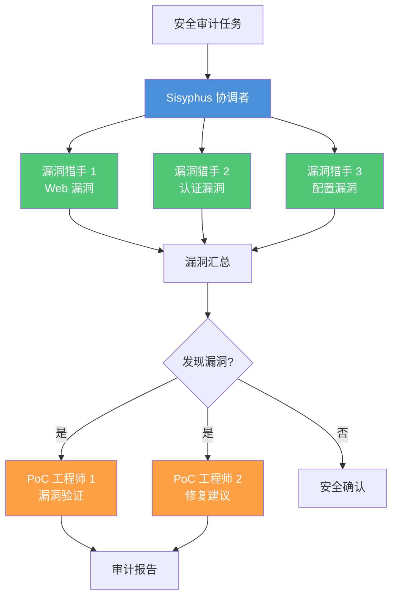
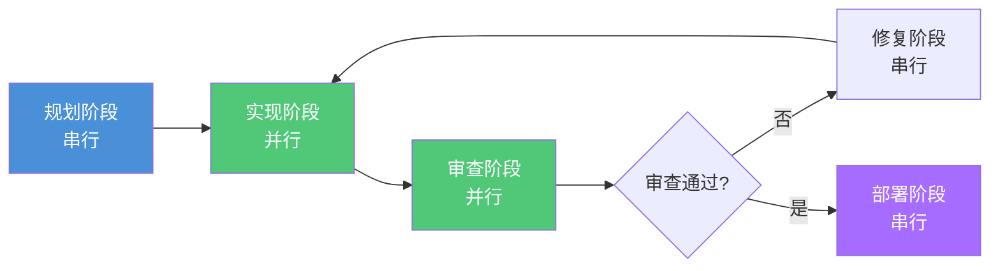

# 自定义工作流

> 使用 Team Mode 和 12 个 team_* 工具构建自定义多 Agent 工作流，以及 Hyperplan 对抗式规划模式的设计哲学。

## 文章概述

当内置工作流不能满足你的需求时，oh-my-openagent 的 Team Mode（v4.0+）提供了完整的自定义能力。你可以创建自己的多 Agent 团队，定义它们的角色、通信方式和任务分配策略。本文是 Team Mode 的完整指南。

我们从 Team Mode 的架构概览开始，介绍可用的 Agent 类型（sisyphus / atlas / sisyphus-junior / hephaestus）和启用配置。然后逐一讲解 12 个 `team_*` 工具——从团队创建、成员管理到任务调度和通信的全套 API。接着深入两个内置 Team Skills：Hyperplan（5 个"敌对"评审者交叉批评的对抗式规划）和 security-research（5 人安全团队并行审计），理解它们的设计哲学。最后，你将学会设计自定义工作流的四个步骤（拆解→映射→配置→验证），并看到常见工作流模板和完整的实战示例。

---

## Team Mode 概览

Team Mode 是 oh-my-openagent（OMO）v4.0 引入的核心创新，它将单 Agent 系统升级为多 Agent 并行协作系统。作为安全架构师，我认为 Team Mode 的价值不仅在于提升效率，更在于实现"职责分离"这一核心安全原则。

### 架构设计

Team Mode 采用"协调者-工作者"（Orchestrator-Workers）架构，由一个主 Agent（Sisyphus）协调多个子 Agent 并行执行任务。



**架构安全特性**：

| 特性 | 安全价值 | 实现方式 |
|------|---------|---------|
| **职责分离** | 防止单点权限过大 | 不同 Agent 有不同权限集 |
| **通信隔离** | 防止消息篡改 | 消息队列带签名验证 |
| **任务边界** | 防止越权操作 | 每个 Agent 只能访问分配的任务 |
| **状态审计** | 可追溯、可恢复 | 所有状态变更记录到日志 |

### 启用配置

Team Mode 需要在 `opencode.json` 中显式启用：

```json
{
  "team_mode": {
    "enabled": true,
    "max_teams": 5,
    "max_members_per_team": 10,
    "default_agent": "sisyphus",
    "communication": {
      "message_timeout": 30000,
      "task_timeout": 300000,
      "retry_count": 3
    },
    "security": {
      "isolate_workdir": true,
      "audit_all_messages": true,
      "deny_nested_teams": true
    }
  }
}
```

**安全配置说明**：

| 配置项 | 说明 | 安全建议 |
|-------|------|---------|
| `isolate_workdir` | 每个 Agent 独立工作目录 | 生产环境必须启用 |
| `audit_all_messages` | 记录所有 Agent 间消息 | 合规场景必须启用 |
| `deny_nested_teams` | 禁止团队嵌套 | 防止资源失控，必须启用 |
| `max_teams` | 最大团队数量 | 限制资源消耗 |
| `max_members_per_team` | 单团队最大成员数 | 防止团队过大难以管理 |

### 可用 Agent 类型

Team Mode 提供四种 Agent 类型，每种有不同的职责和权限边界：

#### Sisyphus（主 Agent/协调者）

**职责**：团队协调者，负责任务分配、进度监控和结果汇总。

**权限矩阵**：

| 权限 | 状态 | 说明 |
|------|------|------|
| edit | allow | 可编辑文件 |
| bash | ask | 执行命令需确认 |
| read | allow | 可读取文件 |
| team_* | allow | 可调用所有团队工具 |
| delegate-task | deny | **禁止委派任务** |

**安全考量**：Sisyphus 作为协调者，拥有较高权限但不允许委派任务，防止权限链式传递。

#### Atlas（工作者 Agent）

**职责**：执行具体任务的工作者，由 Sisyphus 分配任务。

**权限矩阵**：

| 权限 | 状态 | 说明 |
|------|------|------|
| edit | ask | 编辑文件需确认 |
| bash | ask | 执行命令需确认 |
| read | allow | 可读取文件 |
| team_* | limited | 仅 team_send_message |
| delegate-task | deny | **禁止委派任务** |

**安全考量**：Atlas 权限受限，只能执行分配的任务，且只能发送消息不能管理团队。

#### Sisyphus-Junior（轻量协调者）

**职责**：轻量级协调者，用于子任务组的协调。

**权限矩阵**：

| 权限 | 状态 | 说明 |
|------|------|------|
| edit | deny | 禁止编辑文件 |
| bash | deny | 禁止执行命令 |
| read | allow | 可读取文件 |
| team_* | limited | 部分团队工具 |
| delegate-task | deny | **禁止委派任务** |

**安全考量**：Sisyphus-Junior 是"只读协调者"，适合纯规划/审查场景。

#### Hephaestus（工匠 Agent）

**职责**：专注于代码实现的工匠，拥有完整的开发权限。

**权限矩阵**：

| 权限 | 状态 | 说明 |
|------|------|------|
| edit | allow | 可编辑文件 |
| bash | allow | 可执行命令 |
| read | allow | 可读取文件 |
| team_* | limited | 仅 team_send_message |
| delegate-task | deny | **禁止委派任务** |

**安全考量**：Hephaestus 权限最高，适合受信任的实现任务，但必须在隔离环境中运行。

### Agent 类型选择决策



---

## 12 个 team_* 工具

Team Mode 提供 12 个 `team_*` 工具，覆盖团队管理、成员管理、通信和任务管理的全生命周期。

### 工具分类总览

| 类别 | 工具 | 功能 | 权限要求 |
|------|------|------|---------|
| **团队管理** | `team_create` | 创建新团队 | Sisyphus |
| | `team_delete` | 删除团队 | Sisyphus |
| **成员管理** | `team_add_member` | 添加成员 | Sisyphus |
| | `team_remove_member` | 移除成员 | Sisyphus |
| | `team_list_members` | 列出成员 | 所有 Agent |
| **通信** | `team_send_message` | 发送消息 | 所有 Agent |
| **任务管理** | `team_task_create` | 创建任务 | Sisyphus |
| | `team_task_list` | 列出任务 | 所有 Agent |
| | `team_task_update` | 更新任务 | Sisyphus |
| | `team_task_get` | 获取任务详情 | 所有 Agent |
| **状态** | `team_status` | 查询团队状态 | 所有 Agent |
| | `team_list` | 列出所有团队 | Sisyphus |

### 团队管理工具

#### team_create

创建一个新的 Agent 团队。

**参数**：

```json
{
  "team_create": {
    "name": "security-audit-team",
    "description": "安全审计团队，负责代码安全审查",
    "agent_type": "sisyphus",
    "max_members": 5,
    "permissions": {
      "inherit_from_creator": false,
      "allowed_paths": ["src/", "tests/"],
      "denied_paths": ["config/secrets/", ".env"]
    }
  }
}
```

**安全最佳实践**：

1. **显式定义权限边界**：不要继承创建者权限，避免权限泄露
2. **限制可访问路径**：使用 `allowed_paths` 和 `denied_paths` 控制访问范围
3. **设置合理的成员上限**：防止团队无限扩张

**返回值**：

```json
{
  "team_id": "team-20260602-001",
  "status": "created",
  "created_at": "2026-06-02T14:30:00Z"
}
```

#### team_delete

删除一个团队及其所有成员。

**参数**：

```json
{
  "team_delete": {
    "team_id": "team-20260602-001",
    "force": false,
    "archive_messages": true
  }
}
```

**安全考量**：

- `force: false` 时，如果团队有未完成任务会拒绝删除
- `archive_messages: true` 会保留消息历史用于审计
- 删除团队需要确认，防止误操作

### 成员管理工具

#### team_add_member

向团队添加成员 Agent。

**参数**：

```json
{
  "team_add_member": {
    "team_id": "team-20260602-001",
    "member_id": "atlas-vuln-scanner",
    "agent_type": "atlas",
    "skills": ["penetration-tester", "vulnerability-manager"],
    "permissions": {
      "edit": "deny",
      "bash": "ask",
      "read": "allow"
    },
    "role": "vulnerability-scanner"
  }
}
```

**权限隔离原则**：

| 成员角色 | edit | bash | read | 说明 |
|---------|------|------|------|------|
| 漏洞扫描器 | deny | ask | allow | 只读扫描，执行命令需确认 |
| PoC 工程师 | ask | allow | allow | 需要验证漏洞，权限较高 |
| 审计报告员 | deny | deny | allow | 纯分析角色，只读 |
| 修复工程师 | allow | ask | allow | 需要修改代码 |

#### team_remove_member

从团队移除成员。

**参数**：

```json
{
  "team_remove_member": {
    "team_id": "team-20260602-001",
    "member_id": "atlas-vuln-scanner",
    "reassign_tasks": true,
    "reassign_to": "atlas-backup-scanner"
  }
}
```

**安全考量**：移除成员时，其未完成任务需要重新分配，防止任务丢失。

#### team_list_members

列出团队所有成员。

**参数**：

```json
{
  "team_list_members": {
    "team_id": "team-20260602-001",
    "include_status": true
  }
}
```

**返回值**：

```json
{
  "team_id": "team-20260602-001",
  "members": [
    {
      "member_id": "atlas-vuln-scanner-1",
      "agent_type": "atlas",
      "role": "vulnerability-scanner",
      "status": "busy",
      "current_task": "task-001"
    },
    {
      "member_id": "atlas-vuln-scanner-2",
      "agent_type": "atlas",
      "role": "vulnerability-scanner",
      "status": "idle"
    }
  ],
  "total": 2
}
```

### 通信工具

#### team_send_message

Agent 之间发送消息。

**参数**：

```json
{
  "team_send_message": {
    "team_id": "team-20260602-001",
    "from": "sisyphus-coordinator",
    "to": "atlas-vuln-scanner-1",
    "type": "task_assignment",
    "priority": "high",
    "content": {
      "task_id": "task-001",
      "instruction": "扫描 src/auth/ 目录的 SQL 注入漏洞",
      "deadline": "2026-06-02T15:00:00Z"
    }
  }
}
```

**消息类型**：

| 类型 | 说明 | 安全级别 |
|------|------|---------|
| `task_assignment` | 任务分配 | 需要确认 |
| `status_update` | 状态更新 | 自动处理 |
| `result_report` | 结果汇报 | 自动记录 |
| `error_alert` | 错误告警 | 立即通知 |
| `query` | 信息查询 | 自动处理 |

**消息安全机制**：

1. **消息签名**：每条消息带有发送者签名，防止伪造
2. **权限校验**：接收者校验发送者是否有权发送此类消息
3. **审计日志**：所有消息记录到审计日志

### 任务管理工具

#### team_task_create

创建任务并分配给成员。

**参数**：

```json
{
  "team_task_create": {
    "team_id": "team-20260602-001",
    "task": {
      "title": "SQL 注入漏洞扫描",
      "description": "扫描 src/auth/ 目录的所有 SQL 查询，识别潜在的注入风险",
      "assignee": "atlas-vuln-scanner-1",
      "priority": "high",
      "deadline": "2026-06-02T15:00:00Z",
      "dependencies": [],
      "skills_required": ["penetration-tester"],
      "expected_output": {
        "format": "json",
        "schema": "vulnerability-report"
      }
    }
  }
}
```

**任务优先级**：

| 优先级 | 响应时间 | 适用场景 |
|--------|---------|---------|
| `critical` | 立即 | 安全漏洞、生产故障 |
| `high` | 1 小时内 | 重要功能、关键 Bug |
| `medium` | 4 小时内 | 常规任务 |
| `low` | 24 小时内 | 优化、文档 |

#### team_task_list

列出团队的所有任务。

**参数**：

```json
{
  "team_task_list": {
    "team_id": "team-20260602-001",
    "status": ["pending", "in_progress"],
    "assignee": "atlas-vuln-scanner-1"
  }
}
```

#### team_task_update

更新任务状态。

**参数**：

```json
{
  "team_task_update": {
    "team_id": "team-20260602-001",
    "task_id": "task-001",
    "status": "completed",
    "result": {
      "findings": [
        {
          "type": "sql-injection",
          "severity": "high",
          "location": "src/auth/login.js:45",
          "description": "用户输入直接拼接到 SQL 查询"
        }
      ],
      "scanned_files": 12,
      "scan_duration": "00:05:23"
    }
  }
}
```

#### team_task_get

获取任务详情。

**参数**：

```json
{
  "team_task_get": {
    "team_id": "team-20260602-001",
    "task_id": "task-001",
    "include_history": true
  }
}
```

### 状态查询工具

#### team_status

查询团队整体状态。

**参数**：

```json
{
  "team_status": {
    "team_id": "team-20260602-001"
  }
}
```

**返回值**：

```json
{
  "team_id": "team-20260602-001",
  "status": "active",
  "members": {
    "total": 5,
    "idle": 2,
    "busy": 3
  },
  "tasks": {
    "total": 10,
    "pending": 3,
    "in_progress": 4,
    "completed": 3
  },
  "health": {
    "message_queue_size": 2,
    "avg_response_time": "00:00:15",
    "error_count": 0
  }
}
```

#### team_list

列出所有团队。

**参数**：

```json
{
  "team_list": {
    "include_archived": false
  }
}
```

---

## 内置 Team Skills

OMO 提供两个内置 Team Skills，展示了 Team Mode 的强大能力：Hyperplan（对抗式规划）和 security-research（安全审计）。

### Hyperplan：对抗式规划

Hyperplan 是一种"对抗式规划"模式，通过 5 个"敌对"评审者的交叉批评，在写一行代码之前发现所有假设的错误。

#### 设计哲学

**核心思想**：最好的方案不是"想出来的"，而是"辩出来的"。Hyperplan 模拟了一个"红队会议"场景，5 个评审者从不同角度攻击方案，只有经得起所有攻击的方案才能进入实现阶段。

**安全架构师视角**：Hyperplan 是"威胁建模"在规划阶段的具体实践。每个评审者代表一类威胁视角，通过对抗式辩论提前发现安全风险。

#### 5 个评审者角色

| 评审者 | 立场 | 关注点 | 典型质疑 |
|--------|------|--------|---------|
| **Security Critic** | 安全优先 | 认证、授权、数据保护 | "这个方案有 XSS 风险吗？" |
| **Performance Critic** | 性能优先 | 延迟、吞吐、资源消耗 | "这个方案会导致 N+1 查询吗？" |
| **Maintainability Critic** | 可维护性优先 | 代码质量、可读性、扩展性 | "这个方案符合 SOLID 原则吗？" |
| **Edge Case Hunter** | 边界情况 | 异常处理、边界条件 | "如果用户输入空值会怎样？" |
| **Devil's Advocate** | 反向思考 | 假设质疑、替代方案 | "为什么不用更简单的方案？" |

#### Hyperplan 流程图



#### 使用方式

```bash
# 启动 Hyperplan 规划
/hyperplan 实现用户登录功能

# 指定评审重点
/hyperplan --focus security 实现支付功能

# 限制辩论轮数
/hyperplan --max-rounds 3 重构订单模块
```

#### Hyperplan 配置

```json
{
  "skill": "hyperplan",
  "version": "1.0.0",
  "team": {
    "name": "hyperplan-reviewers",
    "coordinator": {
      "type": "sisyphus-junior",
      "role": "moderator"
    },
    "members": [
      {
        "id": "security-critic",
        "type": "atlas",
        "skills": ["security-architect", "blue-team-defender"],
        "stance": "security-first",
        "permissions": {
          "edit": "deny",
          "bash": "deny",
          "read": "allow"
        }
      },
      {
        "id": "performance-critic",
        "type": "atlas",
        "skills": ["backend-architect"],
        "stance": "performance-first",
        "permissions": {
          "edit": "deny",
          "bash": "deny",
          "read": "allow"
        }
      },
      {
        "id": "maintainability-critic",
        "type": "atlas",
        "skills": ["architecture-consultant"],
        "stance": "maintainability-first",
        "permissions": {
          "edit": "deny",
          "bash": "deny",
          "read": "allow"
        }
      },
      {
        "id": "edge-case-hunter",
        "type": "atlas",
        "skills": ["qa-engineer", "systematic-debugging"],
        "stance": "edge-case-focused",
        "permissions": {
          "edit": "deny",
          "bash": "deny",
          "read": "allow"
        }
      },
      {
        "id": "devils-advocate",
        "type": "atlas",
        "skills": ["contradiction-analysis", "munger-perspective"],
        "stance": "contrarian",
        "permissions": {
          "edit": "deny",
          "bash": "deny",
          "read": "allow"
        }
      }
    ]
  },
  "process": {
    "max_rounds": 3,
    "consensus_threshold": 0.8,
    "veto_power": ["security-critic"]
  }
}
```

**关键配置说明**：

- `consensus_threshold: 0.8`：80% 评审者同意才能通过
- `veto_power: ["security-critic"]`：安全评审者有一票否决权
- `max_rounds: 3`：最多辩论 3 轮，防止无限循环

### security-research：安全审计模式

security-research 是一个 5 人安全团队的并行审计模式，包含 3 个漏洞猎手和 2 个 PoC 工程师。

#### 团队组成

| 角色 | 数量 | 职责 | Skills |
|------|------|------|--------|
| **漏洞猎手** | 3 | 并行扫描不同类型的漏洞 | penetration-tester, vulnerability-manager |
| **PoC 工程师** | 2 | 验证漏洞并提供修复建议 | elite-red-team-hacker, incident-responder |

#### 架构设计



#### 为什么是 3+2 配置？

作为安全架构师，我设计这个配置基于以下考量：

**3 个漏洞猎手的分工**：

| 猎手 | 扫描范围 | 典型漏洞 |
|------|---------|---------|
| 猎手 1 | Web 应用层 | SQL 注入、XSS、CSRF |
| 猎手 2 | 认证授权层 | 越权访问、会话管理、密码策略 |
| 猎手 3 | 配置与依赖 | 敏感配置泄露、依赖漏洞、错误配置 |

**2 个 PoC 工程师的分工**：

| 工程师 | 职责 | 输出 |
|--------|------|------|
| PoC 工程师 1 | 漏洞验证与利用 | PoC 代码、影响评估 |
| PoC 工程师 2 | 修复方案设计 | 修复建议、安全编码指南 |

#### 使用方式

```bash
# 启动安全审计
/security-research --target src/auth/

# 指定审计范围
/security-research --scope web,auth,config

# 深度扫描模式
/security-research --depth deep --target src/
```

#### security-research 配置

```json
{
  "skill": "security-research",
  "version": "1.0.0",
  "team": {
    "name": "security-audit-team",
    "coordinator": {
      "type": "sisyphus",
      "skills": ["security-architect"],
      "permissions": {
        "edit": "deny",
        "bash": "ask",
        "read": "allow"
      }
    },
    "members": [
      {
        "id": "vuln-hunter-web",
        "type": "atlas",
        "skills": ["penetration-tester"],
        "role": "vulnerability-hunter",
        "scope": "web-vulnerabilities",
        "permissions": {
          "edit": "deny",
          "bash": "ask",
          "read": "allow"
        }
      },
      {
        "id": "vuln-hunter-auth",
        "type": "atlas",
        "skills": ["penetration-tester", "intelligence-analyst"],
        "role": "vulnerability-hunter",
        "scope": "authentication-vulnerabilities",
        "permissions": {
          "edit": "deny",
          "bash": "ask",
          "read": "allow"
        }
      },
      {
        "id": "vuln-hunter-config",
        "type": "atlas",
        "skills": ["vulnerability-manager", "blue-team-defender"],
        "role": "vulnerability-hunter",
        "scope": "configuration-vulnerabilities",
        "permissions": {
          "edit": "deny",
          "bash": "ask",
          "read": "allow"
        }
      },
      {
        "id": "poc-engineer-1",
        "type": "hephaestus",
        "skills": ["elite-red-team-hacker"],
        "role": "poc-engineer",
        "permissions": {
          "edit": "ask",
          "bash": "allow",
          "read": "allow"
        },
        "workdir": "./sandbox/poc-1"
      },
      {
        "id": "poc-engineer-2",
        "type": "hephaestus",
        "skills": ["incident-responder", "security-architect"],
        "role": "remediation-engineer",
        "permissions": {
          "edit": "ask",
          "bash": "allow",
          "read": "allow"
        }
      }
    ]
  },
  "workflow": {
    "parallel_scan": true,
    "auto_poc_verification": true,
    "report_format": "markdown"
  },
  "security": {
    "isolate_poc_environment": true,
    "sanitize_output": true,
    "audit_all_actions": true
  }
}
```

**安全配置要点**：

1. `isolate_poc_environment: true`：PoC 工程师在隔离沙箱中运行
2. `sanitize_output: true`：输出报告时脱敏敏感信息
3. `audit_all_actions: true`：记录所有操作用于合规审计

---

## 设计自定义工作流

掌握 Team Mode 的基础后，你可以设计自己的工作流。以下是四个步骤的设计方法论。

### 步骤 1：拆解任务

将复杂任务拆解为可独立执行的子任务。

**拆解原则**：

1. **单一职责**：每个子任务只做一件事
2. **明确边界**：子任务之间边界清晰
3. **可验证**：每个子任务有明确的完成标准
4. **合理粒度**：既不过大也不过小

**拆解示例**：实现用户登录功能

```
任务：实现用户登录功能
├── 子任务 1：设计认证方案（规划）
├── 子任务 2：实现后端 API（实现）
├── 子任务 3：实现前端页面（实现）
├── 子任务 4：安全审查（审查）
├── 子任务 5：测试验证（测试）
└── 子任务 6：部署上线（部署）
```

### 步骤 2：映射到 Agent 角色

将子任务映射到合适的 Agent 类型和 Skill。

**映射矩阵**：

| 子任务 | Agent 类型 | Skill | 权限 |
|--------|-----------|-------|------|
| 设计认证方案 | Sisyphus-Junior | architecture-consultant | 只读 |
| 实现后端 API | Hephaestus | backend-architect | 读写 |
| 实现前端页面 | Hephaestus | frontend-architect | 读写 |
| 安全审查 | Atlas | security-architect | 只读 |
| 测试验证 | Atlas | qa-engineer | 读+执行 |
| 部署上线 | Sisyphus | finishing-a-development-branch | 需确认 |

### 步骤 3：配置工作流定义

编写工作流配置文件。

**完整配置示例**：

```json
{
  "workflow": {
    "name": "user-auth-implementation",
    "version": "1.0.0",
    "trigger": "/implement-auth",
    "team": {
      "coordinator": {
        "type": "sisyphus",
        "skills": ["requirements-analyst"]
      },
      "members": [
        {
          "id": "architect",
          "type": "sisyphus-junior",
          "skills": ["architecture-consultant"],
          "permissions": { "edit": "deny", "bash": "deny", "read": "allow" }
        },
        {
          "id": "backend-dev",
          "type": "hephaestus",
          "skills": ["backend-architect"],
          "permissions": { "edit": "allow", "bash": "ask", "read": "allow" }
        },
        {
          "id": "frontend-dev",
          "type": "hephaestus",
          "skills": ["frontend-architect"],
          "permissions": { "edit": "allow", "bash": "ask", "read": "allow" }
        },
        {
          "id": "security-reviewer",
          "type": "atlas",
          "skills": ["security-architect"],
          "permissions": { "edit": "deny", "bash": "deny", "read": "allow" }
        },
        {
          "id": "tester",
          "type": "atlas",
          "skills": ["qa-engineer"],
          "permissions": { "edit": "deny", "bash": "allow", "read": "allow" }
        }
      ]
    },
    "flow": [
      {
        "stage": "planning",
        "agent": "architect",
        "output": "WORKFLOW_STATE.md#plan",
        "onFailure": "abort"
      },
      {
        "stage": "implementation",
        "parallel": true,
        "agents": ["backend-dev", "frontend-dev"],
        "output": "WORKFLOW_STATE.md#implementation",
        "onFailure": "retry",
        "maxRetries": 2
      },
      {
        "stage": "security-review",
        "agent": "security-reviewer",
        "output": "WORKFLOW_STATE.md#security",
        "onFailure": "feedback"
      },
      {
        "stage": "testing",
        "agent": "tester",
        "output": "WORKFLOW_STATE.md#test",
        "onFailure": "feedback"
      }
    ],
    "qualityGates": {
      "preImplementation": ["plan-approved"],
      "preCommit": ["security-review-passed", "tests-passed"]
    }
  }
}
```

### 步骤 4：验证和调试

工作流配置完成后，需要验证其正确性。

**验证检查清单**：

- [ ] 所有 Agent ID 唯一
- [ ] 所有 Skill 已安装
- [ ] 权限配置符合最小权限原则
- [ ] 流程顺序无循环依赖
- [ ] 失败处理策略明确
- [ ] 输出文件路径正确

**调试命令**：

```bash
# 验证工作流配置
/workflow validate --config .opencode/workflows/auth-implementation.json

# 模拟执行（不实际修改文件）
/workflow dry-run --config .opencode/workflows/auth-implementation.json

# 查看工作流执行日志
/workflow logs --workflow-id wf-20260602-001
```

---

## 常见工作流模板

### PR Review Pipeline

适用于代码审查场景。

```json
{
  "workflow": {
    "name": "pr-review-pipeline",
    "trigger": "/review-pr",
    "team": {
      "coordinator": { "type": "sisyphus-junior" },
      "members": [
        {
          "id": "code-reviewer",
          "type": "atlas",
          "skills": ["requesting-code-review"],
          "permissions": { "edit": "deny", "read": "allow" }
        },
        {
          "id": "security-reviewer",
          "type": "atlas",
          "skills": ["security-architect"],
          "permissions": { "edit": "deny", "read": "allow" }
        },
        {
          "id": "test-coverage-checker",
          "type": "atlas",
          "skills": ["qa-engineer"],
          "permissions": { "edit": "deny", "bash": "allow", "read": "allow" }
        }
      ]
    },
    "flow": [
      { "stage": "code-review", "agent": "code-reviewer", "parallel": true },
      { "stage": "security-review", "agent": "security-reviewer", "parallel": true },
      { "stage": "coverage-check", "agent": "test-coverage-checker", "parallel": true }
    ]
  }
}
```

### Documentation Generation

适用于文档生成场景。

```json
{
  "workflow": {
    "name": "doc-generation",
    "trigger": "/generate-docs",
    "team": {
      "coordinator": { "type": "sisyphus-junior" },
      "members": [
        {
          "id": "api-doc-writer",
          "type": "hephaestus",
          "skills": ["content-research-writer"],
          "permissions": { "edit": "allow", "read": "allow" }
        },
        {
          "id": "readme-writer",
          "type": "hephaestus",
          "skills": ["content-research-writer"],
          "permissions": { "edit": "allow", "read": "allow" }
        },
        {
          "id": "diagram-generator",
          "type": "atlas",
          "skills": ["archimate", "uml"],
          "permissions": { "edit": "allow", "read": "allow" }
        }
      ]
    },
    "flow": [
      { "stage": "api-docs", "agent": "api-doc-writer", "parallel": true },
      { "stage": "readme", "agent": "readme-writer", "parallel": true },
      { "stage": "diagrams", "agent": "diagram-generator", "parallel": true }
    ]
  }
}
```

---

## 并行与串行的选择策略

选择并行还是串行执行，取决于任务性质。

### 决策矩阵

| 任务类型 | 推荐模式 | 原因 |
|---------|---------|------|
| 安全审计 | 并行 | 多角度同时扫描，提高效率 |
| 代码实现 | 串行 | 避免冲突，保证一致性 |
| 文档生成 | 并行 | 独立任务，无依赖 |
| 架构设计 | 串行 | 需要迭代讨论 |
| 测试执行 | 并行 | 独立测试用例 |
| 部署上线 | 串行 | 有严格顺序依赖 |

### 混合模式最佳实践

大多数场景使用混合模式效果最佳：



---

## Team Mode 的限制和注意事项

作为安全架构师，我必须强调 Team Mode 的设计约束——这些限制是为了防止系统失控。

### 硬性限制

| 限制 | 说明 | 安全原因 |
|------|------|---------|
| **禁止嵌套团队** | 团队内不能再创建团队 | 防止资源无限扩张 |
| **禁止 delegate-task 权限** | 成员不能委派任务给其他 Agent | 防止权限链式传递 |
| **成员上限** | 单团队最多 10 个成员 | 防止协调开销过大 |
| **团队上限** | 最多同时 5 个团队 | 防止资源耗尽 |

### 安全注意事项

1. **隔离工作目录**：每个 Agent 应有独立工作目录
2. **审计所有消息**：生产环境必须启用消息审计
3. **限制敏感路径**：使用 `denied_paths` 保护敏感文件
4. **最小权限原则**：只授予必要的权限
5. **定期清理**：及时删除不再使用的团队

### 常见错误及解决

| 错误 | 原因 | 解决方案 |
|------|------|---------|
| `TEAM_LIMIT_EXCEEDED` | 团队数量超限 | 删除不用的团队 |
| `MEMBER_LIMIT_EXCEEDED` | 成员数量超限 | 拆分为多个团队 |
| `PERMISSION_DENIED` | 权限不足 | 检查 Agent 权限配置 |
| `TASK_TIMEOUT` | 任务执行超时 | 增加 timeout 或优化任务 |
| `MESSAGE_QUEUE_FULL` | 消息队列满 | 检查是否有阻塞的任务 |

---

## 小结

Team Mode 是 oh-my-openagent 的核心创新，将单 Agent 系统升级为多 Agent 并行协作系统。通过 12 个 `team_*` 工具，你可以创建、管理和协调多个 Agent 团队，实现复杂的工作流编排。

Hyperplan 和 security-research 两个内置 Team Skills 展示了 Team Mode 的强大能力：前者通过 5 个"敌对"评审者的交叉批评，在写代码之前发现所有假设的错误；后者通过 3 漏洞猎手 + 2 PoC 工程师的并行协作，实现高效的安全审计。

设计自定义工作流需要遵循四个步骤：拆解任务 → 映射到 Agent 角色 → 配置工作流定义 → 验证和调试。并行适合探索性任务，串行适合生产性任务，混合模式效果最佳。

Team Mode 的设计约束——禁止嵌套团队、禁止 delegate-task 权限——都是为了防止系统失控。作为安全架构师，我强调这些限制是必要的安全边界。

---

## 学习检查清单

完成本章学习后，请确认你能够：

- [ ] 解释 Team Mode 的架构设计和四种 Agent 类型
- [ ] 使用 12 个 team_* 工具管理团队和任务
- [ ] 理解 Hyperplan 对抗式规划的设计哲学
- [ ] 配置 security-research 安全审计团队
- [ ] 设计自定义工作流的四个步骤
- [ ] 理解 Team Mode 的限制和安全注意事项

---

## 关联章节

- ← [多 Agent 协作](multi-agent-collab.md) — Pipeline 是基础，Team 是升级
- ← [工作流模式](../02-core-concepts/workflow-patterns.md) — Command 触发 Team 工作流
- → [案例研究](../07-case-studies/) — Team Mode 在案例中的应用
