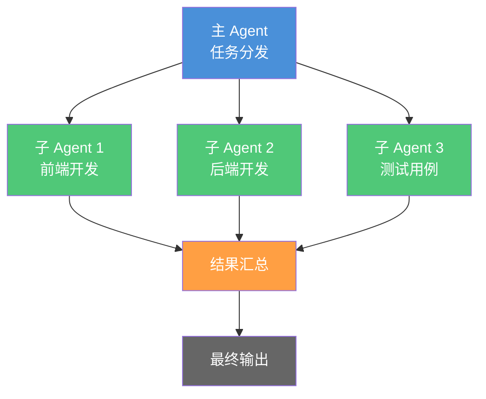
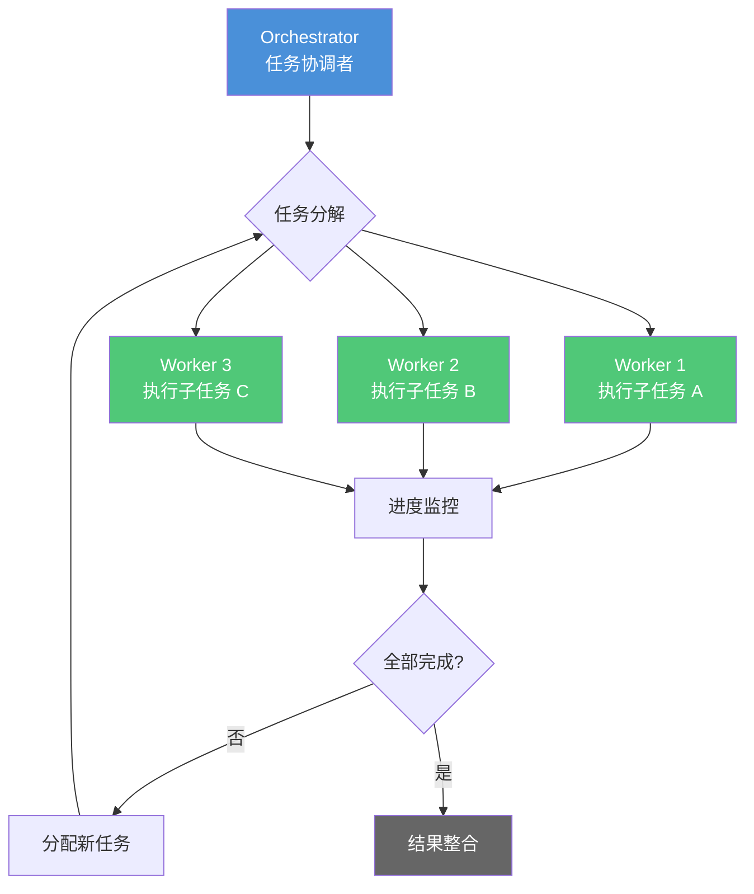
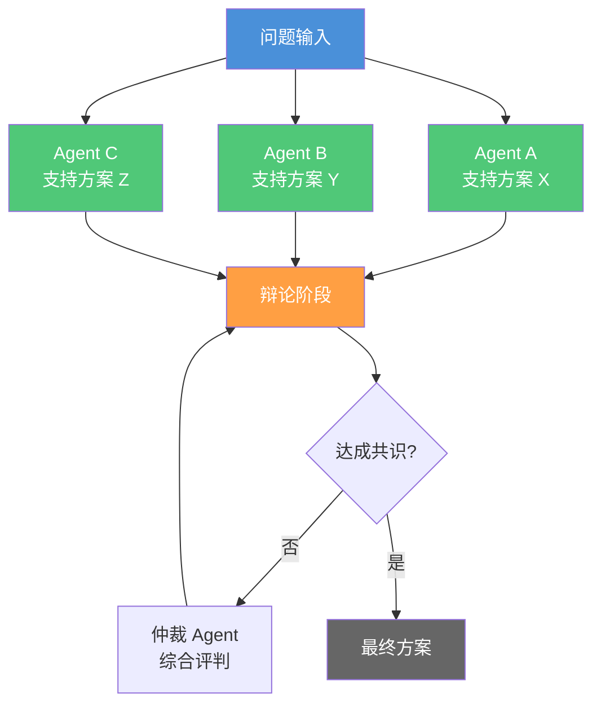
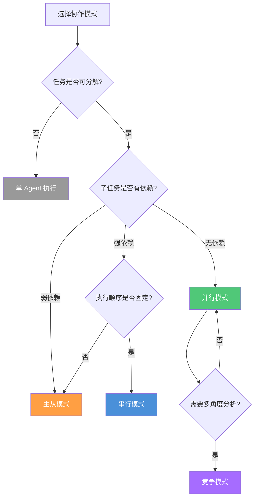
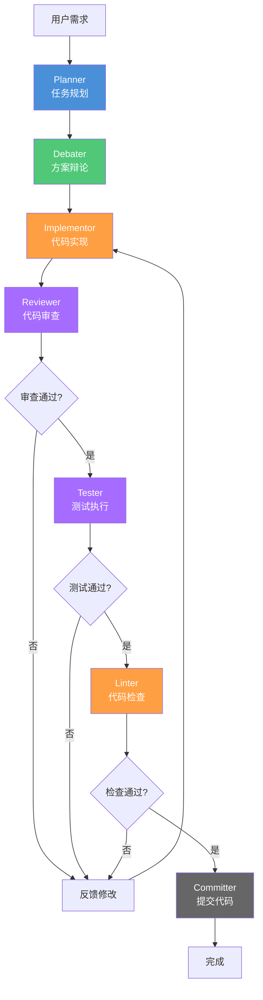
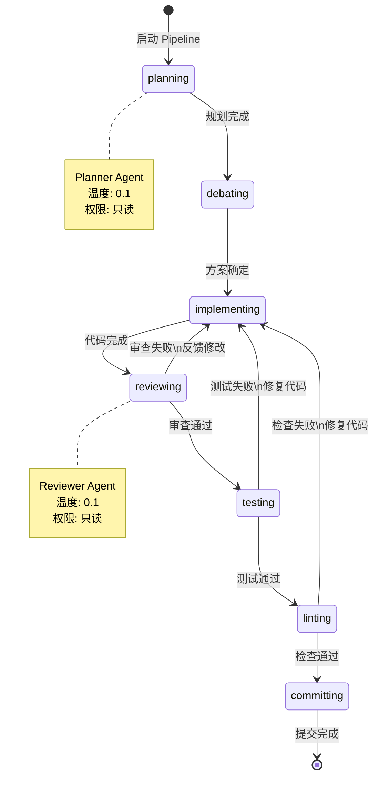
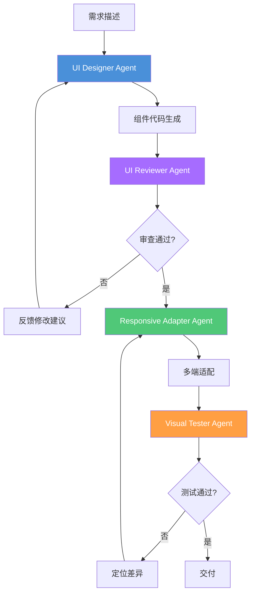
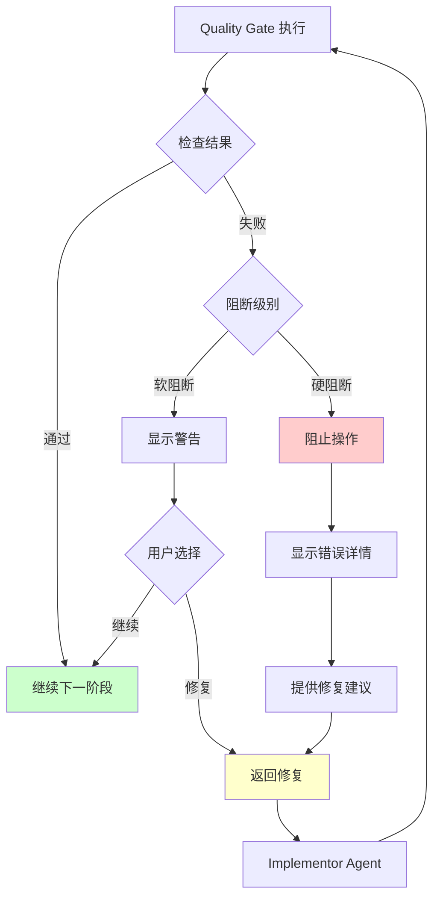

# 多 Agent 协作

> 串行、并行、主从、竞争——四种协作模式的设计原理、配置方法和工程实践，以及完整的 7-Agent Pipeline 实现。

## 文章概述

单个 Agent 的能力再强，也有边界。多 Agent 协作的核心思想是"角色分离"：每个 Agent 只做一件事——Planner 规划不写代码，Implementor 实现不审查，Reviewer 审查不改代码。这降低了单个 Agent 的复杂度，显著提高了输出质量。

读完本文，你将能够设计并实现多 Agent 协作工作流，掌握串行、并行、主从、竞争四种模式的应用场景，以及通过 7-Agent Pipeline 显著提升输出质量。

本文系统讲解四种 Agent 协作模式：串行模式（A → B → C 顺序执行）、并行模式（A 同时触发多个子 Agent 并汇总结果）、主从模式（Master 分配任务给 Slave 独立执行）和竞争模式（多个 Agent 从不同角度分析并达成共识）。然后深入 7-Agent Pipeline 的设计和实现——这是当前最成熟的多 Agent 协作方案，包含 Planner、Debater、Implementor、Reviewer、Tester、Linter 和 Committer 七个角色。

你还会学到 `task()` 的子 Agent 调用方法、WORKFLOW_STATE.md 的文件交接模式（比对话历史交接更可审计、可恢复）、各 Agent 的温度策略设计（Planner 0.1、Implementor 0.1、Debater 0.3 等），以及权限隔离方案（Reviewer 和 Tester 在权限层面无法修改代码）。

> **⏱ 时间有限？先读这些：** Agent 协作的四种模式 → 7-Agent Pipeline → 前端场景 Agent 编排示例 → 实战：启动 7-Agent Pipeline

---

## Agent 协作的四种模式

多 Agent 协作的本质是将复杂任务分解为多个子任务，由不同角色的 Agent 分别执行。根据任务间的依赖关系和执行方式，我们可以归纳出四种基本协作模式。

### 串行模式（Prompt Chaining）

串行模式是最直观的协作方式：Agent A 完成任务后，将结果传递给 Agent B，B 完成后传递给 Agent C，形成 A → B → C 的顺序执行链。


**核心特征**：
- **强依赖关系**：每个 Agent 必须等待前一个 Agent 完成
- **固定执行顺序**：流程在编译时确定，运行时不可变
- **结果累积传递**：后继 Agent 可以访问所有前置 Agent 的输出

**典型配置**：

```json:.opencode/workflows/serial-pipeline.json
{
  "workflow": {
    "name": "serial-pipeline",
    "mode": "serial",
    "steps": [
      { "agent": "planner", "skill": "requirements-analyst" },
      { "agent": "architect", "skill": "architecture-consultant" },
      { "agent": "implementor", "skill": "backend-architect" },
      { "agent": "tester", "skill": "qa-engineer" }
    ]
  }
}
```

**适用场景**：
- 需求明确、步骤固定的任务
- 需要严格审计轨迹的生产变更
- 每一步输出都需要人工确认的关键流程

**局限性**：
- 延迟累加：总延迟等于所有 Agent 执行时间之和
- 单点故障：任何一个 Agent 失败都会阻断整个流程

### 并行模式（Parallelization）

并行模式让一个 Agent 同时触发多个子 Agent 执行独立任务，最后汇总结果。这种模式适合可以分解为独立子任务的场景。



**核心特征**：
- **独立执行**：子 Agent 之间无依赖，可同时运行
- **结果合并**：需要定义合并策略处理多个输出
- **低延迟**：总延迟取决于最慢的子 Agent

**典型配置**：

```json:.opencode/workflows/parallel-development.json
{
  "workflow": {
    "name": "parallel-development",
    "mode": "parallel",
    "coordinator": "lead-agent",
    "workers": [
      { "agent": "frontend-dev", "task": "实现 UI 组件" },
      { "agent": "backend-dev", "task": "实现 API 接口" },
      { "agent": "test-engineer", "task": "编写测试用例" }
    ],
    "mergeStrategy": "consolidate"
  }
}
```

**合并策略**：

| 策略 | 说明 | 适用场景 |
|------|------|---------|
| `consolidate` | 智能合并，处理冲突 | 多 Agent 修改同一文件 |
| `append` | 按顺序追加输出 | 生成报告、文档 |
| `vote` | 多数表决选择结果 | 决策类任务 |
| `best` | 选择最优结果 | 创意生成、方案设计 |

**适用场景**：
- 前后端分离开发
- 多模块并行测试
- 安全审计的多维度扫描

### 主从模式（Orchestrator-Workers）

主从模式引入一个协调者（Orchestrator）Agent，负责动态分解任务、分配给工作 Agent（Workers）、监控进度并汇总结果。与并行模式的区别在于：主从模式是动态分配，并行模式是静态定义。

→ 此模式在 oh-my-openagent v4.0+ 中被正式封装为 **Team Mode**，提供 12 个 `team_*` 工具和四种 Agent 类型（Sisyphus、Atlas、Sisyphus-Junior、Hephaestus）来构建多 Agent 协作系统。详见[自定义工作流](custom-workflows.md)。

> 注：第 2 章介绍了 OMO 扩展的 5 个核心 Agent（Sisyphus、Prometheus、Atlas、Hephaestus、Oracle）。本章的 Team Mode 聚焦于 Sisyphus、Atlas、Hephaestus、Sisyphus-Junior 四种可参与工作流的 Agent 类型。Oracle 作为只读咨询 Agent 不参与工作流执行，Prometheus 作为规划模式已在前文介绍。



**核心特征**：
- **动态任务分配**：根据执行情况实时调整
- **进度监控**：Orchestrator 持续跟踪 Worker 状态
- **容错机制**：Worker 失败可重新分配

**典型配置**：

```json:.opencode/workflows/orchestrator-workers.json
{
  "workflow": {
    "name": "orchestrator-workers",
    "orchestrator": {
      "agent": "lead-agent",
      "skills": ["dispatching-parallel-agents"],
      "maxWorkers": 5
    },
    "workerTemplate": {
      "agent": "worker-agent",
      "permissions": ["read", "edit"],
      "timeout": 300000
    },
    "strategy": {
      "taskSplit": "auto",
      "retryCount": 3,
      "timeoutAction": "reassign"
    }
  }
}
```

**适用场景**：
- 大规模代码重构
- 多文件批量修改
- 不确定子任务数量的场景

### 竞争模式（Adversarial）

竞争模式让多个 Agent 从不同角度分析同一问题，通过辩论或对抗达成共识。这是提高决策质量的有效手段。

→ 此模式在自定义工作流中被形式化为 **Hyperplan**，详见[自定义工作流](custom-workflows.md)。



**核心特征**：
- **多视角分析**：不同 Agent 有不同的立场和偏好
- **辩论机制**：Agent 之间可以质疑和反驳
- **共识达成**：通过投票或仲裁确定最终结果

**典型配置**：

```json:.opencode/workflows/adversarial-review.json
{
  "workflow": {
    "name": "adversarial-review",
    "mode": "adversarial",
    "debaters": [
      { "agent": "security-advocate", "stance": "安全优先" },
      { "agent": "performance-advocate", "stance": "性能优先" },
      { "agent": "maintainability-advocate", "stance": "可维护性优先" }
    ],
    "arbitrator": {
      "agent": "architect",
      "decisionMethod": "weighted-vote"
    },
    "maxRounds": 3
  }
}
```

**适用场景**：
- 架构决策评审
- 技术选型讨论
- 安全漏洞修复方案评估

---

### 四种协作模式架构特征对比

| 特征 | 串行模式 | 并行模式 | 主从模式 | 竞争模式 |
|------|---------|---------|---------|---------|
| **延迟** | 高（串行累加） | 低（并行执行） | 中（编排开销） | 中高（多轮辩论） |
| **吞吐** | 低 | 高 | 高 | 中 |
| **一致性** | 高（固定流程） | 低（需合并） | 高（编排协调） | 高（共识机制） |
| **容错性** | 低（单点故障） | 高（部分失败可继续） | 高（重试机制） | 中（依赖仲裁） |
| **适用场景** | 固定子任务顺序 | 独立子任务并行 | 动态分解任务 | 多角度分析决策 |
| **OpenCode 实现** | Skill/Command | 多 Task 调用 | Primary Agent 编排 | Hyperplan/Debate* |
| **成本** | 低 | 中（并行调用） | 高（多次调用） | 高（多轮交互） |
| **可控性** | 高 | 中 | 高 | 中 |

> \* Hyperplan 是 OMO 内置 Team Skill，非 OpenCode 原生功能。详见[自定义工作流](custom-workflows.md)。

**模式选择决策树**：



### Token 消耗参考

不同协作模式的 Token 消耗差异显著，在选择时应纳入考量：

| 模式 | 典型 Token 范围 | 说明 |
|------|----------------|------|
| **串行模式** | 10K-50K tokens | 步骤串联，每次传递上下文积累 |
| **并行模式** | 20K-100K tokens | 多个子 Agent 同时调用，总量取决于并行数 |
| **主从模式** | 30K-150K tokens | 协调开销 + 动态分配，适合复杂探索 |
| **竞争模式** | 50K-200K tokens | 多轮辩论消耗大量上下文 |
| **7-Agent Pipeline** | 100K-500K tokens | 全工作流建议在关键任务使用 |

---

## 使用 task() 调用子 Agent

`task()` 是 OpenCode **核心内置函数**，用于创建子 Agent 执行子任务。同一模式下，**oh-my-openagent（OMO）插件** 提供了 `delegate_task()` 扩展，增加了类别路由、Skill 传递和后台执行能力。本节分别说明两种 API 的参数和使用方式。

### OpenCode 核心 task() 函数

`task()` 是 OpenCode 最基础的子 Agent 调用接口：

```javascript:terminal
// OpenCode task() — 创建子 Agent 执行任务
const result = task(
  description: "安全审查子任务",
  prompt: "对当前代码变更进行安全审查，重点关注 SQL 注入和 XSS 漏洞",
  subagent_type: "explore"
)
```

**参数说明**：

| 参数 | 类型 | 必填 | 说明 |
|------|------|------|------|
| `description` | string | 是 | 任务描述，用于日志和调试 |
| `prompt` | string | 是 | 子 Agent 的任务指令 |
| `subagent_type` | string | 是 | 指定 Agent 类型（如 `explore`、`librarian`、`orchestrator`、`build`、`oracle` 等） |
| `session_id` | string | 否 | 继承已有会话上下文，用于续接之前的对话 |
| `command` | string | 否 | 直接指定 Slash 命令替代 Prompt |

> OpenCode 核心 `task()` 没有 `category`、`load_skills`、`run_in_background`、`timeout` 参数。这些是 OMO `delegate_task()` 的扩展功能。

### oh-my-openagent delegate_task() 扩展

OMO 的 `delegate_task()` 是对 `task()` 的扩展封装，提供了类别路由、Skill 传递和后台执行能力：

```javascript:terminal
// OMO delegate_task() — 带类别和 Skill 的子 Agent 调用
const bgTaskId = delegate_task(
  description: "安全审查子任务",
  prompt: "对当前代码变更进行安全审查，重点关注 SQL 注入和 XSS 漏洞",
  category: "unspecified-high",
  load_skills: ["security-architect", "penetration-tester"],
  run_in_background: true
)
```

**参数说明**：

| 参数 | 类型 | 必填 | 说明 |
|------|------|------|------|
| `description` | string | 是 | 任务描述，用于日志和调试 |
| `prompt` | string | 是 | 子 Agent 的任务指令 |
| `category` | string | 否 | 任务分类标签（如 `visual-engineering`、`ultrabrain`、`deep`、`artistry`、`quick`、`unspecified-low`、`unspecified-high`、`writing`），用于调度路由 |
| `load_skills` | string[] | 否 | 子 Agent 加载的 Skill 列表（无需 Skill 时传 `[]`），不继承父 Agent 已加载的 Skill |
| `run_in_background` | boolean | 否 | 是否后台异步执行：`false` 为同步等待（默认），`true` 为异步后台 |
| `session_id` | string | 否 | 继承已有会话上下文，用于续接之前的对话 |

> `delegate_task()` 是 OMO 插件提供的能力，并非 OpenCode 核心 API。使用前需确认项目中已集成 oh-my-openagent。

### 子 Agent 权限隔离

子 Agent 的权限设计遵循"最小权限原则"——默认不继承父 Agent 的写权限，需要显式声明。

**权限继承矩阵**：

| 权限类型 | 默认继承 | 可配置 | 安全建议 |
|---------|---------|--------|---------|
| `read` | ✓ | 可禁用 | 审计场景可禁用敏感路径 |
| `edit` | ✗ | 可启用 | 仅实现类 Agent 启用 |
| `bash` | ✗ | 可启用 | 仅测试/构建类 Agent 启用 |
| `write` | ✗ | 可启用 | 极少使用，需审批 |
| `lsp` | ✓ | 可禁用 | 可关闭以节省 Token |
| `webfetch` | ✓ | 可禁用 | 不需要网络时禁用 |
| `question` | ✓ | 可禁用 | 审计场景可禁用交互确认 |
| `glob` | ✓ | 可禁用 | 文件查找权限 |

> **注意**：子 Agent 的权限控制通过父 Agent 的 `permission` 规则和路径级别的访问模式实现，而非通过 `context.inherit/isolate` 参数。如需限制子 Agent 的权限范围，应在父 Agent 的权限配置中声明限制条件。

### task() 返回值和结果合并

子 Agent 执行完成后，返回结构化结果：

```json:terminal
{
  "taskId": "task-20260602-001",
  "status": "completed",
  "output": {
    "summary": "发现 3 个潜在安全问题",
    "findings": [
      { "severity": "high", "type": "sql-injection", "location": "src/db/query.js:45" },
      { "severity": "medium", "type": "xss", "location": "src/components/form.tsx:120" },
      { "severity": "low", "type": "info-disclosure", "location": "src/api/user.js:78" }
    ],
    "recommendations": [
      "使用参数化查询替换字符串拼接",
      "对用户输入进行 HTML 转义",
      "移除响应中的敏感信息"
    ]
  },
  "metrics": {
    "duration": 45000,
    "tokenUsage": 12500
  }
}
```

**结果合并策略**：

```javascript:terminal
function mergeTaskResults(results, strategy) {
  switch (strategy) {
    case 'append':
      return results.map(r => r.output).join('\n---\n')
    case 'consolidate':
      return intelligentMerge(results)
    case 'best':
      return selectBestResult(results, criteria)
    case 'vote':
      return majorityVote(results)
    default:
      return results[0].output
  }
}
```

---

## 7-Agent Pipeline

> **⚠️ 7-Agent Pipeline 的过度工程风险**：7-Agent Pipeline 虽然功能强大，但对简单任务（如单文件修改、小型 bug 修复）而言是过度工程。启动 7 个 Agent 会带来显著的 Token 开销（全工作流约 100K-500K tokens）和延迟。建议仅在以下场景使用：跨多文件的重构、关键业务逻辑变更、或需要严格审计轨迹的生产级变更。对于简单任务，单个 Agent 或 3-Agent（Implementor → Reviewer → Tester）工作流效率更高。

7-Agent Pipeline 是当前最成熟的多 Agent 协作方案，将软件开发流程拆分为七个独立角色，每个角色专注于单一职责。

### 七个角色的职责定义



**角色职责详解**：

| Agent | 职责 | 输入 | 输出 | 关键行为 |
|-------|------|------|------|---------|
| **Planner** | 任务规划 | 用户需求 | 实现计划 | 分析需求、拆解任务、识别依赖 |
| **Debater** | 方案辩论 | 实现计划 | 优化方案 | 质疑假设、提出替代方案、权衡利弊 |
| **Implementor** | 代码实现 | 优化方案 | 代码变更 | 编写代码、遵循规范、处理边界 |
| **Reviewer** | 代码审查 | 代码变更 | 审查报告 | 检查逻辑、发现风险、提出改进 |
| **Tester** | 测试执行 | 代码变更 | 测试报告 | 运行测试、验证功能、报告失败 |
| **Linter** | 代码检查 | 代码变更 | 检查报告 | 风格检查、静态分析、格式化 |
| **Committer** | 提交代码 | 全部通过 | Git 提交 | 生成提交信息、执行提交 |

### 7-Agent 权限矩阵

权限隔离是 7-Agent Pipeline 的核心安全设计。每个 Agent 只能访问其职责所需的权限，防止越权操作。

| Agent | edit | bash | read | 模型等级 | 温度 | 职责 |
|-------|------|------|------|---------|------|------|
| **Planner** | deny | deny | allow | best-capability¹ | 0.1 | 任务规划 |
| **Debater** | deny | deny | allow | balanced² | 0.3 | 方案辩论 |
| **Implementor** | allow | ask | allow | balanced² | 0.15 | 代码实现 |
| **Reviewer** | deny | deny | allow | best-capability¹ | 0.1 | 代码审查 |
| **Tester** | deny | allow | allow | fast³ | 0.1 | 测试执行 |
| **Linter** | deny | allow | allow | fast³ | 0.0 | 代码检查 |
| **Committer** | ask | ask | allow | balanced² | 0.2 | 提交代码 |

> ¹ best-capability：当前能力最强的模型（例如 Claude Opus 最新版）
> ² balanced：性能与成本均衡的模型（例如 Claude Sonnet 最新版）
> ³ fast：轻量快速模型（例如 Claude Haiku 最新版）

**权限设计原则**：

1. **Planner/Debater/Reviewer 只读**：防止规划/审查阶段意外修改代码
2. **Implementor 有写权限，但 Bash 需要 ask**：实现代码需要编辑，但执行命令需确认
3. **Tester/Linter 可执行 Bash**：需要运行测试和检查命令
4. **Committer 的 edit 和 bash 均为 ask**：提交和 Git 操作均需人工确认，提交信息是关键审计节点

### 温度策略设计

温度（Temperature）参数控制模型输出的随机性。工程场景需要确定性输出，但不同阶段有不同需求。

| 温度范围 | 特性 | 适用场景 | Agent |
|---------|------|---------|-------|
| 0.0 | 完全确定性 | 格式检查、规则执行 | Linter |
| 0.1 | 高确定性 | 规划、审查、测试 | Planner, Reviewer, Tester |
| 0.15 | 较高确定性 | 代码实现 | Implementor |
| 0.2 | 适度创造性 | 提交信息生成 | Committer |
| 0.3 | 适度创造性 | 方案辩论 | Debater |

**温度选择原则**：

- **低温度（0.0-0.1）**：需要精确、可重复输出的场景
- **中低温度（0.15-0.2）**：需要一定创造性但保持确定性的场景
- **中等温度（0.3）**：需要适度创造性但不发散的场景
- **高温度（>0.5）**：探索性、头脑风暴场景（本 Pipeline 不使用）

### 完整 7-Agent Pipeline 配置

> **⚠️ 概念示例说明**：以下配置为概念性 DSL，展示多 Agent 管道的设计思路（角色职责、权限矩阵、温度策略、流程编排）。OpenCode 的实际代理定义使用 `.opencode/agents/*.md`（YAML frontmatter）或 `opencode.json` 的 agent 配置。这里的 JSON 结构是教学示意，非可直接运行的 OpenCode 配置格式。

```json:.opencode/pipelines/7-agent.json
{
  "pipeline": {
    "name": "7-agent-development-pipeline",
    "version": "1.0.0",
    "agents": {
      "planner": {
        "model": "best-capability-model",
        "temperature": 0.1,
        "skills": ["requirements-analyst", "architecture-consultant"],
        "permissions": {
          "edit": "deny",
          "bash": "deny",
          "read": "allow"
        },
        "output": "WORKFLOW_STATE.md#plan"
      },
      "debater": {
        "model": "balanced-model",
        "temperature": 0.3,
        "skills": ["contradiction-analysis"],
        "permissions": {
          "edit": "deny",
          "bash": "deny",
          "read": "allow"
        },
        "output": "WORKFLOW_STATE.md#debate"
      },
      "implementor": {
        "model": "balanced-model",
        "temperature": 0.15,
        "skills": ["backend-architect", "frontend-architect"],
        "permissions": {
          "edit": "allow",
          "bash": "ask",
          "read": "allow"
        },
        "output": "WORKFLOW_STATE.md#implementation"
      },
      "reviewer": {
        "model": "best-capability-model",
        "temperature": 0.1,
        "skills": ["requesting-code-review", "security-architect"],
        "permissions": {
          "edit": "deny",
          "bash": "deny",
          "read": "allow"
        },
        "output": "WORKFLOW_STATE.md#review"
      },
      "tester": {
        "model": "fast-model",
        "temperature": 0.1,
        "skills": ["qa-engineer", "test-driven-development"],
        "permissions": {
          "edit": "deny",
          "bash": "allow",
          "read": "allow"
        },
        "output": "WORKFLOW_STATE.md#test"
      },
      "linter": {
        "model": "fast-model",
        "temperature": 0.0,
        "skills": [],
        "permissions": {
          "edit": "deny",
          "bash": "allow",
          "read": "allow"
        },
        "commands": ["npm run lint", "npm run typecheck"],
        "output": "WORKFLOW_STATE.md#lint"
      },
      "committer": {
        "model": "balanced-model",
        "temperature": 0.2,
        "skills": ["finishing-a-development-branch"],
        "permissions": {
          "edit": "ask",
          "bash": "ask",
          "read": "allow"
        },
        "output": "WORKFLOW_STATE.md#commit"
      }
    },
    "flow": [
      { "agent": "planner", "onFailure": "abort" },
      { "agent": "debater", "onFailure": "continue" },
      { "agent": "implementor", "onFailure": "retry", "maxRetries": 2 },
      { "agent": "reviewer", "onFailure": "feedback" },
      { "agent": "tester", "onFailure": "feedback" },
      { "agent": "linter", "onFailure": "feedback" },
      { "agent": "committer", "onFailure": "manual" }
    ],
    "qualityGates": {
      "preReview": ["lint"],       // 故意冗余：preReview 是快速预检，在 Reviewer 前拦截明显问题；
                                   // Pipeline 末端的 Linter Agent 是最终门禁，全量检查确保提交质量
      "preCommit": ["test", "typecheck"],
      "prePush": ["security-scan"]
    }
  }
}
```

---

## WORKFLOW_STATE.md 文件交接模式

WORKFLOW_STATE.md 是 7-Agent Pipeline 的状态持久化文件，实现了 Agent 之间的"文件交接"而非"对话历史交接"。

### 为什么选择文件交接

| 对比维度 | 对话历史交接 | 文件交接（WORKFLOW_STATE.md） |
|---------|-------------|------------------------------|
| **可审计性** | 低（历史难追溯） | 高（完整记录在文件中） |
| **可恢复性** | 低（会话断开即丢失） | 高（文件持久化） |
| **上下文大小** | 无限增长 | 可控（只保留关键信息） |
| **跨会话协作** | 不支持 | 支持 |
| **版本控制** | 不支持 | 可提交到 Git |

### WORKFLOW_STATE.md 完整模板

```markdown:terminal
# WORKFLOW_STATE.md

> Pipeline 执行状态文件 — 由各 Agent 顺序写入，记录完整执行轨迹。

## 元信息

| 字段 | 值 |
|------|-----|
| Pipeline ID | pipeline-20260602-001 |
| 开始时间 | 2026-06-02 14:30:00 |
| 当前阶段 | review |
| 触发用户 | developer@example.com |

---

## 原始需求

实现用户登录功能，支持邮箱/密码和 OAuth 两种方式。

---

## Plan（规划阶段）

**执行时间**：2026-06-02 14:30:00 - 14:35:00
**执行 Agent**：Planner
**状态**：✅ 完成

### 任务拆解

1. **后端 API**
   - POST /api/auth/login - 邮箱密码登录
   - GET /api/auth/oauth/:provider - OAuth 登录
   - POST /api/auth/logout - 登出

2. **前端页面**
   - 登录表单组件
   - OAuth 按钮组件
   - 登录状态管理

3. **测试**
   - API 单元测试
   - 前端组件测试
   - E2E 测试

### 依赖识别

- 需要配置 OAuth Provider（Google、GitHub）
- 需要数据库用户表
- 需要会话管理中间件

---

## Debate（辩论阶段）

**执行时间**：2026-06-02 14:35:00 - 14:40:00
**执行 Agent**：Debater
**状态**：✅ 完成

### 方案对比

| 方案 | 优点 | 缺点 | 推荐度 |
|------|------|------|--------|
| JWT 无状态 | 易扩展、无服务端存储 | 无法主动失效 | ⭐⭐⭐ |
| Session 有状态 | 可控、安全 | 需要存储、扩展复杂 | ⭐⭐⭐⭐⭐ |
| 混合模式 | 兼顾两者优点 | 实现复杂 | ⭐⭐⭐⭐ |

### 最终决策

采用 Session 方案，使用 Redis 存储会话，支持主动失效和强制登出。

---

## Implementation（实现阶段）

**执行时间**：2026-06-02 14:40:00 - 15:20:00
**执行 Agent**：Implementor
**状态**：✅ 完成

### 变更文件

| 文件 | 操作 | 说明 |
|------|------|------|
| src/api/auth.ts | 新增 | 认证 API 路由 |
| src/middleware/session.ts | 新增 | 会话中间件 |
| src/components/LoginForm.tsx | 新增 | 登录表单组件 |
| src/components/OAuthButtons.tsx | 新增 | OAuth 按钮组件 |
| src/stores/authStore.ts | 新增 | 认证状态管理 |
| tests/auth.test.ts | 新增 | API 测试 |

### 关键代码片段

```typescript:src/api/auth.ts
export async function login(req: Request, res: Response) {
  const { email, password } = req.body
  const user = await validateUser(email, password)
  if (!user) {
    return res.status(401).json({ error: 'Invalid credentials' })
  }
  req.session.userId = user.id
  res.json({ user: sanitizeUser(user) })
}
```text:terminal

---

## Review（审查阶段）

**执行时间**：2026-06-02 15:20:00 - 15:30:00
**执行 Agent**：Reviewer
**状态**：🔄 进行中

### 审查发现

| 级别 | 文件 | 行号 | 问题 | 建议 |
|------|------|------|------|------|
| 🔴 高 | src/api/auth.ts | 25 | 密码明文比较 | 使用 bcrypt.compare |
| 🟡 中 | src/api/auth.ts | 45 | 缺少速率限制 | 添加 express-rate-limit |
| 🟢 低 | src/components/LoginForm.tsx | 12 | 缺少 loading 状态 | 添加 isSubmitting 状态 |

### 需要修复

- [ ] 使用 bcrypt 进行密码比较
- [ ] 添加登录速率限制
- [ ] 添加表单提交 loading 状态

---

## Test（测试阶段）

**执行时间**：待执行
**执行 Agent**：Tester
**状态**：⏳ 等待

---

## Lint（检查阶段）

**执行时间**：待执行
**执行 Agent**：Linter
**状态**：⏳ 等待

---

## Commit（提交阶段）

**执行时间**：待执行
**执行 Agent**：Committer
**状态**：⏳ 等待

---

## 执行日志

```
[14:30:00] Pipeline 启动
[14:30:00] Planner 开始执行
[14:35:00] Planner 完成，输出计划
[14:35:00] Debater 开始执行
[14:40:00] Debater 完成，输出方案决策
[14:40:00] Implementor 开始执行
[15:20:00] Implementor 完成，输出代码变更
[15:20:00] Reviewer 开始执行
[15:30:00] Reviewer 发现 3 个问题，等待修复
```text:terminal
```

### 状态流转图



---

## 前端场景 Agent 编排示例

前端开发有其独特的工作流需求：UI 设计、组件实现、响应式适配、视觉测试等环节需要紧密配合。以下是针对前端场景定制的 Agent 编排方案。

### AI 辅助组件生成工作流



### 前端 Agent 配置

| Agent | 模型等级 | 权限 | 温度 | 职责 |
|-------|---------|------|------|------|
| **UI Designer** | balanced | edit: allow | 0.2 | 组件代码生成 |
| **UI Reviewer** | best-capability | edit: deny | 0.1 | 视觉审查、反馈 |
| **Responsive Adapter** | balanced | edit: allow | 0.1 | 响应式调整 |
| **Visual Tester** | fast | edit: deny, bash: allow | 0.0 | 视觉回归测试 |

### 完整配置示例

```json:.opencode/workflows/frontend-component-pipeline.json
{
  "workflow": {
    "name": "frontend-component-pipeline",
    "trigger": "/create-component",
    "agents": {
      "ui-designer": {
        "model": "balanced-model",
        "temperature": 0.2,
        "skills": ["ui-designer", "frontend-architect"],
        "permissions": {
          "edit": "allow",
          "bash": "deny",
          "read": "allow"
        },
        "outputFormat": {
          "component": "tsx",
          "styles": "css",
          "tests": "test.tsx"
        }
      },
      "ui-reviewer": {
        "model": "best-capability-model",
        "temperature": 0.1,
        "skills": ["steve-jobs-perspective"],
        "permissions": {
          "edit": "deny",
          "bash": "deny",
          "read": "allow"
        },
        "checklist": [
          "视觉层次是否清晰",
          "交互反馈是否及时",
          "可访问性是否达标",
          "设计系统是否一致"
        ]
      },
      "responsive-adapter": {
        "model": "balanced-model",
        "temperature": 0.1,
        "skills": ["frontend-architect"],
        "permissions": {
          "edit": "allow",
          "bash": "deny",
          "read": "allow"
        },
        "breakpoints": {
          "mobile": "320px",
          "tablet": "768px",
          "desktop": "1024px",
          "wide": "1440px"
        }
      },
      "visual-tester": {
        "model": "fast-model",
        "temperature": 0.0,
        "skills": ["qa-engineer"],
        "permissions": {
          "edit": "deny",
          "bash": "allow",
          "read": "allow"
        },
        "tools": ["playwright", "storybook"],
        "threshold": 0.01
      }
    },
    "flow": [
      { "agent": "ui-designer", "input": "$ARGUMENTS" },
      { "agent": "ui-reviewer", "input": "previous_output" },
      { "agent": "responsive-adapter", "input": "approved_design" },
      { "agent": "visual-tester", "input": "final_component" }
    ]
  }
}
```

### 响应式适配检查清单

UI Reviewer Agent 在审查时会检查以下项目：

- [ ] 移动端（320px-767px）布局是否正常
- [ ] 平板端（768px-1023px）布局是否正常
- [ ] 桌面端（1024px+）布局是否正常
- [ ] 图片是否使用响应式尺寸
- [ ] 字体是否使用相对单位（rem/em）
- [ ] 触摸目标是否足够大（≥44px）
- [ ] 横屏模式是否正常

---

## 质量门禁集成

质量门禁（Quality Gate）是 Pipeline 中的验证节点，确保每个阶段的输出符合质量标准。

### Quality Gate 配置

```json:.opencode/pipelines/quality-gates.json
{
  "qualityGates": {
    "preReview": [
      {
        "type": "lint",
        "command": "npm run lint",
        "timeout": 60000,
        "required": true
      }
    ],
    "preCommit": [
      {
        "type": "test",
        "command": "npm test",
        "timeout": 300000,
        "required": true
      },
      {
        "type": "typeCheck",
        "command": "npm run typecheck",
        "timeout": 60000,
        "required": true
      },
      {
        "type": "coverage",
        "command": "npm run test:coverage",
        "threshold": 80,
        "timeout": 300000,
        "required": false
      }
    ],
    "prePush": [
      {
        "type": "security",
        "command": "npm audit --audit-level=moderate",
        "timeout": 120000,
        "required": true
      },
      {
        "type": "build",
        "command": "npm run build",
        "timeout": 300000,
        "required": true
      }
    ]
  }
}
```

### 触发条件

| 门禁类型 | 触发时机 | 阻断级别 | 可跳过 |
|---------|---------|---------|--------|
| `preReview` | Reviewer Agent 执行前 | 软阻断（警告） | 是 |
| `preCommit` | Committer Agent 执行前 | 硬阻断（必须通过） | 否 |
| `prePush` | git push 前 | 硬阻断 | 需管理员确认 |
| `manual` | 手动触发 | - | - |

### 失败处理策略



### 门禁失败修复建议

| 门禁类型 | 常见失败原因 | 自动修复 | 手动修复建议 |
|---------|-------------|---------|-------------|
| lint | 代码风格不一致 | ✓ `npm run lint --fix` | 配置 ESLint 规则 |
| test | 测试用例失败 | ✗ | 检查测试断言和边界条件 |
| typeCheck | 类型错误 | ✗ | 添加类型注解或修复类型定义 |
| coverage | 覆盖率不足 | ✗ | 添加更多测试用例 |
| security | 依赖漏洞 | ✓ `npm audit fix` | 升级或替换有漏洞的依赖 |
| build | 构建失败 | ✗ | 检查构建配置和入口文件 |

### 工作流安全门禁模式

安全门禁是 Quality Gate 的增强版，专门用于安全关键场景：

```json:.opencode/pipelines/security-gates.json
{
  "securityGates": {
    "sensitiveFiles": {
      "patterns": ["*.env", "*.key", "*.pem", "config/prod.*"],
      "action": "block",
      "requireApproval": true
    },
    "permissionChanges": {
      "patterns": ["**/permissions.json", "**/IAMPolicy*"],
      "action": "block",
      "requireApproval": true,
      "reviewers": ["security-team"]
    },
    "dependencyChanges": {
      "files": ["package.json", "go.mod", "requirements.txt"],
      "action": "scan",
      "vulnerabilityThreshold": "moderate"
    }
  }
}
```

---

## 实战：启动 7-Agent Pipeline

### 完整启动命令

```bash:terminal
# 方式一：使用自定义命令
/pipeline --config .opencode/pipelines/7-agent.json

# 方式二：使用 Skill
/use-skills writing-plans,backend-architect,qa-engineer

# 方式三：直接触发
/implement --pipeline 7-agent "实现用户登录功能"
```

> 注：`/pipeline` 命令需要 OMO v4.0+，且需在 `.opencode/pipelines/` 目录下预先定义 Pipeline 配置文件。

### 观察每个阶段的输出

Pipeline 执行过程中，每个 Agent 会输出其执行状态：

```text:terminal
[Pipeline] 启动 7-Agent Development Pipeline
[Pipeline] 任务：实现用户登录功能

[Planner] 开始规划...
[Planner] 分析需求：识别 3 个主要任务
[Planner] 输出计划到 WORKFLOW_STATE.md
[Planner] ✅ 完成（耗时 5m 23s）

[Debater] 开始方案辩论...
[Debater] 评估方案：JWT vs Session
[Debater] 最终决策：Session + Redis
[Debater] ✅ 完成（耗时 4m 12s）

[Implementor] 开始实现...
[Implementor] 创建文件：src/api/auth.ts
[Implementor] 创建文件：src/components/LoginForm.tsx
[Implementor] ✅ 完成（耗时 38m 45s）

[Reviewer] 开始审查...
[Reviewer] 发现 2 个问题需要修复
[Reviewer] 🔴 高风险：密码比较未使用 bcrypt
[Reviewer] 🟡 中风险：缺少速率限制
[Reviewer] ⚠️ 等待修复

[Implementor] 修复问题...
[Implementor] 使用 bcrypt.compare 替换明文比较
[Implementor] 添加 express-rate-limit 中间件
[Implementor] ✅ 修复完成

[Reviewer] 重新审查...
[Reviewer] ✅ 审查通过

[Tester] 执行测试...
[Tester] 运行 npm test
[Tester] 12/12 测试通过
[Tester] ✅ 测试通过

[Linter] 执行检查...
[Linter] 运行 npm run lint
[Linter] 运行 npm run typecheck
[Linter] ✅ 检查通过

[Committer] 准备提交...
[Committer] 生成提交信息：
[Committer] "feat(auth): 实现用户登录功能
[Committer] 
[Committer] - 支持邮箱/密码登录
[Committer] - 支持 OAuth 登录（Google、GitHub）
[Committer] - 添加登录速率限制
[Committer] - 使用 bcrypt 加密密码"
[Committer] 
[Committer] 确认提交？[Y/n]

[Pipeline] ✅ Pipeline 执行完成
[Pipeline] 总耗时：52m 30s
[Pipeline] Token 消耗：125,000
```

### 调试和重试策略

**单阶段重试**：

```bash:terminal
# 重试失败的阶段
/pipeline --retry --stage implementor

# 从指定阶段继续
/pipeline --resume --stage reviewer
```

**查看详细日志**：

```bash:terminal
# 查看某个 Agent 的详细执行日志
/pipeline --logs --agent implementor

# 查看完整 Pipeline 状态
/cat WORKFLOW_STATE.md
```

**手动干预**：

```bash:terminal
# 跳过某个阶段（需确认）
/pipeline --skip --stage debater --confirm

# 手动修改 WORKFLOW_STATE.md 后继续
/pipeline --resume
```

---

## 小结

多 Agent 协作是 Harness Engineering 的核心实践。通过角色分离，我们将复杂的软件开发流程拆分为多个专注的 Agent，每个 Agent 只做一件事，显著降低了单个 Agent 的复杂度，提高了输出质量。

四种协作模式——串行、并行、主从、竞争——覆盖了绝大多数工作流场景。串行模式适合固定流程，并行模式适合独立任务，主从模式适合动态分解，竞争模式适合多角度决策。

7-Agent Pipeline 是当前最成熟的协作方案，通过 Planner、Debater、Implementor、Reviewer、Tester、Linter、Committer 七个角色的紧密配合，实现了从需求到提交的完整开发流程。WORKFLOW_STATE.md 的文件交接模式让状态持久化、可审计、可恢复，是"可审计"原则的具体实践。

权限隔离和温度策略是 Pipeline 安全和质量的关键保障。Reviewer 和 Tester 在权限层面无法修改代码，防止了审查和测试阶段的意外修改；低温度策略确保了规划和实现的确定性输出。

---

## 学习检查清单

完成本章学习后，请确认你能够：

- [ ] 解释四种 Agent 协作模式的区别和适用场景
- [ ] 使用 task() 调用子 Agent 并配置权限隔离
- [ ] 理解 7-Agent Pipeline 中每个角色的职责
- [ ] 配置 7-Agent 的权限矩阵和温度策略
- [ ] 编写 WORKFLOW_STATE.md 记录 Pipeline 执行状态
- [ ] 为前端场景设计 Agent 编排工作流
- [ ] 配置 Quality Gate 并处理门禁失败

---

## 关联章节

- ← [Ultrawork 模式](ultrawork-mode.md) — 单 Agent → 多 Agent
- → [自定义工作流](custom-workflows.md) — Team Mode 是更高级的协作形式
- ← [工作流模式](../02-core-concepts/workflow-patterns.md) — Command 触发 Pipeline
