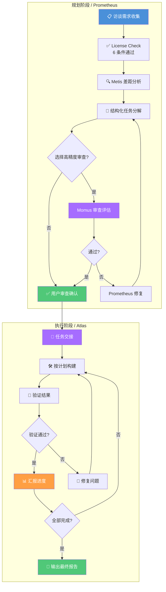

# Prometheus 规划模式

> 先计划后执行：通过访谈式需求收集生成结构化计划，再由 Atlas 指挥官协调执行的全流程编排模式。

## 文章概述

Prometheus 规划模式（`@plan`）是 oh-my-openagent 提供的"先计划后执行"工作流。当需求不明确、需要每一步都有操作记录、或涉及多方利益时，Prometheus 模式通过访谈式需求收集与结构化计划，帮你从模糊到清晰，再由 Atlas 指挥官精准执行。

读完本文，你将能够运用 Prometheus 模式将模糊需求转化为可执行的结构化计划，理解 Atlas 执行指挥官的协调机制，以及在 Ultrawork、Prometheus 和传统 **Prompt（提示词）** 之间做出合理选择。

本文深入讲解 Prometheus 模式的工作原理、Atlas 执行指挥官的角色、`/start-work` 命令的集成方式，并通过三路对比帮助你在 Ultrawork、Prometheus 和传统 Prompt 之间做出合理选择。

> **⏱ 时间有限？先读这些：** 什么是 Prometheus 模式 → 如何启动 → 访谈式需求收集 → Atlas 执行

### 什么是 Prometheus 模式

Ultrawork 模式擅长"先干再说"，**Agent（智能体）** 自主探索、即时实现。但有些场景需要"先说清楚再干"：需求不明确、涉及多方利益、需要审计轨迹。这就是 Prometheus 模式的用武之地。

Prometheus 模式（`@plan`）采用**访谈式需求收集**的工作方式。与 Ultrawork 的"你说目标我干活"不同，Prometheus 会主动向你提问，逐步澄清需求，直到形成一份结构化的执行计划。这份计划经过你的确认后，才交由执行指挥官 Atlas 去执行。

**核心流程**：

```text:terminal
访谈阶段：Prometheus 提问 → 你回答 → 需求逐渐清晰
规划阶段：Prometheus 分析需求 → 生成结构化计划 → 你确认
执行阶段：Atlas 接手计划 → 按步骤执行 → 验证结果 → 汇报完成
```

### 如何启动 Prometheus 模式

有两种方式进入 Prometheus 规划模式：

| 方式 | 说明 |
|------|------|
| **Tab 切换** | 在当前会话中按 Tab 切换到 Prometheus Agent |
| **`@plan` 快捷指令** | 在 Sisyphus 会话中输入 `@plan` 触发规划流程 |

> `@plan` 是 Prometheus 规划模式的快捷触发命令，对应第 2 章工作流模式中提到的 `prometheus` 命令，两者功能相同，`@plan` 为更直观的别名。

**使用示例**：

```bash:terminal
# 在 Sisyphus 中启动规划模式
@plan 为订单系统添加批量导出功能

# Prometheus 会开始提问：
# "批量导出的数据格式是什么？CSV 还是 Excel？"
# "是否支持筛选条件？"
# "导出文件的最大行数限制是多少？"
```

> Prometheus 模式仅使用 `@plan` 作为快捷入口，或通过 Agent 切换（Tab 键）直接进入。`@plan` 是 oh-my-openagent 提供的规划模式命令，对应第 2 章工作流模式中提到的 `prometheus` 命令。

### Atlas 执行指挥官角色

当 Prometheus 完成计划生成并获得确认后，**Atlas** 作为执行指挥官接手后续工作。

**Atlas 的职责**：

| 职责 | 说明 |
|------|------|
| **计划拆解** | 将结构化计划拆分为可执行的子任务，每个任务控制在 2-5 分钟 |
| **任务分配** | 根据任务类型选择合适的子 Agent 执行，隔离权限边界 |
| **进度监控** | 跟踪每个子任务的执行状态，更新进度看板 |
| **质量验证** | 对执行结果进行 LSP 检查、测试运行、代码审查 |
| **异常处理** | 遇到问题时汇报状态并协商调整方案，不擅自变更计划 |

**Atlas 不在时**：Prometheus 生成计划后，由当前 Agent 直接执行。此时规划与执行由同一 Agent 完成，适合简单任务。

**Atlas 在时（推荐）**：Prometheus 专注于"想清楚"，Atlas 专注于"做到位"。角色分离带来几个好处：

1. **专注度提升**：规划 Agent 不用考虑实现细节，执行 Agent 不用反复确认需求
2. **审计轨迹**：计划是执行前的明确约定，完成后可以逐条对照检查
3. **可中断恢复**：Atlas 执行过程中可以随时暂停，检查进度后继续

> **License Check 机制**：每轮访谈结束后，Prometheus 自动执行 6 项条件检查。只有当全部条件满足时，才会自动进入计划生成阶段：
>
> | # | 条件 | 说明 |
> |---|------|------|
> | 1 | **核心目标清晰** | 能够用一句话说清要做什么 |
> | 2 | **范围边界确定** | 明确了"做什么"和"不做什么" |
> | 3 | **无严重歧义** | 关键术语和技术方案没有二义性 |
> | 4 | **技术路径确定** | 确定了主要技术选型和实现方式 |
> | 5 | **测试策略确认** | 明确了测试覆盖范围和验收方式 |
> | 6 | **无阻塞性问题** | 没有影响执行的未解决依赖或风险 |
>
> 如果 License Check 未通过，Prometheus 继续提问，直到条件全部满足。

### /start-work 命令集成

`/start-work` 是 Prometheus 模式的启动命令，用于将 Prometheus 生成的计划正式移交给执行阶段。它基于 `.sisyphus/boulder.json` 实现会话连续性：

**三种运行模式**：

| 模式 | 条件 | 行为 |
|------|------|------|
| **Check（检测）** | 执行时检查 `.sisyphus/boulder.json` 是否存在 | 判断当前状态：有新计划则执行，无计划则提示 |
| **Resume（恢复）** | `boulder.json` 存在且有未完成任务 | 读取状态快照 → 计算完成进度 → 注入延续提示 → 从中断处继续 |
| **Init（初始化）** | `boulder.json` 不存在 | 查找最新计划 → 创建新 `boulder.json` → 将会话 Agent 切换为 Atlas → 开始执行 |

```bash:terminal
# 在 Prometheus 完成规划后，使用 /start-work 开始执行
/start-work

# 指定计划执行（可选）
/start-work my-plan-name
```

**执行流程**：

```mermaid
flowchart TB
    START([用户输入目标])

    subgraph 规划阶段（Prometheus）
        A[用户输入目标] --> B[Prometheus 提问澄清]
        B --> C{License Check<br/>6 条件通过?}
        C -->|否| B
        C -->|是| D[Metis 差距分析<br/>查漏补缺]
        D --> E[生成结构化计划]
        E --> F{用户选择<br/>高精度审查?}
        F -->|否| G[用户确认计划]
        F -->|是| H[Momus 审查计划<br/>4 维度评估]
        H --> I{所有标准通过?}
        I -->|否| J[Prometheus 修复计划]
        J --> E
        I -->|是| G
    end

    subgraph 执行阶段（Atlas）
        G --> K["/start-work 启动执行"]
        K --> L[拆解子任务]
        L --> M[分配子任务给 Agent]
        M --> N[执行实现]
        N --> O[验证结果]
        O --> P{验证通过?}
        P -->|否| Q[分析失败原因]
        Q --> M
        P -->|是| R[汇总执行结果]
    end

    subgraph 完成阶段
        R --> S[输出完成报告]
        S --> T[更新计划状态]
    end

    style A fill:#4A90D9,color:#fff
    style E fill:#FF9F43,color:#fff
    style H fill:#A66CFF,color:#fff
    style K fill:#A66CFF,color:#fff
    style L fill:#50C878,color:#fff
    style R fill:#50C878,color:#fff
    style S fill:#4A90D9,color:#fff
```

**参数配置**：

`/start-work` 接受一个可选参数指定计划名称。会话连续性基于 `boulder.json` 自动判断：

| 参数 | 说明 | 示例 |
|------|------|------|
| `[plan-name]` | 可选，指定要执行的计划名称 | `/start-work my-plan` |
| *无参数* | 自动检测：有 `boulder.json` 则恢复，否则初始化最新计划 | `/start-work` |

### Prometheus vs Ultrawork vs 传统 Prompt

这三者代表了从"精确指令"到"目标驱动"光谱上的不同位置。关于三种模式的详细对比（工作方式、需求明确度、人工介入、审计轨迹、Token 消耗等维度），请参见 [Ultrawork 模式的对比表](ultrawork-mode.md)。

**快速选择指南**：

```text:terminal
需求明确 + 需要精确控制 → 传统 Prompt
需求模糊 + 需要审计轨迹 → Prometheus 模式
需求模糊 + 追求效率 → Ultrawork 模式
```

### 完整工作流程：Plan → Execute

Prometheus 的完整流程分为两个大阶段：

**Plan 阶段（由 Prometheus 负责）**：

1. **Interview（访谈）**：Prometheus 通过提问收集需求，类似分析师与客户的对话。每个问题都有目的，帮助你发现自己没想清楚的地方。每轮访谈后自动执行 License Check（见上文）
2. **Metis 差距分析（强制性）**：License Check 通过后，Metis 作为独立审查者介入，对已收集的需求进行差距分析。Metis 的视角不同于 Prometheus——它专注于发现被忽略的边界条件、隐式假设和缺失的非功能需求。Metis 发现的问题会被**静默集成**到 Prometheus 的后续提问中，对用户透明
3. **Structure（结构化）**：生成包含任务分解、时序安排、验收标准的执行计划，每项任务包含具体文件和预期结果
4. **Review（审查）**：将计划呈现给你审查，确认任务分解是否合理、验收标准是否完整
5. **Momus 高精度审查（可选）**：如果你选择"高精度审查"，Momus 以 4 项标准评估计划质量——**清晰度**（每项任务描述是否无歧义）、**可验证性**（每项验收标准是否对应具体文件引用）、**上下文完整度**（是否有足够的背景信息让执行者理解意图）、**大局观**（是否与整体架构一致）。仅在 Momus 返回 **OKAY** 且满足以下条件时才通过：100% 文件引用路径可验证、≥80% 任务包含参考来源、≥90% 任务有具体的验收标准、零业务逻辑假设。不通过时，Prometheus 修复计划并重新提交给 Momus（无最大重试限制）

**Execute 阶段（由 Atlas 负责）**：

1. **Handoff（交接）**：Atlas 接收计划，理解任务范围和优先级
2. **Build（构建）**：按计划逐步实现，每完成一个子任务标记进度并同步状态
3. **Verify（验证）**：对每个交付物进行 LSP 检查、测试运行、质量评估
4. **Decide（决策）**：根据验证结果决定下一步——继续执行、修正问题还是调整计划

**完整流程图**：



> **重要约束**：Prometheus **从不写代码**。它只在 `.sisyphus/` 目录中创建和修改 Markdown 文件（计划、笔记、状态记录）。所有代码编写由 Atlas 指挥官委派给子代理执行。这种角色分离确保了"规划者不执行"的原则，避免了规划阶段引入实现细节的干扰。

### .sisyphus/ 目录约定

Prometheus 模式的所有产物都存储在 `.sisyphus/` 目录中，遵循以下结构：

| 路径 | 用途 | 说明 |
|------|------|------|
| `.sisyphus/drafts/{topic-slug}.md` | 访谈草稿 | 访谈阶段的原始需求记录，按主题 slug 命名 |
| `.sisyphus/plans/{name}.md` | 执行计划 | 经过 License Check 和 Metis 审查的正式计划 |
| `.sisyphus/boulder.json` | 状态跟踪 | 当前执行进度的 JSON 快照，支持中断恢复 |
| `.sisyphus/notepads/{plan-name}/` | 知识笔记 | 按计划名组织的知识库，存储执行过程中的发现和决策 |

> `.sisyphus/boulder.json` 是会话连续性的核心——它记录了当前执行状态、已完成任务列表、未完成任务列表和上下文摘要。`/start-work` 依赖它来判断是初始化新计划还是恢复已有执行。

### 错误恢复机制

Prometheus 模式内置了多层错误恢复：

| 错误场景 | 恢复行为 |
|----------|----------|
| **License Check 未通过** | 继续访谈，Prometheus 针对未满足的条件提问，直到全部通过 |
| **Metis 发现严重问题** | Metis 发现的差距被**静默集成**到后续访谈中，对用户完全透明 |
| **Momus 拒绝计划** | Prometheus 修复不通过的项目并重新提交给 Momus。**无最大重试限制**，直到计划通过所有标准 |
| **boulder.json 损坏** | `/start-work` 显示"未找到活跃计划"错误。解决方案：手动清理或使用有效计划重新初始化 |
| **Atlas 不可用** | 回退链检查：Atlas → Sisyphus → 当前会话 Agent。逐级降级，至少保证基本执行能力 |

### Agent 依赖链

```text:terminal
Prometheus → License Check → Metis（强制性差距分析）
                         → Plan Generation → 用户确认
                                           → Momus（可选高精度审查）
                                                         → Atlas → 子 Agent（执行）
```

各角色职责：

| Agent | 职责 | 阶段 |
|-------|------|------|
| **Prometheus** | 访谈式需求收集、License Check、计划生成 | 规划 |
| **Metis** | 强制性差距分析，发现被忽略的隐式假设和边界条件 | 规划审查 |
| **Momus** | 可选高精度审查，按 4 维度评估计划质量 | 规划审查 |
| **用户** | 确认计划、选择是否启用 Momus 审查 | 规划决策 |
| **Atlas** | 接收计划、委派执行、监控进度、质量验证 | 执行 |
| **子 Agent** | 执行具体的代码编写任务 | 执行实现 |

### 实际应用示例

假设你要为一个旧项目添加用户权限管理功能，但需求不太明确：

```bash:terminal
@plan 为用户管理添加基于角色的权限控制
```

Prometheus 的访谈过程：

```text:terminal
Prometheus: "你提到基于角色的权限控制，具体有哪些角色？"
你: "管理员和普通用户"
Prometheus: "管理员有哪些特殊权限？"
你: "用户管理、系统配置、数据导出"
Prometheus: "普通用户可以做什么？"
你: "只能查看自己的数据"
Prometheus: "权限是和用户绑定还是和角色绑定？"
你: "和角色绑定，这样便于批量管理"
```

访谈完成后，Prometheus 生成结构化计划：

```markdown:terminal
## 执行计划：用户权限管理

### 任务分解
1. 定义 Role 枚举（admin/user）
2. 扩展 User 模型添加 role 字段
3. 实现权限检查中间件
4. 更新 API 路由添加权限验证
5. 添加数据库迁移
6. 编写测试用例

### 验收标准
- [ ] Role 枚举定义正确
- [ ] 用户模型包含 role 字段
- [ ] 管理员可以访问管理接口
- [ ] 普通用户无法越权
- [ ] 所有测试通过

### 预计工作量
- 修改文件：4 个
- 新增文件：2 个
- 测试用例：8 个
```

确认计划后，执行 `/start-work`，Atlas 按步骤执行。每个步骤完成后自动验证，失败时自动重试，直到全部完成或达到最大重试次数。

### 实战场景：需求中途变更时的处理流程

Prometheus 模式的一个关键优势是在执行过程中处理需求变更。假设权限管理功能执行到一半时，你意识到需要添加"超级管理员"角色：

```text:terminal
你: "等等，还需要一个超级管理员角色，拥有所有权限"

Atlas: "收到需求变更请求。正在评估影响范围..."

[Atlas 暂停当前任务，分析变更影响]
→ 当前进度：3/6 任务已完成
→ 受影响的任务：任务 2（User 模型）、任务 4（API 路由权限验证）
→ 新增任务：超级管理员角色定义、特殊权限检查

Atlas: "需求变更影响评估完成：
        - 已完成的 3 个任务不受影响
        - 任务 2（User 模型）需要追加 super_admin 角色值
        - 任务 4（API 路由）需要添加超级管理员免检逻辑
        - 新增 1 个任务：超级管理员权限矩阵
        是否按此调整计划？[Y/n]"

你: "Y"

Atlas: "计划已更新。继续执行：
        任务 4：API 路由权限验证（含 super_admin 免检）
        新增任务 7：超级管理员权限矩阵"
```

**技术实现**：Atlas 在收到变更请求时，会重新计算当前计划的影响范围，生成差异分析（diff），并标记受影响的任务为"需修改"。已完成的、不受影响的任务保持完成状态。这种增量式变更处理避免了从头重新规划的浪费。

### 审计轨迹输出示例

Prometheus 模式对每一步都有完整记录。以下是一个典型的审计轨迹输出：

```markdown:terminal
# Prometheus 审计报告
## 会话信息
- 会话 ID: prom-20260602-001
- 用户: developer@example.com
- 规划时间: 2026-06-02 14:00:00 - 14:25:00
- 执行时间: 2026-06-02 14:30:00 - 15:45:00
- 状态: 已完成

## 规划阶段访谈记录
| 轮次 | Prometheus 提问 | 用户回答 |
|------|----------------|---------|
| 1 | 需要支持哪些角色？ | 管理员和普通用户 |
| 2 | 管理员有哪些特殊权限？ | 用户管理、系统配置、数据导出 |
| 3 | 权限是和用户绑定还是和角色绑定？ | 和角色绑定 |

## 执行计划（原始）
- 任务 1: 定义 Role 枚举 → ✅ 已完成
- 任务 2: 扩展 User 模型添加 role 字段 → ✅ 已完成
- 任务 3: 实现权限检查中间件 → ✅ 已完成
- 任务 4: 更新 API 路由添加权限验证 → ✅ 已完成
- 任务 5: 添加数据库迁移 → ✅ 已完成
- 任务 6: 编写测试用例 → ✅ 已完成

## 需求变更记录
| 时间 | 变更类型 | 变更内容 | 影响范围 |
|------|---------|---------|---------|
| 15:00 | 角色新增 | 添加超级管理员 | 任务 2、4 追加修改 |

## 验证结果
| 检查项 | 结果 | 详情 |
|--------|------|------|
| LSP 类型检查 | ✅ 通过 | 无类型错误 |
| 单元测试 | ✅ 通过 | 8/8 测试通过 |
| 安全审查 | ✅ 通过 | 无越权漏洞 |

## 最终交付物
- 新增文件: 3 个
- 修改文件: 4 个
- 测试用例: 8 个
```

审计轨迹展示了规划的完整生命周期：从访谈阶段的需求澄清，到执行阶段的逐任务状态跟踪，再到需求变更的增量更新，最终到验证结果的完整记录。这使得 Prometheus 模式在合规审计场景中具有独特价值。

### Token 消耗参考

Prometheus 模式的 Token 消耗分为两个阶段：

| 阶段 | 典型 Token 范围 | 说明 |
|------|----------------|------|
| **规划阶段（访谈 + 计划生成）** | 10K-30K tokens | 访谈轮数越多，消耗越高 |
| **执行阶段（Atlas 执行）** | 视任务而定 | 与子任务数量和复杂度正相关 |

相比 Ultrawork 的探索式执行，Prometheus 的规划阶段增加了固定的"访谈开销"，但执行阶段的 Token 消耗更可控，因为计划已经明确了执行边界。

### Prometheus 的最佳实践

1. **提供开放式的初始描述**：不需要把需求想得很清楚再输入。Prometheus 会帮你澄清。给一个方向性的描述即可，比如"想加个报表功能"而不是"在 src/reports/ 下创建 Excel 导出功能"。

2. **认真回答访谈问题**：Prometheus 问的每个问题都有目的。回答越详细，生成的计划越准确。如果觉得问题不合适，可以直接说"这个问题不重要，跳过"。

3. **审查计划后再执行**：生成计划后花一分钟审查。确认任务分解是否合理、验收标准是否完整、时序安排是否可行。在这个阶段修改成本最低。

4. **复杂项目使用 Atlas**：超过 5 个子任务的项目，建议配置 Atlas 作为执行指挥官。角色分离能显著提高执行质量和可追踪性。

5. **与 Ultrawork 搭配使用**：Prometheus 做规划、Ultrawork 做执行是一种高效组合。Prometheus 生成计划后，可以切换到 Ultrawork 模式执行具体子任务，发挥各自优势。

---

## 常见反模式

### 跳过 Prometheus 规划阶段直接让 Agent 编码

**现象**：用户嫌 Prometheus 的访谈阶段"浪费时间"，跳过规划直接让 Agent 开始实现。

**原因**：习惯了传统 Prompt 模式"直接说要什么"的工作流，不适应 Prometheus 的访谈式需求澄清。

**对策**：理解 Prometheus 的规划阶段不是"额外开销"，而是"关键的质量门禁"。规划阶段的投入可以在实现阶段 5 倍收回——避免因为需求理解偏差导致的返工。对于极简单的变更（如改 typo），直接使用传统 Prompt 模式即可。

### 规划阶段过度细化

**现象**：在规划阶段花费大量时间推敲每个细节，包括具体的代码实现方案，导致规划本身比实现还耗时。

**原因**：Prometheus 的访谈让用户产生"必须一次想清楚"的压力，实际上有些细节在实现阶段才能确定。

**对策**：规划阶段聚焦于"做什么"和"怎么做"，而不是"具体代码怎么写"。实现细节留给 Atlas 或 Ultrawork 在执行阶段处理。Prometheus 问的问题如果超出当前认知范围，直接回答"这个到时候再定"。

## 常见错误与陷阱

### 规划过于理想化

**场景**：Prometheus 生成的计划没有考虑技术债务和现有约束，实现阶段发现大量需要重构的前置条件。

**后果**：计划频繁变更，执行膨胀。Atlas 执行时不断遇到规划阶段未预期的障碍。

**预防**：在访谈阶段主动向 Prometheus 提供技术约束信息：现有代码质量状况、依赖版本限制、团队技术栈偏好。让计划建立在实际基础上而非理想假设上。

### 访谈信息过少导致计划偏差

**场景**：用户输入模糊的初始描述（如"加个报表功能"），Prometheus 生成了过于通用的计划。

**后果**：自动生成的计划模板化严重，可能不匹配用户的真实业务需求。

**预防**：初始描述中至少提供业务背景和目标用户信息，这对生成有针对性的计划至关重要。回答访谈问题时尽可能具体。

## 适用场景与限制

Prometheus 模式适用于需求模糊但需要审计轨迹的场景。典型场景包括：跨模块重构、涉及多方利益的功能变更、需要合规审批的生产环境变更。Plan 文件本身就是审计证据。

以下情况 Prometheus 可能引入不必要的开销：单文件的小修改（改 typo、调样式）——直接用传统 Prompt 模式；Agent 完全清楚实现路径的日常任务——Ultrawork 效率更高；紧急 Bug 修复——跳过规划直接修复。

Prometheus 的访谈阶段会消耗约 2-5K Token，对于复杂项目可能更多。这部分"规划成本"在实现阶段通常可以收回。计划生成后建议花 1 分钟审查，确认分解是否合理、验收标准是否完整——在这个阶段修改成本最低。

## 学习检查清单

完成本章学习后，请确认你能够：

- [ ] 理解 Prometheus 规划模式的访谈式需求收集流程
- [ ] 理解两种启动 Prometheus 模式的方式（Tab 切换 / `@plan` 快捷指令）
- [ ] 了解 Atlas 执行指挥官的职责和角色分离的好处
- [ ] 使用 `/start-work` 命令启动 Prometheus 计划执行
- [ ] 比较 Prometheus、Ultrawork 和传统 Prompt 三种模式的差异
- [ ] 判断何时选择 Prometheus 模式（需求模糊+需要审计轨迹）

---

## 关联章节

- ← [Ultrawork 模式](ultrawork-mode.md) — "探索优先" vs "计划优先"
- ← [工作流模式](../02-core-concepts/workflow-patterns.md) — Prometheus 作为高级工作流模式的概念介绍
- ← [oh-my-openagent 集成](../03-setup/oh-my-openagent-setup.md) — OMO 中 Prometheus Agent 的配置
- → [多 Agent 协作](multi-agent-collab.md) — 高级工作流中的多 Agent 实践
