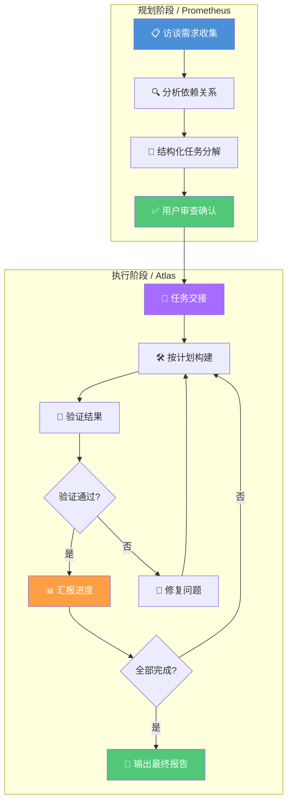

# Prometheus 规划模式

> 先计划后执行：通过访谈式需求收集生成结构化计划，再由 Atlas 指挥官协调执行的全流程编排模式。

## 文章概述

Prometheus 规划模式（`@plan`）是 oh-my-openagent 提供的"先计划后执行"工作流。当需求模糊、需要审计轨迹或涉及多方利益时，Prometheus 模式通过访谈式需求收集与结构化计划，帮你从模糊到清晰，再由 Atlas 指挥官精准执行。

本文深入讲解 Prometheus 模式的工作原理、Atlas 执行指挥官的角色、`/start-work` 命令的集成方式，并通过三路对比帮助你在 Ultrawork、Prometheus 和传统 Prompt 之间做出合理选择。

### 什么是 Prometheus 模式

Ultrawork 模式擅长"先干再说"，Agent 自主探索、即时实现。但有些场景需要"先说清楚再干"：需求不明确、涉及多方利益、需要审计轨迹。这就是 Prometheus 模式的用武之地。

Prometheus 模式（`@plan`）采用**访谈式需求收集**的工作方式。与 Ultrawork 的"你说目标我干活"不同，Prometheus 会主动向你提问，逐步澄清需求，直到形成一份结构化的执行计划。这份计划经过你的确认后，才交由执行指挥官 Atlas 去执行。

**核心流程**：

```
访谈阶段：Prometheus 提问 → 你回答 → 需求逐渐清晰
规划阶段：Prometheus 分析需求 → 生成结构化计划 → 你确认
执行阶段：Atlas 接手计划 → 按步骤执行 → 验证结果 → 汇报完成
```

### @plan 与 @general 命令区分

Prometheus 模式通过两条命令区分"规划"和"对话"两种状态：

| 命令 | 触发模式 | 适用阶段 | 行为 |
|------|---------|---------|------|
| `@plan` | 规划模式 | 需求收集与计划生成 | Prometheus 启动访谈，主动提问澄清需求，输出结构化计划 |
| `@general` | 对话模式 | 日常对话、快速问答 | 普通对话模式，不触发规划流程 |

**使用示例**：

```bash
# 启动规划模式
@plan 为订单系统添加批量导出功能

# Prometheus 会开始提问：
# "批量导出的数据格式是什么？CSV 还是 Excel？"
# "是否支持筛选条件？"
# "导出文件的最大行数限制是多少？"
```

`@plan` 和 `@general` 可以在同一会话中切换。当你通过 `@plan` 生成计划后，可以切换到 `@general` 进行细节讨论：

```bash
@general 刚才的计划中，导出性能要求提到"不超过 30 秒"，这个要求是基于什么场景？
```

### Atlas 执行指挥官角色

当 Prometheus 完成计划生成并获得确认后，**Atlas** 作为执行指挥官接手后续工作。

**Atlas 的职责**：

| 职责 | 说明 |
|------|------|
| **计划拆解** | 将结构化计划拆分为可执行的子任务，每个任务控制在 2-5 分钟 |
| **任务分配** | 根据任务类型选择合适的子 Agent 执行，隔离权限边界 |
| **进度监控** | 跟踪每个子任务的执行状态，更新进度看板 |
| **质量验证** | 对执行结果进行 LSP 检查、测试运行、代码审查 |
| **异常处理** | 遇到问题时汇报状态并协商调整方案，不擅自变更计划 |

**Atlas 不在时**：Prometheus 生成计划后，由当前 Agent 直接执行。此时规划与执行由同一 Agent 完成，适合简单任务。

**Atlas 在时（推荐）**：Prometheus 专注于"想清楚"，Atlas 专注于"做到位"。角色分离带来几个好处：

1. **专注度提升**：规划 Agent 不用考虑实现细节，执行 Agent 不用反复确认需求
2. **审计轨迹**：计划是执行前的明确约定，完成后可以逐条对照检查
3. **可中断恢复**：Atlas 执行过程中可以随时暂停，检查进度后继续

### /start-work 命令集成

`/start-work` 是 Prometheus 模式的启动命令，用于将 Prometheus 生成的计划正式移交给执行阶段。

```bash
# 在 Prometheus 完成规划后，使用 /start-work 开始执行
/start-work
```

**执行流程**：

```mermaid
flowchart TB
    E[用户确认计划]

    subgraph 规划阶段（Prometheus）
        A[用户输入目标] --> B[Prometheus 提问澄清]
        B --> C{需求足够清晰?}
        C -->|否| B
        C -->|是| D[生成结构化计划]
        D --> E
    end

    subgraph 执行阶段（Atlas）
        E --> F["/start-work 启动执行"]
        F --> G[拆解子任务]
        G --> H[分配子任务给 Agent]
        H --> I[执行实现]
        I --> J[验证结果]
        J --> K{验证通过?}
        K -->|否| L[分析失败原因]
        L --> H
        K -->|是| M[汇总执行结果]
    end

    subgraph 完成阶段
        M --> N[输出完成报告]
        N --> O[更新计划状态]
    end

    style A fill:#4A90D9,color:#fff
    style D fill:#FF9F43,color:#fff
    style F fill:#A66CFF,color:#fff
    style G fill:#50C878,color:#fff
    style M fill:#50C878,color:#fff
    style N fill:#4A90D9,color:#fff
```

**参数配置**：

`/start-work` 支持可选参数，用于控制执行行为：

| 参数 | 说明 | 示例 |
|------|------|------|
| `--step` | 从指定步骤开始执行 | `/start-work --step 3` |
| `--dry-run` | 仅展示执行计划，不实际执行 | `/start-work --dry-run` |
| `--interactive` | 每步执行前请求确认 | `/start-work --interactive` |
| `--resume` | 从中断处恢复执行 | `/start-work --resume` |

### Prometheus vs Ultrawork vs 传统 Prompt

这三者代表了从"精确指令"到"目标驱动"光谱上的不同位置：

| 维度 | 传统 Prompt | Prometheus 模式 | Ultrawork 模式 |
|------|-----------|----------------|---------------|
| **工作方式** | 手动写明所有步骤 | 访谈收集需求 → 结构化计划 → 自动执行 | Agent 自主探索并实现 |
| **需求明确度** | 用户必须完全清楚 | 逐步澄清，从模糊到明确 | 用户只需描述目标 |
| **人工介入** | 高（全程指导） | 中（访谈 + 确认计划） | 低（设定目标后放手） |
| **审计轨迹** | 高（步骤清晰可查） | 高（计划可逐条对照） | 低（过程不透明） |
| **启动速度** | 快（直接写 Prompt） | 中（需完成访谈阶段） | 快（一句话目标） |
| **探索深度** | 浅（受限于指令范围） | 中（按计划执行，边界可控） | 深（Agent 自动发现） |
| **适合场景** | 关键业务、安全敏感 | 需求模糊 + 需要审计 | 快速原型、探索任务 |
| **Token 消耗** | 可控 | 中上（访谈阶段有开销） | 较高（探索阶段开销大） |

**选择指南**：

```
需求明确 + 需要精确控制 → 传统 Prompt
需求模糊 + 需要审计轨迹 → Prometheus 模式
需求模糊 + 追求效率 → Ultrawork 模式
```

### 完整工作流程：Plan → Execute

Prometheus 的完整流程分为两个大阶段：

**Plan 阶段（由 Prometheus 负责）**：

1. **Interview（访谈）**：Prometheus 通过提问收集需求，类似分析师与客户的对话。每个问题都有目的，帮助你发现自己没想清楚的地方
2. **Analyze（分析）**：将收集到的需求整理和分类，识别依赖关系、技术约束和潜在风险
3. **Structure（结构化）**：生成包含任务分解、时序安排、验收标准的执行计划，每项任务包含具体文件和预期结果
4. **Review（审查）**：将计划呈现给你审查，确认任务分解是否合理、验收标准是否完整

**Execute 阶段（由 Atlas 负责）**：

1. **Handoff（交接）**：Atlas 接收计划，理解任务范围和优先级
2. **Build（构建）**：按计划逐步实现，每完成一个子任务标记进度并同步状态
3. **Verify（验证）**：对每个交付物进行 LSP 检查、测试运行、质量评估
4. **Decide（决策）**：根据验证结果决定下一步——继续执行、修正问题还是调整计划

**完整流程图**：



### 实际应用示例

假设你要为一个旧项目添加用户权限管理功能，但需求不太明确：

```bash
@plan 为用户管理添加基于角色的权限控制
```

Prometheus 的访谈过程：

```
Prometheus: "你提到基于角色的权限控制，具体有哪些角色？"
你: "管理员和普通用户"
Prometheus: "管理员有哪些特殊权限？"
你: "用户管理、系统配置、数据导出"
Prometheus: "普通用户可以做什么？"
你: "只能查看自己的数据"
Prometheus: "权限是和用户绑定还是和角色绑定？"
你: "和角色绑定，这样便于批量管理"
```

访谈完成后，Prometheus 生成结构化计划：

```markdown
## 执行计划：用户权限管理

### 任务分解
1. 定义 Role 枚举（admin/user）
2. 扩展 User 模型添加 role 字段
3. 实现权限检查中间件
4. 更新 API 路由添加权限验证
5. 添加数据库迁移
6. 编写测试用例

### 验收标准
- [ ] Role 枚举定义正确
- [ ] 用户模型包含 role 字段
- [ ] 管理员可以访问管理接口
- [ ] 普通用户无法越权
- [ ] 所有测试通过

### 预计工作量
- 修改文件：4 个
- 新增文件：2 个
- 测试用例：8 个
```

确认计划后，执行 `/start-work`，Atlas 按步骤执行。每个步骤完成后自动验证，失败时自动重试，直到全部完成或达到最大重试次数。

### Prometheus 的最佳实践

1. **提供开放式的初始描述**：不需要把需求想得很清楚再输入。Prometheus 会帮你澄清。给一个方向性的描述即可，比如"想加个报表功能"而不是"在 src/reports/ 下创建 Excel 导出功能"。

2. **认真回答访谈问题**：Prometheus 问的每个问题都有目的。回答越详细，生成的计划越准确。如果觉得问题不合适，可以直接说"这个问题不重要，跳过"。

3. **审查计划后再执行**：生成计划后花一分钟审查。确认任务分解是否合理、验收标准是否完整、时序安排是否可行。在这个阶段修改成本最低。

4. **复杂项目使用 Atlas**：超过 5 个子任务的项目，建议配置 Atlas 作为执行指挥官。角色分离能显著提高执行质量和可追踪性。

5. **与 Ultrawork 搭配使用**：Prometheus 做规划、Ultrawork 做执行是一种高效组合。Prometheus 生成计划后，可以切换到 Ultrawork 模式执行具体子任务，发挥各自优势。

---

## 学习检查清单

完成本章学习后，请确认你能够：

- [ ] 理解 Prometheus 规划模式的访谈式需求收集流程
- [ ] 区分 `@plan` 和 `@general` 命令的使用场景
- [ ] 了解 Atlas 执行指挥官的职责和角色分离的好处
- [ ] 使用 `/start-work` 命令启动 Prometheus 计划执行
- [ ] 比较 Prometheus、Ultrawork 和传统 Prompt 三种模式的差异
- [ ] 判断何时选择 Prometheus 模式（需求模糊+需要审计轨迹）

---

## 关联章节

- ← [Ultrawork 模式](ultrawork-mode.md) — "探索优先" vs "计划优先"
- ← [工作流模式](../02-core-concepts/workflow-patterns.md) — Prometheus 作为高级工作流模式的概念介绍
- ← [oh-my-openagent 集成](../03-setup/oh-my-openagent-setup.md) — OMO 中 Prometheus Agent 的配置
- → [多 Agent 协作](multi-agent-collab.md) — 高级工作流中的多 Agent 实践
