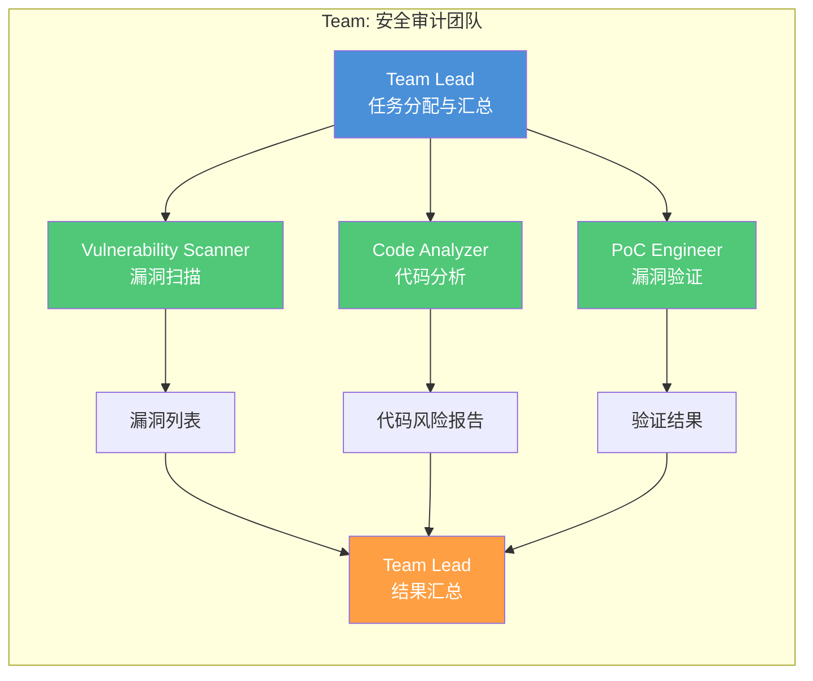
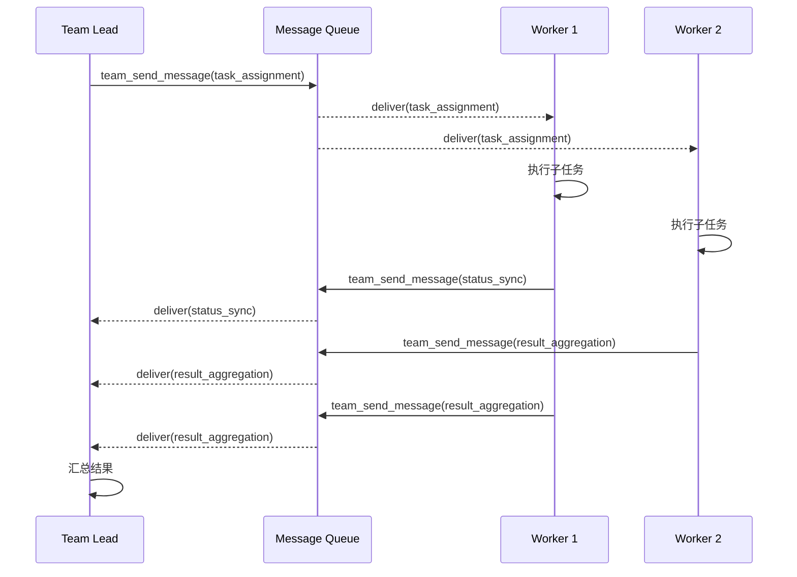
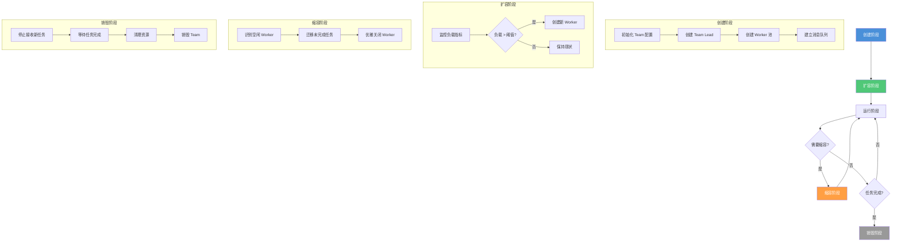
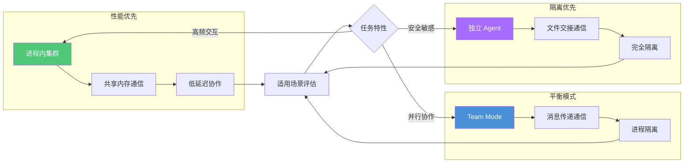
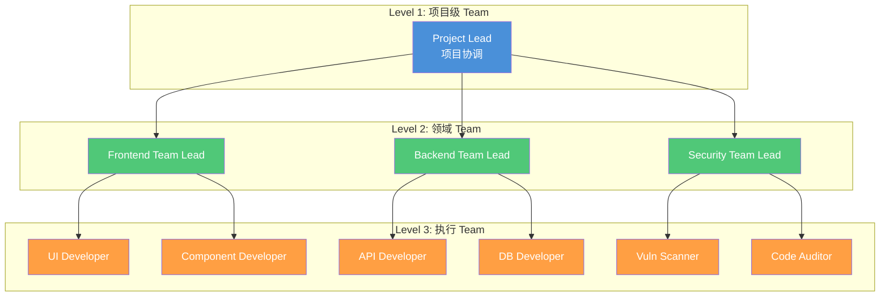

# Teams 多进程协作

> 超越单进程限制：多个独立 Agent 进程通过消息传递机制协同工作，构建大规模分布式 AI 编程流水线。

## 文章概述

当单进程无法满足复杂工程场景的需求时，Teams 多进程协作提供了解决方案。与 Agent 派生（父子关系）不同，Teams 是多个独立 Agent 进程的平级协作——每个 Team 成员都是独立的 Agent 实例，有自己的上下文、技能和生命周期，通过消息传递机制通信和同步。

本文从 Teams 的架构设计原则入手，解释为什么需要从单进程走向多进程协作。你会理解 Team 的成员角色定义、通信协议（`team_send_message` 的工作原理）和消息类型体系（任务分配、状态同步、结果汇总）。我们深入讨论进程内集群的优缺点——多个 Agent 在同一个进程内协作时，资源竞争和隔离问题如何管理，集群的生命周期如何维护。然后通过对比表分析 Team Mode 与独立 Agent 的适用场景，帮助你在性能与隔离性之间做出权衡。最后，讨论大规模 Teams 的工程实践：分层架构设计、监控和日志收集、故障恢复策略。

从后端架构师视角，我们将探讨多服务上下文的 Agent 编排策略；从架构顾问视角，我们将分析 Teams 架构的设计原则和权衡决策；从渗透测试员视角，我们将深入审查 Team Mode 的数据隔离安全边界。

---

## Teams 架构概述

### 为什么需要 Teams 架构

单进程 Agent 存在三个核心限制，这些限制在复杂工程场景中尤为突出：

1. **上下文窗口瓶颈**：单个 Agent 的上下文窗口有限，当任务涉及多个代码仓库、多种技术栈时，上下文溢出导致决策质量下降。后端架构师在微服务架构中经常面临这个问题——一个变更可能涉及 API 网关、认证服务、业务服务、数据库迁移等多个上下文。

2. **资源竞争问题**：CPU、内存、网络连接等资源在单进程内竞争。当 Agent 执行 CPU 密集型任务（代码分析）和 I/O 密集型任务（网络请求）时，资源竞争导致整体效率下降。

3. **故障隔离需求**：单进程内的任何错误都可能影响整个 Agent。当某个子任务失败（如依赖安装超时），可能导致主任务也被中断。

Teams 架构通过多进程协作解决这些问题：每个 Team 成员是独立的 Agent 进程，拥有独立的资源配额和故障边界。

### Team 的成员角色定义

Team 成员的角色定义遵循职责分离原则。每个成员专注于特定领域，通过消息传递协作完成复杂任务。



**角色定义配置示例**：

```json
{
  "team": {
    "name": "security-audit-team",
    "description": "安全审计团队：漏洞扫描、代码分析、漏洞验证",
    "members": [
      {
        "id": "team-lead",
        "role": "coordinator",
        "model": "claude-opus-4",
        "skills": ["overall-planning", "dispatching-parallel-agents"],
        "permissions": {
          "read": "allow",
          "edit": "deny",
          "bash": "deny",
          "team_send_message": "allow"
        },
        "responsibilities": ["任务分解", "进度监控", "结果汇总"]
      },
      {
        "id": "vuln-scanner",
        "role": "worker",
        "model": "claude-sonnet-4",
        "skills": ["vulnerability-manager", "blue-team-defender"],
        "permissions": {
          "read": "allow",
          "edit": "deny",
          "bash": "allow",
          "team_send_message": "allow"
        },
        "responsibilities": ["漏洞扫描", "CVE 匹配", "风险评分"]
      },
      {
        "id": "code-analyzer",
        "role": "worker",
        "model": "claude-sonnet-4",
        "skills": ["security-architect", "penetration-tester"],
        "permissions": {
          "read": "allow",
          "edit": "deny",
          "bash": "allow",
          "team_send_message": "allow"
        },
        "responsibilities": ["代码审计", "安全模式检查", "敏感数据发现"]
      },
      {
        "id": "poc-engineer",
        "role": "worker",
        "model": "claude-sonnet-4",
        "skills": ["elite-red-team-hacker", "penetration-tester"],
        "permissions": {
          "read": "allow",
          "edit": "ask",
          "bash": "ask",
          "team_send_message": "allow"
        },
        "responsibilities": ["漏洞验证", "PoC 编写", "修复建议"]
      }
    ]
  }
}
```

### 通信协议基础设计

Team 成员之间的通信基于消息传递协议，而非共享内存。这种设计确保了进程隔离性和故障独立性。

**消息类型体系**：

| 消息类型 | 方向 | 用途 | 优先级 |
|---------|------|------|--------|
| `task_assignment` | Lead → Worker | 分配子任务 | high |
| `status_sync` | Worker → Lead | 汇报执行状态 | medium |
| `result_aggregation` | Worker → Lead | 提交执行结果 | high |
| `error_report` | Any → Lead | 报告错误和异常 | critical |
| `heartbeat` | Any → Any | 存活检测 | low |

**消息队列设计**：

每个 Team 成员维护两个消息队列：

1. **入站队列（Inbound Queue）**：接收其他成员发送的消息
2. **出站队列（Outbound Queue）**：发送给其他成员的消息

队列配置示例：

```json
{
  "messageQueue": {
    "maxSize": 1000,
    "overflowStrategy": "drop_oldest",
    "priorityLevels": {
      "critical": { "weight": 100, "preempt": true },
      "high": { "weight": 75, "preempt": false },
      "medium": { "weight": 50, "preempt": false },
      "low": { "weight": 25, "preempt": false }
    },
    "timeout": {
      "send": 30000,
      "receive": 60000,
      "ack": 5000
    }
  }
}
```

---

## 消息传递机制

### team_send_message 的工作原理

`team_send_message` 是 Team Mode 的核心通信工具，实现了 Agent 间的异步消息传递。



**底层实现机制**：

1. **消息序列化**：消息体序列化为 JSON 格式，包含元数据（发送者、接收者、时间戳、优先级）
2. **队列路由**：根据接收者 ID 路由到目标成员的入站队列
3. **投递确认**：接收者确认收到消息后，从队列中移除
4. **超时重试**：未确认的消息在超时后重新投递

**team_send_message 参数详解**：

```json
{
  "team_send_message": {
    "to": "vuln-scanner",
    "type": "task_assignment",
    "priority": "high",
    "payload": {
      "task_id": "scan-001",
      "description": "扫描 /api/auth 路由的 SQL 注入漏洞",
      "context": {
        "target_files": ["src/api/auth.ts", "src/db/queries.ts"],
        "timeout": 300000
      },
      "expected_output": {
        "format": "vulnerability_report",
        "fields": ["vulnerability_type", "severity", "location", "payload"]
      }
    },
    "metadata": {
      "correlation_id": "audit-2024-001",
      "reply_to": "team-lead",
      "ttl": 600000
    }
  }
}
```

### 消息类型详解

#### 任务分配（Task Assignment）

Team Lead 向 Worker 分配子任务的消息类型：

```json
{
  "type": "task_assignment",
  "payload": {
    "task_id": "unique-task-id",
    "description": "任务描述",
    "skills_required": ["penetration-tester"],
    "context": {
      "files": ["path/to/file"],
      "constraints": {}
    },
    "deadline": "2024-01-15T10:00:00Z",
    "priority": "high"
  }
}
```

**任务分配策略**：

| 策略 | 描述 | 适用场景 |
|------|------|---------|
| **广播** | 所有 Worker 收到相同任务 | 冗余执行、竞争模式 |
| **轮询** | 依次分配给各 Worker | 均衡负载 |
| **能力匹配** | 根据 Skill 匹配最合适的 Worker | 专业任务 |
| **负载感知** | 分配给当前负载最低的 Worker | 动态调度 |

#### 状态同步（Status Sync）

Worker 向 Team Lead 汇报执行状态：

```json
{
  "type": "status_sync",
  "payload": {
    "task_id": "scan-001",
    "status": "in_progress",
    "progress": 45,
    "metrics": {
      "files_scanned": 12,
      "files_total": 27,
      "issues_found": 3
    },
    "eta": "2024-01-15T09:45:00Z"
  }
}
```

**状态类型**：

- `pending`：任务已接收，等待执行
- `in_progress`：任务执行中
- `blocked`：任务被阻塞（等待依赖）
- `completed`：任务完成
- `failed`：任务失败

#### 结果汇总（Result Aggregation）

Worker 提交执行结果给 Team Lead：

```json
{
  "type": "result_aggregation",
  "payload": {
    "task_id": "scan-001",
    "status": "completed",
    "output": {
      "vulnerabilities": [
        {
          "type": "SQL_INJECTION",
          "severity": "HIGH",
          "location": "src/api/auth.ts:45",
          "payload": "' OR '1'='1",
          "recommendation": "使用参数化查询"
        }
      ],
      "summary": {
        "total": 1,
        "high": 1,
        "medium": 0,
        "low": 0
      }
    },
    "artifacts": [
      {
        "type": "report",
        "path": "/tmp/scan-001-report.json"
      }
    ]
  }
}
```

### 消息队列优先级管理

消息队列支持优先级管理，确保关键消息优先处理：

```json
{
  "priorityManagement": {
    "levels": {
      "critical": {
        "weight": 100,
        "preempt": true,
        "examples": ["error_report", "security_alert"]
      },
      "high": {
        "weight": 75,
        "preempt": false,
        "examples": ["task_assignment", "result_aggregation"]
      },
      "medium": {
        "weight": 50,
        "preempt": false,
        "examples": ["status_sync", "query"]
      },
      "low": {
        "weight": 25,
        "preempt": false,
        "examples": ["heartbeat", "log"]
      }
    },
    "preemption": {
      "enabled": true,
      "threshold": 0.8,
      "action": "pause_lower_priority"
    }
  }
}
```

**超时机制**：

```json
{
  "timeoutConfig": {
    "message": {
      "send": 30000,
      "receive": 60000,
      "ack": 5000,
      "retry": {
        "maxAttempts": 3,
        "backoff": "exponential",
        "baseDelay": 1000
      }
    },
    "task": {
      "execution": 300000,
      "heartbeat": 30000,
      "gracefulShutdown": 10000
    }
  }
}
```

---

## 进程内集群

### 多 Agent 同进程协作的优缺点

进程内集群（In-Process Cluster）是指多个 Agent 在同一个进程内协作的模式。这种模式在特定场景下具有优势，但也存在明显的局限性。

**优势分析**：

| 维度 | 描述 | 后端架构师视角 |
|------|------|---------------|
| **通信延迟** | 进程内通信无网络开销 | 适合高频消息交互场景 |
| **资源共享** | 内存、连接池可共享 | 减少资源占用 |
| **状态同步** | 可使用共享内存 | 简化状态管理 |
| **调试便利** | 单进程调试更容易 | 降低运维复杂度 |

**劣势分析**：

| 维度 | 描述 | 渗透测试员视角 |
|------|------|---------------|
| **故障传播** | 一个 Agent 崩溃可能影响整个进程 | 安全边界模糊 |
| **资源竞争** | CPU、内存竞争导致性能下降 | DoS 攻击面增大 |
| **权限隔离** | 难以实现细粒度权限控制 | 权限提升风险 |
| **扩展性** | 无法水平扩展 | 单点瓶颈 |

### 资源竞争和隔离策略

进程内集群需要精心设计资源竞争和隔离策略：

**资源隔离配置**：

```json
{
  "resourceIsolation": {
    "cpu": {
      "strategy": "cfs_quota",
      "limits": {
        "team-lead": { "quota": 50, "period": 100 },
        "worker": { "quota": 100, "period": 100 }
      }
    },
    "memory": {
      "strategy": "cgroups",
      "limits": {
        "team-lead": "512MB",
        "worker": "1GB"
      },
      "oomPolicy": "kill_oldest"
    },
    "network": {
      "strategy": "bandwidth_limit",
      "limits": {
        "team-lead": "10MB/s",
        "worker": "50MB/s"
      }
    },
    "fileDescriptors": {
      "limit": 1024,
      "strategy": "per_agent"
    }
  }
}
```

**竞争检测和缓解**：

```json
{
  "contentionManagement": {
    "detection": {
      "cpuThreshold": 0.8,
      "memoryThreshold": 0.85,
      "networkThreshold": 0.9,
      "checkInterval": 5000
    },
    "mitigation": {
      "strategies": ["throttle", "queue", "reject"],
      "throttleThreshold": 0.9,
      "queueSize": 100,
      "rejectThreshold": 0.95
    }
  }
}
```

### 集群生命周期管理

进程内集群的生命周期管理包括创建、扩容、缩容、销毁四个阶段：



**生命周期配置**：

```json
{
  "lifecycle": {
    "creation": {
      "warmup": true,
      "prefetchSkills": true,
      "initTimeout": 60000
    },
    "scaling": {
      "minWorkers": 2,
      "maxWorkers": 10,
      "scaleUpThreshold": 0.7,
      "scaleDownThreshold": 0.3,
      "cooldownPeriod": 60000
    },
    "termination": {
      "gracefulShutdown": true,
      "taskCompletionTimeout": 300000,
      "forceKillTimeout": 60000
    }
  }
}
```

### 共享状态的一致性问题

进程内集群可以使用共享内存简化状态管理，但需要处理一致性问题：

**一致性模型选择**：

| 模型 | 描述 | 适用场景 | 性能影响 |
|------|------|---------|---------|
| **强一致性** | 所有读取返回最新写入 | 配置变更、权限更新 | 高 |
| **最终一致性** | 读取可能返回旧值，但最终一致 | 进度统计、日志收集 | 低 |
| **因果一致性** | 因果相关的操作保证顺序 | 任务依赖链 | 中 |

**状态同步配置**：

```json
{
  "stateSynchronization": {
    "model": "eventual_consistency",
    "sharedState": {
      "taskProgress": {
        "consistency": "eventual",
        "syncInterval": 5000,
        "conflictResolution": "last_write_wins"
      },
      "memberStatus": {
        "consistency": "strong",
        "syncInterval": 1000,
        "conflictResolution": "leader_decides"
      },
      "resourceQuota": {
        "consistency": "strong",
        "syncInterval": 500,
        "conflictResolution": "atomic_increment"
      }
    }
  }
}
```

---

## Team Mode vs 独立 Agent

### 适用场景对比

Team Mode 和独立 Agent 各有适用场景，选择取决于任务特性和工程约束。

| 维度 | Team Mode | 独立 Agent |
|------|-----------|-----------|
| **性能** | 高（并行执行） | 中（串行执行） |
| **隔离性** | 中（进程隔离） | 高（完全独立） |
| **资源消耗** | 高（多进程开销） | 低（单进程） |
| **复杂度** | 高（需协调机制） | 低（简单直接） |
| **故障容错** | 高（成员故障隔离） | 低（单点故障） |
| **调试难度** | 高（多进程调试） | 低（单进程调试） |
| **扩展性** | 高（可水平扩展） | 低（垂直扩展） |
| **通信开销** | 中（消息传递） | 无（内部调用） |

### 性能 vs 隔离性权衡

架构顾问需要在性能和隔离性之间做出权衡：



**权衡决策矩阵**：

| 任务特性 | 推荐模式 | 原因 |
|---------|---------|------|
| 高频消息交互（>100 msg/s） | 进程内集群 | 通信延迟敏感 |
| CPU 密集型并行任务 | Team Mode | 多核利用率高 |
| 安全敏感任务（渗透测试） | 独立 Agent | 隔离性优先 |
| I/O 密集型任务 | Team Mode | 并行 I/O 效率高 |
| 简单串行任务 | 独立 Agent | 避免协调开销 |
| 长时间运行任务 | Team Mode | 故障恢复能力强 |

### 混合模式设计

混合模式结合 Team Mode 和独立 Agent 的优势：部分 Team 成员在进程内运行，部分独立部署。

**混合架构配置**：

```json
{
  "hybridArchitecture": {
    "team": {
      "name": "fullstack-development-team",
      "mode": "hybrid",
      "inProcessMembers": [
        {
          "id": "coordinator",
          "role": "team-lead",
          "reason": "高频消息协调"
        },
        {
          "id": "frontend-worker",
          "role": "worker",
          "reason": "与 coordinator 紧密协作"
        }
      ],
      "independentMembers": [
        {
          "id": "security-auditor",
          "role": "specialist",
          "reason": "安全隔离需求",
          "isolation": {
            "workdir": "./agent-security",
            "network": "isolated",
            "permissions": ["read", "bash"]
          }
        },
        {
          "id": "database-migrator",
          "role": "specialist",
          "reason": "数据库访问隔离",
          "isolation": {
            "workdir": "./agent-db",
            "network": "restricted",
            "allowedHosts": ["db.internal:5432"]
          }
        }
      ]
    },
    "communication": {
      "inProcess": "shared_memory",
      "crossProcess": "message_queue",
      "external": "file交接"
    }
  }
}
```

---

## Team Mode 数据隔离审查

从渗透测试员视角，Team Mode 的数据隔离是关键的安全边界。不当的隔离配置可能导致敏感数据泄露或权限提升攻击。

### 数据隔离级别

| 隔离级别 | 描述 | 适用场景 | 配置示例 |
|---------|------|---------|---------|
| **完全隔离** | 每个 Agent 独立工作目录 | 安全审计、红蓝对抗 | `workdir: "./agent-{id}"` |
| **共享读取** | 共享代码库，独立输出 | 代码审查、测试 | `readonly: ["./src"]` |
| **完全共享** | 所有 Agent 共享工作目录 | 协作开发、结对编程 | `workdir: "./"` |

**完全隔离配置**：

```json
{
  "isolation": {
    "level": "complete",
    "workdir": "./agents/{agent_id}",
    "filesystem": {
      "readonly": [],
      "readwrite": ["./agents/{agent_id}"],
      "denied": ["./secrets", "./.env", "./credentials"]
    },
    "network": {
      "mode": "isolated",
      "allowedHosts": [],
      "deniedHosts": ["*"]
    },
    "environment": {
      "inherit": false,
      "variables": {
        "AGENT_ID": "{agent_id}",
        "TEAM_ID": "{team_id}"
      }
    }
  }
}
```

**共享读取配置**：

```json
{
  "isolation": {
    "level": "shared_read",
    "workdir": "./agents/{agent_id}",
    "filesystem": {
      "readonly": ["./src", "./docs", "./config"],
      "readwrite": ["./agents/{agent_id}", "./reports"],
      "denied": ["./secrets", "./.env", "./credentials"]
    },
    "network": {
      "mode": "restricted",
      "allowedHosts": ["api.internal", "registry.internal"],
      "deniedHosts": ["*"]
    }
  }
}
```

### 安全检查清单

渗透测试员应验证以下安全检查项：

**文件系统隔离**：

- [ ] 敏感文件不在共享目录中（`.env`、`.key`、`.pem`、`credentials.*`）
- [ ] Agent 输出目录有权限控制（仅限该 Agent 可写）
- [ ] 临时文件定期清理（避免残留敏感数据）
- [ ] 符号链接不指向敏感目录

**网络隔离**：

- [ ] Agent 网络访问按最小权限配置
- [ ] 敏感服务（数据库、消息队列）仅限特定 Agent 访问
- [ ] 外部网络访问需要审批（`bash: ask`）
- [ ] DNS 解析不泄露内部服务信息

**日志安全**：

- [ ] 日志不包含敏感信息（API Key、密码、Token）
- [ ] 日志文件权限正确（仅限审计角色可读）
- [ ] 日志轮转配置正确（避免磁盘占满）
- [ ] 跨 Agent 日志隔离

**进程隔离**：

- [ ] Agent 进程以非 root 用户运行
- [ ] 资源限制配置正确（CPU、内存、文件描述符）
- [ ] 子进程继承限制正确
- [ ] 信号处理正确（避免被恶意终止）

### 数据隔离安全配置示例

```json
{
  "securityHardening": {
    "filesystem": {
      "excludePatterns": [
        "*.env", "*.key", "*.pem", "*.p12",
        "credentials*", "secrets*", "password*",
        ".git/", "node_modules/", ".cache/"
      ],
      "redactPatterns": [
        "sk-[a-zA-Z0-9]{48}",
        "xox[baprs]-[a-zA-Z0-9-]+",
        "eyJ[a-zA-Z0-9_-]*\\.eyJ[a-zA-Z0-9_-]*\\.[a-zA-Z0-9_-]*",
        "password\\s*=\\s*['\"][^'\"]+['\"]",
        "api[_-]?key\\s*=\\s*['\"][^'\"]+['\"]"
      ],
      "auditAccess": true,
      "logSensitiveAccess": true
    },
    "network": {
      "defaultDeny": true,
      "allowRules": [
        { "agent": "frontend-worker", "hosts": ["cdn.jsdelivr.net", "registry.npmjs.org"] },
        { "agent": "backend-worker", "hosts": ["api.github.com", "pypi.org"] },
        { "agent": "security-auditor", "hosts": ["cve.mitre.org", "nvd.nist.gov"] }
      ],
      "denyRules": [
        { "agent": "*", "hosts": ["169.254.169.254", "metadata.google.internal"] }
      ]
    },
    "process": {
      "user": "agent",
      "group": "agents",
      "capabilities": ["CAP_NET_BIND_SERVICE"],
      "noNewPrivileges": true,
      "seccompProfile": "runtime/default"
    },
    "audit": {
      "enabled": true,
      "logLevel": "verbose",
      "events": ["file_access", "network_access", "permission_denied", "sensitive_access"],
      "retention": "30d"
    }
  }
}
```

---

## 大规模 Teams 的工程实践

### 分层 Team 架构

大规模 Teams 采用分层架构，父 Team 包含子 Team 的分层治理模型：



**分层架构配置**：

```json
{
  "hierarchicalTeam": {
    "name": "enterprise-development-project",
    "levels": [
      {
        "level": 1,
        "team": {
          "name": "project-lead",
          "role": "coordinator",
          "model": "claude-opus-4",
          "skills": ["overall-planning", "dispatching-parallel-agents"]
        }
      },
      {
        "level": 2,
        "teams": [
          {
            "name": "frontend-team",
            "lead": { "model": "claude-sonnet-4", "skills": ["frontend-architect"] },
            "workers": [
              { "id": "ui-developer", "skills": ["ui-designer"] },
              { "id": "component-developer", "skills": ["frontend-architect"] }
            ]
          },
          {
            "name": "backend-team",
            "lead": { "model": "claude-sonnet-4", "skills": ["backend-architect"] },
            "workers": [
              { "id": "api-developer", "skills": ["backend-architect"] },
              { "id": "db-developer", "skills": ["backend-architect"] }
            ]
          },
          {
            "name": "security-team",
            "lead": { "model": "claude-opus-4", "skills": ["security-architect"] },
            "workers": [
              { "id": "vuln-scanner", "skills": ["vulnerability-manager"] },
              { "id": "code-auditor", "skills": ["penetration-tester"] }
            ]
          }
        ]
      }
    ],
    "communication": {
      "crossLevel": "message_queue",
      "sameLevel": "shared_memory",
      "timeout": 60000
    }
  }
}
```

### Team 监控和日志

大规模 Teams 需要完善的监控和日志系统：

**监控指标**：

| 指标类型 | 指标名称 | 描述 | 告警阈值 |
|---------|---------|------|---------|
| **消息指标** | `message_queue_depth` | 消息队列深度 | > 100 |
| **消息指标** | `message_latency` | 消息传递延迟 | > 1s |
| **消息指标** | `message_loss_rate` | 消息丢失率 | > 0.1% |
| **Agent 指标** | `agent_cpu_usage` | Agent CPU 使用率 | > 80% |
| **Agent 指标** | `agent_memory_usage` | Agent 内存使用率 | > 85% |
| **Agent 指标** | `agent_heartbeat_miss` | 心跳丢失次数 | > 3 |
| **任务指标** | `task_completion_rate` | 任务完成率 | < 95% |
| **任务指标** | `task_avg_duration` | 任务平均时长 | 超出预期 50% |

**监控配置**：

```json
{
  "monitoring": {
    "metrics": {
      "collection": {
        "interval": 10000,
        "retention": "7d",
        "storage": "prometheus"
      },
      "alerts": [
        {
          "name": "high_message_latency",
          "condition": "message_latency > 1000",
          "severity": "warning",
          "action": "notify"
        },
        {
          "name": "agent_heartbeat_missing",
          "condition": "agent_heartbeat_miss > 3",
          "severity": "critical",
          "action": "restart_agent"
        },
        {
          "name": "queue_overflow",
          "condition": "message_queue_depth > 100",
          "severity": "warning",
          "action": "scale_up"
        }
      ]
    },
    "tracing": {
      "enabled": true,
      "samplingRate": 0.1,
      "storage": "jaeger",
      "retention": "24h"
    },
    "logging": {
      "level": "info",
      "format": "json",
      "outputs": ["file", "elasticsearch"],
      "retention": "30d",
      "redactSensitive": true
    }
  }
}
```

### 故障恢复策略

成员宕机后的任务重新调度和故障恢复：


**故障恢复配置**：

```json
{
  "faultRecovery": {
    "detection": {
      "heartbeatInterval": 10000,
      "heartbeatTimeout": 30000,
      "maxMissedHeartbeats": 3,
      "healthCheckInterval": 60000
    },
    "recovery": {
      "strategies": {
        "heartbeat_lost": {
          "action": "wait_and_restart",
          "waitWindow": 60000,
          "maxRetries": 2
        },
        "process_crash": {
          "action": "immediate_reschedule",
          "preserveState": true,
          "notifyTeam": true
        },
        "resource_exhausted": {
          "action": "cleanup_and_reschedule",
          "cleanupTimeout": 30000,
          "resourceThreshold": 0.9
        }
      },
      "taskReschedule": {
        "strategy": "capability_match",
        "fallbackStrategy": "round_robin",
        "preserveProgress": true,
        "maxRescheduleAttempts": 3
      }
    },
    "degradation": {
      "enabled": true,
      "triggers": {
        "memberFailureRate": 0.3,
        "messageQueueDepth": 500,
        "systemLoad": 0.9
      },
      "actions": {
        "reduceParallelism": true,
        "skipNonCriticalTasks": true,
        "fallbackToSimpleAgent": true
      }
    }
  }
}
```

---

## Teams 的设计哲学

### Teams 是 Agent 协作的操作系统

Team Mode 提供了 Agent 间通信、任务调度、状态管理的完整基础设施，可以被视为 Agent 协作的"操作系统"。

**操作系统类比**：

| 操作系统功能 | Team Mode 对应 | 描述 |
|-------------|---------------|------|
| 进程管理 | Agent 生命周期管理 | 创建、调度、终止 Agent |
| 进程间通信 | `team_send_message` | 消息传递机制 |
| 内存管理 | 上下文管理 | 上下文窗口分配和回收 |
| 文件系统 | 文件交接（WORKFLOW_STATE.md） | 持久化状态存储 |
| 网络协议 | 消息类型体系 | 通信协议定义 |
| 安全机制 | 权限隔离 | 访问控制和隔离 |

### 消息传递 vs 文件交接

Team 的内部通信使用消息传递，对外输出使用文件（WORKFLOW_STATE.md）。这种设计平衡了实时性和持久性：

**消息传递（内部）**：

- 实时性高，适合频繁交互
- 不持久化，进程重启后丢失
- 适合状态同步、任务分配

**文件交接（对外）**：

- 持久化存储，可审计可恢复
- 实时性低，有 I/O 开销
- 适合最终输出、跨 Team 协作

**WORKFLOW_STATE.md 模板**：

```markdown
# WORKFLOW_STATE

## 元数据
- team_id: security-audit-team-001
- created_at: 2024-01-15T08:00:00Z
- updated_at: 2024-01-15T09:30:00Z
- status: in_progress

## 任务进度
| task_id | assignee | status | progress | updated_at |
|---------|----------|--------|----------|------------|
| scan-001 | vuln-scanner | completed | 100% | 2024-01-15T08:45:00Z |
| scan-002 | code-analyzer | in_progress | 60% | 2024-01-15T09:15:00Z |
| scan-003 | poc-engineer | pending | 0% | - |

## 结果汇总
### 已完成
- scan-001: 发现 2 个高危漏洞（SQL 注入、XSS）

### 待处理
- scan-002: 代码审计进行中
- scan-003: 等待 scan-002 完成

## 下一步
1. 完成 scan-002 代码审计
2. 启动 scan-003 漏洞验证
3. 汇总最终报告
```

---

## 小结

Teams 多进程协作是超越单进程限制的关键架构。通过消息传递机制，多个独立 Agent 进程可以协同工作，构建大规模分布式 AI 编程流水线。

从架构顾问视角，Teams 架构需要在性能与隔离性之间权衡：进程内集群适合高频交互场景，Team Mode 适合并行协作任务，独立 Agent 适合安全敏感场景。混合模式可以结合各种模式的优势。

从后端架构师视角，大规模 Teams 需要分层架构设计、完善的监控日志系统、健壮的故障恢复策略。消息传递机制（`team_send_message`）是 Team Mode 的核心，支持任务分配、状态同步、结果汇总三种消息类型。

从渗透测试员视角，Team Mode 的数据隔离是关键安全边界。完全隔离、共享读取、完全共享三种隔离级别适用于不同场景，安全检查清单确保敏感数据不泄露。

---

## 学习检查清单

完成本章学习后，请确认你能够：

- [ ] 解释 Teams 架构的设计原则和适用场景
- [ ] 使用 `team_send_message` 进行 Agent 间通信
- [ ] 区分进程内集群与独立 Agent 的优缺点
- [ ] 配置 Team Mode 的数据隔离策略
- [ ] 设计分层 Team 架构
- [ ] 配置 Team 监控和故障恢复策略
- [ ] 理解消息传递与文件交接的使用场景

---

## 关联章节

- ← [Agent 派生模式](agent-derivation.md) — 派生是 Team 的基础
- → [案例研究](../07-case-studies/) — 案例中的 Team Mode 应用
- → [自定义 Agent 与 Plugin](../06-advanced/custom-agents.md) — 自定义 Agent 在 Team 中的集成
