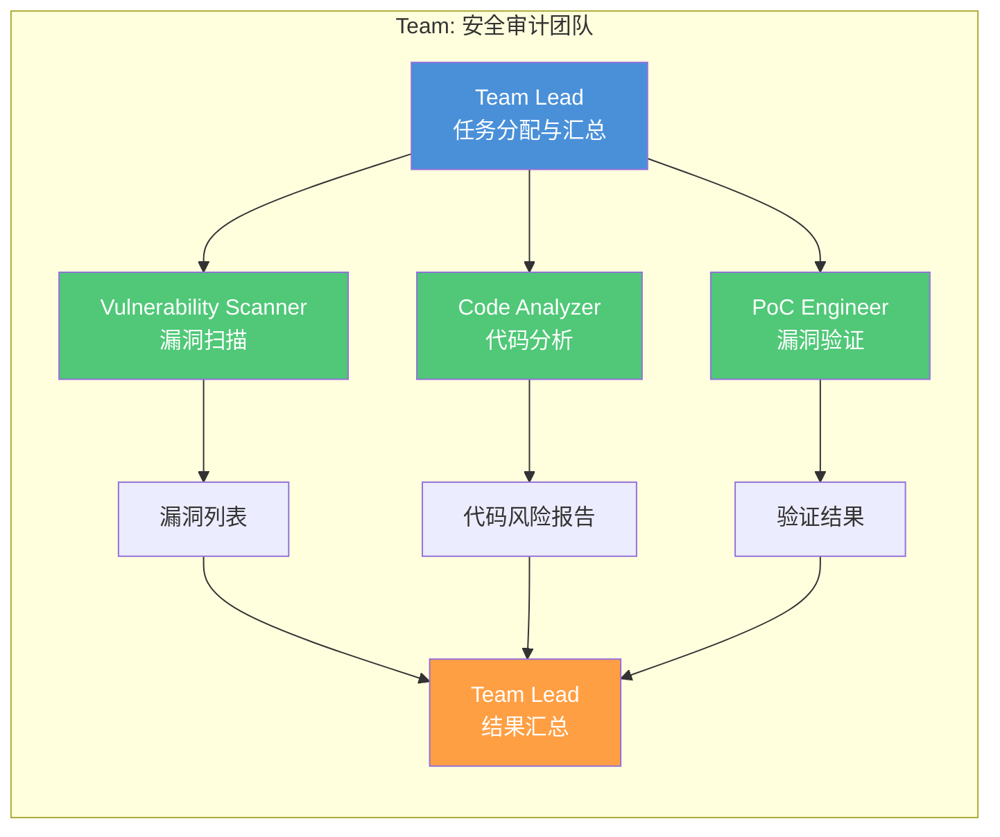
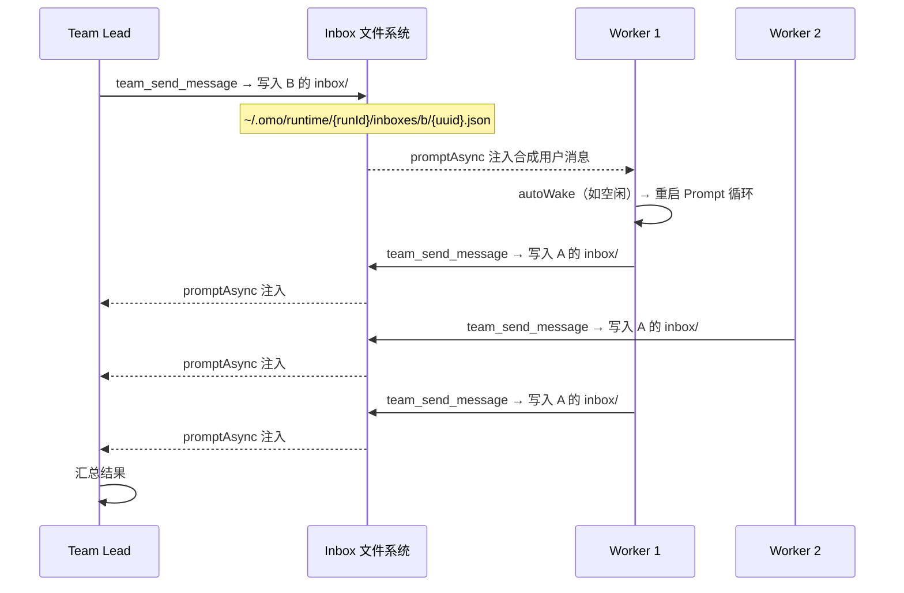
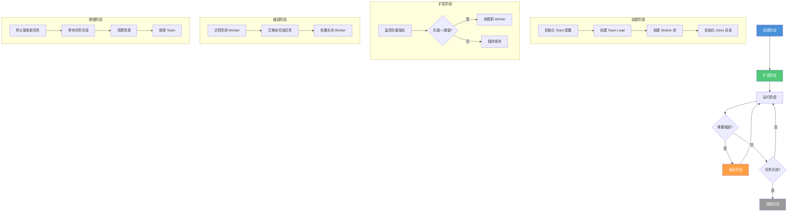
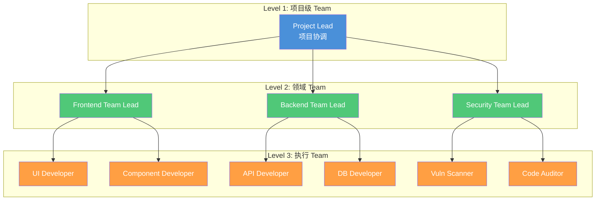
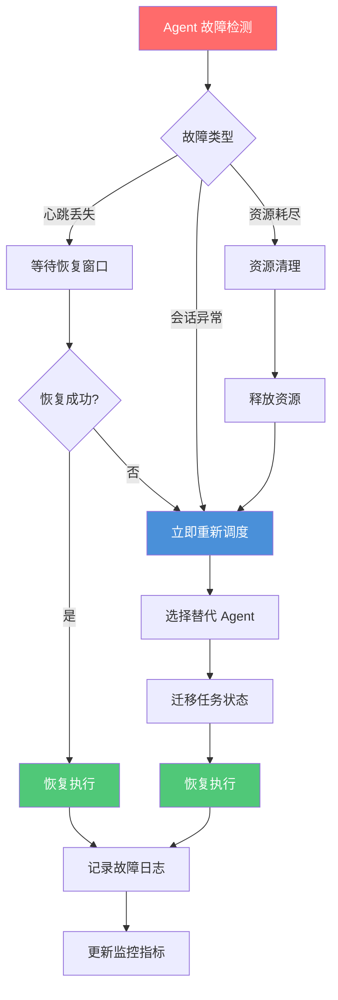

# Teams 并行 Agent 协作

> 超越单 Agent 限制：同一进程内的多个并行 Agent 实例通过消息传递机制协同工作，构建大规模多视角 AI 编程工作流。

## 文章概述

当单个 Agent 无法满足复杂工程场景的需求时，Teams 并行 Agent 协作提供了解决方案。与 Agent 派生（父子关系）不同，Teams 是同一进程内的多个并行 Agent 实例的平级协作——每个 Team 成员都是独立的 Agent 会话实例，有自己的上下文、技能和生命周期，通过消息传递机制通信和同步。所有成员运行在同一个 OMO 进程中，而非独立的操作系统进程。

读完本文，你将能够设计大规模 Teams 并行 Agent 协作架构，理解通信协议和消息传递机制，以及在性能与隔离性之间做出合理的权衡决策。

本文从 Teams 的架构设计原则入手，解释为什么需要从单 Agent 走向并行 Agent 协作。你会理解 Team 的成员角色定义、通信协议（`team_send_message` 的工作原理）和基于 inbox 文件的消息传递机制。我们深入讨论同一进程内多个 Agent 协作的优缺点——资源竞争和隔离问题如何管理，团队的生命周期如何维护。然后通过对比表分析 Team Mode 与独立 Agent 的适用场景，帮助你在性能与隔离性之间做出权衡。最后，讨论大规模 Teams 的工程实践：分层协调设计、监控和日志收集、故障恢复策略。

从后端架构师视角，我们将探讨多服务上下文的 Agent 编排策略；从架构顾问视角，我们将分析 Teams 架构的设计原则和权衡决策；从渗透测试员视角，我们将深入审查 Team Mode 的数据隔离安全边界。

> **⏱ 时间有限？先读这些：** Teams 架构概述 → 消息传递与 inbox 机制 → Team Mode vs 独立 Agent → 大规模 Teams 的工程实践

---

## Teams 架构概述

### 为什么需要 Teams 架构

单进程 Agent 存在三个核心限制，这些限制在复杂工程场景中尤为突出：

1. **上下文窗口瓶颈**：单个 Agent 的上下文窗口有限，当任务涉及多个代码仓库、多种技术栈时，上下文溢出导致决策质量下降。后端架构师在微服务架构中经常面临这个问题——一个变更可能涉及 API 网关、认证服务、业务服务、数据库迁移等多个上下文。

2. **资源竞争问题**：CPU、内存、网络连接等资源在单进程内竞争。当 Agent 执行 CPU 密集型任务（代码分析）和 I/O 密集型任务（网络请求）时，资源竞争导致整体效率下降。

3. **故障隔离需求**：单进程内的任何错误都可能影响整个 Agent。当某个子任务失败（如依赖安装超时），可能导致主任务也被中断。

Teams 架构通过并行 Agent 协作解决这些问题：每个 Team 成员是同一进程内的独立 Agent 会话实例，拥有独立的 Prompt 上下文和故障边界。

### Team 的成员角色定义

Team 成员的角色定义遵循职责分离原则。每个成员专注于特定领域，通过消息传递协作完成复杂任务。



**角色定义配置示例**：

```json:.opencode/teams/security-audit-team.json
{
  "team": {
    "name": "security-audit-team",
    "description": "安全审计团队：漏洞扫描、代码分析、漏洞验证",
    "members": [
      {
        "id": "team-lead",
        "role": "coordinator",
        "model": "best-capability-model",
        "skills": ["overall-planning", "dispatching-parallel-agents"],
        "permissions": {
          "read": "allow",
          "edit": "deny",
          "bash": "deny",
          "team_send_message": "allow"
        },
        "responsibilities": ["任务分解", "进度监控", "结果汇总"]
      },
      {
        "id": "vuln-scanner",
        "role": "worker",
        "model": "balanced-model",
        "skills": ["vulnerability-manager", "blue-team-defender"],
        "permissions": {
          "read": "allow",
          "edit": "deny",
          "bash": "allow",
          "team_send_message": "allow"
        },
        "responsibilities": ["漏洞扫描", "CVE 匹配", "风险评分"]
      },
      {
        "id": "code-analyzer",
        "role": "worker",
        "model": "balanced-model",
        "skills": ["security-architect", "penetration-tester"],
        "permissions": {
          "read": "allow",
          "edit": "deny",
          "bash": "allow",
          "team_send_message": "allow"
        },
        "responsibilities": ["代码审计", "安全模式检查", "敏感数据发现"]
      },
      {
        "id": "poc-engineer",
        "role": "worker",
        "model": "balanced-model",
        "skills": ["elite-red-team-hacker", "penetration-tester"],
        "permissions": {
          "read": "allow",
          "edit": "ask",
          "bash": "ask",
          "team_send_message": "allow"
        },
        "responsibilities": ["漏洞验证", "PoC 编写", "修复建议"]
      }
    ]
  }
}
```

### 基于 Inbox 文件的通信机制

Team 成员之间的通信基于单个 JSON 文件的消息传递协议（每封消息一个独立文件），而非共享内存或操作系统进程间通信（IPC）。所有成员运行在同一个 OMO 进程中，通过文件系统实现消息的持久化和异步投递。

> **概念消息类型说明**：本节定义的以下消息类型（`task_assignment` / `status_sync` / `result_aggregation` / `error_report` / `heartbeat`）是**为方便理解而引入的概念分类**，并非 OMO 内置的消息类型。实际 Team Mode 通过 `team_send_message` 发送自由文本消息，消息的含义由发送者和接收者的上下文协商决定。

**概念消息类型体系**：

| 消息类型 | 方向 | 典型用途 | 说明 |
|---------|------|---------|------|
| `task_assignment` | Lead → Worker | 分配子任务 | 协调者界定子任务范围 |
| `status_sync` | Worker → Lead | 汇报执行状态 | 含当前进度、阻塞因素 |
| `result_aggregation` | Worker → Lead | 提交执行结果 | 完成通知和输出汇总 |
| `error_report` | Any → Lead | 报告错误和异常 | 请求协调者干预 |
| `heartbeat` | Any → Any | 存活检测（可选） | 用于监控组件 |

**Inbox 文件机制**：

Team Mode 的底层通信基于 per-message JSON 文件，存储在 `~/.omo/runtime/{teamRunId}/inboxes/` 目录下：

1. 每个 Team 成员拥有一个专用的 inbox 目录：`~/.omo/runtime/{teamRunId}/inboxes/{memberName}/`
2. 每封消息写入一个独立的 `{uuid}.json` 文件（原子写入，非 append-only 日志）
3. 消息格式为 `{ version: 1, messageId: "uuid", from: "sender", to: "recipient", kind: "message", body: "文本内容", timestamp: 1700000000000, correlationId?: "关联ID", summary?: "摘要" }`
4. 消息的投递是 **fire-and-forget（即发即忘）** 模式——`team_send_message` 立即返回，无需同步等待回复

**消息投递流程**：

```text:terminal
发送方调用 team_send_message → 写入接收方 inbox/{uuid}.json
  → 后台自动执行 Live Delivery：重命名为 .delivering-{uuid}.json
    → promptAsync 注入 <peer_message> 到接收方会话
      → 接收方处理完成后，文件移至 inbox/processed/{uuid}.json
  → 如接收方处于空闲状态，autoWake 机制注入唤醒提示
  → 如投递失败（会话崩溃），.delivering- 文件 10 分钟后释放回未读状态
```

---

## 消息传递机制

### team_send_message 的工作原理

`team_send_message` 是 Team Mode 的核心通信工具，实现了 Agent 间的异步消息传递。消息以单个 JSON 文件形式写入接收方的 inbox 目录（`{uuid}.json`），属于 **fire-and-forget（即发即忘）** 模式——`team_send_message` 立即返回，无需同步等待回复。



**底层实现机制**：

1. **消息写入**：消息写入接收方的 `~/.omo/runtime/{teamRunId}/inboxes/{memberName}/{uuid}.json`
2. **预留投递**（Live Delivery）：发送方将文件重命名为 `.delivering-{uuid}.json`，表示正在投递中
3. **会话注入**：通过 `promptAsync` 将 inbox 消息包装为 `<peer_message>` XML 包，作为合成用户消息注入接收方的对话上下文
4. **投递确认（Ack）**：消息被接收方处理后，从 inbox 根目录移动到 `inboxes/{memberName}/processed/{uuid}.json`
5. **autoWake**：如果接收方处于空闲状态且有未读消息，`autoWake` 机制自动注入唤醒提示
6. **故障恢复**：如果投递过程中接收方会话崩溃，`.delivering-` 文件在 10 分钟 TTL 后释放回未读状态，供下次轮询使用

**team_send_message 参数详解**：

```json:terminal
{
  "team_send_message": {
    "to": "vuln-scanner",
    "body": "请扫描 /api/auth 路由的 SQL 注入漏洞。目标文件: src/api/auth.ts, src/db/queries.ts。超时时间: 300000ms",
    "summary": "SQL 注入扫描任务 #scan-001",
    "references": [
      { "path": "src/api/auth.ts", "description": "认证 API 路由" },
      { "path": "src/db/queries.ts", "description": "数据库查询" }
    ]
  }
}
```

### 消息类型详解

#### 任务分配（Task Assignment）

Team Lead 向 Worker 分配子任务的消息类型：

```json:terminal
{
  "type": "task_assignment",
  "payload": {
    "task_id": "unique-task-id",
    "description": "任务描述",
    "skills_required": ["penetration-tester"],
    "context": {
      "files": ["path/to/file"],
      "constraints": {}
    },
    "deadline": "2024-01-15T10:00:00Z",
    "priority": "high"
  }
}
```

**任务分配策略**：

| 策略 | 描述 | 适用场景 |
|------|------|---------|
| **广播** | 所有 Worker 收到相同任务 | 冗余执行、竞争模式 |
| **轮询** | 依次分配给各 Worker | 均衡负载 |
| **能力匹配** | 根据 Skill 匹配最合适的 Worker | 专业任务 |
| **负载感知** | 分配给当前负载最低的 Worker | 动态调度 |

#### 状态同步（Status Sync）

Worker 向 Team Lead 汇报执行状态：

```json:terminal
{
  "type": "status_sync",
  "payload": {
    "task_id": "scan-001",
    "status": "in_progress",
    "progress": 45,
    "metrics": {
      "files_scanned": 12,
      "files_total": 27,
      "issues_found": 3
    },
    "eta": "2024-01-15T09:45:00Z"
  }
}
```

**状态类型**：

- `pending`：任务已接收，等待执行
- `in_progress`：任务执行中
- `blocked`：任务被阻塞（等待依赖）
- `completed`：任务完成
- `failed`：任务失败

#### 结果汇总（Result Aggregation）

Worker 提交执行结果给 Team Lead：

```json:terminal
{
  "type": "result_aggregation",
  "payload": {
    "task_id": "scan-001",
    "status": "completed",
    "output": {
      "vulnerabilities": [
        {
          "type": "SQL_INJECTION",
          "severity": "HIGH",
          "location": "src/api/auth.ts:45",
          "payload": "' OR '1'='1",
          "recommendation": "使用参数化查询"
        }
      ],
      "summary": {
        "total": 1,
        "high": 1,
        "medium": 0,
        "low": 0
      }
    },
    "artifacts": [
      {
        "type": "report",
        "path": "/tmp/scan-001-report.json"
      }
    ]
  }
}
```

### 消息处理的现实约束

> ⚠️ **关键差异**：OMO Team Mode 的 inbox 机制与消息队列中间件有本质区别。以下对比帮助理解这些差异带来的工程含义。

**与消息队列的对比清单**：

| 差异点 | OMO Inbox | 传统消息队列 |
|--------|-----------|-------------|
| **优先级** | 无内置优先级，所有消息平等处理 | 支持多级优先级队列 |
| **Ack 确认** | 有——基于文件重命名到 `processed/` 目录，后台自动完成 | Ack 由消费者显式返回 |
| **投递保障** | `.delivering-` 预留机制 + 10 分钟 TTL 自动恢复 | 支持死信队列和最多一次/至少一次语义 |
| **消息队列** | 无集中式 Queue，基于文件系统目录自然缓冲 | 专用队列服务，容量可控 |

> 这些限制并非缺陷，而是设计选择——Team Mode 优先保证简单性和可靠性，通过 LLM 的上下文理解能力来协商消息处理顺序和确认，而非依赖复杂的基础设施组件。

---

## 进程内集群

### 多 Agent 同进程协作的优缺点

进程内集群（In-Process Cluster）是指多个 Agent 在同一个进程内协作的模式。这种模式在特定场景下具有优势，但也存在明显的局限性。

**优势分析**：

| 维度 | 描述 | 后端架构师视角 |
|------|------|---------------|
| **通信延迟** | 进程内通信无网络开销 | 适合高频消息交互场景 |
| **资源共享** | 内存、连接池可共享 | 减少资源占用 |
| **状态同步** | 可使用共享内存 | 简化状态管理 |
| **调试便利** | 单进程调试更容易 | 降低运维复杂度 |

**劣势分析**：

| 维度 | 描述 | 渗透测试员视角 |
|------|------|---------------|
| **故障传播** | 一个 Agent 崩溃可能影响整个进程 | 安全边界模糊 |
| **资源竞争** | CPU、内存竞争导致性能下降 | DoS 攻击面增大 |
| **权限隔离** | 难以实现细粒度权限控制 | 权限提升风险 |
| **扩展性** | 无法水平扩展 | 单点瓶颈 |

### 资源竞争和隔离策略

同一进程内的多 Agent 协作需要关注两类资源竞争：系统资源（CPU/内存）和 LLM API 资源（速率限制/Token 配额）。

#### LLM API 速率限制（最现实的瓶颈）

在实际使用中，**LLM API 速率限制和 Token 配额**是 Team Mode 最常见的资源竞争问题——比 CPU/内存竞争频繁得多。

**典型场景**：

| 场景 | 问题 | 影响 |
|------|------|------|
| 多个 Worker 同时调用同一模型 API | 达到 RPM/TPM 限制 | API 返回 429 错误，任务失败 |
| 共享 API Key 的团队成员并发 | 超出账户级别速率限制 | 所有成员同时降速 |
| 大上下文 Worker 消耗大量 Token | 挤占其他成员的 Token 配额 | 其他成员无法获得 LLM 响应 |

**应对策略**：

- **错峰调度**：避免所有 Worker 同时启动，让 Team Lead 分批发起任务
- **模型分离**：Lead 使用高端模型进行决策，Worker 使用轻量模型执行具体任务
- **重试机制**：在 Worker 层面对 429 错误实现退避重试
- **Token 预算**：每个 Worker 设定明确的 Token 上限（`maxTokens`），避免单个成员耗尽配额

#### 系统资源隔离

> ⚠️ **注意**：以下配置（`cfs_quota`、`cgroups`、`bandwidth_limit`）均为 **Linux 内核特性**，macOS 不支持。macOS 用户无法直接应用这些设置。

```json:opencode.json
{
  "resourceIsolation": {
    "cpu": {
      "strategy": "cfs_quota",      // ⚠️ Linux only
      "limits": {
        "team-lead": { "quota": 50, "period": 100 },
        "worker": { "quota": 100, "period": 100 }
      }
    },
    "memory": {
      "strategy": "cgroups",        // ⚠️ Linux only
      "limits": {
        "team-lead": "512MB",
        "worker": "1GB"
      },
      "oomPolicy": "kill_oldest"     // ⚠️ Linux only
    },
    "network": {
      "strategy": "bandwidth_limit", // ⚠️ Linux only
      "limits": {
        "team-lead": "10MB/s",
        "worker": "50MB/s"
      }
    },
    "fileDescriptors": {
      "limit": 1024,
      "strategy": "per_agent"
    }
  }
}
```

> **macOS 替代方案**：在 macOS 上无法使用 cgroups/cfs_quota 进行精细化资源控制。建议采用应用层策略：通过配置每个 Agent 的 `maxTokens` 和 `steps` 限制来间接控制资源消耗，或使用 `ulimit` 进行进程级别的粗粒度限制。

**竞争检测和缓解**：

```json:opencode.json
{
  "contentionManagement": {
    "detection": {
      "cpuThreshold": 0.8,
      "memoryThreshold": 0.85,
      "networkThreshold": 0.9,
      "checkInterval": 5000
    },
    "mitigation": {
      "strategies": ["throttle", "queue", "reject"],
      "throttleThreshold": 0.9,
      "queueSize": 100,
      "rejectThreshold": 0.95
    }
  }
}
```

### 死锁分析与防范

Team Mode 由于缺乏集中式调度器和死锁检测机制，在多成员协作时可能出现以下死锁场景。**当前 OMO 不提供内置的死锁检测**，需要架构设计层面主动防范。

**死锁场景分析**：

| 场景 | 触发条件 | 示例 | 影响 | 防范措施 |
|------|---------|------|------|---------|
| **循环任务依赖** | Worker A 需要 B 的结果，B 需要 A 的结果 | 代码分析器等待漏洞扫描结果，漏洞扫描器等待代码分析标记 | 两个 Worker 永久等待 | 在 Team Lead 层面设计明确的 DAG（有向无环图）依赖，避免环形引用 |
| **独占文件竞争** | 多个 Worker 竞争同一文件的独占写权限 | 两个 Worker 同时尝试写入同一个报告文件 | 文件锁死，进度停滞 | 为每个 Worker 分配独立的输出目录；使用唯一文件名（如 `{agent_id}_{task_id}.json`） |
| **Inbox 溢出** | 消息写入速度超过接收方处理速度，inbox 目录容量超限 | Lead 同时向 10 个 Worker 广播，Worker 处理不过来 | 消息丢失且无重试机制 | 控制并发消息数，避免广播；Worker 处理完当前任务后再接收新消息 |
| **LLM 响应阻塞** | 一个 Worker 的 LLM 调用卡死（如超长上下文），阻塞后续处理 | Worker 执行复杂代码分析，LLM 响应延迟超过 2 分钟 | 该 Worker 无法处理新消息 | 设置 `steps` 上限作为电路断路器；超时后 Lead 重新分配任务 |

**推荐防范配置**：

```json:opencode.json
{
  "deadlockPrevention": {
    "taskDependency": {
      "allowCycles": false,
      "maxChainLength": 5,
      "timeoutPerTask": 300000
    },
    "fileAccess": {
      "workerOutputDir": "./output/{agent_id}/",
      "namingPattern": "{agent_id}_{task_id}_{timestamp}"
    },
    "messageControl": {
      "maxConcurrentMessages": 3,
      "requireCompletionBeforeNewTask": true
    }
  }
}
```

### 集群生命周期管理

进程内集群的生命周期管理包括创建、扩容、缩容、销毁四个阶段：



**生命周期配置**：

```json:opencode.json
{
  "lifecycle": {
    "creation": {
      "warmup": true,
      "prefetchSkills": true,
      "initTimeout": 60000
    },
    "scaling": {
      "minWorkers": 2,
      "maxWorkers": 10,
      "scaleUpThreshold": 0.7,
      "scaleDownThreshold": 0.3,
      "cooldownPeriod": 60000
    },
    "termination": {
      "gracefulShutdown": true,
      "taskCompletionTimeout": 300000,
      "forceKillTimeout": 60000
    }
  }
}
```

> **成员数量建议**：大多数 Team 任务建议 2-3 个 Worker（1 个 Lead + 2-3 个 Worker）。对于复杂的安全审计或大规模代码审查，推荐 4-8 个 Worker。超过 8 个成员后，通信协调开销会显著增加，建议拆分多个 Team 分层治理。

### 共享状态的一致性问题

> ⚠️ **概念探讨**：以下内容是对"如果 Team 成员共享状态"这一场景的架构探讨。**当前 OMO Team Mode 不支持 Agent 间的共享内存状态**——每个 Agent 拥有独立的 Prompt 上下文，状态必须通过 `team_send_message` 显式传递。以下模型供架构设计参考。

进程内集群理论上可以使用共享内存简化状态管理，但需要处理一致性问题：

**一致性模型选择**：

| 模型 | 描述 | 适用场景 | 性能影响 |
|------|------|---------|---------|
| **强一致性** | 所有读取返回最新写入 | 配置变更、权限更新 | 高 |
| **最终一致性** | 读取可能返回旧值，但最终一致 | 进度统计、日志收集 | 低 |
| **因果一致性** | 因果相关的操作保证顺序 | 任务依赖链 | 中 |

**状态同步配置**：

```json:opencode.json
{
  "stateSynchronization": {
    "model": "eventual_consistency",
    "sharedState": {
      "taskProgress": {
        "consistency": "eventual",
        "syncInterval": 5000,
        "conflictResolution": "last_write_wins"
      },
      "memberStatus": {
        "consistency": "strong",
        "syncInterval": 1000,
        "conflictResolution": "leader_decides"
      },
      "resourceQuota": {
        "consistency": "strong",
        "syncInterval": 500,
        "conflictResolution": "atomic_increment"
      }
    }
  }
}
```

---

## Team Mode vs 独立 Agent

### 适用场景对比

Team Mode 和独立 Agent 各有适用场景，选择取决于任务特性和工程约束。

| 维度 | Team Mode | 独立 Agent |
|------|-----------|-----------|
| **性能** | 高（并行执行） | 中（串行执行） |
| **隔离性** | 低（同进程，共享上下文空间） | 高（完全独立） |
| **资源消耗** | 高（多 Agent 会话开销） | 低（单 Agent 会话） |
| **复杂度** | 高（需协调机制） | 低（简单直接） |
| **故障容错** | 中（Lead 可重调度任务） | 低（单点故障） |
| **调试难度** | 高（多会话调试） | 低（单会话调试） |
| **扩展性** | 低（受单进程资源限制） | 低（垂直扩展） |
| **通信开销** | 中（消息传递） | 无（内部调用） |

### 性能 vs 隔离性权衡

架构顾问需要在性能和隔离性之间做出权衡：


**权衡决策矩阵**：

| 任务特性 | 推荐模式 | 原因 |
|---------|---------|------|
| 高频消息交互（>100 msg/s） | 进程内集群 | 通信延迟敏感 |
| CPU 密集型并行任务 | Team Mode | 多核利用率高 |
| 安全敏感任务（渗透测试） | 独立 Agent | 隔离性优先 |
| I/O 密集型任务 | Team Mode | 并行 I/O 效率高 |
| 简单串行任务 | 独立 Agent | 避免协调开销 |
| 长时间运行任务 | Team Mode | 故障恢复能力强 |

### 混合模式设计

> ⚠️ **概念模型说明**：以下"混合模式"是**架构设计层面的概念模型**，描述如何将 Team Mode 和独立 Agent 编排在一起。当前 OMO 的 Team Mode 所有成员运行在同一进程中，不支持部分成员独立部署为 OS 进程。此处的"独立成员"在实现上应通过 `task()` 调用的独立 Agent 实现，而非 Team 内部的异构部署。

混合模式结合 Team Mode 和独立 Agent 的优势：核心成员在 Team 内协作，独立成员通过 `task()` 委派方式运行。

**混合架构配置**：

```json:.opencode/teams/hybrid-architecture.json
{
  "hybridArchitecture": {
    "team": {
      "name": "fullstack-development-team",
      "mode": "hybrid",
      "inProcessMembers": [
        {
          "id": "coordinator",
          "role": "team-lead",
          "reason": "高频消息协调"
        },
        {
          "id": "frontend-worker",
          "role": "worker",
          "reason": "与 coordinator 紧密协作"
        }
      ],
      "independentMembers": [
        {
          "id": "security-auditor",
          "role": "specialist",
          "reason": "安全隔离需求",
          "isolation": {
            "workdir": "./agent-security",
            "network": "isolated",
            "permissions": ["read", "bash"]
          }
        },
        {
          "id": "database-migrator",
          "role": "specialist",
          "reason": "数据库访问隔离",
          "isolation": {
            "workdir": "./agent-db",
            "network": "restricted",
            "allowedHosts": ["db.internal:5432"]
          }
        }
      ]
    },
    "communication": {
      "inProcess": "inbox_message",
      "crossProcess": "inbox_message",
      "external": "file交接"
    }
  }
}
```

---

## Team Mode 数据隔离审查

从渗透测试员视角，Team Mode 的数据隔离是关键的安全边界。不当的隔离配置可能导致敏感数据泄露或权限提升攻击。

### 数据隔离级别

| 隔离级别 | 描述 | 适用场景 | 配置示例 |
|---------|------|---------|---------|
| **完全隔离** | 每个 Agent 独立工作目录 | 安全审计、红蓝对抗 | `workdir: "./agent-{id}"` |
| **共享读取** | 共享代码库，独立输出 | 代码审查、测试 | `readonly: ["./src"]` |
| **完全共享** | 所有 Agent 共享工作目录 | 协作开发、结对编程 | `workdir: "./"` |

**完全隔离配置**：

```json:opencode.json
{
  "isolation": {
    "level": "complete",
    "workdir": "./agents/{agent_id}",
    "filesystem": {
      "readonly": [],
      "readwrite": ["./agents/{agent_id}"],
      "denied": ["./secrets", "./.env", "./credentials"]
    },
    "network": {
      "mode": "isolated",
      "allowedHosts": [],
      "deniedHosts": ["*"]
    },
    "environment": {
      "inherit": false,
      "variables": {
        "AGENT_ID": "{agent_id}",
        "TEAM_ID": "{team_id}"
      }
    }
  }
}
```

**共享读取配置**：

```json:opencode.json
{
  "isolation": {
    "level": "shared_read",
    "workdir": "./agents/{agent_id}",
    "filesystem": {
      "readonly": ["./src", "./docs", "./config"],
      "readwrite": ["./agents/{agent_id}", "./reports"],
      "denied": ["./secrets", "./.env", "./credentials"]
    },
    "network": {
      "mode": "restricted",
      "allowedHosts": ["api.internal", "registry.internal"],
      "deniedHosts": ["*"]
    }
  }
}
```

### 安全检查清单

渗透测试员应验证以下安全检查项：

**文件系统隔离**：

- [ ] 敏感文件不在共享目录中（`.env`、`.key`、`.pem`、`credentials.*`）
- [ ] Agent 输出目录有权限控制（仅限该 Agent 可写）
- [ ] 临时文件定期清理（避免残留敏感数据）
- [ ] 符号链接不指向敏感目录

**网络隔离**：

- [ ] Agent 网络访问按最小权限配置
- [ ] 敏感服务（数据库、消息队列）仅限特定 Agent 访问
- [ ] 外部网络访问需要审批（`bash: ask`）
- [ ] DNS 解析不泄露内部服务信息

**日志安全**：

- [ ] 日志不包含敏感信息（API Key、密码、Token）
- [ ] 日志文件权限正确（仅限审计角色可读）
- [ ] 日志轮转配置正确（避免磁盘占满）
- [ ] 跨 Agent 日志隔离

**会话与进程隔离**：

- [ ] Agent 进程以非 root 用户运行
- [ ] 资源限制配置正确（CPU、内存、文件描述符）
- [ ] 子进程继承限制正确
- [ ] 信号处理正确（避免被恶意终止）

### 数据隔离安全配置示例

```json:opencode.json
{
  "securityHardening": {
    "filesystem": {
      "excludePatterns": [
        "*.env", "*.key", "*.pem", "*.p12",
        "credentials*", "secrets*", "password*",
        ".git/", "node_modules/", ".cache/"
      ],
      "redactPatterns": [
        "sk-[a-zA-Z0-9]{48}",
        "xox[baprs]-[a-zA-Z0-9-]+",
        "eyJ[a-zA-Z0-9_-]*\\.eyJ[a-zA-Z0-9_-]*\\.[a-zA-Z0-9_-]*",
        "password\\s*=\\s*['\"][^'\"]+['\"]",
        "api[_-]?key\\s*=\\s*['\"][^'\"]+['\"]"
      ],
      "auditAccess": true,
      "logSensitiveAccess": true
    },
    "network": {
      "defaultDeny": true,
      "allowRules": [
        { "agent": "frontend-worker", "hosts": ["cdn.jsdelivr.net", "registry.npmjs.org"] },
        { "agent": "backend-worker", "hosts": ["api.github.com", "pypi.org"] },
        { "agent": "security-auditor", "hosts": ["cve.mitre.org", "nvd.nist.gov"] }
      ],
      "denyRules": [
        { "agent": "*", "hosts": ["169.254.169.254", "metadata.google.internal"] }
      ]
    },
    "process": {
      "user": "agent",
      "group": "agents",
      "capabilities": ["CAP_NET_BIND_SERVICE"],
      "noNewPrivileges": true,
      "seccompProfile": "runtime/default"
    },
    "audit": {
      "enabled": true,
      "logLevel": "verbose",
      "events": ["file_access", "network_access", "permission_denied", "sensitive_access"],
      "retention": "30d"
    }
  }
}
```

---

## 大规模 Teams 的工程实践

### 分层 Team 架构

大规模 Teams 采用分层架构，父 Team 包含子 Team 的分层治理模型：

> ⚠️ **逻辑分层说明**：此处的"父 Team 包含子 Team"是**业务逻辑层面的概念协调模型**，而非物理架构的真实反映。下图展示的是**逻辑层级关系**，用于说明概念上的任务分解与协调模式。以下配置中的 `shared_memory` 和 `message_queue` 通信方式是概念设计，实际 OMO 使用 inbox 文件进行消息传递。
> 
> **实际约束**：
> - OMO **禁止** Team 成员调用 `team_create`——物理嵌套是不可能的
> - 所有 Team 成员运行在**同一 OMO 进程**内，不存在物理进程边界
> - 分层协调通过消息传递实现：一个 Team 的 Lead 可以向另一个 Team 的 Lead 发送消息，请求子任务执行
> - 12 个 `team_*` 工具在 API 层面不支持嵌套（参见[自定义工作流](custom-workflows.md)中 Team Mode 的限制）
> - 下图中的箭头表示**概念上的任务分配关系**，而非进程间通信

**`team_*` 工具速查表**：

| 工具 | 用途 | 可用范围 |
|------|------|---------|
| `team_create` | 创建 Team，指定名称、描述和成员配置 | Lead-only |
| `team_delete` | 删除 Team，清理所有成员会话和 inbox 文件 | Lead-only（拒绝活跃成员） |
| `team_shutdown_request` | 向成员发起关闭请求，进入关闭流程 | Lead-only |
| `team_approve_shutdown` | 批准关闭请求，确认成员退出 | Lead 或目标成员 |
| `team_reject_shutdown` | 拒绝关闭请求，继续执行任务 | Lead 或目标成员 |
| `team_send_message` | 向指定成员发送消息（写入 inbox 文件） | 全体成员（`to: "*"` 广播限 Lead） |
| `team_task_create` | 创建共享任务记录，分配责任人 | 全体成员 |
| `team_task_list` | 列出 Team 的所有共享任务 | 全体成员 |
| `team_task_update` | 更新任务状态、进度或负责人 | 全体成员 |
| `team_task_get` | 查看单个任务详情 | 全体成员 |
| `team_status` | 查询团队整体状态和成员健康度 | 全体成员 |
| `team_list` | 列出当前运行的所有 Team | 全体成员（全局查询） |



**分层架构配置**：

```json:.opencode/teams/enterprise-project.json
{
  "hierarchicalTeam": {
    "name": "enterprise-development-project",
    "levels": [
      {
        "level": 1,
        "team": {
          "name": "project-lead",
          "role": "coordinator",
          "model": "best-capability-model",
          "skills": ["overall-planning", "dispatching-parallel-agents"]
        }
      },
      {
        "level": 2,
        "teams": [
          {
            "name": "frontend-team",
            "lead": { "model": "balanced-model", "skills": ["frontend-architect"] },
            "workers": [
              { "id": "ui-developer", "skills": ["ui-designer"] },
              { "id": "component-developer", "skills": ["frontend-architect"] }
            ]
          },
          {
            "name": "backend-team",
            "lead": { "model": "balanced-model", "skills": ["backend-architect"] },
            "workers": [
              { "id": "api-developer", "skills": ["backend-architect"] },
              { "id": "db-developer", "skills": ["backend-architect"] }
            ]
          },
          {
            "name": "security-team",
            "lead": { "model": "best-capability-model", "skills": ["security-architect"] },
            "workers": [
              { "id": "vuln-scanner", "skills": ["vulnerability-manager"] },
              { "id": "code-auditor", "skills": ["penetration-tester"] }
            ]
          }
        ]
      }
    ],
    "communication": {
      "crossLevel": "inbox_message",
      "sameLevel": "inbox_message",
      "timeout": 60000
    }
  }
}
```

### Team 监控和日志

大规模 Teams 需要完善的监控和日志系统：

**监控指标**：

> ⚠️ 以下监控指标为**概念设计建议**，当前 OMO 不内置这些指标采集。实际监控可依赖操作系统级资源监控（如 `top`、`iostat`）和手动日志检查。

| 指标类型 | 指标名称 | 描述 | 告警阈值 |
|---------|---------|------|---------|
| **消息指标** | `inbox_depth` | Inbox 中未读消息数 | > 10 |
| **消息指标** | `message_response_time` | 消息发出到收到回复的间隔 | > 60s |
| **消息指标** | `inbox_file_count` | Inbox 目录文件数量 | > 100 |
| **Agent 指标** | `agent_cpu_usage` | Agent CPU 使用率 | > 80% |
| **Agent 指标** | `agent_memory_usage` | Agent 内存使用率 | > 85% |
| **Agent 指标** | `agent_heartbeat_miss` | 心跳丢失次数 | > 3 |
| **任务指标** | `task_completion_rate` | 任务完成率 | < 95% |
| **任务指标** | `task_avg_duration` | 任务平均时长 | 超出预期 50% |

**监控配置**：

```json:opencode.json
{
  "monitoring": {
    "metrics": {
      "collection": {
        "interval": 10000,
        "retention": "7d",
        "storage": "prometheus"
      },
      "alerts": [
        {
          "name": "high_message_response_time",
          "condition": "response_time > 120000",
          "severity": "warning",
          "action": "notify"
        },
        {
          "name": "agent_heartbeat_missing",
          "condition": "agent_heartbeat_miss > 3",
          "severity": "critical",
          "action": "restart_agent"
        },
        {
          "name": "inbox_overflow",
          "condition": "inbox_file_count > 100",
          "severity": "warning",
          "action": "notify_lead"
        }
      ]
    },
    "tracing": {
      "enabled": true,
      "samplingRate": 0.1,
      "storage": "jaeger",
      "retention": "24h"
    },
    "logging": {
      "level": "info",
      "format": "json",
      "outputs": ["file", "elasticsearch"],
      "retention": "30d",
      "redactSensitive": true
    }
  }
}
```

### 故障恢复策略

成员宕机后的任务重新调度和故障恢复：



**故障恢复配置**：

```json:opencode.json
{
  "faultRecovery": {
    "detection": {
      "heartbeatInterval": 10000,
      "heartbeatTimeout": 30000,
      "maxMissedHeartbeats": 3,
      "healthCheckInterval": 60000
    },
    "recovery": {
      "strategies": {
        "heartbeat_lost": {
          "action": "wait_and_restart",
          "waitWindow": 60000,
          "maxRetries": 2
        },
        "session_crash": {
          "action": "immediate_reschedule",
          "preserveState": true,
          "notifyTeam": true
        },
        "resource_exhausted": {
          "action": "cleanup_and_reschedule",
          "cleanupTimeout": 30000,
          "resourceThreshold": 0.9
        }
      },
      "taskReschedule": {
        "strategy": "capability_match",
        "fallbackStrategy": "round_robin",
        "preserveProgress": true,
        "maxRescheduleAttempts": 3
      }
    },
    "degradation": {
      "enabled": true,
      "triggers": {
        "memberFailureRate": 0.3,
        "inboxFileCount": 100,
        "systemLoad": 0.9
      },
      "actions": {
        "reduceParallelism": true,
        "skipNonCriticalTasks": true,
        "fallbackToSimpleAgent": true
      }
    }
  }
}
```

---

## Teams 的设计哲学

### Teams 是 Agent 协作的操作系统

Team Mode 提供了 Agent 间通信、任务调度、状态管理的完整基础设施，可以被视为 Agent 协作的"操作系统"。

**操作系统类比**：

| 操作系统功能 | Team Mode 对应 | 描述 |
|-------------|---------------|------|
| 进程管理 | Agent 会话管理 | 创建、调度、终止 Agent 会话 |
| 进程间通信 | `team_send_message` | 跨 Agent 消息传递机制 |
| 内存管理 | 上下文管理 | 上下文窗口分配和回收 |
| 文件系统 | 文件交接（WORKFLOW_STATE.md） | 持久化状态存储 |
| 网络协议 | 消息类型体系 | 通信协议定义 |
| 安全机制 | 权限隔离 | 访问控制和隔离 |

### 消息传递 vs 文件交接

Team 的内部通信使用 inbox 消息传递，对外输出使用文件（WORKFLOW_STATE.md）。两者各有侧重：

**消息传递（内部 — Inbox 文件）**：

- 实时性高，适合频繁交互
- **消息以单文件形式持久化存储在 `~/.omo/runtime/{teamRunId}/inboxes/{memberName}/{uuid}.json`**，进程重启后可从 inbox 恢复未处理消息
- 适合状态同步、任务分配

**文件交接（对外 — WORKFLOW_STATE.md）**：

- 结构化持久化，适合人工查阅和审计
- 写入频率低（仅在关键节点更新）
- 适合最终输出、跨 Team 协作

**WORKFLOW_STATE.md 模板**：

```markdown:terminal
# WORKFLOW_STATE

## 元数据
- team_id: security-audit-team-001
- created_at: 2024-01-15T08:00:00Z
- updated_at: 2024-01-15T09:30:00Z
- status: in_progress

## 任务进度
| task_id | assignee | status | progress | updated_at |
|---------|----------|--------|----------|------------|
| scan-001 | vuln-scanner | completed | 100% | 2024-01-15T08:45:00Z |
| scan-002 | code-analyzer | in_progress | 60% | 2024-01-15T09:15:00Z |
| scan-003 | poc-engineer | pending | 0% | - |

## 结果汇总
### 已完成
- scan-001: 发现 2 个高危漏洞（SQL 注入、XSS）

### 待处理
- scan-002: 代码审计进行中
- scan-003: 等待 scan-002 完成

## 下一步
1. 完成 scan-002 代码审计
2. 启动 scan-003 漏洞验证
3. 汇总最终报告
```

---

## Teams 协作模式对比

### 常见多 Agent 协作模式对比

以下对比将 OMO Team Mode 与几种常见的多 Agent 协作方案进行比较，帮助理解不同设计选择的工程含义。

### 协作模式映射

| 协作模式 | OMO Team Mode | 差异说明 |
|---------|--------------|---------|
| 多 Agent 进程独立部署 | 同一进程内并行 Agent 实例 | OMO 所有成员运行在单进程内，而非多进程部署 |
| 消息队列（Pub/Sub） | Inbox 文件写入 + Prompt 注入 | OMO 不依赖中间件，通过文件系统和 LLM 上下文实现通信 |
| 优先级队列 | 无内置优先级 | OMO 所有消息平等处理，在消息文本中表达紧急程度 |
| 任务调度器 | Team Lead 协调 | Team Lead 通过 team_* 工具承担协调角色，无独立调度组件 |

### Inbox 实现特征

| 特征 | 集中式消息队列 | OMO Team Mode Inbox |
|------|--------------|--------------|
| 进程模型 | 独立服务进程 | 同一进程，并行 Agent 会话 |
| 通信方式 | 消息队列（Queue） | 单文件 Inbox（{uuid}.json） |
| 消息持久化 | 可选（队列持久化） | Inbox 文件持久化在磁盘上 |
| 确认机制 | Ack + 超时重试 | 基于文件系统（重命名到 `processed/`） |
| 消息路由 | 集中式路由 | 按成员 ID 写入对应 inbox 目录 |
| 优先级 | 多级优先级 | 无内置优先级（通过消息文本表达紧急程度） |

### 适用场景

| 场景 | OMO 实现方案 | 说明 |
|----------------|------------|------|
| 纯并行任务 | team_send_message 广播 | 通过 Lead 逐个向 Worker 发送消息实现 |
| 串行依赖链 | Lead 按序调度 Worker | Lead 等待每个 Worker 完成后发起下一个 |
| 主从模式 | Team Lead + Worker 池 | Lead 分配任务，Worker 执行并回报 |
| 对等协商 | 任意成员间 team_send_message | 所有成员均可互相发送消息 |

---

## 小结

Teams 并行 Agent 协作是超越单 Agent 限制的关键架构。通过基于 inbox 文件的消息传递机制，同一进程内的多个并行 Agent 实例可以协同工作，构建大规模多视角 AI 编程工作流。

从架构顾问视角，Teams 架构需要在性能与隔离性之间权衡：进程内集群适合高频交互场景，Team Mode 适合并行协作任务，独立 Agent 适合安全敏感场景。混合模式可以结合各种模式的优势。

从后端架构师视角，大规模 Teams 需要分层协调设计、完善的监控日志系统、健壮的故障恢复策略。基于 inbox 文件的消息传递机制（`team_send_message`）是 Team Mode 的核心。

从渗透测试员视角，Team Mode 的数据隔离是关键安全边界。完全隔离、共享读取、完全共享三种隔离级别适用于不同场景，安全检查清单确保敏感数据不泄露。

---

## 学习检查清单

完成本章学习后，请确认你能够：

- [ ] 解释 Teams 架构的设计原则和适用场景
- [ ] 使用 `team_send_message` 进行 Agent 间通信
- [ ] 区分进程内集群与独立 Agent 的优缺点
- [ ] 配置 Team Mode 的数据隔离策略
- [ ] 设计分层 Team 架构
- [ ] 配置 Team 监控和故障恢复策略
- [ ] 理解消息传递与文件交接的使用场景

---

## 关联章节

- ← [Agent 派生模式](agent-derivation.md) — 派生是 Team 的基础
- → [案例研究](../07-case-studies/) — 案例中的 Team Mode 应用
- → [自定义 Agent 与 Plugin](../06-advanced/custom-agents.md) — 自定义 Agent 在 Team 中的集成
