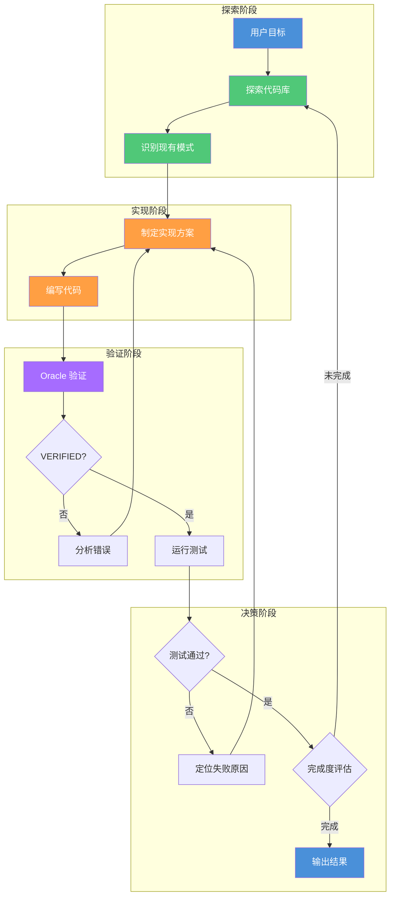
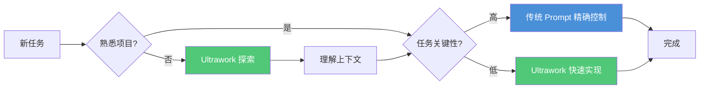
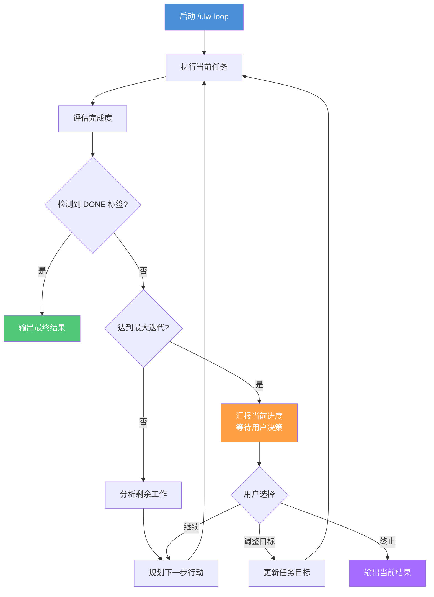

# Ultrawork 模式

> 目标驱动而非指令驱动：让 **Agent（智能体）** 自主探索代码库、研究模式、实现功能并验证结果的全自动工作流。

## 文章概述

Ultrawork 模式是 oh-my-openagent 的旗舰工作流。它的核心思路是：你不需要告诉 Agent 怎么做，只需要告诉它做什么。Agent 会自动探索代码库、研究现有模式、实现功能、通过 LSP 验证结果，然后根据结果决定下一步。这是从"给指令"到"给目标"的转变。

读完本文，你将能够启用 Ultrawork 模式让 Agent 自主完成从探索到验证的全流程，掌握 Ralph Loop 实现自我迭代直到任务完成，以及在合适的场景做出正确的模式选择。

本文从原理出发，深入讲解 Ultrawork 的工作机制和适用场景。你将学习如何启用 Ultrawork 模式（对话输入 `ulw` 或设置为默认模式），以及如何配合 Ralph Loop（`/ulw-loop`）实现自我迭代直到 100% 完成。我们还通过对比表分析 Ultrawork 与传统 **Prompt（提示词）** 方式在精准度、探索深度、Token 消耗和人工介入方面的差异，帮助你在合适的场景做出正确选择。

学习本文后，你会明白 Ultrawork 的核心价值：在不确定性和探索成本之间取得平衡。这在上下文复杂的任务、快速原型和大型重构中尤其有用。

> **⚠️ 何时不适合使用 Ultrawork**：Ultrawork 的自主探索特性在某些场景下反而会成为问题。以下情况不建议使用：（1）**严格合规要求**——如金融审计、医疗合规等场景，需要每一步都有明确记录，Ultrawork 的过程不透明特性无法满足审计需求；（2）**成本敏感环境**——Ultrawork 的探索阶段会消耗大量 Token（典型会话 50K-200K tokens），在 API 调用成本受限时不宜使用；（3）**精确输出要求**——需要严格按照特定格式或规范输出的场景，Ultrawork 的自主判断可能导致输出偏差；（4）**完全确定性的变更**——如生产环境的关键配置修改，每一步都需要人工确认。在这些场景中，建议使用 [Prometheus 规划模式](prometheus-mode.md) 或传统 Prompt。

> **⏱ 时间有限？先读这些：** Ultrawork 的工作原理 → Ultrawork 使用方式 → Ultrawork vs 传统 Prompt 对比 → Ralph Loop 机制

---

## Ultrawork 的工作原理

### 定义："懒得想"模式

Ultrawork 的核心理念可以用一句话概括：**你只说目标，Agent 自己想办法**。这是一种"懒得想"模式——当你不想花时间写详细的需求文档、不想逐步指导 Agent 如何实现时，Ultrawork 让 Agent 自主完成从探索到验证的全过程。

### 闭环工作机制

Ultrawork 的工作流程是一个持续迭代的闭环：



**各阶段详解**：

| 阶段 | 核心活动 | 关键能力 |
|------|---------|---------|
| **探索阶段** | 扫描项目结构、阅读相关文件、理解现有架构 | 代码库导航、模式识别 |
| **实现阶段** | 设计方案、编写代码、遵循项目规范 | 代码生成、风格匹配 |
| **验证阶段** | Oracle 验证 (VERIFIED) + LSP 补充检查 | 错误诊断、问题定位 |
| **决策阶段** | 评估完成度、决定下一步行动 | 自我评估、路径规划 |

### 与传统 Prompt 的本质区别

传统 Prompt 模式是"指令驱动"：你需要详细说明每一步怎么做。Ultrawork 是"目标驱动"：你只说想要什么结果。

**传统 Prompt 示例**：

```text:terminal
请帮我实现用户登录功能：
1. 先阅读 src/auth/ 目录下的现有认证代码
2. 参考 AuthService 的实现风格
3. 在 src/auth/LoginService.ts 中创建 LoginService 类
4. 实现 login 方法，使用 bcrypt 验证密码
5. 添加单元测试到 tests/auth/LoginService.test.ts
6. 运行测试确保通过
```

**Ultrawork 示例**：

```text:terminal
ulw 实现用户登录功能
```

Agent 会自动完成上述所有步骤，无需你逐条指定。

---

## Ultrawork 使用方式

### 方式一：对话中临时激活

在任意对话中输入 `ulw` 或 `ultrawork`，即可将当前会话切换到 Ultrawork 模式：

```bash:terminal
# 简写形式
ulw 为订单模块添加批量导出功能

# 完整形式
ultrawork 重构用户服务，提取公共逻辑
```

**特点**：
- 仅对当前任务生效
- 任务完成后恢复默认模式
- 适合临时性、探索性任务

### 方式二：设置为默认模式

在 `.opencode/oh-my-openagent.jsonc` 中配置默认模式（OMO v4.12.0+），让所有任务都使用 Ultrawork：

```json:.opencode/oh-my-openagent.jsonc
{
  "ultrawork": true,
  "ralph_loop": true
}
```

> **注**：`ultrawork` 和 `ralph_loop` 是 oh-my-openagent（OMO）v4.12.0+ 的原生配置项，非 OpenCode 核心配置。OMO 采用扁平 boolean schema，不需要嵌套 `default_mode` 结构。

**特点**：
- 所有任务默认使用 Ultrawork
- 适合探索性开发、原型项目
- 可通过 `/plan` 命令临时切换到精确模式

### 方式三：配合 Ralph Loop 使用

使用 `/ulw-loop` 命令（OMO v1.15+）启动带自我迭代的 Ultrawork：

```bash:terminal
# 基础用法
/ulw-loop 实现用户登录功能

# 指定最大迭代次数
/ulw-loop --max-iterations=20 重构订单模块

# 自定义完成承诺
/ulw-loop --completion-promise="tests_pass" 添加单元测试
```

---

## Ultrawork vs 传统 Prompt 对比

### 四维度对比表

| 维度 | Ultrawork | 传统 Prompt |
|------|-----------|-------------|
| **精准度** | 中等（依赖 Agent 自主判断） | 高（用户精确控制） |
| **探索深度** | 深（自动发现相关上下文） | 浅（受限于用户指定范围） |
| **Token 消耗** | 较高（探索开销） | 可控（按指令执行） |
| **人工介入** | 低（设定目标后放手） | 高（需要逐步指导） |
| **学习曲线** | 低（只需描述目标） | 高（需要了解项目细节） |
| **结果一致性** | 中等（可能有多条路径） | 高（按预设路径执行） |
| **审计友好** | 低（过程不透明） | 高（步骤清晰可追溯） |
| **适用周期** | 探索期、原型期 | 生产期、维护期 |

### 决策指南：何时选择 Ultrawork

**选择 Ultrawork 的场景**：

1. **不熟悉的项目**：Agent 自主探索比你自己研究更高效
2. **快速原型开发**：时间紧迫，不需要完美方案
3. **探索性编程**：不确定最佳实现路径，让 Agent 尝试
4. **大型重构**：涉及多个模块，难以预见所有依赖
5. **文档补全**：让 Agent 自动发现缺失文档的 API

**选择传统 Prompt 的场景**：

1. **关键业务逻辑**：需要精确控制每个细节
2. **安全敏感代码**：不允许自主决策
3. **需要审计轨迹**：每一步都要有记录
4. **团队协作项目**：变更需要可预测
5. **性能关键路径**：实现方式有严格要求

### Ultrawork 审计限制与弥补方案

Ultrawork 的"过程不透明"特性是其与 Prometheus 和传统 Prompt 的核心差异之一。了解具体哪些信息被记录、哪些未被记录，有助于在需要审计的场景中制定弥补策略。

**已记录的信息**：

| 信息类型 | 记录方式 | 可用性 |
|---------|---------|--------|
| 文件变更历史 | Git diff | ✅ 完全可追溯 |
| LSP 诊断结果 | 客户端日志 | ✅ 可复现 |
| 最终输出摘要 | 会话记录 | ✅ 可查阅 |
| 使用的命令 | Bash 执行日志 | ✅ 可审计 |
| Token 消耗统计 | API 调用日志 | ✅ 可量化 |

**未记录的信息**：

| 信息类型 | 缺失原因 | 审计风险 |
|---------|---------|---------|
| Agent 决策路径 | 探索过程在模型内部，不持久化 | ⚠️ 无法追溯"为什么选择方案 A" |
| 被拒绝的方案 | 仅保留最终结果 | ⚠️ 无法审查"放弃了哪些选项" |
| 探索范围的边界 | 未明确记录的路径不可见 | ⚠️ 无法确认"是否考虑了所有可能" |
| 中间状态 | 仅保留最终状态 | ⚠️ 无法恢复中途失败的状态 |

**弥补策略**：

| 策略 | 操作 | 审计效果 |
|------|------|---------|
| **启用详细日志** | 配置 `"log_level": "debug"` | 记录更多决策上下文 |
| **配合 Prometheus 使用** | Prometheus 做规划，Ultrawork 做执行 | 规划阶段可审计，执行阶段高效 |
| **事后 Git 追溯** | 审查 commit 信息和 diff | 文件级变更完整可追溯 |
| **工作流状态文件** | 使用 WORKFLOW_STATE.md 记录执行状态 | 阶段级进度可追踪 |
| **组合审计模式** | 关键决策点使用 `ask` 权限让用户确认 | 人工参与点可记录 |

**最佳实践**：对于需要中等审计强度的场景，推荐"Prometheus 规划 + Ultrawork 执行"的组合模式。规划阶段生成的结构化计划作为审计基线，执行阶段的 Git 变更作为实现证据，两者结合即可覆盖大部分审计需求。

### 混合策略

实际项目中，建议采用混合策略：



---

## Ralph Loop 机制

### 什么是 Ralph Loop

Ralph Loop（`/ulw-loop`）是 Ultrawork 的自我迭代机制。与普通 Loop 不同，Ralph Loop 不是预设步骤的重复执行，而是 Agent 根据当前完成情况自主决定下一步行动。

**核心理念**：Agent 会持续工作直到任务 100% 完成，而非单次执行后停止。

### Ralph Loop vs 普通 Loop

| 特性 | Ralph Loop | 普通 Loop |
|------|-----------|----------|
| **决策主体** | Agent 自主决策 | 预设步骤 |
| **停止条件** | DONE 标签（完成承诺） | 固定次数/条件 |
| **路径规划** | 动态调整 | 固定路径 |
| **适应性** | 高（根据反馈调整） | 低（机械重复） |
| **适用场景** | 目标导向任务 | 流程化任务 |

### Ralph Loop 决策流程



### 控制参数

| 参数 | 说明 | 默认值 | 示例 |
|------|------|--------|------|
| `max_iterations` | 最大迭代次数 | 100（Ultrawork 默认 500） | `--max-iterations=20` |
| `completion_promise` | 完成承诺标签 | ` DONE ` | `--completion-promise=TEXT` |

**完成承诺机制**：

Ralph Loop 不依赖 `stop_condition` 或完成度百分比。它的停止机制基于 **完成承诺（Completion Promise）**——Agent 在输出中写入 ` DONE ` 标签声明任务完成。Loop 扫描到该标签即停止。

> 这是 Agent 自主报告的机制，并非系统级强制执行。Agent 可能在不适当的时候输出完成标签（见"已知限制"）。

### 完整配置示例

```json:.opencode/oh-my-openagent.jsonc
{
  "ultrawork": true,
  "ralph_loop": true
}
```

**配置说明**：

| 配置项 | 说明 | 所属 |
|-------|------|------|
| `ultrawork` | 启用 Ultrawork 作为默认模式（OMO v4.12.0+，扁平 boolean） | oh-my-openagent |
| `ralph_loop` | 启用 Ralph Loop 自我迭代 | oh-my-openagent |

> OMO 采用扁平 boolean schema，不存在 `default_mode` 嵌套结构或 `ultrawork.enabled`/`ultrawork.maxParallelAgents`/`ultrawork.autoVerify`/`ultrawork.verificationLevel` 等配置项。上述配置中 `ultrawork` 和 `ralph_loop` 是 OMO 插件提供的能力，非 OpenCode 核心配置。

当 `max_iterations` 达到时，循环自动终止。`max_iterations` 通过命令行参数 `--max-iterations` 传入，不在配置文件中设置。

---

## 实战案例：使用 Ultrawork 为开源项目添加功能

### 场景描述

假设你刚接手一个不熟悉的开源项目，需要为其添加"用户头像上传"功能。项目使用 React + Node.js + PostgreSQL 技术栈，但你不确定：

- 现有的文件上传机制是什么
- 用户模型如何定义
- API 路由如何组织
- 数据库迁移如何处理

### 使用 Ultrawork 完成

**步骤 1：启动 Ultrawork**

```bash:terminal
ulw 为用户添加头像上传功能，支持 JPG/PNG 格式，最大 2MB
```

**步骤 2：观察 Agent 的探索过程**

Agent 会自动执行以下操作：

```text:terminal
[探索阶段]
→ 扫描项目结构，识别技术栈
→ 查找现有文件上传相关代码
→ 阅读用户模型定义
→ 分析 API 路由组织方式
→ 检查数据库迁移文件

[发现]
→ 项目已有 multer 中间件处理文件上传
→ 用户模型在 src/models/User.ts
→ API 路由在 src/routes/api/ 目录
→ 数据库迁移使用 Knex.js

[实现阶段]
→ 创建 src/routes/api/avatar.ts 路由
→ 扩展 User 模型添加 avatar_url 字段
→ 创建数据库迁移文件
→ 添加文件大小和格式验证
→ 编写单元测试

[验证阶段]
→ 运行 TypeScript 编译检查
→ 执行单元测试
→ 检查代码风格

[完成度评估]
→ 功能实现：100%
→ 测试覆盖：85%
→ 文档更新：待完成

[继续迭代]
→ 添加 API 文档
→ 更新 README
```

**步骤 3：验收结果**

Agent 会输出完整的变更摘要：

```text:terminal
任务完成！已实现用户头像上传功能：

新增文件：
- src/routes/api/avatar.ts（头像上传路由）
- src/middleware/avatarValidator.ts（文件验证中间件）
- migrations/20260602_add_avatar_url.ts（数据库迁移）
- tests/api/avatar.test.ts（单元测试）

修改文件：
- src/models/User.ts（添加 avatar_url 字段）
- src/routes/index.ts（注册新路由）

测试结果：12/12 通过
代码风格检查：通过
```

### 使用 Ralph Loop 确保完整交付

如果需要确保测试覆盖率达到目标：

```bash:terminal
/ulw-loop --max-iterations=15 --completion-promise="coverage>80" 为用户添加头像上传功能
```

Agent 会持续迭代直到测试覆盖率达标：

```text:terminal
[迭代 1] 实现基础功能，覆盖率 45%
[迭代 2] 添加边界条件测试，覆盖率 62%
[迭代 3] 添加错误处理测试，覆盖率 78%
[迭代 4] 添加文件验证测试，覆盖率 85%
[完成] 覆盖率达标，任务完成
```

---

## Ultrawork 的最佳实践

### 1. 提供清晰的目标描述

虽然 Ultrawork 是"目标驱动"，但目标本身的清晰度直接影响结果质量。

**好的目标描述**：

```text:terminal
ulw 实现用户头像上传功能，支持 JPG/PNG，最大 2MB，存储到 S3
```

**不好的目标描述**：

```text:terminal
ulw 加个头像功能
```

### 2. 利用 AGENTS.md 提供上下文

在项目的 AGENTS.md 中记录关键信息，帮助 Ultrawork 更好地理解项目：

```markdown:AGENTS.md
## 技术栈

- 前端：React 18 + TypeScript
- 后端：Node.js + Express
- 数据库：PostgreSQL + Knex.js
- 文件存储：AWS S3

## 编码规范

- 所有 API 路由放在 src/routes/api/ 目录
- 使用 Zod 进行请求验证
- 测试文件与源文件同名加 .test.ts 后缀
```

### 3. 合理设置迭代参数

根据任务复杂度调整 `max_iterations`（默认 100，Ultrawork 默认 500）：

| 任务复杂度 | 建议 max_iterations | 说明 |
|-----------|-------------------|------|
| 简单（单文件修改） | 3-5 | 快速完成 |
| 中等（多文件变更） | 10-15 | 多数任务适用 |
| 复杂（跨模块重构） | 20-50 | 允许更多探索 |
| 探索性（不确定范围） | 50-100 | 充分探索 |

### 4. 监控 Token 消耗

Ultrawork 的探索过程会消耗较多 Token。Ralph Loop 默认 100 次迭代（Ultrawork 默认 500），Token 消耗可达常规模式的 5-10 倍。建议：

- 设置 `max_iterations` 限制迭代次数，避免无限消耗
- 使用 `priority_patterns` 优先探索关键文件
- 定期检查 Token 使用情况

### 5. 与版本控制配合

Ultrawork 完成后，建议：

1. 使用 `git diff` 审查所有变更
2. 运行完整测试套件
3. 检查是否有意外的文件修改
4. 确认变更符合预期后再提交

---

## 常见问题

### Q: Ultrawork 会修改我不想修改的文件吗？

A: Ultrawork 遵循 AGENTS.md 中的约束规则。你可以在 AGENTS.md 中明确禁止修改某些文件：

```markdown:AGENTS.md
## 约束规则

- 禁止修改 config/ 目录下的配置文件
- 禁止修改 migrations/ 目录下已执行的迁移文件
- 禁止直接修改数据库 schema
```

### Q: Ultrawork 的探索过程会泄露敏感信息吗？

A: Ultrawork 只读取本地文件，不会将代码发送到外部服务器（除了发送给 LLM API）。建议：

- 不要在代码中存储敏感信息
- 使用环境变量管理密钥
- 将敏感文件添加到 `.gitignore`

### Q: 如何中断 Ultrawork 的执行？

A: 在任何时候输入 `/cancel-ralph` 即可中断当前任务。Agent 会保存当前进度并输出已完成的工作。

### Q: Ultrawork 适合生产环境部署吗？

A: Ultrawork 更适合开发阶段。生产环境的变更建议使用 Prometheus 模式，确保每一步都有审计轨迹。

---

## 已知限制

### 诚信系统漏洞（Honor System）

完成承诺机制（Completion Promise）依赖 **Agent 自主报告**。Agent 在输出中包含 ` DONE ` 标签即声明任务完成，Loop 扫描到该标签便停止。

这是一个"诚信系统"——系统不验证 Agent 是否真的完成了所有工作。已知问题：Agent 可能在不适当的时候输出完成标签，导致任务被过早标记为完成。

> **追踪**：OMO issue #1921 — Agent 可能在未实际完成工作的情况下输出 ` DONE ` 标签。

**缓解措施**：
- 设置 `verificationLevel: "strict"` 启用严格的 Oracle 验证
- 降低 `max_iterations` 避免因迭代过多导致 Agent 过早声明完成
- 审查 Agent 输出的变更摘要，确认完成质量

### 流程图非系统级状态机

本书中的 Ultrawork 工作流流程图（探索 → 实现 → 验证 → 决策）表示的是 **通过 Prompt 注入引导的 Agent 预期行为**，而非系统级强制的状态机。Agent 的行为受 LLM 能力限制，实际执行路径可能与图示有偏差。

---

---

## 延伸阅读：Prometheus 规划模式

Ultrawork 的"先做再说"风格在处理探索性任务时非常高效。但对于另一些场景——需要审计轨迹、需求模糊或涉及多方利益时——我们提供了 **Prometheus 规划模式**。

Prometheus 模式（`@plan`）采用访谈式需求收集的工作方式。与 Ultrawork 的"你说目标我干活"不同，Prometheus 会主动向你提问，逐步澄清需求，直到形成一份结构化的执行计划，再由 Atlas 指挥官执行。

> → [Prometheus 规划模式详解](prometheus-mode.md) — 了解访谈式规划、Atlas 执行指挥官和三模式决策框架的完整内容。

以下对比表帮助你在三种模式中快速选择：

| 维度 | 传统 Prompt | Prometheus 模式 | Ultrawork 模式 |
|------|-----------|----------------|---------------|
| **工作方式** | 手动写明所有步骤 | 访谈收集需求 → 结构化计划 → 自动执行 | Agent 自主探索并实现 |
| **需求明确度** | 用户必须完全清楚 | 逐步澄清，从模糊到明确 | 用户只需描述目标 |
| **人工介入** | 高（全程指导） | 中（访谈 + 确认计划） | 低（设定目标后放手） |
| **审计轨迹** | 高（步骤清晰可查） | 高（计划可逐条对照） | 低（过程不透明） |
| **启动速度** | 快（直接写 Prompt） | 中（需完成访谈阶段） | 快（一句话目标） |
| **探索深度** | 浅（受限于指令范围） | 中（按计划执行，边界可控） | 深（Agent 自动发现） |
| **适合场景** | 关键业务、安全敏感 | 需求模糊 + 需要审计 | 快速原型、探索任务 |
| **Token 消耗** | 可控 | 中上（访谈阶段有开销） | 较高（探索阶段开销大） |

**选择指南**：

```text:terminal
需求明确 + 需要精确控制 → 传统 Prompt
需求模糊 + 需要审计轨迹 → Prometheus 模式
需求模糊 + 追求效率 → Ultrawork 模式
```

---

## 小结

Ultrawork 模式代表了 AI 编程的一次范式转变：从"告诉 Agent 怎么做"到"告诉 Agent 做什么"。这种目标驱动的方式在探索性任务、快速原型和不熟悉的项目中尤其有价值。

Ralph Loop（`/ulw-loop`）进一步增强了 Ultrawork 的能力，让 Agent 能够自我迭代直到任务完全完成。通过合理配置控制参数，你可以在效率和可控性之间找到平衡。

接下来 → [Prometheus 规划模式](prometheus-mode.md) 探讨了"计划优先"的方法论，它补充了 Ultrawork 的"探索优先"哲学。理解何时使用每种模式是 **Harness Engineering（驾驭工程）** 的核心能力之一。

---

## 学习检查清单

完成本章学习后，请确认你能够：

- [ ] 解释 Ultrawork 的"目标驱动"理念与传统 Prompt 的区别
- [ ] 使用三种方式启用 Ultrawork：临时激活、默认模式、Ralph Loop
- [ ] 配置 Ultrawork 的控制参数（max_iterations、completion_promise 等）
- [ ] 判断何时选择 Ultrawork、何时选择传统 Prompt
- [ ] 使用 `/ulw-loop` 实现自我迭代的任务执行
- [ ] 了解 Prometheus 规划模式与 Ultrawork 的差异和配合方式（→ [Prometheus 规划模式](prometheus-mode.md)）

---

## 关联章节

- ← [工作流模式](../02-core-concepts/workflow-patterns.md) — Command 触发 Ultrawork
- ← [oh-my-openagent 集成](../03-setup/oh-my-openagent-setup.md) — OMO 配置是 Ultrawork 的基础
- → [Prometheus 规划模式](prometheus-mode.md) — 对比探索优先 vs 计划优先
- → [多 Agent 协作](multi-agent-collab.md) — Ultrawork 与多 Agent 协作的关系
