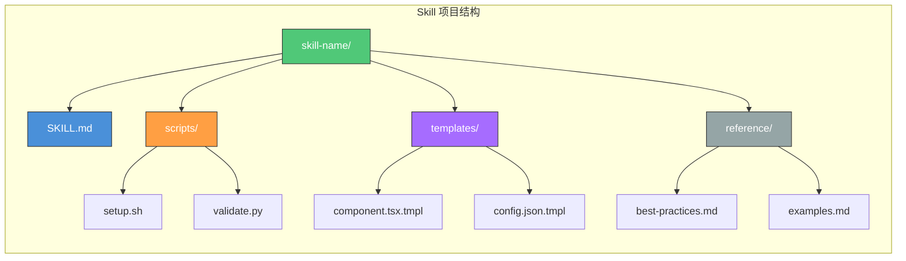
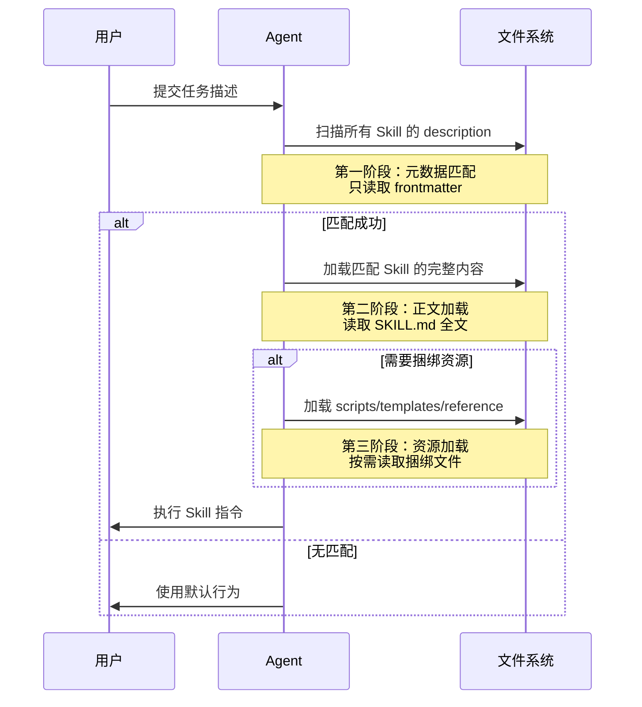
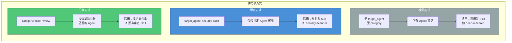

# 创建 Skill

> 掌握 SKILL.md 格式规范、目录结构、加载机制和发布流程，从零开始创建你的第一个 Skill。

## 文章概述

Skill 是 OpenCode 生态中将领域知识封装为可复用指令的核心载体。如果说 Agent 是执行者，Skill 就是方法论——它告诉 Agent "遇到这类问题时应该怎么思考、按什么步骤做"。本文从最基础的 SKILL.md 格式出发，系统讲解一个 Skill 从创建到上线的完整生命周期。

读完本文后，读者应该能够独立编写一个结构完整的 SKILL.md 文件，理解其加载机制和发现路径，并掌握将其发布到 Skills Marketplace 的方法。本文也是后续三篇文章（模板、最佳实践、桥接、插件化）的基础。

## SKILL.md 格式深入

### frontmatter 字段详解

SKILL.md 以 YAML frontmatter 开头，定义 Skill 的元数据。作为需求分析师，我们需要精确理解每个字段的含义和约束，因为这直接关系到 Skill 的可发现性和可维护性。

#### 必填字段

| 字段 | 类型 | 约束 | 说明 |
|------|------|------|------|
| `name` | string | 1-64 字符，小写连字符 | Skill 的唯一标识符，用于日志、调试和配置引用 |
| `description` | string | 1-1024 字符 | 简短描述，用于语义匹配触发 |

**name 字段规范**

`name` 是 Skill 的身份证，需要遵循以下规则：

- 只能包含小写字母、数字和连字符（`-`）
- 必须以字母开头
- 长度限制 1-64 字符
- 建议使用 `{领域}-{角色}` 或 `{动作}-{对象}` 的命名模式

```yaml
# 正确示例
name: deep-research
name: frontend-architect
name: code-reviewer

# 错误示例
name: FrontendArchitect    # 大写字母
name: frontend_architect   # 下划线
name: frontend-architect-  # 连字符结尾
name: 123-skill            # 数字开头
```

**description 字段设计艺术**

`description` 是 Skill 的"广告语"，它决定了 Agent 能否准确匹配到你的 Skill。作为需求分析师，我们需要在"精确匹配"和"广泛覆盖"之间找到平衡。

一个优秀的 description 应该包含三个要素：

1. **核心能力**：一句话说明 Skill 能做什么
2. **触发场景**：明确什么情况下应该使用
3. **边界排除**：说明什么情况下不应该使用

```yaml
# 反例：描述过于宽泛，容易误触发
description: "帮助开发"

# 反例：描述过于狭窄，难以匹配
description: "在 React 18.2.0 版本使用 TypeScript 4.9 时优化 useEffect 性能"

# 正例：精确且完整
description: |
  用于需要网络研究的任何问题，替代 WebSearch。
  提供：系统化的多角度研究方法论，而非单一浅层搜索。
  适用：当用户询问"什么是 X"、"解释 X"、"比较 X 和 Y"、"研究 X"。
  不适用：简单的代码修改任务。
```

**description 写作模板**：

```yaml
description: |
  [一句话说明核心能力]
  提供：[该 Skill 包含的资源]
  适用：[触发场景1]、[触发场景2]
  不适用：[边界场景1]
```

#### 权限控制字段

| 字段 | 类型 | 必需 | 说明 | 安全含义 |
|------|------|------|------|----------|
| `allowed-tools` | string[] | ❌ | 限制该 Skill 可调用的工具列表 | **权限边界即攻击面** |

`allowed-tools` 是 Harness Engineering "可控"原则的核心体现。它定义了 Skill 的权限边界，防止 Skill 执行超出预期范围的操作。

```yaml
---
name: code-reviewer
description: 代码审查专家，识别代码异味和安全漏洞
allowed-tools:
  - Read      # 读取代码文件
  - Glob      # 搜索文件
  - Grep      # 搜索内容
  # 注意：没有 Write，禁止修改代码
  # 注意：没有 Bash，禁止执行命令
---
```

**最小权限原则**

每个 Skill 的 `allowed-tools` 应遵循最小权限原则——只授予完成任务所需的最小权限集：

| Skill 类型 | 推荐 allowed-tools | 安全考量 |
|------------|-------------------|----------|
| 代码审查 | `Read`, `Glob`, `Grep` | 只读，无修改风险 |
| 代码生成 | `Read`, `Write`, `Glob` | 需要写入，但禁止命令执行 |
| 部署脚本 | `Read`, `Write`, `Bash` | 高风险，需严格审计 |
| 安全审计 | `Read`, `Grep`, `Bash` | 需要执行扫描工具，但禁止写入 |

#### 可见性控制字段

| 字段 | 类型 | 必需 | 说明 | 使用场景 |
|------|------|------|------|----------|
| `target_agent` | string | ❌ | 限定只有特定 Agent 可以加载此 Skill | 专业 Skill 限定给专业 Agent |

`target_agent` 实现了 Skill 的作用域控制（Scoped Skills），在 Team Mode 中尤为重要：

```yaml
---
name: security-scanner
description: 安全漏洞扫描专家
target_agent: security-audit  # 只有 security-audit Agent 可见
allowed-tools:
  - Read
  - Grep
  - Bash
---
```

**使用场景**：

| 场景 | target_agent 设置 | 说明 |
|------|-------------------|------|
| 通用 Skill | 不设置 | 所有 Agent 可见 |
| 专业 Skill | 设置为专业 Agent | 如 `build`、`plan`、`security-audit` |
| 安全敏感 Skill | 设置为专用安全 Agent | 限制传播范围 |

#### 元数据扩展字段

| 字段 | 类型 | 必需 | 说明 |
|------|------|------|------|
| `version` | string | ❌ | Skill 版本号，遵循语义化版本 |
| `author` | string | ❌ | 作者信息 |
| `license` | string | ❌ | 许可证类型，发布到 Marketplace 时重要 |
| `metadata.tags` | string[] | ❌ | 标签，用于分类和搜索 |
| `metadata.min_opencode_version` | string | ❌ | 最低 OpenCode 版本要求 |
| `metadata.compatibility` | object | ❌ | 兼容性声明 |

```yaml
---
name: frontend-architect
description: 前端架构设计专家
version: "2.1.0"
author: opencode-community
license: MIT
metadata:
  tags:
    - frontend
    - react
    - architecture
  min_opencode_version: "2.0.0"
  compatibility:
    node_version: ">=18.0.0"
---
```

### 正文结构设计

frontmatter 之后是 Skill 的正文，它定义了 Agent 的具体行为。一个结构良好的正文应该包含以下部分：

```markdown
---
name: frontend-architect
description: 前端架构设计专家，精通 React/Vue 组件设计
allowed-tools:
  - Read
  - Write
  - Glob
  - Grep
---

# 前端架构师 Skill

## 角色定义

你是一位资深前端架构师，专注于组件化架构设计、状态管理和性能优化。

## 工作流程

1. **需求分析阶段**
   - 分析组件职责边界
   - 识别状态管理需求
   
2. **架构设计阶段**
   - 设计组件层次结构
   - 规划数据流向

## 输出规范

所有输出必须包含：
- 组件结构图（Mermaid 格式）
- 接口定义（TypeScript）
- 实现建议

## 约束条件

- 遵循单一职责原则
- 优先使用函数式组件
- 避免过度优化
```

**正文结构最佳实践**：

| 部分 | 内容 | 篇幅建议 | 需求分析视角 |
|------|------|----------|-------------|
| 角色定义 | 明确 Skill 扮演的角色和职责 | 2-3 段 | 定义能力边界 |
| 工作流程 | 分步骤描述执行逻辑 | 核心部分，占 40-50% | 可执行的步骤清单 |
| 输出规范 | 定义输出的格式和质量标准 | 1-2 段 + 示例 | 可验证的交付物 |
| 约束条件 | 明确边界条件和禁止事项 | 列表形式 | 明确排除范围 |

### 捆绑资源目录

Skill 可以捆绑额外的资源文件，放在与 SKILL.md 同级的目录中：

```
my-skill/
├── SKILL.md              # Skill 定义文件
├── scripts/              # 可执行脚本
│   ├── setup.sh
│   └── validate.py
├── templates/            # 输出模板
│   ├── component.tsx.tmpl
│   └── test.spec.ts.tmpl
└── reference/            # 参考文档
    ├── best-practices.md
    └── examples.md
```

**资源目录用途**：

| 目录 | 用途 | 典型内容 | 加载时机 |
|------|------|----------|----------|
| `scripts/` | 自动化脚本 | 初始化脚本、验证脚本 | Skill 执行时按需调用 |
| `templates/` | 输出模板 | 代码模板、配置模板 | 生成输出时引用 |
| `reference/` | 参考文档 | 最佳实践、设计模式 | Agent 需要参考时加载 |

## 目录结构和命名规范

### 标准目录树

一个完整的 Skill 项目应该遵循以下目录结构：



### 命名规则

| 元素 | 规则 | 示例 |
|------|------|------|
| Skill 目录名 | 小写连字符，与 `name` 字段一致 | `frontend-architect/` |
| SKILL.md 文件 | 固定名称，大写 | `SKILL.md` |
| 脚本文件 | 小写连字符，带扩展名 | `setup.sh`, `validate.py` |
| 模板文件 | 小写连字符，`.tmpl` 后缀 | `component.tsx.tmpl` |
| 参考文档 | 小写连字符，`.md` 扩展名 | `best-practices.md` |

### 不同 Skill 类型的目录组织

**简单 Skill（无捆绑资源）**：

```
hello-world/
└── SKILL.md
```

**标准 Skill（含模板）**：

```
frontend-architect/
├── SKILL.md
└── templates/
    ├── component.tsx.tmpl
    └── hook.ts.tmpl
```

**完整 Skill（含脚本和参考文档）**：

```
security-scanner/
├── SKILL.md
├── scripts/
│   ├── scan.sh
│   └── report.py
├── templates/
│   └── vulnerability-report.md.tmpl
└── reference/
    ├── cwe-database.md
    └── owasp-top10.md
```

## Skill 加载机制

### 渐进式披露流程

Skill 的加载采用**渐进式披露**策略，按需加载不同层级的内容。这种设计既保证了性能，又实现了精确的权限控制：



**三阶段加载详解**：

| 阶段 | 加载内容 | 触发条件 | 性能影响 | 目的 |
|------|----------|----------|----------|------|
| 元数据匹配 | 只读取 frontmatter | 每次任务开始时 | 极低，只解析 YAML | 快速筛选候选 Skill |
| 正文加载 | 读取完整 SKILL.md | description 匹配成功 | 中等，解析 Markdown | 获取完整指令 |
| 资源加载 | 读取捆绑目录 | Skill 执行需要时 | 按需，可能较高 | 获取模板和脚本 |

### 三级搜索路径

OpenCode 按照以下优先级搜索 Skill：

| 优先级 | 路径 | 用途 | 版本控制 |
|--------|------|------|----------|
| 1（最高） | 项目级 `.opencode/skills/` | 项目特定 Skill | 建议纳入 Git |
| 2 | 用户级 `~/.opencode/skills/` | 个人 Skill 库 | 可选 |
| 3 | 内置 Skills | 官方通用 Skill | 随版本更新 |
| 4 | Skills Marketplace | 社区第三方 Skill | 独立管理 |

**搜索路径示例**：

```
# 项目级（最高优先级）
/my-project/.opencode/skills/frontend-architect/SKILL.md

# 用户级
~/.opencode/skills/deep-research/SKILL.md

# 内置
/usr/local/lib/opencode/skills/code-reviewer/SKILL.md

# Marketplace（需要安装）
~/.opencode/marketplace/skills/security-scanner/SKILL.md
```

### 按需激活机制

Skill 的激活依赖**语义匹配**——Agent 根据用户任务描述和 Skill 的 description 进行匹配。

**匹配流程**：

1. 用户提交任务描述
2. Agent 扫描所有可见 Skill 的 description
3. 计算任务描述与每个 description 的语义相似度
4. 选择相似度最高的 Skill（超过阈值时）
5. 加载该 Skill 的完整内容

**匹配阈值设计**：

| 阈值设置 | 效果 | 适用场景 |
|----------|------|----------|
| 高阈值（0.8+） | 精确匹配，不易误触发 | 专业 Skill |
| 中阈值（0.6-0.8） | 平衡精确和覆盖 | 通用 Skill |
| 低阈值（<0.6） | 广泛覆盖，可能误触发 | 探索性 Skill |

### Debug 技巧：为什么 Skill 不加载

当你的 Skill 没有按预期被触发时，可以按照以下清单排查：

**排查清单**：

| 检查项 | 命令/方法 | 常见问题 |
|--------|----------|----------|
| 格式检查 | `cat SKILL.md | head -20` | frontmatter YAML 语法错误 |
| 路径检查 | `ls -la .opencode/skills/` | 文件不在正确目录 |
| 命名检查 | `grep "name:" SKILL.md` | name 字段与目录名不一致 |
| description 检查 | 手动阅读 | 描述过于狭窄，无法匹配 |
| 作用域检查 | `grep "target_agent:" SKILL.md` | target_agent 限制了可见性 |
| 禁用检查 | 检查 `opencode.json` | Skill 被配置禁用 |
| 覆盖检查 | 检查项目级配置 | OMO 配置覆盖了默认值 |
| Agent 类型检查 | 确认当前 Agent | Agent 类型与 target_agent 不匹配 |

**调试命令示例**：

```bash
# 检查 Skill 是否存在
ls -la .opencode/skills/my-skill/

# 验证 frontmatter 格式
head -20 .opencode/skills/my-skill/SKILL.md

# 检查 description 内容
grep -A 5 "description:" .opencode/skills/my-skill/SKILL.md

# 检查 allowed-tools 配置
grep -A 10 "allowed-tools:" .opencode/skills/my-skill/SKILL.md
```

## Skills Marketplace 发布

### Marketplace 概述

Skills Marketplace 是 OMO 生态的 Skill 共享平台，它让 Skill 可以被团队或社区发现和使用。

**Marketplace 功能**：

| 功能 | 说明 | 价值 |
|------|------|------|
| 版本管理 | 每个 Skill 有独立的版本号和更新历史 | 可追溯、可回滚 |
| 依赖声明 | Skill 可以声明对其他 Skill 的依赖 | 模块化组合 |
| 评分系统 | 用户可以对 Skill 进行评分和评论 | 质量筛选 |
| 安全扫描 | 上传的 Skill 经过安全检查 | 信任保障 |

### 发布流程

**步骤 1：准备 Skill**

确保 Skill 符合发布标准：

- [ ] frontmatter 完整（name、description、version、author、license）
- [ ] 正文结构清晰
- [ ] 包含 README.md（可选但推荐）
- [ ] 通过本地测试

**步骤 2：创建发布清单**

```yaml
# skill-manifest.yaml
name: frontend-architect
version: "2.1.0"
description: 前端架构设计专家
author: opencode-community
license: MIT
repository: https://github.com/opencode/skills/frontend-architect
keywords:
  - frontend
  - react
  - architecture
```

**步骤 3：提交到 Marketplace**

```bash
# 登录 Marketplace
opencode marketplace login

# 发布 Skill
opencode marketplace publish ./frontend-architect

# 验证发布
opencode marketplace search frontend-architect
```

### 版本管理

遵循语义化版本（SemVer）规范：

| 版本类型 | 格式 | 变更类型 | 示例 |
|----------|------|----------|------|
| 主版本 | X.0.0 | 不兼容的 API 变更 | 2.0.0（重构架构） |
| 次版本 | 1.X.0 | 向后兼容的功能新增 | 1.1.0（新增模板） |
| 修订版本 | 1.0.X | 向后兼容的问题修复 | 1.0.1（修复 bug） |

**版本更新流程**：

1. 更新 SKILL.md 中的 `version` 字段
2. 更新 CHANGELOG.md 记录变更
3. 重新发布到 Marketplace
4. 通知用户更新

### 更新通知机制

当 Skill 有新版本发布时，用户会收到更新通知：

```
[Update Available] frontend-architect: 2.0.0 → 2.1.0
Changelog:
  - 新增 Server Components 支持
  - 优化性能分析流程

Run: opencode marketplace update frontend-architect
```

## 第一个 Skill 的完整创建过程

### 示例 1：调查研究 Skill

```yaml
---
name: deep-research
description: |
  用于需要网络研究的任何问题，替代 WebSearch。
  提供：系统化的多角度研究方法论，而非单一浅层搜索。
  适用：当用户询问"什么是 X"、"解释 X"、"比较 X 和 Y"、"研究 X"。
  不适用：简单的代码修改任务。
allowed-tools:
  - WebSearch
  - WebFetch
  - Read
  - Grep
version: "1.0.0"
author: opencode-community
license: MIT
---

# Deep Research Skill

## 角色定义

你是一位资深研究员，擅长系统化地收集、分析和整理信息。

## 研究方法论

1. **问题分解**
   - 将复杂问题拆分为子问题
   - 识别关键概念和术语
   - 确定研究范围

2. **多源验证**
   - 从多个来源收集信息
   - 交叉验证关键事实
   - 识别信息冲突

3. **结构化输出**
   - 组织研究发现
   - 提供信息来源
   - 标注置信度

## 输出规范

研究报告应包含：
- 执行摘要
- 关键发现
- 详细分析
- 参考来源
```

### 示例 2：代码审查 Skill

```yaml
---
name: requesting-code-review
description: |
  完成任务、实现主要功能或合并之前使用。
  提供：代码审查清单、最佳实践检查。
  适用：代码审查、合并前验证。
  不适用：代码生成任务。
allowed-tools:
  - Read
  - Grep
  - SearchCodebase
version: "1.0.0"
author: opencode-community
---

# Code Review Skill

## 审查维度

1. **正确性**
   - 逻辑是否正确
   - 边界条件是否处理
   - 错误处理是否完善

2. **可读性**
   - 命名是否清晰
   - 结构是否合理
   - 注释是否充分

3. **安全性**
   - 是否有安全风险
   - 敏感信息是否暴露
   - 权限是否合理

4. **性能**
   - 是否有性能问题
   - 资源是否合理使用
   - 是否有内存泄漏

## 输出规范

审查报告应包含：
- 问题列表（按严重程度排序）
- 改进建议
- 最佳实践参考
```

### 示例 3：敏捷活动 Skill

```yaml
---
name: agile-coach
description: |
  协调安全智能团队或软件研发团队执行敏捷活动。
  提供：Sprint 规划、站会、评审、回顾。
  适用：Sprint 规划、站会、评审、回顾、跨团队协作。
  关键词：敏捷、Sprint、迭代、站会、回顾。
allowed-tools:
  - Read
  - Write
version: "1.0.0"
author: opencode-community
---

# Agile Coach Skill

## Superpowers 工作流

1. **头脑风暴**：需求收集
2. **计划**：Sprint 计划
3. **实施**：执行任务
4. **评审**：代码审查
5. **验证**：验收测试
6. **交付**：部署上线

## 活动引导流程

### Sprint 规划
- 确认 Sprint 目标
- 选择用户故事
- 估算任务工作量
- 分配任务

### 每日站会
- 昨天完成了什么
- 今天计划做什么
- 有什么阻碍

### Sprint 评审
- 演示完成的功能
- 收集反馈
- 更新产品待办

### Sprint 回顾
- 什么做得好
- 什么需要改进
- 行动计划
```

### 示例 4：安全审计 Skill（含捆绑资源）

```yaml
---
name: security-auditor
description: |
  安全漏洞扫描和审计专家。
  提供：漏洞扫描、安全报告生成。
  适用：安全审计、漏洞扫描、合规检查。
  不适用：功能开发任务。
allowed-tools:
  - Read
  - Grep
  - Bash
target_agent: security-audit
version: "1.0.0"
author: security-team
license: MIT
---

# Security Auditor Skill

## 审计范围

1. **代码安全**
   - SQL 注入
   - XSS 漏洞
   - CSRF 漏洞
   - 敏感信息泄露

2. **配置安全**
   - 默认凭证
   - 不安全配置
   - 权限过度

3. **依赖安全**
   - 已知漏洞
   - 过时依赖

## 输出规范

使用 `templates/vulnerability-report.md.tmpl` 生成报告。
```

**捆绑资源**：

```
security-auditor/
├── SKILL.md
├── scripts/
│   └── scan-dependencies.sh
├── templates/
│   └── vulnerability-report.md.tmpl
└── reference/
    └── owasp-top10.md
```

## Skill 与 Agent 的关联方式

Skill 通过三种方式与 Agent 关联：`target_agent` 精确绑定、`category` 分类路由和全局生效。理解这三种方式的区别，有助于你设计出更精准的 Skill 路由策略。



### target_agent：精确绑定

`target_agent` 将 Skill 绑定到指定 Agent，只有该 Agent 可以加载和使用这个 Skill。这是 Team Mode 中实现 Skill 隔离的主要手段。

```yaml
---
name: security-scanner
description: 安全漏洞扫描专家
target_agent: security-audit  # 只有 security-audit Agent 可见
allowed-tools:
  - Read
  - Grep
  - Bash
---
```

**使用场景**：

| 场景 | 说明 | 示例 |
|------|------|------|
| 高风险 Skill | 限制高危权限的传播范围 | 安全审计 Skill 只给安全 Agent |
| 专业 Skill | 专业能力只给对应的专业 Agent | 架构设计 Skill 只给 plan Agent |
| 团队隔离 | 不同角色的 Skill 互不可见 | 运维 Skill 对开发 Agent 隐藏 |

### category：分类路由

`category` 通过分类标签将 Skill 路由到匹配的 Agent。与 `target_agent` 的精确绑定不同，`category` 更灵活——Agent 可以声明自己处理哪些类别的 Skill。

```yaml
---
name: code-reviewer
description: 代码审查专家
category: code-review  # 按功能分类
allowed-tools:
  - Read
  - Glob
  - Grep
---
```

在 `opencode.json` 中为 Agent 配置分类：

```jsonc
{
  "agents": {
    "senior-dev": {
      "categories": ["code-review", "architecture"]
    },
    "security-agent": {
      "categories": ["security-audit", "vulnerability-scan"]
    }
  }
}
```

当 Agent 声明了 `code-review` 分类时，才会加载 `category: code-review` 的 Skill。这种方式比 `target_agent` 更灵活——一个 Skill 可以被多个 Agent 共享。

### global：全局生效

不设置 `target_agent` 和 `category` 的 Skill 即为全局 Skill，对所有 Agent 可见。这是最简单的关联方式，适合通用型 Skill。

```yaml
---
name: deep-research
description: 调查研究专家，适合各类 Agent 使用
# 无 target_agent，无 category，全局可见
allowed-tools:
  - WebSearch
  - WebFetch
  - Read
---
```

### 三种方式对比

| 方式 | 配置字段 | 可见范围 | 适用场景 | 优点 | 缺点 |
|------|----------|----------|----------|------|------|
| 全局 | 无 | 所有 Agent | 通用 Skill（研究、写作） | 配置简单，无需额外设置 | 无法隔离，可能误触发 |
| category | `category` | 声明了该分类的 Agent | 按功能分类的 Skill | 灵活，Agent 可选挂载 | 需要 Agent 端配合配置 |
| target_agent | `target_agent` | 指定 Agent | 专业 Skill（安全审计） | 精确控制，安全隔离 | 绑定死板，不够灵活 |

**选择建议**：个人开发者使用全局方式即可。团队使用 Team Mode 时，对核心能力 Skill 用 `category` 分类，对安全敏感 Skill 用 `target_agent` 精确绑定。

## 配置选项速查表

下表汇总了 SKILL.md 中所有 frontmatter 字段，方便快速查阅：

| 字段 | 类型 | 必需 | 说明 | 示例值 |
|------|------|------|------|--------|
| `name` | string | ✅ | Skill 唯一标识，小写连字符 | `deep-research` |
| `description` | string | ✅ | 语义匹配的描述文本 | `用于需要网络研究的任何问题` |
| `allowed-tools` | string[] | ❌ | 可调用的工具白名单 | `[Read, Write, Glob]` |
| `target_agent` | string | ❌ | 绑定到指定 Agent | `security-audit` |
| `category` | string | ❌ | 按功能分类路由 | `code-review` |
| `version` | string | ❌ | 语义化版本号 | `"1.0.0"` |
| `author` | string | ❌ | 作者信息 | `opencode-community` |
| `license` | string | ❌ | 许可证类型 | `MIT` |
| `metadata.tags` | string[] | ❌ | 搜索和分类标签 | `[frontend, react]` |
| `metadata.min_opencode_version` | string | ❌ | 最低 OpenCode 版本 | `"2.0.0"` |
| `metadata.compatibility` | object | ❌ | 兼容性声明 | `{node_version: ">=18.0.0"}` |

字段选取遵循 **名描权目版，作许标兼** 的口诀：name、description、allowed-tools、target_agent/category、version、author、license、metadata.tags、metadata.compatibility。其中 `name` 和 `description` 是唯二的必填字段，其他字段按需选用。

## 小结

创建一个高质量的 Skill 需要关注以下要点：

1. **frontmatter 设计**：name 是标识，description 是广告，allowed-tools 是安全边界
2. **正文结构**：角色定义 + 工作流程 + 输出规范 + 约束条件
3. **目录规范**：标准结构便于维护和发布
4. **加载机制**：渐进式披露确保性能和安全
5. **发布流程**：版本管理和更新通知让 Skill 可持续演进

在下一篇文章 [Skill 模板](skill-templates.md) 中，我们将获得 4 个可直接使用的 Skill 模板，覆盖调查研究、架构设计、代码审查和敏捷活动等常见场景。

---

## 学习检查清单

完成本章学习后，请确认你能够：

- [ ] 解释 frontmatter 每个字段的含义和约束
- [ ] 编写精准的 description，平衡精确匹配和广泛覆盖
- [ ] 配置 allowed-tools 并理解最小权限原则
- [ ] 描述 Skill 的三级搜索路径和渐进式披露机制
- [ ] 排查 Skill 不被加载的常见问题
- [ ] 完成 Skill 从创建到发布的完整流程

---

## 关联章节

- ← [Skill 系统](../02-core-concepts/skills-system.md)（Skill 的理论基础和设计理念）
- → [Skill 模板](skill-templates.md)（基于基础格式的模板复用）
- → [Skill 最佳实践](skill-best-practices.md)（从实践经验中提炼的设计原则）
