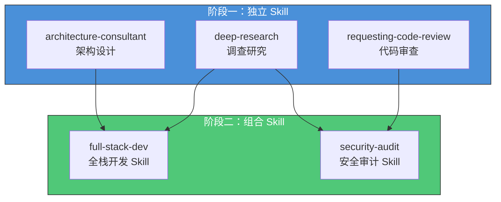
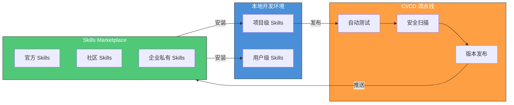
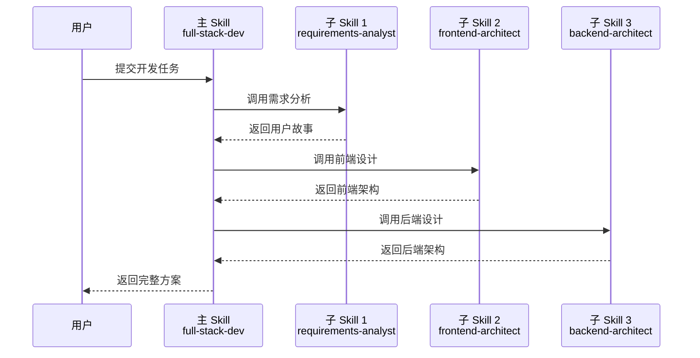
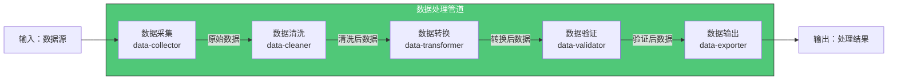
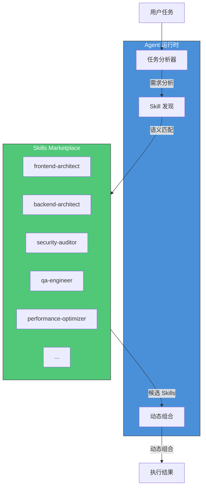
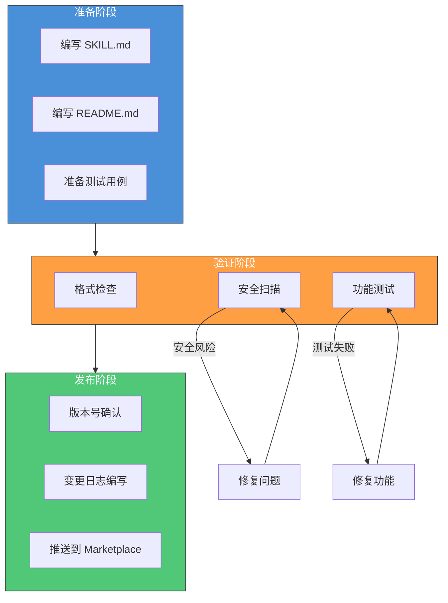

# Skill 插件化模式

> 从独立 Skill 到可组合的插件生态，理解 Skill 架构的演进路径与市场化的设计模式。

## 文章概述

单个 Skill 解决单个问题，但当团队积累了十个、几十个 Skill 后，如何组织和管理它们就成了新的挑战。Skill 插件化模式正是为了解决规模化的问题——将 Skill 视为可插拔的组件，通过标准化的接口和依赖管理，让 Skill 之间能够灵活组合、按需加载。

本文从 Skill 架构的三个演进阶段（独立 Skill、组合 Skill、Skill 市场）讲起，分析编排模式、管道模式和集市模式三种组合方式，并介绍 Skills Marketplace 的发布和发现机制。读完本文后，读者应该能够从"写 Skill"升级到"设计 Skill 体系"——以组件化的思维构建团队的 Skill 生态。

> **⏱ 时间有限？先读这些：** Skill 架构的演进三阶段 → 组合 Skill 的三种协作模式 → Skills Marketplace 发布与管理 → 插件化设计原则

## Skill 架构的演进三阶段

### 阶段一：独立 Skill

独立 Skill 是最基础的形态，一个 Skill 封装一个领域的知识和方法论。从后端架构师视角，这类似于**微服务架构中的单一服务**——职责单一、边界清晰、独立部署。

**特征**：

| 特征 | 说明 | 后端类比 |
|------|------|----------|
| 单一职责 | 只解决一个领域问题 | 单一职责微服务 |
| 自包含 | 不依赖其他 Skill | 无外部服务依赖 |
| 独立版本 | 有独立的版本号 | 独立部署单元 |
| 独立测试 | 可单独验证功能 | 单元测试覆盖 |

**典型示例**：

```markdown:examples/skills/deep-research/SKILL.md
---
name: deep-research
description: |
  用于需要网络研究的任何问题。
  提供：系统化的多角度研究方法论。
  适用：当用户询问"什么是 X"、"比较 X 和 Y"。
allowed-tools: [websearch, webfetch, read, grep]
---

# Deep Research Skill

## 研究方法论

1. 问题分解：将复杂问题拆分为子问题
2. 多源验证：从多个来源验证信息
3. 结构化输出：生成有组织的研究报告
```

**适用场景**：

- 团队 Skill 建设初期，积累基础能力
- 领域边界清晰、不需要跨领域协作的任务
- 快速验证某个方法论的价值

### 阶段二：组合 Skill

随着 Skill 数量增长，单一 Skill 无法满足复杂任务需求。组合 Skill 通过编排多个子 Skill 协作，实现更强大的能力。这类似于**微服务编排**——通过 API 编排多个服务完成复杂业务流程。

**特征**：

| 特征 | 说明 | 后端类比 |
|------|------|----------|
| 依赖声明 | 声明对其他 Skill 的依赖 | 服务依赖声明 |
| 编排能力 | 协调多个 Skill 的执行顺序 | 工作流编排引擎 |
| 接口契约 | 定义输入输出格式 | API 契约设计 |
| 版本约束 | 声明依赖版本范围 | 语义化版本约束 |

**演进路径**：



**组合示例**：

```yaml:examples/skills/skill-example.yaml
---
name: full-stack-dev
description: |
  全栈开发 Skill，协调前端和后端开发流程。
  提供：需求分析 → 架构设计 → 代码实现 → 测试验证的完整流程。
  适用：端到端功能开发、技术方案落地。
dependencies:
  - name: frontend-architect
    version: ">=1.0.0"
  - name: backend-architect
    version: ">=1.0.0"
  - name: qa-engineer
    version: ">=1.0.0"
allowed-tools: [read, edit, glob, grep, bash]
---

# Full Stack Dev Skill

## 开发流程编排

你是一位全栈开发专家，负责协调前端和后端开发流程。

### 执行顺序

1. **需求分析阶段**
   - 调用 `requirements-analyst` Skill 分析需求
   - 输出：用户故事和验收标准

2. **架构设计阶段**
   - 调用 `frontend-architect` 设计前端架构
   - 调用 `backend-architect` 设计后端架构
   - 输出：架构设计文档和接口契约

3. **实现阶段**
   - 按架构设计实现代码
   - 前后端并行开发

4. **验证阶段**
   - 调用 `qa-engineer` Skill 执行测试
   - 输出：测试报告

## 接口契约

### 输入

- 功能需求描述
- 技术栈约束（可选）

### 输出

- 架构设计文档
- 实现代码
- 测试报告
```

> ⚠️ `dependencies`（或 `pipeline`）是 oh-my-openagent 扩展字段，OpenCode 原生 SKILL.md 不识别。

### 阶段三：Skills Marketplace

当 Skill 数量达到一定规模，团队间共享和复用成为刚需。Skills Marketplace 提供了 Skill 的发布、发现、版本管理和协作平台。这类似于**容器镜像仓库**（Docker Hub）或**包管理平台**（npm、PyPI）。

**特征**：

| 特征 | 说明 | 后端类比 |
|------|------|----------|
| 集中托管 | 统一的 Skill 存储和分发 | 镜像仓库 |
| 版本管理 | 完整的版本历史和回滚 | 镜像标签 |
| 评分机制 | 用户评分和评论 | 包评分系统 |
| 安全扫描 | 自动安全检查 | 镜像安全扫描 |
| 私有市场 | 企业内部 Skill 市场 | 私有镜像仓库 |

**生态架构**：



**网络效应**：

Skills Marketplace 的价值随参与者增加而增长：

| 参与者 | 贡献 | 获益 |
|--------|------|------|
| Skill 作者 | 发布高质量 Skill | 影响力、反馈、改进建议 |
| Skill 使用者 | 使用、评分、反馈 | 快速获取能力、减少重复开发 |
| 企业团队 | 发布私有 Skill | 团队知识沉淀、新人培训 |

## 组合 Skill 的三种协作模式

### 编排模式（Orchestration）

编排模式由一个主 Skill 负责调度多个子 Skill，定义执行顺序和数据流转。这类似于**后端的编排引擎**（如 Apache Airflow、Temporal）——由一个中心协调器控制整个工作流。

**架构特点**：



**适用场景**：

- 复杂工作流，需要严格的执行顺序
- 需要统一入口和出口的任务
- 子 Skill 之间有数据依赖关系

**配置示例**：

```markdown:examples/skills/release-workflow/SKILL.md
---
name: release-workflow
description: |
  软件发布工作流 Skill。
  提供：代码审查 → 测试 → 版本管理 → 发布的完整流程。
  适用：版本发布、部署流程编排。
dependencies:
  - name: requesting-code-review
    version: ">=1.0.0"
  - name: qa-engineer
    version: ">=1.0.0"
  - name: version-manager
    version: ">=1.0.0"
---

# Release Workflow Skill

## 发布流程编排

你是一位发布工程师，负责协调软件发布流程。

### 执行阶段

#### 阶段 1：代码审查

调用 `requesting-code-review` Skill：
- 输入：待发布的代码分支
- 输出：审查报告
- 门禁：所有阻塞问题必须修复

#### 阶段 2：测试验证

调用 `qa-engineer` Skill：
- 输入：审查通过的代码
- 输出：测试报告
- 门禁：测试覆盖率 ≥ 80%，无阻塞性缺陷

#### 阶段 3：版本管理

调用 `version-manager` Skill：
- 输入：测试通过的代码
- 输出：版本号、变更日志
- 门禁：版本号符合语义化规范

#### 阶段 4：发布执行

- 创建 Git Tag
- 构建发布包
- 部署到生产环境

### 错误处理

任何阶段失败时：
1. 记录失败原因
2. 回滚已执行的操作
3. 通知相关人员
4. 生成失败报告

## 门禁配置

| 阶段 | 门禁条件 | 失败动作 |
|------|----------|----------|
| 代码审查 | 无阻塞性问题 | 阻止继续 |
| 测试验证 | 覆盖率 ≥ 80% | 阻止继续 |
| 版本管理 | 版本号有效 | 阻止继续 |
```

> ⚠️ `dependencies`（或 `pipeline`）是 oh-my-openagent 扩展字段，OpenCode 原生 SKILL.md 不识别。

### 管道模式（Pipeline）

管道模式将多个 Skill 串联成处理链路，每个 Skill 处理一部分工作，输出传递给下一个 Skill。这类似于**后端的数据处理管道**（如 ETL 流程）——数据流经多个处理节点，每个节点完成特定转换。

**架构特点**：



**适用场景**：

- 数据加工场景，每个阶段处理一部分
- 输出格式标准化，便于后续处理
- 可插拔的处理节点

**配置示例**：

```markdown:examples/skills/data-pipeline/SKILL.md
---
name: data-pipeline
description: |
  数据处理管道 Skill。
  提供：采集 → 清洗 → 转换 → 验证 → 输出的完整流程。
  适用：ETL 任务、数据迁移、报表生成。
pipeline:
  - stage: collect
    skill: data-collector
    input: source_config
    output: raw_data
  - stage: clean
    skill: data-cleaner
    input: raw_data
    output: cleaned_data
  - stage: transform
    skill: data-transformer
    input: cleaned_data
    output: transformed_data
  - stage: validate
    skill: data-validator
    input: transformed_data
    output: validated_data
  - stage: export
    skill: data-exporter
    input: validated_data
    output: final_result
---

# Data Pipeline Skill

## 管道配置

你是一位数据工程师，负责执行数据处理管道。

### 管道阶段

每个阶段的输入输出格式：

```json:terminal
{
  "stage": "collect",
  "input": {
    "source_type": "database",
    "connection_string": "{env:DB_URL}",
    "query": "SELECT * FROM users"
  },
  "output": {
    "format": "json",
    "records": 1000,
    "schema": ["id", "name", "email", "created_at"]
  }
}
```markdown:terminal

### 数据流转

| 阶段 | 输入格式 | 输出格式 | 处理逻辑 |
|------|----------|----------|----------|
| collect | 数据源配置 | JSON 数组 | 从数据源读取数据 |
| clean | JSON 数组 | JSON 数组 | 去重、填充缺失值 |
| transform | JSON 数组 | JSON 数组 | 字段映射、格式转换 |
| validate | JSON 数组 | JSON 数组 | 数据校验、异常过滤 |
| export | JSON 数组 | 文件/数据库 | 写入目标位置 |

### 错误处理

管道支持两种错误处理策略：

1. **快速失败（Fail Fast）**：任何阶段失败，立即终止管道
2. **容错继续（Continue on Error）**：记录错误，继续执行后续阶段

```yaml:examples/skills/skill-example.yaml
error_handling: fail_fast  # 或 continue_on_error
```markdown:terminal

## 性能优化

- 并行执行无依赖的阶段
- 流式处理大数据集
- 缓存中间结果
```

> ⚠️ `dependencies`（或 `pipeline`）是 oh-my-openagent 扩展字段，OpenCode 原生 SKILL.md 不识别。

### 集市模式（Marketplace）

集市模式不预先定义固定的组合方式，而是根据任务需求动态选择合适的 Skill 组合。这类似于**微服务的服务发现机制**——运行时根据需求发现和调用服务。

**架构特点**：



**适用场景**：

- 开放生态，Skill 来源多样
- 任务类型不确定，需要灵活组合
- 社区驱动的 Skill 发现

**动态选择机制**：

```markdown:examples/skills/adaptive-assistant/SKILL.md
---
name: adaptive-assistant
description: |
  自适应助手 Skill，根据任务类型动态选择合适的子 Skill。
  提供：智能任务分析和 Skill 组合。
  适用：不确定类型的任务、探索性任务。
selection_strategy:
  mode: semantic_match
  min_score: 0.7
  max_skills: 3
  priority:
    - security-auditor  # 安全相关优先
    - performance-optimizer  # 性能相关次优先
---

# Adaptive Assistant Skill

## 动态选择逻辑

你是一位智能助手，根据任务特征动态选择合适的 Skill 组合。

### 任务分类

| 任务特征 | 推荐 Skill 组合 |
|----------|-----------------|
| 包含"安全"、"漏洞"、"攻击" | security-auditor + penetration-tester |
| 包含"性能"、"优化"、"慢" | performance-optimizer + backend-architect |
| 包含"架构"、"设计"、"重构" | architecture-consultant + frontend-architect |
| 包含"测试"、"质量"、"验证" | qa-engineer + requesting-code-review |

### 选择策略

1. **语义匹配**：分析任务描述，匹配 Skill 的 description
2. **评分排序**：按匹配度评分，选择 Top-N
3. **优先级覆盖**：确保关键领域 Skill 被优先考虑
4. **冲突消解**：多个 Skill 匹配时，按优先级和评分综合决定

### 组合执行

选中的 Skill 按以下方式协作：

- 无依赖关系：并行执行
- 有依赖关系：按依赖顺序执行
- 结果冲突：以高评分 Skill 为准
```

### 三种模式对比

| 维度 | 编排模式 | 管道模式 | 集市模式 |
|------|----------|----------|----------|
| **执行顺序** | 预定义 | 预定义 | 动态决定 |
| **Skill 选择** | 固定 | 固定 | 运行时发现 |
| **适用场景** | 复杂工作流 | 数据处理 | 开放生态 |
| **灵活性** | 低 | 中 | 高 |
| **可预测性** | 高 | 高 | 低 |
| **后端类比** | 工作流引擎 | ETL 管道 | 服务发现 |

## Skills Marketplace 发布与管理

> ⚠️ **前瞻性说明**：Skills Marketplace 是 OpenCode 生态的远景规划功能。下文描述的 CLI 发布命令、Enterprise Marketplace YAML 配置、依赖锁定文件（`skill-lock.yaml`）以及版本管理的自动化流程属于前瞻性设计，尚未在 OpenCode 当前版本中完整实现。本节内容反映了社区对 Skill 市场化的期望方向，供读者参考。

### 发布流程

将 Skill 发布到 Skills Marketplace 需要经过以下步骤：



**发布清单**：

| 检查项 | 说明 | 通过标准 |
|--------|------|----------|
| frontmatter 完整 | 所有必填字段已填写 | name, description 存在 |
| description 质量 | 描述清晰，包含触发条件 | 50-200 字符 |
| allowed-tools 合理 | 遵循最小权限原则 | 无过度权限 |
| 安全扫描通过 | 无硬编码凭证、无危险操作 | 安全扫描报告通过 |
| 测试覆盖 | 核心功能有测试用例 | 测试通过率 100% |
| 版本号有效 | 遵循语义化版本 | 符合 SemVer 规范 |
| 变更日志 | 记录本次更新内容 | CHANGELOG.md 更新 |

### 版本管理

Skills Marketplace 使用语义化版本（SemVer）管理 Skill 版本：

**版本号格式**：`MAJOR.MINOR.PATCH`

| 版本类型 | 变更内容 | 示例 |
|----------|----------|------|
| **MAJOR** | 不兼容的 API 变更 | 1.0.0 → 2.0.0 |
| **MINOR** | 向后兼容的功能新增 | 1.0.0 → 1.1.0 |
| **PATCH** | 向后兼容的问题修复 | 1.0.0 → 1.0.1 |

**依赖版本约束**：

```yaml:examples/skills/skill-example.yaml
dependencies:
  - name: frontend-architect
    version: ">=1.0.0 <2.0.0"  # 允许 1.x 的任何版本
  - name: backend-architect
    version: "^1.2.3"  # 允许 >=1.2.3 <2.0.0
  - name: qa-engineer
    version: "~1.2.0"  # 允许 >=1.2.0 <1.3.0
  - name: security-auditor
    version: "1.5.0"  # 精确版本
```

### 评分与发现机制

Skills Marketplace 提供多维度的评分和发现机制：

**评分维度**：

| 维度 | 权重 | 评分标准 |
|------|------|----------|
| 功能完整性 | 30% | 是否完成声明的能力 |
| 文档质量 | 20% | README、注释、示例 |
| 测试覆盖 | 20% | 测试用例数量和覆盖率 |
| 安全合规 | 15% | 安全扫描结果 |
| 社区反馈 | 15% | 用户评分和评论 |

**发现机制**：

1. **分类浏览**：按领域分类（前端、后端、安全、测试等）
2. **关键词搜索**：基于 description 和 tags 的语义搜索
3. **推荐算法**：基于用户历史和相似 Skill 推荐
4. **热门榜单**：下载量、评分、趋势榜单

### 企业私有 Skill 市场

企业可以搭建私有的 Skills Marketplace，用于团队内部 Skill 的共享和管理：

**部署方案**：

> ⚠️ 以下企业私有 Skill 市场方案是前瞻性概念设计，并非 OpenCode 或 OMO 的现有功能。实际搭建此类系统需要完整的后端基础设施（云存储、身份认证、审批工作流等）。

```yaml:examples/skills/enterprise-marketplace.yaml
# enterprise-marketplace.yaml
marketplace:
  type: private
  storage:
    type: s3
    bucket: company-skills-marketplace
  auth:
    type: oauth2
    provider: internal-sso
  policies:
    max_skill_size: 10MB
    allowed_licenses:
      - MIT
      - Apache-2.0
      - Proprietary
    security_scan: required
    approval_workflow: true
```

**管理功能**：

| 功能 | 说明 |
|------|------|
| 权限控制 | 基于角色的访问控制（RBAC） |
| 审批流程 | Skill 发布需要审批 |
| 使用统计 | Skill 使用情况分析 |
| 合规审计 | Skill 调用日志记录 |

## 插件化设计原则

### 接口契约标准化

Skill 作为可插拔组件，必须定义清晰的接口契约：

**输入契约**：

```yaml:examples/skills/skill-example.yaml
input_schema:
  type: object
  properties:
    task_description:
      type: string
      description: 任务描述
    constraints:
      type: object
      description: 约束条件
      properties:
        tech_stack:
          type: array
          items:
            type: string
        deadline:
          type: string
          format: date
  required:
    - task_description
```

**输出契约**：

```yaml:examples/skills/skill-example.yaml
output_schema:
  type: object
  properties:
    status:
      type: string
      enum: [success, failure, partial]
    artifacts:
      type: array
      items:
        type: object
        properties:
          type:
            type: string
          path:
            type: string
    report:
      type: string
  required:
    - status
```

### 版本兼容性

遵循语义化版本的同时，需要考虑 Skill 之间的兼容性：

**兼容性矩阵**：

| 变更类型 | 主 Skill 版本 | 依赖 Skill 版本 | 兼容性 |
|----------|---------------|-----------------|--------|
| 新增可选参数 | MINOR | 不变 | ✅ 兼容 |
| 删除参数 | MAJOR | 不变 | ❌ 不兼容 |
| 修改输出格式 | MAJOR | 不变 | ❌ 不兼容 |
| 依赖版本升级 | PATCH/MINOR | MAJOR | ⚠️ 需验证 |

**兼容性声明**：

```yaml:examples/skills/skill-example.yaml
---
name: full-stack-dev
version: "2.0.0"
compatibility:
  min_opencode_version: "2.0.0"
  dependencies:
    - name: frontend-architect
      version: ">=2.0.0 <3.0.0"
      compatibility_notes: "2.0 重构了输出格式"
    - name: backend-architect
      version: ">=1.5.0 <2.0.0"
---
```

### 依赖管理

Skill 的依赖管理需要解决以下问题：

**依赖解析**：

```text:terminal
full-stack-dev@2.0.0
├── frontend-architect@2.1.0
│   └── ui-designer@1.0.0
├── backend-architect@1.8.0
│   ├── database-designer@1.2.0
│   └── api-designer@1.1.0
└── qa-engineer@1.5.0
```

**冲突解决**：

| 冲突类型 | 解决策略 |
|----------|----------|
| 版本冲突 | 选择兼容的最高版本 |
| 循环依赖 | 禁止，发布时检查 |
| 缺失依赖 | 发布时警告，安装时失败 |

**依赖锁定**：

```yaml:examples/skills/skill-lock.yaml
# skill-lock.yaml
lock_version: 1
skills:
  - name: full-stack-dev
    version: 2.0.0
    checksum: sha256:abc123...
  - name: frontend-architect
    version: 2.1.0
    checksum: sha256:def456...
  - name: backend-architect
    version: 1.8.0
    checksum: sha256:ghi789...
```

## 小结

Skill 插件化模式是 OpenCode 生态从"工具"演进为"平台"的关键一步。通过标准化的接口契约、灵活的组合模式和完善的 Marketplace 机制，Skill 实现了从独立单元到可组合生态的跨越。

理解 Skill 插件化的关键要点：

1. **演进路径**：独立 Skill → 组合 Skill → Skills Marketplace，每一步解决不同规模的问题
2. **组合模式**：编排模式适合工作流、管道模式适合数据处理、集市模式适合开放生态
3. **接口契约**：标准化的输入输出定义是 Skill 可组合的基础
4. **版本管理**：语义化版本和依赖约束确保 Skill 生态的稳定性
5. **Marketplace 价值**：网络效应让 Skill 越用越好，生态越来越丰富

在下一章 [案例：团队级 Skill 市场](../07-case-studies/case-skills-marketplace.md) 中，我们将看到一个真实的企业 Skill 市场是如何落地和运营的。

---

## 学习检查清单

完成本章学习后，请确认你能够：

- [ ] 描述 Skill 演进的三个阶段及其特征
- [ ] 区分编排模式、管道模式、集市模式的适用场景
- [ ] 编写组合 Skill 的依赖声明和版本约束
- [ ] 说明 Skills Marketplace 的发布流程和评分机制
- [ ] 应用接口契约标准化原则设计 Skill 接口

---

## 关联章节

- ← [Skill-MCP 桥接](skill-mcp-bridge.md)（桥接为插件化提供工具层基础）
- → [案例：团队级 Skill 市场](../07-case-studies/case-skills-marketplace.md)（企业级 Skill 市场的真实落地）
- ← [Skill 系统](../02-core-concepts/skills-system.md)（Skill 作为可组合组件的基础抽象）
